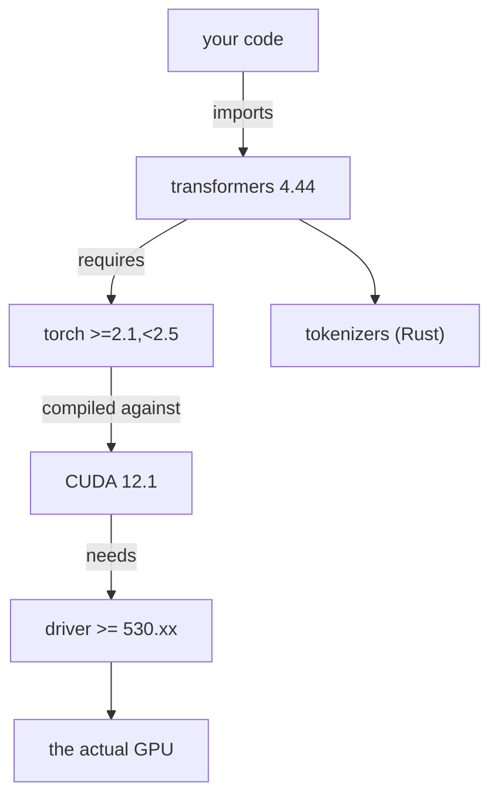

# Lecture 1: Reproducible AI Environments & the uv Toolchain

> Every AI project you will ever debug starts with one question you must be able to answer instantly: *"Is my environment the same as the one that produced this result?"* If the answer is "I think so," you are already losing. This lecture exists because AI dependency graphs are uniquely brutal — a single `torch` upgrade can silently change your model's outputs or refuse to load your GPU — and because the tooling to tame this got dramatically better in 2025. After this lecture you will be able to stand up a fully reproducible Python/AI project with `uv`, explain exactly what a lockfile guarantees that a `requirements.txt` does not, manage secrets so no key ever touches git, and articulate why reproducibility is a *continuous-integration* problem, not a personal-hygiene one.

**Prerequisites:** comfortable with Python, `pip`, and a terminal; Git basics (clone/branch/commit) · **Reading time:** ~22 min · **Part of:** Phase 0 Week 1

---

## The core idea (plain language)

Software "works on my machine" because your machine is a specific, invisible pile of decisions: which Python, which package versions, which system libraries, which environment variables. **Reproducibility is the discipline of making that pile explicit, versioned, and rebuildable by a stranger (or a CI runner, or future-you) in one command.**

In ordinary web/backend work you can usually get away with sloppiness here. In AI you cannot, for one reason: the dependency graph under a model is enormous, tightly version-coupled, and reaches all the way down into your GPU driver. `transformers` pins ranges of `torch`; `torch` is compiled against a specific CUDA version; CUDA must match your driver; `flash-attn` must match all three. Get one wrong and you don't get a clean error — you get a 3 GB download that imports fine and then produces subtly different logits, or an `CUDA error: no kernel image is available for execution on the device` at 2 a.m.

The 2025 answer to all of this is **`uv`**: a single, extremely fast tool (written in Rust by Astral, the Ruff people) that replaces `pip`, `venv`, `virtualenv`, `pipenv`, `pyenv`, and much of `poetry`. It gives you a *project* with a `pyproject.toml` (what you asked for) and a `uv.lock` (exactly what you got, resolved and hashed), and a one-command way to reconstruct that exact environment anywhere: `uv sync`. That lockfile — committed to git — is the difference between "works on my machine" and "works."

## How it actually works (mechanism, from first principles)

### Why dependency hell is *worse* in AI

Every package manager solves a constraint problem: given the versions you asked for and the ranges *they* each require, find one assignment of versions that satisfies everyone. This is called **dependency resolution**, and it can blow up combinatorially. In AI the blow-up is worse for three compounding reasons:

1. **The graph is deep and heavy.** A trivial `uv add transformers` pulls `torch`, `numpy`, `tokenizers`, `safetensors`, `huggingface-hub`, `regex`, `pyyaml`, and dozens more. A working install is easily 4–8 GB on disk. Re-resolving or re-downloading this by hand is minutes-to-hours of your life.

2. **It escapes Python.** `torch==2.4.0+cu121` is not one thing — the `+cu121` is a *build variant* compiled against CUDA 12.1. Your Python package must agree with the C++/CUDA runtime, which must agree with your NVIDIA driver, which lives outside pip's world entirely. This is the "version matrix":


Any single link mismatched = broken, and often *silently* broken.

3. **The versions actually change behavior.** In web dev, `requests 2.31` vs `2.32` almost never changes your output. In AI, a `torch` minor bump can change default matmul precision, an attention kernel, or RNG behavior — so the *same code and same weights* produce *different numbers*. Reproducibility here isn't pedantry; it's the only way to know whether a change in output came from your change or from your toolchain drifting under you.

### What a lockfile guarantees vs `requirements.txt`

A `requirements.txt` is usually a **wishlist**: `transformers>=4.40`. When you `pip install -r`, pip re-resolves *today*, against *today's* PyPI, and picks whatever satisfies the constraints *now*. Two engineers running the identical file a week apart can get different versions. Even a "pinned" `requirements.txt` (`transformers==4.44.2`) usually pins only your *direct* dependencies — the transitive ones float, and there are no integrity hashes.

A **lockfile** (`uv.lock`) is a *receipt*. It records the complete, resolved graph — every direct and transitive package, its exact version, and a cryptographic hash of each artifact — for a set of platforms. It answers "what *exactly* did I install," not "what am I willing to accept." Concretely, a lockfile gives you three guarantees a bare `requirements.txt` does not:

| Property | `requirements.txt` (typical) | `uv.lock` |
|---|---|---|
| Direct deps pinned | sometimes | always |
| Transitive deps pinned | rarely | always (full graph) |
| Integrity hashes | no | yes (tamper/corruption detection) |
| Cross-platform resolution | no | yes (resolves for multiple OS/arch) |
| One-command exact rebuild | no | `uv sync` |

The mental split that matters: **`pyproject.toml` is intent, `uv.lock` is fact.** You edit intent by hand (or via `uv add`); you never hand-edit the lock. You commit both.

### The virtualenv mental model

A **virtual environment** is just a directory (`.venv/`) containing its own Python interpreter symlink and its own `site-packages`. When it's "activated," your shell's `PATH` is prepended so `python` and installed packages resolve *inside* that folder instead of system-wide. That's the whole trick — isolation by `PATH` manipulation. It means Project A can have `torch 2.2` and Project B `torch 2.4` without a fight, because they never share a `site-packages`.

```
~/projects/
  proj-a/.venv/  ← torch 2.2, transformers 4.40   (isolated)
  proj-b/.venv/  ← torch 2.4, transformers 4.44   (isolated)
system python    ← keep it clean; never `sudo pip install`
```

`uv` manages the `.venv` for you. `uv sync` creates it if missing and makes its contents *exactly* match `uv.lock`. `uv run <cmd>` executes inside it without you manually `source .venv/bin/activate`-ing — which is why the spine's labs write `uv run pytest` and `uv run jupyter execute`. The `.venv/` itself is never committed; it's rebuildable from the lock.

### `uv sync`: the reconstruction primitive

`uv sync` reads `uv.lock` and makes the `.venv` an exact mirror of it — installing what's missing **and removing what shouldn't be there**. That last part matters: after `uv sync`, a package you manually `pip install`-ed but never added to the project is *gone*. This is the property that kills environment drift. If the lock says 214 packages at specific versions, the venv is those 214 packages, no more, no less.

## Worked example

Here is the end-to-end flow the Week 1 lab has you run, annotated with what each command does mechanically.

```bash
# 1. Install uv itself (one static binary, no Python needed to bootstrap)
#    macOS/Linux:
curl -LsSf https://astral.sh/uv/install.sh | sh
#    Windows: use the PowerShell installer shown on the uv docs page

# 2. Create a project. This writes pyproject.toml + .python-version,
#    and a src/ layout. NO packages installed yet.
uv init ai-foundations && cd ai-foundations

# 3. Add runtime deps. Each `uv add` RE-RESOLVES the whole graph,
#    updates pyproject.toml (intent) AND uv.lock (fact), and syncs the venv.
uv add numpy pandas scikit-learn jupyterlab python-dotenv tiktoken

# 4. Dev-only deps live in a separate group — not installed in prod.
uv add --dev pytest nbconvert

# 5. Commit BOTH pyproject.toml and uv.lock. This is the reproducibility contract.
git init && git add -A && git commit -m "chore: uv project scaffold"
```

Now the payoff. A teammate — or CI — clones and rebuilds the *exact* environment:

```bash
git clone <repo> && cd ai-foundations
uv sync            # reads uv.lock, builds .venv to match it EXACTLY
uv run pytest -q   # runs tests inside that venv, no activation dance
```

**Numbers that make the "why uv" concrete (all approximate, order-of-magnitude rules of thumb):**

- Cold-resolving and installing a torch-class AI stack with classic `pip` can take **several minutes**; `uv`, with its Rust resolver and a global content-addressed cache, routinely does the same work in **single-digit seconds to tens of seconds**. Astral advertises 10–100× speedups over pip-based flows; the exact multiple depends on cache state, but the felt difference in a CI loop is dramatic.
- `uv`'s cache is **shared across projects** via hardlinks/reflinks. Ten projects that each depend on the same `torch` wheel do not store ten copies. On a laptop where a single torch install is ~2–3 GB unpacked, this saves real disk.
- The first `uv sync` on a fresh machine downloads; every subsequent one on that machine is mostly hardlinks from cache — often **sub-second** for an unchanged lock.

### Reading a lock entry

You never edit it, but you should be able to read it. Conceptually each package is an entry like:

```toml
[[package]]
name = "numpy"
version = "2.1.1"
source = { registry = "https://pypi.org/simple" }
wheels = [
  { url = "...numpy-2.1.1-cp312-cp312-manylinux...whl", hash = "sha256:ab12..." },
]
```

The `hash` is the integrity guarantee: `uv sync` verifies the downloaded bytes match, so a corrupted mirror or a tampered artifact fails loudly instead of silently installing something else.

## How it shows up in production

- **CI is where reproducibility is enforced, not your laptop.** The Phase 0 Definition of Done is exact: *fresh `git clone` → `uv sync` → `uv run pytest -q` passes green, `uv.lock` committed.* A green CI on a clean runner is a *proof* that a stranger can rebuild your environment. If tests pass locally but the CI runner (no cache, clean OS) fails, you have an un-pinned dependency or a system assumption — CI caught the drift you couldn't see. This is why reproducibility is a CI concern: the clean runner is the honest stranger.

- **The "it regressed and nothing changed" incident.** A model eval score drops 2 points overnight. Your code diff is empty. The cause is almost always a floated dependency: a nightly rebuild re-resolved `torch` or `transformers` to a new patch that changed a default. With a committed `uv.lock`, this simply cannot happen unattended — versions only move when *you* run `uv lock --upgrade` and commit the diff, which shows up in code review as an auditable change.

- **Reproducing a bug report.** A user hits an error on your released model harness. If you tagged the release with its `uv.lock`, you `git checkout <tag> && uv sync` and you are *byte-for-byte* in their dependency world. Without the lock, you're guessing at versions while the bug hides in the gap.

- **Cost and latency of the dev loop.** CI minutes are money and, more importantly, feedback latency. A pip-based AI CI job that re-resolves and downloads torch every run can burn several minutes per push; a `uv sync` with a warm cache cuts that to seconds. Multiply by every push by every engineer and it's a real line item — and a real morale item.

- **Secrets leaking into the model pipeline.** AI apps fan out to many paid APIs (OpenAI, Anthropic, HF Hub tokens, vector DB keys). Each is a live billing credential. The blast radius of a leaked key is *your invoice* and *your data*. This is why the secrets discipline below is non-negotiable in this domain specifically.

### Secrets: env, `.env`, and the 12-factor principle

The **Twelve-Factor App** principle *"Store config in the environment"* says: anything that varies between deploys — credentials, endpoints, feature flags — lives in **environment variables**, not in code. Code is identical across dev/staging/prod; only the environment differs. The engineering payoff: you can open-source the code, you can rotate a key without a redeploy of source, and you never accidentally ship prod credentials in a repo.

The workflow the lab uses:

- `.env` — a local file of `KEY=value` lines. **Never committed.** Add it to `.gitignore`.
- `.env.example` — a *committed* template with the keys but empty values (`OPENAI_API_KEY=`), so a new dev knows what to fill in.
- `python-dotenv` loads `.env` into the process environment at startup; your code reads `os.environ["OPENAI_API_KEY"]` and raises a clear error if missing — **never hardcodes, never prints the value.**

```
repo/
  .env          ← real keys, GITIGNORED, stays on your machine
  .env.example  ← committed template, empty values
  .gitignore    ← contains: .env  .venv/  data/  *.ipynb_checkpoints
```

### Why keys in git history are forever

Git stores *history*, not just the current tree. If you commit a key, then "fix" it by deleting the line and committing again, **the key still lives in the earlier commit object** — reachable by `git log -p`, by any clone, by every fork, and by GitHub's cached views and any scraper that already indexed your push within seconds of it going public. Deleting the file does nothing; the object is content-addressed and immutable. To truly remove it you must rewrite history (`git filter-repo` / BFG) *and* force-push *and* invalidate every existing clone — and even then you must assume it's compromised.

So the only correct response to a leaked key is: **rotate it immediately** (revoke at the provider, issue a new one). Treat any key that ever touched a commit as burned. The spine's pitfall says exactly this: "Committing `.env` or pasting a key into a notebook cell — rotate the key immediately if you do; git history is forever." Automated scanners crawl public pushes within seconds, so "I deleted it right away" is not a defense.

## Common misconceptions & failure modes

- **"A pinned `requirements.txt` is basically a lockfile."** No. Pinning direct deps still floats the transitive graph and has no hashes and no cross-platform resolution. The transitive floats are exactly where AI breakage lives (a `tokenizers` or `numpy` bump).

- **"I'll just `pip install` this one extra package real quick."** Inside a `uv` project this creates drift: the package is in your venv but not in `uv.lock`, so it vanishes on the next `uv sync` and never existed for your teammates. Use `uv add`.

- **"`uv sync` and `uv lock` are the same."** `uv lock` re-resolves and *rewrites the lockfile* (versions can move). `uv sync` makes the venv match the *existing* lock (versions do not move). In CI you sync; you lock deliberately when upgrading.

- **"Committing the `.venv` folder guarantees reproducibility."** The opposite — it's large, platform-specific, and often broken on another OS/arch. Commit the *lock*, gitignore the venv.

- **"Deleting the committed key fixes the leak."** Covered above — history is immutable. Rotate.

- **"Temperature-0 / same-code means same numbers, so who cares about torch versions."** Even at temp 0, a different `torch`/CUDA build can change matmul precision or attention kernels and shift logits. The lock is what keeps the *math* stable, not just the API surface.

- **`uv` vs `conda` for CUDA.** `conda` historically shipped its own CUDA toolkit binaries, which some teams still want. `uv` installs PyPI wheels of `torch` that bundle the needed CUDA runtime, selecting the build variant via an index/extra. For the vast majority of 2025 AI work, the `uv` + PyPI-torch path is faster and fully reproducible; reach for conda only when you have a hard non-Python native-lib requirement it uniquely solves.

## Rules of thumb / cheat sheet

- **`uv` is the 2025 default.** It replaces `pip` + `venv` + `virtualenv` + `pipenv` + `pyenv` and most of `poetry`. New AI project → `uv init`.
- **Commit `pyproject.toml` AND `uv.lock`. Gitignore `.venv/`.** Intent + fact are versioned; the rebuildable artifact is not.
- **`uv add <pkg>`**, never `pip install`, inside a project. Dev-only tools → `uv add --dev`.
- **`uv sync` = reconstruct exactly** (adds missing, removes extras). **`uv lock` = re-resolve/upgrade** (moves versions, review the diff). **`uv run <cmd>` = run inside the venv** without activating.
- **Two workflows:** *project* (`pyproject.toml` + `uv.lock`, for real apps/libs) vs *script* (a single file with inline `# /// script` deps run via `uv run script.py`, for one-off tools).
- **Secrets:** `.env` (gitignored, real) + `.env.example` (committed, empty) + `python-dotenv`. Read from `os.environ`; never hardcode, never print, never log.
- **Leaked a key? Rotate it. Now.** History is forever; deletion is not remediation.
- **CI is the proof:** fresh clone → `uv sync` → tests green on a *clean* runner. That's reproducibility, verified.
- **VRAM sanity you'll reuse all phase:** 7B at fp16 ≈ 14 GB weights (params × 2 bytes) — the *kind* of number your locked, reproducible torch build must load consistently. (Full treatment in Week 3.)

## Connect to the lab

This lecture is the deep version of Week 1 Lab step 1 ("Project init with uv") and step 2 ("Secrets done right"). When you run the lab: verify `uv.lock` is committed and that a fresh `uv sync` + `uv run pytest -q` is green on a clean checkout (that's a Definition-of-Done gate). Watch specifically for two traps the spine calls out — accidentally committing `.env` (check with `git log -p | grep -i key`, which should find *only* the `.env.example` placeholder), and reaching for `pip install` mid-project instead of `uv add`, which quietly desyncs your lock.

## Going deeper (optional)

- **Astral `uv` documentation** — `docs.astral.sh/uv`. Read the *Projects* and *Locking and syncing* sections first; then *Scripts* for the single-file workflow. This is the canonical, current source.
- **The Twelve-Factor App** — `12factor.net`, factor III *"Config"* (store config in the environment). Short, foundational, still the best statement of the secrets rationale.
- **Astral blog / GitHub** — search **"astral-sh/uv"** on GitHub for the repo and README benchmarks, and **"uv Astral announcement"** for the design rationale and the pip/poetry comparison.
- **pip / venv docs** — `packaging.python.org` for the underlying model uv abstracts over; useful when you need to reason about wheels, build variants, and index URLs (e.g., the CUDA torch index).
- **Secret-scanning / history rewrite** — search **"git filter-repo remove secret"** and **"GitHub push protection secret scanning"** for the mechanics of remediation and prevention.
- **PyTorch install matrix** — `pytorch.org` "Get Started" page: the canonical torch × CUDA selector, the concrete face of the version matrix.

## Check yourself

1. What exactly does `uv.lock` guarantee that a pinned `requirements.txt` does not?
2. Your model eval score drifted overnight with an empty code diff. What's the most likely cause, and how does a committed lockfile prevent it?
3. Distinguish `uv sync` from `uv lock`. Which runs in CI, and why?
4. You committed an API key, noticed, deleted the line, and committed again. Are you safe? What must you actually do?
5. Why is "config in the environment" (12-factor) more than a style preference — what two concrete capabilities does it buy you?
6. Why is dependency hell materially worse for AI stacks than for a typical web backend? Name the mechanism that reaches outside Python.

### Answer key

1. The complete resolved graph — every *transitive* dependency pinned to an exact version, with integrity hashes and cross-platform resolution — enabling a one-command exact rebuild (`uv sync`). A pinned `requirements.txt` typically pins only direct deps, floats transitives, and has no hashes.
2. A floated dependency re-resolved to a new version (e.g., a `torch`/`transformers` patch that changed a default), shifting outputs. A committed `uv.lock` freezes the full graph, so versions only move when you deliberately `uv lock --upgrade` and commit the reviewable diff.
3. `uv sync` makes the venv match the *existing* lock exactly (adds missing, removes extras; versions don't move). `uv lock` re-resolves and can *move* versions, rewriting the lockfile. CI runs `uv sync` — it must reconstruct the known-good environment, not re-resolve.
4. No, you are not safe. Git history is immutable and content-addressed; the key still lives in the earlier commit (and any clone/fork/scraper cache). You must **rotate/revoke the key immediately** and treat it as compromised; optionally rewrite history to scrub it, but rotation is the real fix.
5. It lets identical code run unchanged across dev/staging/prod (only the environment differs), and it lets you rotate secrets or change endpoints without editing or redeploying source — and keeps credentials out of the repo entirely.
6. The graph is deep/heavy and version-coupled, versions actually change numerical behavior, and — the key mechanism — it reaches outside Python: `torch` is a build variant compiled against a specific CUDA version that must match the GPU driver, a link pip cannot see or resolve.
