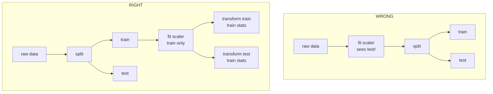

# Lecture 5: Data Leakage — The #1 Real-World Killer

> Your model scores 0.98 in the notebook and 0.61 in production. Nine times out of ten the culprit is not a subtle architecture bug — it is **leakage**: information from the future, from the label, or from the test set silently bled into training. This lecture exists because leakage invalidates *everything downstream* — every metric, every model-choice debate, every launch decision — and it does so without throwing a single error. After this lecture you will be able to name the six ways leakage happens, detect it from three independent signals, and run a prevention checklist before you trust any number.

**Prerequisites:** Lecture on train/val/test discipline; basic pandas/scikit-learn; comfort with precision/recall · **Reading time:** ~22 min · **Part of:** Phase 0 Week 1

---

## The core idea (plain language)

A supervised model is a bet: *"given only the information I will actually have at prediction time, can I predict the label?"* **Leakage is any situation where the model was trained or evaluated using information it will not have — or should not have — at that moment.**

There are two flavors, and you must hold both in your head:

1. **Train/test contamination** — information from your *evaluation* set leaks into *training*, so your test score measures memorization, not generalization. Your offline number is a lie.
2. **Target/temporal leakage** — information about the *outcome* (or from the future) leaks into your *features*, so the model learns a shortcut that will not exist in production. Both your offline number *and* the learned model are lies.

The reason leakage is the #1 real-world killer, ahead of every fancy failure mode, is its **signature**: it makes things look *better*, not worse. A bug that crashes gets fixed in an hour. A bug that hands you a 0.98 AUC gets *celebrated*, shipped, and discovered months later when the business wonders why the "97% accurate" fraud model is missing fraud. Leakage is dangerous precisely because it is pleasant.

---

## How it actually works (mechanism, from first principles)

The whole discipline reduces to one rule:

> **The only information allowed to touch training is information that (a) exists before the prediction moment and (b) is derived using only training data.**

Every leakage type is a violation of (a) or (b). Let's take them one at a time, with numbers.

### 1. Preprocessing leakage — fitting a transform on all the data before the split

This is the most common and the most innocent-looking. You standardize features (`StandardScaler`), or fit an encoder/imputer/TF-IDF vocabulary, **before** splitting into train and test.

Why is that leakage? A scaler computes `mean` and `std` over whatever data it sees. If it sees the whole dataset, those statistics are partly computed from the *test rows*. Your training pipeline now "knows" the mean of data it is not supposed to have seen.

Worked numeric feel: suppose a feature has training values `[10, 12, 11, 9]` (mean 10.5) but the test set contains an extreme `1000`. Fit the scaler on *everything* and the mean/std shift to absorb 1000; the training rows get scaled using a std that only exists *because the test set exists*. The information flow looks like this:



The fix is mechanical: **split first, `fit` on train only, then `transform` train and test with those frozen statistics.** In scikit-learn, wrap everything in a `Pipeline` and pass it to `cross_val_score` — the pipeline re-fits the scaler inside each fold automatically, which is the entire point of pipelines.

```python
# leaky
X = StandardScaler().fit_transform(X)          # sees all rows
Xtr, Xte, ytr, yte = train_test_split(X, y)

# correct
Xtr, Xte, ytr, yte = train_test_split(X, y)
pipe = make_pipeline(StandardScaler(), LogisticRegression())
pipe.fit(Xtr, ytr)                              # scaler fit on train only
pipe.score(Xte, yte)
```

The inflation from scaler leakage alone is usually small (a point or two of AUC on tabular data) — but it compounds with cross-validation, where a scaler fit once outside the CV loop leaks test-fold stats into *every* fold. The habit matters more than any single instance.

### 2. Target leakage — features that are consequences of the label

Here a feature is only known *because* the outcome already happened. The classic examples:

- Predicting loan default using `amount_recovered_by_collections` — collections only run *after* default.
- Predicting hospital readmission using `discharge_disposition = 'expired'` — you cannot readmit a deceased patient; the feature is a proxy for the outcome.
- Predicting churn using `account_closed_date` or `number_of_cancellation_calls`.

Mechanically, the model finds a near-perfect correlation and leans on it entirely. Your feature importance chart shows one dominant feature; your AUC is 0.99. In production that feature is `NULL` at prediction time (it hasn't happened yet), so the model falls back to noise.

The subtle version is **proxy leakage**: no single feature is the label, but a combination reconstructs post-outcome state. Example: an "account status" code that is set to `42` only during the fraud-review workflow. Nobody documented that. The model learns "status 42 → fraud" and looks brilliant — until it runs on live transactions where status is always `0` because review hasn't happened yet.

### 3. Temporal leakage — training on the future to predict the past

Any time your data has a time dimension and you split *randomly*, you let the model peek at the future. If you shuffle a time series and put January and March in train and February in test, the model interpolates using information that, at February's prediction moment, did not exist.

```
random split (WRONG)              temporal split (RIGHT)
Jan Feb Mar Apr May Jun           Jan Feb Mar | Apr May Jun
 T   E   T   E   T   E             ---train--- |  ---test---
(test surrounded by future)       (test strictly in the future)
```

Temporal leakage also hides inside features: a `rolling_30d_average` computed over a window that includes days *after* the prediction date; a `customer_lifetime_value` that was updated last week but joined onto a record from last year. The rule is a **point-in-time join**: every feature value must be as-of the prediction timestamp, not the latest known value.

### 4. Duplicate rows across splits

If the same (or near-identical) record appears in both train and test, the "test" score is partly a memorization score. This happens constantly with: scraped web data (the same article on three URLs), augmented data (rotate/crop an image, then split — copies of one image land on both sides), and logs where retries create duplicate events. Even *fuzzy* duplicates (same review with one word changed) leak.

Numeric intuition: if 20% of your test set are duplicates of training rows and the model memorizes perfectly, those 20% are "free" correct answers. A true accuracy of 0.75 shows up as `0.75 * 0.8 + 1.0 * 0.2 = 0.80`. Small enough to miss, big enough to change a launch decision.

### 5. Group leakage — the same entity on both sides

The most expensive mistake in real ML, because it looks like clean splitting. You split rows randomly, but multiple rows belong to the same **entity** — the same patient, user, device, company, or document. The model learns entity-specific quirks from the training rows and recognizes the entity in the test rows.

Medical imaging is the textbook case: 10,000 scans from 1,000 patients, 10 scans each. Random row split puts *the same patient* in train and test. The model learns "this rib shape = this patient = this label" and reports 0.95 AUC. Deploy it on genuinely new patients and it collapses to 0.70, because it was scoring patient recognition, not disease detection.

The fix is `GroupKFold` / `GroupShuffleSplit`: split on the *group key* so every patient (or user, or company) is entirely on one side. Ask yourself: **"What is the unit I will be generalizing to in production?"** That unit — not the row — is what must be held out.

### 6. Leakage in LLM evaluation (contamination)

The LLM-era version, and it comes in two forms:

- **Benchmark contamination.** The model's pretraining crawl already contains the test set (MMLU, GSM8K, HumanEval, etc. are all over GitHub and the web). The model isn't reasoning — it partially *remembers the answers*. This is why a new model can post a stellar public-benchmark number and then underperform on your private eval. Public benchmark scores in 2025–2026 should be treated as *upper bounds contaminated by unknown amounts of memorization*.
- **Your own train/test contamination when fine-tuning or building a few-shot/RAG eval.** If your few-shot examples, your fine-tune set, or your retrieval corpus overlaps with your eval questions, you are grading an open-book exam and calling it closed-book. Deduplicate your eval set against everything the model was shown.

The mechanism is identical to duplicate-row leakage — the "test" answer was visible during "training" — it's just that "training" now means "a trillion-token web crawl you don't control." The defensive move is a **private, freshly-authored holdout** the model provably has never seen, plus checking for verbatim overlap (n-gram match) between eval items and any training/context data you *do* control.

---

## Worked example

A fraud team hands you 100,000 transactions from Jan–Jun with a `is_fraud` label and asks for a classifier. Here's how leakage sneaks in at *every* stage and what the honest pipeline looks like.

**The tempting (leaky) approach:**

```python
df = load_transactions()                      # 100k rows
df = df.fillna(df.mean())                      # (1) imputes with FULL-data means
X = StandardScaler().fit_transform(df[feats])  # (2) scaler sees everything
Xtr, Xte, ytr, yte = train_test_split(X, y, random_state=0)  # (3) random, ignores time & customer
model.fit(Xtr, ytr)
print(roc_auc_score(yte, model.predict_proba(Xte)[:,1]))  # 0.982  🎉
```

Four leaks stacked:
1. `fillna(df.mean())` — imputation statistics computed over test rows (preprocessing leakage).
2. `StandardScaler().fit_transform` before split (preprocessing leakage again).
3. Random split on time-ordered data (temporal leakage).
4. Random split when each `customer_id` has ~40 transactions (group leakage) — and the feature set includes `chargeback_amount`, which is only populated *after* a fraud is confirmed (target leakage).

Reported AUC: **0.982.** Every stakeholder is thrilled.

**The honest approach:**

```python
# split by TIME first: train Jan-Apr, test May-Jun
train = df[df.date < "2026-05-01"]
test  = df[df.date >= "2026-05-01"]

# drop post-outcome features entirely
feats = [c for c in feats if c not in ("chargeback_amount", "review_status")]

# group-aware validation so no customer spans folds
gkf = GroupKFold(n_splits=5)
pipe = make_pipeline(SimpleImputer(), StandardScaler(), LogisticRegression())
scores = cross_val_score(pipe, train[feats], train.y,
                         groups=train.customer_id, cv=gkf, scoring="roc_auc")
pipe.fit(train[feats], train.y)
print(scores.mean(), roc_auc_score(test.y, pipe.predict_proba(test[feats])[:,1]))
# 0.741   0.729
```

Honest AUC: **~0.73.** That drop from 0.98 to 0.73 is not your model getting worse — it is the *lie being removed*. The 0.73 number is the one that will hold in production; the 0.98 would have gotten you fired. **A leakage fix that lowers your score is a success, not a regression.**

---

## How it shows up in production

- **The silent launch disaster.** Offline AUC 0.97, production AUC 0.68. You cannot debug it from code because the code is "correct" — the bug is in what the data *represented*. Post-mortems for this take weeks because everyone starts by suspecting drift or infra, not the offline metric everyone trusted.
- **The feature that's always NULL at serving time.** Target-leak features are computed by batch jobs that run *after* the event. At training time (batch) they're populated; at serving time (real-time) they're null. Your online model quietly degrades and monitoring shows nothing obviously wrong.
- **Train/serve skew.** The offline pipeline computes a feature one way (full-history aggregate) and the online service computes it another (point-in-time). This is leakage plus an implementation gap — the online model never sees the "good" features it was trained on.
- **Cost of the false positive.** Because leakage inflates scores, teams *under-invest*: "we're already at 0.97, ship it." The real model needed more features, more data, a different approach — all of which got skipped because the number said everything was fine. Leakage's biggest cost is the good engineering it makes you *skip*.
- **LLM eval theater.** A team picks a model on public benchmarks, ships it, and it flops on their actual documents. The benchmark was contaminated; their real task was never measured. The fix (a private eval set) is cheap and almost always skipped.

---

## Common misconceptions & failure modes

- **"Cross-validation protects me from leakage."** No. CV protects against *variance in the estimate*. If you fit the scaler outside the CV loop, or your groups span folds, CV faithfully reports a leaked, inflated score across all folds. CV must contain the preprocessing (use a Pipeline) and respect groups/time.
- **"A high test score means my model is good."** A *suspiciously* high score is a **red flag**, not a trophy. Near-perfect AUC on a genuinely hard problem almost always means leakage until proven otherwise.
- **"I removed the label column, so there's no target leakage."** Target leakage is about *post-outcome features*, not the label itself. `chargeback_amount` is not the label but it's a consequence of it.
- **"Random split is the safe default."** Random is safe *only* when rows are IID with no time dimension and no shared entities. Real data usually violates all three.
- **"I dropped exact duplicates."** Near-duplicates and augmented copies leak too. And group leakage isn't even a duplicate problem — the rows are genuinely different, they just share an entity.
- **"The model can't cheat on data it wasn't shown."** For LLMs, "shown" includes a web-scale pretraining corpus you didn't curate. Assume public benchmarks are partially contaminated.

---

## Rules of thumb / cheat sheet

- **Split first. Always.** No `fit`, no statistic, no vocabulary, no imputation touches data before the train/test boundary is drawn.
- **Fit on train, transform on both.** Freeze train-derived statistics; apply them to test. Put every transform in a `Pipeline` so CV re-fits per fold.
- **Time series → split by time.** Train on the past, test on the future. Never shuffle timestamped data. Use point-in-time joins for features.
- **Shared entities → split by group.** `GroupKFold`/`GroupShuffleSplit` on the unit you generalize to (user, patient, company, document).
- **Deduplicate across splits** — exact *and* fuzzy — before splitting, especially for scraped/augmented/logged data.
- **Ask of every feature: "Do I have this value, computed this way, at prediction time?"** If it's populated by a post-event job, drop it.
- **Suspicion threshold:** if a single feature dominates importance, or AUC/accuracy is near-perfect on a hard problem, assume leakage and investigate.
- **LLM eval:** hold out a private, freshly-authored eval set; check n-gram overlap between eval items and any fine-tune/few-shot/RAG data; treat public benchmarks as contaminated upper bounds.
- **A metric drop after fixing leakage is the system working**, not a regression. Report the honest number.

### Three detection signals (memorize these)
1. **Suspiciously high scores.** Too good = probably leaking.
2. **Feature-importance sanity check.** One dominant feature, or a feature that "shouldn't know" the answer, is a target-leak fingerprint. Ablate it and see if the model still works.
3. **Temporal / grouped holdout.** Re-evaluate with a strict future holdout and a group-aware split. If the score collapses, you found your leak.

---

## Connect to the lab

Week 1's classical-ML lab has you do `train_test_split` with `stratify`, fit a `LogisticRegression` baseline, and plot a learning curve. **Deliberately introduce and then fix a leak:** fit a `StandardScaler` on the full dataset before splitting, note the inflated validation score, then move the scaler inside a `Pipeline` and watch the honest number appear. In your `metrics.py` work, remember that a leaked pipeline will make *every* metric look great — precision, recall, F1 all inflate together, which is itself a tell. Watch for: any `fit`/`fit_transform` that runs before your split line.

---

## Going deeper (optional)

- **scikit-learn User Guide** (scikit-learn.org) — read *Common pitfalls and recommended practices* (it has a dedicated "Data leakage" section) and *Cross-validation*, plus the `Pipeline`, `GroupKFold`, and `TimeSeriesSplit` API docs. This is the single best practical reference.
- **Kaggle Learn — "Data Leakage" micro-course** (kaggle.com/learn) — short, hands-on, with the loan/target-leakage example.
- ***Hands-On Machine Learning*** by Aurélien Géron, chapters 1–2 — the split-first discipline in context.
- **"Leakage in Data Mining"** — Kaufman, Rosset, Perlich (search this title) — the canonical academic treatment of leakage taxonomy; skim the intro for vocabulary.
- **"Leakage and the Reproducibility Crisis in ML-based Science"** — Kapoor & Narayanan (search this title, Princeton) — a survey of how leakage invalidated dozens of published results; sobering and practical.
- Search queries: *"data leakage machine learning examples"*, *"benchmark contamination LLM evaluation"*, *"point-in-time feature store training serving skew"*, *"GroupKFold vs KFold when to use"*.

---

## Check yourself

1. You standardize features with `StandardScaler().fit_transform(X)` and *then* call `train_test_split`. Name the leak and the one-line fix.
2. A churn model shows `number_of_retention_calls` as its top feature at 0.98 AUC. Why is this a red flag, and what's the underlying leakage type?
3. You have 8,000 X-rays from 800 patients. Why does a random row split overstate your accuracy, and which splitter fixes it?
4. Give two reasons a brand-new LLM might post a great score on a public benchmark yet disappoint on your task.
5. Fixing a leak dropped your reported AUC from 0.96 to 0.74. Your manager asks why the model "got worse." What do you say?
6. Name the three independent signals you'd use to *detect* leakage without seeing the training code.

### Answer key

1. **Preprocessing leakage** — the scaler's mean/std are computed over the test rows too. Fix: split first, then `fit` the scaler on train only (ideally inside a `Pipeline`) and `transform` both sides with those frozen statistics.
2. Near-perfect AUC on a hard problem plus one dominant feature is the classic **target-leakage** fingerprint: retention calls happen *because* the customer is churning (a post-outcome consequence), so at prediction time the value won't exist. Drop the feature and re-evaluate.
3. Multiple images share a `patient_id`; a random split puts the same patient in train and test, so the model scores **patient recognition**, not disease detection (**group leakage**). Fix with `GroupKFold`/`GroupShuffleSplit` keyed on `patient_id`.
4. (a) **Benchmark contamination** — the test set was in the pretraining crawl, so the model partly memorized answers. (b) The benchmark doesn't match your data/distribution, and/or your own few-shot/RAG/fine-tune data overlaps your eval. Use a private, freshly-authored holdout.
5. The 0.96 was never real — it measured leaked information the model won't have in production. The 0.74 is the *honest* estimate that will hold up when deployed; removing the leak didn't make the model worse, it stopped the metric from lying. Shipping on 0.96 would have failed in production.
6. (1) Suspiciously high scores; (2) feature-importance sanity check — a dominant or "shouldn't-know" feature; (3) a strict temporal and group-aware holdout — if the score collapses, you've found the leak.
