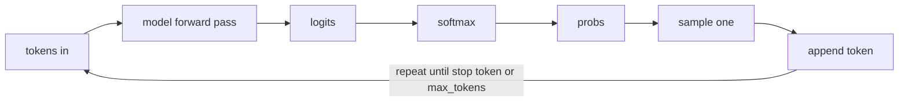

# Lecture 7: Next-Token Prediction — The One Thing LLMs Do

> Every capability you will ever ship on top of a large language model — summarization, code generation, agents, RAG, "reasoning" — is built on a single mechanical act repeated in a loop: predict the next token. This lecture exists because almost every production surprise ("why did it hallucinate a function that doesn't exist?", "why does it get worse the longer it writes?", "why can't it just say 'I don't know'?") dissolves once you internalize that one act. After this lecture you will be able to trace an output token-by-token, explain *mechanically* why hallucination is fluent guessing rather than a lookup bug, predict where long outputs go wrong, and reason about "emergent" behavior like an engineer instead of a mystic.

**Prerequisites:** Lecture on tokenization (BPE, `tiktoken`); comfort with basic probability (a distribution sums to 1) and big-O · **Reading time:** ~22 min · **Part of:** Phase 0 Week 2

---

## The core idea (plain language)

A large language model is a very large, fixed function. You feed it a sequence of tokens; it returns **one probability distribution over its entire vocabulary** — a number for every possible next token saying "how likely is this one to come next." That is *all* it computes in a single forward pass. It does not compute an answer, a plan, or a fact. It computes: given everything so far, what token tends to come next?

To produce text longer than one token, you wrap that function in a loop:

1. Feed the current tokens in.
2. Get the distribution over the vocabulary.
3. **Sample** one token from that distribution (or take the most likely).
4. **Append** it to the sequence.
5. Go to step 1.

This is **autoregressive generation**: "auto" (self) + "regressive" (feeding its own output back as input). The model that wrote token 50 is reading tokens 1–49 — including the 40 tokens it wrote itself. There is no separate "generate a whole response" operation anywhere in the system. The essay, the JSON, the working Python function — all of it is this five-step loop turned hundreds or thousands of times.

Karpathy's framing in **"Intro to Large Language Models"** is the one to keep: the model is a "token simulator" — a lossy, probabilistic compression of its training data that dreams up plausible continuations. Once you believe that literally, the rest of this lecture is just consequences.

---

## How it actually works (mechanism, from first principles)

### From tokens to a distribution

Walk one forward pass end to end. Suppose the prompt is `The capital of France is`. After tokenization you have a handful of integer token IDs. The model runs them through its stack (embeddings → attention layers → feed-forward layers — the details are the previous lecture's job) and produces, for the *next* position, a vector of **logits**: one raw score per vocabulary entry. For a GPT-style vocab that's roughly 100,000–200,000 numbers. They are unbounded real numbers — `12.3`, `-4.1`, `0.7` — not probabilities.

To turn logits into a probability distribution you apply **softmax**. Softmax does two things: exponentiate each logit (so everything becomes positive and larger logits pull far ahead), then divide by the sum (so the whole thing adds to 1).

Toy example with a 4-token vocab and logits `[2.0, 1.0, 0.5, -1.0]`:

```
exp:      e^2.0=7.39   e^1.0=2.72   e^0.5=1.65   e^-1.0=0.37
sum:      7.39 + 2.72 + 1.65 + 0.37 = 12.13
softmax:  0.609        0.224        0.136        0.030   (sums to 1.0)
```

So the model assigns 60.9% to token 0, 22.4% to token 1, and so on. Two properties matter in production:

- Softmax is **shift-invariant** but **not scale-invariant**. Add 100 to every logit and the probabilities are unchanged; *multiply* every logit by a constant and the distribution sharpens or flattens. That constant is exactly what **temperature** controls (divide logits by `T` before softmax). `T<1` sharpens toward the top token; `T>1` flattens toward uniform; `T→0` approaches picking the single argmax ("greedy").
- Because it exponentiates, softmax is **winner-take-a-lot**. A logit gap of 2.0 became a probability ratio of ~2.7×. Small changes in the raw scores produce large swings in what actually gets sampled.

### The loop, with numbers

Now the autoregressive part. Say for `The capital of France is` the top of the distribution is:

```
" Paris"   0.86
" the"     0.04
" located" 0.03
" a"        0.02
... (tens of thousands of tokens splitting the remaining 0.05)
```

At temperature 0 you take `" Paris"`. The sequence is now `The capital of France is Paris`. You feed *that* back in and get a new distribution — maybe `.`, `,`, `and`, ` which`. You sample again, append, repeat. Each step is a full forward pass over the whole sequence so far.



The loop ends when the model samples a special end-of-sequence / stop token, when it hits one of your `stop` strings, or when it reaches `max_tokens`. **If you never set `max_tokens`, a model that falls into a loop will happily generate to the context limit and bill you for every token** — this is not hypothetical; it is a standard incident.

### Sampling is a choice, not a fact

"The model said X" is imprecise. The *model* produced a distribution; *your sampling policy* chose X. Same distribution, different knobs, different token:

- **Greedy / `temperature=0`**: always take the argmax. Most repeatable, can be dull or get stuck in loops.
- **Temperature**: rescale logits before softmax to flatten (`>1`) or sharpen (`<1`).
- **top-k**: keep only the k highest-probability tokens, renormalize, sample among them.
- **top-p (nucleus)**: keep the smallest set of tokens whose probabilities sum to `p` (e.g. 0.9), renormalize, sample. Adapts the candidate set size to how confident the model is.

A crucial and often-missed point from the spine: **`temperature=0` is not byte-for-byte deterministic** in practice. Floating-point non-associativity on GPUs, changing batch composition on a shared server, and mixture-of-experts routing all mean the argmax can flip between runs. Pin `seed` where the provider supports it, but design as if there is residual nondeterminism — because there is.

---

## Worked example

Let's generate a short answer and watch error and cost accrue. Prompt: `The Eiffel Tower is in the city of`. Assume (illustrative numbers) the model's distribution for the next token is:

```
" Paris"    0.92
" France"   0.05
" downtown" 0.01
... rest    0.02
```

**Step 1.** At `T=0` we emit `" Paris"`. Sequence: `... city of Paris`.

**Step 2.** New forward pass. Distribution over the *next* token might be:

```
"."     0.55
","     0.30
" in"   0.08
" ,"    0.04
... rest 0.03
```

At `T=0` we emit `"."` and the model likely emits a stop token next → done. Short, factual, high-probability path: this is why factual short answers are reliable — the mass is concentrated and the greedy path is the correct path.

Now change the prompt to something the model has *thin* training coverage for: `The capital of the fictional country of Zverland is`. There is no fact to retrieve, but softmax **must still produce a distribution that sums to 1** — the model cannot output "no answer." So it spreads mass over plausible-sounding city-like tokens:

```
" Zver"    0.11
" Nova"    0.07
" Port"    0.05
" the"     0.05
... long tail
```

Whatever you sample, you get a fluent, confident, *invented* city name. The model is doing exactly what it always does. There is no error path being taken — this is the *success* path of a next-token predictor applied to a question with no answer in the weights. **That is hallucination, mechanically.**

### Why longer outputs compound error

Suppose each generated token has a modest independent chance `p = 0.99` of being "fine" (on-track, non-derailing). Probability the whole output stays on track:

```
10 tokens:   0.99^10  ≈ 0.904   (~90% clean)
100 tokens:  0.99^100 ≈ 0.366   (~37% clean)
500 tokens:  0.99^500 ≈ 0.0066  (~0.7% clean)
```

These specific numbers are illustrative, and real tokens are not independent — but the *shape* is real and it bites. Because generation is autoregressive, a single off-track token becomes **input to every subsequent step**. The model doesn't know token 200 was a mistake; it treats it as ground truth and continues coherently *from the error*. This is why a summary can start perfect and drift into invented details, why a long code file compiles at the top and hallucinates an API at the bottom, and why "chain of thought" that goes wrong early stays wrong confidently. Longer output = more independent chances to derail × the fact that derailments are self-reinforcing.

Production levers that fall directly out of this: keep individual generations short and composable; validate/parse structured output rather than trusting prose; and for agents, check state after each step instead of generating a 2,000-token plan and hoping.

---

## How it shows up in production

**Cost and latency split into two phases.** Because the loop reprocesses context each step, providers split work into **prefill** (one big pass over your prompt, compute-bound, parallel) and **decode** (one forward pass per output token, sequential, memory-bandwidth-bound). Consequences you feel: time-to-first-token is dominated by prefill (prompt length), while total time is dominated by decode (number of output tokens). A 10k-token prompt with a 50-token answer is "slow to start, fast to finish"; a 200-token prompt with a 2,000-token answer is the opposite. **Output tokens usually cost more than input tokens** partly because decode is the sequential, hard-to-batch phase.

**"Confidently wrong" is the default, not a bug.** Nothing in the loop distinguishes "high-probability because it's true" from "high-probability because it's a fluent pattern." The model's fluency and its factuality are decoupled. Do not read confidence off the prose. If you need calibrated uncertainty, you must engineer it (retrieval with citations, tool calls that ground answers, asking the model to check against provided context) — you cannot get it for free from the base loop.

**Debugging with logprobs.** Every serious provider can return `logprobs` / `top_logprobs` (OpenAI, most open-model servers; Anthropic does not expose them the same way — note that). This is your single best debugging window into the loop: exponentiate the logprobs and you *see* the distribution. Was the model 0.98 on the right token (a fluke sample knocked it off?) or was it 0.20 across five near-ties (genuinely uncertain — a prompt problem)? The Week 2 lab's logprobs viewer is exactly this instrument. Low top-token probability at the point things go wrong is your signal that the model is guessing.

**Repeatability in tests.** Since sampling is a policy, your eval harness must pin it: `temperature=0` (and `seed` where supported) for anything you assert on — and even then expect occasional drift, so assert on substrings/structure, not exact strings, and allow a small tolerance (the spine's "4/5 inputs" gate reflects this reality).

---

## Common misconceptions & failure modes

- **"The model looks things up / has a database."** No. It has weights — a lossy compression of training data. There is no retrieval step and no row to return "not found." Every answer is generated the same way; correct answers are just high-probability continuations that happen to match reality.
- **"Hallucination is a rare error state to be caught."** It is the normal operation of the loop applied to inputs with weak support. You reduce it by *changing the input* (give it the facts via context/RAG, constrain the output), not by hoping a switch turns it off.
- **"LLMs can tell you what they don't know."** Not by default. The loop always emits a normalized distribution; "I don't know" is just another token sequence it may or may not have learned to produce in context. Abstention is a *trained/prompted behavior*, layered on top — never an intrinsic property. A model saying "I'm not sure" is producing likely tokens, not reporting a genuine confidence readout.
- **"Temperature 0 is deterministic."** Best-effort only. GPU float non-associativity, server-side batching, and MoE routing cause drift. Never build a byte-exact assertion on live model output.
- **"Emergent means magic / understanding."** For an engineer, **"emergent" means a capability that wasn't explicitly trained for but appears once the model, data, and compute are large enough** — few-shot learning, rough arithmetic, code, tool use. It is still next-token prediction; the useful behavior is a *side effect* of predicting tokens over a huge, varied corpus. The engineering takeaway: emergent abilities are **unreliable at their edges** (they degrade off-distribution and give no warning), often **discontinuous** with scale (a capability can appear between model sizes), and **not guaranteed to transfer** to your exact task. Treat them as measured empirically per model, never assumed.
- **"Longer prompt/output = better answer."** More output tokens = more chances to derail and higher cost/latency. Ask for the shortest sufficient output.

---

## Rules of thumb / cheat sheet

- **One model call = one distribution over the vocab.** Everything longer is that call in a loop feeding itself.
- **Logits → (÷ temperature) → softmax → probabilities → sample.** Temperature scales logits *before* softmax; softmax always sums to 1.
- **The model can never emit "nothing."** A normalized distribution always exists → confident output even when the true answer is unknown → hallucination.
- **Confidence ≠ correctness.** Fluency is decoupled from truth. Never trust tone; check logprobs or ground with tools/retrieval.
- **Always set `max_tokens`.** An unbounded loop can run to the context limit and bill you for it.
- **`temperature=0` ≈ repeatable, not deterministic.** Pin `seed` if available; assert on structure/substrings, allow tolerance.
- **Short, composable generations beat one long monologue.** Error compounds token-by-token because output feeds back as input.
- **Prefill = prompt cost (fast to batch); decode = output cost (sequential).** Output tokens are usually priced higher and dominate latency for long answers.
- **"Emergent" = appeared-with-scale, measured not assumed.** Unreliable at the edges; verify per model on your task.
- **To reduce hallucination, change the input (context/RAG/constraints), not your hopes.**

---

## Connect to the lab

This lecture is the theory behind Week 2 Lab exercises **3 (logprobs)** and **5 (sampling sweep)**. In the logprobs script, prompt `The capital of France is` with `logprobs=True, top_logprobs=5`, exponentiate the values, and confirm you *see* the exact distribution this lecture describes — then try a made-up entity and watch the probability mass smear across a fluent-but-invented tail. In the sampling sweep, run the same creative prompt at temperature `{0, 0.7, 1.2}` and top_p `{1.0, 0.5}` and observe how the *same distribution* yields different tokens. Watch for: (1) `temperature=0` still drifting run-to-run, and (2) how quickly a higher-temperature long generation wanders off topic — that's compounding error in the flesh.

---

## Going deeper (optional)

- **Andrej Karpathy — "Intro to Large Language Models"** (YouTube; ~1 hr). The canonical engineer-level mental model; the "token simulator" framing used here. Search that exact title.
- **Andrej Karpathy — "Let's build GPT: from scratch, in code, spelled out"** and **"Let's build the GPT Tokenizer"** (YouTube). Watch the argmax/sampling loop implemented in a few lines of Python.
- **Jay Alammar — "The Illustrated Transformer"** (jalammar.github.io). One read for the picture of how tokens become logits; don't rabbit-hole.
- **OpenAI API documentation** (platform.openai.com/docs) — the *Text generation* and *logprobs* sections for how sampling params and `top_logprobs` behave in a real API.
- **"The Curious Case of Neural Text Degeneration"** — the paper that introduced nucleus (top-p) sampling; search that title if you want the "why" behind top-p.
- Search query for the emergence debate an engineer should know both sides of: **"emergent abilities of large language models" and "are emergent abilities a mirage"** — read both to avoid overclaiming.

---

## Check yourself

1. In one sentence, what does a single forward pass of an LLM actually compute — and what does it *not* compute?
2. Given logits `[3.0, 1.0, 1.0]`, roughly what does softmax output, and how would `temperature=2` change the shape (sharper or flatter)?
3. Mechanically, why can't a vanilla LLM reliably say "I don't know" when asked about something absent from its training data?
4. Your model produces a great first paragraph then invents fake citations in paragraph four. Explain why using the words *autoregressive* and *compounding*.
5. Two runs at `temperature=0` give slightly different answers. Give two reasons this is expected, not a bug.
6. A teammate says "GPT can do arithmetic, so it must understand math." Reframe this correctly using the engineering meaning of *emergent*.

### Answer key

1. It computes a single probability distribution over the entire vocabulary for the *next* token given the tokens so far; it does not compute a whole answer, a plan, a fact, or a retrieval result.
2. Softmax of `[3,1,1]`: `e^3≈20.1, e^1≈2.72, e^1≈2.72`, sum ≈ 25.5 → about `[0.79, 0.105, 0.105]`. `temperature=2` divides logits by 2 (→`[1.5,0.5,0.5]`) before softmax, **flattening** the distribution (top token less dominant). Higher T = flatter, lower T = sharper.
3. Because the loop always applies softmax, which produces a normalized distribution that sums to 1 — there is no "empty" or "not found" output. It must emit *some* high-probability token sequence, and for an unsupported question that's a fluent guess. Abstention is a separately trained/prompted behavior, not an intrinsic capability.
4. Generation is **autoregressive**: each new token is produced by feeding all prior tokens — including the model's own earlier output — back as input. Once one invented token is emitted, it becomes trusted input for every later step, so small errors **compound** and the model coherently continues *from* the mistake; longer outputs have more independent chances to derail and each derailment is self-reinforcing.
5. (a) GPU floating-point operations are non-associative and results depend on batch composition on shared servers; (b) mixture-of-experts routing and other server-side factors can flip the argmax. `temperature=0` is best-effort greedy, not a determinism guarantee.
6. "Emergent" means the ability *appeared with scale* without being explicitly trained for — it's still next-token prediction, a side effect of modeling a huge corpus. It implies nothing about understanding, it's unreliable at the edges and off-distribution, and it must be *measured* on your task per model, never assumed to generalize.
