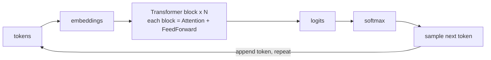

# Lecture 8: Attention & the Transformer, for Engineers

> Every LLM you will ever call is a stack of the same block repeated dozens of times, and the beating heart of that block is *attention*. If you treat the transformer as a magic box you will misprice it, mis-latency it, and mis-debug it. This lecture opens the box just far enough that you can reason about cost, latency, and quality from first principles — why a 100k-token prompt is slow and expensive, why the model "forgets" the middle of a long document, why BERT and GPT are different animals, and why FlashAttention made your bill smaller without changing a single answer. After this you will be able to trace a token through a decoder-only stack, explain the O(n²) attention cost to a skeptical manager with numbers, and pick the right architecture family for a task.

**Prerequisites:** Lecture 7 (Next-token prediction, tokenization, sampling) · comfort with big-O and basic arithmetic · **Reading time:** ~22 min · **Part of:** Phase 0 Week 2

## The core idea (plain language)

An LLM reads a sequence of tokens and, at every position, has to decide: *which of the earlier tokens matter for predicting what comes next?* That's it. That decision is **attention**.

Think of a meeting transcript. To understand the sentence "She approved it," you glance back to find who "She" is and what "it" refers to. You don't re-read the whole transcript with equal weight — you *attend* to the two or three lines that resolve the pronouns. Attention is the mechanism that lets each token pull in exactly the earlier context it needs, weighted by relevance, computed as math instead of intuition.

A **transformer** is just a tall stack of layers, each of which does two things: (1) an attention step where every token gathers information from other tokens, and (2) a small feed-forward network that "thinks" about what it gathered. Stack that block 32 or 80 times, and you get GPT, Llama, Claude, Qwen — the whole modern family. The "decoder-only" ones (all the chat models you use) add one rule: **a token may only look backward, never forward.** That single rule is what makes them able to *generate* text one token at a time.

Everything else in this lecture — heads, masking, quadratic cost, "lost in the middle," FlashAttention — is a consequence of these two ideas.

## How it actually works (mechanism, from first principles)

### The decoder-only loop

Recall from Lecture 7 that generation is autoregressive: the model predicts one token, appends it, and feeds the whole sequence back in. Here's where attention lives in that loop:



Each **transformer block** does, in order:

1. **Attention** — every token looks at earlier tokens and mixes in their information.
2. **Feed-forward network (MLP)** — each token independently transforms what it gathered.

(There are also residual connections and layer norms holding it together; as an engineer you rarely need to reason about those to debug behavior, so we won't dwell on them.)

### Query, Key, Value — the matching game

Attention is a soft, weighted lookup. For each token, the model computes three vectors:

- **Query (Q):** "What am I looking for?"
- **Key (K):** "What do I offer / what am I about?"
- **Value (V):** "Here is the actual information I'll hand over if you pick me."

The intuition: it's a fuzzy dictionary. A normal dictionary matches a key *exactly* and returns one value. Attention matches your **query** against *every* key by similarity (a dot product — bigger when they point the same way), turns those similarity scores into weights that sum to 1 (softmax), and returns a **weighted blend of all the values**. Instead of "give me the value at key X," it's "give me a mix of all values, weighted by how well each key matches my query."

So for one token: score every earlier token's Key against my Query → normalize scores to weights → sum up the Values using those weights → that blend is what this token "learned" from context at this layer.

### A tiny worked example (numbers, no proof)

The token **"it"** wants to resolve what it refers to. Suppose three earlier tokens have already been seen: **"cup"**, **"table"**, **"broke"**. The model computes a similarity score between "it"'s Query and each token's Key. Say the raw scores come out:

| token  | raw score (Q·K) |
|--------|-----------------|
| cup    | 3.0             |
| table  | 1.0             |
| broke  | 2.0             |

Softmax turns these into weights (exponentiate, then divide by the sum):

- exp(3.0) ≈ 20.1, exp(1.0) ≈ 2.7, exp(2.0) ≈ 7.4 → sum ≈ 30.2
- weights: cup = 20.1/30.2 ≈ **0.67**, table = 2.7/30.2 ≈ **0.09**, broke = 7.4/30.2 ≈ **0.24**

The output for "it" is `0.67 × V(cup) + 0.09 × V(table) + 0.24 × V(broke)`. The model has decided "it" mostly refers to **cup** (67% of the blend), with a nod to the fact that something **broke**. No lookup table, no hard rule — just similarity scores softmaxed into a weighted average of values. That's attention. Stack this across layers and heads and the model resolves references, tracks subjects, matches brackets, and follows instructions.

### Causal masking — you cannot peek at the future

If a decoder-only model could attend to *future* tokens, generation would be cheating: predicting token 5 while already looking at token 6. So during the scoring step, every position's scores against future positions are forced to **−∞ before softmax**, which makes their weights exactly 0.

```
       attends to →   cup   table  broke   it
cup                    ✓      ·       ·      ·
table                  ✓      ✓       ·      ·
broke                  ✓      ✓       ✓      ·
it                     ✓      ✓       ✓      ✓
        (· = masked to zero; upper triangle is the "future")
```

Each row can only see itself and everything to its left. This lower-triangular pattern is the **causal mask**. It's the entire structural difference between a model that can *generate* (GPT) and one that can only *understand a fixed input* (BERT — which sees the whole sequence both ways).

### Multi-head = multiple views at once

One attention computation gives one "opinion" about what's relevant. Real transformers run many in parallel — **multi-head attention**. A model might have 32 heads. Each head has its own Q/K/V projections, so each learns to attend for a different reason:

- one head tracks the subject of the sentence,
- another matches an open bracket to its close,
- another links a pronoun to its antecedent,
- another watches for negation ("not").

They run simultaneously (that's why it's fast on a GPU — it's one big batched matrix multiply), and their outputs are concatenated and combined. **More heads = more simultaneous relationships tracked.** When people say attention is "looking at the sentence from multiple angles," this is the literal mechanism.

### Why attention is O(n²) in sequence length

Here's the fact that will bite you in production. To attend, every token scores against every other token. With **n** tokens, that's roughly **n × n = n²** score computations per head per layer.

- 1,000 tokens → ~1,000,000 pairwise scores.
- 10,000 tokens → ~100,000,000.
- 100,000 tokens → ~10,000,000,000.

**10× the context ≈ 100× the attention work.** The feed-forward parts scale linearly with n, but attention's quadratic term dominates as prompts get long. This is *the* reason long-context requests are slow and pricey — not marketing, arithmetic. It's also why the field obsesses over making attention cheaper (FlashAttention, sparse/sliding-window attention, etc.).

## Worked example — one token through the machine

Let's generate the next token after the prompt **"The cup fell and it"**. Assume it tokenizes to 5 tokens (pretend one-word-one-token for clarity).

1. **Embed:** each token → a vector. Add positional information so the model knows order.
2. **Block 1, attention:** the token **"it"** (the last, current position) computes its Query. Because of the causal mask it may attend to `The, cup, fell, and, it`. Its scores concentrate weight on **"cup"** and **"fell"** (as in our tiny example). Its output vector now encodes "the thing that fell = cup."
3. **Block 1, feed-forward:** that enriched vector gets transformed.
4. **Blocks 2…N:** repeat. Deeper layers build on shallower ones — early layers resolve syntax, later layers resolve meaning and task intent. By the top of the stack, the vector at position "it" is a rich summary of everything relevant that came before.
5. **Logits + softmax:** the final vector at the last position is projected to a score for every token in the vocabulary, softmaxed into probabilities: maybe `broke 0.31, shattered 0.12, spilled 0.09, …`.
6. **Sample** (temperature/top-p from Lecture 7) → pick **"broke"**. Append it. The sequence is now "The cup fell and it broke", and we loop back to step 1 for the *next* token.

Crucially: only the **last position's** output is used to predict the next token during generation. But to compute it, that position attended to all prior positions — which is why we cache their Keys and Values (the KV cache from Lecture 7) instead of recomputing them every step.

## How it shows up in production

**Long prompts cost more than linearly.** Doubling your context doesn't double attention cost, it roughly quadruples it. A retrieval system that stuffs 50 documents into context "just in case" can be dramatically slower and more expensive than one that retrieves the 5 that matter. Trim context aggressively; it's a latency *and* dollars lever.

**Prefill vs decode (ties to KV cache).** Processing your prompt (prefill) pays that O(n²) cost up front over the whole prompt — this is the slow, compute-heavy phase and why time-to-first-token grows with prompt length. Generating each new token (decode) is cheaper because the KV cache means the new token only attends against cached Keys/Values. Practical consequence: a 100k-token prompt with a 50-token answer spends almost all its time in prefill. If you're optimizing latency, shortening the *prompt* usually helps far more than shortening the *output*.

**"Lost in the middle."** Empirically, models attend most reliably to information near the **start** and **end** of the context and are weakest on material buried in the **middle**. This is a well-documented retrieval failure (the "lost in the middle" phenomenon). Engineering consequences:
- In RAG, put the most important retrieved chunk **first or last**, not in the middle of a 20-chunk dump.
- Repeat critical instructions near the end of a long prompt.
- Don't assume that because a fact is *in* the 128k context, the model will *use* it. "It fits in the window" ≠ "it will be attended to." Test with a needle-in-a-haystack probe on *your* prompt shapes.

**KV cache is why long context eats VRAM.** The cache stores Keys and Values for every token, every layer, every head. It grows linearly with context length, and for long contexts it can rival or exceed the model weights in memory. This is the hidden cost behind "why does my 8B model OOM at 32k context when it fit fine at 2k?" (You'll compute this explicitly in the Week 3 `vram` command.)

**Architecture choice is a real decision, not trivia:**

| Family | Attention | Best at | Examples | You reach for it when… |
|---|---|---|---|---|
| **Encoder-only** | Bidirectional (sees whole input both ways) | Understanding, classification, **embeddings** | BERT, sentence-transformers backbones | You need a vector for search/similarity/classification — *not* generation. |
| **Decoder-only** | Causal (backward only) | **Generation**, chat, reasoning | GPT, Llama, Claude, Qwen, Mistral | You need the model to *produce* text/code/JSON. This is 90% of what you'll build. |
| **Encoder-decoder** | Encoder bidirectional + decoder causal | Seq-to-seq: translation, summarization with a distinct input→output | T5, original Transformer, many NMT models | You have a clean "transform this input into that output" task; less common in the LLM-app world today. |

The engineering takeaway from Week 2's embeddings lab: you use an **encoder-style** model to embed documents for search, and a **decoder-only** model to generate answers. They are different tools; don't ask a generation model for an embedding, or vice versa.

**FlashAttention is a faster implementation, not new math.** FlashAttention computes the *exact same* attention output but reorganizes the computation to avoid writing the giant n×n score matrix to slow GPU memory (it tiles and fuses the operations, keeping intermediates in fast on-chip SRAM). Result: less memory traffic, big speedups and memory savings, **identical answers** (modulo tiny floating-point noise). When someone says "we enabled FlashAttention-2 and got a 2× throughput bump," they did not change the model's behavior — they changed how the arithmetic is scheduled. It does **not** change the O(n²) *asymptotic* work; it changes the constant factor and, critically, the memory footprint.

## Common misconceptions & failure modes

- **"Attention is a database lookup."** No — it's a *soft weighted average* over all values, not a hard retrieval of one. Everything contributes; relevance just sets the weights.
- **"Bigger context window means the model reads it all carefully."** False. Fits-in-window ≠ attended-to. Middle content is routinely under-weighted (lost in the middle). Design placement deliberately.
- **"FlashAttention makes the model smarter / longer-context for free."** No. Same math, same answers. It reduces memory and latency, which *enables* longer contexts in practice — but it doesn't improve quality or remove the quadratic scaling.
- **"More heads = smarter."** Not linearly. Heads let the model track more relationship types in parallel, but head count is an architecture choice with diminishing returns, not a quality dial you turn.
- **"O(n²) means 10× longer prompt is 10× slower."** It's roughly **100×** for the attention component. Underestimating this is how people ship a demo that's fine at 2k tokens and times out at 40k.
- **"Encoder-only models can generate text."** BERT-family models are for understanding/embeddings; they don't autoregressively generate. Using them for the wrong job is a category error.
- **"Causal masking is a config option I can turn off for chat models."** It's structural to decoder-only generation; without it the model can't be trained to predict the next token honestly.

## Rules of thumb / cheat sheet

- Attention cost ≈ **O(n²)** in sequence length. **10× tokens ≈ 100× attention work.** Trim context first when optimizing cost/latency.
- **Prefill is slow (pays the n² up front); decode is cheap per token.** Long prompt + short answer = time dominated by prefill. Shorten the prompt to cut time-to-first-token.
- **Put critical info at the start or end** of long context; expect the middle to be under-attended. Probe with needle-in-a-haystack on your real prompt shapes.
- **Encoder-only → embeddings/classification. Decoder-only → generation. Encoder-decoder → clean seq-to-seq.** Match the tool to the job.
- **Multi-head = multiple relationship trackers in parallel** (subject, brackets, pronouns, negation). Don't over-read it as "IQ."
- **KV cache grows linearly with context**, per layer × head. Long context can OOM even a small model; budget VRAM for it.
- **FlashAttention = same answers, less memory & latency.** Enable it in serving (vLLM/TGI do by default); expect throughput up, quality unchanged.
- Rule-of-thumb weights memory (from the spine, approximate): **7B at fp16 ≈ 14 GB**; then *add* KV cache for your context length on top.

## Connect to the lab

This lecture is the "why" behind the Week 2 lab exercises. In **Exercise 3 (logprobs)** you print the top-5 next-token candidates — that distribution is exactly the softmax over logits at the *last attended position* described above; watch how confident vs flat it is. In **Exercise 4 (embeddings + semantic ranking)** you use an **encoder-style** sentence-transformer to turn text into vectors — that's the encoder-only family from the architecture table, doing "understanding" not "generation." As you run the sampling sweep (Exercise 5), remember the model only ever predicts the *next* token from the last position; temperature just reshapes that final softmax. Watch for: long inputs slowing down noticeably (prefill/O(n²) in action) and any "it ignored the middle of my prompt" behavior.

## Going deeper (optional)

- **Jay Alammar — "The Illustrated Transformer"** (jalammar.github.io). The canonical pictures of Q/K/V and multi-head attention. Read once for the mental image; don't rabbit-hole.
- **Andrej Karpathy — "Let's build GPT: from scratch, in code, spelled out"** (YouTube). Builds a decoder-only transformer from nothing; watching him implement the causal mask and self-attention makes this lecture click. Search that exact title.
- **Karpathy — "Intro to Large Language Models"** (YouTube). Engineer-level framing of the whole stack. Search the title.
- **"Attention Is All You Need"** (Vaswani et al., 2017) — the original paper. Skim for the block diagram; you do not need the proofs. Search the title.
- **FlashAttention** — Tri Dao et al. Search "FlashAttention paper" and the "Dao-AILab/flash-attention" GitHub repo. Read the abstract and the memory-hierarchy diagram; that's the whole intuition.
- **"Lost in the Middle: How Language Models Use Long Contexts"** (Liu et al.). Search that exact title for the empirical curves behind the placement advice.
- **The Illustrated BERT / "The Illustrated GPT-2"** (also jalammar.github.io) for the encoder-only vs decoder-only contrast in pictures.

## Check yourself

1. In one sentence each, what do the Query, Key, and Value represent, and what does softmax do to the scores?
2. Your prompt grows from 4,000 to 40,000 tokens. Roughly how much more *attention* work is that, and which phase (prefill or decode) absorbs most of it?
3. Why can a decoder-only model generate text token-by-token but an encoder-only model (BERT) cannot? Name the structural mechanism.
4. A teammate says "we turned on FlashAttention and our summaries got better." What's almost certainly wrong with that claim, and what *did* likely improve?
5. You dump 20 retrieved chunks into a 100k-token prompt and the model misses a fact that's provably in chunk #11. Give the two-word name for this failure and one fix.
6. For a semantic search feature, which architecture family do you use to embed the documents, and which would you use to *write the answer* to the user?

### Answer key

1. **Query** = what the current token is looking for; **Key** = what each token advertises about itself; **Value** = the information a token hands over if selected. **Softmax** turns raw similarity scores into weights that are all positive and sum to 1, so the output is a weighted average of the Values.
2. 10× the tokens → roughly **100×** the attention work (O(n²)). **Prefill** absorbs most of it, since prefill pays the quadratic cost over the whole prompt; decode then reuses the KV cache. Expect time-to-first-token to balloon.
3. Decoder-only models use a **causal mask** so each position only attends backward, matching the "predict the next token from what came before" training objective; they generate by appending one token and looping. BERT is **bidirectional** (sees future and past at once), which is great for understanding a fixed input but means it isn't trained to produce the next token autoregressively.
4. FlashAttention computes the **exact same** attention output — same math, same answers (up to floating-point noise) — so it cannot make summaries "better." What almost certainly improved is **speed/throughput and memory usage**; any quality change is coincidence or a different variable (e.g., a longer context now fitting in memory).
5. **"Lost in the middle."** Fixes: move the important chunk to the **start or end** of the context, retrieve fewer/better chunks, or re-rank so the top chunk is positioned where the model attends best.
6. Embed documents with an **encoder-only** model (BERT-family / sentence-transformer). Generate the user-facing answer with a **decoder-only** model (GPT/Llama/Claude/Qwen).
