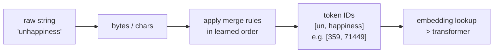

# Lecture 9: Tokenization — How Models See Text

> A language model never sees your string. Before a single matrix multiply happens, your text is chopped into integer IDs called *tokens*, and everything downstream — the bill, the context window, whether the model can spell "strawberry" or add two numbers — is decided by that chopping. This lecture makes tokenization concrete: you'll be able to hand-simulate Byte-Pair Encoding on a toy corpus, predict why a Chinese prompt costs 2–3× its English translation, explain why `" hello"` and `"hello"` are different tokens that quietly break your few-shot prompts, and pick the right tokenizer library for a given model family instead of guessing.

**Prerequisites:** Lecture on next-token prediction / the transformer loop (Week 2 Theory), comfort with Python and basic big-O · **Reading time:** ~22 min · **Part of:** Phase 0 Week 2

---

## The core idea (plain language)

A transformer is a function from a sequence of integers to a probability distribution over a fixed vocabulary. It has no notion of "letters" or "words." The vocabulary is a lookup table — for GPT-4o's tokenizer it has ~200,000 entries; for older GPT models ~100k; for Llama 3, 128k — and each entry is a chunk of bytes. Tokenization is the deterministic algorithm that maps your raw string to a list of those integer IDs, and detokenization maps the model's output IDs back to bytes.

Why chunks and not characters or words?

- **Characters** would make sequences brutally long. "internationalization" is 20 characters but ~3 tokens. Since attention cost grows with the square of sequence length and the context window is a fixed budget, character-level models waste both. They also throw away the useful fact that "ing" or "tion" recur constantly.
- **Whole words** blow up the vocabulary (millions of words across languages, plus every typo, URL, and `snake_case_identifier`) and choke on anything unseen — an out-of-vocabulary word becomes a useless `<UNK>` token, destroying information.

**Subword tokenization** is the compromise everyone landed on: common words get their own single token, rare words split into meaningful pieces, and — critically — a *byte-level* fallback guarantees any possible input (emoji, Cyrillic, a corrupted PDF byte) can always be represented. Nothing is ever out-of-vocabulary. The dominant algorithm for this is **Byte-Pair Encoding (BPE)**.

The engineering punchline: **tokens are the unit of billing, the unit of the context budget, and the unit of latency.** You cannot reason about cost, speed, or a whole class of model failures without thinking in tokens.

---

## How it actually works (mechanism, from first principles)

### BPE training: merge the most frequent pair, repeat

BPE is almost embarrassingly simple. You start with a vocabulary of individual bytes (256 of them for byte-level BPE) and repeatedly do one thing: **find the most frequent adjacent pair of symbols in the corpus and merge it into a new single symbol.** Each merge adds one entry to the vocabulary. You stop when the vocabulary hits your target size.

Let's train on a tiny corpus. Say our word frequencies are:

```
"low"     × 5
"lower"   × 2
"newest"  × 6
"widest"  × 3
```

Start by splitting every word into characters (I'll use a space to show boundaries):

```
l o w            (5)
l o w e r        (2)
n e w e s t      (6)
w i d e s t      (3)
```

Now count every adjacent pair across the whole corpus, weighted by word frequency:

- `e s` appears in "newest" (6) and "widest" (3) → **9**
- `s t` appears in "newest" (6) and "widest" (3) → **9**
- `l o` appears in "low" (5) and "lower" (2) → 7
- `o w` appears in "low" (5) and "lower" (2) → 7
- `n e`, `e w`, `w e` → 6 each
- others smaller

The top pair is a tie at 9; break it by first-seen and merge `e s` → `es`:

```
Merge 1: (e, s) -> es
l o w            (5)
l o w e r        (2)
n e w es t       (6)
w i d es t       (3)
```

Recount. Now `es t` appears 9 times (6+3) — the biggest:

```
Merge 2: (es, t) -> est
n e w est        (6)
w i d est        (3)
```

Next, `l o` is at 7:

```
Merge 3: (l, o) -> lo
lo w             (5)
lo w e r         (2)
```

Then `lo w` at 7:

```
Merge 4: (lo, w) -> low
low              (5)
low e r          (2)
```

After 4 merges our vocabulary has grown from `{l,o,w,e,r,n,s,t,i,d}` to also include `{es, est, lo, low}`, and we've learned an *ordered list of merge rules*. That ordered list — not just the final vocabulary — **is** the tokenizer. This is the key insight most people miss: BPE stores merges as a ranked sequence.

### BPE encoding (inference): apply the learned merges in order

At inference time you do **not** re-run frequency counting. You take a new word, split it to bytes/characters, then greedily apply the learned merge rules in the order they were learned until none apply. Encoding "newest" with the rules above:

```
n e w e s t
  apply (e,s)->es    -> n e w es t
  apply (es,t)->est  -> n e w est
  (no more rules match)  -> tokens: [n, e, w, est]
```

"lowest" — a word never seen in training — still encodes cleanly because merges are compositional:

```
l o w e s t
  (l,o)->lo, (lo,w)->low, (e,s)->es, (es,t)->est
  -> [low, est]
```

Two tokens, both meaningful, zero `<UNK>`. That graceful degradation on unseen input is why BPE won.



Real production tokenizers (tiktoken, the Llama tokenizer) add a **regex pre-tokenization** step first: a big regular expression splits text into rough chunks (words, runs of whitespace, numbers) *before* BPE merges run within each chunk. This is why merges never cross word boundaries and why, in GPT tokenizers, a space is usually glued to the *front* of the following word (more on that gotcha below).

### The "~4 characters per token" rule and why it's a lie for half your inputs

For ordinary English prose, **1 token ≈ 4 characters ≈ 0.75 words** is the rule of thumb every engineer should memorize (these are standard approximations, not exact). So ~1,000 tokens ≈ 750 words ≈ 1.5 pages. But that ratio is a property of *what the tokenizer was trained on*, which is overwhelmingly English web text. It falls apart predictably:

| Input type | Rough chars/token | Why |
|---|---|---|
| English prose | ~4 | Trained on it; common words are 1 token |
| Source code | ~2.5–3.5 | Indentation, `{}`, `_`, camelCase all fragment |
| Non-Latin languages (Chinese, Japanese, Hindi, Arabic) | ~1–1.5 | Few merges learned; often falls back to per-byte, and one UTF-8 character is 2–4 bytes |

That last row is not a curiosity — it's a **cost and fairness problem**. The same sentence in English and Chinese carries the same meaning but the Chinese version can be **2–3× more tokens**. Since you pay per token and the context window is measured in tokens, non-English users get less context and a bigger bill for identical work. This is a documented equity issue in LLM pricing, and it's baked into the tokenizer, not the model weights.

---

## Worked example: cost and budget for one real request

You're building a support-ticket summarizer on a hosted model. A ticket thread is 6,000 characters of English, and you want a ~200-word summary. Let's do the math an engineer actually needs.

**Step 1 — input tokens.** 6,000 chars ÷ 4 ≈ **1,500 input tokens**. (In the lab you'll confirm this exactly with `tiktoken`; the estimate is for back-of-envelope.)

**Step 2 — output tokens.** 200 words ÷ 0.75 ≈ **~265 output tokens**. Round to 300 for safety and set `max_tokens=350` so a runaway loop can't bill you to the context limit.

**Step 3 — cost.** Use a *dated snapshot* of pricing (numbers move; always re-check). Suppose a model is **$2.50 / 1M input tokens** and **$10.00 / 1M output tokens** (illustrative, in the range of a mid-tier 2025 model — verify before quoting):

```
input:  1,500  / 1e6 × $2.50  = $0.00375
output:   300  / 1e6 × $10.00 = $0.00300
total per ticket               ≈ $0.0068
```

At 50,000 tickets/month that's **~$340/month**. Notice output cost nearly equals input cost despite being 1/5 the tokens — **output tokens typically cost 3–5× input tokens** because they're generated sequentially (decode), one expensive forward pass each, while input is processed in one parallel batch (prefill). This directly shapes design: *pushing work into the prompt (input) is cheaper than making the model write more (output)*, so "answer in one word" or "return only the JSON" is a cost lever, not just a style preference.

**Step 4 — the non-English surprise.** Localize to Japanese. The 6,000-char-equivalent thread now tokenizes at ~1.3 chars/token → **~4,600 input tokens**, roughly **3×**. Same product, triple the input bill, and if your context window is 8k you've just lost most of your room for the conversation history. If you'd budgeted context assuming English, non-English tickets silently overflow and get truncated.

---

## How it shows up in production

- **Cost estimation and quotas.** You must count tokens *before* sending, not after the invoice. Every serious pipeline has a token-counting step. Estimating with chars/4 is fine for dashboards; for billing-accurate limits, run the actual tokenizer.
- **Context-budget overflow.** Input + output share one budget. A 128k context with a 100k-token document leaves ~28k for the answer *and* any tool outputs. Long non-English or code inputs blow the budget you sized for English. Truncation is usually silent — the model just stops "seeing" the end of your prompt.
- **Latency.** More output tokens = more sequential decode steps = linearly more wall-clock time. A response that's 2× longer is ~2× slower to stream. Verbose system prompts inflate prefill; verbose outputs inflate decode.
- **The spelling / "count the r's in strawberry" failure.** The model sees `st`, `raw`, `berry` (a few tokens), not ten letters. It has no direct access to characters, so character-level tasks — counting letters, reversing strings, precise substring edits — are genuinely hard and error-prone. This isn't stupidity; it's that the input representation hides characters.
- **Arithmetic quirks.** How digits tokenize matters. If "1234" is one token but "5678" splits differently, the model's numeric reasoning is fighting inconsistent chunking. Newer tokenizers deliberately split numbers into single digits (or fixed 3-digit groups) to help; older ones didn't, which is part of why LLM arithmetic used to be so shaky.
- **Whitespace and leading-space gotchas.** In GPT-family tokenizers a leading space is part of the token: `"hello"`, `" hello"`, and `"Hello"` are three *different* token IDs. This bites you when building few-shot prompts or stop sequences by hand — a trailing space in your template can flip the model onto a different, worse token path. It's also why `logit_bias` or forced-token tricks fail if you bias `"hello"` but the model wants `" hello"`.
- **Tokenizers are NOT interchangeable across families.** `tiktoken` counts for OpenAI models. Llama, Claude, Mistral, and Gemma each have their own vocabulary and merge rules. Counting a Llama prompt with `tiktoken` can be off by 10–30%. Your cost estimates, truncation logic, and chunk-size math must use the *matching* tokenizer for each target model, or note the approximation explicitly.
- **Chunking for RAG.** When you split documents for retrieval (Phase 3–4), "500-token chunks" means the *target model's* tokens. Mismatched tokenizers between your chunker and your model cause chunks that overflow or waste space.
- **Special tokens and injection.** Models are trained with reserved control tokens: `<|endoftext|>`, `<|im_start|>` / `<|im_end|>` (chat turn markers), `<s>` / `</s>`, `<|begin_of_text|>`. These delimit system/user/assistant turns. If untrusted user text can inject the literal string for a special token and your tokenizer encodes it as the *control* token, a user could forge a turn boundary — a real prompt-injection vector. Reputable tokenizers let you control whether special tokens in input strings are treated as special or as plain text; default to *not* special for user content.

---

## Common misconceptions & failure modes

- **"A token is a word."** No. It's a subword byte-chunk. Common words are one token; rare words, code, and non-English fragment into many.
- **"chars/4 is exact."** It's an English-prose average. Code and non-English break it badly; use the real tokenizer when the number matters.
- **"Any tokenizer will do for counting."** Only within a model family. Cross-family counts are estimates. Using tiktoken's `o200k_base` for a Llama cost estimate is a common, silent error.
- **"Temperature/spelling problems are the model being dumb."** Character-level failures are largely a *tokenization* artifact — the model can't see letters it was never given.
- **"Trailing whitespace in my prompt is harmless."** It can push the model onto a different token boundary and measurably change output, especially in few-shot and completion-style prompts.
- **"I can hand-format chat turns with the raw special-token strings."** Use the tokenizer's `apply_chat_template` / the provider's message API. Hand-formatting risks wrong tokens and injection.
- **"BPE re-computes frequencies at encode time."** Training counts frequencies; encoding just replays the frozen, ordered merge list. Encoding is deterministic and fast.

---

## Rules of thumb / cheat sheet

- **English:** ~4 chars ≈ 1 token ≈ 0.75 words. 1,000 tokens ≈ 750 words ≈ 1.5 pages.
- **Code:** budget ~1.3× the English token count for the same char count.
- **Non-Latin languages:** budget 2–3× English tokens for the same meaning — cost *and* context implication.
- **Output tokens cost more than input** (often 3–5×) and dominate latency. Shorten outputs to save money and time.
- **Always `max_tokens`.** Cap output so a loop can't bill you to the context ceiling.
- **Match the tokenizer to the model family.** tiktoken → OpenAI; SentencePiece/HF → Llama/Mistral/Gemma; each has its own vocab. Cross-family counts are approximate; label them.
- **Whitespace matters:** `"hello"` ≠ `" hello"` ≠ `"Hello"`. Don't leave stray trailing spaces in templates.
- **Treat user-supplied text as non-special** when tokenizing, so injected control-token strings can't forge turn boundaries.
- **Don't ask the model to do character surgery** (count letters, reverse strings) and expect reliability — it can't see characters. Offload to code.
- **Which library:** `tiktoken` (fast, OpenAI, count/encode); Hugging Face `tokenizers`/`transformers` `AutoTokenizer` (any HF model, chat templates); `SentencePiece` (the underlying algorithm/format for Llama, Mistral, Gemma, T5 — unigram or BPE).

**Library quick-reference:**

```python
# OpenAI family — tiktoken
import tiktoken
enc = tiktoken.encoding_for_model("gpt-4o")   # picks o200k_base
print(len(enc.encode("How models see text")))  # exact token count

# Any HF model — transformers AutoTokenizer (uses the model's own vocab)
from transformers import AutoTokenizer
tok = AutoTokenizer.from_pretrained("meta-llama/Llama-3.1-8B-Instruct")
print(len(tok.encode("How models see text")))
# and the RIGHT way to format chat — never hand-write special tokens:
tok.apply_chat_template(messages, tokenize=False, add_generation_prompt=True)
```

---

## Connect to the lab

Week 2 Lab **#1 (token counter + cost estimator)** is exactly this lecture made real: use `tiktoken.encoding_for_model(...)`, build a dated `PRICES` dict, and feed the *same* content as English prose, a code snippet, and a pasted non-Latin sentence. Watch the tokens/char ratio collapse for code and non-English — that's the cost/fairness point in numbers. When you extend it in Week 3's `econ cost --lang-breakdown`, remember: for non-OpenAI models tiktoken is only an approximation, so note the chars/token ratio you assume. Watch for the leading-space effect when you tokenize short strings, and confirm output-token pricing is higher than input in your `PRICES` table.

---

## Going deeper (optional)

- **Andrej Karpathy — "Let's build the GPT Tokenizer"** (YouTube, ~2h24m). The single best hands-on walkthrough; he builds BPE from scratch and demonstrates every gotcha in this lecture, including the whitespace and non-English issues. Search that exact title.
- **`openai/tiktoken`** — the official GitHub repo. Read the README and the `encodings` for how `cl100k_base` / `o200k_base` are defined. Root domain: github.com.
- **Hugging Face — "Tokenizers" course chapter and the `tokenizers` / `transformers` docs** at huggingface.co/docs. Covers BPE, WordPiece, Unigram, and `apply_chat_template`.
- **Google — SentencePiece** repo (github.com/google/sentencepiece) and its paper for the unigram vs BPE distinction used by Llama/Mistral/Gemma/T5.
- **OpenAI Tokenizer playground** — paste text and *see* the tokens and boundaries visually. Search "OpenAI tokenizer" for the official tool.
- Search queries when you need current numbers: "tiktoken encoding_for_model list", "Llama 3 tokenizer vocab size", "LLM tokenizer non-English cost fairness study".

---

## Check yourself

1. Why does subword BPE beat both character-level and word-level tokenization? Give one concrete failure each of the alternatives avoids.
2. Train BPE mentally on the corpus `"aaab" ×3, "aab" ×2`. What is the first merge and why?
3. You estimate a prompt at 1,000 tokens with tiktoken, but you're actually calling a Llama-3 model. Why might your number be wrong, and by roughly how much could it drift?
4. A user reports your app "can't count the letters in a word." Explain the root cause in terms of tokenization, and give the correct fix.
5. Why do output tokens usually cost several times more than input tokens, and how should that change how you write prompts?
6. Your carefully built few-shot template suddenly produces worse completions after you "cleaned up formatting." What tokenization gotcha is the prime suspect?

### Answer key

1. Character-level makes sequences too long (wasting the quadratic-attention budget and context) and discards recurring morphemes; word-level explodes the vocabulary and produces useless `<UNK>` on any unseen word/typo/identifier. BPE keeps common words as single tokens, splits rare ones into reusable pieces, and with a byte-level fallback never hits out-of-vocabulary. Concrete: word-level dies on the unseen "lowest"; BPE encodes it as `[low, est]`.
2. Count adjacent pairs weighted by frequency: in `aaab×3` the pairs are `aa`(×2 per word ×3 = 6) and `ab`(×3); in `aab×2` pairs are `aa`(×2) and `ab`(×2). `aa` totals 8, `ab` totals 5. First merge is **(a,a) → aa** because it's most frequent.
3. tiktoken uses OpenAI's vocabulary and merge rules; Llama-3 has a different 128k-vocab tokenizer with different merges, so counts don't match — commonly off by ~10–30%. Use the model's own tokenizer (HF `AutoTokenizer`) for accuracy, or label the tiktoken figure as an approximation.
4. The model never sees individual characters — it sees subword tokens like `st`, `raw`, `berry`, so per-letter tasks (counting, reversing) have no reliable signal. Fix: don't ask the model to do character surgery; do it in code (e.g., `text.count('r')`) and let the model orchestrate.
5. Output is generated sequentially (one forward pass per decoded token) while input is processed in one parallel prefill pass, so output is far more compute-per-token — hence 3–5× pricing and the dominant latency factor. Design: push context into the (cheaper) input, and demand short, structured outputs.
6. A leading or trailing space change. In GPT-family tokenizers `" word"` and `"word"` are different tokens; removing/adding a space at a boundary shifts the model onto a different token path and can degrade output. Restore the exact whitespace your examples used.
