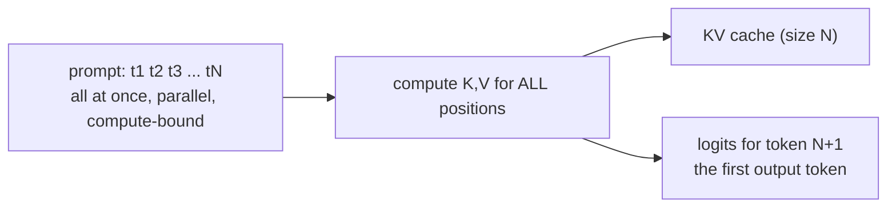
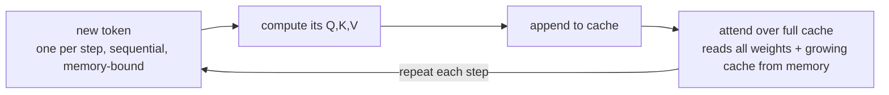

# Lecture 11: Context Windows & the KV Cache

> Every LLM call you will ever make is a negotiation with one hard budget — the context window — and its behavior at runtime is governed by a data structure you can't see but pay for on every invoice: the KV cache. This lecture exists because "the model has a 200k context window" is one of the most misunderstood specs in the field. Engineers treat it like disk space ("I have room, so I'll use it") when it behaves more like a shared, quadratically-priced, quality-degrading resource. After this lecture you will be able to reason about *why* a long prompt is slow to first token but fast to stream, *why* your VRAM (or your bill) explodes with context length, *why* stuffing 150k tokens of retrieved documents can make answers **worse**, and how to estimate all of this with arithmetic before you ship.

**Prerequisites:** Lecture on tokenization (tokens, not characters), the attention/transformer intuition lecture, the VRAM math lecture (params × bytes/param) · **Reading time:** ~22 min · **Part of:** Phase 0 Week 2

---

## The core idea (plain language)

A **context window** is the maximum number of tokens a model can "have in mind" for a single request. The critical, non-obvious fact: **input and output share one budget.** If a model advertises a 128k-token window and you send a 120k-token prompt, you have at most ~8k tokens left to *answer* — and if you also set `max_tokens=16000`, the request will error or truncate. The window is not "how much you can send"; it's "how much you can send **plus** how much it can generate, combined."

There are two phases to every generation, and they have opposite performance characteristics:

- **Prefill** — the model reads your entire prompt at once. This is *compute-bound*: it does a huge amount of matrix math in parallel across all prompt tokens. It's the reason for **time-to-first-token (TTFT)** latency. Long prompt → long wait before you see anything.
- **Decode** — the model generates the answer one token at a time, each token depending on all previous ones. This is *memory-bound*: the math per token is tiny, but it must stream the entire model's weights (and the growing cache) through memory for every single token. This sets your **tokens-per-second (TPS)** throughput.

The thing that makes decode fast — and the thing that makes long context expensive — is the **KV cache**: a stored copy of the attention "keys" and "values" for every token processed so far, so the model never has to re-read the prompt from scratch on each new token. The cache **grows linearly with context length**, and it lives in the same VRAM your model weights do. That single fact drives most of the cost, latency, and capacity ceilings you'll hit in production.

---

## How it actually works (mechanism, from first principles)

### Attention needs to look back — that's the whole problem

Recall from the attention lecture: to produce each new token, the model lets that position "attend to" every earlier token. Mechanically, each token is projected into three vectors — a **Query (Q)**, a **Key (K)**, and a **Value (V)**. The new token's Query is compared against every previous token's Key to decide *how much to pay attention to it*, then the corresponding Values are pulled in and mixed.

Here's the key insight for caching: **a token's K and V never change once computed.** Token #5's Key and Value are the same whether the sequence is 10 tokens long or 10,000. So recomputing them for every new decode step would be pure waste.

### Prefill: compute everything once, in parallel

During prefill, the model processes all N prompt tokens *simultaneously*. Because they're all available up front, the GPU does one big, dense, parallel pass — this saturates the compute units (it's **compute-bound**). As a side effect, it computes and stores the K and V for every prompt token. That stored set is the initial **KV cache**.



### Decode: one token at a time, reusing the cache

Now generation begins. For each new token, the model:
1. Computes Q, K, V for **only the one new token**.
2. Appends that new K and V to the cache.
3. Runs attention: the new Query against **all cached Keys/Values**.
4. Emits a probability distribution, samples a token, repeats.



Because each step does very little arithmetic but must stream the full model weights through the GPU's memory bus, decode is **memory-bandwidth-bound**. This is *why* a 70B model generates slowly even on a beefy GPU: you're limited by how fast you can move bytes, not by how fast you can multiply.

### Why the cache grows linearly

The cache stores one K vector and one V vector, **per token, per attention layer, per attention head** (heads combine into the model's hidden dimension). The size formula:

```
KV cache bytes = 2 (K and V)
              × num_layers
              × sequence_length
              × hidden_dim (across all KV heads)
              × bytes_per_element
```

Everything except `sequence_length` is fixed by the model architecture. So **cache size is directly proportional to context length** — double the context, double the cache. This is the linear growth that bites you.

### A worked VRAM estimate

Take a Llama-3-8B-class model (approximate, standard config figures): 32 layers, hidden dimension 4096, stored in fp16 (2 bytes/element). Assume no GQA compression for the simple case (K and V each span the full 4096).

Per token, per layer: `2 × 4096 × 2 bytes = 16 KB`.
Across 32 layers: `16 KB × 32 = 512 KB per token`. (~0.5 MB/token — a handy number to memorize.)

Now scale by context:

| Context length | KV cache (≈0.5 MB/token) |
|---|---|
| 1,000 tokens | ~0.5 GB |
| 8,000 tokens | ~4 GB |
| 32,000 tokens | ~16 GB |
| 128,000 tokens | ~64 GB |

The 8B weights themselves are ~16 GB at fp16. So at a 128k context, **the cache alone (~64 GB) is roughly 4× the size of the model.** That's why "just use the full window" isn't free: a single long-context request can need more VRAM for its cache than for the model, and if you serve many concurrent users each needs their own cache.

> Modern models use **Grouped-Query Attention (GQA)** to shrink this: many Query heads share a smaller number of KV heads, cutting cache size 4–8×. That's an architectural optimization to attack exactly this linear-growth problem — but the cache still grows linearly with length, just with a smaller constant.

---

## Worked example

You're building a document-QA feature. A user uploads a 40-page contract (~30,000 tokens) and asks a 20-token question. You want a ~600-token answer. You're self-hosting an 8B model on a single 24 GB GPU (fp16). Let's reason end to end.

**Budget check.** Input ≈ 30,000 + 20 = 30,020 tokens; output ≈ 600. Total ≈ 30,620 tokens — comfortably inside a 128k window. Good.

**VRAM check.** Weights ≈ 16 GB. KV cache at 30k tokens ≈ `30,000 × 0.5 MB ≈ 15 GB`. Total ≈ 16 + 15 = **31 GB** — **over your 24 GB card.** This request won't fit at fp16 for one user, let alone concurrently. Options an engineer would reach for: quantize weights (int4 → ~4 GB), quantize the KV cache (fp8/int8 KV halves or quarters the 15 GB), use a GQA model (already-smaller cache), or shrink the input (retrieve only the relevant clauses instead of the whole contract). This is the real reason RAG exists: it's often *cheaper and faster* to retrieve 2k relevant tokens than to stuff 30k.

**Latency intuition.** Prefill must process ~30k tokens before it emits token one — that's your TTFT, and it scales with prompt length. Users will stare at a spinner. Then decode streams 600 tokens at, say, ~40 TPS → ~15 seconds of streaming. If you cut input to 2k tokens via retrieval, TTFT drops dramatically and the cache shrinks to ~1 GB. Same answer quality (often better — see below), a fraction of the cost.

**Prompt-caching preview.** If every request re-sends the same 5k-token system prompt + few-shot examples, you're paying to prefill those identical tokens every time. Providers now let you **cache the KV state of a stable prefix** so subsequent requests skip re-prefilling it — cheaper input tokens and lower TTFT. You'll wire this up in Phase 1; just know now that *the reason it's possible* is exactly the KV cache mechanism above: a prefix's K/V don't change, so they can be stored and reused across calls.

---

## How it shows up in production

- **Bills scale with *both* input and output — and input is often the silent majority.** A RAG system stuffing 20k tokens of context per call pays for 20k input tokens *every request*, dwarfing the 500-token answer. Trimming context is usually the single biggest cost lever you have.
- **Latency has two knobs, not one.** TTFT is dominated by prefill (prompt length); streaming speed is decode (model size + memory bandwidth + cache size). A user complaining "it's slow to start" and one complaining "it types slowly" are describing *different* problems with different fixes. Long prompt → attack prefill (shorter context, prompt caching). Slow stream → attack decode (smaller/quantized model, better serving).
- **Concurrency is gated by KV cache, not compute.** On a serving box, each active request holds its own cache in VRAM. Max concurrent users ≈ (VRAM left after weights) ÷ (cache per request). Long contexts crater your concurrency. This is why serving frameworks like **vLLM** invented **PagedAttention** — it manages KV cache in pages like virtual memory to pack far more requests into the same VRAM.
- **"Context length exceeded" errors in the wild.** Almost always because someone forgot input + output share the budget: a growing chat history plus a large `max_tokens` overflows the window mid-conversation. Fix: track token count, and truncate/summarize history proactively.
- **The `max_tokens` trap.** Setting `max_tokens` too high doesn't just risk overflow — with some APIs it *reserves* budget and can reject an otherwise-valid request. Set it to what you actually expect the answer to need.

---

## Common misconceptions & failure modes

- **"The context window is how much I can send."** No — it's input **plus** output. Reserve room to answer.
- **"Bigger context window = the model uses it all well."** This is the big one. A model can *accept* 200k tokens and still effectively *use* only a fraction. The well-documented **"lost in the middle"** effect (from the attention lecture) means information placed in the middle of a long context is retrieved far less reliably than material at the very start or very end. Your effective **usable quality window** is smaller than the advertised token window. Put the most important instructions and evidence at the beginning or end, not buried in the middle of a 100k-token dump.
- **"More retrieved documents = better answers."** Often the opposite. Padding context with marginally-relevant chunks dilutes attention, adds latency and cost, and can push key facts into the "lost in the middle" dead zone. Precision of retrieval usually beats volume.
- **"Prompt caching means the whole prompt is free."** Only a **stable prefix** can be cached, and only if it's byte-identical across calls. Change one token near the front and the cache is invalidated from that point on. Design prompts prefix-stable: static system prompt and few-shot examples first, volatile user input last.
- **"Decode is slow because the model is 'thinking hard.'"** No — decode is slow because it's memory-bandwidth-bound: it re-streams the weights for every token. Bigger model or bigger cache = slower per token, regardless of task difficulty.
- **"KV cache is a cost I can ignore because I use a hosted API."** You don't manage it, but you pay for it implicitly — it's baked into per-token pricing and into the provider's context-length limits and long-context latency.

---

## Rules of thumb / cheat sheet

- **Budget:** context window = input tokens + output tokens. Always reserve headroom for the answer; never set `max_tokens` to the whole window.
- **KV cache size (fp16, no GQA):** ≈ `2 × layers × hidden × 2 bytes` per token. For an 8B-class model that's **~0.5 MB/token** — memorize this and multiply.
- **Quick VRAM:** `total ≈ weights + (tokens × per-token-cache) + ~15–20% activation headroom`. For long context, the cache term can dominate.
- **Prefill = compute-bound, sets TTFT, scales with prompt length.** Shorten the prompt to make it start faster.
- **Decode = memory-bound, sets TPS, scales with model size + cache.** Shrink/quantize the model to make it type faster.
- **Cheapest wins first:** retrieve less context before you buy more GPU. 2k precise tokens beat 30k noisy ones on cost, latency, *and* often quality.
- **Prompt caching:** put stable content (system prompt, few-shot) first, volatile content last, so the cacheable prefix is maximized.
- **Long-context placement:** most important instructions/evidence at the **start or end**, never buried in the middle.
- **KV cache quantization (fp8/int8):** a real lever to fit more/longer contexts when memory-bound — check whether your serving stack supports it.

---

## Connect to the lab

This lecture is the deep version of the Week 2 "Context window & KV cache" theory bullet, and it directly powers **Lab 1 (token counter + cost estimator)** and the Week 3 **`econ vram` command**: when you compute `KV cache ≈ 2 × layers × seq_len × hidden × bytes`, this lecture is *why* that formula is shaped that way. In the sampling and cost labs, watch two things: (1) how your estimated input-token cost dwarfs output cost as you grow the prompt, and (2) if you have a GPU, watch measured VRAM climb as you increase `seq_len` in the `vram` command — that's the linear cache growth you just estimated, made real. In the Self-check for Week 2, question 3 ("why does a 100k-token context need so much VRAM?") is answered directly by the ~0.5 MB/token estimate above.

## Going deeper (optional)

- **vLLM documentation and the PagedAttention paper** — the canonical treatment of KV-cache memory management in production serving. Search: *"vLLM PagedAttention paper"* and read the vLLM docs at docs.vllm.ai.
- **"Lost in the Middle: How Language Models Use Long Contexts"** (Liu et al.) — the standard reference for the usable-window vs. advertised-window gap. Search that exact title.
- **Anthropic prompt caching** and **OpenAI prompt caching** docs — the production feature this lecture previews. Read the caching sections at docs.anthropic.com and platform.openai.com/docs.
- **Jay Alammar, "The Illustrated Transformer"** (jalammar.github.io) — re-read the Q/K/V section with the caching lens; it makes the "K and V never change" insight click.
- **FlashAttention** (Tri Dao et al.) — a memory-efficient attention *implementation*; good for understanding the compute-bound prefill side. Search: *"FlashAttention paper"*.
- Search queries to go deeper: *"grouped query attention GQA KV cache"*, *"KV cache quantization fp8 serving"*, *"time to first token vs tokens per second LLM latency"*.

## Check yourself

1. A model has a 32k context window. Your prompt is 30k tokens and you set `max_tokens=4000`. What happens, and why?
2. Explain in one sentence each why prefill is compute-bound and decode is memory-bound.
3. For an 8B-class fp16 model (~0.5 MB/token cache), roughly how much VRAM does the KV cache use at 64k tokens? Is that more or less than the model weights?
4. A user says the model is "slow to start responding." A second user says "it starts fast but types slowly." Which phase does each complaint point to, and what would you tune for each?
5. You have 200k tokens of context available. Give two concrete reasons why filling it with retrieved documents might make answers *worse*, not better.
6. Why can a stable system prompt be prompt-cached but a prompt whose first token changes each call cannot?

### Answer key

1. It errors (or truncates): 30k input + 4k output = 34k > 32k window. Input and output share the same budget, so there isn't room for both. Fix: shrink input or lower `max_tokens`.
2. Prefill processes all prompt tokens in parallel, saturating the GPU's arithmetic units → compute-bound. Decode generates one token at a time doing tiny math but must re-stream the full model weights (and growing cache) through memory each step → memory-bandwidth-bound.
3. ~64k × 0.5 MB ≈ **32 GB** of cache — roughly 2× the ~16 GB fp16 weights. The cache can exceed the model at long context.
4. "Slow to start" = prefill / TTFT (dominated by prompt length) → shorten the prompt, use prompt caching. "Types slowly" = decode / TPS (dominated by model size + memory bandwidth + cache) → use a smaller or quantized model, better serving stack.
5. (a) "Lost in the middle": key facts buried in a long context are retrieved unreliably. (b) Diluted attention plus added cost/latency, and noise from marginally-relevant chunks can crowd out the signal. Precision beats volume.
6. Caching reuses the stored K/V of a byte-identical prefix; K/V for a position depend on all tokens up to it. If the first token changes, every downstream K/V changes too, invalidating the entire cache — so only a stable prefix (static content first, volatile content last) is cacheable.
