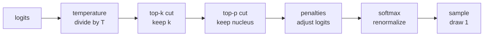

# Lecture 12: Sampling Parameters — Controlling Generation

> The model hands you a probability distribution over its whole vocabulary at every step. What token actually comes out is *your* decision, made by a handful of knobs: `temperature`, `top_p`, `top_k`, `max_tokens`, `stop`, `frequency_penalty`, `presence_penalty`, and `seed`. Ship without understanding these and you get the classic incidents: an extraction endpoint that returns a different JSON shape every call, a chatbot that loops "I'm here to help I'm here to help" until it hits the context limit and bills you for 4,000 tokens, an "identical" prompt that gives different answers on two runs and a panicked "the model is broken" ticket. This lecture exists so none of that surprises you. After it you will be able to read a distribution, predict how each knob reshapes it (with arithmetic you can do on paper), pick the right settings for a given task, and debug generation like someone who knows exactly which lever moved.

**Prerequisites:** Lecture 7 (next-token prediction, logits → softmax → sample), Lecture 9 (tokenization); comfort with basic probability (a distribution sums to 1) and arithmetic · **Reading time:** ~26 min · **Part of:** Phase 0 Week 2

---

## The core idea (plain language)

From Lecture 7 you know the model does one thing per forward pass: emit **logits** — one raw score per vocabulary token — which softmax turns into a probability distribution summing to 1. Sampling parameters are the set of transformations you apply *between* "here is the distribution" and "here is the one token I picked." They fall into three groups:

1. **Reshape the distribution before you pick** — `temperature` (make it sharper or flatter), `top_k` and `top_p` (throw away the unlikely tail so you never accidentally sample garbage), `frequency_penalty` / `presence_penalty` (push down tokens you've already used).
2. **Decide when to stop** — `max_tokens` (hard cap on output length) and `stop` (strings that end generation).
3. **Control reproducibility** — `seed` (best-effort repeatability), and the hard truth that even `temperature=0` is *not* fully deterministic.

The mental model to hold: **the model gives you the odds; the sampler is your betting strategy.** "The model said X" is sloppy — the model produced a distribution, and your parameters chose X out of it. Master these knobs and you convert a fluent-but-unpredictable text generator into a component you can put behind an SLA.

---

## How it actually works (mechanism, from first principles)

### The pipeline

Every provider applies the knobs in roughly this order. Knowing the order is what lets you reason about interactions:



Two of these — `top_k` and `top_p` — are **filters**: they zero out candidates, then renormalize what's left so it sums to 1 again. Temperature and the penalties are **rescalers**: they change the logits without removing anyone. Sampling is the final dice roll over whatever survived.

### Temperature: sharpen or flatten

Temperature `T` divides every logit by `T` *before* softmax. Recall softmax is `p_i = e^(z_i) / Σ e^(z_j)`. With temperature it becomes `p_i = e^(z_i / T) / Σ e^(z_j / T)`.

- `T = 1`: distribution unchanged.
- `T < 1`: logits get bigger in magnitude → gaps widen → distribution **sharpens** toward the top token.
- `T > 1`: logits shrink toward each other → gaps narrow → distribution **flattens** toward uniform.
- `T → 0`: the top logit dominates completely → you always pick the argmax (**greedy**).

Let's do it with real arithmetic. Take a 3-token vocabulary with logits `[2.0, 1.0, 0.0]`.

**T = 1** (divide by 1, unchanged):
```
e^2.0 = 7.389   e^1.0 = 2.718   e^0.0 = 1.000
sum = 11.107
p = [0.665, 0.245, 0.090]
```

**T = 0.5** (divide logits by 0.5 → `[4.0, 2.0, 0.0]`):
```
e^4.0 = 54.60   e^2.0 = 7.389   e^0.0 = 1.000
sum = 62.99
p = [0.867, 0.117, 0.016]
```
Sharper — the leader jumped from 66.5% to 86.7%.

**T = 2** (divide logits by 2 → `[1.0, 0.5, 0.0]`):
```
e^1.0 = 2.718   e^0.5 = 1.649   e^0.0 = 1.000
sum = 5.367
p = [0.506, 0.307, 0.186]
```
Flatter — the leader fell to 50.6% and the long-shot token tripled from 9% to 18.6%.

```
        T=0.5            T=1.0            T=2.0
tok A  ████████▋ .87   ██████▋ .665    █████ .506
tok B  █▏ .117          ██▍ .245        ███ .307
tok C  ▏ .016           ▉ .090          █▉ .186
       (peaky)          (baseline)      (democratic)
```

Notice what temperature does *not* do: it never reorders tokens (A stays the most likely at every T) and it never fully kills the tail. At `T=2`, token C still has an 18.6% shot — nearly one in five. **That surviving tail is why "just crank the temperature" is a bad creativity strategy and why you pair temperature with `top_p`/`top_k` to amputate the garbage.**

A subtlety many engineers miss: most hosted APIs let you set temperature anywhere from `0` to `2`, but they are *not* dividing raw model logits by exactly your number in a vacuum — providers clamp, combine with `top_p`, and implement `T=0` as "greedy, skip sampling entirely." Treat the number as a well-behaved dial from sharp to wild, not a calibrated physical constant.

### top-k: keep the k most likely

`top_k = k` keeps only the `k` highest-probability tokens, discards the rest, and renormalizes. With our `T=1` distribution `[0.665, 0.245, 0.090]` and `top_k = 2`:

```
keep A, B → [0.665, 0.245], drop C
renormalize: 0.665/(0.665+0.245)=0.731,  0.245/0.910=0.269
result: A=0.731, B=0.269, C=0 (impossible)
```

`top_k` is a **fixed-size** candidate set. Its weakness: `k=40` is too permissive when the model is 99% sure (it drags in 39 near-zero tokens, all harmless but pointless) and too restrictive when the model is genuinely torn across 200 reasonable options (it chops off good candidates). It doesn't adapt to the model's confidence.

### top-p (nucleus): keep the smallest set summing to p

`top_p = p` sorts tokens by probability, walks down the list accumulating probability, and keeps the smallest set whose cumulative probability first reaches `p`. Then renormalize and sample. This is **adaptive**: when the model is confident, the nucleus is tiny (maybe one token); when it's uncertain, the nucleus is large.

Worked example. Distribution after temperature:
```
" Paris"  0.80
" Lyon"   0.08
" Nice"   0.05
" Metz"   0.03
" ..."    0.04 (tail of many tokens)
```

- `top_p = 0.9`: accumulate 0.80 (Paris) → 0.88 (+Lyon) → 0.93 (+Nice) ≥ 0.9. Keep {Paris, Lyon, Nice}, drop the rest, renormalize over 0.93.
- `top_p = 0.5`: 0.80 alone already ≥ 0.5. Keep {Paris} only — effectively greedy for this step.

That second case is the key intuition: **when the model is confident, a moderate `top_p` collapses to greedy automatically**; when it's unsure, `top_p` opens up. That adaptiveness is why `top_p` is the more popular tail-cutter than `top_k` in modern stacks. The technique comes from the paper "The Curious Case of Neural Text Degeneration."

### Combining them

The knobs stack, applied in order: **temperature reshapes → top_k trims to a fixed size → top_p trims the nucleus → sample.** In practice:

- **Do not fight yourself with two overlapping knobs.** Most teams pick *one* strategy: either "`temperature` + `top_p`" (the OpenAI/Anthropic default idiom) or "`temperature` + `top_k`" (common in local/llama.cpp land). Setting an aggressive `temperature=1.5` *and* `top_p=0.3` is contradictory — you flatten the distribution and then immediately chop off everything you flattened into.
- Many providers accept both `top_p` and `top_k`; when both are set, the stricter one usually wins for a given step.
- The clean recipes: **factual/deterministic → `temperature=0`** (the other knobs barely matter, greedy dominates). **Creative but coherent → `temperature≈0.7–1.0` with `top_p≈0.9`** (wild enough to vary, guarded against the garbage tail).

### frequency and presence penalties

These fight repetition by nudging logits *down* for tokens already in the output — applied before the final softmax.

- **`presence_penalty`**: a flat one-time subtraction from a token's logit if it has appeared *at all* (a binary "have we used this word yet?"). Encourages introducing new topics/words.
- **`frequency_penalty`**: subtraction that *scales with how many times* the token has already appeared. The 5th repeat is penalized 5× the 1st. Directly suppresses "the the the" and looping.

Both typically range `-2.0` to `2.0` (OpenAI). Small positive values (`0.1–0.6`) are the useful band; large values distort the model into avoiding common necessary tokens (it may stop using "the" or a required JSON key). Negative values *encourage* repetition — occasionally useful for structured/list output where you *want* the same delimiter. Note: not every provider implements both; Anthropic's Messages API, for instance, does not expose these the way OpenAI does — check the model's parameter list before relying on them.

### max_tokens and stop

`max_tokens` caps how many tokens the model may *generate* (output only — it does not count your prompt). It is your circuit breaker. `stop` (or `stop_sequences`) is a list of strings; the moment the model produces one, generation halts and the stop string is (usually) excluded from the returned text. Use `stop` to end at a natural boundary (`"\n\n"`, `"</answer>"`, `"User:"` in a fake-dialogue prompt) rather than paying for tokens you'll trim anyway.

### seed and why temp=0 is not deterministic

`seed` fixes the pseudo-random number generator used for sampling, so *the dice roll* is repeatable. With `temperature>0` and a fixed `seed`, you can often reproduce a run. But here is the load-bearing fact from the spine:

**Even `temperature=0` (greedy, no dice roll at all) is not byte-for-byte deterministic in production.** Three mechanisms cause drift:

1. **GPU floating-point non-associativity.** `(a + b) + c ≠ a + (b + c)` in floating point. The order of the massive parallel reductions inside a matmul depends on how work is scheduled across GPU cores, which can vary run to run. Tiny numeric differences occasionally flip which logit is the argmax when the top two are nearly tied.
2. **Batching on shared servers.** Your request is batched with other users'. Batch size and composition change kernel shapes and reduction order — same input, different neighbors, subtly different arithmetic. This is why the *same* prompt at `temperature=0` can differ across calls to a hosted API even though it's "greedy."
3. **Mixture-of-Experts (MoE) routing.** In MoE models (many frontier models are), a router sends each token to a few of many expert subnetworks. Under batched serving, capacity limits and load balancing can route the *same* token differently depending on what else is in the batch, changing the output.

So: `temperature=0` gives you *low variance*, not *zero variance*. `seed` helps but does not fully override hardware/serving nondeterminism. **Design tests to assert on structure and substrings with a tolerance (the spine's "4/5 inputs" gate), never on an exact byte-for-byte string.**

---

## Worked example

You are building an invoice-extraction endpoint. Prompt: `Extract the total amount from: "Balance due: $1,240.50 by Aug 3". Return JSON {"amount": number}.`

**Attempt 1 — someone left the playground defaults on: `temperature=1.0`, no `max_tokens`, no `stop`.** The distribution at the first content token is sharp toward `{` (say 0.95), but downstream, temperature keeps the tail alive. Across 100 calls you observe:

```
{"amount": 1240.50}                         ← 82 times
{"amount": 1240.5, "currency": "USD"}       ← 9 times   (invented field)
{"amount": "1240.50"}                       ← 5 times   (string not number)
Sure! Here is the JSON: {"amount": 1240.50} ← 3 times   (prose prefix → JSON.parse throws)
{"amount": 1240.50, "note": "due Aug 3"...  ← 1 time    (kept generating, no cap)
```

Your `JSON.parse` fails ~8% of the time and your schema validator rejects more. And that last row, with no `max_tokens`, rambled toward the context limit — you paid for hundreds of tokens of garbage.

**Attempt 2 — task-matched params: `temperature=0`, `max_tokens=32`, `stop=["}"]` (or better, structured-output/JSON mode).** Now generation is greedy: the model takes the argmax at every step, which for a well-supported extraction is the clean JSON. `max_tokens=32` guarantees a runaway can't cost more than 32 tokens. `stop=["}"]` (you'd re-append the brace) ends the instant the object closes. Across 100 calls:

```
{"amount": 1240.50}   ← ~100 times (with rare, harmless whitespace/formatting drift from GPU nondeterminism)
```

Same model, same prompt. The only thing that changed was the betting strategy. This is the entire lesson: **for extraction, low temperature + a hard `max_tokens` + a `stop` (ideally plus schema-constrained output) turns a coin-flip into a contract.**

Now flip the task: **brainstorm 5 product names for a coffee brand.** Run at `temperature=0` and you get the *same* five names every time (often bland, sometimes literally repeated because greedy loves high-probability generic tokens). Run at `temperature=0.9, top_p=0.9` and you get varied, surprising candidates while `top_p` still guards against the model emitting broken tokens or non-words from the deep tail. Here variety *is* the goal, so you deliberately keep the distribution wide.

---

## How it shows up in production

**Cost control lives in `max_tokens`.** Output tokens usually cost more than input (decode is the sequential, hard-to-batch phase — Lecture 7). A model that falls into a repetition loop with no cap will generate to the context window and bill you for every token — a standard, real incident. Set `max_tokens` on *every* call, sized to the longest legitimate response plus margin. It is the cheapest insurance you will ever buy.

**Latency scales with output length.** Because decode is one forward pass per output token, halving `max_tokens` roughly halves worst-case generation time. If your p99 latency is blowing an SLA, the first question is "how many output tokens are we actually letting it emit, and do we need them all?"

**Flaky tests and "the model changed" tickets.** Teams that assert on exact output strings at `temperature=0` file bugs when GPU/batching/MoE nondeterminism flips a token. The fix is not a support ticket; it's asserting on parsed structure with tolerance. Pin `seed` where available, expect residual drift, and design evals accordingly.

**Repetition/looping in long generation.** Greedy and low-temperature decoding are prone to loops ("...and that's great. And that's great. And that's great."). The production levers: a small `frequency_penalty` (0.2–0.5), a small temperature bump, or `stop` sequences. But first ask whether the *prompt* invited the loop — penalties are a patch, not a cure.

**The extraction-vs-creativity split is a config, not a model choice.** The same model powers your deterministic JSON extractor and your marketing-copy generator. What differs is the sampling profile. Store these as named presets (`EXTRACT`, `CHAT`, `BRAINSTORM`) in your codebase rather than sprinkling magic numbers across call sites — it makes intent reviewable and prevents someone shipping `temperature=1.4` into a billing-critical extractor.

**Provider parameter drift.** Not all knobs exist everywhere: OpenAI has `frequency_penalty`/`presence_penalty` and `logprobs`; Anthropic exposes `temperature`/`top_p`/`top_k`/`stop_sequences` but not the OpenAI-style penalties or logprobs; local servers (llama.cpp/Ollama/vLLM) expose the widest set including `repeat_penalty` and `min_p`. Code against the parameters the target model actually supports, behind a per-provider adapter (the `llm.py` unified interface from the Week 2 lab).

---

## Common misconceptions & failure modes

- **"`temperature=0` is deterministic."** No — it is low-variance greedy. GPU float non-associativity, server-side batching, and MoE routing can still flip the argmax. Never build a byte-exact assertion on live model output.
- **"Higher temperature = smarter / more creative."** Higher temperature = *higher entropy*, i.e. more willing to pick unlikely tokens. Past a point that's not creativity, it's incoherence and broken tokens. Creativity comes from a *wide but guarded* distribution (`temperature` + `top_p`), not from cranking one dial to 2.0.
- **"Set temperature AND top_p AND top_k aggressively for maximum control."** They interact; stacking contradictory settings (flatten then hard-chop) gives you neither. Pick one primary tail-cutter (`top_p` is the usual default) and one shaper (`temperature`).
- **"top_k and top_p are the same thing."** `top_k` is a *fixed* candidate count; `top_p` is an *adaptive* set sized by the model's confidence. `top_p` handles "sometimes sure, sometimes torn" gracefully; `top_k` does not.
- **"`max_tokens` limits my prompt / total context."** It caps *output* tokens only. Your prompt still consumes the shared context budget separately.
- **"Penalties fix repetition for free."** Large penalties distort the model into avoiding necessary common tokens (articles, required JSON keys, code syntax). Use small values (0.1–0.6) and prefer fixing the prompt.
- **"`seed` guarantees reproducibility."** It fixes the sampler's RNG, which helps, but it cannot override hardware/serving nondeterminism. Reproducibility is best-effort, not a contract.
- **"Temperature reorders which token is most likely."** It never reorders; it only widens or narrows the gaps. The argmax at `T=0.1` and `T=1.9` is the same token.

---

## Rules of thumb / cheat sheet

- **Pipeline order:** `logits → ÷temperature → top-k → top-p → penalties → softmax → sample`. Filters (`top_k`/`top_p`) remove candidates and renormalize; temperature/penalties rescale.
- **Temperature:** `<1` sharpens, `>1` flattens, `0` ≈ greedy argmax. It never reorders and never fully kills the tail.
- **`top_p` (nucleus):** adaptive tail-cut; keep smallest set summing to `p`. Default creativity guard: `top_p=0.9`. Collapses to greedy automatically when the model is confident.
- **`top_k`:** fixed-size tail-cut; simpler, less adaptive. Common in local stacks (`top_k=40`).
- **Pick one idiom:** `temperature + top_p` (hosted default) *or* `temperature + top_k` (local). Don't stack contradictory cuts.
- **Task → params:**
  - Extraction / classification / structured JSON / SQL: `temperature=0`, tight `max_tokens`, `stop`, + schema/JSON mode.
  - Q&A / summarization / RAG answers: `temperature≈0.2–0.4`.
  - Chat / general assistant: `temperature≈0.7`, `top_p≈0.9`.
  - Brainstorming / creative writing / name generation: `temperature≈0.9–1.1`, `top_p≈0.9`.
- **Always set `max_tokens`.** It's your cost circuit-breaker and latency lever. Size it to the longest legit answer + margin.
- **Repetition/looping:** small `frequency_penalty` (0.2–0.5) and/or `stop`; fix the prompt first.
- **Reproducibility:** pin `seed` where supported, use `temperature=0`, but assert on structure/substrings with tolerance — never byte-exact. `temperature=0` is *not* fully deterministic.
- **Presets over magic numbers:** name your sampling profiles (`EXTRACT`, `CHAT`, `BRAINSTORM`) in code.

---

## Connect to the lab

This lecture is the theory behind Week 2 Lab exercise **5 (sampling sweep)** and underpins exercise **2 (one interface, three backends)**. In the sweep you run the same creative prompt at `temperature {0, 0.7, 1.2}` and `top_p {1.0, 0.5}`, save outputs to JSONL with their params, and *feel* how the same distribution yields different text. Then write the `pytest` that asserts a `temperature=0` extraction prompt returns the expected substring for ≥4/5 inputs. Watch for two things: (1) the extraction test occasionally drifting even at `temperature=0` — that's the GPU/batching nondeterminism from this lecture, and exactly why the gate is 4/5 not 5/5; and (2) how a `temperature=1.2` long generation wanders off-topic — compounding error meeting a wide distribution.

---

## Going deeper (optional)

- **"The Curious Case of Neural Text Degeneration"** (Holtzman et al.) — the paper that introduced nucleus (top-p) sampling and shows *why* pure greedy/beam search produces degenerate repetitive text. Search that exact title.
- **OpenAI API documentation** (platform.openai.com/docs) — the *Text generation* reference for `temperature`, `top_p`, `frequency_penalty`, `presence_penalty`, `max_tokens`, `stop`, `seed`, and `logprobs`. Read the parameter table once.
- **Anthropic API documentation** (docs.anthropic.com) — the Messages API reference for `temperature`, `top_p`, `top_k`, and `stop_sequences`; note which OpenAI knobs are absent.
- **llama.cpp** and **Ollama** docs / repos (github.com/ggml-org/llama.cpp) — the widest set of sampler params (`repeat_penalty`, `min_p`, `tfs`, `mirostat`); good for seeing how samplers chain in an open implementation.
- **Andrej Karpathy — "Let's build GPT: from scratch, in code, spelled out"** (YouTube) — watch the argmax/multinomial sampling loop and a temperature divide implemented in a few lines of PyTorch. Search that exact title.
- Search query for the determinism issue: **"why is temperature 0 not deterministic LLM GPU nondeterminism"** and **"thinking machines defeating nondeterminism in LLM inference"** for a deep engineering treatment of batching/reduction-order effects.

---

## Check yourself

1. Given logits `[2.0, 1.0, 0.0]`, you computed `p ≈ [0.665, 0.245, 0.090]` at `T=1`. Without doing full arithmetic, will `T=0.7` make token A's probability go up or down, and why?
2. Explain the difference between `top_k=3` and `top_p=0.9` on a step where the model is 97% confident in one token. What does each keep?
3. Why is stacking `temperature=1.5` with `top_p=0.3` a self-defeating configuration?
4. You set `temperature=0` and a fixed `seed`, yet two API calls return slightly different text. Give two distinct mechanisms that explain this.
5. Your summarization endpoint occasionally loops ("...important. important. important."). Name two sampling levers to reduce it and the risk of overusing one of them.
6. Pick sampling parameters for (a) extracting a date into JSON and (b) generating 10 slogan ideas, and justify each in one sentence.

### Answer key

1. **Up.** `T=0.7` divides logits by 0.7, magnifying them to `[2.86, 1.43, 0.0]`, which widens the gaps and sharpens the distribution toward the leader — so A's share rises above 0.665. Lower T = sharper = leader gains.
2. `top_k=3` keeps exactly the 3 highest-probability tokens regardless of confidence (dragging in 2 near-zero tokens here). `top_p=0.9` keeps the smallest set reaching cumulative 0.9 — since one token already has 0.97 ≥ 0.9, it keeps *only that token*, effectively greedy. `top_p` adapts to confidence; `top_k` does not.
3. `temperature=1.5` flattens the distribution to spread probability mass toward the tail (for creativity), but `top_p=0.3` then immediately amputates almost everything except the very top tokens — you pay the flattening cost and throw away the result, ending up near-greedy but noisier. The knobs work against each other.
4. Any two of: (a) GPU floating-point non-associativity — parallel reduction order varies and can flip a near-tied argmax; (b) server-side batching — your request is batched with others, changing kernel shapes/reduction order; (c) MoE routing — expert assignment can change with batch composition. `seed` only fixes the sampler RNG, which greedy barely uses, so it can't override these.
5. Add a small `frequency_penalty` (e.g., 0.3) to progressively suppress already-used tokens, and/or add `stop` sequences or a modest temperature bump. Overusing `frequency_penalty` distorts the model into avoiding necessary common tokens (articles, required words), degrading fluency and even breaking required output structure. Fix the prompt first.
6. (a) Date-to-JSON: `temperature=0`, tight `max_tokens`, `stop`/JSON-schema mode — the task has one correct answer, so you want the greedy, repeatable, parseable path. (b) 10 slogans: `temperature≈0.9` with `top_p≈0.9` — variety is the goal, so keep the distribution wide but let `top_p` guard against broken/garbage tokens from the deep tail.
