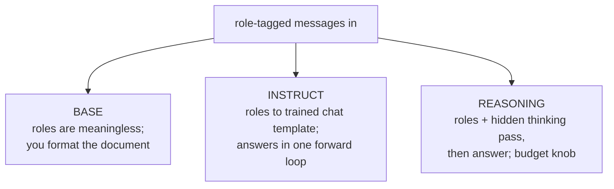

# Lecture 13: Base vs Instruct vs Reasoning Models

> When you call an LLM you are almost never talking to "the model" — you are talking to one of three *post-training stages* of it, and picking the wrong stage silently wastes money, latency, or answer quality. A base model completes text and ignores your instructions; an instruct model follows them in a message format; a reasoning model burns extra hidden "thinking" tokens before answering and charges you for every one. This lecture exists because "which kind of model is this, and is it the right kind for this task?" is a decision you will make dozens of times a week, and getting it wrong is one of the most expensive-per-keystroke mistakes in applied AI. After this lecture you will be able to tell the three apart mechanically, predict how each behaves, apply a concrete decision rule for when reasoning earns its cost, and map all three cleanly onto the system/user/assistant chat format you send over the wire.

**Prerequisites:** Lecture 7 (next-token prediction, sampling, prefill vs decode); comfort with tokens-as-billing-unit and basic arithmetic · **Reading time:** ~24 min · **Part of:** Phase 0 Week 3

---

## The core idea (plain language)

All three model types are the *same architecture* doing the *same thing* — next-token prediction (Lecture 7). What differs is **what they were trained to continue** and **what happens at inference time**. Think of it as three progressively-more-domesticated versions of one animal:

- **Base model** — trained only on "predict the next token in a giant pile of internet/text." It is a raw completer. It has enormous latent knowledge and zero manners. Ask it a question and it may answer, or it may write *three more questions*, because on the internet a question is often followed by more questions. It seems "dumb" not because it knows less, but because it was never taught that your text is an *instruction to be obeyed* rather than *a pattern to be continued*.

- **Instruct / chat model** — the base model further trained (SFT + RLHF, defined below) on examples of "here is an instruction / conversation, here is the helpful response." It learns the *convention* that text arriving in a specific message format is a request it should satisfy. This is the default thing you use: `gpt-4o`, `claude-sonnet`, `llama-3.1-8b-instruct`, `qwen2.5-instruct`.

- **Reasoning model** — an instruct-style model additionally trained to **spend tokens thinking before it answers**. Given a hard problem it generates a long internal scratchpad (often hidden from you), *then* writes the final answer. This "test-time compute" reliably improves multi-step problems (math, code, logic, planning) but is slower and you pay for the hidden thinking tokens. Examples: OpenAI's **o-series** (o1, o3, o4-mini), **Claude extended thinking**, **Gemini thinking**, **DeepSeek-R1**.

The one-line map to remember: **base completes, instruct obeys, reasoning deliberates then obeys.** Every production consequence below falls out of that sentence.

---

## How it actually works (mechanism, from first principles)

### Stage 0 — Pretraining gives you a base model

Pretraining is one objective repeated over trillions of tokens: given the tokens so far, predict the next one (Lecture 7). The corpus is raw text — web pages, books, code, forums. The result is a model that has compressed an astonishing amount of world knowledge and language ability into its weights, but has learned exactly one behavior: **continue the document in the most statistically-plausible way.**

That is why a base model "seems dumb." Feed it:

```
What is the capital of France?
```

A base model's most-likely continuation is often **not** `Paris`. On the training corpus, a line like that frequently appears inside a quiz, a worksheet, or a list — so the high-probability continuation might be:

```
What is the capital of France?
What is the capital of Germany?
What is the capital of Spain?
```

It is doing its job perfectly. It just wasn't trained to treat your line as a command. To *coax* a useful answer out of a base model you have to shape the document so that the answer is the natural continuation — few-shot examples, or a leading phrase:

```
Q: What is the capital of France?
A:
```

Now `Paris` is the plausible next token, because you built a document whose continuation *is* the answer. This is the world before instruct tuning: prompting was document engineering.

### Stage 1 — Instruction tuning turns a completer into an assistant

Two techniques, applied on top of the base model, produce the instruct/chat model you actually use:

- **SFT (Supervised Fine-Tuning):** show the model tens of thousands of curated `(instruction, good response)` pairs and train it to continue the instruction with the good response. This teaches the *format and habit* of answering. Cheap conceptually — it's still next-token prediction, just on a targeted dataset.

- **RLHF (Reinforcement Learning from Human Feedback)** and its cousins (RLAIF, DPO): humans (or an AI judge) rank multiple candidate responses; a reward signal is derived from those preferences; the model is nudged to produce responses humans prefer — more helpful, more honest, less toxic. This is what makes a model feel "aligned" and "polite," and also what installs refusals and safety behavior.

Crucially, instruction tuning **does not add knowledge** — it changes *behavior*. The base model already "knew" Paris; SFT/RLHF taught it that when your text arrives as an instruction, the desired continuation is the answer, not more questions. This is why instruct models can sometimes feel slightly *less* knowledgeable at the raw edges than their base counterparts — the tuning narrows the distribution toward "helpful assistant" style. For 99% of engineering work that trade is overwhelmingly worth it.

### Stage 2 — Reasoning training buys accuracy with tokens

A reasoning model is an instruct model trained (typically with large-scale RL on problems that have *checkable* answers — math, code, logic) to first emit a long chain of intermediate tokens — a scratchpad — and only then the final answer. The key mechanical insight:

> A transformer does a **fixed amount of computation per token.** The only way to spend *more* compute on a hard problem is to generate *more tokens.* Thinking tokens are literally how the model "buys more compute" at inference time.

This is called **test-time compute** (or inference-time scaling): instead of making the model bigger, you let it run longer on hard inputs. Empirically it moves the needle a lot on multi-step tasks and barely at all on simple ones.

Here is the same query through all three, side by side:

```
Prompt: "A shirt is $40 after a 20% discount. What was the original price?"

BASE:       "A shirt is $40 after a 20% discount. A jacket is $80 after..."
            (continues the worksheet — no answer)

INSTRUCT:   "The original price was $50."
            (fast; correct here, but on harder chains it may blurt a
             plausible-but-wrong number because it answers in one pass)

REASONING:  [hidden thinking: "40 is 80% of original. original = 40/0.8
             = 50. Check: 50 * 0.8 = 40. ✓"]
            "The original price was $50."
            (slower, spent ~150 hidden tokens, but far more robust as the
             arithmetic gets deeper)
```

### The hidden-token economics

The thinking tokens are usually **not shown to you** (providers hide the raw chain of thought, or show a summary), but you are **billed for them as output tokens**, and they add latency. A single reasoning call can silently emit hundreds to thousands of hidden tokens before the visible answer starts.

```
                    input          hidden thinking        visible output
INSTRUCT call:   [ 300 tok ] ─────────────────────────▶ [ 120 tok ]
                 you pay: 300 in + 120 out

REASONING call:  [ 300 tok ] ─▶ [ 1,800 tok thinking ] ─▶ [ 120 tok ]
                 you pay: 300 in + 1,920 out   ← ~16x the output bill
                 and time-to-answer waits for all 1,800 to decode first
```

Those `1,800` are illustrative, but the *shape* is exactly right and it is the single most surprising line item on a first reasoning-model invoice.

### It's still the chat message format

None of this changes the wire protocol. You still send a list of role-tagged messages:

```json
[
  {"role": "system",    "content": "You are a terse SQL assistant."},
  {"role": "user",      "content": "Count users created last week."},
  {"role": "assistant", "content": "SELECT COUNT(*) FROM users WHERE ..."}
]
```

- **base model:** conceptually has *no* notion of these roles. If you use a raw base checkpoint you concatenate text yourself; there is no trained meaning to "system" vs "user."
- **instruct model:** was trained on a *specific* template that turns those roles into special tokens (`<|im_start|>system … <|im_end|>` and friends). This is the **chat template** — send the wrong one to a raw open model and quality silently craters (that's a separate Week-3 pitfall; hosted APIs hide it for you).
- **reasoning model:** same message format, plus provider-specific knobs — e.g. a `reasoning_effort` / thinking-budget parameter, and (importantly) some reasoning models **ignore or restrict the system prompt** or a `temperature` setting, because their post-training bakes in how they think. Always check the model card.



---

## Worked example

You are building a feature that, given a customer support email, (a) classifies it into one of five categories and (b) drafts a reply. You have three sub-decisions. Let's price and reason about each with round numbers. Assume illustrative pricing of **$3 / 1M input tokens** and **$15 / 1M output tokens** (typical mid-tier instruct rates in 2025), and a reasoning model at the **same input rate but that emits ~10x the output tokens** including hidden thinking.

**Task A — classify the email into one of 5 labels.**
Input ≈ 600 tokens (the email + a short instruction). Output ≈ 3 tokens (just the label).

- Instruct: `600 × $3/1M + 3 × $15/1M ≈ $0.0018 + $0.00005 ≈ $0.0019`, ~0.4 s.
- Reasoning: same input, but it "thinks" ~800 tokens before emitting the label: `600 × $3/1M + 803 × $15/1M ≈ $0.0018 + $0.012 ≈ $0.014`, ~4 s.

Reasoning is **~7x the cost and ~10x the latency to produce a single label** that the instruct model gets right anyway. Classification into known buckets is pattern-matching, not multi-step deduction. **Use instruct.** Paying the thinking tax here is pure waste — and at 100k emails/day it's the difference between ~$190/day and ~$1,400/day for identical output.

**Task B — draft a friendly reply.**
This is generative but shallow: tone and structure, not logic. Instruct handles it well. Reasoning would think about... phrasing, mostly, and cost 10x. **Use instruct**, maybe with a slightly higher temperature.

**Task C — the email disputes a bill with a multi-step calculation** ("I was charged for 3 seats at the annual rate but two were added mid-cycle, so the proration should be...").
Now the reply requires *correct multi-step arithmetic and policy application*, and a wrong number is a real, escalating error. An instruct model may confidently produce a plausible-but-wrong proration (Lecture 7: fluency ≠ correctness). A reasoning model's scratchpad materially reduces that error rate. **This is where reasoning earns its cost.** The extra ~$0.01 and few seconds are trivial against the cost of a wrong billing statement to a customer.

The lesson: **the right model is per-task, not per-app.** A mature system routes — cheap instruct for A and B, reasoning only for the C-shaped minority. That router *is* the "model economics" thinking this phase is teaching you to quantify.

---

## How it shows up in production

**The invoice shock.** Teams switch a pipeline to a reasoning model "because it's smarter," and the bill jumps 5–20x with no change in code, because they're now paying for thousands of hidden output tokens per call. Output tokens are already the expensive half (Lecture 7: decode is the sequential, priced-higher phase); reasoning multiplies exactly that half. Always monitor *output* token counts after adopting a reasoning model — the provider usually reports "reasoning tokens" separately; log them.

**The latency cliff.** Time-to-first-*visible*-token on a reasoning model includes the entire thinking pass. A model that "responds in 800 ms" as instruct can take 5–30 s as reasoning. This is fatal for interactive/streaming UX and fine for batch/async. Route by latency budget: user-facing autocomplete → instruct; overnight report generation → reasoning is fine.

**Base models are rarely what you want — and occasionally exactly what you want.** You almost never call a base model for a product feature. But base models shine for: (1) *fine-tuning your own instruct model* from a clean starting point, (2) raw text-completion tasks (code autocomplete mid-file, where you literally want continuation not conversation), and (3) research/logprob analysis without RLHF's behavioral overlay. Knowing a checkpoint is "base" vs "instruct" also prevents the classic Hugging Face mistake: downloading `Llama-3-8B` (base) when you meant `Llama-3-8B-Instruct` and wondering why it won't follow instructions.

**Reasoning models change your prompting.** They are trained to do the decomposition themselves, so the old trick of writing "Let's think step by step" or hand-crafting elaborate chain-of-thought prompts is often **redundant or even counterproductive** — you're fighting the model's own process. Reasoning models generally want *concise, clear problem statements* and get worse when you over-instruct the reasoning. Instruct models, by contrast, still benefit from explicit step-by-step prompting. Same prompt, opposite advice — a real footgun.

**Debugging "it got dumber."** If an instruct model suddenly gives shallow, one-line answers to a hard problem, the fix is often *not* a bigger instruct model — it's switching that call to a reasoning model or adding explicit CoT. Conversely, if a reasoning model is "overthinking" a trivial task (slow, expensive, sometimes talks itself out of the right answer), downgrade to instruct or turn the thinking budget down.

**The system prompt caveat.** Some reasoning models restrict, ignore, or handle the system role differently, and several disallow `temperature`/`top_p` tuning. Code that assumes "every model takes a system prompt and a temperature" breaks when you route a call to o-series. Read each model card; don't assume parameter parity across the three types.

---

## Common misconceptions & failure modes

- **"The base model is a worse/smaller model."** No — it's the *same* weights before instruction tuning (or the ancestor of the instruct model). It often knows *more* raw facts; it just wasn't taught to obey. "Dumb" = untamed, not unknowledgeable.
- **"Reasoning models are just instruct models with a hidden 'think step by step' prompt."** Not quite. They're *trained* (usually via RL on checkable problems) to reason, and the thinking is a real, billed generation pass, not a prompt trick. You can approximate reasoning on an instruct model with CoT prompting, but a purpose-trained reasoning model is meaningfully better on hard multi-step tasks.
- **"Reasoning is always smarter, so default to it."** It's smarter *on multi-step problems* and simply slower/pricier on everything else — and can even be *worse* on trivial tasks by overthinking. Defaulting to reasoning is how you get a 10x bill for no quality gain.
- **"I can read the model's chain of thought to debug it."** Providers usually **hide or summarize** the raw thinking (both for competitive and safety reasons). Don't build logic that parses hidden reasoning; you may only get a summary, and it can change. Treat the thinking as an internal detail you pay for but don't control.
- **"Adding 'think step by step' to a reasoning model helps."** Often redundant or harmful — it already reasons. Keep prompts to reasoning models clean and let them work.
- **"An instruct model that hallucinates a wrong number needs a better instruct model."** If the task is genuinely multi-step, the fix is a *reasoning* model (or tool use / a calculator), not a marginally larger instruct model. Fluency ≠ correctness; more fluency doesn't add a reasoning step.
- **"All three take the same API parameters."** Reasoning models frequently restrict `temperature`/system prompts and add a thinking-budget knob. Assume parity and your router will throw at runtime.

---

## Rules of thumb / cheat sheet

- **base = completes · instruct = obeys · reasoning = deliberates then obeys.** Pick per task, not per app.
- **Default to instruct/chat.** It's the right tool for the large majority of production calls: classification, extraction, drafting, chat, summarization, simple Q&A.
- **Reach for reasoning only when the task has genuine multi-step structure AND a wrong answer is costly:** hard math, non-trivial code, logical/planning problems, competition-style puzzles, multi-constraint optimization.
- **Decision rule (memorize):** *Does the task need several dependent deduction steps where an early mistake ruins the result?* If **yes** and correctness matters → reasoning. If **no** (pattern-match, format, tone, lookup, single-step) → instruct. If you're unsure, prototype both on 20 examples and compare accuracy vs cost/latency.
- **Reasoning costs = you pay for hidden thinking tokens (billed as output) + higher latency.** Budget 5–20x the output token count and seconds-not-milliseconds of latency. Log "reasoning tokens" separately.
- **Never use reasoning for interactive/streaming low-latency UX** unless you've measured the think-time and it fits.
- **base is for fine-tuning, raw completion (mid-file code), and logprob research** — not for product features that need instruction-following.
- **On Hugging Face, `-Instruct` / `-Chat` / `-it` suffix = instruction-tuned; no suffix = base.** Grab the wrong one and instruction-following vanishes.
- **Don't hand-write chain-of-thought prompts for reasoning models** (redundant/harmful); *do* use step-by-step prompting to squeeze more reasoning out of an instruct model.
- **Check the model card for parameter support** — reasoning models may ignore `temperature`/system prompts and expose a thinking-budget/effort knob instead.
- All three still ride the **system/user/assistant message format**; the difference is what the roles *mean* to the model and what happens between input and visible output.

---

## Connect to the lab

This is the theory behind Week 3's **Theory bullet on model types** and the **Model Economics CLI** milestone. In the `econ cost` command, add or reason about a reasoning-model row and make its projected *output* tokens include an estimated thinking budget — that's where the 5–20x output multiplier shows up as real dollars in your comparison table. In the `notebooks/03_landscape.ipynb` chat-template exercise, print `apply_chat_template` for an instruct model and contrast it with feeding a raw base checkpoint (or the wrong template) so you *feel* why base "won't answer." Watch for: (1) the reasoning-model bill being dominated by hidden output tokens, not input; and (2) an instruct model confidently getting a multi-step arithmetic prompt wrong where a reasoning model gets it right — that contrast is the whole lecture in one cell.

---

## Going deeper (optional)

- **OpenAI docs — "Reasoning models"** guide (platform.openai.com/docs). Read how o-series bills reasoning tokens, restricts params, and how they recommend prompting it. Search: `OpenAI reasoning models guide`.
- **Anthropic docs — "Extended thinking"** (docs.anthropic.com). How Claude's thinking budget works, what's visible, and when to enable it. Search: `Anthropic extended thinking`.
- **DeepSeek-R1 paper / model card** (Hugging Face `deepseek-ai/DeepSeek-R1`). The best openly-documented example of RL-trained reasoning; read the card for how the reasoning behavior was trained. Search: `DeepSeek-R1 paper`.
- **Google Gemini docs — "Thinking"** (ai.google.dev). Gemini's thinking models and budget controls. Search: `Gemini thinking mode docs`.
- **InstructGPT paper — "Training language models to follow instructions with human feedback"** (OpenAI, 2022). The canonical description of SFT + RLHF that created the instruct paradigm. Search that exact title.
- **Andrej Karpathy — "Intro to Large Language Models"** (YouTube). The pretraining → SFT → RLHF pipeline explained at engineer level; complements this lecture's Stage 0–2.
- Search query for the current debate on inference-time scaling: **"test-time compute scaling laws"** — read to understand why "think longer" trades compute for accuracy.

---

## Check yourself

1. You paste `What is the capital of France?` into a raw base model and it responds with three more country questions instead of "Paris." Explain mechanically why, in one sentence, and describe how you'd reshape the prompt to get an answer without any fine-tuning.
2. Instruction tuning (SFT + RLHF) is often said to "not add knowledge." If so, what does it actually change, and why does that make an instruct model more useful than its base counterpart?
3. A reasoning model and an instruct model both return the string `"$50."`. Your invoice for the reasoning call is 8x higher. Where did the money go, and why doesn't it show up in the visible response?
4. Give one concrete task where a reasoning model clearly earns its extra token cost and one where it's pure waste, and state the property of the task that decides it.
5. Why is "Let's think step by step" good advice for an instruct model but often redundant or harmful for a reasoning model?
6. Your team routes an interactive autocomplete feature to an o-series reasoning model and users complain the UI "hangs." What happened, and what's the fix?

### Answer key

1. A base model is trained only to continue text in the most statistically-plausible way, and on its corpus a standalone question is often followed by *more* questions (quizzes/lists), so that's the high-probability continuation — it was never taught your line is a command to obey. Reshape it into a document whose natural continuation *is* the answer, e.g. few-shot `Q: ... A: ...` pairs or a trailing `A:`, so `Paris` becomes the plausible next token.
2. It changes *behavior*, not stored knowledge: SFT teaches the format/habit of answering instructions, and RLHF nudges outputs toward what humans prefer (helpful, honest, safe) and installs refusals. The base already "knew" the facts; tuning makes it treat message-formatted text as a request to satisfy, which is what makes it usable as an assistant.
3. Into hidden **thinking tokens** — the reasoning model generated a long internal scratchpad before the visible answer, and those are billed as output tokens (the expensive half). They don't appear in the response because providers hide or only summarize the raw chain of thought.
4. *Earns it:* a multi-step billing proration / hard math / non-trivial code problem where an early error ruins the result and a wrong answer is costly. *Waste:* classifying an email into one of five known labels (single-step pattern-match). The deciding property is whether the task requires several dependent deduction steps where correctness matters — if not, reasoning just adds cost and latency.
5. An instruct model answers in essentially one pass, so explicitly prompting step-by-step reasoning adds a decomposition it wouldn't otherwise do and improves hard answers. A reasoning model is already *trained* to decompose and think before answering, so telling it to think step by step is redundant and can interfere with its own process, sometimes lowering quality.
6. Time-to-first-visible-token on a reasoning model includes the entire hidden thinking pass, so latency jumps from milliseconds to seconds — the UI is waiting on the think budget, not hung. Fix: route interactive/low-latency calls to an instruct model (or a reasoning model with a very small thinking budget), and reserve reasoning for async/batch or clearly non-interactive high-stakes steps.
