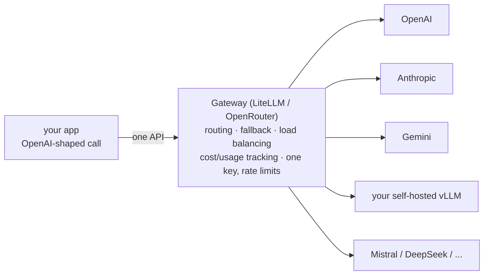

# Lecture 14: Open vs Closed Models & Gateways

> Sooner or later someone in a meeting says "we should just self-host an open model, it's free." Someone else says "no, the API is fine, don't reinvent ops." Both are usually wrong for the wrong reasons, because the real decision isn't "open vs closed" — it's a handful of measurable axes (data sensitivity, cost-at-volume, latency/SLA, license, capability gap) that point different ways for different products. This lecture turns the one-paragraph Week 3 recap into the decision framework you'll actually use. After it you can reason about a model-hosting choice with numbers instead of ideology, do the break-even arithmetic that tells you *when* self-hosting starts to win, read an open-weight license well enough to know if you're allowed to ship it, and explain what a gateway (LiteLLM, OpenRouter) buys you and where it fits.

**Prerequisites:** Lecture 9 (tokenization & cost per token), Lecture 12/13 on VRAM & quantization (7B at fp16 ≈ 14 GB), the transformer loop (Week 2) · **Reading time:** ~26 min · **Part of:** Phase 0 Week 3

---

## The core idea (plain language)

There are two ways to get a large language model to answer your requests, and they trade the same fundamental resource: **control vs convenience.**

- **Closed (hosted) models** — OpenAI (GPT), Anthropic (Claude), Google (Gemini). You send text over HTTPS to someone else's GPUs and get tokens back. You do *zero* operations: no drivers, no GPUs, no autoscaling, no on-call for a model server. You get frontier quality on day one. In exchange, **your data leaves your premises**, you pay a per-token price the vendor sets and can change, and you're exposed to **vendor lock-in** (their API shape, their model deprecations, their rate limits, their outages).

- **Open (open-weight) models** — Llama (Meta), Qwen (Alibaba), Mistral, DeepSeek, Gemma (Google). The **weights are downloadable**. You run them on hardware you control: your cloud GPUs, your on-prem box, or a specialized inference provider. Now **the data never leaves your boundary** (if you host it yourself), you can tune and quantize freely, and at high volume the economics can flip in your favor. In exchange, you **own the ops** — GPUs, drivers, batching, scaling, uptime — and you inherit a **license you must actually read**, because "open weights" does *not* automatically mean "free for any commercial use."

A crucial vocabulary correction up front: almost none of these are **open-source** in the OSI sense. They are **open-weight**. You get the trained parameters, usually *not* the training data and often *not* an unrestricted license. Treat "open" as "I can download and run the weights," and then go read the specific license — because the license is one of the five axes that decides the whole thing.

The rest of this lecture is those five axes, the break-even math behind the cost axis, and the gateway layer that lets you stop treating this as a one-time either/or decision.

---

## How it actually works (mechanism, from first principles)

### The five decision axes

Forget "open vs closed" as a binary. Every real decision is a weighted vote across five axes. Score your use case on each; the axes rarely all point the same way, and the tension between them *is* the design work.

```
                     leans CLOSED (hosted API)        leans OPEN (self-host)
1. Data sensitivity  public/low-risk data             regulated / PII / air-gapped
2. Cost at volume    low or spiky volume              high, steady, predictable volume
3. Latency / SLA     fine with p99 of a shared API    need tight tail latency / your own SLA
4. License           don't care, vendor ToS is fine   need to fine-tune/redistribute/embed
5. Capability gap     task needs frontier quality      an open model is "good enough"
```

**Axis 1 — Data sensitivity.** When you call a hosted API, your prompt (and often the completion) transits and is processed on the vendor's infrastructure. Enterprise tiers contractually promise **no training on your data** and offer zero-retention modes, and the big vendors carry SOC 2 / HIPAA / GDPR postures. That's enough for most companies. But some data legally *cannot* leave a boundary — defense, certain health/financial workloads, EU-data-residency contracts, fully air-gapped environments. For those, self-hosting an open model isn't cheaper or better; it's the *only* option. This axis can single-handedly decide the whole thing regardless of the other four.

**Axis 2 — Cost at volume.** Hosted APIs are pure **opex**: you pay per token, $0 when idle, and it scales linearly with usage. Self-hosting is mostly **fixed cost**: you rent (or buy) a GPU and pay for it whether it serves 10 requests/day or 10 million. That's the entire shape of the trade — a flat per-token line vs a flat monthly-rent line. They cross somewhere. Below the crossover, the API is cheaper; above it, self-host wins. We compute that crossover in the worked example.

**Axis 3 — Latency / SLA.** A hosted API's latency is *someone else's* p50/p99, shared across every customer, and it moves without warning (a viral launch, a capacity crunch). You cannot fix their tail latency; you can only add timeouts and fallbacks. Self-hosting gives you a latency budget you *own*: you pick the GPU, the batch size, the max concurrency, and you can put the model physically next to your app to kill network round-trips. If you have a hard SLA (e.g., "p99 under 800 ms" in a contract), owning the serving path is often the only way to guarantee it.

**Axis 4 — License.** This is the one engineers skip and lawyers later panic about. "Open weights" spans a wide legal range (detailed below). Some are true Apache-2.0 (do anything). Some have usage caps or field-of-use restrictions. Some forbid using outputs to train competing models. If your plan is to fine-tune, redistribute, embed in a shipped product, or serve at scale, you must confirm the license *allows that specific act.*

**Axis 5 — Capability gap.** Be honest about whether an open model is actually good enough for *your* task. For extraction, classification, routing, summarization of ordinary text, and most RAG answer-generation, a good open 8B–70B is frequently indistinguishable from a frontier closed model. For the hardest reasoning, long-horizon agentic work, cutting-edge coding, and niche capabilities, frontier closed models still tend to lead. The gap narrows every few months, so re-measure — but measure on *your* eval set, not a leaderboard (same discipline as embeddings in Lecture 10).

### The cost axis, mechanically: opex line vs capex line

Two cost models, two shapes:

```
$/month
  │                                          ● self-host (flat rent: GPU $/mo, fixed)
  │                                     ●
  │        hosted API (per-token) ●  ●
  │                          ●   ╱
  │                     ●      ╱  ← break-even: volume where the lines cross
  │                ●        ╱
  │           ●         ╱
  │      ●          ╱
  │  ●          ╱  (self-host flat line)
  └────────────────────────────────────────► requests / tokens per month
     low volume: API cheaper      high volume: self-host cheaper
```

The hosted line is `tokens × price_per_token` — starts at zero, rises with use. The self-host line is `GPU_rent_per_month + a bit of ops` — flat, paid even when idle, but it doesn't rise with volume until you saturate the GPU and must add another. The **break-even** is the volume where `tokens × price = GPU_rent`. Below it, opex wins; above it, capex wins. The trap on the self-host side is **utilization**: a $1,500/month GPU that sits 90% idle is wildly *more* expensive per token than the API. Self-hosting only pays off when you keep the GPU *busy*.

### The license spectrum (2025–2026)

Not a binary; a spectrum from "do anything" to "read carefully."

- **Apache-2.0 / MIT** — genuinely permissive. Commercial use, fine-tuning, redistribution, all fine. Examples in this class of weight releases: **Qwen** (many recent releases are Apache-2.0), **Mistral** base/open models (Apache-2.0), **DeepSeek** (MIT-style license on several releases). Verify per specific model/version.
- **Custom "community" licenses with conditions** — the **Llama Community License** (Meta) permits broad commercial use *but* historically added conditions such as a monthly-active-user threshold above which you must request a separate license, plus acceptable-use rules and branding/attribution requirements. **Gemma** ships under Google's own terms with a prohibited-use policy. These are usable by most companies but you must confirm you're under the thresholds and following the terms.
- **Non-commercial / research-only** — some weights (and many *fine-tuned derivatives* and datasets) are released research-only. Shipping these in a product is a license violation.

Three engineering-relevant gotchas: (1) the **model's** license and its **training-data/derivative** license can differ; (2) a fine-tune inherits *and can add* restrictions from its base and its tuning data; (3) some licenses restrict using outputs to train competing models. When in doubt, the model card + `LICENSE` file on Hugging Face is the source of truth — and get a human lawyer for anything you ship at scale.

---

## Worked example

Let's do the break-even that decides Axis 2 with round, recognizable numbers. **All figures are illustrative rules-of-thumb — plug in today's real prices before you decide anything.**

**Scenario.** A support-ticket classifier/summarizer. Each request ≈ **1,000 input tokens + 300 output tokens = 1,300 tokens**. Volume: **2 requests/second sustained** during business hours.

Monthly volume (assume ~200 business hours/month for a steady daytime load):
```
2 req/s × 3600 s/hr × 200 hr/mo = 1,440,000 requests/month
tokens/mo = 1.44M × 1,300 = 1.872 billion tokens/month
  input  = 1.44M × 1000 = 1.44B input tokens
  output = 1.44M × 300  = 0.432B output tokens
```

**Option A — hosted mid-tier closed model.** Use an illustrative blended price of **$0.30 / 1M input** and **$1.20 / 1M output** (these are ballpark 2025-era mid-tier numbers — check current pricing):
```
input  cost = 1,440 (M tokens) × $0.30 = $432
output cost =   432 (M tokens) × $1.20 = $518
API total   ≈ $950 / month, and it's $0 the months you're idle.
```

**Option B — self-host an open ~8B model (e.g., Llama-3-8B / Qwen-8B class), int4.**
From the VRAM lecture: 8B at int4 ≈ 8 × 0.5 = **4 GB weights**, plus KV cache + activations → comfortably fits a **single 24 GB GPU** (e.g., an L4/A10-class card) with room for batching. Illustrative rent: **~$1.00/hr for a 24 GB cloud GPU running 24/7**:
```
GPU rent = $1.00/hr × 24 × 30 = ~$720 / month (one GPU, always on)
+ ops/monitoring/eng time (amortized): call it +$300–$800/mo realistically
Self-host total ≈ $1,000–$1,500 / month at THIS volume.
```

**Read the result honestly.** At 1.44M requests/month the two options are *roughly the same* (~$950 API vs ~$1,000+ self-host once you count ops). So at this volume the API wins on *total cost of ownership* because it carries zero ops burden and zero idle cost. The self-host only pulls ahead when you can **push far more traffic through that same already-paid-for GPU.**

**Now 10× the volume** to 14.4M requests/month:
```
API:        ≈ $9,500 / month (scales linearly with tokens)
Self-host:  if one 24 GB GPU can serve the throughput with good batching,
            still ≈ $720 GPU + ops. Say you need 2 GPUs for headroom:
            ≈ $1,440 GPU + ops ≈ $2,000–$2,500 / month.
```
At 10× volume the self-host is **~4× cheaper** — because the GPU cost barely moved while the API bill scaled linearly. *That's* the crossover made concrete: the more steady tokens you can pin to a saturated GPU, the more self-hosting wins. The break-even here sits somewhere between 1× and 10× — roughly where monthly API spend clears ~$1.5–2k/month of steady, batchable traffic.

**The three things that move the break-even:**
1. **Utilization.** The self-host number assumed a *busy* GPU. At 10% utilization your effective per-token cost is 10× worse — often worse than the API. Spiky/low traffic favors the API.
2. **Model size.** A 70B needs far more/bigger GPUs (70B int4 ≈ 35 GB → multi-GPU), pushing the crossover to much higher volume. An 8B on one cheap GPU crosses early.
3. **Ops cost is real.** The "+$300–$800/mo" ops line is the one spreadsheets omit and reality charges anyway — on-call, upgrades, GPU incidents. Include it or your break-even is a fantasy.

---

## How it shows up in production

**"Data leaves premises" is a compliance fact, not a vibe.** With hosted APIs your prompts hit a third party. For most teams the enterprise contract (no-training, zero-retention, SOC 2/HIPAA) closes this. But when Legal says data cannot leave the boundary, no amount of "but the API is convenient" changes it — you self-host, full stop. Design for it early; retrofitting an air-gapped deployment onto an API-shaped app is painful.

**Vendor lock-in bites in three concrete ways.** (1) **API shape** — you coded to OpenAI's Chat Completions or Anthropic's Messages format and now migrating means touching every call site. (2) **Model deprecation** — the exact model version you validated and prompt-tuned gets retired on the vendor's schedule, forcing a re-eval and possible prompt rewrites (prompts are not perfectly portable across models). (3) **Capacity/pricing** — a price hike or a rate-limit tightening lands on you with little recourse. The mitigation for all three is the gateway layer (next section) plus keeping your prompts and evals model-agnostic.

**Self-hosting is a *serving* project, not a *download* project.** Getting a model to emit tokens on your laptop is an afternoon. Serving it at production quality is: a real inference server (vLLM, TGI, SGLang, or llama.cpp for CPU/edge) doing **continuous batching** so the GPU isn't idle between requests; autoscaling for load; health checks and failover; GPU quota and capacity planning; observability (tokens/sec, queue depth, VRAM headroom); and someone on-call when a driver update breaks CUDA at 2 a.m. Budget for this. The "free model" is free like a free puppy.

**Chat templates and tokenizers are your problem now (Lecture 9 + Week 3 spine).** Hosted APIs hide the prompt formatting. Self-host an instruct model and you must apply the *exact* chat template it was trained with (`tokenizer.apply_chat_template`) or quality silently craters with no error. This is a recurring "why is my self-hosted model dumber than the demo" bug.

**Quality parity is task-specific and time-sensitive.** Don't argue it in the abstract — measure. Stand up the open candidate behind the same interface, run your eval set, compare to the closed model on *your* metric and *your* latency budget. The answer changes every few months as new open weights land, so make the eval cheap to re-run.

**The pragmatic majority pattern: hybrid + gateway.** Most mature systems don't pick one. They route the cheap, high-volume, low-sensitivity calls to a self-hosted open model, and the hard or sensitive calls to a closed API — behind a single gateway so the app doesn't care. That's the setup you'll build toward in Phases 9–10.

### Gateways / routers: one API, fallback, routing

A **gateway** (a.k.a. LLM router/proxy) sits between your application and every model provider and exposes **one API** — almost always the OpenAI Chat Completions shape — while translating to each backend under the hood.



Two you'll meet by name:

- **LiteLLM** — an open-source library/proxy you run yourself. Call 100+ providers (including your own self-hosted vLLM/Ollama endpoint) through the OpenAI format. Its **proxy server** adds a virtual-key layer, per-team budgets, spend tracking, caching, and **fallback chains** ("try model A; on error/timeout fall back to B, then C"). This is the one the spine says you'll "use heavily later" — it's the glue for a hybrid open/closed setup.
- **OpenRouter** — a *hosted* gateway service: one account, one API key, one bill, and access to hundreds of models across providers with automatic fallback and price/latency-based routing. Great for experimentation and for shipping without signing up with every vendor individually — at the cost of adding *another* third party to your data path (relevant to Axis 1).

What a gateway buys you, concretely:

1. **De-risks lock-in.** Your code targets one API; swapping GPT→Claude→a self-hosted Llama is a config change, not a refactor. This is the single best mitigation for the API-shape lock-in above.
2. **Fallback = resilience.** When provider A returns a 429/500 or times out, the gateway retries on B automatically. Your uptime stops being any single vendor's uptime.
3. **Routing.** Send cheap/bulk traffic to a cheap or self-hosted model and hard traffic to a frontier model — by rule, by cost, or by latency. This is exactly the hybrid pattern.
4. **One place for cost tracking, keys, rate limits, and caching.** Centralized spend visibility and budget caps instead of N provider dashboards.

The trade-off: a gateway is one more hop (a little latency) and, if hosted, one more party in your data path. Self-hosting LiteLLM keeps the data-path story clean; using OpenRouter trades some data control for maximum convenience.

---

## Common misconceptions & failure modes

- **"Open means free."** Two errors in one. (a) *Legally*: open-weight ≠ open-source ≠ unrestricted commercial use — read the license (Llama's MAU threshold, Gemma's use policy, research-only derivatives). (b) *Economically*: you trade per-token fees for GPU rent + ops payroll. Below break-even, "free" is more expensive than the API.
- **"Self-hosting is always cheaper at scale."** Only if the GPU is *utilized*. An idle or under-batched GPU can cost more per token than the API. Break-even assumes you keep it busy with continuous batching.
- **"We'll self-host to keep data private, using OpenRouter."** Contradiction: OpenRouter is a third party. If privacy is the goal (Axis 1), you must host the model *and* the gateway inside your boundary.
- **"Prompts are portable, so switching models is free."** They mostly transfer but not perfectly — a prompt tuned on GPT can underperform on Claude or Llama. Switching models means re-running your eval set, not just changing a string.
- **"The open model matched the closed one on the leaderboard, so we're good."** Leaderboards are averages over public tasks. Validate on *your* data and *your* latency budget (same lesson as MTEB in Lecture 10).
- **"Zero ops with a gateway."** A gateway removes provider *sprawl*, not the operational reality of a self-hosted backend behind it. You still run vLLM, GPUs, and on-call.
- **"Enterprise API = my data is used for training."** For the major vendors' business/enterprise tiers, the contract typically says the opposite (no training on your data, retention controls). Read the specific DPA; don't assume either way.
- **"Deprecation won't affect me."** Closed vendors retire model versions on their schedule. The exact snapshot you validated *will* eventually go away; plan a re-eval cadence.

---

## Rules of thumb / cheat sheet

- **Decide on five axes, not the binary:** data sensitivity · cost-at-volume · latency/SLA · license · capability gap. Score each; expect them to disagree.
- **Default for most teams starting out:** closed API behind a **gateway**. Zero ops, frontier quality, and the gateway keeps you portable. Revisit when volume or sensitivity changes.
- **Self-host when** any of: data legally can't leave your boundary; steady high volume clears the break-even; you need an SLA you control; or you must fine-tune/redistribute under a license that allows it.
- **Break-even instinct:** API cost `= tokens × price`; self-host cost `≈ GPU_rent + ops`, flat. Self-host wins only above the crossover *and* only at high GPU utilization. Roughly, steady batchable traffic north of ~$1.5–2k/month API spend is where you start doing the math seriously.
- **VRAM reflex (from Week 3):** params(B) × bytes/quant = weights. int4 = 0.5 B/param → 8B ≈ 4 GB, 70B ≈ 35 GB; add 20–40% for KV cache + activations.
- **Read the LICENSE file, per model, per version.** Apache-2.0/MIT (Qwen/Mistral/DeepSeek variants) = permissive; Llama community license = commercial-with-conditions (watch the MAU threshold); Gemma = Google terms + use policy; many fine-tunes/datasets = research-only.
- **Always use a gateway (LiteLLM self-hosted, or OpenRouter)** so model choice is config, not code — this is your lock-in insurance and your fallback/resilience layer.
- **Never mix privacy and a hosted gateway.** If Axis 1 says self-host, self-host the gateway too.
- **Re-measure the capability gap quarterly** on your own eval set; open models close it fast.

---

## Connect to the lab

This lecture is the reasoning behind **Week 3 Objective 2** and it feeds the **Model Economics CLI** milestone directly. The `econ cost` command is your break-even calculator's numerator — token counts and $ across GPT/Claude/an open model — and `econ vram` is the denominator on the self-host side (how big a GPU an open model needs, hence its rent). When you run them together you're literally computing the two lines in the break-even chart. Watch for: (1) different families need different tokenizers (tiktoken is OpenAI-only), so your open-model cost is an approximation — label it; (2) the VRAM number is weights-only, so add KV/activation headroom before you price a GPU; (3) if you wire a self-hosted Ollama endpoint into your `llm.py`, you've effectively built the "self-host backend behind one interface" half of a gateway — note where LiteLLM would slot in for real fallback/routing.

---

## Going deeper (optional)

- **LiteLLM documentation** (`docs.litellm.ai`) — read *Proxy Server*, *Fallbacks*, *Routing*, and *Budgets/Virtual Keys*. The canonical open-source gateway; also skim the GitHub repo `BerriAI/litellm`.
- **OpenRouter docs** (`openrouter.ai/docs`) — the model catalog, routing/fallback, and how billing/keys work through one endpoint.
- **Provider model + pricing pages** — OpenAI (`platform.openai.com/docs/models` and its pricing page), Anthropic (`docs.anthropic.com`), Google Gemini (`ai.google.dev`). Always read *current* pricing; the numbers in this lecture are illustrative.
- **Open-weight model cards & licenses on Hugging Face** — `meta-llama/*` (Llama Community License), `Qwen/*`, `mistralai/*`, `deepseek-ai/*`, `google/gemma-*`. The `LICENSE` file and model card are the source of truth for commercial terms. Search: *"Llama community license MAU threshold"*, *"Gemma prohibited use policy"*.
- **vLLM documentation** (`docs.vllm.ai`) — the standard high-throughput self-hosting server; read the section on *continuous batching* to understand the utilization argument in the cost math. Alternatives: **Hugging Face TGI**, **SGLang**, **Ollama/llama.cpp** for CPU/edge.
- **Open Source Initiative — "Open Source AI Definition"** — search that phrase for why "open-weight" ≠ "open-source" and the ongoing debate. Useful for the license axis.
- Phases **9 and 10** of this roadmap take this from decision to build: standing up self-hosted inference, wiring LiteLLM for hybrid routing/fallback, and the full cost-at-scale analysis you previewed here.

---

## Check yourself

1. Name the five decision axes. Give one real scenario where a single axis overrides all the others.
2. Your app does 500k requests/month at ~1,000 tokens each, very spiky (mostly idle, big daytime bursts). API blended cost is ~$0.60/1M tokens; a suitable GPU rents at ~$720/month. Roughly, which is cheaper, and what one factor most threatens the self-host case here?
3. A colleague says "we'll download Llama and ship it, it's open source and free." Correct the two distinct errors in that sentence.
4. What specifically does a gateway like LiteLLM protect you from, and name the three concrete ways vendor lock-in bites without one?
5. You must keep all prompt data inside your compliance boundary. Can you use OpenRouter to get fallback across providers? Why or why not — and what's the compliant alternative?
6. An open 8B model matched a frontier closed model on a public leaderboard. Before you switch production traffic to the self-hosted 8B, what two things must you verify, and why is the leaderboard result insufficient?

### Answer key

1. **Data sensitivity, cost-at-volume, latency/SLA, license, capability gap.** Override example: if data legally cannot leave your boundary (air-gapped/regulated), **data sensitivity** forces self-hosting regardless of cost, capability, or convenience. (Equally, a research-only license can forbid shipping no matter how good/cheap the model is.)
2. API cost ≈ 500k × 1,000 = 500M tokens × $0.60/1M = **~$300/month**, and ~$0 when idle. Self-host is **~$720/month** GPU rent (before ops) whether busy or not. The **API is cheaper here**, and the factor that kills the self-host case is **low utilization** — a spiky, mostly-idle workload pays full GPU rent for a mostly-idle GPU, making its effective per-token cost far worse.
3. (a) **"Open source"** is wrong — Llama is **open-weight** under a *community license* with conditions (e.g., an MAU threshold above which you need a separate license, plus use restrictions), not OSI open-source. (b) **"Free"** is wrong economically — you replace per-token API fees with GPU rent + ops/engineering cost, which below the break-even volume is *more* expensive than the API.
4. A gateway makes model choice **config instead of code** and adds **automatic fallback**, so it protects you from vendor lock-in and single-vendor outages. The three lock-in bites without one: (1) **API shape** — code coupled to one vendor's request format; (2) **model deprecation** — the exact version you validated/tuned gets retired on the vendor's schedule; (3) **pricing/capacity** — price hikes or rate-limit tightening with no recourse.
5. **No** — OpenRouter is a hosted third party, so your prompt data would leave your boundary, violating the requirement. The compliant alternative is to **self-host the models** *and* run a gateway **inside your boundary** (e.g., LiteLLM proxy self-hosted), giving you fallback/routing across your *own* endpoints without data leaving.
6. Verify (1) **quality on your own eval set** (leaderboards are averages over public tasks that may not resemble your workload — same lesson as MTEB) and (2) that it **meets your latency/SLA and throughput budget on the GPU you'll actually run**, including correct **chat-template** application. The leaderboard says nothing about *your* task, *your* tail latency, or *your* serving setup.
