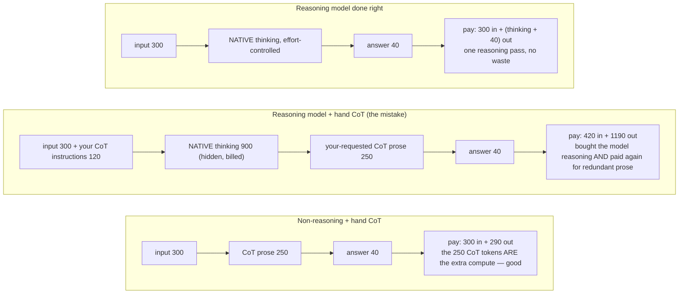

# Lecture 6: Chain-of-Thought, Correctly

> "Let's think step by step" was the most famous prompt of 2022, and copying it onto a 2025 reasoning model is now one of the most common ways to *waste money and lower quality* at the same time. Chain-of-thought (CoT) is not a magic incantation you sprinkle everywhere — it is a mechanism that either buys accuracy or burns tokens, and which one you get depends entirely on the *class* of model you're calling and the *shape* of the task. This lecture exists because the CoT decision splits cleanly into two worlds — non-reasoning models, where you may still hand-write reasoning, and reasoning models, where you must not — and getting the split right is a per-call decision you'll make constantly. After this lecture you'll be able to pick the right reasoning strategy per model class, write a clean two-pass "reason-then-extract" template that keeps scratchpad out of your parsed JSON, and — crucially — *prove* your choice was right with a direct-vs-CoT A/B and an effort sweep rather than repeating folklore.

**Prerequisites:** Lecture 13 (base vs instruct vs reasoning models), Lecture 5 (prompt anatomy / structured outputs), comfort with JSON parsing and basic arithmetic on token costs · **Reading time:** ~26 min · **Part of:** Phase 1 Week 2

---

## The core idea (plain language)

A transformer does a **fixed amount of computation per token it generates** (Lecture 13). A hard question — multi-step arithmetic, a logic chain, a proration — needs *more* computation than fits in the handful of tokens of a bare answer. There are exactly two ways to give the model that extra compute:

1. **You make it generate the reasoning yourself, in the prompt era's style** — "reason step by step, then answer." The model spends output tokens laying out intermediate steps, and because each of those tokens carries a forward pass of compute, the final answer rides on top of work already done. This is **hand-written chain-of-thought**, and it is the correct tool for a *non-reasoning* (plain instruct) model.

2. **The model was trained to do it natively** — a reasoning model (OpenAI o-series, Claude adaptive/extended thinking, Gemini thinking) burns a hidden "thinking" pass before the visible answer, and you control *how much* via a single knob (`reasoning_effort`, `effort`, or a thinking budget). This is **model-native reasoning**, and here your job is to *get out of the way* — set the knob and stop hand-writing CoT.

The whole lecture collapses to one operational rule:

> **Non-reasoning model → you may hand-write CoT (best: reason in a scratchpad, then extract a clean answer). Reasoning model → do NOT hand-write CoT; set the effort/thinking knob and let it reason.**

The trap is that hand-written CoT *feels* universally helpful — it's the thing that made instruct models jump on math benchmarks. But on a reasoning model it's redundant at best (you're paying for the model's native thinking *plus* your verbose prompt-driven thinking) and actively harmful at worst (you're constraining a process that was RL-trained to run free). Folklore says "CoT always helps." The engineering reality is "CoT helps *the model class that isn't already doing it for you*." Everything below is mechanism and measurement in service of that one rule.

---

## How it actually works (mechanism, from first principles)

### Why intermediate tokens buy accuracy on a non-reasoning model

Take a plain instruct model and a two-step problem:

```
An invoice has 3 line items: $420.00, $85.50, and $199.99.
A 10% discount applies to the subtotal. What is the total due?
```

Ask for the answer directly and the model must, in the *single* forward pass that produces the first output token, have already "computed" `(420 + 85.50 + 199.99) * 0.90`. It can't — that arithmetic doesn't fit in one token's worth of compute — so it emits a *plausible* number. Fluency is not correctness (Lecture 7): you'll often get `$635.54` or some confidently wrong figure.

Now force intermediate tokens:

```
subtotal = 420.00 + 85.50 + 199.99 = 705.49
discount = 705.49 * 0.10 = 70.549
total    = 705.49 - 70.549 = 634.941 → 634.94
```

Each line is generated left-to-right, and each token attends to all the arithmetic already written. By the time the model must emit the final number, the sum `705.49` and the discount `70.55` are *in the context* — literal tokens it can copy and combine. The model no longer computes the whole thing in one shot; it computes it in stages, each stage cheap. That's the entire mechanism: **CoT converts one impossible-in-one-pass computation into a sequence of possible-in-one-pass computations.**

### Direct vs reason-then-extract: the two-pass shape

There are two ways to spend those intermediate tokens on a non-reasoning model.

**Naive CoT (single field):** you tell it to reason and answer in one blob. Problem — now your output is prose, and you have to *regex the answer out of it*. Fragile, and it pollutes anything downstream expecting JSON.

**Reason-then-extract (two-pass):** the model writes reasoning into a dedicated `scratchpad` field, then a clean `answer` field. The reasoning happens *before* and *outside* the parsed value. Two flavors:

- **Single-call, two-field:** one request whose schema has both `scratchpad` (free text, ignored downstream) and the real answer fields. The model reasons in `scratchpad`, then fills the structured fields. Cheaper (one round-trip).
- **True two-call:** call 1 produces reasoning; call 2 is given that reasoning and asked to emit *only* the clean structured answer. More expensive and slower, but bulletproof separation — the extraction call can even use strict structured outputs with zero room for prose to leak.

The single-call two-field pattern is the workhorse. Here's the template shape:

```
System: You are an invoice extractor. First reason in <scratchpad>, then
        output ONLY the JSON object. The scratchpad is for your working;
        it will be discarded.

User:   <document>{{ invoice_text }}</document>

        Think step by step in a <scratchpad>...</scratchpad> block:
        - list each line item and its amount
        - sum them to a subtotal
        - apply any discount/tax
        - state the final total

        Then output the answer as JSON matching this schema:
        {"vendor": str, "invoice_number": str, "total_amount": number,
         "currency": str}
```

And the response you get back:

```
<scratchpad>
Line items: 420.00, 85.50, 199.99 → subtotal 705.49
Discount 10% → 70.55; total = 634.94. Currency symbol is $ → USD.
</scratchpad>
{"vendor": "Acme Corp", "invoice_number": "INV-2043",
 "total_amount": 634.94, "currency": "USD"}
```

Downstream you split on the closing `</scratchpad>`, `json.loads` the remainder, and **throw the scratchpad away**. (Scratchpad hygiene — the ways this leaks and bites you — gets its own section below.)

### Why hand-written CoT *hurts* a reasoning model

A reasoning model already runs a native thinking pass. Picture the token budget:



Beyond the double-billing, there's a quality effect. Reasoning models are RL-trained to structure their own thinking; a hand-written "first do X, then Y, then Z" can *override* a better decomposition the model would have found, or push it into a shallow scripted chain. Providers explicitly document this: keep prompts to reasoning models **concise and goal-stating**, not process-prescribing. The knob (`effort`/`reasoning_effort`/thinking budget) is how you ask for *more* reasoning — not a paragraph of instructions.

### The two knobs, per provider (2025-2026)

```
                  turn reasoning ON            control how much
OpenAI o-series   (model is reasoning)         reasoning_effort: "low|medium|high"
Claude            thinking: {type:"adaptive"}  output_config: {effort:"low|medium|high"}
Gemini            thinking model               thinkingBudget (token count) / dynamic
```

Note the modern Claude gotcha carried from Week 1: `thinking.budget_tokens` and assistant prefill are **removed on current Claude models** — use `effort` and structured outputs instead of trying to hand-shape the thinking.

---

## Worked example

You're extracting `total_amount` from 10 hard invoices where line items must sum correctly (the whole point of the "hard" set). You'll decide CoT strategy *with numbers*, not vibes. Use illustrative pricing: **$3 / 1M input, $15 / 1M output**; a reasoning model at the same input rate but emitting a thinking pass.

**Non-reasoning model, two conditions on the same 10 invoices:**

| Condition | Accuracy | Tokens/call (in / out) | $ per 10 calls |
|---|---|---|---|
| Direct extract | 6/10 | 320 / 45 | ~$0.017 |
| Reason-then-extract (two-field) | 9/10 | 320 / 240 | ~$0.046 |

*(Numbers illustrative — you generate the real ones in the lab.)* The read: reason-then-extract lifts hard-case accuracy from 60% → 90% at ~2.7x the cost per call. On a task where a wrong total is a real error, that's an easy yes. The extra ~$0.003/call buys +30 points of correctness.

**Reasoning model, effort sweep on the same 10:**

| Effort | Accuracy | Out tokens/call (thinking+answer) | $ per 10 calls | p50 latency |
|---|---|---|---|---|
| low | 8/10 | ~200 | ~$0.040 | ~2 s |
| medium | 10/10 | ~600 | ~$0.100 | ~5 s |
| high | 10/10 | ~1,400 | ~$0.220 | ~11 s |

The curve tells a clear story: **medium hits 100% and high buys nothing but a bigger bill and worse latency.** The accuracy/cost curve *flattens* — that plateau is the signal to stop turning the knob up. Picking `high` "to be safe" would double cost and latency for zero accuracy gain. This is exactly the measurement the phase reflex demands: sweep, plot, pick the knee of the curve.

Now the folklore-killer: what if you'd hand-written CoT onto the reasoning model? You'd get roughly medium-effort accuracy but at high-effort-plus token cost, because you paid for native thinking *and* your requested prose. Strictly dominated. The measured answer: **on the non-reasoning model, hand-write reason-then-extract; on the reasoning model, set effort=medium and write nothing about how to think.**

---

## How it shows up in production

**The reasoning-model prompt that got slower and dumber.** A team migrates an extraction step from an instruct model to a reasoning model and *keeps their old "think step by step, show your work" prompt.* Latency doubles, the bill triples, and a few outputs actually regress because the scripted chain fought the model's native process. The fix is a deletion: strip the CoT instructions, add `effort: "medium"`, done. This is the single most common CoT mistake in 2025 codebases and it's a *removal*, not an addition.

**Scratchpad leaking into JSON.** The reason-then-extract pattern is only safe if the reasoning stays out of the parsed field. Real failure modes: the model wraps the whole response including scratchpad, `json.loads` throws; or it embeds reasoning *inside* a string field (`"total_amount": "634.94 (after 10% discount)"`) and your numeric cast blows up; or the scratchpad contains a `}` that a naive brace-matcher trips on. If you have strict structured outputs available, prefer them for the *extraction* pass so prose literally cannot appear in a `number` field. If not, split on an explicit delimiter (`</scratchpad>`) and validate the parsed object against a schema — never trust that "the JSON is at the end."

**Paying for thinking on trivial calls.** Reasoning-model effort applies per call. If you send it single-label classification or a format-only rewrite, you're paying a thinking tax for a task that needs zero reasoning. Route: cheap instruct (or `effort: low`) for pattern-match/format tasks, reasoning only for the multi-step minority (this is the per-task routing lesson from Lecture 13, now with a concrete knob).

**Latency budgets and CoT.** Both hand-written CoT and native thinking push time-to-answer from milliseconds to seconds, because the answer waits behind all the reasoning tokens. Interactive/streaming UX: keep CoT off the critical path (or stream the scratchpad to a hidden buffer, never the user). Batch/async: reasoning is fine.

**The debugging asymmetry.** Hand-written CoT is *visible* — when an answer is wrong you can read the scratchpad and see where the arithmetic went sideways, which makes non-reasoning CoT a genuinely useful debugging surface. Native reasoning is *hidden or summarized* — you cannot reliably inspect the real chain (Lecture 13). So when you need to *see why*, a non-reasoning model with a logged scratchpad can beat a reasoning black box for diagnosis, even if the reasoning model is more accurate.

---

## Common misconceptions & failure modes

- **"CoT always improves accuracy."** Only on models that don't already reason, and mainly on multi-step tasks. On single-step lookups/classification it adds cost and latency for no gain; on reasoning models it's redundant or harmful.
- **"A reasoning model is just an instruct model with a built-in 'think step by step.'"** It was *RL-trained* to reason, and the thinking is a real billed generation pass with its own learned structure. Your prose CoT doesn't add to it — it competes with it.
- **"More effort is always safer."** The accuracy/cost curve plateaus. Past the knee you pay linearly more for zero accuracy. `high` is not "better," it's "more expensive" unless your data shows it clears cases `medium` misses.
- **"Reason-then-extract just means asking it to explain its answer."** Order matters: reasoning must come *before* the answer so the answer can attend to it. "Give the answer, then explain" produces a post-hoc rationalization that does *not* improve the answer — the answer token was already committed.
- **"The scratchpad is free."** It's billed as output tokens (the expensive half) and adds latency. Reason-then-extract is a real cost you justify with an accuracy delta, not a default you sprinkle everywhere.
- **"I can leave the scratchpad in the response; downstream will ignore it."** Downstream parsers, token counters, prompt-cache prefixes, and cost dashboards all *see* it. Strip it at the boundary or it silently inflates cost and breaks parsing.
- **"Temperature doesn't matter for CoT."** For a *single* CoT pass, high temperature adds noise to arithmetic — keep it low. (High temperature belongs to *self-consistency*, where you sample many chains and majority-vote — a different technique, covered separately this week.)

---

## Rules of thumb / cheat sheet

- **Decision rule (memorize):** *Is this a reasoning model?* **Yes →** set `effort`/`reasoning_effort`/thinking budget, write NO hand CoT. **No →** if the task is multi-step and correctness matters, use **reason-then-extract**; else direct.
- **Non-reasoning + hard task → reason-then-extract**, ideally single-call with a `scratchpad` field, then clean structured answer. Two-call only when you need bulletproof separation.
- **Reasoning model → concise, goal-stating prompt.** State *what* you want, not *how to think*. The knob asks for more reasoning; a paragraph does not.
- **Sweep effort low/medium/high and pick the knee of the accuracy/cost curve.** Don't default to `high`; measure where accuracy plateaus.
- **Prove it with an A/B:** direct vs reason-then-extract on the non-reasoning model; effort sweep on the reasoning model. Choose on the measured delta, not the folklore.
- **Scratchpad hygiene:** reasoning goes in a dedicated field/delimiter, never in a value; parse only after `</scratchpad>`; validate against a schema; strip before logging/caching/downstream. Prefer strict structured outputs for the extraction pass.
- **Reasoning before answer, never after.** Post-hoc explanation doesn't fix the answer.
- **Keep CoT temperature low.** Save high-temperature multi-sampling for self-consistency, not a single chain.
- **Latency:** CoT and native thinking both cost seconds. Keep off interactive critical paths; fine for batch.
- **Numbers over folklore, per model class.** The reflex this phase installs: pick the strategy that matches the model class, then measure to confirm.

---

## Connect to the lab

This is the theory behind Week 2's **reasoning experiments**. On the 5 hard invoice cases + 5 multi-step arithmetic cases, run the non-reasoning model with **(a) direct extract vs (b) reason-then-extract** and record accuracy + tokens — that's your `invoice_extract@1.2.0.j2` vs `@1.3.0.j2` (the `.j2` that adds the scratchpad field). Then run a reasoning model at **`effort: low / medium / high`** and plot the accuracy/cost curve to find the knee. Your Definition-of-Done line — "articulate, from your data, one task where hand-written CoT helped and one where deferring to the model's reasoning was better" — *is* the reflex this lecture installs. Watch the scratchpad-leak failure the first time your `json.loads` throws on a reason-then-extract response; that's the hygiene section biting in real time.

---

## Going deeper (optional)

- **OpenAI docs — "Reasoning best practices" / "Reasoning models"** (platform.openai.com/docs). The canonical statement that reasoning models want *less* hand-holding and no hand-written CoT, plus how `reasoning_effort` bills. Search: `OpenAI reasoning models best practices`.
- **Anthropic docs — "Extended thinking" and "Chain-of-thought prompting"** (docs.anthropic.com). When to enable thinking, what's visible, and the modern `effort`-not-`budget_tokens` guidance. Search: `Anthropic extended thinking`, `Anthropic chain of thought prompting`.
- **Google Gemini docs — "Thinking"** (ai.google.dev). `thinkingBudget` and dynamic thinking controls. Search: `Gemini thinking mode docs`.
- **Original CoT paper — "Chain-of-Thought Prompting Elicits Reasoning in Large Language Models"** (Wei et al., 2022) and **"Large Language Models are Zero-Shot Reasoners"** (Kojima et al., 2022, the "Let's think step by step" paper). Read once for lineage — but remember this lecture is about the *operational rule*, not the literature. Search those exact titles.
- Search query for the current split: **"reasoning model vs chain of thought prompting when to use"** — to see the 2025 consensus that CoT strategy is per-model-class.

---

## Check yourself

1. State the one-line decision rule for CoT across the two model classes, and explain *mechanically* why hand-written CoT helps a non-reasoning model but wastes tokens on a reasoning model.
2. In reason-then-extract, why must the reasoning come *before* the answer and not after? What goes wrong if you ask "answer, then explain"?
3. You sweep a reasoning model at low/medium/high effort and get accuracy 80% / 100% / 100% with cost 1x / 2.5x / 5.5x. Which effort do you ship and why?
4. Give three concrete ways a scratchpad can corrupt your parsed JSON, and the matched fix for each.
5. A teammate migrates an extraction prompt to a reasoning model, keeps the old "think step by step, show your work" instructions, and reports it got slower and slightly less accurate. Diagnose it and give the fix.
6. When would you deliberately choose a non-reasoning model with a logged scratchpad *over* a more accurate reasoning model?

### Answer key

1. **Rule:** reasoning model → set the effort/thinking knob, no hand CoT; non-reasoning model → use reason-then-extract for hard multi-step tasks, else direct. **Mechanism:** a transformer spends fixed compute per generated token, so a non-reasoning model needs the intermediate CoT tokens to break an impossible-in-one-pass computation into cheap stages — the answer then attends to work already written. A reasoning model already generates a native (billed) thinking pass, so hand-written CoT is redundant compute you pay for twice and can override the model's better learned decomposition, lowering quality.
2. Left-to-right generation means the answer token can only attend to tokens *already emitted*. Reasoning-before-answer puts the intermediate results in context so the answer is computed on top of them. "Answer, then explain" commits the answer token first with no prior working, then generates a post-hoc rationalization — the explanation cannot retroactively improve an already-emitted answer, so accuracy doesn't move.
3. Ship **medium**. Accuracy plateaus at 100% from medium onward, so `high` buys zero additional correctness for 2.2x the cost (and more latency) — you pick the knee of the curve, not the top of the knob.
4. (a) Model wraps scratchpad + JSON together so `json.loads` fails → split on an explicit `</scratchpad>` delimiter and parse only the remainder. (b) Reasoning leaks *inside* a value like `"total_amount": "634.94 (after discount)"` → use strict structured outputs / schema validation so a `number` field can't hold prose. (c) Scratchpad text contains stray braces that fool a naive brace-matcher → validate the parsed object against a schema rather than trusting position, and prefer a dedicated field over regex extraction.
5. The reasoning model is running its native thinking pass *plus* generating the prose CoT the old prompt demands — double the reasoning tokens (slower, pricier) — and the scripted chain is constraining a process trained to run free, so accuracy can regress. Fix: delete the CoT instructions, write a concise goal-stating prompt, and control depth with `reasoning_effort`/`effort` instead.
6. When you need to *see and debug the reasoning*: native thinking is hidden or only summarized, but a non-reasoning model's logged scratchpad is fully inspectable, so you can pinpoint where a chain went wrong — worth trading some accuracy for observability during development or in an auditable pipeline.
