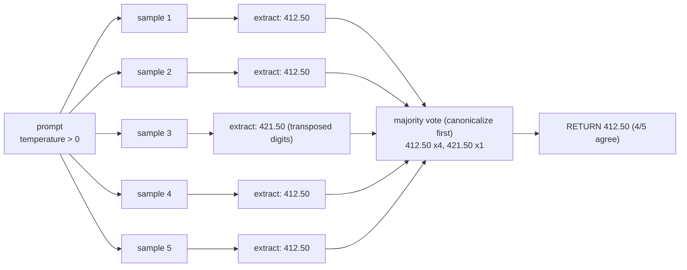

# Lecture 7: Self-Consistency and the Cost Multiplier

> Self-consistency is the technique that turns "the model got it wrong 1 time in 5" into "the model gets it right 4 times in 5, and we keep the answer it agreed with itself on." It works — measurably — but it is the single most expensive prompting technique you will meet in this phase, because it multiplies your token bill by N. This lecture teaches it the only way a practitioner should learn it: as a *cost-gated* tool. After this you will be able to implement sample-N-then-vote correctly (including on structured JSON), measure the accuracy lift per extra dollar on a hard subset, pick N defensibly, know when it is redundant, gate it programmatically so it never fires on easy queries, and produce a defensible cost/accuracy tradeoff table that says "worth it" or "not."

**Prerequisites:** Lecture on sampling/temperature (Phase 0); chain-of-thought and reasoning-model effort control (Week 2 theory); comfort with exact-match field accuracy from the Week 1 extraction harness · **Reading time:** ~22 min · **Part of:** Prompting & Context Engineering, Week 2

## The core idea (plain language)

A frozen model at temperature 0 is (nearly) deterministic: same prompt in, same answer out. At temperature > 0 it samples — you get *different* completions each run, drawn from the model's probability distribution over next tokens. Self-consistency exploits a simple empirical fact: on hard reasoning problems, **the single most common answer across many samples is more often correct than any one sample.** The wrong answers scatter; the right answer clusters.

So the recipe is embarrassingly simple:

1. Set temperature above zero (so samples vary).
2. Sample N completions of the *same* prompt.
3. Extract the final answer from each completion.
4. **Majority-vote** the extracted answers; return the winner.

That's it. There is no clever prompt, no fine-tuning, no extra model. You just pay to run the same query N times and take the mode.

The catch — and the entire reason this lecture exists — is in step 2. Sampling N completions costs roughly N times the tokens of a single completion. If a single answer costs you $0.004, then `n=5` costs $0.020. Over a million queries that is the difference between a $4,000 bill and a $20,000 bill. **Self-consistency is a strict N× cost multiplier.** It is never a default. It is a scalpel you reach for on the few queries where being wrong is expensive and the model is genuinely uncertain — and you justify every use of it with a number.

The mental model to carry: *self-consistency buys accuracy with dollars, at a bad exchange rate that gets worse as N grows.* Your job is to know whether the exchange rate is worth it for a given slice of traffic.

## How it actually works (mechanism, from first principles)

### Why voting helps at all (the one-paragraph version — no proof)

Think of each sampled completion as a noisy vote. If the model is right more often than any *specific* wrong answer, the correct answer accumulates the most votes as N grows. This is the same reason a poll of 1,000 people estimates an election better than asking one person: independent noisy signals average out. The critical, load-bearing assumption is that errors are **diverse** — different samples fail in *different* ways. If the model is systematically biased toward one wrong answer (say it always misreads "1.10" as "110"), every sample votes for the same wrong answer and voting cannot save you. Remember that: voting fixes *variance*, not *bias*.

### The arithmetic of the lift

Let's make the "clustering" intuition concrete with simple probability. Suppose on a hard question a single sample is correct with probability p = 0.55, and its errors are spread across several distinct wrong answers so no single wrong answer beats correct. With N samples, majority vote is correct roughly when more than half the votes are correct. A quick binomial sketch (you do not need to derive this):

```
Single sample correct:        p = 0.55         -> 55% accuracy
Majority of 3 correct:        ~0.57            -> small lift
Majority of 5 correct:        ~0.59            -> more lift
Majority of 9 correct:        ~0.62            -> diminishing
Majority of 15 correct:       ~0.64            -> barely moving
```

(These specific numbers are an illustrative model, not a benchmark — treat them as approximate.) Two things to notice, because both bite you in production:

- **The lift is real but modest**, and it depends entirely on p. If p is already 0.9, voting adds almost nothing (it's already right nearly always). If p is 0.3 and errors cluster on one wrong answer, voting can make it *worse*. The sweet spot is the "genuinely uncertain but better-than-a-coin" middle.
- **It plateaus fast.** Going 1 -> 5 buys most of the available lift. Going 5 -> 15 triples your cost for a rounding error of accuracy. This is why the industry-standard default is small N (often 5), not 50.

### The diagram



The `agreement ratio` (here 4/5 = 0.8) is a free byproduct you should always keep — it is a cheap **confidence signal**. High agreement means the model is stable on this input; a near-tie (3/2/... splits) is a flag to escalate to a human or a stronger model.

### Extraction: the step everyone under-engineers

Voting is only as good as your ability to pull a *comparable* answer out of each completion. For a math word problem the answer might be a number buried in prose; for your invoice task it's a JSON object. Two failure modes:

- **Loose extraction** — regexing "the total is $412.50" one time and "$412.50 total" another. If your extractor is brittle, identical answers look different and votes fragment. Extract to a **canonical form** (parse the number, drop the currency symbol, normalize decimals) *before* voting.
- **No final-answer marker** — if the model rambles, you can't find the answer. Force a delimiter: instruct "end with `FINAL: <value>`" or use structured output so the answer lives in a known field.

### Voting on structured outputs

Your Week 1/2 deliverable emits JSON like `{vendor, invoice_number, date, total_amount, currency}`. You have two legitimate voting strategies, and choosing wrong silently degrades quality:

**A. Vote on the canonicalized whole object.** Canonicalize each object (sort keys, normalize dates to ISO, strip whitespace, round money to 2 dp) into a single string, then majority-vote those strings. Returns a guaranteed-internally-consistent object — every field came from the same completion.

```python
def canonical(obj: dict) -> str:
    o = dict(obj)
    o["total_amount"] = round(float(o["total_amount"]), 2)
    o["date"] = to_iso(o["date"])
    return json.dumps(o, sort_keys=True, separators=(",", ":"))
```

Use this when fields are *correlated* — e.g. `total_amount` and `currency` must agree, or a `line_items` array must sum to the total. You do not want to Frankenstein a currency from sample 2 onto a total from sample 4.

**B. Vote per field.** Majority-vote each field independently. This maximizes per-field accuracy and is more robust when the model nails 4 fields and only flip-flops on one. The danger: it can assemble an object that *no single completion produced*, breaking cross-field invariants.

Rule of thumb: **vote per field for independent fields; vote on the canonicalized whole when fields must stay consistent.** For invoices, `invoice_number` and `vendor` are independent (per-field is fine); `total_amount`/`currency`/`line_items` are correlated (vote the whole, or vote per field then re-validate the sum).

## Worked example

Take the HARD subset from the Week 2 lab: 10 cases (5 tricky invoices + 5 multi-step arithmetic where line items must sum to the total). Assume a non-reasoning model, temperature 0.7, and these measured single-shot numbers (illustrative):

- Single-shot accuracy on the hard subset: **6/10 = 60%.**
- Cost per single completion: **$0.004** (say ~1,000 in + ~200 out tokens at a mid-tier price).

Now run `self_consistency(prompt, n=5)` on the same 10 cases. Suppose the results:

```
case  single  votes (canonicalized total)         majority   correct?
 1    wrong   412.50 ×3 / 421.50 ×2                412.50     ✓ (was ✗)
 2    right   99.00  ×5                            99.00      ✓
 3    wrong   88.10  ×2 / 81.10 ×2 / 810.0 ×1      tie->88.10 ✗ (still wrong)
 4    right   1500.00×4 / 150.00 ×1                1500.00    ✓
 5    wrong   72.30  ×3 / 73.20 ×2                 72.30      ✓ (was ✗)
 6    right   ...                                              ✓
 7    right   ...                                              ✓
 8    wrong   200.00 ×5                            200.00     ✗ (bias: all agree, all wrong)
 9    right   ...                                              ✓
10    right   ...                                              ✓
```

Self-consistency accuracy: **8/10 = 80%.** Cost per query: 5 × $0.004 = **$0.020.**

Now build the deliverable — the tradeoff table:

| Metric | Single-shot (n=1) | Self-consistency (n=5) | Delta |
|---|---|---|---|
| Accuracy (hard subset) | 60% | 80% | **+20 pts** |
| Cost / query | $0.004 | $0.020 | **5×** |
| Errors remaining | 4/10 | 2/10 | −2 |
| Accuracy lift per extra dollar | — | +20 pts for +$0.016 ≈ **+12.5 pts per extra cent** | — |

**Reading the table like an engineer.** The lift is real (+20 pts) but note *which* errors it fixed: cases 1 and 5, where the model was uncertain and errors scattered (variance). It did **not** fix case 8, where all five samples agreed on the same wrong answer (bias) — voting is powerless there. And case 3 stayed wrong because of a near-tie the tie-breaker guessed wrong.

**The recommendation** (this is the actual deliverable, not the table): *"On the hard subset, n=5 self-consistency lifts accuracy 60% -> 80% at 5× cost. If a wrong extraction costs more than ~$0.02 to fix downstream (a human correcting a bad invoice total does), gating self-consistency onto the hard subset only is worth it. It is NOT worth running on the full dataset: on the easy 80% of traffic the model is already ~97% accurate, so we'd pay 5× for near-zero lift. Ship it behind a difficulty gate."*

That paragraph — a number, a threshold, and a scoped yes/no — is what "produce a defensible cost/accuracy tradeoff" means.

## How it shows up in production

- **The bill, obviously.** N× on tokens is N× on the dollar line for the gated slice. If self-consistency ever leaks onto the easy path (a bug in your gate, a config default flipped), you'll find out from the finance dashboard, not the eval. Alarm on cost-per-query, not just accuracy.
- **Latency: parallel vs serial.** Five sequential calls = 5× wall-clock latency, which will blow your p99 and time out user-facing requests. Fire the N samples **concurrently** (async / thread pool) so latency stays ~1× the slowest sample instead of 5× the mean. This is the difference between a 1.2s and a 6s response.
- **Rate limits and quotas.** N concurrent calls per gated query multiplies your requests-per-minute pressure. A spike of hard queries can trip provider rate limits and take down the *easy* path too. Budget your gate against your RPM ceiling.
- **The agreement ratio is operational gold.** Log it. A drop in average agreement over time is an early warning that inputs are drifting harder (new vendor formats, a new document type) before accuracy visibly craters. A per-query low agreement is your signal to route to a human or a bigger model.
- **Tie-breaking is a real decision.** With n=5 and a 2/2/1 split you have no majority. Options: break ties by highest per-token logprob if available, by the answer that passes a validator (e.g. line items actually sum), or by escalating to n=9 / a stronger model. Silently picking "first seen" is how you ship subtle wrong answers.
- **Non-determinism complicates debugging.** Because samples vary, a failing case may pass on rerun. Pin a seed where the provider supports it, and log all N raw completions for any gated query so a bad vote is reproducible.
- **It composes with structured outputs and caching.** The N calls share an identical prompt prefix, so prompt caching (Week 3) makes the *input* tokens nearly free on samples 2..N — you mostly pay for the N× *output* tokens. That materially improves the exchange rate; measure cached-token % on your self-consistency path.

## Common misconceptions & failure modes

- **"Voting fixes wrong answers."** No — it fixes *variance*, not *bias*. If the model is confidently and consistently wrong (case 8 above), all N samples agree on the wrong answer and you pay 5× to be wrong with more conviction. Self-consistency helps only when the model is uncertain and its errors are diverse.
- **"Bigger N is better."** The lift plateaus fast (1->5 captures most of it; 5->15 is mostly wasted money). N is a cost knob with sharply diminishing accuracy returns.
- **"Run it on everything to be safe."** This is the cardinal sin the spine's pitfalls call out. Blanket self-consistency pays 5× on the 80% of easy traffic where the model is already right — huge cost, ~zero lift. **Gate it.**
- **"It's great on reasoning models."** Usually redundant. o-series / Claude adaptive thinking / Gemini thinking already explore multiple internal reasoning paths and self-check — you're paying for external voting on top of internal reasoning. Measure before you stack them; often a single high-effort reasoning call beats n=5 on a cheaper model for less money. Reach for self-consistency primarily on **non-reasoning** models, or on reasoning models only when you have measured that voting still adds a defensible margin.
- **"Temperature doesn't matter."** At temperature 0 all N samples are near-identical, so there's nothing to vote on — you pay 5× for one answer copied five times. You need temperature > 0 (commonly ~0.5–0.8) to get the diversity voting relies on. Too high (>1.0) and you inject so much noise that quality drops.
- **Brittle extraction fragments the vote.** "$412.50" vs "412.50 USD" counted as different answers means no majority forms. Always canonicalize before counting.
- **Per-field voting breaks invariants.** Voting each field independently can assemble an object no single completion produced, e.g. a total that no longer matches the voted currency or the summed line items. Re-validate cross-field invariants after per-field voting, or vote the canonicalized whole.

## Rules of thumb / cheat sheet

- **Default N = 5.** Odd (avoids ties), captures most of the lift, industry-standard. Escalate to 9 only for genuinely high-value + high-difficulty + near-tie cases.
- **Temperature ~0.5–0.8** for the samples. Above ~1.0 quality degrades; at 0 there's no diversity to vote on.
- **Never blanket.** Gate on difficulty. If you can't state the difficulty heuristic, you're not ready to turn it on.
- **Fire samples concurrently**, not serially — keeps latency ~1× not N×.
- **Canonicalize before voting.** Parse numbers, normalize dates to ISO, sort JSON keys, round money.
- **Correlated fields -> vote the whole object. Independent fields -> vote per field** (then re-validate invariants).
- **Log the agreement ratio** as a confidence signal; low agreement -> escalate or send to human.
- **Reasoning models: assume redundant until measured.** Don't stack voting on native reasoning without a measured margin.
- **The deliverable is the recommendation**, not the table: "+X pts for N× cost on the hard subset -> worth it because a wrong answer costs $Y > the extra $Z."
- **Prompt-cache the shared prefix** so samples 2..N pay mostly output tokens only.

### Gating it programmatically

```python
def answer(query):
    # cheap signals decide whether to pay N×
    hard = difficulty_heuristic(query)      # e.g. has line-items, long doc,
                                            # ambiguous currency, prior low-confidence
    if not hard:
        return single_shot(query)           # 1× cost — the common path
    result = self_consistency(query, n=5, temperature=0.7)
    if result.agreement < 0.6:              # near-tie: escalate
        return escalate(query)              # stronger model or human review
    return result.answer
```

The gate is the whole game: a `difficulty_heuristic` (structural features, input length, presence of arithmetic, a router model's cheap classification) or a **confidence signal** (a first single-shot call's logprob/self-reported confidence, or a low agreement ratio) triggers the expensive path. Easy queries never pay N×.

## Connect to the lab

This lecture is the theory behind Week 2 Lab step 2's third bullet: implement `self_consistency(prompt, n=5)`, run it **on the hard set only**, and report the accuracy lift versus the 5× token cost with a stated worth-it/not recommendation. Your Definition of Done requires a self-consistency report that quantifies both the accuracy lift *and* the N× cost — build the tradeoff table from this lecture and write the one-paragraph recommendation. Wire the difficulty gate from the cheat sheet so self-consistency fires only on the hard cases, then confirm your `promptfoo` grid still shows the easy path untouched at 1× cost.

## Going deeper (optional)

- **Wang et al., "Self-Consistency Improves Chain of Thought Reasoning in Language Models" (2022/2023)** — the original paper that named the technique. Read the intro and results for the "sample diverse paths, marginalize over reasoning, take the majority answer" framing. Search: `Self-Consistency Improves Chain of Thought Reasoning Wang 2022`.
- **Anthropic docs — "Increase output consistency" / prompt engineering overview.** Root: `docs.anthropic.com`. Search: `Anthropic prompt engineering consistency`.
- **OpenAI reasoning best practices** — for *why voting is usually redundant on reasoning models* (they explore internally). Root: `platform.openai.com/docs`. Search: `OpenAI reasoning models best practices`.
- **"Language Model Cascades" / router-and-verify literature** — the broader family of "cheap first, escalate on uncertainty" that your gate belongs to. Search: `language model cascades cost accuracy routing`.
- **promptfoo docs** — for wiring the eval that measures the lift. Root: `promptfoo.dev`. Search: `promptfoo assertions javascript custom`.

## Check yourself

1. Self-consistency lifts accuracy on hard queries but does nothing on one particular kind of error. Which kind, and why is voting powerless against it?
2. You run `n=5` at temperature 0. What do you get, and how much did it cost relative to the benefit?
3. Given single-shot accuracy of 92% on your *full* dataset, is blanket self-consistency a good idea? Defend the answer with the cost/lift logic, not just "no."
4. You're extracting `{total_amount, currency, line_items}` where line items must sum to the total. Do you vote per field or on the canonicalized whole object, and why?
5. Your teammate wants to add `n=5` self-consistency on top of a Claude call with high thinking effort "for extra safety." What's your objection, and what would you measure first?
6. You have a 2/2/1 split across five samples. Name two principled tie-breakers that beat "return the first answer."

### Answer key

1. **Bias** (systematic error). Voting reduces *variance* — it helps when errors scatter across different wrong answers so the correct one clusters as the mode. When the model is consistently wrong the same way, all N samples vote for the same wrong answer and the mode is wrong. You pay N× to be confidently wrong.
2. Five near-identical copies of one answer — temperature 0 is (near-)deterministic, so there's no diversity to vote on. You paid 5× the cost for effectively one answer's worth of information. You need temperature > 0 (~0.5–0.8) for voting to do anything.
3. Bad idea. At 92% single-shot the model is already right most of the time, so the available lift is tiny and concentrated in the ~8% hard tail — yet blanket voting pays 5× on the 92% easy majority where lift is ~0. You'd roughly 5× the whole bill to nudge accuracy a point or two. Gate it: run n=5 only on the hard subset, leave the easy path at 1×.
4. **Vote on the canonicalized whole object.** The fields are correlated (line items must sum to the total, and the total pairs with a currency). Per-field voting could assemble an object no single completion produced — a total from one sample, line items from another — that violates the sum invariant. Voting the whole keeps every field from one internally consistent completion. (If you do vote per field for robustness, you must re-validate the sum afterward.)
5. Objection: it's likely **redundant** — a high-effort reasoning model already explores and self-checks multiple internal paths, so external voting is paying N× for what the model partly does internally. First measure: single high-effort reasoning call vs n=5 voting, on the hard subset, comparing accuracy *and* total cost. Only keep the stack if voting adds a defensible margin over the reasoning-only baseline.
6. Any two of: (a) break the tie by the answer that passes a **validator** (e.g. the total whose line items actually sum); (b) use **token logprobs/confidence** if the provider exposes them, picking the highest-confidence answer; (c) **escalate** — bump to n=9, route to a stronger model, or send to human review. All beat "first seen," which silently biases toward sampling order.
