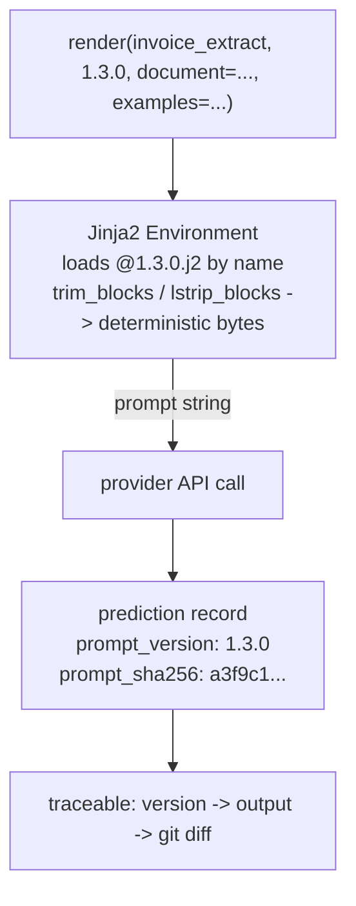

# Lecture 8: Prompt Management as Software — Templating and Versioning

> A prompt that lives as an f-string inside `extract.py` is not code you own — it is a liability you can't diff, can't roll back, and can't attribute to an output. The single most important professionalization step in your prompting career is the one this lecture makes: stop treating the prompt as a string you build and start treating it as a **versioned artifact you render**. After this you'll be able to move every prompt in a pipeline into named, semantically-versioned Jinja2 template files; write a `render.py` that resolves a template by `name@version` and hands back a string; stamp every prediction record with the `prompt_version` that produced it; enforce the hard rule that a grep for prompt-building f-strings in `src/` returns *nothing*; and reason precisely about why template drift silently zeroes your prompt-cache hit rate. You'll also be able to place Langfuse, PromptLayer, and DSPy on your mental map and know when to reach for each.

**Prerequisites:** Lecture 1 (Prompt anatomy — sections, ordering, cacheable prefix), Lecture 2 (Few-shot exemplars — byte-identical formatting), Phase 0 comfort with Python packaging and `git` · **Reading time:** ~28 min · **Part of:** Phase 1 Week 2

---

## The core idea (plain language)

Here is the failure that motivates the entire lecture. You write a prompt inline:

```python
prompt = f"Extract invoice fields from:\n{document}\nReturn JSON."
```

It works in the playground. You ship it. Three weeks later accuracy drops 6 points in production and nobody can say why. Was it the model version? A prompt tweak someone made in a hotfix? The `\n` a teammate "cleaned up"? You can't answer, because the prompt has no identity. It isn't stored anywhere as a discrete thing. It's assembled at runtime from a string literal and a variable, and the exact bytes that went to the model on any given day are gone. You are debugging a ghost.

The fix is a one-line reframe with large consequences: **a prompt is a code artifact, not a string you concatenate in business logic.** Artifacts have a name, a version, a location in the repo, a diff history, and a review process. You edit them in files, you version them explicitly, and your application *renders* them — it never *builds* them. The moment you internalize this, three superpowers fall out for free:

1. **Traceability.** Every output can be stamped with the exact prompt version that produced it. When accuracy moves, you `git log` the template and see precisely what changed and when.
2. **Rollback.** A bad prompt version is a one-line revert, not an archaeology dig.
3. **Cache safety.** Because templates render deterministic bytes, you can reason about — and monitor — whether your prompt cache is actually hitting.

The mechanical tools are boring on purpose: a **template engine** (Jinja2) to hold the text with variable slots, a **naming/versioning scheme** in the filename (`invoice_extract@1.2.0.j2`), and a tiny **loader** (`render.py`) that maps `name@version + variables → string`. The discipline is what matters: **no f-strings build prompts anywhere in `src/`, ever.**

---

## How it actually works (mechanism, from first principles)

### Why f-strings are the wrong tool (three concrete reasons)

An f-string like `f"...{document}..."` couples three things that should be separate: the *prompt text*, the *variable substitution*, and the *business logic* around it. That coupling breaks in specific, expensive ways.

- **No identity, no diff.** The prompt only exists as bytes at runtime. You can't point at "version 1.2.0" — there is no version. A code review that changes a period to a comma in a 40-line f-string is nearly invisible; the same change in a dedicated `.j2` file is a clean, reviewable diff.
- **Silent byte drift.** Every edit to the surrounding Python — reformatting, a linter reflowing a long line, a teammate "tidying" whitespace — can change the bytes sent to the model without anyone deciding to change the prompt. On a cached workload that's a silent cost regression (more below).
- **Escaping and injection hazards.** F-strings interpolate blindly. If `document` contains `{...}` or braces, or an exemplar contains a stray `"`, you get subtle malformed prompts. A template engine gives you controlled slots and (where you want it) autoescaping.

### Jinja2 as the template engine

Jinja2 is the same battle-tested engine Flask uses for HTML. For prompts you use a tiny slice of it: **variable slots** and a little control flow. A template is a text file with `{{ ... }}` slots:

```jinja
{# prompts/registry/invoice_extract@1.2.0.j2 #}
You extract structured fields from invoice text.


Here are worked examples:

INPUT: {{ ex.input }}
OUTPUT: {{ ex.output }}



Extract {vendor, invoice_number, date, total_amount, currency} as JSON.

<document>
{{ document }}
</document>
```

`{{ document }}` and `{{ examples }}` are **slots** — they get filled at render time. `` / `` are control blocks. `{# ... #}` is a comment that never reaches the model. The value proposition: the prompt text lives in one place, the variables are named and explicit, and the file is a first-class artifact you can name, version, diff, and review.

### The `render.py` loader: `name@version + vars → string`

The loader is deliberately small. Its whole job is to resolve a template by **name and version**, render it with a variable dict, and return the string. Nothing in your business logic ever touches the raw template text.

```python
# src/render.py
from pathlib import Path
from jinja2 import Environment, FileSystemLoader

REGISTRY = Path(__file__).parent.parent / "prompts" / "registry"

_env = Environment(
    loader=FileSystemLoader(REGISTRY),
    trim_blocks=True,      # eat the newline after a  block tag
    lstrip_blocks=True,    # strip leading whitespace before  block tags
    keep_trailing_newline=False,  # no accidental trailing \n
    autoescape=False,      # prompts are text, not HTML
)

def render(name: str, version: str, **variables) -> str:
    template = _env.get_template(f"{name}@{version}.j2")
    return template.render(**variables)
```

Usage in `extract.py` becomes a single call — no string building in sight:

```python
prompt = render("invoice_extract", "1.2.0", document=doc, examples=SHOTS)
```

The `trim_blocks` / `lstrip_blocks` / `keep_trailing_newline` flags are not cosmetic. They are the difference between a byte-stable prompt and one that drifts — the next section is entirely about why.

### Whitespace control: the boring flag that saves your cache

Jinja2's default rendering leaves stray whitespace around control blocks. A `` on its own line, by default, emits the newline *after* the tag and any indentation *before* it. That means the bytes your template produces depend on how you indented the *template source* — and that is exactly the kind of invisible variation that busts a prompt cache.

Recall the caching invariant (Lecture 2, deep in Week 3): **prompt caching is a byte-level prefix match.** The provider hashes the longest identical prefix of your request and reuses the computed attention state at ~10% of the input price. A cache hits only if the prefix is byte-identical to a prior request. So a single trailing space, a `\r\n` vs `\n`, or an extra newline emitted by an untrimmed `` block changes the bytes → cache miss → you pay full price and nothing errors.

Concretely, without `trim_blocks`/`lstrip_blocks`, this exemplar loop:

```jinja

INPUT: {{ ex.input }}

```

renders with a blank line before each `INPUT:` and trailing spaces where the template was indented. Add one exemplar, reformat the template, or let a different developer re-indent it, and the byte stream shifts. With the flags on, the block tags are consumed cleanly and the output is stable. The rule: **turn `trim_blocks` and `lstrip_blocks` on in the `Environment` and keep them on**, so the rendered bytes depend only on the *content* of your slots, not on how you happened to indent the template.

There is a second, quieter consequence for **few-shot exemplars**. Lecture 2 hammered "byte-identical exemplars." If your template's whitespace control is sloppy, two renders that *should* produce identical exemplar blocks won't, and you lose both the format-consistency benefit and the cache benefit simultaneously. Whitespace control is where the templating discipline and the exemplar discipline meet.

### Versioning scheme: semantic version or content hash in the filename

Two common schemes, and you should understand the tradeoff:

- **Semantic version** — `invoice_extract@1.2.0.j2`. Human-meaningful. You bump `MAJOR` for a breaking change to the output contract (new required field), `MINOR` for a new capability that's backward-compatible (adds an optional scratchpad), `PATCH` for a wording tweak. Great for humans reading a changelog; the weakness is it relies on discipline — nothing *forces* you to bump it when you edit.
- **Content hash** — `invoice_extract@a3f9c1.j2` (first N chars of a SHA-256 of the rendered-with-no-vars template body). Machine-derived, so it *cannot* drift: if the bytes change, the hash changes, full stop. The weakness is it's opaque to humans — `a3f9c1` tells you nothing about intent.

The pragmatic answer for this course: **semantic version in the filename for human legibility, and log a content hash of the final rendered prompt on every prediction** so you also have the un-fakeable byte-identity. You get the changelog *and* the audit trail.

```
prompts/registry/
  invoice_extract@1.2.0.j2      # baseline: {{ document }}, {{ examples }}
  invoice_extract@1.3.0.j2      # adds a "reason then extract" scratchpad
```

### Stamping every prediction with `prompt_version`

Traceability is not automatic — you have to *record* it. Every prediction record your pipeline emits carries the version (and ideally the rendered-bytes hash):

```python
record = {
    "input_id": row["id"],
    "prediction": parsed,
    "prompt_name": "invoice_extract",
    "prompt_version": "1.3.0",
    "prompt_sha256": hashlib.sha256(prompt.encode()).hexdigest()[:12],
    "model": "claude-...",
    "ts": now_iso(),
}
```

Now the payoff is concrete: when accuracy shifts, you `GROUP BY prompt_version` over your `predictions.jsonl` and immediately see *which version* regressed, then `git log prompts/registry/invoice_extract@1.3.0.j2` to see exactly what changed. Without the stamp, you're back to debugging a ghost.



---

## Worked example

Say you run 30 invoices/day, each prompt ~1,200 input tokens (instructions + 5 exemplars) + ~200 tokens of volatile document text. You've set up a `cache_control` breakpoint after the exemplar block, so the stable 1,200-token prefix *should* cache.

**Baseline (cache hitting).** Cached input at ~10% of full price: the 1,200-token prefix costs ~120 token-equivalents; the 200 volatile tokens cost full. Roughly `120 + 200 = 320` billed input token-equivalents per call. Over 30 calls/day that's ~9,600 — call it your steady-state cost.

**Now template drift bites.** A teammate reformats `invoice_extract@1.3.0.j2` — no content change intended, but `trim_blocks` was *off*, so re-indenting the `` exemplar loop shifted a newline in the prefix. Every request now misses the cache. Each call bills the full 1,200 + 200 = 1,400 token-equivalents. Over 30 calls that's 42,000 — a **~4.4x input-cost regression**, and *nothing errored*. Accuracy is unchanged, tests pass, the only symptom is the bill and a `cache_read_input_tokens` that quietly went to zero.

**How the discipline catches it.** Because the template is versioned, the reformatting shows up as a diff on `@1.3.0.j2` in review (and ideally a policy: whitespace-only diffs to a template still bump PATCH and get eyeballed). Because you log `prompt_sha256`, the hash changed the instant the bytes did — so a dashboard grouping cache-hit-rate by `prompt_sha256` shows the new hash with 0% hits the moment it deploys. You catch a silent 4.4x regression in one query instead of one billing cycle. That is the entire argument for this lecture in one number.

---

## How it shows up in production

- **The prompt-attribution question in an incident.** "Accuracy dropped Tuesday afternoon." With version stamping you answer in one query: `@1.3.1` shipped at 2pm, here's its diff. Without it, you're correlating deploys to graphs by hand for a day.
- **Silent cache regressions from "harmless" edits.** The most common production prompt bug is not a wrong instruction — it's a whitespace or key-order change that zeroes the cache. It never throws. You find it only if you *watch cache-hit rate* (`cache_read_input_tokens / input_tokens`) as a first-class metric, versioned against `prompt_sha256`.
- **Rollback and canary by version.** A versioned template is `git revert` + redeploy; an inline f-string requires hunting the change across business logic with no guarantee you recovered the exact prior bytes. And because prompts are addressable by `name@version`, routing 5% of traffic to `@1.4.0` and comparing field accuracy by `prompt_version` is trivial.
- **Reproducing a customer's bad output.** With `prompt_version` + `prompt_sha256` + model id on the record, you re-render the exact bytes and reproduce the failure locally. Without it, "works on my machine" is unfalsifiable.

---

## The tooling landscape (skim depth)

You will hand-roll the file-based registry in this week's lab — that is the point, you learn the mechanism. But know the managed options so you can graduate to them deliberately, not by cargo cult.

- **Langfuse — prompt management + LLM observability (open source).** Stores prompts server-side with versions and labels (`production`, `staging`), serves them via SDK, and — its real draw — ties each prompt version to **traces**: the actual inputs, outputs, latency, token cost, and eval scores for calls that used it. It's the natural upgrade when "which version produced this output, and how did it score?" needs to be answered across a team, not by grepping JSONL. Self-hostable, which matters for data-sensitive shops.
- **PromptLayer — prompt registry + request logging.** A hosted prompt CMS with a visual editor, version history, and a request log that pairs prompts with responses. Aimed at letting non-engineers (PMs, domain experts) edit prompts without a deploy. Same core idea as your file registry, plus a UI and a logging backend.
- **DSPy — the auto-optimize paradigm.** Fundamentally different. Instead of you hand-writing exemplars and instructions, you declare a *signature* (`document -> invoice_fields`) and a metric, and DSPy's optimizers (e.g., MIPRO, BootstrapFewShot) **search over exemplars and instruction wordings** to maximize your metric on a training set. In other words, DSPy *automates the exact manual work you're doing by hand this week* — picking which few-shot examples to include and how to phrase the instruction. That's powerful and also why you **defer** it: you can't tell whether an optimizer helped if you've never measured a hand-tuned baseline, its output prompts are machine-generated and less legible, and it adds a compile step and a dependency. Learn to hand-tune and measure first; reach for DSPy when hand-tuning plateaus and you have a solid metric + eval set to optimize against.

The through-line: all three externalize the prompt as a versioned artifact with observability. Your file-based registry is the same idea at the smallest possible scale — which is exactly why building it yourself teaches the concept better than adopting a platform on day one.

---

## Common misconceptions & failure modes

- **"I'll use an f-string just this once."** The exception becomes the rule, and the one prompt that isn't versioned is the one that regresses silently. Enforce zero with a grep in CI (see cheat sheet).
- **"Bumping the version is bureaucracy."** The version is what makes an incident a one-query lookup instead of a day of correlation. It costs seconds; it saves hours.
- **"Whitespace doesn't matter, the model ignores it."** The model largely does — but the *cache* does not. Byte drift from whitespace is the #1 silent cache-buster, and few-shot exemplars stop being byte-identical the same instant.
- **"Semantic version = the bytes are pinned."** No. A human can edit `@1.3.0.j2` in place and forget to bump. That's why you *also* log a content hash of the rendered prompt — the hash can't lie about the bytes.
- **"DSPy replaces prompt engineering."** It automates exemplar/instruction *search*, but you still design signatures, choose metrics, and curate eval data — and you need a hand-tuned baseline to know if it helped. It's an optimizer, not a substitute for understanding.
- **"Template drift will show up as an error."** Almost never. Malformed-but-valid prompts and cache misses both fail silently. Only monitoring (cache-hit rate, accuracy-by-version) surfaces them.
- **"Autoescape should be on like in web templating."** For prompts you usually want `autoescape=False` — prompts are plain text, and HTML-escaping your document turns `&` into `&amp;`, changing the bytes the model sees.

---

## Rules of thumb / cheat sheet

- **Prompts are files, not strings.** One template per prompt, in `prompts/registry/`, named `name@version.j2`.
- **`render(name, version, **vars) -> str` is the only path to a prompt.** Business logic calls `render`; it never builds prompt text.
- **Zero prompt-building f-strings in `src/`.** Enforce it — a CI grep must return nothing:
  ```bash
  # fails the build if any f-string looks like it builds a prompt
  grep -rEn 'f["'"'"'].*(prompt|extract|system|instruction|<document>)' src/ && exit 1 || true
  ```
- **Turn on `trim_blocks=True` and `lstrip_blocks=True`.** Also `keep_trailing_newline=False`, `autoescape=False`. Stray whitespace busts caches and breaks byte-identical exemplars.
- **Semantic version in the filename, content hash in the log.** `@1.3.0.j2` for humans; `sha256(prompt)[:12]` on every record for un-fakeable byte identity.
- **Stamp every prediction with `prompt_version` (+ hash, model, timestamp).** No stamp = no traceability.
- **Bump the version on *any* byte change**, including whitespace-only reformatting. PATCH for wording/whitespace, MINOR for additive capability, MAJOR for output-contract breaks.
- **Watch cache-hit rate keyed by prompt hash.** A new hash at 0% hits = a drift regression; investigate before the bill does.
- **Reach for Langfuse/PromptLayer** when a team needs shared editing + observability; **defer DSPy** until you have a measured hand-tuned baseline and a solid metric to optimize.

---

## Connect to the lab

This lecture is the theory behind Week 2's **Jinja2 prompt registry** deliverable. Build `prompts/registry/invoice_extract@1.2.0.j2` (with `{{ document }}` and `{{ examples }}` slots) and `@1.3.0.j2` (adds a reason-then-extract scratchpad), plus a `render.py` that resolves `name@version` and returns the string. Then satisfy the Definition-of-Done gates directly: a grep for prompt-building f-strings in `src/` returns nothing, and every prediction record carries its `prompt_version`. When you add `cache_control` in Week 3, keep `trim_blocks`/`lstrip_blocks` on and confirm `cache_read_input_tokens` stays non-zero across renders — that's this lecture's cache claim, measured.

## Going deeper (optional)

Real, named sources (root domains only — search for the exact page):

- **Jinja2 docs** — `jinja.palletsprojects.com`: the "Template Designer Documentation" (variables, control structures) and the "API" page (the `Environment`, `trim_blocks`, `lstrip_blocks`, `keep_trailing_newline`, `autoescape` flags). Search: `Jinja2 template designer documentation`, `Jinja2 whitespace control trim_blocks`.
- **Langfuse docs** — `langfuse.com/docs`: the "Prompt Management" section and how prompt versions link to traces. Search: `Langfuse prompt management versions`.
- **PromptLayer docs** — `docs.promptlayer.com`: the "Prompt Registry" and request-logging pages. Search: `PromptLayer prompt registry`.
- **DSPy** — `dspy.ai` and the canonical repo `github.com/stanfordnlp/dspy`: signatures, modules, and optimizers (MIPRO, BootstrapFewShot). Search: `DSPy documentation optimizers`, `DSPy MIPROv2`.
- **Semantic Versioning** — `semver.org`: the MAJOR/MINOR/PATCH contract, applied here to prompts. Search: `semantic versioning spec`.
- Background on prompt caching (why byte drift matters): Anthropic's "Prompt caching" doc on `docs.claude.com`. Search: `Anthropic prompt caching cache_control`.

Because these tools move fast, verify Jinja2 flag names and DSPy optimizer APIs against current docs before shipping — this lecture is accurate to 2025-2026 but exact APIs drift.

## Check yourself

1. State the one-sentence reframe at the heart of this lecture, and name the three superpowers that fall out of it.
2. Your teammate reformats a `.j2` template — indentation only, no wording change — and the next day the input bill quadruples with no errors and unchanged accuracy. Explain the mechanism, and name the two settings that would have prevented it.
3. Why log a *content hash* of the rendered prompt when the filename already carries a semantic version? What can the hash catch that the version can't?
4. What exactly does DSPy automate, and give two concrete reasons to defer deep use of it until later in your prompting practice.
5. You must guarantee "no prompt-building f-strings in `src/`." What's the enforcement mechanism, and why is a code-review convention alone insufficient?
6. Where do `trim_blocks`/`lstrip_blocks` sit in the pipeline, and name the *two* distinct things sloppy whitespace control breaks at once.

### Answer key

1. **A prompt is a versioned code artifact you *render*, not a string you *concatenate* in business logic.** The three superpowers: **traceability** (stamp each output with the version that made it), **rollback** (a bad version is a one-line revert), and **cache safety** (deterministic bytes let you reason about and monitor cache hits).
2. Prompt caching is a **byte-level prefix match**; the reformatting shifted whitespace in the cached prefix, so every request now **misses the cache** and bills the full prefix at ~10x the cached price — silently, since a cache miss and a valid-but-different prompt both throw no error and don't change accuracy. Prevention: **`trim_blocks=True` and `lstrip_blocks=True`** on the Jinja2 `Environment`, so rendered bytes depend on slot *content*, not template indentation.
3. A semantic version relies on human discipline — someone can edit `@1.3.0.j2` in place and **forget to bump it**, so the version lies about the bytes. A content hash is **machine-derived from the actual rendered bytes**: if a single character changes, the hash changes, full stop. It catches undeclared drift (including whitespace-only edits) and lets you key cache-hit-rate dashboards to the true byte identity.
4. DSPy automates the **search over few-shot exemplars and instruction wordings** to maximize a metric — i.e., the exact hand-tuning you do this week — via optimizers like MIPRO/BootstrapFewShot. Defer it because: (a) you can't judge whether the optimizer helped without a **measured hand-tuned baseline** and a solid metric/eval set, and (b) its output prompts are **machine-generated and less legible**, plus it adds a compile step and a dependency. Learn to hand-tune and measure first.
5. Enforcement: a **CI grep** (e.g., `grep -rEn` for f-strings containing prompt-ish tokens in `src/`) that **fails the build** on any match. A review convention alone is insufficient because the "just this once" exception is invisible in a large diff, ships silently, and is precisely the un-versioned prompt that regresses without traceability — you need a mechanical gate, not goodwill.
6. They live in the **Jinja2 `Environment`**, controlling how block tags (``) emit surrounding whitespace during **render**. Sloppy whitespace control breaks (1) **prompt caching** — byte drift in the prefix causes cache misses — and (2) **byte-identical few-shot exemplars** — two renders that should produce identical exemplar blocks don't, losing the format-consistency benefit — at the same time.
