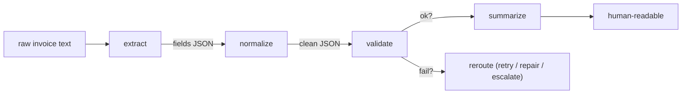

# Lecture 9: Task Decomposition and Prompt Chaining

> Sooner or later you hit a prompt that is doing too much: extract fields *and* clean them *and* check they add up *and* write a summary — all in one call, and it's flaky in a way you can't localize. The instinct is to split it into a pipeline of small prompts. That instinct is often right and just as often a trap. This lecture teaches you to decompose a fuzzy task into a chain of small, typed steps (extract → normalize → validate → summarize) *when the numbers justify it* — and to resist chaining when a single good prompt would do. After this you will be able to design typed interfaces between steps, add per-step retries and a validation step that reroutes failures, measure per-step token cost, localize exactly where errors enter the chain, and defend "one prompt" vs "a chain" with data instead of taste.

**Prerequisites:** Structured JSON output (Lecture 4); chain-of-thought (Lecture 6) and self-consistency (Lecture 7) — you must know the *within-step* techniques to contrast them with *across-step* chaining; the Week 1 invoice extraction harness · **Reading time:** ~24 min · **Part of:** Prompting & Context Engineering, Week 2

## The core idea (plain language)

A **chain** is a pipeline of separate LLM (or LLM + code) calls where each step consumes the previous step's output as its input. Instead of one prompt that must do everything, you get a sequence of small prompts that each do one thing:



The appeal is real and worth stating plainly. Each step is **simpler** (one job, a short prompt, easy to reason about), **cheaper per step** (small prompts, small outputs, and you can run the cheap steps on a cheap model), and **independently testable** (you can write a unit test for "does normalize turn `1.234,56` into `1234.56`?" without touching the rest). A monolithic prompt is a black box; a chain is a set of boxes you can each open.

The catch — and the reason this lecture is mostly a set of brakes — is that a chain has **more failure surface** and **compounding error**. Every step is a place latency accrues, cost accrues, and a mistake can be introduced or propagated. If each step is 95% reliable, a 4-step chain is `0.95^4 ≈ 0.81` reliable end-to-end — you *lost* 14 points by adding steps, unless a validation step earns them back. So the dominant engineering rule of this entire lecture is:

> **Prefer the simplest chain that works. A single good prompt beats a chain until you can prove you need one. Premature chaining buys you latency, cost, and failure surface you did not have to pay for.**

You chain because a measurement forced you to, not because a diagram looked clean.

## How it actually works (mechanism, from first principles)

### Typed interfaces: the contract between steps

The thing that makes a chain an *engineering artifact* rather than a pile of prompts is that **each step's output is the next step's validated input**. You define a schema at every boundary and validate against it before proceeding. This is the single most important discipline in chaining; skip it and you get "garbage flows silently downstream" — the classic chain pathology.

```
extract   :  text            -> Fields         {vendor, invoice_number, date, total_amount, currency, line_items[]}
normalize :  Fields          -> NormFields      (dates -> ISO, money -> Decimal(2dp), currency -> ISO-4217)
validate  :  NormFields      -> ValidatedFields (+ {valid: bool, reasons: []})
summarize :  ValidatedFields -> str
```

Treat each arrow as a function signature. The output of `extract` must parse as `Fields` before `normalize` ever runs. Because you already know how to force schema-valid JSON (Lecture 4), each boundary gets a `json.loads` + schema check, and a failure there is caught *at that boundary* — not three steps later as a mysterious summary about the wrong number. Typed boundaries are what let you localize errors, which is the whole reason the chain is worth its overhead.

### Error localization: where did the mistake ENTER?

In a monolith, when the final answer is wrong you know *that* it's wrong, not *where*. In a chain with typed boundaries you can log the input and output of every step and answer a sharper question: **at which step did the value first become wrong?** This is the debugging superpower of chaining, and it only exists if you log per-step I/O.

```
Case #17 trace:
  extract   -> total_amount = "1.234,56"      (correct: European format, raw)
  normalize -> total_amount = 1.23            (WRONG — mis-parsed thousands sep)  <-- error ENTERS here
  validate  -> valid=false (line items sum 1234.56 != total 1.23)                 <-- error CAUGHT here
  summarize -> (never runs; rerouted)
```

The error *entered* at `normalize` and was *caught* at `validate`. Those are two different steps and you must not conflate them. A well-built validate step catches errors that entered upstream; without per-step logging you'd blame the wrong prompt and "fix" extract, which was fine.

### Error compounding: the arithmetic you must respect

Reliability multiplies down a chain. If step reliabilities are `r1, r2, …, rn`, end-to-end reliability (with no validation/repair) is their product:

```
step reliabilities:  0.97 × 0.95 × 0.98 × 0.96
end-to-end:          ≈ 0.866   (so ~13% of inputs come out wrong somewhere)
```

Two consequences bite in production:

- **More steps = lower ceiling**, all else equal. Adding a step can only lower the product unless that step *removes* errors (a validate/repair step) faster than it adds them.
- **A validate-and-reroute step bends the curve back up.** If `validate` catches, say, 80% of the errors that reach it and reroutes them to a repair/retry that fixes half, your effective reliability climbs back above a lot of single-prompt baselines. That is the *only* honest reason to eat the chain's overhead: a checkpoint that provably nets out positive.

### Retry and reroute per step

Each step is an independent unit, so each gets its own error handling. The pattern:

```python
def run_step(fn, payload, schema, retries=2):
    last_err = None
    for attempt in range(retries + 1):
        out = fn(payload)                     # one LLM (or code) call
        ok, err = validate_schema(out, schema)
        if ok:
            return out
        last_err = err
        payload = repair_prompt(payload, err) # feed the error back in
    raise StepFailed(last_err)                # bubble up to the chain's router
```

Two kinds of failure need two responses. A **format failure** (didn't parse, wrong schema) → retry the *same* step, optionally with the validator's error message injected so the model can self-correct ("your `date` was not ISO-8601; return YYYY-MM-DD"). A **semantic failure** (parsed fine, but the line items don't sum to the total) → this is caught downstream at `validate`, and the reroute is usually not "retry extract blindly" but "send this case to a repair prompt or a stronger model, or flag for human review." Retrying the same prompt against a genuine ambiguity just spends money to fail again.

### Where a code step beats an LLM step

Not every box in the chain should be an LLM. `normalize` (parse a date, coerce money to `Decimal`) and `validate` (does `sum(line_items) == total`?) are **deterministic** — write them in Python. They're free, instant, and 100% reliable. A recurring beginner error is asking the model to do arithmetic a `sum()` would do perfectly. Reserve LLM calls for the genuinely fuzzy steps (extraction from messy text, summarization); use code for everything with a right answer. The strongest chains are mostly code with LLM calls only at the fuzzy edges.

## Worked example

Take the invoice **line-item-sum** case from the Week 2 lab. The task: from raw invoice text, produce a validated record where the line items provably sum to the stated total, plus a one-line human summary.

**Attempt 0 — the monolith (the baseline you must beat).** One prompt: "Extract vendor, invoice number, date, currency, line items, and total; make sure the line items sum to the total; then write a one-line summary." Measured on the 10 hard cases (illustrative numbers):

| Metric | Monolith (1 prompt) |
|---|---|
| End-to-end correct | 6/10 |
| Tokens / case | ~1,300 in + ~400 out |
| Cost / case | ~$0.006 |
| When wrong, *where*? | unknown — one black box |

The failures cluster on European number formats (`1.234,56`) and on cases where the model *asserted* the items summed without actually checking. Crucially you cannot tell whether it mis-*read* the total or mis-*added* — the monolith hides it.

**Attempt 1 — the chain.** Four typed steps, with `normalize` and `validate` as pure code:

```
[extract]   LLM, cheap model   text -> Fields (raw strings)
[normalize] CODE                Fields -> NormFields (ISO dates, Decimal money)
[validate]  CODE                sum(line_items) == total ? -> {valid, reasons}
[summarize] LLM, cheap model    ValidatedFields -> one-line string
```

Now measure **per step** (this table is the actual deliverable):

| Step | Model? | Tokens in/out | Cost/case | Step reliability | Errors it introduces / catches |
|---|---|---|---|---|---|
| extract | LLM (cheap) | 1,100 / 250 | $0.0035 | 0.90 | introduces read errors |
| normalize | code | — | $0 | ~1.00 | fixes format; can mis-parse ambiguous seps |
| validate | code | — | $0 | 1.00 | **catches** sum mismatches, reroutes |
| summarize | LLM (cheap) | 300 / 60 | $0.0009 | 0.99 | cosmetic only |
| **chain total** | | | **~$0.0044** | see below | |

End-to-end without the checkpoint would be `0.90 × 1.00 × 1.00 × 0.99 ≈ 0.89`. But `validate` doesn't just pass through — when `sum(line_items) != total` it **reroutes** to a repair prompt ("re-extract line items only; they must sum to {total}"). That repair fixes ~half the extract misses. Net measured result:

| Metric | Monolith | Chain (extract→normalize→validate→summarize) |
|---|---|---|
| End-to-end correct | 6/10 | **8/10** |
| Cost / case | $0.006 | **$0.0044** (+ ~$0.0035 on the ~2 rerouted cases) |
| Localizable failures | no | **yes** (per-step trace) |
| Latency | 1 call | 3–4 sequential calls |

**Reading it like an engineer.** The chain won here for three concrete reasons: (1) moving arithmetic into code made `validate` *perfectly* reliable, killing the "claimed it summed but didn't" failure mode entirely; (2) the validate→repair reroute recovered ~2 cases; (3) per-step logging told us the remaining 2 failures *enter at extract* on genuinely ambiguous inputs (a smudged total), so we know a better OCR/upstream fix — not a summarize tweak — is the next move. It also cost *less* than the monolith because the cheap model plus free code steps beat one big do-everything call.

But note the honest asymmetry: the chain added **latency** (3–4 sequential round-trips vs 1) and **failure surface** (four boundaries to maintain). On the *easy* 20 invoices where the monolith already scored ~19/20, the chain would add all that overhead for near-zero lift — which is exactly why you gate chaining to where it pays.

## How it shows up in production

- **Latency stacks.** A 4-step sequential chain is ~4× the round-trips. If each call is 800 ms, that's a 3.2 s response before you've done anything clever. Parallelize independent steps; keep the critical path short; and question every step that isn't earning its round-trip. This is the single most common reason a "clean" chain feels sluggish in prod.
- **Cost is per step, and it's easy to hide.** Your invoice endpoint's bill is the *sum* over steps, and a chatty intermediate step (one that echoes the whole document forward) can quietly dominate. Log tokens **per step**, not just per request, or you'll optimize the wrong box.
- **Errors compound silently without checkpoints.** A chain with no validation step is strictly worse than a monolith: same errors, more places to introduce them, more latency, more cost. If you're going to chain, a validate step is not optional — it's the thing that justifies the chain.
- **Debugging is either great or terrible.** With per-step I/O logging, chains are the easiest thing in the world to debug — you binary-search to the offending step. Without it, they're *harder* than a monolith because now there are four black boxes instead of one. The logging is the difference; build it first.
- **Prompt-cache the stable prefixes.** Each step has a fixed instruction block; only the payload varies. Put the frozen instructions first with a cache breakpoint (Week 3) so the input tokens on repeat traffic are nearly free. Chains benefit a lot here because every step re-sends a stable system prompt.
- **Version each step independently.** Steps are separate Jinja2 templates (Lecture 8) with their own versions. You can improve `normalize@1.4.0` without touching `extract`, and your prediction records should carry the version of *every* step so a regression is traceable to the box that changed.
- **Schema drift between steps is a real outage.** If you change `extract`'s output shape and forget `normalize` expects the old shape, the boundary validation fails loudly (good) — but only if the boundary is actually validated. An unvalidated boundary turns a schema change into silent downstream corruption.

## Common misconceptions & failure modes

- **"Chaining is a best practice; more steps = more robust."** Backwards. Each added step lowers the reliability ceiling (`r1×r2×…`) *unless* it's a validate/repair step that nets out positive. Default to fewer steps.
- **"I'll chain it now to be future-proof."** Premature chaining. You pay latency, cost, and failure surface today for flexibility you may never need. Start with the monolith, measure, and split only the step the data says is the problem.
- **Chaining without typed boundaries.** If a step's output isn't validated before the next step consumes it, garbage propagates and you lose the one thing chains are good at — localization. No boundary schema, no chain; just a fragile pipe.
- **Using an LLM for a deterministic step.** Asking the model to sum line items or reformat a date is paying a probabilistic, latent, costly tool to do what a 3-line pure function does perfectly. Put arithmetic and formatting in code.
- **Confusing across-step chaining with within-step techniques.** Self-consistency (Lecture 7) samples one prompt N times and votes — that's *within a single step*, fixing variance on that step. Two-pass "reason-then-extract" (Lecture 6) is also within a step (one logical task, two turns). **Chaining is across steps**: different tasks, different typed I/O, output of one feeds the next. You can and often should use them together — e.g. run self-consistency *inside* the extract step of a chain — but they solve different problems and are not substitutes.
- **Retrying a semantic failure by re-running the same prompt.** If the model got a genuinely ambiguous total wrong, hammering the same prompt just re-pays for the same mistake. Reroute semantic failures to repair/stronger-model/human; reserve blind retries for *format* failures.
- **No reroute path.** A validate step that can only say "invalid" and then throws is half a checkpoint. The value is in what happens next — repair, escalate, or flag — not in the detection alone.
- **Over-splitting.** A step per field, a step per micro-transformation. Each boundary is overhead; merge steps that always succeed together and only keep splits that buy testability or a cheaper model.

## Rules of thumb / cheat sheet

- **Start monolithic. Chain only on measured evidence** that one step is the failure and splitting it helps. The simplest chain that works wins.
- **Every boundary is typed and validated.** Output of step N must parse as the input schema of step N+1 *before* N+1 runs. No schema, no chain.
- **Deterministic steps go in code**, not the LLM (normalize, validate, arithmetic, formatting). LLM only for fuzzy steps (extract, summarize).
- **A chain needs a validate step** or it's strictly worse than a monolith. The checkpoint is what earns back the compounding-error tax.
- **Localize before you fix.** Log per-step input/output; find the step where the value *first* became wrong; fix *that* box.
- **Two failure kinds, two responses.** Format failure → retry the same step (optionally inject the validator error). Semantic failure → reroute (repair / escalate / human), don't blind-retry.
- **Estimate the ceiling:** multiply step reliabilities. If the product is below your monolith baseline, the chain must add a net-positive checkpoint or don't ship it.
- **Measure cost and tokens per step**, not just per request — one chatty step can dominate the bill.
- **Version and cache each step** independently (Jinja2 template per step; stable prefix + cache breakpoint).
- **Parallelize independent steps**; keep the sequential critical path as short as the task allows.
- **Within-step (self-consistency, two-pass) ≠ across-step (chaining).** Use them together where measured; never confuse one for the other.

## Connect to the lab

This lecture is the theory behind Week 2 Lab step 2's arithmetic cases and the objective "decompose one complex task into a chain of small prompts and measure per-step token cost and error propagation." Build the extract → normalize → validate → summarize chain for the invoice line-item-sum cases, with `normalize` and `validate` as pure Python and a validate→repair reroute. Produce the two tables from the Worked Example: the per-step cost/reliability table, and the monolith-vs-chain comparison. Then satisfy the spine's pitfall — "chaining prematurely" — by showing at least one case where the single good prompt beats the chain, so your recommendation is "chain here, don't chain there," backed by numbers, not by a diagram.

## Going deeper (optional)

- **Anthropic — "Building effective agents" (and the prompt-chaining workflow it names).** The canonical write-up of chaining vs single-call vs orchestrator patterns, with the "add complexity only when it demonstrably improves outcomes" rule. Root: `anthropic.com`. Search: `Anthropic building effective agents prompt chaining`.
- **LangChain / LangGraph docs — sequential chains and graph control flow.** Read for the *interface* mental model (typed state passed between nodes, conditional edges for reroute), not as a mandate to adopt the framework. Root: `python.langchain.com`. Search: `LangGraph conditional edges state`.
- **DSPy documentation — programmatic pipelines of typed modules.** The "compose typed steps and optimize them" paradigm; understand what it automates before hand-rolling everything. Root: `dspy.ai`. Search: `DSPy documentation modules signatures`.
- **OpenAI — structured outputs & function calling guide.** For enforcing the typed boundary between steps. Root: `platform.openai.com/docs`. Search: `OpenAI structured outputs json schema strict`.
- **promptfoo docs** — to eval each step in isolation and the chain end-to-end. Root: `promptfoo.dev`. Search: `promptfoo assertions javascript custom`.

## Check yourself

1. State the dominant engineering rule of this lecture in one sentence, and give the arithmetic reason a 4-step chain can be *less* reliable than a single prompt.
2. What makes a boundary between two steps a *typed interface*, and why is it the prerequisite for error localization?
3. Distinguish "where an error *entered* the chain" from "where it was *caught*." Why must you not conflate them when debugging?
4. Your `validate` step finds that line items don't sum to the total. Should you retry the `extract` prompt as-is? What's the principled reroute, and how does it differ from handling a *format* failure?
5. A teammate says "self-consistency and prompt chaining are two names for the same robustness trick." Correct them precisely.
6. Given step reliabilities 0.98, 0.94, 1.00 (code), 0.97, estimate end-to-end reliability without a checkpoint, and explain what a validate-and-reroute step would have to do to make the chain worth shipping over a 0.90 monolith.

### Answer key

1. **Prefer the simplest chain that works — a single good prompt beats a chain until you can prove you need one.** Arithmetic reason: end-to-end reliability is the product of step reliabilities, so `0.95^4 ≈ 0.81` — adding steps can only lower the ceiling unless a step actively *removes* errors (a validate/repair checkpoint).
2. A typed interface means each step's output has a declared schema that is *validated* (`json.loads` + schema check) before the next step consumes it — output of N is the validated input of N+1. It's the prerequisite for localization because a failure surfaces *at the boundary where it violates the schema*, so you know which step produced bad data instead of discovering a wrong answer three steps later.
3. An error **enters** at the step that first produces a wrong value (e.g. `normalize` mis-parsing `1.234,56` into `1.23`); it's **caught** later at the step whose check fails (e.g. `validate` seeing the sum mismatch). Conflating them makes you "fix" the step that detected the problem (validate) instead of the step that caused it (normalize), so the bug persists.
4. Don't blindly retry `extract` as-is — a sum mismatch is usually a **semantic** failure (genuine ambiguity or a real read error), and re-running the identical prompt just re-pays for the same mistake. The principled reroute is a targeted **repair** ("re-extract the line items only; they must sum to {total}"), escalation to a stronger model, or human flagging. That differs from a **format** failure (unparseable/wrong schema), where retrying the *same* step — ideally with the validator's error injected so the model self-corrects — is the right move.
5. They're different axes. **Self-consistency is within-step**: sample the *same* prompt N times at temperature > 0 and majority-vote, reducing *variance* on one task. **Chaining is across-step**: distinct tasks with typed I/O where one step's output feeds the next, giving simplicity, testability, and error localization. They compose (you can run self-consistency inside a chain's extract step) but solve different problems; neither replaces the other.
6. `0.98 × 0.94 × 1.00 × 0.97 ≈ 0.893` — slightly *below* the 0.90 monolith, so without a checkpoint the chain isn't worth its extra latency/cost/surface. To justify shipping, the `validate` step must catch a meaningful fraction of the errors that reach it *and* reroute them to a repair/escalation that fixes enough of them to push effective end-to-end reliability comfortably above 0.90 — and you'd confirm that with a measured monolith-vs-chain table, not by assumption.
