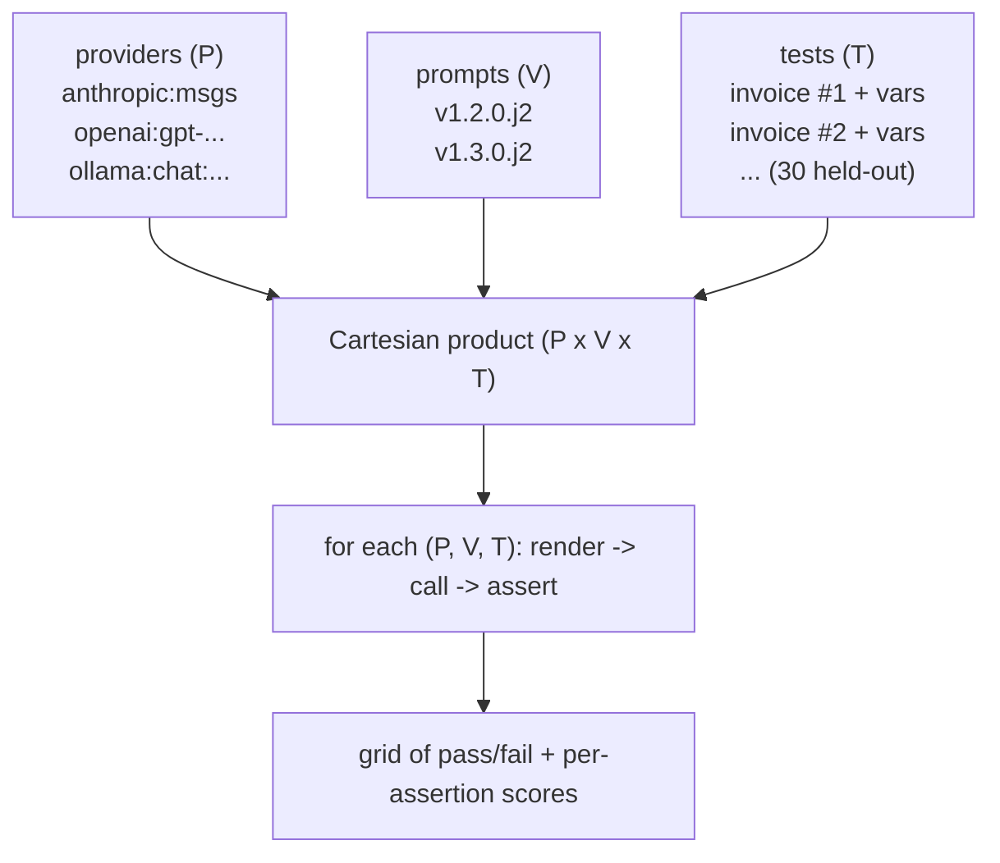

# Lecture 10: Eval-Driven Prompt Development with promptfoo

> A prompt change with no eval behind it is a vibe, not an improvement. You edited three words, the playground output "looked better," and you shipped — and you have no idea whether you fixed the hard cases or quietly regressed the easy ones. This lecture installs the discipline that ends the vibes era of your prompt work: every change is gated behind one repeatable command that measures a delta on a held-out set, and *fails loudly* when a worse prompt sneaks in. After this you can stand up a `promptfoo` suite that grids prompt versions against providers, write assertions that check field *correctness* (not just "the JSON parsed"), read per-field pass rates off the grid, and treat the whole thing as CI-for-prompts — the measured-delta backbone of everything else this phase.

**Prerequisites:** Lecture 1 (prompt anatomy), Lecture 2 (held-out sets, few-shot), Lecture 3 (provider idioms), and the Week 1 lab (a labeled `invoices.jsonl` and a working extraction prompt). Comfort with YAML, `npm`, and a few lines of JavaScript. · **Reading time:** ~26 min · **Part of:** Prompting & Context Engineering, Week 2

---

## The core idea (plain language)

You already treat application code this way: you don't merge a change unless the test suite is green, and you write the test *before* you trust the fix. Prompts deserve the same contract, and for the same reason — a frozen model is a black box whose behavior you can only observe, never prove. The only honest statement you can make about a prompt is "on *these* inputs it produced *these* outputs, and here is the pass rate." Everything else is anecdote.

The trap that keeps engineers in the anecdote era is that prompts *feel* testable by eyeball. You run five examples in the playground, they look right, you ship. This fails in three predictable ways:

1. **You optimized the demo, not the distribution.** The five you eyeballed were the easy five. Your held-out hard cases (missing currency, European dates, line-item math from Lecture 2) silently regressed.
2. **You "improved" one field and broke another.** You tightened the `date` instruction and, because prompts are global, `total_amount` extraction got worse. With no per-field measurement you never see it.
3. **You confused *parses* with *correct*.** The output was valid JSON, so your check passed — but `total_amount` was `0.00` on every European invoice. A valid-but-wrong prompt is the most dangerous kind, because it sails through every superficial gate.

`promptfoo` is the harness that closes all three. It runs a matrix — every prompt version × every provider × every test case — applies assertions to each cell, and produces a grid you read like a regression report. Crucially, it is *one command* (`promptfoo eval`) that exits non-zero when the suite fails, which is exactly the shape CI wants. The measured-delta philosophy of this whole phase — "ship only on a proven improvement" — is enforced mechanically here, or it isn't enforced at all.

## How it actually works (mechanism, from first principles)

### The four moving parts

A promptfoo run is a Cartesian product with a scoring function bolted on:



If you have 3 providers, 2 prompt versions, and 30 tests, that is `3 × 2 × 30 = 180` model calls per `eval`. Each call renders the prompt template with the test's variables, hits the provider, and runs the test's assertions against the output. The result is a cell that is green (all asserts passed) or red, and every assertion carries a score that rolls up into per-field and per-cell pass rates.

Keep the arithmetic in mind because it *is* your cost model. At 180 calls, on a paid frontier model at ~1–2k tokens per call, you are spending real money every time you run the gate. This is the single biggest reason the free **Ollama** path matters: `ollama:chat:qwen2.5:7b` runs the identical grid at zero marginal cost, so you can iterate the *suite* offline and reserve paid providers for the final cross-provider comparison.

### Anatomy of promptfooconfig.yaml

The whole gate lives in one declarative file. Here is a fuller version of the Week 2 sketch, annotated:

```yaml
# promptfooconfig.yaml
description: "Invoice extraction — version × provider gate"

prompts:
  - file://prompts/registry/invoice_extract@1.2.0.j2
  - file://prompts/registry/invoice_extract@1.3.0.j2

providers:
  - anthropic:messages:claude-sonnet-4-5      # authoritative system channel
  - openai:gpt-4.1-mini                        # developer message
  - ollama:chat:qwen2.5:7b                      # free offline path

tests: file://data/promptfoo_tests.yaml         # your 30 held-out cases

defaultTest:                                     # runs on EVERY test unless overridden
  assert:
    - type: is-json                              # NECESSARY, NOT SUFFICIENT
    - type: javascript                           # this is where correctness lives
      value: |
        const o = JSON.parse(output);
        return o.total_amount === context.vars.expected_total;
```

Three things earn their keep here. First, `prompts` points at your *versioned Jinja2 templates* (from the same lecture's registry) — promptfoo renders them, so your eval tests the exact bytes you ship, not a copy that drifts. Second, `providers` uses promptfoo's provider-id grammar: `anthropic:messages:<model>`, `openai:<model>`, `ollama:chat:<model>`. Third, `defaultTest.assert` is the shared assertion block; per-test asserts add case-specific checks on top.

### Pulling expected values into test vars

Your held-out set is already `{text, expected:{...}}` from Week 1. The eval needs each field's ground truth available as a `context.vars.*` value the assertion can compare against. The `tests` file maps your dataset onto promptfoo's shape:

```yaml
# data/promptfoo_tests.yaml
- vars:
    document: "INVOICE  Rechnung Nr. 4471  Datum 03.11.2025  Summe 1.284,50 EUR"
    expected_total: 1284.50
    expected_currency: "EUR"
    expected_invoice_number: "4471"
  assert:
    - type: javascript
      value: JSON.parse(output).currency === context.vars.expected_currency
```

`vars.document` is what the template's `{{ document }}` slot renders; `vars.expected_total` etc. are the ground truth the assertion reads via `context.vars`. In practice you generate this YAML from your JSONL with a tiny script so the eval and your training data never diverge. Note the European invoice deliberately encodes the trap: the string `1.284,50` must be parsed to the number `1284.50`, and a naive prompt will emit `1.28450` or `1284` — a *parses-but-wrong* failure the `is-json` check would wave straight through.

### The assertion taxonomy — and the critical trap

promptfoo assertions fall into three tiers of strength. You must understand the tiers because the weak ones give false confidence:

```
Tier 1 — SHAPE (proves the output is well-formed, NOT correct)
  is-json          → parses as JSON
  contains-json     → contains a JSON blob somewhere
  contains / regex  → substring / pattern present
  is-valid-...schema→ conforms to a JSON Schema

Tier 2 — FIELD CORRECTNESS (proves the values match ground truth)  ← where the money is
  javascript        → arbitrary JS: JSON.parse(output).total_amount === vars.expected_total
  python            → same, in Python
  equals / contains → only useful for single-value outputs

Tier 3 — SEMANTIC / MODEL-GRADED (proves fuzzy quality)
  llm-rubric        → a grader model scores against a rubric
  similar           → embedding cosine similarity ≥ threshold
  answer-relevance  → for RAG-style tasks
```

**Here is the trap, stated bluntly: `is-json` and `contains-json` only prove the output PARSES.** They say nothing about whether the values are right. A prompt that returns `{"vendor":"","invoice_number":"","date":"","total_amount":0,"currency":""}` for every input passes `is-json` on 30/30 cases — a perfect green suite that has learned nothing. If your gate stops at Tier 1, you *will* ship a valid-but-wrong prompt, and you will ship it with a green checkmark that actively hides the bug.

The fix is non-negotiable: **every field you care about gets a Tier-2 `javascript` (or `python`) assertion that compares the parsed value to the expected value in `context.vars`.** The parse is the precondition; the comparison is the test:

```yaml
- type: javascript
  value: |
    let o;
    try { o = JSON.parse(output); } catch { return false; }
    return o.total_amount === context.vars.expected_total
        && o.currency === context.vars.expected_currency;
```

Notice the assertion returns a boolean (pass/fail) but can also return a `{pass, score, reason}` object for partial credit — useful when you want per-field pass rates rather than an all-or-nothing cell. That per-field granularity is what lets you see "v1.3.0 fixed `total_amount` on European invoices but regressed `date`" instead of just "cell is red."

### Reading the grid: promptfoo view

`promptfoo eval` writes results and prints a summary; `promptfoo view` opens a local web UI with the full grid — rows are test cases, columns are (prompt × provider) combinations, each cell green/red with the output and per-assertion breakdown on click. This is where regressions become *visible*: a column that was all-green last week now has three red cells, and you can see at a glance it's the European-date rows that broke. The view is not decoration — it is the diff tool for prompt behavior. CLI gives you the pass/fail exit code for CI; view gives you the human triage surface.

## Worked example

You have `invoice_extract@1.2.0` in production. You believe adding a "reason then extract" scratchpad (`@1.3.0`) will fix the line-item-math cases. Old workflow: eyeball five, ship. New workflow: gate it.

Your held-out set is 30 cases; 5 are the hard arithmetic ones. You run against two providers (Ollama for iteration, Claude for the real comparison). That's `2 providers × 2 versions × 30 tests = 120` calls. Each test has a Tier-1 `is-json` and Tier-2 field-correctness asserts for all five fields.

You run `promptfoo eval` and read the per-field pass rates off `promptfoo view`:

| Field | v1.2.0 (Claude) | v1.3.0 (Claude) | Delta |
|---|---|---|---|
| vendor | 29/30 | 29/30 | 0 |
| invoice_number | 30/30 | 30/30 | 0 |
| date | 28/30 | **25/30** | **−3** |
| total_amount | 24/30 | **29/30** | **+5** |
| currency | 27/30 | 27/30 | 0 |

The measured delta tells the real story: `@1.3.0` fixed 5 `total_amount` cases (the arithmetic ones — exactly the hypothesis) but *regressed* 3 `date` cases, because the scratchpad instruction accidentally nudged the model to normalize dates it shouldn't. Without per-field measurement you'd have shipped the regression. Now you have a choice grounded in numbers: net +2 correct fields might be worth it, or you iterate `@1.3.1` to keep the total_amount win without the date loss. Either way you are *deciding on a delta*, which is the whole point.

Then the capability that makes it a real gate: you deliberately construct `invoice_extract@0.9.0-bad` (a known-worse prompt — say, one that drops the "return numbers not strings" rule). You add it to the grid and run. The suite goes **red** — `total_amount` pass rate craters because the model now returns `"1,284.50"` as a string and `=== 1284.50` fails. A gate that stays green when you feed it a known-worse prompt is not a gate; proving it *fails on demand* is how you know the assertions have teeth. (This is exactly the milestone requirement: "demonstrably fails when a worse prompt version is swapped in.")

## How it shows up in production

- **The green-suite-that-tests-nothing.** The most common production failure of an eval gate is a suite full of Tier-1 asserts. It's green on every PR, everyone trusts it, and it has never once caught a correctness bug because it only ever checked that JSON parsed. You find out in an incident when a customer's totals are all zero. Audit your asserts: if none of them read `context.vars`, you have no correctness coverage.
- **Cost of the gate itself.** At 3×2×30 = 180 calls per run, on a paid model, an eval is not free — run it on every PR and you're paying per-PR. The discipline: iterate the suite on Ollama, run the full paid grid at the merge gate. A team that runs the full frontier grid on every keystroke burns budget for no signal.
- **Flakiness from nonzero temperature.** If a provider samples at temperature > 0, the same (prompt, input) can pass one run and fail the next, and your gate becomes a coin flip. Pin the provider config to deterministic settings where the API allows it, and for genuinely stochastic outputs use threshold-based asserts (score ≥ X over N runs) rather than exact-match.
- **Regressions become visible instead of mysterious.** The payoff: when quality drops in production, `promptfoo view` on the last two versions shows you the exact rows and fields that moved. You stop guessing "did the model update change something?" and start reading a diff.
- **Provider drift caught early.** Because the grid runs all providers, a silent regression from a model version bump on one provider shows up as one column going red while the others stay green — a signal you'd never see testing a single provider.

## Common misconceptions & failure modes

- **"`is-json` means the prompt works."** No. It means the output parses. Correctness lives only in Tier-2 asserts that compare to ground truth. This is the single most important sentence in the lecture.
- **"contains-json is stronger than is-json."** It's *weaker* on shape (it tolerates surrounding prose) and equally silent on correctness. Neither proves a single field is right.
- **"A green suite means I can ship."** Only if the suite would go *red* on a known-worse prompt. An untested gate can be green because it's blind. Prove it fails before you trust its greens.
- **"More assertions = better."** Redundant Tier-1 asserts add nothing. One correctness assert per field you care about beats ten shape asserts.
- **"llm-rubric can replace field asserts."** Model-graded asserts are for fuzzy quality (tone, helpfulness) and are themselves stochastic and costly. For an exact field like `total_amount`, a deterministic `===` is cheaper, faster, and correct — don't reach for a grader model when arithmetic will do.
- **"I'll eval against the same examples I tuned the prompt on."** That measures memorization of your demo set, not generalization. The dataset must be *held out* from prompt authoring, or your pass rates are inflated fiction.
- **"Exact-match on floats is fine."** `0.1 + 0.2 !== 0.3`. For money, compare with a tolerance (`Math.abs(a-b) < 0.005`) or compare integer cents.

## Rules of thumb / cheat sheet

- **The one law:** shape asserts (`is-json`, `contains-json`) are a *precondition*, never the test. Every field you care about gets a Tier-2 `javascript`/`python` assert comparing to `context.vars.expected_*`.
- **Prove the gate has teeth:** keep a `*-bad` known-worse prompt in your back pocket; the suite must go red when it's swapped in.
- **Iterate on Ollama, gate on frontier.** `ollama:chat:qwen2.5:7b` for the free offline loop; add `anthropic:messages:...` / `openai:...` at the merge gate.
- **Provider grammar:** `anthropic:messages:<model>`, `openai:<model>`, `ollama:chat:<model>`. Point `prompts:` at your versioned `.j2` files so you eval the bytes you ship.
- **Per-field over per-cell.** Return `{pass, score, reason}` for partial credit so you see *which* field moved, not just that the cell is red.
- **Numbers need tolerance.** Compare money as cents or with `Math.abs(diff) < epsilon`; never `===` raw floats.
- **Held-out or it doesn't count.** Never eval on the examples you tuned against.
- **Cost math before you run:** `providers × versions × tests = calls`. Know the number; it's your bill and your latency.
- **CLI for CI (exit code), `view` for triage (the grid).** Wire `promptfoo eval` into CI as a required check.

## Connect to the lab

This lecture is the theory behind Week 2's third deliverable — the **promptfoo eval gate**. Install with `npm i -g promptfoo`, author `promptfooconfig.yaml` with your 30-example held-out set as `tests`, two prompt versions × two providers as the matrix, and per-field `javascript` asserts (not just `is-json`). Run `promptfoo eval` → `promptfoo view` to read the version × provider grid. Then satisfy the milestone's hardest checkbox: build a deliberately degraded prompt and prove the suite goes red when it's swapped in — a gate that only ever goes green is a gate you haven't tested.

## Going deeper (optional)

Real, named sources (root domains only — search for the exact page):

- **promptfoo docs** — `promptfoo.dev/docs`: "Configuration," "Assertions & metrics" (the full assertion type reference), "Providers" (anthropic/openai/ollama IDs), "Command line." Search: `promptfoo assertions javascript`, `promptfoo providers ollama`, `promptfoo config reference`.
- **promptfoo GitHub** — `github.com/promptfoo/promptfoo`: the canonical repo, `examples/` directory has runnable configs for every provider and assertion type. Search: `promptfoo github examples`.
- **OpenAI Evals** — `github.com/openai/evals`: the adjacent "evals as code" paradigm for framing; heavier than promptfoo but the same philosophy. Search: `OpenAI evals framework`.
- **Anthropic docs** — `docs.claude.com`: "Create strong empirical evaluations" for the general eval-design discipline (choosing metrics, held-out sets). Search: `Anthropic building evals`.
- Background: search `eval-driven development LLM` and `LLM regression testing CI` for the broader practice this lecture instantiates.

Because promptfoo's assertion names and provider-id grammar evolve, verify syntax against the current `promptfoo.dev/docs` before wiring CI — this lecture is accurate to 2025-2026 but exact field names move.

## Check yourself

1. Your promptfoo suite is green on 30/30 cases, and every assertion is `type: is-json`. A colleague says "great, ship it." What is wrong with that reasoning, and what single change fixes it?
2. Write (in words or code) the assertion that proves `total_amount` is correct on a European invoice whose expected total is 1284.50. What subtle bug must you avoid?
3. Why is proving the suite *fails* on a known-worse prompt a required step, not a nice-to-have?
4. You have 3 providers, 2 prompt versions, and 30 tests. How many model calls does one `promptfoo eval` make, and what's the practical implication for how you run it during iteration vs. at the merge gate?
5. `promptfoo view` shows one provider's column went from all-green to three red cells after no prompt change on your side. What's the likely cause, and why would testing a single provider have hidden it?
6. When is a `llm-rubric` (model-graded) assert the right tool, and when is it the wrong tool?

### Answer key

1. `is-json` only proves the output *parses*, not that any field is *correct* — a prompt that returns all-empty/all-zero JSON passes 30/30 while being useless. The fix: add Tier-2 `javascript`/`python` asserts that compare parsed fields to `context.vars.expected_*` ground truth. Shape is a precondition, not the test.
2. `JSON.parse(output).total_amount === context.vars.expected_total` where `expected_total` is the number `1284.50`. Subtle bugs: (a) the model may emit `"1.284,50"` (European string) or `1284` — your prompt must produce a clean number, and the assert catches it if not; (b) never exact-match raw floats — compare cents or use `Math.abs(a-b) < 0.005` to avoid float-representation false failures.
3. A gate can be green because its assertions are blind (all Tier-1, or reading the wrong var), not because the prompt is good. Feeding it a deliberately worse prompt and confirming it goes *red* is the only way to prove the assertions actually discriminate quality. An untested gate provides false confidence — worse than no gate.
4. `3 × 2 × 30 = 180` calls per run. Implication: on a paid frontier model that's real cost and latency every run, so iterate the suite on the free **Ollama** provider offline, and run the full paid grid only at the merge gate (where the exit code blocks the PR).
5. A provider-side model version bump silently changed behavior on those rows. Testing a single provider would hide it because you'd have no green baseline to contrast against — the grid makes it visible precisely because the *other* columns stayed green while one drifted.
6. Right tool: fuzzy, semantic quality with no exact ground truth — tone, helpfulness, "does this summary capture the key points." Wrong tool: exact fields like `total_amount` or `currency`, where a deterministic `===`/tolerance check is cheaper, faster, non-stochastic, and definitively correct. Don't spend a grader-model call on arithmetic.
