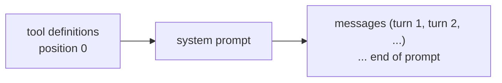
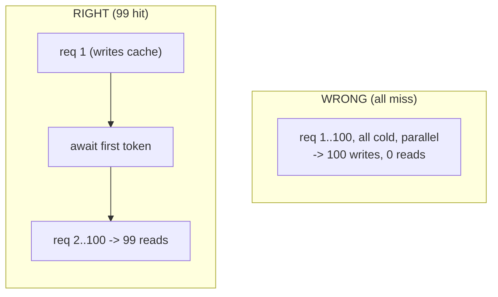

# Lecture 12: Prompt Caching Mechanics

> Prompt caching is the single highest-leverage cost-and-latency knob you have on a frozen model — it can cut input cost by ~90% and shave seconds off time-to-first-token, for free, on workloads you already run. But it fails *silently*: no error, no warning, just a bill that never drops. This lecture teaches caching to the byte. After it, you will be able to build a prompt-assembly path that caches by construction, read the three `usage` fields that prove a hit, and hunt down the invisible byte that busts everything downstream.

**Prerequisites:** Lecture on prompt anatomy (system/tools/messages layout), basic token counting, comfort reading JSON request payloads · **Reading time:** ~22 min · **Part of:** Prompting & Context Engineering, Week 3

---

## The core idea (plain language)

When you send a request to Claude, the model has to *process* every input token before it can generate the first output token. That prefill pass is real compute, and you pay for it in both latency and dollars. Prompt caching lets the provider **remember the work it already did** on a chunk of your prompt, so that on the next request with the same leading chunk it skips the prefill and reads the cached state instead.

Here is the one sentence to memorize and repeat until it is reflex:

> **Prompt caching is a prefix match. Any byte change anywhere in the prefix invalidates everything after it.**

That's the whole model. The cache key is derived from the *exact bytes* of the rendered prompt, from the start up to a marker you place called a **cache breakpoint** (`cache_control`). If two requests share the same leading bytes up to that marker, the second one reads the cache. If a single byte differs at position N — a timestamp, a reordered JSON key, a per-user ID — then the cache is invalid from position N onward, and everything after N is reprocessed at full price.

Everything else in this lecture is a consequence of that one rule. Get the byte layout right and caching mostly works for free. Get it wrong and no amount of `cache_control` markers will save you.

---

## How it actually works (mechanism, from first principles)

### Render order is fixed: tools → system → messages

Before anything is hashed, the API assembles your request into a single linear byte sequence in a fixed order:



This order is not negotiable and it is the foundation of every placement decision. Tools live at the very front (position 0). The system prompt comes next. The conversation turns come last. A cache breakpoint placed on the last system block therefore caches **tools + system together**, because both sit before it in the byte stream.

The design rule falls straight out of this: **stable content goes first, volatile content goes last.** You want your frozen, byte-identical content (the system prompt that never changes, a deterministically-ordered tool list) up front where it can be cached, and your per-request junk (the user's actual question, a timestamp) strictly *after* the last breakpoint where it can change freely without invalidating anything.

### The breakpoint and the cache key

You mark a breakpoint by attaching `cache_control` to a content block:

```json
"system": [
  { "type": "text", "text": "<large frozen prompt>", "cache_control": { "type": "ephemeral" } }
]
```

At request time the API walks the prefix up to that marker, computes a key over the exact bytes (scoped to the model — caches are per-model), and checks whether it has a stored prefill state for that key. Hit → it reads the state (cheap, fast). Miss → it does the prefill and *writes* the state (slightly more expensive than an uncached request, so the next request can read it).

`type: "ephemeral"` is the only cache type. It has a default **5-minute TTL** (time-to-live), refreshed on each read, and an optional **1-hour** variant:

```json
"cache_control": { "type": "ephemeral", "ttl": "1h" }
```

You get at most **4 breakpoints** per request. `cache_control` can go on any content block: system text, tool definitions, or message content (`text`, `image`, `tool_use`, `tool_result`, `document`).

### Minimum cacheable prefix (a real trap)

A prefix below a model-specific token threshold **silently won't cache** even with a marker present — no error, just `cache_creation_input_tokens: 0`. Approximate thresholds (verify against current docs; these shift with model releases):

| Model | Minimum cacheable prefix |
|---|---:|
| Opus 4.8 / 4.7 / 4.6 / 4.5, Haiku 4.5 | ~4096 tokens |
| Fable 5, Sonnet 4.6, Haiku 3.5 / 3 | ~2048 tokens |
| Sonnet 4.5 / 4.1 / 4 / 3.7 | ~1024 tokens |

A 3K-token prompt caches on Sonnet 4.5 but silently won't on Opus 4.8. If your prefix is small, don't bother — there's nothing to cache and you'd only pay the write premium.

### The economics (arithmetic an engineer needs)

Two documented multipliers drive every decision (label as approximate; they are ratios against your base input price, not fabricated benchmarks):

- **Cache read:** ~0.1× base input token price.
- **Cache write:** ~1.25× for the 5-minute TTL, ~2× for the 1-hour TTL.

So a cached prefix costs *more* the first time (you pay the write premium) and *far less* every time after. Break-even is simple:

- **5-minute TTL:** write (1.25×) + one read (0.1×) = 1.35×, versus 2× uncached for two requests. **Two identical-prefix requests already win.**
- **1-hour TTL:** write (2×) + one read (0.2×) = 2.2×, versus 3× uncached. **You need three requests** before the doubled write pays off. The 1-hour TTL buys you survival across gaps in bursty traffic; you pay for that with a higher break-even.

Worked cost example. Say your shared prefix is 10,000 tokens and your base input price is `$P` per token. Cold, one request costs `10000 × P`. With 5-minute caching over 100 identical-prefix requests:

```
1 write   :  10000 × 1.25 × P  = 12,500 P
99 reads  :  10000 × 0.10 × P  =  99,000 × 0.1 ... = 99,000 P? 
```

Careful — reads are `10000 × 0.1 × P = 1000 P` each, so:

```
1 write   :  10000 × 1.25 × P     =  12,500 P
99 reads  :  99 × 10000 × 0.1 × P  =  99,000 P
total (cached)                      = 111,500 P

100 uncached : 100 × 10000 × P      = 1,000,000 P
```

That's an ~89% reduction on the cached portion — the "up to 90% savings" you see quoted, and it's just arithmetic from the 0.1× read multiplier.

### The invalidation hierarchy (not everything busts everything)

The API keeps three cache tiers that mirror the render order. A change invalidates its own tier **and everything after it**, but not tiers before it:

| Change you make | Tools cache | System cache | Messages cache |
|---|:---:|:---:|:---:|
| Tool definitions (add / remove / reorder) | ❌ | ❌ | ❌ |
| Model switch | ❌ | ❌ | ❌ |
| System prompt content | ✅ kept | ❌ | ❌ |
| `tool_choice`, images, thinking toggle | ✅ | ✅ | ❌ |
| Message content | ✅ | ✅ | ❌ |

Read this as: touching tools or switching models forces a **full rebuild** (they're at position 0). But you can flip `tool_choice` per request, or toggle thinking, and still keep your expensive tools+system cache. Don't over-worry the bottom rows; guard the top two with your life.

### The 20-block lookback window

Each breakpoint walks backward **at most 20 content blocks** to find a matching prior cache entry. In an agentic loop that appends many `tool_use`/`tool_result` pairs per turn, a single turn can add more than 20 blocks — and the next request's breakpoint won't reach the previous cache, so it silently misses. Fix: place an intermediate breakpoint every ~15 blocks in long turns.

### Concurrency: the timing gotcha the lab exploits

A cache entry becomes readable only **after the first response begins streaming.** Fire 100 identical requests in parallel at a cold cache and *all 100 miss* — none can read a state the others are still writing. This is the operational trap that makes naive cache tests report a 0% hit rate.



To test or exploit caching: send **one** request, await its *first streamed token* (not the full response), then fan out the remaining N−1. They read the cache the first one just wrote.

You can also **pre-warm** deliberately with a `max_tokens: 0` request at startup: the API runs prefill (writing your breakpoint's cache) and returns immediately with empty content. Worth it only when first-request latency is user-visible, the prefix is large, and there's a quiet moment before traffic.

---

## Worked example

Here is a prompt that caches, and the one-byte edit that destroys it.

**Version A — caches correctly.** Frozen system prompt with a deterministic, sorted tool list, breakpoint on the last system block, volatile question last:

```python
tools = sorted(load_tools(), key=lambda t: t["name"])   # deterministic order
resp = client.messages.create(
    model="claude-opus-4-8",
    max_tokens=1024,
    tools=tools,
    system=[{
        "type": "text",
        "text": FROZEN_SYSTEM_PROMPT,          # never interpolated, byte-identical
        "cache_control": {"type": "ephemeral"},
    }],
    messages=[{"role": "user", "content": user_question}],  # varies, AFTER the breakpoint
)
print(resp.usage.cache_creation_input_tokens,   # first call: >0 (write)
      resp.usage.cache_read_input_tokens,        # later calls: >0 (read)
      resp.usage.input_tokens)                    # uncached remainder (the question)
```

First request: `cache_creation_input_tokens` is large (you wrote the tools+system prefix), `cache_read_input_tokens` is 0. Second identical-prefix request: `cache_creation_input_tokens` is 0, `cache_read_input_tokens` is large. That flip is the proof.

**Version B — the silent invalidator.** Someone adds "helpful context" to the system prompt:

```python
system_text = f"Current date: {datetime.now()}\n\n" + FROZEN_SYSTEM_PROMPT
```

Now the first bytes of the prefix change every single request. The cache key never repeats. `cache_read_input_tokens` is **0 forever**, on every call, and you're paying the 1.25× *write* premium on top — this is worse than not caching at all. There is no error. The only symptom is the bill.

The fix is to move the timestamp *after* the last breakpoint — into the messages array, never into the frozen prefix:

```python
messages=[{
    "role": "user",
    "content": [
        {"type": "text", "text": f"Current date: {datetime.now()}"},  # volatile, last
        {"type": "text", "text": user_question},
    ],
}]
```

A date at turn 5 invalidates nothing before turn 5. A date at the top of the system prompt invalidates everything.

---

## How it shows up in production

**Cost.** A RAG or extraction service that stuffs a large fixed preamble (instructions + few-shot examples + a static document) in front of a small varying question is the ideal caching workload. Cached, the preamble bills at 0.1×; uncached, it bills at 1× on every call. At scale, that's the difference between a caching line item and a caching *incident*.

**Latency.** Prefill is a big share of time-to-first-token on long prompts. A cache read skips it. In interactive/chat/voice products this is directly user-visible — the cached path feels snappy; the cold path feels like a stall. This is exactly why pre-warming exists: eat the write cost during startup so the first *real* user request is already warm.

**Debugging.** The failure mode is always the same: "we added `cache_control`, why is the bill the same?" The answer is a silent invalidator somewhere in the prefix. Your instrument is the `usage` object. On two requests you *believe* have identical prefixes, `cache_read_input_tokens` should be non-zero on the second. If it's a persistent zero, something is busting it — diff the rendered prompt bytes between the two requests and find the character that differs.

**The token-accounting trap.** `input_tokens` is only the *uncached remainder*. Total prompt size = `input_tokens + cache_creation_input_tokens + cache_read_input_tokens`. If your agent ran for an hour and `input_tokens` reads 4K, don't panic — the rest was served from cache. Sum all three before drawing conclusions about context size.

**Cross-provider reality.** OpenAI and Gemini cache **automatically** on stable prefixes — no explicit breakpoint to place. That sounds easier, but it means the *design discipline is identical and just as load-bearing*: stable content first, volatile content last, no `datetime.now()` or unsorted JSON in the prefix. Automatic caching only helps if your prefix is actually stable. The habits you build against Anthropic's explicit `cache_control` transfer directly; they just become invisible instead of optional.

---

## Common misconceptions & failure modes

- **"I added `cache_control`, so it's cached."** No. The marker is necessary, not sufficient. Verify `cache_read_input_tokens`. A marker on a prefix that changes every request, or below the minimum-token threshold, does nothing (worse — it charges the write premium).
- **"Caching is about the marker placement."** It's about the *byte layout*. Placement matters, but the architecture — frozen system prompt, deterministic tool order, volatile content last — matters far more. Fix the layout first.
- **`json.dumps(d)` without `sort_keys=True`.** Python dict / JSON serialization key order can vary, so the serialized bytes differ across runs and the prefix hash changes. Same for iterating a `set`. Serialize deterministically or the cache never matches.
- **Per-user ID early in the prefix.** `f"User: {user_id}\n" + SYSTEM` gives every user a distinct prefix and kills cross-user sharing. Inject the ID later, in messages.
- **Varying tool set.** `tools=build_tools_for(user)` where the set differs per user means tools (position 0) differ, so nothing caches across users. Serialize a stable, sorted superset; gate behavior with `tool_choice` or message content instead of swapping the tool list.
- **Conditional system sections.** `if flag: system += "..."` makes every flag combination a distinct prefix. Move the conditional bit downstream.
- **Template whitespace drift.** Two template versions that render identical text but differ by a trailing space or a `\n` are different byte sequences → different cache keys. This is why you version prompt templates and never hand-edit "just this once."
- **Testing with 100 parallel identical requests.** All miss (concurrency gotcha). Warm with one request first.
- **Mid-conversation cache breakage.** Editing the top-level system prompt mid-session invalidates the entire conversation cache. On supporting models, append a `{"role": "system", ...}` message instead — it sits after the cached history and leaves the prefix intact.

---

## Rules of thumb / cheat sheet

- **The invariant:** prefix match. One changed byte in the prefix invalidates everything after it.
- **Order:** tools → system → messages. Stable first, volatile strictly after the last breakpoint.
- **Place the breakpoint** at the end of the *shared* content, not the end of the whole prompt. Marker at the end of the varying part = every request writes a unique entry and nothing is ever read.
- **Keep the system prompt frozen.** No `datetime.now()`, no UUIDs, no per-user IDs, no conditional sections up front.
- **Serialize deterministically.** `json.dumps(..., sort_keys=True)`; sort tool lists by name.
- **Never change tools or model mid-conversation** unless you accept a full cache rebuild.
- **Verify every time:** `cache_read_input_tokens > 0` on the second identical-prefix request. Persistent zero = something is busting it → diff the bytes.
- **Total tokens** = `input_tokens + cache_creation_input_tokens + cache_read_input_tokens`.
- **Economics (approx):** read ~0.1×, write ~1.25× (5m) / ~2× (1h). 5m breaks even at 2 requests; 1h at 3.
- **Max 4 breakpoints.** Add an intermediate one every ~15 blocks in long agentic turns (20-block lookback).
- **Minimum prefix** ~1024–4096 tokens depending on model — below it, nothing caches.
- **To test/exploit:** warm with one request, await first token, then fan out. Pre-warm with `max_tokens: 0` when first-request latency is user-visible.

---

## Connect to the lab

Week 3's cache lab is where this becomes muscle memory. You'll restructure the extraction prompt into a frozen system + deterministic tool list first (with a `cache_control` breakpoint) and the volatile question last, then fire the same stable-prefix request **100 times** — warming with one request before the fan-out — and log `cache_read_input_tokens` / `cache_creation_input_tokens` / `input_tokens` on each. Your deliverable is the cached-token %, the cached-vs-cold p50 latency delta, and the cost delta over 100 requests. Then you'll *deliberately* inject a silent invalidator (`datetime.now()` into the system prompt), rerun, and watch the hit rate collapse to zero — that collapse is the lesson the whole lecture exists to teach. Definition of Done for the phase gate is a **>80% hit rate** on the stable workload plus a documented silent-invalidator audit.

---

## Going deeper (optional)

- **Anthropic — "Prompt caching"** (platform.claude.com docs). The authoritative reference for `cache_control`, TTLs, minimum thresholds, and the `usage` fields. Search: `Anthropic prompt caching docs`.
- **Anthropic — "Effective context engineering for AI agents"** and **"Long context tips."** Frames caching inside the broader working-memory discipline. Search: `Anthropic context engineering`.
- **OpenAI — "Prompt caching"** guide. Automatic caching on stable prefixes; confirms the stable-first design discipline is identical. Search: `OpenAI prompt caching guide`.
- **Google Gemini API docs — "Context caching."** Both implicit (automatic) and explicit caching. Search: `Gemini context caching`.
- Instrument first, read second: the fastest way to internalize this is to log the three `usage` fields on a real workload and diff prompt bytes when the read count is zero.

---

## Check yourself

1. State the one caching invariant in a single sentence, and name three silent invalidators.
2. What is the render order, and where does a `cache_control` breakpoint on the last system block cache from and to?
3. You send 100 identical-prefix requests in parallel to test caching and see a 0% hit rate. Explain why, and how to fix the test.
4. Which `usage` field proves a cache hit, and what does a persistent zero there tell you? How do you compute the true total prompt size?
5. Given the approximate multipliers (read 0.1×, write 1.25× for 5-minute TTL), at how many identical-prefix requests does caching break even, and why is the 1-hour TTL's break-even higher?
6. Your system prompt is 3,000 tokens on Opus 4.8 and `cache_creation_input_tokens` is always 0 despite a correct-looking `cache_control` marker and no invalidators. What's the likely cause?

### Answer key

1. **Caching is a prefix match — any byte change anywhere in the prefix invalidates everything after it.** Three silent invalidators (any three): `datetime.now()`/timestamps in the system prompt; unsorted `json.dumps` (nondeterministic key order); a per-user ID early in the prefix; a varying tool set; template whitespace drift.
2. Render order is **tools → system → messages**. A breakpoint on the last system block caches from position 0 through that block — i.e. **tools + system together** (tools render before system).
3. All 100 miss because a cache entry becomes readable only **after the first response begins streaming** — 100 cold parallel requests each write, none can read a state the others are still writing. Fix: send **one** request, await its first streamed token, then fan out the remaining 99 (or pre-warm with a `max_tokens: 0` request first).
4. `cache_read_input_tokens > 0` proves a hit. A persistent zero across identical-prefix requests means a silent invalidator is changing the prefix bytes — diff the rendered prompts to find it. True total = `input_tokens + cache_creation_input_tokens + cache_read_input_tokens` (`input_tokens` is only the uncached remainder).
5. **Two requests.** Write (1.25×) + one read (0.1×) = 1.35× vs 2× uncached for two requests — already a win. The 1-hour TTL's write premium is ~2×, so write (2×) + one read (0.2×) = 2.2× needs a *third* request to beat 3× uncached; you pay the higher write cost in exchange for the entry surviving longer gaps.
6. The prefix is **below the minimum cacheable threshold** for Opus 4.8 (~4096 tokens). A 3,000-token prefix silently won't cache on that model — no error, just `cache_creation_input_tokens: 0`. It *would* cache on a model with a ~1024/2048 threshold.
