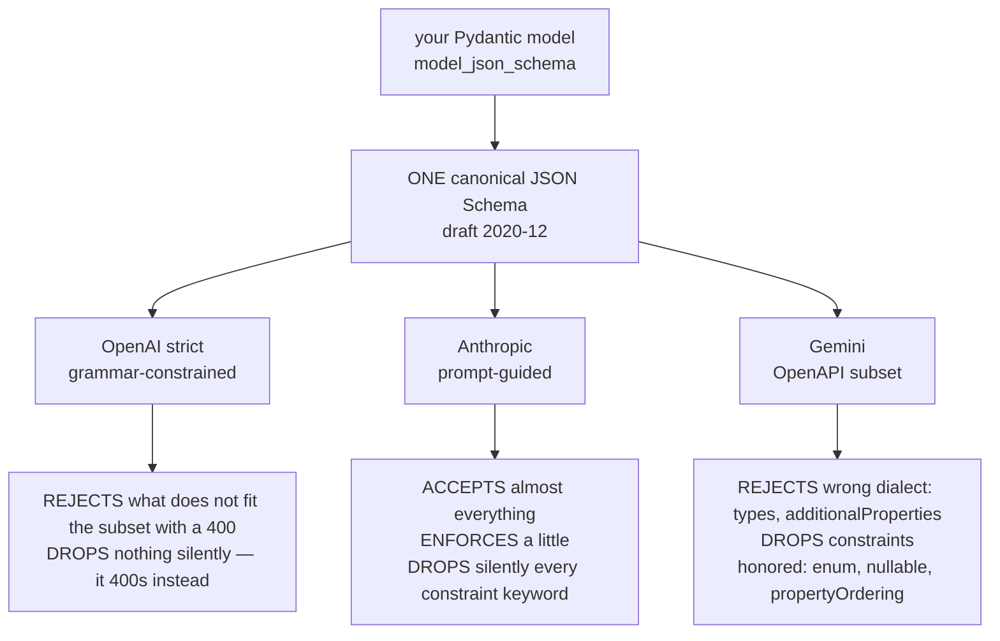

# Lecture 3: Provider JSON-Schema Subsets and Strict-Mode Gotchas

> You wrote a clean Pydantic model, called `model_json_schema()`, and shipped it to three providers. OpenAI returned a 400 before the model even ran. Anthropic accepted it happily and then emitted a `total_usd` of `-1` that your `minimum: 0` was supposed to forbid. Gemini 400'd on the word `additionalProperties` and silently reordered your fields so the reasoning came out *after* the answer. Nobody was lying to you — but "valid JSON Schema" is a fiction the moment you cross a provider boundary. This lecture is the memorize-this engineering reference for what each provider *actually* honors, why the same schema fails three different ways, and the repeatable method for logging exactly which keywords survived the trip. After this you will be able to hand-transform a schema into each provider's dialect from memory, predict whether a violation will scream (400) or hide (silent drop), and produce the honored-vs-dropped keyword table that is a Week 1 Definition of Done.

**Prerequisites:** Lecture 1 (when to force structure) · the three-tiers concept · Pydantic v2 `model_json_schema()` · comfort reading JSON Schema · **Reading time:** ~26 min · **Part of:** Structured Outputs & Tool Calling — Week 1

---

## The core idea (plain language)

There is no such thing as "JSON Schema" as a single thing your code can target across providers. There is the JSON Schema *specification* (draft 2020-12 and friends), and then there are three **proper subsets**, each with its own rejections, silent drops, and dialect quirks:

- **OpenAI Structured Outputs (strict mode)** compiles your schema into a real grammar that *constrains decoding*. It is the most guaranteeing tier and the most demanding: it rejects schemas that don't fit its subset, at request time, loudly.
- **Anthropic tool `input_schema`** is a *guidance* subset. It steers the model but does not hard-constrain the tokens. It accepts far more than it enforces, so violations are silent.
- **Gemini `responseSchema`** is not JSON Schema at all — it's a subset of the **OpenAPI 3.0 Schema Object**, a different dialect with uppercase type names, a bespoke `propertyOrdering` knob, and narrower union support.

The single mental model that makes all of this tractable: **a schema keyword can meet one of three fates at a provider** — *honored* (enforced), *silently dropped* (accepted and ignored, so your constraint is a lie), or *rejected* (400 before generation). Your job is to know, per keyword per provider, which fate it meets — because the *silent drop* is the one that costs you money at 3 a.m. A `minLength: 12` on an API-key field that Anthropic ignores doesn't crash; it writes a 4-character garbage key into your database and you find out during an incident.

So the deliverable of this lecture is not "make it work once." It's a **diff artifact**: emit your canonical schema, send it to each provider, and record what each one accepted, transformed, or dropped. That table is your production truth. Everything below builds it.

## How it actually works (mechanism, from first principles)

### Why the subsets exist at all

OpenAI's strict mode works by turning your JSON Schema into a **context-free grammar** and then, at each decoding step, masking the token logits so only tokens that keep the output grammar-valid can be sampled (the logit-masking mechanism you previewed in Lecture 1). A grammar can express "the next token must open a string, or be one of these enum literals, or close this object." It **cannot** express "this string must match this regex" or "this number must be ≥ 0" as a *decoding constraint* without exploding the grammar's size — so those keywords are simply outside the subset. That's not laziness; it's what's cheaply compilable into a finite grammar. This is the root cause of nearly every "silently ignored" keyword: if it can't be a grammar rule, it isn't enforced.

Anthropic takes a different path. Tool `input_schema` is injected into the prompt as a description of the tool's arguments; the model is *trained* to follow it well, but nothing masks the logits against your schema. So Anthropic can *accept* `pattern` and `minimum` (they become hints in the model's context) but cannot *guarantee* them — enforcement is probabilistic, not mechanical. Args come back as an **already-parsed object** on the `tool_use` block (Anthropic did the `json.loads` for you), whereas OpenAI hands you `function.arguments` as a **JSON string** you must parse yourself and that can be malformed.

Gemini predates the JSON-Schema-everywhere convergence and reuses Google's OpenAPI tooling. Its `Schema` object is the OpenAPI dialect: `type` is an **uppercase enum** (`STRING`, `NUMBER`, `INTEGER`, `BOOLEAN`, `ARRAY`, `OBJECT`), optionality is `nullable: true` (not a `["string","null"]` union), and it exposes `propertyOrdering` to control the *generation order* of fields — which matters for quality exactly the way field order mattered in Lecture 1.

### The three fates, drawn

```


Read that as: OpenAI converts "unsupported" into a **400**; Anthropic converts it into a **silent drop**; Gemini does **both**, depending on the keyword.

### OpenAI strict mode: the exact rules

Strict mode is turned on with `response_format={"type":"json_schema","json_schema":{"name":...,"schema":...,"strict":true}}` (or `strict: true` on a function/tool definition). The non-negotiable structural rules:

1. **Every object must set `additionalProperties: false`.** Not the root only — *every* nested object. Miss one and you get a 400 like `Invalid schema: 'additionalProperties' is required to be false`.
2. **Every property must be listed in `required`.** All of them. There is no "optional by omission."
3. **Optional fields are modeled as nullable unions**, i.e. type `["string","null"]` (or `anyOf` with a `{"type":"null"}` branch) — *still listed in `required`*. The field is always present; its *value* may be null.
4. The **root must be an object** (not a bare `anyOf`/union at the top level), and `$ref`/`$defs` are supported for reuse.

The transformation you must do in your head — a Pydantic optional field:

```python
class Invoice(BaseModel):
    po_number: str | None = None   # "optional" in Python
```

`model_json_schema()` emits roughly:

```json
{
  "properties": {
    "po_number": {"anyOf": [{"type": "string"}, {"type": "null"}], "default": null}
  },
  "required": ["vendor_name", "total_usd"]   // po_number MISSING -> illegal in strict
}
```

The **wrong** fix (and the single most common strict-mode error) is to leave `po_number` out of `required`. That is a 400. The **right** transformation:

```json
{
  "properties": {
    "po_number": {"type": ["string", "null"]}
  },
  "required": ["vendor_name", "total_usd", "po_number"],   // ALL keys present
  "additionalProperties": false
}
```

Note two more things: `default` is not part of the strict subset (strip it), and the nullable union stays required. "Optional" in OpenAI-strict-land means **required-but-nullable**, full stop.

**Keywords silently ignored / rejected in strict mode.** These are the ones the grammar can't express: `pattern`, `format`, `minLength`/`maxLength`, `minimum`/`maximum`/`exclusiveMinimum`/`exclusiveMaximum`, `multipleOf`, `minItems`/`maxItems`, `uniqueItems`, `minProperties`/`maxProperties`. Historically OpenAI has **rejected** unsupported keywords in a strict schema with a 400 rather than silently dropping them — which is actually the friendly behavior, because it fails at build time, not at data-corruption time. Do not rely on `maxItems` to bound an array under strict mode; enforce bounds in your Pydantic validator afterward.

**Limits (approximate — verify against current docs).** As of late 2025 the published limits are on the order of: up to ~5,000 total object properties, up to ~10 levels of nesting, a cap of roughly ~1,000 enum values across the whole schema, and a total-string-length budget (all property names + enum/const values) in the low hundreds of thousands of characters, with a tighter cap (~15k chars) for any single large enum. Treat these as *ballpark* and check the docs — the point is that **giant enums and deep nesting have a hard ceiling**, and blowing it is a 400, not a truncation.

**The first-call schema-compile latency.** The very first time OpenAI sees a new strict schema, it compiles that grammar — a one-time cost that can add anywhere from a fraction of a second to several seconds for a big schema, on top of normal generation. The compiled grammar is then **cached** (keyed by the schema). Subsequent calls with the same schema skip the compile. The failure mode this produces: an engineer sees the scary first-call spike, panics, and "optimizes" by dropping `strict: true` — throwing away the *guarantee* to avoid a *one-time* cost that never recurs. Don't. Keep your schema stable (don't regenerate it with reordered keys every deploy, which would bust the cache) and eat the one-time compile.

### Anthropic: subset as guidance

You don't get a `json_schema` response format; the idiom (Lecture on tiers) is to define a **tool** whose `input_schema` is your schema and force it with `tool_choice={"type":"tool","name":...}`. Then read the parsed `input` object off the `tool_use` content block.

- **No `additionalProperties: false` requirement, no all-required requirement.** Optional-by-omission from `required` works exactly as normal JSON Schema — the opposite of OpenAI. You do *not* need nullable-union transforms.
- **Honored (as steering):** `type`, `properties`, `required`, `enum`, `description`, nested objects, `items`, and generally `$defs`/`$ref` and `anyOf`. `description` is heavily used — it's prompt real estate the model reads.
- **Silently dropped (accepted, not enforced):** the constraint keywords — `pattern`, `format`, `minLength`/`maxLength`, `minimum`/`maximum`, `minItems`/`maxItems`. They become soft hints at best. The model *usually* respects an obvious `minimum: 0` because it's sensible, but there is no mechanical guarantee.

The mental correction: Anthropic's schema is a **contract of intent, validated by you**, not a decoding constraint. Always run `Invoice.model_validate(tool_use.input)` after — that Pydantic pass is where `minimum`/`pattern` actually get enforced.

### Gemini: a different dialect entirely

`response_schema` + `response_mime_type="application/json"` (or a function declaration's `parameters`) speaks the OpenAPI subset:

- `type` values are **UPPERCASE** (`STRING`, `INTEGER`, …). A lowercase `"string"` from raw JSON Schema is wrong dialect.
- Optionality is **`nullable: true`**, not a `["string","null"]` union.
- **`propertyOrdering`** controls field generation order — set it so your `reasoning` field generates first (Lecture 1's causal-ordering point, now provider-specific). Without it, order is not guaranteed and quality can drift.
- **`anyOf`/union support is narrower** than OpenAI's; deep or heterogeneous unions may not translate.
- **`additionalProperties`, `$ref`/`$defs`, `pattern`, `format` beyond a small allowlist, and the numeric/length constraints** are unsupported — including them tends to 400 or be dropped. You often must **strip unsupported keywords before sending**. The `google-genai` SDK will accept a Pydantic model directly and do much of this translation for you, but the moment you hand it raw `model_json_schema()` output you inherit the translation problem.

The practical consequence: Gemini fails in *both* modes — a wrong-dialect keyword (`additionalProperties`) can 400, while a dropped constraint (`pattern`) degrades silently. You need to normalize the schema into the OpenAPI subset first.

## Worked example

One canonical model, three fates. Start from:

```python
class Invoice(BaseModel):
    reasoning: str = Field(description="Where each field was found; write FIRST")
    vendor_name: str = Field(min_length=2, description="Legal vendor name")
    po_number: str | None = Field(default=None, pattern=r"^PO-\d{6}$")
    total_usd: float = Field(ge=0, description="Grand total, USD")
    currency: Literal["USD", "EUR", "GBP"] = Field(description="ISO currency")
```

`model_json_schema()` yields (abridged): `min_length` on `vendor_name`, `pattern` on `po_number`, `minimum: 0` on `total_usd`, an `enum` for `currency`, `po_number` **not** in `required`, and no `additionalProperties`.

**Send it to OpenAI strict, unmodified → 400.** Two independent rejections: `additionalProperties` is not `false`, and `po_number` is missing from `required`. The API never runs the model. To pass: add `additionalProperties:false`, add all five keys to `required`, rewrite `po_number` as `{"type":["string","null"]}`, and drop `pattern`/`min_length`/`minimum` (unsupported). Result: schema-*valid* structure guaranteed, but `total_usd >= 0` and the `PO-######` pattern are now *your* Pydantic job post-parse. Honored: `enum` on `currency`, structural shape. Dropped-to-you: three constraints.

**Send it to Anthropic (as a forced tool) → 200, but a lie.** The schema is accepted verbatim. The model returns `input = {"reasoning": "...", "vendor_name": "X", "po_number": "nope", "total_usd": -5.0, "currency": "USD"}`. No error. `pattern` and `minimum: 0` were dropped silently — `po_number="nope"` and `total_usd=-5.0` sail through the API. Only `Invoice.model_validate(input)` catches them, raising a `ValidationError` you then route into the repair loop.

**Send it to Gemini → 400 on dialect, then quality drift.** Raw `additionalProperties` and lowercase types trip a 400 until you normalize: uppercase the types, convert `po_number` to `nullable: true`, drop `pattern`/`minimum`/`additionalProperties`, and add `propertyOrdering: ["reasoning","vendor_name","po_number","total_usd","currency"]`. Forget the `propertyOrdering` and Gemini may emit `total_usd` before `reasoning`, quietly costing you the reasoning-first quality gain from Lecture 1 — a *degraded-quality* symptom with no error at all.

**The tally, which is the DoD artifact:**

| Keyword | OpenAI strict | Anthropic | Gemini |
|---|---|---|---|
| `type` (object shape) | honored (grammar) | honored (guidance) | honored (uppercase dialect) |
| `required` semantics | **all keys required** | optional-by-omission | optional-by-omission |
| optional field | nullable union, required | omit from `required` | `nullable: true` |
| `additionalProperties:false` | **mandatory everywhere** | not required | **unsupported (strip)** |
| `enum` / `Literal` | honored | honored | honored (`format:"enum"`) |
| `pattern` | rejected/ignored → validate in code | silently dropped | dropped |
| `minimum`/`maximum` | ignored → validate in code | silently dropped | dropped |
| `minLength`/`maxLength` | ignored → validate in code | silently dropped | dropped |
| `minItems`/`maxItems` | ignored → validate in code | silently dropped | dropped |
| field ordering | declared order | declared order | **`propertyOrdering` required** |
| args return type | JSON **string** (parse it) | parsed **object** | parsed object |

*(Verify the exact cells against current provider docs — the shape of the table is the durable lesson; individual cells drift release to release.)*

## How it shows up in production

**The 400 is your friend; the silent drop is your enemy.** OpenAI's strict rejection happens at request build time — you catch it in the first test run, before a single row of bad data exists. Anthropic's dropped `minimum: 0` produces a perfectly schema-valid object with a negative total that your downstream ledger accepts. The cost asymmetry is enormous: a 400 costs you ten minutes of schema fixing; a silent drop costs you a data-integrity incident and a reconciliation. **This is why you never trust a constraint keyword to a provider — you re-assert every business constraint in your own validator**, exactly the "code disposes" principle. The provider schema buys you *shape*; your Pydantic validators buy you *truth*.

**Latency budgeting around the compile cache.** If your service builds a new schema per request (e.g., dynamically generated field sets), you pay the OpenAI compile cost *every time* because the cache key changes. Symptom: mysteriously high, high-variance first-token latency that never settles. Fix: freeze a small set of canonical schemas and reuse them; make the schema a build-time artifact, not a per-request computation. Conversely, don't disable strict to dodge a one-time spike on a stable schema — you'd trade a 3-second one-off for a permanent loss of the decoding guarantee.

**The multi-provider adapter is where this money is made or lost.** The whole reason to do the diff table is so a *single* Pydantic model can feed all three providers through one adapter (a Phase milestone requirement). Your adapter needs three transforms: OpenAI-strictify (all-required + nullable unions + additionalProperties:false + strip constraints), Anthropic-passthrough (accept, then validate hard in code), and Gemini-normalize (uppercase types, nullable, propertyOrdering, strip unsupported). Bugs here are provider-specific and maddening precisely because the *same input model* behaves three ways.

**Debuggability: log the accepted schema, not just the source schema.** When Gemini quietly drops a keyword, your source `model_json_schema()` still shows it — so you'll swear the constraint is active. Log what you actually *sent* per provider and, where the API echoes it, what it *accepted*. That diff is the first thing you look at when a constraint "isn't working."

## Common misconceptions & failure modes

- **"Valid JSON Schema works everywhere."** It works *nowhere* unmodified across all three. Each is a subset with its own rejections and drops. This is the whole lecture.
- **"Optional means leave it out of `required`."** True for Anthropic/Gemini, a **400 for OpenAI strict**, where optional = required-but-nullable-union. The single most common strict-mode error.
- **"The schema enforced my `minimum`/`pattern`."** Only if a *grammar* can express it — and none of these providers enforce numeric/length/regex constraints via decoding. They're honored by *your* validator or not at all.
- **"Strict mode is slow, drop it."** The compile cost is one-time and cached. Dropping strict throws away the guarantee to save a spike that doesn't recur. Fix schema *churn*, not strict.
- **"Anthropic accepted my schema, so it's enforced."** Acceptance ≠ enforcement. Anthropic accepts almost anything and enforces almost none of the constraint keywords. Validate after.
- **"Field order doesn't matter to the provider."** For Gemini it's literally a knob (`propertyOrdering`); omitting it can silently move your reasoning field after your answer field and degrade quality with zero error.
- **"OpenAI args and Anthropic args are the same object."** OpenAI gives a JSON *string* (`json.loads` it, handle malformed); Anthropic gives a parsed *dict*. Your adapter must branch.
- **"Big enums are fine."** They inflate the grammar and hit hard enum-count / string-length limits on OpenAI (a 400) and degrade selection quality everywhere. Bound them.

## Rules of thumb / cheat sheet

- **OpenAI strict = the four rules:** `additionalProperties:false` on *every* object · *every* key in `required` · optional ⇒ nullable union (still required) · root is an object. Strip `pattern`/`format`/min-max/min-max-length/min-max-items/`default`.
- **Anthropic = accept-then-validate:** don't bother strictifying; feed the schema, force the tool, then `model_validate` the parsed `input` dict. Constraints are hints, not guarantees.
- **Gemini = normalize dialect:** uppercase `type`, `nullable:true` for optional, set `propertyOrdering`, strip `additionalProperties`/`pattern`/min-max/`$ref` where unsupported. Prefer letting `google-genai` translate a Pydantic model directly.
- **Every constraint keyword is re-asserted in your Pydantic validator.** Assume the provider dropped it. The schema guarantees shape; your code guarantees correctness.
- **Freeze canonical schemas; don't rebuild per request.** Stable schema = warm OpenAI grammar cache = no repeated compile latency.
- **Symptom map:** 400 at request time → structural violation (OpenAI/Gemini dialect). Schema-valid but wrong values → dropped constraint (all three). Fields in wrong order / quality drift, no error → Gemini `propertyOrdering`.
- **Args return type:** OpenAI = JSON string (parse, may be malformed) · Anthropic/Gemini = parsed object.
- **Produce the diff table once, keep it in the repo.** It's your team's provider truth and a Week 1 DoD.

## Connect to the lab

This lecture is the engine behind the Week 1 lab's third bullet and its matching DoD box: *"You have logged, per provider, which JSON-Schema keywords were honored vs silently dropped."* When you build `providers/openai_so.py`, `anthropic_so.py`, and `gemini_so.py` from the one `Invoice` model, you are implementing the three transforms above; the honored-vs-dropped markdown table you commit is exactly the diff table from the worked example. Instrument the OpenAI path to print first-call vs subsequent latency so you can *see* the schema-compile cache warm up, and deliberately put a `pattern`/`ge=0` constraint on a field so you can watch Anthropic accept a violating value that your `model_validate` then catches — that catch is what feeds the repair loop.

## Going deeper (optional)

Real, named resources — verify current URLs yourself; root domains + search queries, not invented deep links.

- **OpenAI docs** (`platform.openai.com/docs`) — search "OpenAI Structured Outputs guide" and "OpenAI Structured Outputs supported schemas / limitations." The canonical list of the strict subset, the all-required/`additionalProperties` rules, and current property/nesting/enum limits.
- **Anthropic docs** (`docs.anthropic.com`) — search "Anthropic tool use" and "Anthropic JSON output / input_schema." Confirms args return as parsed objects and which schema features are honored.
- **Google Gemini docs** (`ai.google.dev`) — search "Gemini structured output responseSchema" and "Gemini propertyOrdering." Documents the OpenAPI-subset dialect, uppercase types, `nullable`, and ordering.
- **OpenAPI 3.0/3.1 Schema Object** — search "OpenAPI Schema Object specification." Understand the dialect Gemini borrows from; it explains the uppercase types and `nullable` history.
- **JSON Schema** (`json-schema.org`) — search "JSON Schema draft 2020-12 keywords." The full spec these subsets carve from; useful to know what you're *losing*.
- **Pydantic docs** (`docs.pydantic.dev`) — search "Pydantic model_json_schema" and "Pydantic GenerateJsonSchema customize." How to post-process the emitted schema per provider (your adapter's transforms).
- **Instructor** (`python.useinstructor.com`) — search "instructor multiple providers mode." See how a production library implements exactly these per-provider transforms behind one interface.

## Check yourself

1. You have a Pydantic field `notes: str | None = None`. Write the two different schema representations you must send to (a) OpenAI strict and (b) Anthropic, and explain why leaving `notes` out of `required` is fine for one and a 400 for the other.
2. A schema with `total_usd: float = Field(ge=0)` returns `total_usd: -5.0` from Anthropic with no error, and OpenAI 400s the same schema before running. Explain both behaviors from the *mechanism* (grammar vs guidance), and say where the `>= 0` check must actually live.
3. Your OpenAI extraction endpoint shows a 3-second first-token latency spike, then fast calls, then another spike after each deploy. What's happening, and what's the fix — and why is "disable strict mode" the wrong fix?
4. Name the three fates a schema keyword can meet at a provider, and give the production symptom of each. Which fate is the most dangerous and why?
5. Why does Gemini need a `propertyOrdering` field when OpenAI and Anthropic don't, and what Lecture 1 quality property does forgetting it silently destroy?
6. Your adapter feeds one Pydantic model to all three providers. List the specific transform each provider's path must apply to the raw `model_json_schema()` output.

### Answer key

1. **(a) OpenAI strict:** `notes` must appear in `required`, typed as a nullable union: `{"notes": {"type": ["string","null"]}}` with `"notes"` in `required` and `additionalProperties:false` on the object. **(b) Anthropic:** leave `notes` out of `required` and type it `{"notes":{"type":"string"}}` — optional-by-omission. OpenAI's strict grammar demands every property be present (value may be null), so omission from `required` is illegal (400); Anthropic treats `required` as ordinary JSON Schema, so omission legitimately marks the field optional.
2. Anthropic injects the schema as *guidance* into the prompt and does not mask logits against it, so `minimum:0` is a soft hint that can be violated with no error — enforcement is probabilistic. OpenAI compiles the schema into a decoding grammar; `minimum` can't be expressed as a grammar rule, so it's outside the strict subset and the schema is rejected (400) rather than silently dropped. The `>= 0` check must live in **your** Pydantic validator (`model_validate` after parsing) — never trust it to either provider.
3. The first call with a new schema pays the one-time **grammar-compile** cost; it's then cached by schema, so later calls are fast. Each deploy is regenerating the schema (reordered keys / new `$defs` names / dynamic fields), busting the cache and forcing a recompile. **Fix:** freeze a stable canonical schema so the cache stays warm. Disabling strict is wrong because it discards the *decoding guarantee* permanently to avoid a *one-time* cost — you'd trade correctness for a spike that never recurs on a stable schema.
4. **Honored** (enforced) — symptom: it just works, constraint holds. **Rejected** (400 at request time) — symptom: loud, early, before any data is generated. **Silently dropped** (accepted, ignored) — symptom: schema-valid objects with values that violate your intended constraint, no error, discovered downstream. The **silent drop** is most dangerous: it produces plausible-looking bad data that passes schema checks and corrupts downstream systems, and it's found late (incident/reconciliation) rather than at build time.
5. Gemini's OpenAPI-subset dialect doesn't guarantee field generation order, so it exposes `propertyOrdering` to pin it; OpenAI and Anthropic emit fields in declared order by default. Forgetting `propertyOrdering` can let Gemini generate the answer fields before the `reasoning` field, silently destroying the **reasoning-first / causal-ordering** quality gain from Lecture 1 — with no error, only degraded accuracy.
6. **OpenAI:** add `additionalProperties:false` to every object, add all keys to `required`, rewrite optionals as nullable unions, strip unsupported constraints (`pattern`/`format`/min-max/min-max-length/min-max-items) and `default`. **Anthropic:** essentially passthrough — send the schema, force the tool, then hard-validate the parsed `input` dict in code. **Gemini:** uppercase `type` values, convert optionals to `nullable:true`, add `propertyOrdering`, strip unsupported keywords (`additionalProperties`, `pattern`, numeric/length constraints, unsupported `$ref`) — or hand the Pydantic model to `google-genai` and let it translate.
