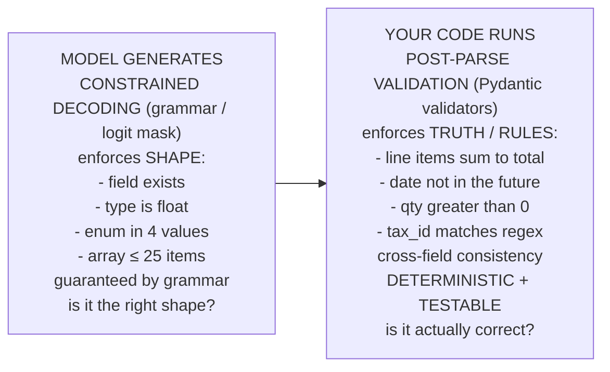

# Lecture 4: Designing LLM-Friendly Schemas with Pydantic v2 (and a Zod Primer)

> A schema is not a data structure you happen to send to an API — it is *simultaneously* two things the moment you turn on Structured Outputs: (1) a grammar that constrains the model's decoding token-by-token, and (2) a chunk of prompt the model reads while it generates. Most engineers author schemas as if only (1) existed — they think about types and forget the model is *reading the field names and descriptions to decide what to write*. This lecture teaches you to author the one artifact that has to serve both masters at once: constrain decoding well *and* read well to the model. You will learn the design principles (flat beats nested, enums beat free strings, every field earns its `description`, semantic names, bounded arrays) with the mechanical *why* behind each; the Pydantic v2 machinery to express them (`model_json_schema()`, `Field(...)`, `Enum`/`Literal`, validators); the single most important architectural line in the whole topic — **structural constraints at decode time vs. business rules in post-parse validators**; and enough Zod to survive a TypeScript codebase. After this you will design schemas by reflex that are cheaper to decode, more accurate, and safe against the failure the schema *cannot* express.

**Prerequisites:** Lecture 1 (when to force structure) · Lectures 2–3 (the three reliability tiers, how constrained decoding masks logits, per-provider knobs) · comfort with Python type hints and Pydantic basics · **Reading time:** ~28 min · **Part of:** Structured Outputs & Tool Calling — Week 1

---

## The core idea (plain language)

When you hand a provider a JSON Schema and turn on strict Structured Outputs, that schema gets compiled into a **grammar** — a set of rules that, at every decoding step, masks the model's vocabulary so it can only emit a token that keeps the output schema-valid (Lecture 3 covered the logit-masking mechanism). So your schema is a *grammar*.

But the schema is *also* injected into the model's context. The field names, the `description` strings, the enum values, the nesting — the model reads all of it while generating. So your schema is *also* a *prompt*.

Hold those two facts together and every design rule in this lecture falls out mechanically:

- **Flat beats nested** — because deep nesting inflates the grammar (more states, more brackets to track) *and* because deep structure is harder for the model to reason about while it generates.
- **Enums / `Literal[...]` beat free strings for closed sets** — because an enum collapses a whole free-text decision into "pick one of N tokens," which both shrinks the grammar's branching factor and removes the model's freedom to invent a spelling you didn't expect.
- **Every field needs a `description`** — because that string is prompt real estate the model reads *at generation time*. An empty description is wasted prompt; a good one is a free extraction instruction (`"ISO 8601 date, e.g. 2026-03-14"`).
- **Semantic field names** (`invoice_total_usd`, not `field3`) — because the name is *also* prompt. The model infers meaning from `invoice_total_usd`; it infers nothing from `field3`.
- **Bounded arrays and small enums** — because unbounded repetition and giant alternations blow up the grammar and the decode cost.

And then the line that separates a toy from a production system: **the schema constrains *shape*; it cannot constrain *truth*.** A schema can force `total_usd` to be a float. It cannot force that float to equal the sum of the line items. That invariant is a **business rule**, and business rules belong in **code** — Pydantic `@field_validator` / `@model_validator(mode='after')` — that runs *after* the model produces a shape-valid object. Never in the prompt. The prompt is probabilistic; a validator is deterministic and testable. "LLM proposes, code disposes" (Lecture 1) becomes concrete here: the schema gets the shape, the validator enforces the truth.

## How it actually works (mechanism, from first principles)

### Why flat beats nested: the grammar cost

Recall from Lecture 3 that strict Structured Outputs compiles your JSON Schema into a finite-state grammar and, at each token, computes a **mask** over the vocabulary — the set of tokens that keep the partial output on a path to a valid complete document. The cost of maintaining that grammar scales with its structural complexity: every level of nesting adds bracket-tracking state, every property adds transitions, every `anyOf`/union multiplies branches.

Compare two schemas that hold the *same* information:

```
NESTED (5 levels)                        FLAT (1 level)
{                                        {
  "vendor": {                              "vendor_name": "...",
    "identity": {                          "vendor_tax_id": "...",
      "legal": {                           "invoice_total_usd": 0.0,
        "name": "...",                     "invoice_date": "..."
        "tax_id": "..." }},              }
    "billing": {
      "total": { "usd": 0.0 },
      "date": "..." }}
}
```

Both carry four facts. The nested version forces the grammar (and the model) to open and close **eight** nested objects — sixteen extra structural tokens (`{`, `}`, plus the intermediate keys `vendor`, `identity`, `legal`, `billing`, `total`) — none of which carry content. Every one of those is a decode step spent on bracket bookkeeping instead of on the answer, and every level deepens the grammar's stack. On top of the decode cost, the model reasons *worse* about a value buried at `vendor.billing.total.usd` than about a top-level `invoice_total_usd`, for the same reason humans do: the path obscures the meaning.

A rough, **approximate** mental model: treat each level of nesting as adding a small constant tax to both the per-call latency (grammar upkeep + extra structural tokens) and the error rate (deeper values are located and filled less reliably). It's not catastrophic at one or two levels — it compounds. Flatten aggressively; only nest when the nesting is *genuinely* the domain's shape (a list of line-items is a real repeat; a `vendor.identity.legal.name` chain is bureaucratic decoration).

### Why enums beat free strings: branching factor

Consider a `category` field with a closed set of four values.

**As a free string** the grammar allows *any* string. At the decode step where the model picks the category, the mask permits essentially the whole vocabulary. The model might emit `"Software"`, `"software"`, `"SaaS"`, `"sw"`, `"Software subscription"` — all plausible, all different, none of which your downstream `if category == "software"` will match. You've pushed a normalization problem downstream and invited a whole class of silent mismatches.

**As an enum / `Literal`:**

```python
from enum import Enum
class Category(str, Enum):
    software = "software"
    hardware = "hardware"
    services = "services"
    other    = "other"
```

the grammar at that step permits only tokens that begin one of the four literal strings. The branching factor collapses from "the vocabulary" to "four paths." Two wins at once:

1. **Decode is cheaper and more reliable** — fewer valid continuations, less chance of drifting into an unexpected spelling.
2. **The output is machine-usable with zero normalization** — it's *exactly* one of your four strings, guaranteed by the grammar, not by hope.

But the mirror-image warning: **giant enums blow the grammar back up.** A `Literal` of 5 country codes is great; a `Literal` of all 40,000 ICD-10 medical codes is a pathological alternation that inflates the grammar, slows the first-call compile, and can exceed provider enum-count limits. The rule of thumb (**approximate**): enums shine for **closed sets up to a few dozen**; past ~a few hundred, switch to a free string plus a **post-parse validator** that checks membership against a lookup table (a set-membership test in code is O(1) and infinitely more maintainable than a 40k-way grammar alternation).

### Why every field needs a description: it's prompt, not documentation

Here is the fact engineers most often miss. When you emit `model_json_schema()` and the provider injects it, the `description` strings go *into the model's context*. They are read at generation time. A field description is not documentation for your teammates (though it's that too) — it is **an instruction to the model, delivered at the exact place it's about to generate that value.**

That reframes description-writing entirely. A good description *doubles as an extraction instruction*:

```python
from pydantic import BaseModel, Field

class Invoice(BaseModel):
    invoice_date: str = Field(
        description="Invoice issue date as an ISO 8601 date string, e.g. "
                    "2026-03-14. If only month/year is present, use the 1st. "
                    "If the format is ambiguous (11/03/26), assume the "
                    "vendor's locale."
    )
    invoice_total_usd: float = Field(
        description="Grand total actually due in USD after discounts and "
                    "waivers, NOT the sum of raw line items. Numeric only."
    )
```

That `invoice_date` description does real work: it pins the output format (ISO 8601), gives an example (few-shot in miniature), and resolves two ambiguities the model would otherwise guess at. You just moved three lines of prompt engineering *into the schema*, where they live next to the field forever and travel with it to every provider. An empty `description=""` throws that leverage away.

### The load-bearing distinction: decode-time structure vs. post-parse business rules

This is the architectural heart of the lecture. There are two completely different kinds of "validation," and conflating them is the most common design error.



The grammar can guarantee `invoice_total_usd` is a float and that `line_items` has ≤ 25 entries. It **cannot** guarantee that `sum(qty * unit_price) == invoice_total_usd`, that `invoice_date` isn't in the year 3025, or that `qty` is positive. Those are *relationships between values* and *domain facts* — they are business rules, and a context-free grammar (which is what constrained decoding gives you) fundamentally cannot express arithmetic relationships between distant fields.

So where do business rules go? Two wrong answers and one right one:

- **Wrong: in the prompt** ("make sure the line items sum to the total"). This is *probabilistic*. The model will comply most of the time and silently violate it under distribution shift — and you have no test that proves it holds. You cannot unit-test a prompt.
- **Wrong: hope the schema catches it.** It can't; a wrong-but-plausible float is shape-valid.
- **Right: in a Pydantic validator that runs after parsing.** It's *deterministic* (same input → same verdict), *testable* (you write a pytest that feeds a broken invoice and asserts it raises), and it *fails loudly* instead of writing garbage to your ledger.

```python
from pydantic import model_validator

class Invoice(BaseModel):
    invoice_total_usd: float = Field(description="...")
    line_items: list["LineItem"] = Field(description="...", max_length=25)

    @model_validator(mode="after")
    def totals_must_sum(self):
        computed = round(sum(li.qty * li.unit_price_usd for li in self.line_items), 2)
        if self.line_items and abs(computed - self.invoice_total_usd) > 0.01:
            raise ValueError(
                f"line items sum to {computed} but invoice_total_usd is "
                f"{self.invoice_total_usd}"
            )
        return self
```

`mode="after"` matters: it runs *after* the fields are parsed and coerced, so `self.line_items` are real `LineItem` objects and `self.invoice_total_usd` is a real float — you can do arithmetic across them. (`mode="before"` runs on the raw dict, before coercion, and is for input massaging, not cross-field truth checks.) `@field_validator` is the single-field cousin: use it for "this one field must satisfy P" (e.g., `qty > 0`, date-not-in-future); use `@model_validator(mode="after")` when the rule spans *multiple* fields.

The payoff, made concrete with the repair loop from Lecture 3: when this validator raises `ValueError`, you catch it, feed the *exact error string* back to the model ("line items sum to 1740 but total is 1240 — reconcile"), and re-ask. The validator is both your correctness gate *and* the generator of the feedback that makes the repair loop work. A prompt-based "rule" can do neither.

## Worked example

Let's design one schema and watch every principle pay off. Task: extract structured invoices from messy text, feeding a real accounting pipeline.

**First draft (what a beginner writes):**

```python
class Invoice(BaseModel):
    data: dict            # "flexible!"
    category: str         # free string
    items: list           # unbounded, untyped
    total: float          # no description
```

Everything here is wrong for our two masters. `data: dict` gives the grammar no structure to constrain — you're back to Tier-2 "some JSON." `category: str` invites `"SaaS"` vs `"software"` drift. `items: list` is unbounded (grammar can loop forever, and a runaway model can emit 500 items and blow your token budget). No descriptions means no prompt leverage. `total` will happily be a hallucinated number with nothing checking it.

**Production draft:**

```python
from enum import Enum
from pydantic import BaseModel, Field, field_validator, model_validator
from datetime import date

class Category(str, Enum):
    software = "software"; hardware = "hardware"
    services = "services"; other = "other"

class LineItem(BaseModel):
    description: str = Field(description="Human-readable line description as printed")
    qty: float = Field(description="Quantity billed; must be positive")
    unit_price_usd: float = Field(description="Price per single unit in USD")

    @field_validator("qty")
    @classmethod
    def qty_positive(cls, v):
        if v <= 0:
            raise ValueError("qty must be positive")
        return v

class Invoice(BaseModel):
    reasoning: str = Field(description="Notes on where each field was found and how "
                                       "ambiguity was resolved. Write this FIRST.")
    vendor_name: str = Field(description="Legal name of the issuing vendor")
    invoice_date: str = Field(description="ISO 8601 date, e.g. 2026-03-14")
    category: Category = Field(description="Best-fit spend category")
    invoice_total_usd: float = Field(description="Grand total DUE in USD after waivers, "
                                                 "not the raw sum of line items")
    line_items: list[LineItem] = Field(description="Individual billed lines", max_length=25)

    @model_validator(mode="after")
    def totals_must_sum(self):
        computed = round(sum(li.qty * li.unit_price_usd for li in self.line_items), 2)
        if self.line_items and abs(computed - self.invoice_total_usd) > 0.01:
            raise ValueError(f"items sum to {computed} but total is {self.invoice_total_usd}")
        return self
```

**Now trace the two-master payoff on the messy input** `seat 4x310=1240 + onboarding 500 (WAIVED)  Amount due: 1240.00`:

- **Grammar (shape):** forces `category` ∈ 4 values (no `"SaaS"` drift), `line_items` ≤ 25 (no runaway), `invoice_total_usd` a float. Decode is cheap — the schema is flat (two levels: Invoice → LineItem, a *genuine* repeat, so nesting is earned).
- **Prompt (reading):** the `invoice_total_usd` description explicitly says "after waivers, not the raw sum," steering the model away from the 1740 trap. The `reasoning`-first field (Lecture 1) lets it reason about the waiver before committing to the number. The `invoice_date` description pins ISO 8601.
- **Validators (truth):** if the model *still* emits `invoice_total_usd: 1740` (summing the raw lines), `totals_must_sum` raises — and that error text ("items sum to 1740 but total is 1240") is exactly what the repair loop feeds back. If it emits `qty: -3`, `qty_positive` catches it. The schema could never have caught either.

**Count the wins numerically (illustrative, not benchmarked):** flattening from a hypothetical 5-level draft to 2 levels removes on the order of a dozen structural tokens per call and shaves grammar-upkeep latency; the enum removes an entire class of normalization bugs (in messy real data, free-string category fields routinely produce 5–8 distinct spellings for 4 real categories); and the two validators convert "silently wrong float written to the ledger" into "loudly rejected, then repaired." That third win is the one that pays your salary.

## How it shows up in production

**First-call compile latency scales with schema complexity.** Recall the one-time schema-compile spike on strict Structured Outputs (Lecture 3). A flat schema with small enums compiles fast; a deeply nested schema with a 500-value enum makes that first-call spike *bigger* and can trip provider limits on depth or enum count. When someone reports "the first request to this new endpoint takes 4 seconds then it's fine," the schema shape is a prime suspect. Flat + bounded keeps the compile cheap.

**Token cost is structural.** Every level of nesting is extra `{`/`}`/key tokens on *every* call — you pay them forever, per request, at scale. A pipeline doing 10M extractions/month with a needlessly nested schema is paying for millions of tokens of structural decoration. Flattening is a direct cost cut.

**The "schema-valid but business-invalid" incident.** The classic production failure: an extraction service ships with rules in the *prompt* ("ensure totals reconcile"). It works in the demo and the first weeks. Then a new invoice format arrives, the model quietly stops reconciling, and shape-valid-but-wrong totals flow into the ledger for three weeks until finance catches a discrepancy. Post-mortem finding: there was no *validator*, only a prompt. The fix is always the same — move the invariant into a `@model_validator` with a test. Prompts can't be unit-tested; validators are the only place an invariant is *provable*.

**Enum drift is a silent integration bug.** A free-string `status` field that returns `"complete"`, `"completed"`, `"done"`, and `"Complete"` across calls will pass every JSON check and then fail your `if status == "completed"` branch nondeterministically. It looks like a flaky model; it's actually an un-enumerated closed set. Converting to `Literal`/`Enum` eliminates it at the grammar level.

**Descriptions are your cheapest quality lever, and they're free to deploy.** Improving a field's accuracy by editing its `description` costs no extra tokens beyond the description itself, ships instantly, and travels to every provider (OpenAI/Anthropic/Gemini all read `description`). Teams under-invest here because it doesn't *look* like engineering — but a well-worded `description` often beats a fine-tune for extraction accuracy on a stubborn field.

## Common misconceptions & failure modes

- **"The schema validates my data, so I don't need validators."** The schema validates *shape*, never *truth*. A hallucinated `total_usd: 9999` is a perfectly valid float. Cross-field and domain invariants need code.
- **"Put the business rules in the prompt so the model gets it right."** Prompts are probabilistic and untestable. The model will comply *most* of the time and betray you under distribution shift. Rules go in deterministic, testable validators.
- **"Descriptions are just docs / optional."** They are injected into the model's context and read at generation time. An empty description is wasted prompt real estate; a good one is a free extraction instruction.
- **"Deeper nesting is cleaner / more object-oriented."** Cleaner for *you*, more expensive for the grammar and worse for the model's accuracy. Model the domain's real shape, not an OO ideal. Flatten by default.
- **"Enums are always better than strings."** For *closed, small* sets, yes. For huge sets (thousands of codes) an enum becomes a pathological grammar alternation — use a free string + a set-membership validator instead.
- **"`field3` is fine, the description explains it."** The field *name* is also prompt. `invoice_total_usd` tells the model what to write before it even reaches the description; `field3` tells it nothing and wastes the strongest naming signal you have.
- **"`mode='before'` vs `mode='after'` doesn't matter."** It does: `after` runs post-coercion (real typed objects → do your cross-field arithmetic there); `before` runs on the raw dict for input massaging. Cross-field truth checks belong in `after`.
- **"Optional fields = leave them out of the schema."** Under OpenAI strict mode, *every* property must be `required`; optionality is modeled as a nullable union (`["string","null"]`), not omission (Lecture 3). Design optionals as explicit nullable fields.

## Rules of thumb / cheat sheet

- **Flat by default.** Only nest for genuine domain repeats (a list of line-items), never for bureaucratic grouping. Each level taxes both latency and accuracy.
- **Closed set → `Enum`/`Literal`.** Up to a few dozen values. Past a few hundred, use a string + a membership validator; never a giant grammar alternation.
- **Every field gets a `description`, written as an instruction to the model.** Include the format and an example (`"ISO 8601 date, e.g. 2026-03-14"`). It's prompt real estate — spend it.
- **Semantic names always.** `invoice_total_usd`, not `total` or `field3`. The name is the model's first hint.
- **Bound every array** with `max_length`. Unbounded = runaway grammar loop + blown token budget.
- **Shape in the schema; truth in validators.** `@field_validator` for single-field rules; `@model_validator(mode="after")` for cross-field/business rules. Never put invariants in the prompt.
- **Every validator gets a pytest.** Feed a deliberately-broken object, assert it raises. That's the difference between a rule and a wish.
- **Emit and read your schema** with `model_json_schema()` — eyeball what the model will actually see. If a description is blank there, fix it.
- **`reasoning` field first** (Lecture 1) when the task needs thinking, before the structured fields.
- All latency/accuracy magnitudes here are **approximate** rules of thumb — measure on your own data.

## A compact Zod primer (for when you meet a TS stack)

Python isn't the only place structured outputs live. In JavaScript/TypeScript, **Zod** is the de facto schema library, and you'll hit it the moment you touch the **Vercel AI SDK** — whose `generateObject` is built directly on Zod schemas. Enough to be dangerous:

```ts
import { z } from "zod";

const Category = z.enum(["software", "hardware", "services", "other"]); // <- enum, closed set

const LineItem = z.object({
  description: z.string().describe("Human-readable line description"),
  qty: z.number().positive().describe("Quantity billed; must be positive"),
  unitPriceUsd: z.number().describe("Price per unit in USD"),
});

const Invoice = z.object({
  vendorName: z.string().describe("Legal name of the issuing vendor"),
  invoiceDate: z.string().describe("ISO 8601 date, e.g. 2026-03-14"),
  category: Category,
  invoiceTotalUsd: z.number().describe("Grand total due in USD after waivers"),
  lineItems: z.array(LineItem).max(25).describe("Individual billed lines"),
});

type Invoice = z.infer<typeof Invoice>; // <- static TS type, derived from the schema
```

The mapping to everything you just learned:

- **`z.object` / `z.array` / `z.enum`** are the Zod analogues of Pydantic's `BaseModel` / `list` / `Enum`. Same design rules apply verbatim: flat, enums for closed sets, bounded arrays (`.max(25)`).
- **`.describe("...")`** is Zod's `Field(description=...)` — same prompt-real-estate logic. Fill it.
- **`z.infer<typeof Schema>`** derives the static TypeScript type from the schema, so your schema is the single source of truth for both runtime validation *and* compile-time types (Pydantic gives you this for free by being a class).
- **`zod-to-json-schema`** converts a Zod schema into JSON Schema — the exact analogue of `model_json_schema()`, and how you feed a Zod schema to a provider that wants raw JSON Schema.
- **`.refine()` / `.superRefine()`** are where **business rules** go — the Zod equivalent of `@model_validator(mode="after")`. Cross-field checks (line items sum to total) live here, in code, testable — *not* in the prompt. Same architecture, different language.
- **Discriminated unions** (`z.discriminatedUnion("type", [...])`) are the clean way to model "one of several shapes, tagged by a field" (e.g. `type: "email" | "sms"` with different payloads). They map to a tagged union in the grammar and are far friendlier to constrained decoding than an untagged `anyOf`, because the discriminator field lets the grammar (and the model) commit to a branch immediately.

The takeaway: **the design principles are language-agnostic.** Pydantic and Zod are two spellings of the same idea — a schema that is simultaneously a decode-time grammar and a generation-time prompt, with business rules pushed into post-parse code. Learn the principles once; apply them in either stack.

## Connect to the lab

This lecture *is* the design brief for `structio/schemas/invoice.py`. When you author the `Invoice` model, apply every rule here: keep it flat (Invoice → LineItem is the only earned nesting), make `category` a `Category(str, Enum)`, give **every** field a description that reads as an instruction, bound `line_items` with `max_length=25`, and put the totals-reconcile check in a `@model_validator(mode="after")` — the DoD line "the totals validator rejects a hand-crafted invoice whose line items don't sum" is exactly the business-rule-in-code principle, and the passing pytest is what makes it a *rule* and not a wish. Run `Invoice.model_json_schema()` and read the output as the model will — if any `description` is blank there, you've left prompt leverage on the table.

## Going deeper (optional)

Real, named resources — verify current URLs yourself; root domains and search queries, not invented deep links.

- **Pydantic v2 docs** (`docs.pydantic.dev`) — search "Pydantic validators field_validator model_validator" and "Pydantic model_json_schema" and "Pydantic Field constraints." The validator ordering (`mode='before'` vs `mode='after'`) and JSON Schema generation are documented in detail.
- **OpenAI Structured Outputs guide** (`platform.openai.com/docs`) — search "OpenAI Structured Outputs" for the honored JSON-Schema subset, the `additionalProperties:false` / all-required rules, and depth/enum-count limits that make flat+bounded matter.
- **Zod docs** (`zod.dev`) — search "Zod refine superRefine", "Zod discriminatedUnion", and "Zod infer." The canonical reference for the TS side.
- **zod-to-json-schema** (`github.com/StefanTerdell/zod-to-json-schema`) — search the repo name; how Zod schemas become JSON Schema for providers.
- **Vercel AI SDK** (`sdk.vercel.ai`) — search "Vercel AI SDK generateObject" to see Zod schemas driving structured generation in production TS.
- **Instructor** (`python.useinstructor.com`) — search "instructor response_model validators"; shows the validator-error → re-ask repair loop this lecture's business rules feed.
- **JSON Schema** (`json-schema.org`) — search "JSON Schema reference"; the underlying spec both Pydantic and Zod compile toward, and whose subset each provider honors.

## Check yourself

1. Your schema is simultaneously two things to the provider. Name both, and give one design rule that follows from *each*.
2. You have a `country` field with 195 valid ISO codes and a `priority` field with 3 values. Which should be an enum/`Literal` and which should be a free string + validator, and why does the answer differ?
3. A teammate proposes enforcing "the invoice total must not exceed the PO amount" by adding a sentence to the prompt. Explain, mechanistically, why that's the wrong layer and where the rule belongs. What can you do with the code version that you *cannot* do with the prompt version?
4. Explain why `@model_validator(mode="after")` (not `before`) is the right choice for a cross-field arithmetic check.
5. You flatten a 5-level schema to 2 levels carrying identical information. Name two distinct production metrics that improve and the mechanism for each.
6. In a TypeScript codebase using the Vercel AI SDK, where do you put (a) the closed-set category constraint and (b) the "line items sum to total" rule, and what are the Zod constructs for each?

### Answer key

1. It is **(a) a grammar** that constrains decoding token-by-token, and **(b) a prompt** the model reads at generation time. From (a): flatten / bound arrays / avoid giant enums (keep the grammar small and cheap). From (b): every field needs a semantic name and a meaningful `description` (it's read as an instruction).
2. **`priority` → `Literal`/`Enum`** (3 values is a tiny, cheap alternation that collapses branching and guarantees exact spelling). **`country` → free string + a membership validator** against the 195-code set: 195 is large enough that an enum bloats the grammar and the first-call compile, and a set-membership check in code is O(1) and far more maintainable. Small closed set → enum; large closed set → string + validator.
3. Mechanistically, a prompt sentence is **probabilistic** — the model will honor it most of the time and silently violate it under distribution shift, and a context-free decoding grammar can't express a cross-field arithmetic inequality anyway. It belongs in a **post-parse validator** (`@model_validator(mode="after")` comparing `total` and `po_amount`). With the code version you can **unit-test it** (assert it raises on a violating input) and **feed the exact error back to the model** in the repair loop — neither is possible with a prompt.
4. `mode="after"` runs *after* fields are parsed and type-coerced, so you have real typed objects (`self.line_items` are `LineItem`s, `self.total` is a float) and can do arithmetic across them. `mode="before"` runs on the raw, uncoerced dict — fine for input massaging, but you'd be doing math on unparsed values. Cross-field truth checks need the coerced, after-stage values.
5. **(i) Per-call latency / token cost** improves: fewer structural tokens (`{`/`}`/intermediate keys) to decode on every call and less grammar-upkeep state, plus a smaller first-call compile spike. **(ii) Extraction accuracy** improves: the model locates and fills a top-level `invoice_total_usd` more reliably than a value buried at `vendor.billing.total.usd`, because depth obscures meaning during generation.
6. **(a)** `z.enum(["software","hardware","services","other"])` — the closed-set constraint lives in the schema/grammar. **(b)** a `.refine()` / `.superRefine()` on the object schema (or a check in your code after `generateObject` returns) — the business rule lives in testable code, exactly like Pydantic's `@model_validator(mode="after")`, and never in the prompt.
