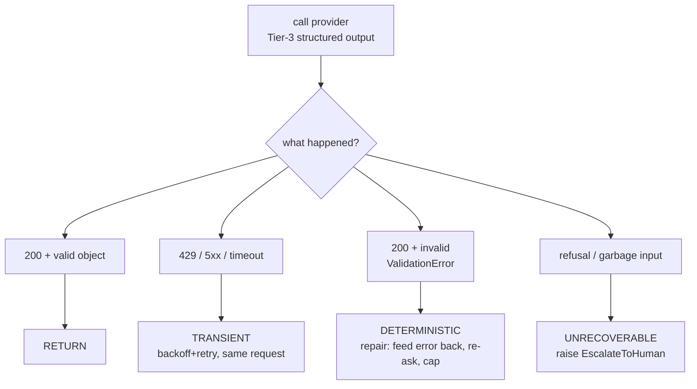
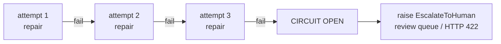

# Lecture 5: Runtime Resilience — Repair Loops, Error Classification, and Streaming Partial JSON

> Lectures 1–4 got you a Pydantic model, a provider knob that *usually* returns something that fits it, and validators that enforce business truth. This lecture lives in the gap between "the SDK returned" and "my program can trust this object" — the code that runs at 3am when the input is smudged, the provider is throttling you, and the model is confidently wrong. You will learn to sort every failure into exactly one of three buckets, respond to each with the *only* strategy that is economically rational for it, cap your guessing with a circuit breaker so a pathological document can't burn your budget, and stream half-formed JSON to a screen without ever *acting* on a partial. After this you can build `repair.py` and `stream.py` from the Week 1 lab from scratch and defend every branch of the control flow.

**Prerequisites:** Lecture 2 (three reliability tiers) · Lecture 4 (Pydantic v2 models + validators as business rules) · comfort with exceptions/`try`-`except` and basic exponential-backoff intuition · **Reading time:** ~27 min · **Part of:** Phase 2 (Structured Outputs & Tool Calling), Week 1

---

## The core idea (plain language)

Tier-3 Structured Outputs removes *most* shape failures. It removes *none* of the other ways a call goes wrong: the network hiccups, the provider rate-limits you, the model refuses, the input is genuinely garbage, or your own Pydantic business-rule validator (line items must sum to total — Lecture 4) rejects a shape-valid object. So between "the SDK returned" and "I trust this" sits one decision: **the call didn't give me a trusted object — now what?**

The wrong answer is "retry and hope," applied uniformly. Retrying is correct for *exactly one* class of failure and a pure waste of money and latency for the other two. The whole discipline of runtime resilience is a single move repeated: **classify the failure first, then apply the response the class demands.** There are three classes.

- **TRANSIENT** — a `429` (rate limit) or `5xx` (server error, Anthropic's `529 overloaded`), a timeout, a dropped socket. Nothing is wrong with your request; the world was busy. **Response: exponential backoff + retry.** The next attempt is *byte-identical* and has a good chance of succeeding.
- **DETERMINISTIC** — the call succeeded (HTTP 200) but the result violates your contract: a `pydantic.ValidationError`, a missing required field, line items that don't sum. Retrying the *identical* request reproduces the *identical* wrong answer. **Response: repair** — feed the *exact* validation error text back to the model and re-ask, with a hard cap on attempts.
- **UNRECOVERABLE** — a refusal ("I can't help with that"), or input so garbled that no re-ask will ever yield a valid object. **Response: stop. Escalate to a human.** Raise a typed `EscalateToHuman` and route to a review queue. Do not burn tokens guessing.

The sentence to tattoo on your wrist: **the response to a failure is a function of its class; using the wrong class's response is either free money on fire (repairing a 429) or a pointless near-infinite loop (retrying a schema violation with no new information).**

The second half is streaming. Providers can emit your object token-by-token, so you see `{"vendor_name": "Ac` long before the closing brace. A tolerant parser lets you render that progressively — good UX. But there is an ironclad rule: **you may *render* on a partial; you may only *act* on a fully validated, complete object.** A partial that happens to parse is not a contract — it's a screenshot of someone mid-typing.

---

## How it actually works (mechanism, from first principles)

### The classifier IS the control flow

Every resilient extraction call has the same skeleton, and the branch you take is decided by *what kind of failure you got*, not by a counter you bump blindly:



Why must these be *different* branches? Because each class carries a different amount of **new information** for the next attempt, and information is the only thing that changes an outcome.

- A **429** means "try again later, unchanged." New information for the next attempt: **wait longer.** So you sleep with growing backoff and re-send the identical bytes.
- A **ValidationError** means "your request was fine; the model's answer was wrong in a specific, describable way." Retrying the *identical* messages gives the model *no new information*; it reproduces (roughly) the same error, and you pay N times for one failure. The thing that changes the outcome is **adding the error to the conversation**: "You returned `total_usd: 400` but the line items sum to `450`; fix it." Now the next attempt is a *different, more-informed* request.
- A **refusal or genuine garbage** means **no re-ask helps** — the model already decided, or there is no invoice inside non-invoice text. Looping here is pure cost. Escalate.

### Why retrying a deterministic failure "burns money" — the arithmetic

Make it numeric. Suppose a schema violation on a nasty invoice recurs with probability ~0.9 per *identical* attempt (the model is committed to its misreading). Naively retry the same request up to 5 times at ~$0.0004 per `gpt-4o-mini`-class extraction:

```
P(all 5 identical attempts fail) = 0.9^5  ≈ 0.59
cost of the doomed retries        = 5 × $0.0004 = $0.0020 per document
```

Over 100,000 hard documents that's ~$200 spent to *still fail 59% of the time*. Now the **repair** variant: each attempt appends the concrete error, which typically drops the recurrence probability sharply because the model can *see* what it got wrong. Even a modest drop to ~0.4 per repaired attempt gives `0.4^3 ≈ 0.064` failure after 3 tries — roughly an order of magnitude better at *fewer* attempts. Same tokens, radically different payoff, because they bought *information* instead of *repetition*.

The reverse error — **repairing a 429** — is just as silly: you'd append "please fix the rate limit" (the model can do nothing about it) and re-ask *immediately* with no backoff, hammering an already-overloaded endpoint and often making the throttle worse.

### Backoff for TRANSIENT: the formula

Exponential backoff *with jitter*. Base delay `b`, attempt `n` (0-indexed), cap `C`:

```
delay(n) = min(C, b × 2^n) × (0.5 + random()/2)     # "full-ish" jitter
```

With `b = 1s`, `C = 30s`: waits are ~1s, ~2s, ~4s, ~8s… The `2^n` spreads retries so a fleet of clients doesn't stampede the instant the window reopens; the **jitter** de-synchronizes clients that all failed on the same millisecond. Respect the provider's `Retry-After` header when present — it's a ground-truth wait that beats your formula. And cap the *number* of transient retries (~4–5): a `5xx` that never clears is an outage to *surface*, not retry forever.

### Repair for DETERMINISTIC: feed the *exact* error text

The repair loop's power comes from one detail — you send the **verbatim** validator message, not a paraphrase. Pydantic v2's `ValidationError` stringifies into precise, model-legible feedback:

```
1 validation error for Invoice
  total_usd
    line items sum to 450.00 but total_usd is 400.00 [type=value_error, ...]
```

That string names the field, the rule, and the numbers. Paraphrasing it ("something's off with the total") throws away the only signal you have. The re-ask conversation becomes:

```
user:      <original extraction prompt + document>
assistant: {"vendor_name":"Acme","total_usd":400.0,"line_items":[...]}   ← wrong
user:      Your previous output failed validation:
           <verbatim ValidationError text>
           Return corrected JSON that satisfies the schema and this rule.
```

Each repair *grows* the context with the specific failure — precisely the new information a deterministic failure was missing.

### The circuit breaker: stop guessing after N

Repair is bounded, and the bound is **not optional** — it's a Definition-of-Done and milestone requirement. After **N deterministic repair attempts** (the lab uses **3**), you stop and route to a human review queue instead of guessing a 4th time. Two reasons:

1. **Diminishing returns.** If three *specific* error messages didn't fix it, the model is likely stuck — the input is ambiguous, or your schema/rule is self-contradictory. Attempt 4 rarely helps.
2. **Bounded cost & latency.** Without a cap, a pathological document loops until your budget or your request timeout dies — and it fails *anyway*, just later and more expensively.

The circuit breaker converts an unbounded, unpredictable failure into a **bounded, observable outcome**: `status = needs_human_review`. That's a state your service can return (HTTP 422 in the Week 2 service) and your on-call can act on — infinitely better than a mystery timeout.



### `instructor`: the batteries-included path — and why you still hand-roll it once

`instructor` patches your provider client so you pass a `response_model` and get a typed, validated object back — and it runs the deterministic repair loop *for you*:

```python
import instructor
from openai import OpenAI
from anthropic import Anthropic

client = instructor.from_openai(OpenAI())        # or instructor.from_anthropic(Anthropic())
invoice = client.chat.completions.create(
    model="gpt-4o-mini",
    response_model=Invoice,     # your Pydantic model
    max_retries=3,              # <-- deterministic repair attempts, capped
    messages=[{"role": "user", "content": prompt}],
)   # returns a validated Invoice, or raises after retries are exhausted
```

Under the hood, `max_retries` is doing *exactly* the deterministic branch above: on a `ValidationError` it appends the error to the messages and re-asks, up to the cap. It is a well-built implementation of the pattern this lecture describes (its `Retrying`/`AsyncRetrying` integration can wrap Tenacity for finer control).

So why hand-roll it in the lab? Because `instructor`'s convenience hides the three-class distinction you must own:

- Its `max_retries` covers the **deterministic** branch only. You still own **transient** policy (does your retry do backoff and honor `Retry-After`?) and **unrecoverable** handling (detecting refusals, the typed escalation + review queue).
- When it *does* exhaust retries, you need to know that means "circuit open → escalate," not "swallow and return `None`."
- You will debug this loop in production, and you cannot debug a black box you never opened. Writing the raw `try/except` once — classify exception, backoff vs. re-ask vs. escalate, count attempts on *separate* budgets, break the circuit — is what turns "instructor magically works" into "I know precisely what it's doing and where it stops."

Use `instructor` in production. Hand-roll it once to earn the right to.

---

## Worked example — one nasty invoice through the full loop

Document: a scanned invoice whose total is smudged. The model keeps reading `$400.00`, but the three line items clearly sum to `$450.00`. Your `Invoice` model has the `@model_validator` from Lecture 4 that enforces the sum. Repair cap = 3; transient cap = 4.

```
t=0.0s  ATTEMPT 1  → provider 200. Parse:
                     {"total_usd":400.0, line_items sum→450.0}
                     Invoice.model_validate → ValidationError
                     CLASS = DETERMINISTIC (repair #1). Append verbatim error. Re-ask.

t=0.9s  ATTEMPT 2  → provider 429 (rate-limited mid-repair!)
                     CLASS = TRANSIENT. Does NOT consume a repair attempt.
                     backoff: sleep ~1s (+jitter). Re-send the SAME repair request.

t=2.1s  ATTEMPT 2' → provider 200. Model now returns total_usd:450.0
                     ...but drops the required field `invoice_date`.
                     ValidationError again. CLASS = DETERMINISTIC (repair #2).
                     Append error. Re-ask.

t=3.0s  ATTEMPT 3  → provider 200. total_usd:450.0, date present, items sum.
                     Invoice.model_validate PASSES.  RETURN validated object.
```

Two things to notice. First, the **429 did not count against the 3-attempt deterministic cap** — mixing the counters is a classic bug that trips the circuit breaker early on healthy inputs. Transient retries and deterministic repairs are **separate budgets**. Second, if attempt 3 had *also* failed validation, the circuit would open: raise `EscalateToHuman`, route to the review queue, log `repair_attempts=3, final_status=needs_human_review`. No 4th guess.

Now the **UNRECOVERABLE** path with a different input — a garbage row (`"asdkjh $$$ ???"`). Attempt 1 returns a refusal or a nonsense object. There is no error to "repair" — the model can't extract an invoice from non-invoice text. You detect the refusal / impossible input and **immediately** raise `EscalateToHuman` *without spending the repair budget at all*. Repairing here would be three wasted round-trips ending in the same escalation.

A minimal hand-rolled skeleton tying it together:

```python
class EscalateToHuman(Exception): ...

def extract(messages, *, max_repairs=3, max_transient=4):
    repairs = transient = 0
    while True:
        try:
            raw = call_provider(messages)              # Tier-3 structured output
            if is_refusal(raw):                        # UNRECOVERABLE, detected early
                raise EscalateToHuman("model refused")
            return Invoice.model_validate(raw)         # <-- THE TRUST GATE
        except (RateLimitError, APITimeoutError, InternalServerError) as e:   # TRANSIENT
            transient += 1
            if transient > max_transient:
                raise EscalateToHuman("provider unavailable") from e
            time.sleep(backoff(transient))             # exp backoff + jitter, honor Retry-After
        except ValidationError as e:                   # DETERMINISTIC
            repairs += 1
            if repairs > max_repairs:                  # CIRCUIT BREAKER
                raise EscalateToHuman("repair budget exhausted") from e
            messages += [assistant(raw),
                         user(f"Your output failed validation:\n{e}\nReturn corrected JSON.")]
```

Every branch maps to exactly one failure class. That's the whole discipline.

---

## How it shows up in production (cost / latency / quality / debugging)

**Cost.** Deterministic repairs multiply token spend: a document that takes 3 attempts costs ~3× the tokens of a clean one, and *more* because the conversation grows each round. Fine *if capped* and *if rare* — but a distribution shift that pushes 20% of traffic into repair loops can silently 1.5–2× your bill overnight. Your per-request `repair_attempts` trace is the early-warning gauge. The expensive bug is mixing classes: retrying deterministic failures without adding the error, or retrying transients with backoff *and never escalating* — both quietly torch budget.

**Latency.** Transient backoff adds real wall-clock time (seconds of sleeping); repairs add round-trips (each a full model call). A 3-repair document can take 4–6× the latency of a clean one. For interactive endpoints this argues for a *tight* cap and for surfacing `needs_human_review` fast rather than making a user wait through a doomed loop. Streaming (below) is partly a latency-*perception* fix: the user sees progress while the full object is still forming.

**Quality / correctness.** The circuit breaker is a *quality* control, not just a cost one. The alternative to escalating is *guessing*, and a silently-wrong invoice total is far more dangerous than an honest `needs_human_review`. "Fail loud to a human" beats "succeed quietly with a fabrication" for anything financial or irreversible.

**Debugging.** The failure class *is* the first line of your trace. When paged, "which class spiked?" instantly narrows the cause: TRANSIENT ↑ = provider/network/quota issue (check the status page and your rate limits — not your code); DETERMINISTIC ↑ = your schema, prompt, or a new input format drifting (your fault — read the appended errors); UNRECOVERABLE ↑ = someone's feeding you non-invoices (upstream data issue). Log `failure_class` and `final_status` on every request or you're debugging blind.

**The streaming-specific production bug.** Someone renders partial JSON progressively (great) and then, because the partial *happened to parse* at some frame, kicks off a downstream action — charges a card, writes a DB row — on a half-formed object where `total_usd` was momentarily `4` (mid-typing `400`). The object was *parseable* but *not complete and not validated*. Acting on it corrupts data. The rule below exists because this bug is subtle and expensive.

---

## Common misconceptions & failure modes

- **"Just retry on any error."** The single most common resilience bug. Retrying a `ValidationError` unchanged reproduces it; retrying a refusal wastes tokens to escalate anyway. Classify first.
- **"Repairing means telling the model to 'try again.'"** No — repair means feeding the **exact, verbatim** validator error back. A vague nudge discards the only new information you have.
- **"Transient retries and deterministic repairs share one counter."** They don't. A mid-repair 429 must not consume the repair budget, or you'll open the circuit early on perfectly healthy inputs.
- **"No cap needed; it'll converge."** It won't, on genuinely hard/contradictory inputs. Uncapped loops burn budget and still fail — just later. The circuit breaker is mandatory.
- **"`instructor` handles resilience, so I'm done."** `max_retries` handles the *deterministic* branch. You still own transient backoff policy and the unrecoverable → `EscalateToHuman` → review-queue path (including when `max_retries` is exhausted).
- **"If the partial JSON parses, it's safe to use."** The deadliest streaming mistake. A partial can parse and be semantically half-baked. **Render** on partials; **act** only after `model_validate` on the *complete* object.
- **"Escalation is failure."** Escalation is a *correct outcome* for unrecoverable input — honest, bounded, actionable. A silent wrong guess is the real failure.
- **"Lower temperature will stop the validation errors."** It reduces variance, not contradiction. If the input is ambiguous or the ground truth violates your rule, temperature won't save you — repair or escalate will.

---

## Rules of thumb / cheat sheet

- **Classify before you react.** Every failure is TRANSIENT, DETERMINISTIC, or UNRECOVERABLE. The class picks the response.
- **TRANSIENT (429/5xx/timeout) → exponential backoff + jitter, retry the *same* request.** Honor `Retry-After`. Cap at ~4–5, then escalate as "provider unavailable."
- **DETERMINISTIC (ValidationError/schema violation) → repair:** append the **verbatim** error, re-ask. Cap at **3** (lab default).
- **UNRECOVERABLE (refusal / garbage) → raise `EscalateToHuman` immediately.** Don't spend the repair budget.
- **Separate counters** for transient retries vs. deterministic repairs. Never share them.
- **Circuit breaker is non-negotiable:** after N repairs, route to `needs_human_review` (HTTP 422); don't guess an (N+1)th time.
- **Use `instructor` (`from_openai`/`from_anthropic`, `response_model=`, `max_retries=`) in prod** — but hand-roll the loop once so you own the transient + escalate branches.
- **Streaming: render on partial, act on complete.** The trust gate is a *final* `Model.model_validate(...)` on the completed object — always.
- **Log per request:** `failure_class`, `repair_attempts`, `transient_retries`, `final_status`. Reliability-eval fuel and your pager's first clue.
- **Approximate cost intuition (label it as such):** a 3-repair doc ≈ 3–4× tokens and 4–6× latency of a clean one. Fine if rare and capped; a bill-doubler if it becomes the norm.

### Streaming partial JSON — the shape of it

Providers emit your object incrementally: `{`, `{"vendor_name"`, `{"vendor_name":"Ac`, … A *tolerant* parser closes the dangling structure so each frame is renderable:

```python
import instructor
from openai import OpenAI
from rich.live import Live
from rich.pretty import Pretty

client = instructor.from_openai(OpenAI())
stream = client.chat.completions.create_partial(   # partial / streaming API
    model="gpt-4o-mini",
    response_model=Invoice,
    messages=[{"role": "user", "content": prompt}],
)

final = None
with Live(refresh_per_second=8) as live:
    for partial in stream:                 # each `partial`: best-effort, possibly-incomplete view
        live.update(Pretty(partial))       # RENDER only — never act on this
        final = partial

# THE TRUST GATE — only now is it safe to act:
invoice = Invoice.model_validate(final.model_dump())   # full validation on the COMPLETE object
process(invoice)                                        # DB write / charge / enrich happens HERE
```

If you're not on `instructor`, `partial-json-parser` does the tolerant close-the-braces parse; the discipline is identical — render on partials, gate on a final `model_validate`. The mental split: the `for` loop is **UI**; the line after it is **truth**. Note that partial rendering deliberately *bypasses* your `@model_validator` business rules (a half-typed object can't satisfy "items sum to total"), which is exactly why the completed-object gate is where those rules finally run.

---

## Connect to the lab

This lecture is `repair.py` and `stream.py` from the Week 1 `structio/` lab. In `repair.py` you wrap OpenAI and Anthropic with `instructor.from_openai(...)` / `from_anthropic(...)` and `response_model=Invoice, max_retries=3`, **then hand-roll your own loop** that classifies the exception (`RateLimitError` → backoff; `ValidationError` → append error + re-ask; refusal/exhaustion → `EscalateToHuman`) with the **circuit breaker at 3 deterministic attempts** and *separate* transient/repair counters. In `stream.py` you stream one extraction, render it filling in live with `rich`, and assert you never act until `Invoice.model_validate` passes on the *final* chunk. The DoD — "repair loop caps at 3 and raises `EscalateToHuman`; 429s retried with backoff; streaming only accepts the final validated object" — is this lecture, checkbox by checkbox.

---

## Going deeper (optional)

Real, named resources — verify current URLs by searching the titles:

- **instructor** — official docs at `python.useinstructor.com` (see "Retrying", "Streaming / Partial responses", the `create_partial` / `Partial[...]` APIs, and Tenacity integration). Search: *"instructor python max_retries validation"* and *"instructor create_partial streaming"*.
- **Pydantic v2** — `docs.pydantic.dev` on `ValidationError` structure and `model_validate` / `model_dump`. Search: *"pydantic v2 ValidationError errors() model_validate"*.
- **partial-json-parser** — the PyPI/GitHub project for tolerant streaming JSON parsing. Search: *"partial-json-parser python"*.
- **Tenacity** — the canonical Python retry library for the transient branch (exponential backoff, jitter, `retry_if_exception_type`). Search: *"tenacity retry exponential backoff jitter"*.
- **Exponential backoff & jitter** — the AWS Architecture Blog post *"Exponential Backoff And Jitter"* is the standard reference for why jitter matters. Search that exact title.
- **Provider rate-limit / error docs** — OpenAI "Rate limits" and Anthropic "Errors / Rate limits" on `platform.openai.com/docs` and `docs.anthropic.com` (status codes, `Retry-After`, `429`, Anthropic's `529 overloaded`). Search: *"OpenAI rate limits 429 Retry-After"*, *"Anthropic API errors 529 overloaded"*.
- **rich** — `rich.readthedocs.io`, specifically `rich.live.Live` for progressive rendering. Search: *"rich Live progressive rendering"*.

## Check yourself

1. You get a `pydantic.ValidationError` on a 200 response. Which failure class is this, and why is *retrying the identical request* the wrong move? What *is* the right move?
2. A `429` arrives between repair attempt 2 and 3. Should it count against your 3-attempt repair cap? Why or why not?
3. Explain, with rough arithmetic, why "repair" beats "retry unchanged" for a deterministic failure — what quantity does adding the error text change?
4. Your service streams an invoice and, at some frame, the partial JSON parses cleanly into an object with a `total_usd`. Is it safe to charge the customer that amount? Where exactly is the only safe place to act?
5. What does the circuit breaker protect you from, and what concrete outcome does it produce instead of a 4th repair guess?
6. `instructor`'s `max_retries=3` — which of the three failure classes does it handle, and which two must you still handle yourself?

### Answer key

1. **DETERMINISTIC.** The call succeeded (HTTP 200); the *content* violates your contract. Retrying the identical messages gives the model no new information, so it reproduces (roughly) the same invalid output — you pay N times for one failure. Right move: **repair** — append the *verbatim* `ValidationError` text to the conversation and re-ask, capped at N attempts.
2. **No.** A 429 is **TRANSIENT**, a separate budget from deterministic repairs. It should trigger backoff + retry of the *same* request and count against the *transient* cap only. Charging it to the repair cap would open the circuit breaker early on healthy inputs — a common bug.
3. Retrying unchanged leaves the per-attempt failure probability high (the model is committed to its mistake), so `p^N` stays large. Repair *adds the specific error*, which sharply lowers the per-attempt failure probability, so the same number of attempts reaches a far lower `p'^N`. Adding the error changes the **information content** of each attempt — you spend tokens on new signal instead of repetition.
4. **No.** A partial that parses is not a complete, validated object — `total_usd` could be mid-typing (`4` on the way to `400`), and your business-rule validators haven't run. The only safe place to act is **after the stream completes and `Invoice.model_validate(...)` passes on the full object** — the line *after* the render loop. The loop is UI; the validated object is truth.
5. It protects you from **unbounded cost and latency on inputs that will never validate** (diminishing returns after a few specific errors) and from **guessing a wrong answer**. Instead of an (N+1)th guess it produces a **bounded, observable `needs_human_review` outcome** (e.g., HTTP 422) that routes to a human — actionable, not a mystery timeout or a fabricated value.
6. It handles the **DETERMINISTIC** class (re-ask with the validation error, up to the cap). You must still handle **TRANSIENT** (your own backoff/jitter policy, honoring `Retry-After`) and **UNRECOVERABLE** (detecting refusals/garbage and raising `EscalateToHuman` → review queue, including when `max_retries` is exhausted).
