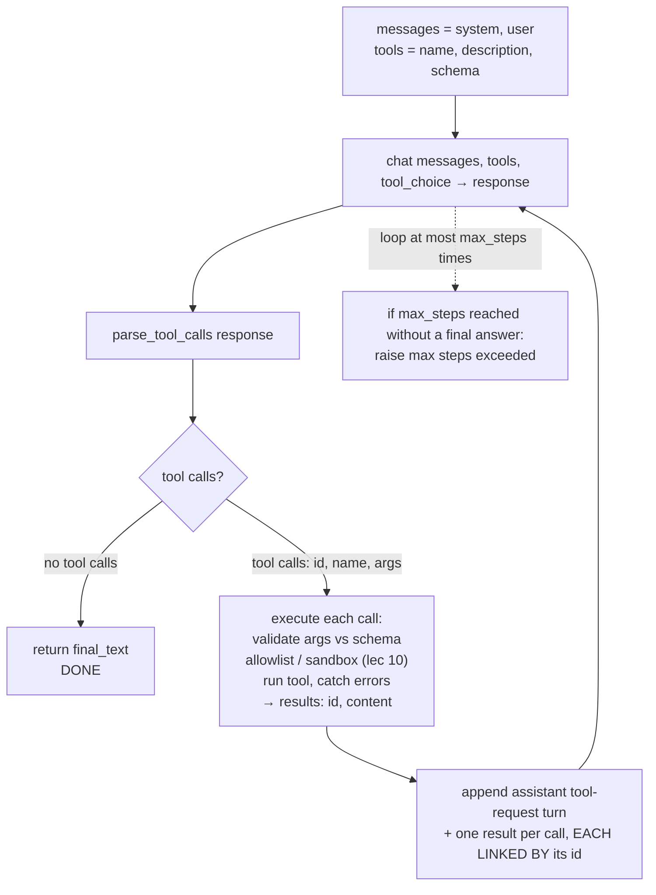

# Lecture 6: The Universal Tool-Calling Loop

> Every "AI agent" you have ever heard hyped — the thing that books flights, queries your database, calls three APIs and writes a summary — is, underneath the branding, one small loop you can fit on an index card. It is the same loop at OpenAI, Anthropic, Gemini, Mistral, and every open model wired for tools. The wire formats differ (that's lecture 7); the *shape* does not. This lecture teaches you that shape provider-agnostically, and drills the two things that separate a toy from a production loop: the **id-linkage discipline** that ties a result back to the request that asked for it, and the **step cap** that stops a confused model from calling tools until your bill hits four figures. After this you will be able to write `run(messages, tools, provider, tool_choice, max_steps)` from memory, and explain exactly where — and why — *your* code, never the model, pulls the trigger.

**Prerequisites:** Phase 0 (chat message roles, tokens), Phase 1 (prompt anatomy), Week 1 of this phase (schema-constrained output, "LLM proposes, code disposes") · **Reading time:** ~24 min · **Part of:** Phase 2 (Structured Outputs & Tool Calling), Week 2

---

## The core idea (plain language)

A language model cannot *do* anything. It reads text and predicts more text. That is the entire physics of the object. When you hear "the model called the weather API," that sentence is false in a way that matters enormously for security and correctness: the model **emitted text that describes a call it would like made**. Something else — your code — read that text, decided whether to honor it, made the actual HTTP request, and fed the answer back.

Tool calling is the protocol for that back-and-forth, and it is astonishingly simple:

1. You send the model the **conversation so far** plus a list of **tool definitions** (name, description, parameter schema for each).
2. The model replies with one of exactly two things: a **final answer** (plain text — it's done), or a **request to call one or more tools** (structured: tool name + arguments, each tagged with an **id**).
3. If it's a final answer, you return it and stop.
4. If it's a tool request, **your code** runs the tool(s), captures each result, and appends each result to the conversation **linked back to the id** the model assigned to that call.
5. You send the whole updated conversation back to the model and go to step 2.

That's it. You loop steps 2–5 until the model produces a final answer — or until you hit a **step cap** you set in advance, at which point you bail out with an error. The loop is turn-based ping-pong: model proposes, code disposes, repeat.

Two ideas do all the load-bearing work in this lecture, and they are the two things beginners get wrong:

- **The execution boundary.** The model *only ever requests*. It has no hands. The single line in your code that actually invokes the tool is the security perimeter of the entire system. Everything from lecture 10 — allowlisting, argument validation, sandboxing, human-in-the-loop confirmation — hooks in at exactly that one line. If you internalize nothing else: **"the model proposes, your code disposes"** is not a slogan, it is the location of your attack surface.
- **The loop guard.** The loop can, in principle, run forever. A confused model can request a tool, get a result it doesn't like, request the same tool again, forever. Every iteration is a paid API call. Without a hard cap, a single bad request can silently burn your token budget. `max_steps` is not a nicety; it is a non-negotiable engineering invariant, like a `WHERE` clause on a `DELETE`.

---

## How it actually works (mechanism, from first principles)

### Why the model can't execute — and why that's the whole point

Think about what the model physically is: a function from a token sequence to a probability distribution over the next token. It has no network socket, no file handle, no shell. When you give it tool definitions, you are adding text to its context that says, in effect, "here are some functions; if you want one called, emit a specially-formatted block naming it and its arguments." The model was fine-tuned to emit that format when it decides a tool would help. But emitting the block is *still just generating tokens*. Nothing happens next unless a program is watching the output stream, recognizes the block, and acts.

This is why the boundary is where security lives. The model's tool-call request is **untrusted output** — it was produced by a statistical process steered partly by the user's input, which may be adversarial (prompt injection). Treating a requested `run_shell("rm -rf /")` as an instruction to obey would be exactly as reckless as `eval()`-ing an HTTP request body. Your executor is the thing that says "no."

### The canonical loop, drawn



### The id-linkage discipline

Here is the subtle part. When the model requests two tools in one turn — say `get_weather(city="Paris")` and `get_weather(city="Tokyo")` — it tags each request with a unique id (`call_a1`, `call_b2`). When you send the results back, you must attach **each result to the id of the request it answers**. The model uses those ids to match answer-to-question. Get the linkage wrong and one of two things happens:

- **Mismatched or missing id → hard error.** Most providers return a `400`: "tool_call_id X has no corresponding tool call" or "each tool_use must have a tool_result." Your loop dies with a cryptic message.
- **Right count, swapped contents → silent corruption.** If you send Tokyo's weather under Paris's id, the API may accept it (the ids are valid, one per call) and the model will confidently tell the user it's 6°C in Paris when that was Tokyo's reading. No error. Wrong answer. This is the nastier failure because your tests, if they only check "did it return without crashing," pass.

The discipline is therefore: **treat the id as a foreign key.** Every requested call has exactly one result row, joined on id. Your executor should build a `dict[id -> result]` and render results by iterating the *requests*, not by trusting the order results came back in (parallel execution reorders them — see lecture 8).

### Why the step cap is arithmetic, not paranoia

Let's put numbers on the runaway. Suppose each loop iteration is one model call over a conversation that has grown to ~4,000 input tokens plus ~200 output tokens, on a model priced (illustratively — check current pricing) around $0.15 per million input and $0.60 per million output tokens.

```
per-iteration cost ≈ 4000/1e6 × $0.15  +  200/1e6 × $0.60
                   ≈ $0.0006 + $0.00012  ≈ $0.00072
```

Under a millicent — trivial. Now remove the cap and let a confused model loop. Because the conversation *grows every turn* (you keep appending tool requests and results), input tokens climb roughly linearly: turn 50 might carry 40,000 tokens, not 4,000. The cost per turn rises with it. A loop that should have taken 3 turns and stops at neither a final answer nor a cap can run hundreds of iterations, each more expensive than the last, until you notice the bill or the context window overflows. The failure mode isn't hypothetical — the classic trigger is a tool that returns an error the model keeps trying to "fix" by calling the same tool with slightly different arguments, forever.

`max_steps` (or a token/dollar budget) converts an unbounded, unbounded-cost failure into a bounded, loud one: you raise an exception at step N, log it, and return a graceful "couldn't complete" to the user. **A bounded failure you can see beats an unbounded one you can't.** Typical caps: 5–10 for a tightly-scoped extraction/enrichment task, higher only for genuine multi-step agents, and always paired with a token budget as a second fuse.

### The canonical skeleton

Provider-agnostic, with the provider hidden behind a thin adapter (lecture 7 fills in `chat`, `parse_tool_calls`, `render_tool_turn`):

```python
class MaxStepsExceeded(RuntimeError): ...

def run(messages, tools, provider, tool_choice="auto", max_steps=6):
    for step in range(max_steps):
        resp = provider.chat(
            messages,
            tools=[to_schema(t) for t in tools],
            tool_choice=tool_choice,
        )
        calls = provider.parse_tool_calls(resp)   # -> list[ToolCall(id, name, args)]
        if not calls:                             # model chose to answer
            return provider.final_text(resp)

        results = execute(calls, tools)           # the security boundary
        # append the model's request turn AND one result per call, id-linked:
        messages += provider.render_tool_turn(resp, results)

    raise MaxStepsExceeded(f"no final answer within {max_steps} steps")


def execute(calls, tools):
    registry = {t.name: t for t in tools}
    results = []
    for call in calls:
        tool = registry.get(call.name)
        if tool is None:                          # model hallucinated a tool
            results.append(ToolResult(call.id, "ERROR: unknown tool"))
            continue
        try:
            args = tool.args_model.model_validate(call.args)  # validate FIRST
            output = tool.fn(**args.model_dump())             # <-- the trigger
            results.append(ToolResult(call.id, str(output)))
        except ValidationError as e:              # bad args: feed error back, don't crash
            results.append(ToolResult(call.id, f"ERROR: invalid arguments: {e}"))
        except Exception as e:                    # tool blew up: report, keep looping
            results.append(ToolResult(call.id, f"ERROR: {type(e).__name__}: {e}"))
    return results
```

Read `execute` carefully — it embodies three production rules at once. **(1) Validate before you run:** arguments are untrusted; parse them against a schema (Pydantic model) *before* the tool sees them. **(2) Errors are data, not exceptions to the loop:** a tool that fails returns an `ERROR: ...` string *as its result*, so the model sees the failure and can adapt (retry with fixed args, or give up gracefully). A raised exception here would kill the whole loop; a returned error keeps the conversation alive. **(3) Unknown/hallucinated tools are handled, not assumed away.** The single line `output = tool.fn(...)` is the entire execution boundary. Lecture 10 wraps it in allowlisting, sandboxing, and destructive-action gating; everything else is scaffolding around this one call.

---

## Worked example

Task: *"What's the invoice total for Acme in euros?"* You expose two tools: `search_invoices(vendor)` and `convert_currency(amount, from, to)`.

**Step 1 — you send:**
```
messages = [ user: "What's the invoice total for Acme in euros?" ]
tools    = [ search_invoices, convert_currency ]
tool_choice = "auto"
```

**Step 1 — model responds** (a tool request, not an answer):
```
assistant: [tool_call id=c1  name=search_invoices  args={"vendor": "Acme"}]
```
The model can't search your database. It *requested* a search. Your loop parses `[ToolCall("c1", "search_invoices", {"vendor":"Acme"})]`, sees calls exist, so it does not return.

**Your code executes** `search_invoices(vendor="Acme")`, gets `{"total_usd": 1200.00}`. You append:
```
assistant: [tool_call id=c1 ...]                     # the request turn
tool:      (linked to c1) '{"total_usd": 1200.00}'   # the result, joined on c1
```

**Step 2 — you resend the grown conversation. Model responds:**
```
assistant: [tool_call id=c2  name=convert_currency  args={"amount":1200.0,"from":"USD","to":"EUR"}]
```
It now has the USD figure and asks for conversion. Note it *depended* on step 1's result — so it could not have issued this in parallel with the search (lecture 8). Your code runs the converter → `1104.00`. You append the result linked to `c2`.

**Step 3 — you resend. Model responds:**
```
assistant: "Acme's invoice total is €1,104.00 (converted from $1,200.00)."
```
No tool calls. `parse_tool_calls` returns empty. You `return final_text`. **Done in 3 model calls.**

Now the same task with the loop guard earning its keep: suppose `convert_currency` is down and returns `ERROR: upstream timeout`. The model sees the error, retries `convert_currency` at step 3, fails again, retries at step 4... With `max_steps=6`, at step 6 your loop raises `MaxStepsExceeded`, you log it, and return "Sorry, I couldn't complete that right now." Without the cap, that's an infinite paid loop over a growing conversation. **Cost of the guard: one `range()`. Cost of no guard: your monthly budget.**

---

## How it shows up in production

- **Latency is additive per turn, and turns are serial.** Each loop iteration is a full round-trip to the model. A 3-tool sequential task is *at least* 4 model calls (3 requests + 1 final) plus the tool latencies, all in series. If each model call is ~800 ms, that's 3+ seconds of model time alone before you count the tools. This is why you (a) keep tool count and step count low, (b) parallelize independent calls (lecture 8), and (c) stream the final answer so the user sees *something* while the loop churns.
- **Cost grows super-linearly with steps** because the conversation is resent, and larger, every turn. A 10-step loop doesn't cost 10× a 1-step loop; it costs more, because turn 10 carries all of turns 1–9's tool results. Budget by *total tokens across the loop*, not per-call.
- **The id linkage is the #1 source of cryptic 400s.** "tool_call_id not found," "expected tool_result block," "assistant message must be followed by tool results" — these are almost always a bug in how you rendered the tool turn, not a model problem. Build the request-turn and its results as one atomic append so they never drift apart.
- **The execution boundary is where incidents happen.** Every real agent security incident — deleted data, leaked secrets, injected shell commands — traces back to code that executed a tool request without validating/allowlisting it. In production, this line gets a per-context allowlist ("an extraction request may reach `search_invoices`, never `send_email`"), argument validation, and human confirmation for anything destructive. See lecture 10.
- **Debugging means tracing every turn.** The most useful artifact is a per-request JSONL trace: per step, log the tool calls requested, the args, the results, tokens, and latency. When a loop misbehaves, replay the trace to see which turn went sideways. Ship this from day one.

---

## Common misconceptions & failure modes

- **"The model runs the tool."** No. It emits a request. Your code runs it. This isn't pedantry — it's the difference between having a security boundary and not knowing you needed one.
- **"If the model requested a call, I have to honor it."** No. You are free to reject it (not allowlisted), rewrite it, or require human approval. The request is a *suggestion from untrusted output*.
- **"I'll just loop until it's done."** Until *what* stops it? Without `max_steps`, a stuck model loops forever on your dime. Cap it. Always.
- **"Results come back in the order I sent, so I'll match by position."** Parallel execution reorders results; a retried call reuses context. Match by **id**, never by position. Positional matching is a time bomb that detonates the first time two calls run concurrently.
- **"A tool error should raise and stop the loop."** Usually wrong. Return the error *as the tool result* so the model can see it and adapt. Reserve raising for *your* invariants (max steps, budget, disallowed tool).
- **"More tools = more capable agent."** Large tool menus degrade selection accuracy — the model picks the wrong tool or hallucinates one. Keep the menu small and per-context. A hallucinated tool name must be handled in `execute`, not assumed impossible.
- **"`json.loads` on the args is safe."** On providers that return args as a JSON *string* (lecture 7), that string can be truncated or malformed. Treat a parse failure as a repairable error, not a crash.

---

## Rules of thumb / cheat sheet

- **The loop is 5 steps:** send (messages+tools) → model requests-or-answers → if answer, stop → else execute in your code → append results id-linked → repeat.
- **The model never executes.** The one line `tool.fn(**args)` in your code is the entire trust boundary. Guard it (lecture 10).
- **Always set `max_steps`.** Default 5–8 for scoped tasks. Pair it with a token/dollar budget as a second fuse. No exceptions.
- **Match results to requests by id, never by position.** Build `dict[id -> result]`.
- **Append the request turn and its results atomically** so id linkage never drifts.
- **Validate args against a schema before executing.** Bad args → return an error result, don't crash.
- **Tool errors are results, not exceptions.** Return `ERROR: ...` so the model can adapt; raise only for *your* invariants.
- **Handle the unknown-tool case.** Models hallucinate tool names; return an error result.
- **Trace every turn** (calls, args, results, tokens, latency) as JSONL from day one.
- **Keep tool count small** and scoped per request context.
- **Provider wire formats differ; the loop shape does not.** Normalize to `ToolCall(id, name, args: dict)` / `ToolResult(id, content)` behind an adapter (lecture 7).

---

## Connect to the lab

This lecture is the blueprint for **Week 2, Lab step 1** (`structio/toolloop/loop.py`): implement `run(messages, tools, provider, tool_choice, max_steps)` exactly as skeletoned here, driving the *same* task across OpenAI, Anthropic, and Gemini behind one adapter. Prove two invariants in tests: (1) the loop **never** executes a tool the model only requested without your `execute()` running it, and (2) it raises on `max_steps` exceeded instead of looping forever. Lab step 2 (parallel execution) and step 3 (the hardened `POST /extract` service) both build directly on the boundary and id-linkage discipline drilled here.

---

## Going deeper (optional)

Real, named resources — verify current URLs yourself; providers move docs around.

- **OpenAI — "Function calling" guide** (platform.openai.com/docs). The canonical wire format for `tool_calls` and `role:"tool"` replies.
- **Anthropic — "Tool use" documentation** (docs.anthropic.com). The `tool_use` / `tool_result` content-block model and forced `tool_choice`.
- **Google — "Function calling with the Gemini API"** (ai.google.dev docs). `functionDeclarations` / `functionCall` / `functionResponse`.
- **OWASP Top 10 for LLM Applications** — read the entries on *Excessive Agency* and *Insecure Output Handling*; they name the exact failure modes of an unguarded execution boundary. Search: "OWASP Top 10 for LLM Applications".
- **Model Context Protocol** (modelcontextprotocol.io) — the emerging standard for exposing tools to any client; the same loop, standardized. Covered later this week.
- **Search queries:** "ReAct reason act language models paper" (the pattern this loop generalizes), "LLM agent tool calling loop max steps", "prompt injection tool use agent security".

---

## Check yourself

1. In the universal loop, the model responds with a tool-call request. Name the exact step at which the tool actually runs, and say who runs it. Why is pinpointing that step a security question, not just an implementation detail?
2. Your loop sends back two tool results but the model's next reply confidently mixes up the two answers, with no API error. What did you most likely get wrong, and what's the fix?
3. You remove `max_steps` "temporarily" to debug something and forget to restore it. Describe, with the direction of the cost curve, what happens when a tool starts returning errors the model keeps trying to fix.
4. A tool raises a Python exception mid-loop. Should your `execute()` re-raise it or return it as a result? Justify in terms of what the model can do next.
5. The model requests a tool named `delete_all_users` that isn't in your registry. Walk through what your loop does, and explain why "the model shouldn't have asked for that" is not a valid reason to skip handling it.
6. Give one reason cost grows *faster* than linearly with the number of loop steps, even if each individual tool is cheap.

### Answer key

1. The tool runs at the **execute step** (step 4 of the loop), and **your code** runs it — the model only emitted a request. Pinpointing it matters because that single line (`tool.fn(**args)`) is the trust boundary: the request was produced by untrusted output (steerable by adversarial user input), so allowlisting, validation, sandboxing, and human confirmation all hook in *there*. If you can't name the line, you can't secure it.
2. You matched results to requests **by position instead of by id**. Parallel or reordered results got swapped, and because both ids were valid (one per call) the API accepted it — silent corruption. Fix: build `dict[id -> result]` and render results by iterating the *requests*, joining on id like a foreign key.
3. Cost grows **super-linearly and unbounded**. The stuck model retries the failing tool every turn; each turn resends the whole conversation, which is *larger* every iteration (accumulated tool results), so per-turn token cost *rises* as the loop runs. Without a cap it runs until the context window overflows or your budget is drained — a failure you can't see until the bill arrives.
4. **Return it as a result** (`ERROR: ...`), not re-raise. Returning lets the model *see* the failure and adapt — retry with corrected args, choose another tool, or give up gracefully — keeping the loop alive. Re-raising kills the entire loop on any tool hiccup. Reserve raising for *your own* invariants (max steps, budget, disallowed tool).
5. `execute` looks up `delete_all_users` in the registry, finds nothing, and returns a `ToolResult(id, "ERROR: unknown tool")` linked to the call's id; the loop continues and the model adapts or gives up. You must handle it because **the model's requests are untrusted output** — models hallucinate tool names, and (worse) a prompt-injected input could try to name a real-but-off-limits tool. "It shouldn't have asked" is exactly the assumption attackers exploit; defensive code never trusts the request.
6. Because the conversation is **resent in full every turn and grows each turn** (you append each tool request and its result), input tokens climb roughly linearly with step count, so turn N carries turns 1..N−1's history. Total cost is the sum of increasing per-turn costs — quadratic-ish in steps — even when each tool call itself is free.
