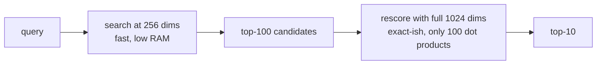

# Lecture 4: Matryoshka Representation Learning and Dimension Truncation

> Every dimension you store costs RAM, index memory, and CPU cycles on every single query, forever. Matryoshka Representation Learning (MRL) is the trick that lets you *dial down* the dimension of an embedding after the fact — turning a 1024-dim vector into a 256-dim one by slicing off the tail — and still keep most of your recall. This lecture teaches you the mechanism from first principles, the one line of code that people forget (re-normalization), how to measure the recall cost honestly, and the truncate-then-rescore pattern that gets the lost recall back. After this you will be able to cut your index memory by 4x on purpose, know exactly what it costs, and defend the number in a design review.

**Prerequisites:** L2 norm and cosine similarity (Lecture 1), what an embedding is, basic big-O, comfort with NumPy slicing · **Reading time:** ~22 min · **Part of:** Phase 3 — Embeddings Infrastructure & Vector Databases, Week 1

---

## The core idea (plain language)

A normal embedding model gives you a vector of some fixed size — 768, 1024, 1536 dims — and every dimension is a full partner in describing the meaning of the text. If you chop off half the dimensions, you have destroyed roughly half the information, arbitrarily, and your search quality falls off a cliff. The dimensions are like an unordered committee: no single subset is a competent summary of the whole.

Matryoshka Representation Learning changes the *training objective* so that this stops being true. An MRL-trained model is optimized so that the **leading dimensions carry the most important information**, and the information *degrades gracefully* as you read fewer of them. The first 64 dims are a coarse, usable embedding. The first 256 are a good embedding. The first 1024 are the full-fidelity embedding. It is the same vector — you are just choosing how much of the front of it to keep.

The name comes from Russian nesting dolls (*matryoshka*): a smaller usable embedding nested inside a larger one, nested inside a larger one. The engineering consequence is enormous and simple: **you can pick the storage/latency-vs-recall operating point at query time by choosing how many leading dimensions to keep, without retraining or re-embedding.** Storage and distance-computation cost scale linearly with dimension, so going from 1024 dims to 256 is a 4x reduction in index RAM and roughly a 4x reduction in per-comparison arithmetic — bought at a recall cost you can measure and usually mostly recover.

Two things make this a lever and not a footgun. First, **it only works on models trained for it** — text-embedding-3-small/large, nomic-embed-text-v1.5, several bge and gte variants. Truncating a *non*-MRL model wrecks recall. Second, **you must re-normalize after truncating**, because a slice of a unit vector is no longer unit-length, and if your index expects normalized vectors (most cosine indexes do), an un-normalized truncation quietly corrupts your distances.

---

## How it actually works (mechanism, from first principles)

### Why the leading dimensions "know more"

During ordinary contrastive training, the loss is computed on the full-dimensional vector. Dimension 3 and dimension 900 are treated symmetrically; the optimizer has no reason to concentrate signal in any particular place.

MRL adds a twist: during training, the loss is computed **at several nested prefix lengths simultaneously** — say on the first 64 dims, first 128, first 256, first 512, and the full vector — and those losses are summed. So the first 64 dimensions are *forced* to produce a good ranking on their own, because they get penalized directly whenever they don't. The first 128 must be good given that the first 64 are already doing work, and so on outward. The net effect: the model packs the most discriminative, general-purpose signal into the front of the vector and pushes finer, more specialized detail toward the tail. Reading fewer dims degrades quality smoothly instead of catastrophically.

You do not need the math. You need the mental model: **importance is front-loaded, and it decays as you move right.**

### The mechanics: slice, then re-normalize

Suppose you have a 1024-dim MRL embedding `v`, already L2-normalized (length 1). You want a 256-dim version.

```
v_256_raw = v[:256]          # keep the leading 256 dims
v_256     = v_256_raw / ||v_256_raw||   # RE-NORMALIZE to unit length
```

Step 2 is the one people forget, and it is not optional. Here is why, with numbers.

A unit vector satisfies `sum(x_i^2) = 1` across *all* its dimensions. When you keep only the first 256 of 1024, you keep only part of that sum. The kept part will be some fraction `f < 1` of the total energy, so:

```
||v[:256]||^2 = f   (some value < 1, e.g. 0.61)
||v[:256]||   = sqrt(0.61) ≈ 0.781
```

So the truncated vector has length ~0.78, not 1.0. Different documents lose different amounts of tail energy, so *every truncated vector ends up with a different length*. If you now feed these into a cosine index — or worse, a dot-product or L2 index that assumes unit vectors — the varying magnitudes distort the comparison. Vectors that happened to keep more of their energy in the front look artificially "bigger" and dominate results for reasons that have nothing to do with relevance. Re-normalizing puts every truncated vector back on the unit sphere so that dot product equals cosine again and rankings are clean.

```
tiny worked check (3 dims for readability):
  v        = [0.6, 0.8, 0.0]        ||v|| = sqrt(0.36+0.64+0) = 1.0   ✓ unit
  v[:2]    = [0.6, 0.8]             ||v[:2]|| = sqrt(0.36+0.64) = 1.0 (this one kept all its energy)
  w        = [0.6, 0.0, 0.8]        ||w|| = 1.0
  w[:2]    = [0.6, 0.0]             ||w[:2]|| = 0.6   <-- NOT unit anymore
  w_norm   = [1.0, 0.0]             re-normalized back to unit length
```

Notice `w` lost a lot of length because its energy lived in the tail (dim 3). MRL training is precisely what makes the *front* carry more energy on average, so real truncations lose less than this adversarial toy — but they still lose some, and the amounts vary per vector. Always re-normalize.

### Contrast: truncating a non-MRL model

Take `all-MiniLM-L6-v2` (384 dims, *not* MRL-trained). Its information is spread across all 384 dims without any front-loading. Slice it to 96 dims and re-normalize and you have thrown away ~75% of an unordered representation. Recall does not degrade gracefully — it collapses, because the first 96 dims were never asked to be self-sufficient. The 96-dim slice is not a coarse version of the meaning; it is a random-looking projection of it.

```
recall@10 vs dims (illustrative shape — measure your own):

  MRL model (nomic-v1.5)          non-MRL model (naive slice)
  1.0 |●●●●●●●●●●●                 1.0 |●
      |          ●●●                   |  ●
  0.9 |             ●●                 |    ●
      |               ●            0.5 |      ●
  0.8 |                ●               |         ●
      |                            0.0 |____________●●●●
      +----------------                +----------------
      768  512  256  128              384 288 192  96  dims
      graceful decay                  cliff
```

This is *the* reason "just make my vectors smaller" is not a model-agnostic operation. The ability to truncate is a property the model was trained to have.

### The truncate-then-rescore pattern

Truncation trades recall for cost. There is a pattern that gets most of the recall back while keeping most of the cost savings: **search cheap, rescore precise.**



1. Store the truncated (e.g. 256-dim) vectors in your ANN index — cheap RAM, fast search.
2. For each query, retrieve a *generous* candidate set at low dims (say top-100, not top-10).
3. Re-score those 100 candidates using the **full-dimension** vectors (which you keep on disk or in a cheaper store) with an exact dot product, and take the final top-10.

Why this works: the 256-dim search is *good enough to not lose the right answers from the top-100* even if it can't perfectly order them. The full-dim rescore then fixes the ordering among a tiny candidate set — 100 dot products per query is nothing compared to scanning a million-vector index. You pay for the small index (fast, cheap) and for keeping full vectors in cold storage (cheap bytes on disk), but not for full-dim distance computation across the whole corpus.

This is the same shape as binary-quantize-then-rescore that you'll meet in Week 2. Cheap-and-approximate to filter, expensive-and-exact to rank a shortlist.

---

## Worked example

Let's make the payoff concrete. Suppose:

- Corpus: **2,000,000 documents**.
- Model: `text-embedding-3-large`, native **3072 dims**, fp32 (4 bytes/dim).
- You are running an in-memory HNSW-style index where raw vector storage dominates.

**Raw vector bytes at full dim:**

```
3072 dims × 4 bytes × 2,000,000 docs = 24,576,000,000 bytes ≈ 24.6 GB
```

That's just the vectors, before graph overhead. Truncate to **768 dims** (a 4x cut):

```
768 dims × 4 bytes × 2,000,000 docs = 6,144,000,000 bytes ≈ 6.1 GB
```

You just went from "needs a 32 GB box for the vectors alone" to "fits comfortably with room for the graph and the OS." Distance computation per comparison also drops ~4x (768 multiply-adds instead of 3072), so search latency and CPU cost fall proportionally.

**Now the recall side.** Say you measure (on *your* eval set — always measure your own):

| dims | index RAM (vectors) | recall@10 | recall@10 after full-dim rescore of top-100 |
|-----:|--------------------:|----------:|--------------------------------------------:|
| 3072 | 24.6 GB             | 0.94 (baseline) | — |
| 1024 | 8.2 GB              | 0.92     | 0.94 |
| 768  | 6.1 GB              | 0.91     | 0.94 |
| 512  | 4.1 GB              | 0.88     | 0.93 |
| 256  | 2.0 GB              | 0.83     | 0.92 |

*(Numbers above are illustrative of the typical shape, not measured — the point is the pattern: recall decays slowly then faster, and rescore recovers most of it. Generate your own table in the lab.)*

Read the table like an engineer:

- **The knee of the curve** is around 512–768 dims here: recall barely moves from 3072 down to 768, then starts sliding faster below 512. The knee is where the cost savings stop being nearly free. Ship at or just above the knee.
- **Rescore is the great equalizer.** Even the aggressive 256-dim index, which lost 11 points of raw recall, recovers to within 2 points of baseline once you re-rank the top-100 with full vectors. So the operating decision becomes: "store a 2 GB index + keep full vectors on cheap disk for rescore" versus "store a 24.6 GB index." That's a serving-cost decision, and MRL makes it available to you.

**OpenAI API mechanics for this example:**

```python
from openai import OpenAI
client = OpenAI()

resp = client.embeddings.create(
    model="text-embedding-3-large",
    input=["your document text"],
    dimensions=768,          # <-- request a truncated MRL embedding
)
vec = resp.data[0].embedding  # already truncated to 768 dims
# NOTE: OpenAI returns these already normalized. If you truncate yourself
# (e.g. slice a 3072 response down), you MUST re-normalize.
```

The `dimensions` parameter is exactly MRL truncation performed server-side. It only works on `text-embedding-3-small` and `text-embedding-3-large` (the older `text-embedding-ada-002` is not MRL and has no such param).

**Open-model mechanics (nomic-embed-text-v1.5, 768 native):**

```python
from sentence_transformers import SentenceTransformer
import numpy as np

model = SentenceTransformer("nomic-ai/nomic-embed-text-v1.5",
                            trust_remote_code=True)   # remote code required
emb = model.encode(["your document text"],
                   convert_to_numpy=True, normalize_embeddings=False)[0]

def truncate_mrl(v, dims):
    v = v[:dims]                     # slice leading dims
    return v / np.linalg.norm(v)     # RE-NORMALIZE — do not skip

v256 = truncate_mrl(emb, 256)        # usable 256-dim embedding
```

`trust_remote_code=True` is needed because nomic ships a custom model class; read what it does before enabling it in production, since it executes code from the model repo.

---

## How it shows up in production

- **Index RAM is usually the dominant serving cost for HNSW.** MRL truncation is one of the few levers that cuts it linearly with almost no engineering. A 1024→256 truncation is a real 4x line-item reduction on your vector-DB bill or your box size. Design reviews love a defensible 4x.
- **Distance computation gets cheaper too.** Fewer dims = fewer multiply-adds per comparison = lower CPU and lower tail latency. On a hot query path this shows up as p95 latency dropping when you truncate — a second, separately valuable win.
- **You can offer tiers.** Serve a fast, small-dim index for the interactive path (autocomplete, "did you mean") and keep full vectors for a rescore or for an offline high-precision batch job. Same embeddings, two operating points.
- **The rescore store is a real component you must build.** Truncate-then-rescore only works if you *kept the full-dimension vectors somewhere*. That's an object store, a Parquet file, or a second column — cheap bytes, but it must exist and be keyed to the same doc ids. Forgetting to keep full vectors is the classic "we truncated and now we can't recover recall" regret.
- **Cross-index consistency bites.** If half your corpus was embedded at 1024 dims and half at 256 (because someone changed the `dimensions` param between ingest runs), your distances are meaningless — you're comparing vectors from different spaces. Pin the dimension in your config alongside the model name and version, and treat a dimension change as a full re-embed (blue-green, Week 3).
- **Debugging signature of a missing re-normalize:** results look *mostly* right but a few odd documents rank suspiciously high across many unrelated queries. Those are the vectors that kept the most energy in their leading dims and so have larger post-truncation magnitude. If you skipped re-normalization under a dot-product/cosine index, magnitude leaks into the score. Fix: re-normalize; the anomalies vanish.

---

## Common misconceptions & failure modes

- **"Truncation works on any model."** No. It works on MRL-trained models. Slicing a non-MRL model destroys recall because its dimensions are unordered. Check the model card for "Matryoshka" / "MRL" / a documented `dimensions` param before you truncate.
- **"A slice of a unit vector is still a unit vector."** False, and this is the single most common bug. The slice is shorter than 1.0 and by a *different* amount for each vector. Re-normalize every time.
- **"More dims is always better recall."** Above the knee, extra dims buy almost nothing while costing linearly. The whole point of MRL is that you often *don't* need the tail.
- **"Rescore fixes everything, so I can truncate as aggressively as I want."** Rescore recovers a lot, but only if the right documents survived into your candidate set. Truncate too hard and the true positives never make it into the top-k you rescore — you can't re-rank a document you never retrieved. This is why the two recovery levers are (1) full-dim rescore of top-k *and* (2) **keep more candidates before rescore** (retrieve top-200 instead of top-50). If aggressive truncation still hurts after rescore, widen the candidate set before you give up dims.
- **"I can mix a 256-dim vector and a 1024-dim vector in the same index."** No — different dimensionality is a different space; the index can't even store them together, and even matched dims from different truncation settings shouldn't be compared as if identical. One dimension setting per index/collection.
- **"OpenAI's `dimensions` and my manual slice give the same vector."** They give the same *leading dims*, but OpenAI returns a normalized result; your manual slice is not normalized until you do it. Also the older `ada-002` model ignores/rejects the param — it isn't MRL.
- **Silent quality regression from a "harmless" ops change.** Someone lowers `dimensions` to save money without re-running the recall eval. Recall drops 4 points, nobody notices for a month. Gate any dimension change behind the golden-set recall check.

---

## Rules of thumb / cheat sheet

- **Only truncate MRL models.** text-embedding-3-small/large, nomic-embed-text-v1.5, and MRL-tagged bge/gte variants. Everything else: don't slice.
- **Always re-normalize after slicing.** `v = v[:d]; v /= norm(v)`. Non-negotiable for cosine/dot indexes.
- **Find the knee empirically.** Plot recall@10 at 768/512/256/128 on *your* data and ship at the smallest dim that stays within your recall budget of baseline. A common landing zone is 256–512 for general text, but *measure*.
- **Default starting cut: try 1/4 of native dims first** (e.g. 1024→256, 3072→768), measure, then decide whether to go smaller. It's a strong "4x savings" candidate that often costs only a few points.
- **Keep full-dim vectors on cheap storage** if you ever want rescore. Truncated in the index, full on disk/object store, same ids.
- **Two recovery levers when truncation hurts:** (1) full-dim rescore of the top-k candidates; (2) retrieve *more* candidates before rescore. Try both before adding dims back.
- **Rescore candidate width ≈ 5–10x your final k** as a starting point (final top-10 → rescore top-50 to top-100), then tune.
- **Pin dimension in your cache/config key** next to model name + version. A dim change is a re-embed event, not a tweak.
- **OpenAI:** pass `dimensions=N`. **Open models:** slice leading dims + re-normalize; expect `trust_remote_code=True` for nomic.
- *(All numeric thresholds above are approximate starting points — validate on your corpus.)*

---

## Connect to the lab

This lecture is the theory behind **Week 1, Lab step 7 (Matryoshka)** and **Self-check question 4**. In the lab you'll take an MRL model (`nomic-embed-text-v1.5` via sentence-transformers with `trust_remote_code=True`), truncate its 768-dim output to 768/512/256/128 (slice **and re-normalize**), and plot recall@10 vs dims to read off your knee. The Definition of Done asks you to *state* the recall lost going 768→256 and the storage saved — that's the table from the Worked Example, computed on your own corpus. Bring back a rescore experiment too: it's the difference between "we lost 4 points" and "we lost 4 points but recovered 3 of them for free."

---

## Going deeper (optional)

- **Matryoshka Representation Learning** — the original paper by Kusupati et al., 2022. Search: *"Matryoshka Representation Learning Kusupati arXiv"*. Read the intro and the figures; skip the proofs.
- **OpenAI embeddings docs** — root: `platform.openai.com` (Embeddings guide). Covers the `dimensions` parameter and which models support it. Search: *"OpenAI embeddings dimensions parameter"*.
- **Nomic Embed v1.5** — the model card and blog. Search: *"nomic-embed-text-v1.5 Matryoshka"* and the Hugging Face model page `huggingface.co/nomic-ai/nomic-embed-text-v1.5`.
- **sentence-transformers docs** — root: `sbert.net`. See the "Matryoshka Embeddings" training/usage page for how truncation and MRL training are handled in the library.
- **MTEB leaderboard** — Hugging Face Space; use it to spot which top models advertise MRL/`dimensions` support. Search: *"MTEB leaderboard"*.
- **Supabase / vector-DB engineering blogs on `dimensions` and pgvector storage** — good for the RAM-math framing. Search: *"pgvector storage dimensions cost"* — treat blog numbers as illustrative, re-derive your own.

---

## Check yourself

1. Why can you truncate a `text-embedding-3-large` vector to 256 dims and keep most of your recall, but doing the same to `all-MiniLM-L6-v2` collapses recall?
2. You slice a normalized 1024-dim vector down to its first 256 dims and index it directly under cosine, skipping re-normalization. Describe the concrete failure you'd see in results and explain the mechanism.
3. Your corpus is 2M docs at 1536 dims fp32. Estimate the raw vector RAM, then the RAM if you truncate to 384 dims. What's the ratio, and why is it exactly that?
4. Explain truncate-then-rescore in two sentences. What must you have stored for it to be possible?
5. You truncate 1024→256, recall@10 drops 5 points, and full-dim rescore of the top-10 only recovers 1 point. What's the most likely cause, and which lever do you pull *before* adding dimensions back?
6. Why is changing the `dimensions` parameter a "re-embed the whole corpus" event rather than a safe in-place tweak?

### Answer key

1. `text-embedding-3-large` is MRL-trained: the objective forces the leading dimensions to be a self-sufficient embedding, so the first 256 dims are a coarse-but-usable representation and quality decays gracefully. `all-MiniLM-L6-v2` is not MRL; its information is spread across all 384 dims with no front-loading, so the first 256 (or 96) dims are a meaningless partial projection and recall falls off a cliff.

2. Each truncated vector has a *different* length below 1.0 (because different docs keep different fractions of their energy in the leading dims). Under cosine/dot, that leftover magnitude leaks into the score: vectors that happened to keep more energy in the front rank artificially high across many unrelated queries. Symptom: a handful of odd documents consistently over-rank. Fix: re-normalize each truncated vector to unit length.

3. Full: `1536 × 4 × 2,000,000 = 12,288,000,000 ≈ 12.3 GB`. Truncated to 384: `384 × 4 × 2,000,000 ≈ 3.1 GB`. Ratio = 4x, exactly, because storage is linear in dimension and `1536/384 = 4`. (Graph/index overhead is extra and not perfectly linear, but the vector bytes are.)

4. Search cheaply in a low-dim (truncated) index to pull a generous candidate set, then re-rank only those candidates using the full-dimension vectors with an exact dot product to produce the final top-k. It requires that you kept the full-dimension vectors somewhere keyed to the same document ids.

5. The true positives aren't surviving into the candidate set you're rescoring — the 256-dim search is dropping them below the top-10, so there's nothing for the rescore to promote. Pull the "keep more candidates" lever: retrieve top-100 (or top-200) at low dims and rescore those, before you consider adding dimensions back.

6. A different dimension is a different vector space; you cannot compare or store vectors of different dimensionality in the same index, and even matched leading dims from a different setting shouldn't be mixed with existing ones. So switching `dimensions` means every stored vector must be regenerated at the new setting — a blue-green re-embed into a fresh collection, not an in-place edit.
