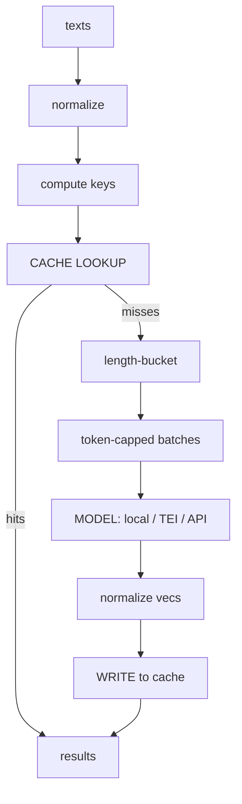

# Lecture 5: Generating Embeddings at Scale — Batching, Caching, and Serving

> You have picked a model and you trust its recall. Now someone hands you a corpus of 50,000 documents — or 5 million — and says "embed these, and re-embed the new ones every night." This is where naive code either bankrupts you on API bills, melts a GPU with out-of-memory crashes, or runs for six hours because it re-embeds text it already embedded yesterday. This lecture is the engineering that makes embedding generation **fast, cheap, and idempotent**. You will learn why padding wastes compute and how length-bucketing recovers it, how to size batches by token budget instead of a fixed count, how to build a cache keyed so that a stale vector can never silently corrupt your index, and how to choose among local sentence-transformers, a GPU batching server (TEI/vLLM), and a rate-limited API. After this you can turn "embed 50k texts" from a scary overnight job into a warm-cache, few-minute, dollar-cheap step you barely think about.

**Prerequisites:** Lecture 1 (embedding geometry, normalization) · comfortable Python (async/await, generators, hashing) · you can call an embedding model locally or via API and reason about tokens · **Reading time:** ~30 min · **Part of:** Phase 3 — Embeddings Infrastructure & Vector Databases, Week 1

---

## The core idea (plain language)

Embedding a big corpus is an **arithmetic problem wearing a systems costume**. The model itself is fixed; your job is to feed it work in the shape it runs fastest and to never make it do the same work twice. Three levers do almost all of it:

1. **Batching done right.** A model on a GPU (or a well-vectorized CPU path) processes many texts at once far faster than one at a time. But a batch is a *rectangle* — every text in it is padded to the length of the longest one, and the model computes on the padding too. So *which* texts you put in a batch together decides how much of your compute is real work versus wasted padding. **Length-bucketing** — sort by token length, batch neighbors — is the single highest-leverage trick in this lecture.

2. **Caching and dedup as a first-class concern.** Real corpora are full of duplicates and near-duplicates, and re-runs re-encounter text you already embedded. Every embedding you don't recompute is latency and money saved. The catch is that a cache is only safe if its **key** encodes everything that changes the vector — model, *version*, and the exact normalized text. Get the key wrong and you either miss the cache constantly (slow, expensive) or serve stale vectors from an old model version into a fresh index (silent corruption that looks like a mysterious recall regression).

3. **Picking the right serving path.** Local sentence-transformers for prototyping and modest volume, a dedicated GPU batching server (Hugging Face **TEI** or **vLLM**) when you need throughput, and a hosted **API** when you don't want to run hardware. Whatever the path, **the cache sits in front of it** so you only ever pay — in GPU seconds or dollars — for text you have genuinely never seen.

Everything else in this lecture is the mechanism behind those three, plus how to *measure* throughput so you don't fool yourself.

---

## How it actually works (mechanism, from first principles)

### Why batching helps at all

A transformer forward pass is dominated by big matrix multiplies. Hardware — GPU tensor cores, CPU SIMD/BLAS — is far more efficient per element on a large matmul than a small one: there's fixed overhead per kernel launch, memory-transfer latency to amortize, and parallel lanes that sit idle if you feed them one row. Encoding one text at a time leaves most of that parallelism on the floor. Stack `B` texts into a `(B, L)` batch and the accelerator does one big multiply instead of `B` tiny ones. Throughput (texts/sec) climbs steeply with batch size, then flattens once you saturate the hardware — after which bigger batches only raise memory pressure and risk OOM.

So far, so good. The problem is what a batch *is*.

### Why padding to the longest sequence wastes compute

Texts have different token lengths, but a batch tensor is a rectangle of shape `(B, L)`. The model can't process a ragged array, so every sequence is **padded** with a special token up to `L = the longest text in that batch`. The attention and feed-forward math then runs over all `B × L` positions — including the padding. Padding tokens are masked out of the *result*, but they are **not free**: the compute was already spent producing values you throw away.

Concrete arithmetic. Suppose a batch of 32 texts where 31 are ~20 tokens and one outlier is 500 tokens. `L` snaps to 500, so the tensor is `32 × 500 = 16,000` token-slots. Real tokens: `31×20 + 500 = 1,120`. **Utilization = 1,120 / 16,000 ≈ 7%.** You paid for 16,000 tokens of compute and used 1,120. One long text dragged the whole batch's cost up by ~14×.

```
Random batching (one 500-tok outlier drags L to 500):
text:  ████ (20)          <- 480 tokens of PADDING computed and discarded
text:  ████ (20)          <- 480 wasted
 ...   (30 more like this)
text:  ████████████████████████████████████ (500)   <- the outlier
        |<----------------- L = 500 ------------------>|
utilization ≈ 7%
```

### Length-bucketing removes the waste

The fix is embarrassingly simple: **sort the whole corpus by token length, then form batches from adjacent items.** Now the texts in any batch are all about the same length, so `L` is close to each text's real length and padding is minimal. The one 500-token outlier ends up in a batch *with other long texts*, where padding it to 500 is honest, not wasteful.

```
Length-bucketed (sort by tokens, batch neighbors):
batch A:  ██████ ██████ ██████ ...   L≈20    utilization ≈ 95%+
batch B:  ██████████ ██████████ ...  L≈120   utilization ≈ 95%+
batch Z:  ████████████████████ ...   L≈500   utilization ≈ 95%+
```

The result set is byte-identical — you sort, encode, then **unsort back to the original order** using the saved permutation. Only the *grouping* changed. Rule of thumb (approximate; measure on your data): on a corpus with a realistic long tail of lengths, bucketing commonly buys **2–5× throughput** over random-order batching, and much more when there are rare very-long outliers. The exact factor depends entirely on your length distribution — a corpus where every text is the same length gains nothing; a corpus with a heavy tail gains a lot.

```python
def bucketed_batches(texts, lengths, max_batch):
    order = sorted(range(len(texts)), key=lambda i: lengths[i])  # sort by token length
    for start in range(0, len(order), max_batch):
        idxs = order[start:start + max_batch]
        yield idxs, [texts[i] for i in idxs]
# encode each batch, then scatter results back:  out[i] = vec  for i in idxs
```

### Why benchmarking without bucketing makes a model look falsely slow

This is the practical sting. If you benchmark a model by feeding it your corpus in *arbitrary* order with a fixed batch size, your measured texts/sec is dominated by padding waste, not the model. Model A might look 3× slower than Model B purely because A's harness didn't bucket and hit more padding — a pure measurement artifact. When you read "model X does N texts/sec," the first question is *bucketed or not, and over what length distribution?* An unbucketed benchmark is a benchmark of your padding, not the model.

### Token-aware batch sizing: cap by total tokens, not by count

A fixed batch size (say 64) is a trap once texts vary in length, because **GPU memory scales with total tokens in the batch (`B × L`), not with `B`.** A batch of 64 short tweets is tiny; a batch of 64 long documents can be `64 × 512 = 32,768` token-slots and blow past memory — an OOM crash mid-run, exactly the failure that kills overnight jobs.

The robust approach after bucketing: **cap each batch by a token budget.** Keep adding texts to the current batch until adding the next one would exceed, say, 16,000 tokens; then flush. Because the corpus is length-sorted, batches of short texts naturally get *many* members and batches of long texts get *few* — memory stays roughly constant across the whole run, and you never OOM.

```python
def token_capped_batches(sorted_idxs, lengths, token_budget=16000, max_items=256):
    batch, tok = [], 0
    for i in sorted_idxs:                       # already length-sorted
        L = lengths[i]
        if batch and (tok + L > token_budget or len(batch) >= max_items):
            yield batch
            batch, tok = [], 0
        batch.append(i); tok += L
    if batch:
        yield batch
```

Numeric feel: with a 16,000-token budget, short (~20-tok) texts pack ~256/batch (hitting the item cap), while 500-tok texts pack ~32/batch. Same memory footprint either way. Compare that to a fixed batch of 64: the short batch under-utilizes the GPU (1,280 real tokens), and the long batch (32,768 tokens) risks OOM. Token-capping fixes both ends.

### Caching and dedup: the key is everything

Every text you can *avoid* embedding is pure savings. Two sources of avoidable work: **duplicates within the corpus** (the same boilerplate paragraph appears in 400 documents) and **re-runs** (tonight's job re-encounters yesterday's text). A content-addressed cache handles both — but only if the key is designed correctly.

**Normalize the text before hashing.** Raw text has trivial variation — trailing whitespace, `"  Hello "` vs `"Hello"`, casing differences — that produce *different* hashes for what is, for embedding purposes, the same input. If you hash raw text, these trivially-different strings all miss the cache and you re-embed them. So first apply a **normalization** appropriate to your model and task, then hash the normalized form:

```python
import hashlib, unicodedata, re

def normalize(text: str) -> str:
    t = unicodedata.normalize("NFC", text)     # canonical Unicode form
    t = t.strip()
    t = re.sub(r"\s+", " ", t)                 # collapse runs of whitespace
    # lowercase ONLY if your model/prefix pipeline is case-insensitive — see caveat
    return t

def cache_key(model: str, version: str, text: str) -> str:
    h = hashlib.sha256(normalize(text).encode("utf-8")).hexdigest()
    return f"{model}:{version}:{h}"
```

A caveat you must respect: **normalization must not change what the model would produce.** Lowercasing is safe for a cased-insensitive model but *wrong* for a cased model where "Apple" (company) and "apple" (fruit) should embed differently. Whitespace collapse is almost always safe. When in doubt, normalize conservatively — the cost of an over-aggressive normalizer is silently wrong vectors, which is far worse than a few extra cache misses.

**Why the key is `model : version : sha256(normalized_text)` — and why `version` is load-bearing.** The vector a piece of text gets depends on *three* things: which model, which release of that model, and the exact input. Drop any one and the cache lies:

- **Model name** — obviously `bge-small` and `e5-large` produce different vectors; keying without the model name mixes them.
- **Version** — this is the one people forget, and it's the dangerous one. Model providers **re-release** weights under the same name: OpenAI ships a new `text-embedding-3-small` snapshot, a Hugging Face repo gets a new commit, TEI upgrades a model revision. **The new weights produce different vectors for the same text.** If your key ignores version, tonight's fresh embeddings (new weights) sit in the *same index* as last month's cached vectors (old weights) — two incompatible geometries mixed in one space. Distances become meaningless, recall silently drops, and nothing errors. This is exactly the "stale cache = silent corruption" failure. Pin `version` to the model revision/commit/snapshot and a re-release simply becomes a clean cache miss that re-embeds fresh — no corruption.
- **Normalized text hash** — the content itself, hashed so the key is fixed-size regardless of document length.

**Why caching raw text (unnormalized) causes trivial cache misses.** If your key hashes `"Hello world\n"` and later you see `"Hello world"` (no newline) or `" hello world"`, those are different bytes → different SHA-256 → cache miss → needless re-embed, even though the model would produce essentially the same (or intentionally same) vector. On a corpus with lots of near-duplicate boilerplate, skipping normalization can drop your hit rate from ~90% to ~40%, turning a cheap warm run into an expensive one for no benefit.

### The cache-gated encode flow



API/GPU cost is paid ONLY on the "misses" path.

Note the ordering: **lookup happens before you spend anything.** The model (local GPU seconds, TEI batch, or paid API tokens) is only touched for genuine misses. This is what "always gate API calls behind the cache to control spend" means concretely — the cache is not an optimization bolted on later, it's the front door.

### Serving paths

**Local sentence-transformers (CPU or single GPU).** `model.encode(texts, batch_size=..., normalize_embeddings=True)`. sentence-transformers *does* sort by length internally within an `encode` call, so a single big `encode` gets bucketing for free — but if you feed it batch-by-batch yourself you must bucket yourself. Best for prototyping, eval harnesses, and volumes up to a few hundred thousand texts on CPU or anything on one GPU. Zero infra.

**GPU batching servers — TEI and vLLM.** Hugging Face **Text Embeddings Inference (TEI)** is a purpose-built embedding server: you run a Docker container, POST batches of text to an HTTP endpoint, and it handles dynamic batching, token-aware queuing, and GPU utilization for you. **vLLM** can also serve embedding models with its high-throughput batching engine and an OpenAI-compatible `/v1/embeddings` endpoint. Use these when one process's throughput isn't enough, when you want a network service multiple workers share, or when you want production-grade batching without writing it yourself. They implement the same length/token-aware batching this lecture describes — server-side.

**API concurrency (OpenAI / Cohere / Voyage).** You don't run hardware; you send HTTP requests and pay per token. The engineering shifts to **concurrency control and resilience**:
- **Bounded concurrency** — fire N requests in flight at once (an `asyncio.Semaphore(N)`), never "all 50k at once," which just gets you rate-limited and floods memory.
- **Exponential backoff with jitter** — on a `429` (rate limit) or `5xx`, wait `base * 2^attempt` seconds *plus a random jitter*, then retry. Jitter is not optional: without it, many workers that got throttled at the same instant all retry at the same instant, re-colliding — a **thundering herd**. Random jitter spreads the retries out.
- **Respect `Retry-After`** — if the API tells you how long to wait in a header, obey it instead of guessing.
- **Batch per request** — most embedding APIs accept many texts per call (e.g. up to ~2048 inputs / a token cap); pack requests to that limit to amortize HTTP overhead.

```python
import asyncio, random

async def embed_with_retry(client, batch, sem, max_tries=6):
    async with sem:                                  # bounded concurrency
        for attempt in range(max_tries):
            try:
                return await client.embed(batch)
            except RateLimitOrTransient as e:
                if attempt == max_tries - 1:
                    raise
                delay = min(60, 2 ** attempt) + random.uniform(0, 1)  # backoff + jitter
                await asyncio.sleep(getattr(e, "retry_after", delay))
```

And, again: every one of those API calls is behind the cache. You embed only misses.

### Monitoring token counts to catch silent truncation

Every embedding model has a **max sequence length** (often 512 tokens; some 8192). Feed it more and it **silently truncates** — the tail of your document is dropped and never embedded, and *no error fires*. A 900-token chunk becomes a 512-token vector; the last 43% of the content is invisible to retrieval. You discover it, if ever, as inexplicably bad recall on long documents.

The defense is cheap: **count tokens before encoding and log the distribution.** Track how many inputs are at or over the model's cap. If a meaningful fraction hit the limit, either your chunking is wrong or you need a longer-context model. Emit a counter (`inputs_truncated_total`) and a histogram of token lengths so truncation shows up on a dashboard instead of as a silent mystery.

---

## Worked example

You must embed a corpus of **50,000 text chunks**. Token lengths follow a realistic long tail: median ~90 tokens, but ~2% of chunks are 400–512 tokens. Model caps at 512 tokens. Let's reason through cost under three regimes.

**Regime 1 — naive: one text at a time, no cache.** No batching means near-zero GPU utilization; suppose it manages ~120 texts/sec on your GPU. `50,000 / 120 ≈ 7 minutes`... but you also have 30% intra-corpus duplicate boilerplate you re-embed anyway, and tomorrow's re-run with 2,000 new chunks re-embeds all 52,000 from scratch. Slow and wasteful, and on an *API* this is 50k separate HTTP calls — you'll be rate-limited into oblivion.

**Regime 2 — fixed batch of 64, no bucketing.** Random order means most batches contain at least one long-ish chunk, so `L` frequently snaps toward 300–512. Estimate average utilization ~35%. Throughput improves over naive but you're paying ~3× the necessary compute in padding. Worse: some batches of 64 happen to contain several 512-token chunks → `64 × 512 = 32,768` token-slots → **OOM crash at chunk 41,000**, six minutes in, and the job dies with no output. Classic.

**Regime 3 — bucketed + token-capped + cached (the right way).**
- **Dedup first.** Normalize + hash all 50,000; 30% are duplicates → **35,000 unique** texts actually need embedding. You've cut the work by 30% before touching the model.
- **Bucket + token-cap** the 35,000 uniques. Utilization ~92%; no OOM because every batch respects the 16,000-token budget (short-text batches pack ~200 items, long-text batches ~32). Suppose this yields ~2,000 texts/sec → `35,000 / 2,000 ≈ 18 seconds`.
- **Tomorrow's re-run:** 2,000 new chunks arrive; after normalization ~1,600 are genuinely new (the rest already cached). You embed **1,600**, not 52,000. Sub-second. This is idempotency: re-running is nearly free.

On an **API** at, say, ~$0.02 per 1M tokens, embedding the 35k uniques (median 90 tokens ≈ 3.15M tokens) costs about **$0.06**; the naive re-embed-everything-nightly approach would pay that *every night* plus the duplicate tax, while the cached approach pays only for the ~1,600 new chunks (~$0.003) on subsequent nights. The cache is the difference between a one-time near-free cost and a recurring bill.

**Throughput measured right.** To report "2,000 texts/sec" honestly: (1) **warm up** — run one throwaway batch first so lazy model loading, CUDA context init, and kernel autotuning don't get charged to your first timed batch; (2) time encoding over a **real slice of your actual length distribution**, not 50k copies of one short string (which would inflate the number wildly); (3) report it **bucketed**, and state the distribution ("median 90, p99 480 tokens"). A texts/sec number without a length distribution is unfalsifiable marketing.

---

## How it shows up in production

- **The overnight job that OOMs at 90%.** Fixed batch size + a long-document batch = a crash five hours in with nothing saved. Token-capped batching after bucketing keeps memory flat and the job finishes. Always checkpoint written vectors to the cache as you go, so a crash resumes instead of restarting.
- **The API bill that won't die.** A team embeds their whole corpus on every deploy because there's no cache, or the cache keys on raw text so the hit rate is 40%. The fix is a content-addressed, normalized, version-keyed cache in front of every call — turns a recurring four-figure bill into a one-time near-zero cost.
- **The mystery recall regression after a "no-op" deploy.** Someone bumped the embedding model to a new snapshot but the cache key didn't include version. Now the index is a mix of old-weight and new-weight vectors. Recall drops, no error appears, and the team spends a week blaming the ANN index. The version field in the key prevents this entirely.
- **The model that "benchmarks slow."** Someone compared two models without bucketing; the "slower" one just had a length distribution that padded worse in an unbucketed harness. Re-run bucketed and the gap vanishes or reverses.
- **The silently truncated long docs.** Chunks are 800 tokens, model caps at 512, tails are dropped, retrieval on long content is quietly terrible. A token-length histogram and a truncation counter would have flagged it on day one.

---

## Common misconceptions & failure modes

- **"Bigger batch is always faster."** Only until you saturate the hardware; past that, larger batches just raise OOM risk with no throughput gain. And a big batch of *mixed* lengths is mostly padding — grouping matters more than raw size.
- **"Batch size 64 is a safe default."** Only for uniform-length text. With variable lengths, fixed count means variable memory and eventual OOM. Cap by tokens, not count.
- **"sentence-transformers doesn't bucket, so I don't get it."** A single `model.encode(all_texts)` call *does* sort by length internally. You lose that only if you hand it pre-formed batches yourself — then you must bucket manually.
- **"Cache on the raw text."** Trivial whitespace/case variation blows your hit rate. Normalize first, then hash — but only with normalization that doesn't change the vector the model would produce (don't lowercase for a cased model).
- **"The model name is enough for the cache key."** No — a re-released version under the same name produces different vectors. Omitting version mixes vector spaces silently. `model:version:sha256(normalized_text)`.
- **"Truncation would throw an error."** It won't. Models silently drop tokens past the cap. Count tokens and monitor.
- **"Retry on 429 immediately in a loop."** That's a self-inflicted DDoS. Exponential backoff *with jitter*, and honor `Retry-After`.
- **"My benchmark says 40k texts/sec!"** — measured on 50k copies of `"hi"`, with no warm-up, unbucketed. Measure over a real distribution, warmed up, and report the distribution.

---

## Rules of thumb / cheat sheet

- **Always length-bucket** before batching (sort by tokens, batch neighbors, unsort results). Approx 2–5× throughput on tailed distributions; more with outliers.
- **Cap batches by total tokens** (`B × L`), not by fixed count. A budget of ~8k–16k tokens/batch is a reasonable starting point (approximate — tune to your GPU memory).
- **Cache key = `model:version:sha256(normalize(text))`.** Version is non-negotiable; it's what stops stale-vector corruption on re-release.
- **Normalize before hashing** (NFC, strip, collapse whitespace; lowercase *only* if the model is case-insensitive). Conservative normalization beats wrong vectors.
- **Gate every model/API call behind the cache.** Pay only for genuine misses.
- **API path:** bounded concurrency (semaphore), exponential backoff *with jitter*, honor `Retry-After`, pack many texts per request.
- **Serving choice:** sentence-transformers to prototype / modest volume → TEI or vLLM for high-throughput GPU serving → hosted API when you don't want hardware. Cache in front of all three.
- **Measure throughput honestly:** warm up first, use a real length distribution, report bucketed texts/sec *plus* the distribution (median/p99 tokens).
- **Monitor token counts.** Log a length histogram and an `inputs_truncated_total` counter to catch silent truncation.
- **Checkpoint to the cache as you go** so a crash resumes instead of restarting.

---

## Connect to the lab

This lecture is the theory behind **Week 1 Lab steps 3 and 8**. In `emb/encode.py` you implement `encode(texts, model_name, kind, normalize, batch_size)` that applies the right prefix, **sorts by length into buckets**, batches, and L2-normalizes — the bucketing and token-aware logic above. In `emb/cache.py` you build the `diskcache`/sqlite layer keyed on `f"{model_name}:{version}:{sha256(normalized_text)}"`, and the **cache-proof** DoD (step 8: second run makes zero model calls) is a direct test of the cache-gating flow. When `bench_models.py` prints texts/sec, apply the "measure right" rules — warm up, real distribution, bucketed — so your throughput numbers are honest.

---

## Going deeper (optional)

- **Hugging Face Text Embeddings Inference (TEI)** — the canonical GPU embedding server; read the README and docs at `github.com/huggingface/text-embeddings-inference` for its dynamic/token-aware batching model.
- **sentence-transformers documentation** (`sbert.net`) — the *Computing Embeddings* page covers `encode`, `batch_size`, `normalize_embeddings`, and its internal length sorting.
- **vLLM documentation** (`docs.vllm.ai`) — search *"vLLM embeddings endpoint"* for serving embedding models with high-throughput batching and the OpenAI-compatible API.
- **diskcache documentation** (`grantjenks.com/docs/diskcache/`) — the sqlite-backed on-disk cache used in the lab; read the `Cache` and eviction sections.
- **AWS Architecture Blog — "Exponential Backoff And Jitter"** — the canonical write-up on why jitter prevents thundering-herd retries; search *"AWS exponential backoff and jitter"*.
- **OpenAI / Cohere / Voyage embeddings API docs** — for per-request input limits, rate limits, and `Retry-After` behavior; check each provider's official API reference (search *"OpenAI embeddings API reference rate limits"*, etc.).
- **tiktoken / the model's tokenizer** — search *"tiktoken counting tokens"* and use the model's own tokenizer to count tokens for budgeting and truncation monitoring.

---

## Check yourself

1. A batch of 32 texts is 31 short (~15 tokens) and one long (480 tokens). What fraction of the computed token-slots is real work, and what does length-bucketing do to that number?
2. Why cap a batch by total tokens instead of a fixed item count? Give the failure mode a fixed count causes on variable-length text.
3. Your cache key is `model_name : sha256(raw_text)`. Name two distinct bugs this key has and how to fix each.
4. Exactly why does the `version` component of the cache key matter? Describe the production failure if you omit it.
5. You report "12,000 texts/sec" for a model. List three things a skeptical reviewer should ask before believing it.
6. On the API path, why is jitter (not just exponential backoff) necessary, and what should you do when the response includes a `Retry-After` header?

### Answer key

1. Real work = `(31×15 + 480) / (32×480)` = `945 / 15,360 ≈ 6%`. The 480-token outlier forces `L=480` for all 32 rows. Length-bucketing puts that outlier in a batch with *other* long texts and groups the 31 short ones together, pushing utilization to ~90%+ — roughly a 15× reduction in wasted compute for this batch.
2. Because GPU memory scales with `B × L` (total tokens), not with `B`. A fixed count of 64 is tiny for short texts (under-utilizes the GPU) and huge for long texts (`64 × 512 = 32,768` slots) — the latter **OOM-crashes** mid-run. A token budget keeps memory roughly constant: short-text batches get many items, long-text batches few.
3. **(a) Raw (unnormalized) text** → trivial whitespace/case differences produce different hashes → needless cache misses and re-embedding. Fix: normalize (NFC, strip, collapse whitespace) before hashing. **(b) No version** → a model re-release under the same name yields different vectors, and old cached vectors get mixed with new ones in the index → silent recall corruption. Fix: include the model version/revision/snapshot in the key.
4. The vector depends on the exact model *weights*, and providers re-release weights under the same name (new OpenAI snapshot, new HF commit, TEI revision bump). New weights → different vectors for the same text. Without version in the key, the cache serves old-weight vectors while fresh embeds use new weights, mixing two incompatible geometries in one index. Distances become meaningless, recall drops, and **no error fires** — a silent corruption. Including version makes a re-release a clean cache miss that re-embeds fresh.
5. (a) Was it **warmed up** (or does the number include model load / CUDA init)? (b) Was it measured over a **realistic length distribution** or over copies of one short string (which inflates the number)? (c) Was it **bucketed**, and what's the reported median/p99 token length? Without the distribution the number is unfalsifiable.
6. Without jitter, all workers throttled at the same instant back off for the *same* computed delay and retry simultaneously — a thundering herd that re-collides and re-triggers the rate limit. Random jitter spreads retries across a window so they don't synchronize. When `Retry-After` is present, obey it (wait exactly that long) instead of using your computed backoff — the server is telling you the real cooldown.
