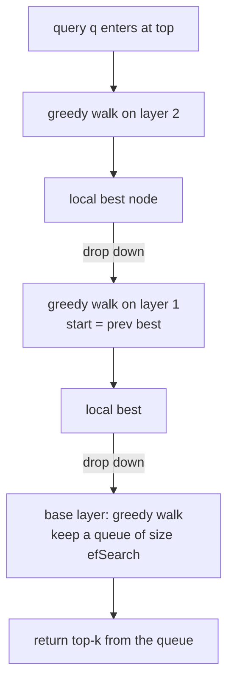

# Lecture 7: HNSW Internals and Tuning

> HNSW is the default index behind pgvector, Qdrant, Weaviate, Milvus, and almost every "just works" vector search product you'll ever touch — and it is the one people tune by superstition, copying `M=16` off a blog and praying. This lecture opens the box: how a multi-layer navigable small-world graph actually routes a query from a sparse top layer down to a dense base layer, and exactly what the three knobs — `M`, `efConstruction`, `efSearch` — do to recall, latency, build time, and RAM. After this you'll be able to *predict the direction of every knob before you run the sweep*, estimate index RAM on the back of a napkin, know why deletes rot your graph, and read a recall-vs-QPS Pareto plot like a native.

**Prerequisites:** what an embedding and nearest-neighbor search are, cosine/dot/L2 metrics (Lecture 1), big-O intuition, the idea that flat/brute-force search is 100% recall but O(N) per query · **Reading time:** ~26 min · **Part of:** Phase 3 — Embeddings Infrastructure & Vector Databases, Week 2

---

## The core idea (plain language)

Brute-force ("flat") search compares your query to every vector in the corpus. It's perfectly correct and hopelessly slow: 10 million vectors means 10 million distance computations per query. Approximate nearest-neighbor (ANN) search buys you orders of magnitude of speed by being willing to miss the true top-k *occasionally* — and HNSW is the most popular way to make that trade.

The mental model is a **skip list for geometry**. Imagine you're navigating a country. If every road were a tiny local street, getting across the map would take forever — you'd shuffle from town to neighboring town. So we build layers. The top layer is a sparse network of *long-range highways* connecting a handful of major hubs. Below it, progressively denser layers of regional roads. At the bottom, every single town is present and connected to its nearby neighbors by local streets.

To find the town nearest your destination, you start on the highway network, drive greedily toward the target until you can't get closer on highways, then *drop down* a layer to regional roads and repeat, then drop again to local streets. Each layer gets you into the right neighborhood cheaply before the next layer refines your position. That is exactly HNSW: **Hierarchical Navigable Small World** graph. Upper layers = sparse long-range links for fast coarse navigation; the base layer = dense short links where the fine-grained answer lives. Search enters at the top, greedily walks toward the query at each layer until no neighbor is closer, then descends. The genius is that you reach the right region in roughly *logarithmic* hops instead of scanning linearly.

You do not need to prove any of this. You need three things burned into muscle memory: (1) the picture above, so you can reason about *why* a knob moves recall; (2) the three parameters and the exact direction each one pushes recall, latency, RAM, and build time; and (3) the gotchas that turn a great benchmark into a 3 a.m. incident — RAM, deletes, and build time.

---

## How it actually works (mechanism, from first principles)

### The layered graph

Every vector (a "node") lives in the base layer (layer 0). A random subset also gets copied up into layer 1; a smaller random subset of *those* into layer 2; and so on. The layer a node reaches is drawn from an exponentially decaying distribution — most nodes only exist at layer 0, a few make it to layer 1, a handful to layer 2, almost none higher. The result is a pyramid:

```
 layer 2   A - - - - - - - - - - - - - - E          (very sparse: long-range hops)
            \                            /
 layer 1   A --- C - - - - - - - G --- E             (sparser: medium hops)
            \    |                |    /
 layer 0   A-B-C-D-E-F-G-H-I-J-K-L-M-N-...            (dense: every node, short links)
           (all N vectors live here; each linked to ~M near neighbors)
```

Two structural facts do all the work:

- **Sparse-but-long links at the top** let a search jump across the whole space in a few hops — like taking a highway rather than surface streets.
- **Dense-but-short links at the bottom** let the search settle onto the true nearest neighbors with precision.

### Search: greedy descent

A query arrives. Search starts at a fixed **entry point** at the top layer. At each layer it does a *greedy walk*: look at the current node's neighbors, move to whichever neighbor is closest to the query, repeat, until no neighbor is closer than where you already are — a local minimum for that layer. Then it drops to the next layer down, using that local-minimum node as the new starting point, and walks greedily again over the denser links. At the base layer it does the same but keeps a **candidate list of size `efSearch`** — a priority queue of the best nodes seen so far — and returns the top-k from it.



`efSearch` is the width of the flashlight at the base layer. `efSearch=16` means "only ever keep the 16 best candidates in play while exploring" — narrow, fast, might miss the true neighbor if the greedy path wandered. `efSearch=256` means "keep 256 candidates alive, explore far more of the local graph" — wider, slower, much less likely to miss. Crucially `efSearch` must be ≥ k (you can't return top-10 from a queue of 5).

### Build: how the graph gets its edges

When a new vector is inserted, HNSW runs *the same search* to find where the node belongs, using a build-time candidate width called **`efConstruction`**. It finds the `efConstruction` best candidates, then connects the new node to up to **`M`** of them (with a neighbor-selection heuristic that prefers diverse directions over just the M literally-closest, so the graph doesn't collapse into tight clusters with no long-range escape). At layer 0 the node may keep up to `2*M` edges; upper layers keep up to `M`.

So the two build knobs mean:

- **`M`** — how many edges each node keeps. More edges = more paths to the right answer = higher recall, but every edge is bytes of RAM and the base layer stores `~2*M` of them per node.
- **`efConstruction`** — how hard the *builder* looks for good neighbors when wiring each node. Higher = better-quality edge choices = a graph that reaches higher recall at a given `efSearch`, but a slower build. It's set once at build time and baked into the graph.

### The memory model (the napkin you'll actually use)

Two things dominate HNSW RAM: the raw vectors and the edge lists.

```
bytes per vector ≈ (dim * 4)      ← the fp32 vector itself (4 bytes/dim)
                 + (M * 2 * 4)     ← ~2*M neighbor links at layer 0, 4 bytes (int32) each
```

That `M*2*4` term is the base-layer edge budget (upper-layer edges are a small fraction on top and usually ignored in a first estimate). Worked: `dim=768`, `M=32`:

```
per vector ≈ 768*4 + 32*2*4 = 3072 + 256 = 3328 bytes
1,000,000 vectors ≈ 3,328,000,000 ≈ 3.3 GB
```

Bump `M` to 64 and the edge term doubles to 512 bytes, per-vector goes to 3584 bytes, and 1M vectors ≈ 3.58 GB — the vector bytes dominate at high dim, so `M` moves RAM less than dim does *until* your dim is small. At `dim=128`, `M=64`: `128*4 + 64*2*4 = 512 + 512 = 1024` bytes — now the edges are *half* your memory and `M` is a first-class RAM lever. **The takeaway: at low dimension, `M` is a big RAM knob; at high dimension the vectors swamp it.** Treat the formula as approximate (implementations add per-node overhead, alignment padding, and upper-layer edges), but it gets you to the right order of magnitude, which is what a capacity-planning conversation needs.

### Predict before you measure

Before touching a sweep, commit to these directions out loud. This is the single most valuable habit in ANN tuning:

| Knob you raise | recall | latency (QPS ↓ means slower) | build time | RAM |
|---|---|---|---|---|
| `efSearch` ↑ | ↑ | QPS ↓ (slower per query) | — (no rebuild) | — (negligible) |
| `M` ↑ | ↑ | slightly slower search | ↑ | ↑ |
| `efConstruction` ↑ | ↑ (to a point) | — (search unaffected) | ↑ | — |

Say it as a sentence: *"`efSearch` up means recall up, QPS down"* and *"`M` up means recall up, RAM up, build up."* If your measured sweep ever contradicts the direction, you have a bug in your harness (cold cache, wrong k, unnormalized vectors), not a surprising discovery about HNSW.

---

## Worked example

You've been handed a corpus of **1,000,000 documents**, embedded at **768 dims** (fp32), normalized for cosine (inner-product metric). The SLO from product: **recall@10 ≥ 0.95 at ≥ 500 QPS**, minimize RAM. Let's reason it through the way the Week-2 lab will make you do for real.

**Step 1 — estimate RAM before building anything.** Using the napkin model at `M=32`: `768*4 + 32*2*4 = 3328` bytes/vector → **~3.3 GB** for vectors + base edges. Add graph/allocator overhead and call it ~4 GB resident. At `M=64` it's ~3.6 GB of formula + overhead, call it ~4.3 GB. Neither is scary on a 16 GB box, so RAM won't be your binding constraint here — good, that frees you to chase recall/QPS. (If this were 50M vectors, ~165 GB would immediately kill several configs and *become* the binding constraint. Always run this number first.)

**Step 2 — design the sweep.** You grid over the two build knobs and the one search knob:

```
M              ∈ {16, 32, 64}
efConstruction ∈ {100, 200, 400}
efSearch       ∈ {16, 32, 64, 128, 256}    ← swept per built index, no rebuild
```

That's 3×3 = **9 built indexes**, each queried at 5 `efSearch` values = **45 measured points**. Critically, `efSearch` costs nothing to sweep — you build the index once and just re-query it at each width. `M` and `efConstruction` require a *rebuild* each, so those 9 builds are where your wall-clock goes.

**Step 3 — what you record per point (write to `sweep.csv`):**

- `recall@10` — measured **against a flat `IndexFlatIP` ground truth** over the same queries. This is the only honest recall. Recall@10 = (avg over queries of |approx top-10 ∩ true top-10| / 10).
- `QPS` — median over ≥3 runs after a warm-up query (the first query pays JIT/allocation costs and will lie).
- `build_time_s` — wall-clock to construct that index.
- `rss_mb` — process resident set size via `psutil` after the index is loaded, so RAM is *observed*, not just modeled.

**Step 4 — read the shape (illustrative — you will generate real numbers):**

```
recall@10 vs efSearch, for M=32, efConstruction=200:

 1.00 |                          ●───●     efSearch=128,256
      |                    ●              efSearch=64
 0.95 |- - - - - - - -●- - - - - - - - -  ← SLO line
      |          ●                        efSearch=32
 0.90 |     ●                             efSearch=16
      +----+----+----+----+----+----+
        16   32   64  128  256   efSearch  (QPS falls left→right)
```

You'd read this as: at `M=32, efConstruction=200`, you cross the 0.95 recall line somewhere around `efSearch=64`, and pushing to 128 buys a little more recall for a real QPS cost. Now check the *other* axis: does `efSearch=64` still clear 500 QPS? If yes, that's a candidate config. If the QPS at `efSearch=64` is only 400, you have three moves: (a) raise `M` (a denser graph often hits target recall at a *lower* `efSearch`, recovering QPS — at the cost of RAM and build time), (b) accept a smaller corpus per shard, or (c) renegotiate the SLO. This is the recall/latency/cost triangle in action: you don't get all three free, you find the cheapest point that meets the SLO.

**Step 5 — the "predict then confirm" checkpoint.** Before running, you wrote: "raising `efSearch` from 64→256 will raise recall a bit and drop QPS a lot; raising `M` from 16→64 will raise recall, roughly double the edge RAM, and lengthen build time." When the CSV comes back matching those directions, you *trust the harness*. When it doesn't — say recall goes *down* as `efSearch` rises — you go hunting for the bug (almost always: comparing against another approximate index instead of flat, or `k > efSearch`).

**hnswlib snippet (the two-phase knob split made concrete):**

```python
import hnswlib, numpy as np

dim, N = 768, 1_000_000
p = hnswlib.Index(space="ip", dim=dim)          # inner product for normalized vecs
p.init_index(max_elements=N, M=32, ef_construction=200)   # M & efC: build-time, baked in
p.add_items(vectors, ids)                       # build cost ∝ M × efConstruction × N

p.set_ef(64)                                     # efSearch: runtime dial, change anytime
labels, distances = p.knn_query(query, k=10)     # ef must be >= k
# want more recall on the next query? just:  p.set_ef(128)  — NO rebuild
```

The `set_ef` line is the whole point of `efSearch`: it's a live dial. `init_index`'s `M` and `ef_construction` are welded into the graph — changing them means `add_items` all over again.

---

## How it shows up in production

- **RAM is the silent budget killer.** HNSW is *fully memory-resident* — the graph and vectors must all fit in RAM for search to be fast; there's no meaningful disk-backed mode in vanilla HNSW. Your capacity plan is the napkin formula times N, and it grows linearly with corpus size. Teams routinely ship a config that benchmarks beautifully on 1M vectors, then fall over when the corpus hits 20M and the box needs 70 GB it doesn't have. Run the RAM estimate *at projected scale*, not at today's scale. This is why IVF-PQ and quantization (next lectures) exist: they trade some recall for a fraction of the RAM.
- **`efSearch` is your production incident dial.** Recall complaints in the field ("search feels dumb today") often just need `efSearch` raised — and you can do it *live, per query, with no rebuild and no redeploy of the index*. Conversely, when p99 latency spikes under load, dropping `efSearch` sheds work immediately. Wire `efSearch` to config, not code, and consider making it per-request so expensive queries can pay for more recall.
- **Deletes rot the graph.** HNSW deletes are *soft*: the node is tombstoned (marked removed) but its edges stay in the graph, so it still gets traversed and still occupies RAM, and neighbors that routed *through* it now have a dead link. Under heavy churn — a corpus with constant upserts/deletes — recall slowly degrades and RAM doesn't drop. The fix is a **periodic full rebuild** (or your vector DB's compaction). If your product deletes a lot (GDPR purges, expiring content), budget for rebuilds in ops and watch recall on a golden set to know when to trigger one.
- **Build time is a real deploy cost.** Build cost grows roughly with **`M × efConstruction × N`**. Doubling `M`, doubling `efConstruction`, and 10x-ing the corpus is a ~40x longer build. A 40-minute rebuild blocks your blue-green re-embedding migration and your churn-recovery rebuilds. If builds hurt, `efConstruction` is usually the first thing to trim (it has diminishing recall returns past ~200–400) — but measure, because a cheaper build that needs a higher `efSearch` to hit recall may cost you QPS forever.
- **The knobs live in different lifecycles.** `M` and `efConstruction` are *decisions you make once* and eat a rebuild to change; `efSearch` is a *dial you turn forever*. Design accordingly: pick `M`/`efConstruction` from a sweep at provisioning time, expose `efSearch` as an operational lever.

---

## Common misconceptions & failure modes

- **"`efSearch` and `efConstruction` are the same thing."** No. `efConstruction` shapes the graph at build time (baked in); `efSearch` controls how widely each query explores that graph (live). You tune `efConstruction` once; you turn `efSearch` every day. Confusing them leads people to rebuild the whole index when they just wanted more recall on one query.
- **"Bigger `M` is always better."** `M` raises recall *and* RAM *and* build time, with diminishing recall returns past ~48–64 for typical text embeddings. Past the knee you're buying RAM and build minutes for tenths of a recall point. Sweep it; don't max it.
- **"Recall@10 = 0.93" as a standalone number.** Meaningless without a denominator. Recall is always **against a flat ground-truth index over the same data**. If you measure against another ANN index you're measuring *agreement*, not recall, and both can be wrong together.
- **"HNSW can spill to disk when it doesn't fit in RAM."** Not in the vanilla algorithm. It's memory-resident; if it doesn't fit, you're swapping and your QPS craters. Plan RAM at scale. (Disk-based ANN like DiskANN is a *different* algorithm with different tradeoffs.)
- **"Deleting a vector frees its memory and cleans the graph."** Soft delete only. The tombstone stays, edges stay, RAM stays. Heavy churn needs periodic rebuild/compaction or recall quietly rots.
- **"The first query's latency is representative."** The first query pays JIT, page-in, and allocation costs and can be 10–100x slower than steady state. Always warm up and take medians over multiple runs, or your QPS numbers are fiction.
- **"`efSearch` below k is fine."** It isn't — you can't return top-10 from a candidate queue of 5. Keep `efSearch ≥ k`, and in practice several times k for good recall.
- **"I tuned it once, it's tuned forever."** As the corpus grows and drifts, the operating point moves. Re-run the golden-set recall check on a schedule; a config that hit 0.96 at 1M vectors may sit at 0.91 at 10M.

---

## Rules of thumb / cheat sheet

- **`M`: start at 16 for a first index; use 32 for a good recall/RAM balance; go 48–64 when you need the last few recall points and can pay the RAM.** Above 64 rarely worth it for text. *(approximate)*
- **`efConstruction`: 200 is a solid default. Range 100–400.** Higher = better graph, slower build; diminishing returns past ~400. Set once. *(approximate)*
- **`efSearch`: start around 64–100, tune per your recall SLO. Range 16 (fast/loose) to 256+ (slow/accurate).** This is THE runtime recall/latency dial — expose it as config, tune per query if needed. Keep `efSearch ≥ k`. *(approximate)*
- **RAM napkin: `(dim*4 + M*2*4)` bytes/vector × N.** Run it at *projected* scale. At low dim, `M` is a big RAM lever; at high dim the vectors dominate.
- **Build cost ≈ `M × efConstruction × N`.** Trim `efConstruction` first if builds hurt.
- **Directions to memorize:** `efSearch↑ → recall↑, QPS↓`; `M↑ → recall↑, RAM↑, build↑`; `efConstruction↑ → recall↑ (to a point), build↑`. Predict before you measure.
- **Always measure recall against a flat index.** No flat ground truth = no recall number.
- **Churn-heavy corpus: schedule periodic rebuilds/compaction; monitor golden-set recall to trigger them.**
- **Warm up before benchmarking; take medians over ≥3 runs; discard the first query.**
- **For cosine similarity, normalize vectors and use the inner-product ("ip") space — it's faster and equivalent for unit vectors.**
- *(Every numeric default above is an approximate starting point — validate on your corpus and SLO.)*

---

## Connect to the lab

This lecture is the theory behind **Week 2, Lab step 4 (the HNSW sweep)** and the Definition-of-Done line "predict, then confirm, the direction of change when you raise `efSearch` and `M`." In the lab you'll grid `M ∈ {16,32,64}` × `efConstruction ∈ {100,200,400}` × `efSearch ∈ {16,32,64,128,256}`, recording `recall@10` (vs your flat `IndexFlatIP` ground truth), `QPS` (median, warmed up), `build_time`, and process `RSS` into `sweep.csv`, then plot the recall-vs-QPS frontier with RAM encoded in `pareto.png`. Write your direction predictions *before* running the sweep and check them against the CSV — a mismatch means a harness bug, not a physics surprise.

---

## Going deeper (optional)

- **FAISS wiki — "Guidelines to choose an index"** — the canonical decision guide for HNSW vs IVF vs flat and how the knobs interact. On GitHub: `github.com/facebookresearch/faiss` (wiki tab). Search: *"FAISS Guidelines to choose an index"*.
- **hnswlib README** — the reference implementation with the clearest `M`/`ef_construction`/`ef` documentation and Python examples. `github.com/nmslib/hnswlib`. Search: *"hnswlib README M ef_construction"*.
- **The HNSW paper** — Malkov & Yashunin, "Efficient and robust approximate nearest neighbor search using Hierarchical Navigable Small World graphs." Read the figures and the parameter discussion; skip the proofs. Search: *"Malkov Yashunin HNSW arXiv"*.
- **ann-benchmarks** — see how professionals present recall-vs-QPS curves; you'll reproduce that plot shape. `github.com/erikbern/ann-benchmarks`. Search: *"ann-benchmarks recall QPS"*.
- **Qdrant / pgvector HNSW docs** — how a production DB exposes `m` and `ef_construct`/`ef_search` and handles deletes/optimization. Roots: `qdrant.tech` and the `pgvector` repo `github.com/pgvector/pgvector`. Search: *"Qdrant HNSW config ef_construct"*, *"pgvector hnsw m ef_construction"*.

---

## Check yourself

1. In one or two sentences, why does searching a *hierarchical* graph reach the right region faster than searching a single flat graph of the same nodes?
2. You need +3 points of recall at serve time, with no rebuild and no extra RAM. Which knob do you turn, and what does it cost you?
3. Estimate the RAM for 5,000,000 vectors at `dim=1024`, `M=32`, using the napkin model. Now at `M=64` — which term changed and by how much?
4. Your sweep shows recall@10 *decreasing* as `efSearch` rises. HNSW physics says that's impossible. Name two harness bugs that would produce this.
5. Your corpus has constant upserts and deletes; over two weeks recall on your golden set drifts from 0.96 down to 0.90 while RAM never drops. What's happening and what's the fix?
6. Why is `efConstruction` the first knob you trim when builds are too slow, and what's the risk of trimming it too far?

### Answer key

1. The sparse upper layers have long-range links, so a few greedy hops carry the search across the whole space into the correct neighborhood in roughly logarithmic time; only then does it descend to dense lower layers for fine-grained refinement. A single flat graph has only short local links, so reaching a distant region takes many more hops.

2. Raise `efSearch` — it's the runtime recall/latency dial, tunable per query with no rebuild and negligible extra RAM. The cost is latency/throughput: a wider candidate queue explores more of the graph per query, so QPS drops.

3. `dim=1024, M=32`: `1024*4 + 32*2*4 = 4096 + 256 = 4352` bytes/vector; × 5,000,000 ≈ **21.8 GB**. At `M=64`: the edge term doubles from 256 to `64*2*4 = 512`, giving `4096 + 512 = 4608` bytes/vector ≈ **23.0 GB**. Only the edge term changed (+256 bytes/vector, ~1.3 GB total); the vector term dominates at this dimension.

4. Most likely (a) you're measuring recall against another approximate index instead of a flat ground truth, so "recall" is really agreement and moves non-monotonically; or (b) `efSearch < k` at the low end / off-by-one k mismatch, or a cold-cache/no-warmup effect polluting the measurement. Either way it's the harness, not HNSW.

5. Deletes are soft/tombstoned: removed nodes keep their edges and RAM, and neighbors route through dead links, so the graph slowly degrades under churn — recall falls, RAM never frees. Fix: schedule a periodic full rebuild (or the DB's compaction), triggered by the golden-set recall check.

6. Build cost grows with `M × efConstruction × N`, and `efConstruction` has diminishing recall returns past ~200–400, so cutting it reclaims build time cheaply. The risk: too low a `efConstruction` yields a poorly wired graph that needs a *higher* `efSearch` to reach your recall SLO — permanently costing you QPS at serve time to save build minutes once.
