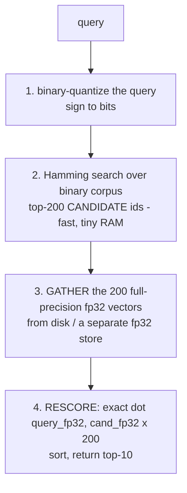

# Lecture 9: Quantization — PQ, Scalar, Binary, and Rescore

> An fp32 embedding is a luxury good. At 384 dimensions it costs 1,536 bytes; at 1,024 dimensions, 4,096 bytes. Multiply by a hundred million vectors and you are renting 150–400 GB of RAM just to *hold the numbers*, before a single index edge or cluster centroid. Quantization is how you stop paying full price: you approximate each vector with far fewer bits and accept a small, *measured* recall loss in exchange for 4x, 32x, even 64x less memory. This lecture walks the whole family — scalar quantization (the easy 4x), product quantization (the 8–64x workhorse that pairs with IVF), and binary quantization (the brutal 32x that only works because of a trick) — and then teaches the trick itself: the **rescore** pattern, where you search cheap and coarse, then re-rank a small candidate pool with full-precision vectors to recover almost all the recall you gave up. After this you will be able to pick a quantization scheme against a RAM budget, predict its recall cost before you build it, and implement binary-quantize-then-rescore from bit-packing to final top-k.

**Prerequisites:** what an embedding is and L2 normalization (Lecture 1), cosine vs dot vs L2 ranking (Lecture 1), honest recall measurement against a flat ground truth (Lecture 6), IVF clustering and HNSW basics (Lectures 7–8), comfort with NumPy dtypes and bit operations · **Reading time:** ~28 min · **Part of:** Phase 3 — Embeddings Infrastructure & Vector Databases, Week 2

---

## The core idea (plain language)

Every quantization scheme answers the same question: *how few bits can I spend per vector and still find the right neighbors?* The full-precision vector is fp32 — 4 bytes per dimension — and most of those bits are not earning their keep. Retrieval only needs to *rank* vectors by similarity; it does not need the 23-bit mantissa of an IEEE float. So we trade precision for space along a spectrum:

- **Scalar quantization (SQ):** keep every dimension, but store each as an 8-bit integer instead of a 32-bit float. **4x smaller**, tiny recall loss, almost free to implement. The lazy win.
- **Product quantization (PQ):** chop the vector into `m` chunks, and replace each chunk with a 1-byte *code* that points into a learned codebook of representative chunk-values. **8x to 64x smaller** depending on `m`, moderate recall loss, needs training. The workhorse for billion-scale, almost always glued to IVF as `IVF...,PQ...`.
- **Binary quantization (BQ):** keep 1 bit per dimension — just the *sign* of each coordinate. **32x smaller**, and distances become integer Hamming (popcount) operations that a CPU does absurdly fast. On its own, a big recall hit.

The catch with the aggressive schemes is real: a binary vector throws away so much that its top-k, taken at face value, misses too many true neighbors to ship. The production move that rescues it — and the single most important pattern in this lecture — is **rescore**: use the cheap representation to find a *generous* candidate pool (say the top-200 by Hamming distance), then re-rank *just those 200* using the full-precision vectors and exact dot product, and return the top-10 from that re-ranked list. The cheap search is "good enough" to keep the true neighbors *somewhere* in the 200; full precision then fixes the fine ordering. You get most of the recall of flat search at a fraction of its RAM and cost.

Everything in this lecture ties back to one number: **recall@k measured against the flat fp32 ground truth** (Lecture 6). Quantization is not free; it is a *trade*, and the only honest way to talk about it is "this scheme cost me X recall points for Yx less RAM." No ground truth, no claim.

---

## How it actually works (mechanism, from first principles)

### Scalar quantization: fp32 → int8, dimension by dimension

The simplest scheme. For each dimension (or globally), find the range `[min, max]` the values occupy across the corpus, then map that range linearly onto the 256 integers an `int8`/`uint8` can hold:

```
q(x) = round( (x - min) / (max - min) * 255 )       # 0..255
x̂    = min + q(x) / 255 * (max - min)                # dequantized approximation
```

Each dimension now costs 1 byte instead of 4. A 384-dim vector drops from **1,536 bytes to 384 bytes** — exactly 4x. The error per dimension is at most half a quantization step: `(max - min) / 255 / 2`. For normalized embeddings whose coordinates cluster in roughly `[-0.2, 0.2]`, a step is around `0.0016`, and that noise is small relative to the gaps between genuinely different neighbors — which is *why* SQ typically costs only a fraction of a recall point.

```
one dimension, fp32 value 0.087, range [-0.20, 0.20]:
  q = round((0.087 - (-0.20))/0.40 * 255) = round(182.9) = 183
  x̂ = -0.20 + 183/255 * 0.40 = 0.0871       # error ≈ 0.0001
```

Two flavors matter in practice: **per-dimension** SQ (a separate min/max per coordinate — tighter, better recall, what FAISS `SQ8` does) versus **global/asymmetric** SQ. The distance computation can stay in int8 (fast SIMD) or dequantize on the fly. Either way SQ keeps *all* the dimensions, so it preserves ranking structure well — it is the scheme least likely to surprise you.

### Product quantization: codes instead of coordinates

SQ compresses each *number*. PQ compresses each *chunk of numbers* into a single code, and that is where the big savings come from.

Split a d-dimensional vector into `m` contiguous subvectors, each of dimension `d/m`. For d=384, m=8 → eight subvectors of 48 dims each. Now, *for each of the m subvector positions*, run k-means over the whole corpus's subvectors at that position to learn a **codebook** of (typically) 256 centroids. To encode a vector: for each subvector, find the nearest centroid and store its **index** — a single byte (0–255) — instead of the 48 floats.

```
vector (384 fp32 = 1536 bytes)
  split into m=8 subvectors of 48 dims
  ┌─sub0─┬─sub1─┬─sub2─┬ ... ┬─sub7─┐
  each subvector → nearest of 256 learned centroids → 1-byte code
  stored as: [c0 c1 c2 c3 c4 c5 c6 c7]   = 8 bytes total

  1536 bytes → 8 bytes   =  192x smaller for the codes
```

So PQ with `m` subquantizers and 256 centroids each costs exactly **`m` bytes per vector** (each code is `log2(256) = 8` bits). The compression ratio is `d*4 / m`. Some tunable points:

- More subquantizers `m` → finer approximation → better recall, more bytes. FAISS `PQ` names it directly: `PQ8` is 8 bytes/vector, `PQ16` is 16, `PQ32` is 32.
- The codebook size (usually `nbits=8` → 256 centroids) is the other lever; 8 bits is the near-universal default because it keeps codes byte-aligned and lookup tables cache-friendly.

**How distance works without decompressing:** the beautiful part. At query time you compute, *once per query*, the distance from each query subvector to all 256 centroids in that subquantizer's codebook — an `m × 256` **lookup table** (called ADC, asymmetric distance computation). Then the approximate distance to *any* stored vector is just `m` table lookups and adds — you never reconstruct the vector. This is why PQ is fast as well as small.

**Why PQ is almost always `IVF...,PQ...`:** PQ shrinks each vector but does nothing to reduce *how many* vectors you compare — by itself it is still an O(N) scan of cheap codes. IVF (Lecture 7) fixes that: cluster into `nlist` cells, probe only `nprobe` of them. Combine them and you get FAISS's canonical billion-scale recipe, e.g. `IVF4096,PQ32`: IVF cuts the candidate count, PQ shrinks each candidate. IVF also lets PQ encode the *residual* (vector minus its cell centroid), which is smaller-magnitude and quantizes more accurately — a free recall boost.

**OPQ, name-drop level:** raw PQ assumes the variance is spread evenly across the `m` chunks. It rarely is — some subvectors carry far more signal than others, and chunking a badly-aligned space wastes codebook capacity. **OPQ (Optimized Product Quantization)** learns a rotation matrix applied *before* PQ that redistributes variance evenly across subvectors, so every codebook works equally hard. In FAISS it is a prefix: `OPQ32,IVF4096,PQ32`. It costs a matrix-multiply at encode/query time and typically buys a few recall points for free. Know the name and that it is a *pre-rotation*; you rarely need to hand-tune it.

### Binary quantization: one bit per dimension

The most aggressive standard scheme. Keep only the **sign** of each coordinate: positive → 1, non-positive → 0.

```
fp32:   [ 0.08, -0.03,  0.11, -0.20,  0.05, -0.01, ... ]
sign:   [   1,     0,     1,     0,     1,     0,   ... ]  → pack into bits
```

A 384-dim vector becomes 384 bits = **48 bytes**, down from 1,536 — exactly **32x smaller**. Distance is now **Hamming distance**: count the bit positions where two binary vectors differ, which is `popcount(a XOR b)` — a single CPU instruction over 64-bit words. Comparing two 384-bit vectors is 6 XORs and 6 popcounts. This is *dramatically* faster and smaller than anything else here.

Why it works at all: for normalized embeddings, the sign pattern already captures a lot about *direction*. Two vectors pointing the same way agree on most signs; Hamming distance correlates with angle. But it is a coarse correlation — a coordinate that is `0.001` and one that is `0.35` both become `1`, and all magnitude information is gone. So binary distance ranks neighbors *approximately right but noisily*. Taken alone, binary top-10 often loses a painful chunk of recall (double-digit percentage-point drops are common — measure it on your data). Which is exactly why binary is almost never used *alone*.

### The rescore pattern (the whole point)

Here is the move that makes binary — and aggressive quantization generally — shippable. **Search cheap, re-rank exact.**



Why it recovers most of the recall, stated plainly in two parts:

1. **Binary search is good enough to *retain* the true neighbors in a large pool.** A true nearest neighbor might not rank in the binary top-10, but it almost always ranks in the binary top-100 or top-200 — binary gets you in the right neighborhood, it just can't order the neighborhood correctly. Recall@10-of-the-final answer depends only on whether the true top-10 survive into the *candidate pool*, and a 200-wide pool is very forgiving.
2. **Full precision fixes the fine ordering.** Once the true neighbors are in the pool, an exact fp32 dot product over just 200 vectors ranks them perfectly. You pay full-precision cost on 200 vectors, not on all N.

The candidate pool size (often called `rescore` or oversampling factor) is the recall dial: rescore 4x the final k (top-40 for top-10) recovers a lot; 10x–20x recovers most; the cost is 200 fp32 dot products per query — negligible next to the Hamming scan you already did. The RAM story: your *searchable* index is the 48-bytes-per-vector binary set (fits in RAM at scales where fp32 never would); the fp32 vectors live wherever is cheap (memory-mapped on SSD, a separate column) and are touched only for the ~200 survivors per query.

---

## Worked example

You have **10,000,000** embeddings, d=384, L2-normalized, and an SLO of recall@10 ≥ 0.95. Walk the RAM and recall trade for each scheme. (All recall figures below are *illustrative shapes* — you will measure the real numbers against your flat ground truth in the lab; only the byte arithmetic is exact.)

**Raw fp32 footprint:**
```
10,000,000 × 384 × 4 bytes = 15.36 GB   just for the vectors (no index yet)
```

**Scalar quantization (int8):**
```
10,000,000 × 384 × 1 byte  = 3.84 GB    (4x smaller)
illustrative recall@10 ≈ 0.99  — a fraction of a point lost
```
The easy win. If 3.84 GB fits your budget and 0.99 clears the SLO, you may be done — SQ needs no rescore.

**Product quantization, PQ32 (32 bytes/vector), paired with IVF:**
```
10,000,000 × 32 bytes      = 0.32 GB    (48x smaller than fp32)
+ IVF/codebook overhead, still well under 1 GB
illustrative recall@10 ≈ 0.90–0.93 raw; higher with IVF residual + more nprobe
```
This is the scheme that makes *billions* of vectors fit in the RAM of one machine. At 10M it's overkill on RAM but shows the shape: two orders of magnitude smaller, recall in the low 0.90s that you tune up with `nprobe` and (optionally) a rescore pass.

**Binary quantization + rescore:**
```
searchable binary set: 10,000,000 × 48 bytes = 0.48 GB   (32x smaller)
fp32 kept on SSD/mmap, touched only for ~200 candidates/query
illustrative recall@10:  binary ALONE ≈ 0.78    (misses too much — unshippable)
                         binary + rescore(top-200) ≈ 0.96  (clears the SLO)
```

The punchline of the whole lecture is in those last two lines: the same binary index goes from **0.78 to 0.96 recall** purely by adding a 200-vector full-precision re-rank pass — a few hundred dot products per query — while the *searchable* footprint stays at 0.48 GB. That is the trade: near-flat recall at ~1/32 the searchable RAM, at the cost of one rescore pass and keeping fp32 vectors somewhere cheap.

Compare the four on one line each:

```
scheme               searchable RAM   illustrative recall@10   notes
fp32 flat            15.36 GB         1.00 (ground truth)      the ruler
SQ (int8)             3.84 GB         ~0.99                    lazy 4x, no rescore
IVF,PQ32              ~0.32 GB        ~0.90→0.95 w/ nprobe+RS   billion-scale workhorse
binary + rescore      0.48 GB         0.78 alone → ~0.96 RS    RAM-bound + rescore budget
```

---

## How it shows up in production

- **The RAM bill is the reason quantization exists.** HNSW over fp32 is memory-resident and gorgeous on recall, but at 100M+ vectors the fp32 payload alone is 150 GB+ and you are provisioning multi-hundred-GB machines. Switching the searchable representation to PQ or binary is often the difference between one box and a sharded cluster — a direct, large dollar number. The first question when RAM is the constraint is "which quantization, and what does it cost me in recall?"

- **Rescore needs the fp32 vectors *somewhere*, and people forget to keep them.** Binary+rescore and PQ+rescore both re-rank with full precision — which you can only do if you still *have* full precision. Teams quantize, delete the fp32 source to "save space," and then discover they can't rescore *or* re-embed. Keep the fp32 vectors in a cheap tier (memory-mapped file, object store, a separate DB column); they are read only for the handful of candidates per query, so slow storage is fine.

- **Rescore latency is dominated by the *gather*, not the math.** 200 dot products are nothing. But if those 200 fp32 vectors are scattered across a cold SSD or a network store, 200 random reads per query can cost more than the entire Hamming scan. Co-locate the fp32 vectors, memory-map them, or batch the reads. This is the number-one reason a rescore pass is "unexpectedly slow."

- **PQ recall is fragile if you train on the wrong data.** The codebooks (and OPQ rotation) are *learned* on a training sample. Train on too few vectors, or a sample that doesn't match production distribution, and the centroids are in the wrong places — recall craters and looks like "PQ is bad" when the real bug is training. Train on a representative sample of ≥ a few × `nlist × centroids` vectors, from the *same* distribution you'll serve.

- **Modern vector DBs do this for you — know which knob.** Qdrant has built-in scalar, product, and binary quantization with an `oversampling` + `rescore` flag; you flip config, not code. Weaviate and Milvus expose PQ/SQ/BQ similarly. The concepts here are exactly those config fields — `always_ram`, `rescore: true`, `oversampling: 3.0` — so understanding the mechanism *is* understanding the config.

- **Binary works best on high-dim, well-normalized embeddings.** Cohere `embed-v3` and other recent models are explicitly documented to support binary/int8 with rescore because they were trained to survive it. Low-dimensional or magnitude-heavy embeddings degrade more under binary — measure on *your* model, don't assume the blog-post number transfers.

---

## Common misconceptions & failure modes

- **"Binary quantization loses too much recall to use."** True *only without rescore*. Binary-alone is coarse; binary+rescore(top-200) routinely recovers to within a few points of flat. The failure is shipping binary *alone*, or setting the oversampling factor to 1 (no real pool to rescore).

- **"PQ and SQ are the same idea."** No. SQ compresses each *number* to int8 (keeps all dimensions, 4x). PQ replaces a *chunk* of numbers with one codebook index (8–64x). PQ is far more aggressive, needs training, and pairs with IVF; SQ is a drop-in 4x with no training.

- **"More subquantizers always help."** `m` up → recall up *and* bytes up — it's a trade, not a free lunch. And past a point the codebooks can't use the extra resolution. Sweep `m` (PQ8/PQ16/PQ32) against recall like any other knob.

- **"I can throw away the fp32 vectors after quantizing."** Then you cannot rescore and cannot re-embed to a new model. Keep them in a cheap tier. Rescore *requires* full precision by definition.

- **"Rescoring 20 candidates is enough."** The pool must be wide enough that the true top-k survive the coarse search. For binary especially, top-10-final often needs a top-100–200 pool. Too-small a pool = the true neighbors were never in it, and no amount of exact re-ranking invents them.

- **"OPQ is a different index."** OPQ is a *pre-rotation* applied before PQ (`OPQ32,...,PQ32`), not a separate quantizer. It redistributes variance so codebooks work evenly; it's a recall booster, not an alternative.

- **"Quantized distances are comparable across schemes / to fp32 scores."** Hamming distances, PQ ADC distances, and fp32 dot products live on different scales and mean different things. Only the *ranking* and *recall vs the same flat ground truth* are comparable. Never mix quantized scores into a fusion step without re-ranking on a common metric.

- **"The recall I read in a vendor blog is the recall I'll get."** Recall depends on your embedding model, dimension, data distribution, and pool size. Always measure against *your own* flat ground truth (Lecture 6).

---

## Rules of thumb / cheat sheet

- **Need an easy 4x with almost no recall loss?** Scalar quantization (int8, per-dimension). No training, no rescore usually needed. First thing to try when mildly RAM-constrained. *(recall loss typically < 1 point — approximate.)*
- **Billions of vectors, RAM-bound?** `IVF...,PQ...` (e.g. `IVF4096,PQ32`), optionally `OPQ` prefix. `m` bytes/vector; tune recall with `nprobe` and a rescore pass. The standard billion-scale recipe.
- **RAM-bound but can afford a rescore pass, high-dim normalized embeddings?** Binary quantization + rescore. 32x smaller searchable index; rescore top-100–200 with fp32 to recover recall.
- **Compression ratios (fp32 baseline):** SQ = 4x · PQ = `d*4/m`x (PQ32 on d=384 ≈ 48x) · binary = 32x.
- **PQ bytes/vector = `m`** (with 8-bit codes). PQ8=8B, PQ16=16B, PQ32=32B. More `m` = more recall + more RAM.
- **Rescore oversampling:** start at **3–5x** the final k; go to 10–20x if recall is short. Cost is that many fp32 dot products/query — cheap. Binary needs a wider pool than PQ.
- **Always keep the fp32 vectors** in a cheap tier (mmap/SSD/object store). Rescore and re-embed both require them.
- **Train PQ/OPQ codebooks on a representative sample** from the production distribution; too few or mismatched training vectors wrecks recall.
- **`m` must divide `d`.** For d=384: valid m ∈ {8,12,16,24,32,48,...}. For d=768: {8,12,16,24,32,48,64,96,...}.
- **Rescore latency = the gather, not the math.** Co-locate/mmap fp32 vectors; batch the candidate reads.
- **Every recall claim is vs the flat fp32 ground truth**, at a fixed k, on your own data. No ground truth, no claim.

---

## Connect to the lab

This lecture is the engine of the **quantization step** in the Recall/QPS Pareto lab (Week 2, milestone component #1). Your `ann/quantize.py` implements binary quantization (`> 0` per dim → packed bits), a Hamming top-200 search, then the rescore pass (gather the fp32 candidates, exact dot product, final top-10) — the exact four-box pipeline from this lecture. You'll compare its recall@10 (against the frozen flat ground truth from Lecture 6) and its RAM against fp32 HNSW, and add `IVF...,PQ...` and (optionally) SQ as separate series on `pareto.png`. The Definition of Done requires you to state, in numbers, how many recall points binary+rescore recovers over binary-alone and how much RAM it saves — which is precisely the trade this lecture taught you to reason about.

---

## Going deeper (optional)

- **FAISS wiki — "Faiss indexes" and "Guidelines to choose an index"** (repo: `github.com/facebookresearch/faiss`, wiki tab). Canonical source for the index-factory vocabulary: `PQ`, `SQ8`, `IVF4096,PQ32`, `OPQ32,IVF4096,PQ32`, and how they compose. Search: *"faiss wiki index factory PQ IVF"*.
- **FAISS wiki — "The index factory"** and the PQ tutorial pages, for encode/train/search mechanics and ADC lookup tables. Search: *"faiss product quantization tutorial ADC"*.
- **Original Product Quantization paper** — Jégou, Douze, Schmid, "Product Quantization for Nearest Neighbor Search" (2011). The source of the idea; read the intuition sections, skip the proofs. Search: *"product quantization nearest neighbor Jegou 2011"*. **OPQ:** Ge et al., "Optimized Product Quantization." Search: *"optimized product quantization Ge"*.
- **Qdrant docs — Quantization** (root: `qdrant.tech`, Documentation → Guides → Quantization). Shows scalar/product/binary quantization as config, plus the `oversampling` + `rescore` flags — the production shape of everything here. Search: *"qdrant quantization rescore oversampling"*.
- **Cohere / Hugging Face writeups on binary and int8 embeddings + rescore.** Search: *"binary quantization embeddings rescore recall"* and *"cohere int8 binary embeddings"*. Treat any specific recall numbers as their data, not yours.
- **ann-benchmarks** (`github.com/erikbern/ann-benchmarks`) to see quantized indexes on the same recall-vs-QPS curves as everything else. Search: *"ann-benchmarks IVFPQ recall qps"*.

---

## Check yourself

1. An fp32 embedding is d=768. Give the bytes-per-vector for: fp32, scalar (int8), PQ16, and binary. Which is smallest, and by what factor vs fp32?
2. Binary quantization alone gives recall@10 = 0.74 on your data. Without changing the embedding model, how do you get to ~0.95 — and *why* does it work?
3. Why is PQ almost always written as `IVF...,PQ...` rather than `PQ...` alone? What does each half do?
4. A teammate quantized to PQ and deleted the original fp32 vectors "to save disk." Name two things they can no longer do.
5. What does OPQ add in front of PQ, and what problem does it solve?
6. Your binary+rescore pipeline has great recall in a unit test but is slow in production, with CPU mostly idle. What is the most likely bottleneck?

### Answer key

1. fp32 = 768×4 = **3,072 B**. int8 SQ = 768×1 = **768 B** (4x). PQ16 = **16 B** (192x). Binary = 768 bits = **96 B** (32x). **PQ16 is smallest** at 16 bytes — 192x smaller than fp32. (Binary is 32x; SQ is 4x.)

2. Add a **rescore** pass: use binary/Hamming to fetch a *generous* candidate pool (top-100–200), then re-rank *those* with exact fp32 dot product and return the top-10. It works because binary is coarse but good enough to keep the true neighbors *somewhere* in the wide pool; full precision then fixes the fine ordering that binary got wrong. Recovery is typically to within a few points of flat.

3. **PQ shrinks each vector** (into `m` codebook-index bytes) but does nothing to reduce *how many* vectors you scan — alone it's still O(N) over cheap codes. **IVF shrinks the candidate count** (cluster into `nlist` cells, probe only `nprobe`). Together: IVF cuts how many, PQ cuts how big — the standard billion-scale recipe. IVF also lets PQ encode the residual for better accuracy.

4. They can no longer **rescore** (re-ranking requires full-precision vectors) and can no longer **re-embed to a new model / recompute ground truth** without re-fetching the raw text and regenerating. Keep fp32 in a cheap tier instead of deleting it.

5. OPQ applies a **learned rotation** to the vectors *before* PQ. It solves uneven variance across the `m` subvectors: raw PQ wastes codebook capacity when some chunks carry far more signal than others; the rotation redistributes variance evenly so every codebook works equally hard, buying a few recall points. It's a pre-rotation, not a different quantizer (`OPQ32,...,PQ32`).

6. The **candidate gather**, not the arithmetic. 200 fp32 dot products are trivial; but if the fp32 vectors are scattered across a cold SSD or network store, 200 random reads per query dominate latency while the CPU waits on I/O. Fix: memory-map or co-locate the fp32 vectors and batch the candidate reads.
