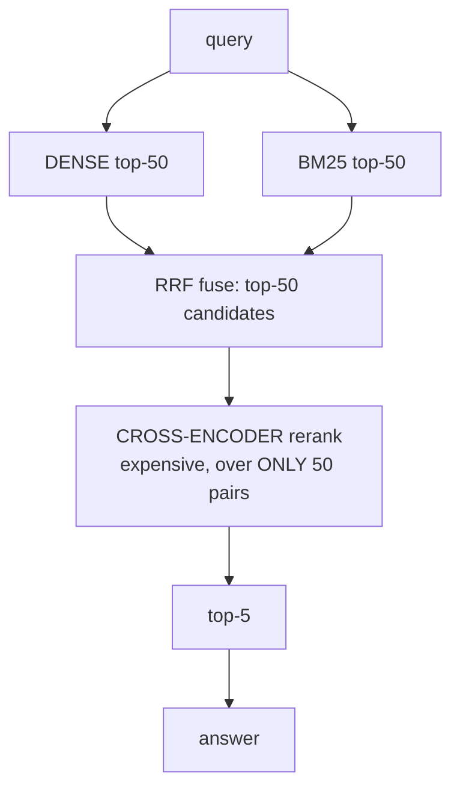

# Lecture 13: Hybrid Search, RRF Fusion, and Reranking

> Dense embeddings are miraculous at meaning and quietly terrible at literals. Ask a dense-only index for "error code E1042" or the part number "MX-7731-B" and it will happily hand you semantically-adjacent paragraphs about error handling in general — while the one chunk that literally contains `E1042` sits at rank 87, unrecovered. This lecture builds the retrieval pipeline that actually ships: run a dense search *and* a lexical BM25 search, fuse their two ranked lists with Reciprocal Rank Fusion (a fusion so robust it ignores raw scores entirely), then rerank the survivors with a cross-encoder that reads query and document *together*. After this you will be able to explain why cosine and BM25 scores can't be added directly, implement RRF from two id-lists in ten lines, prove with a keyword query that hybrid recovers what dense misses, and measure recall@5 across dense vs hybrid vs hybrid+rerank so you can defend the extra latency with numbers.

**Prerequisites:** what an embedding and nearest-neighbor search are (Lecture 1), recall@k measured against a ground truth (Week 2), how a vector DB stores payload/metadata and returns ranked ids (Week 3 intro), basic arithmetic and the idea of a ranked list · **Reading time:** ~26 min · **Part of:** Phase 3 — Embeddings Infrastructure & Vector Databases, Week 3

---

## The core idea (plain language)

A dense embedding turns text into a point in space where *meaning* is proximity. That is exactly what you want when the user asks "how do I stop my app from crashing on startup" and the relevant doc says "resolving boot-time initialization failures." No word overlaps; the vectors are neighbors anyway. This is the superpower of dense retrieval: **paraphrase and synonymy for free.**

That same superpower is a weakness the moment the query contains a *literal* the model never really learned as meaning. Product codes (`MX-7731-B`), error IDs (`E1042`), rare proper nouns, SKUs, ticket numbers, function names, out-of-vocabulary tokens — these get chopped into subword pieces and smeared into a generic region of the space. The embedding for `E1042` sits near "error," "code," "1000-ish numbers," not near *the one document that literally mentions E1042*. Dense retrieval misses exact matches precisely because it converts everything to meaning, and a bare identifier has almost no meaning to convert.

The oldest trick in information retrieval solves exactly that and fails at exactly the opposite thing. **BM25** is a lexical, keyword-counting ranker: it scores a document by how often the query's *words* appear in it, weighted so that rare words count more and long documents don't win just for being long. BM25 nails `E1042` — it's a literal token match, and a rare one, so it scores huge. But BM25 has no idea that "crash on startup" and "boot-time initialization failure" are the same thing; zero shared words means zero score. Lexical search misses paraphrase for the same reason dense search misses literals.

So you stop choosing. **Run both retrievers, then fuse their results into one ranked list.** Dense covers meaning, BM25 covers literals, and the union catches what either alone would drop. The only real question is *how* to combine two lists whose scores are not remotely comparable — and that is where Reciprocal Rank Fusion earns its place as the default. Then, because fusion gives you a good but noisy top-50, you add a final, expensive, very accurate **reranker** to reorder the top-50 down to a clean top-5. Retrieve broadly, rerank narrowly. That cascade — dense+lexical → fuse → rerank — is the shape of essentially every serious retrieval system in 2025-2026.

---

## How it actually works (mechanism, from first principles)

### BM25 at the level an engineer needs

You will use BM25 through a library (`rank_bm25`), so you need the intuition, not the derivation. BM25 scores a (query, document) pair by summing, over each query term, three factors:

- **Term frequency (TF):** how often the term appears in *this* document. More occurrences → higher score, but with **saturation** — the 10th occurrence adds far less than the 2nd. A doc mentioning `E1042` five times isn't 5× more relevant than one mentioning it once.
- **Inverse document frequency (IDF):** how *rare* the term is across the whole corpus. A term in 3 of 100k docs scores enormously; a term in 90k docs (like "the") scores almost nothing. This is why BM25 loves rare identifiers — `E1042` has sky-high IDF.
- **Length normalization:** divide out document length so a 5,000-word page doesn't outrank a tight 200-word answer just for containing more words by chance. A knob (`b`, default ~0.75) controls how aggressively.

That's it. BM25 is TF × IDF with saturation and length normalization. What you must internalize is the **output scale**: BM25 scores are *unbounded positive numbers*, typically landing anywhere from ~0 to 20+ depending on query length, term rarity, and corpus. A cosine similarity, by contrast, lives in a tidy `[-1, 1]` (usually `[0, 1]` for normalized text embeddings). These two numbers describe different physics. **A BM25 score of 14.7 and a cosine of 0.83 are not on the same axis and cannot be added, averaged, or compared.** Remember this — it is the entire reason RRF exists.

```
   Dense (cosine)                 BM25 (lexical)
   ┌───────────────┐              ┌────────────────────┐
   0.0 ─────────► 1.0             0 ──────────────► 20+
   bounded, semantic             unbounded, keyword TF·IDF
        │                                │
        └────────  incomparable  ────────┘
              (different scales, different units)
```

### Why you can't just add the scores

Suppose you naively do `final = cosine + bm25`. The BM25 term, ranging 0-20, utterly dominates the cosine term, ranging 0-1. Your "hybrid" search is now ~95% BM25 with a rounding error of dense — you rebuilt lexical search and called it hybrid. Flip it and weight cosine up, and BM25 vanishes. To add them honestly you must first **min-max normalize** each list onto a common `[0, 1]` scale (`(x - min) / (max - min)`), *then* apply weights: `final = w·cosine_norm + (1-w)·bm25_norm`. That's **weighted score fusion**, and it works — but it's fragile. Min-max normalization is sensitive to outliers (one runaway BM25 score compresses everything else toward zero), the normalization changes with every query's score distribution, and you now own a weight `w` that has to be tuned and re-tuned as data drifts.

### Reciprocal Rank Fusion — throw the scores away

RRF sidesteps the whole problem with one move: **ignore the raw scores entirely and use only each document's rank position in each list.** For a document `d`, its RRF score is:

```
RRF(d) = Σ  over each list L that ranks d:   1 / (k + rank_L(d))

   rank_L(d) = position of d in list L (1 = top)
   k         = a constant, ≈ 60 by convention
```

Because rank is just 1, 2, 3, …, it has no units and no scale. A cosine of 0.83 and a BM25 of 14.7 both simply mean "this doc was ranked #1 in its list" — and `1/(60+1)` is the contribution either way. **That is exactly why RRF needs no normalization and why BM25 cannot swamp cosine:** the fusion never sees 14.7 or 0.83, only "rank 1" and "rank 1." Each retriever gets an equal vote structured purely by ordering.

The constant `k` (≈60, from the original RRF paper) is a dampener. Look at the shape of `1/(k+rank)`:

```
rank:        1        2        3       10       50
1/(k+rank)  1/61     1/62     1/63    1/70     1/110
 ≈          0.0164   0.0161   0.0159  0.0143   0.0091
```

With `k=60`, the gap between rank 1 and rank 2 is tiny (0.0164 vs 0.0161). A large `k` flattens the curve so that being in the top-N at all matters more than the exact position — this is *robustness*: one retriever being slightly wrong about ordering doesn't dominate. A small `k` (say 1) makes rank 1 count massively more than rank 2 (`1/2` vs `1/3`), so the top of each list dominates and fusion becomes brittle. `k=60` is the well-worn default; it's forgiving, and you rarely need to touch it.

The payoff mechanic: a document that lands **#1 in dense and #1 in BM25** gets `1/61 + 1/61 ≈ 0.0328` — it's rewarded for appearing near the top of *both* lists. A document that's #1 in BM25 but absent from dense's top-N gets only `1/61 ≈ 0.0164`. **RRF rewards agreement across retrievers**, which is precisely the signal you want: the docs both a semantic and a lexical view like are your best bets.

### Fusing two id-lists with RRF, concretely

```python
def rrf_fuse(ranked_lists, k=60):
    scores = {}
    for lst in ranked_lists:                 # each lst is [id, id, ...] in rank order
        for rank, doc_id in enumerate(lst, start=1):
            scores[doc_id] = scores.get(doc_id, 0.0) + 1.0 / (k + rank)
    return sorted(scores, key=scores.get, reverse=True)

dense_ids = ["A", "B", "C", "D"]     # from vector search, rank order
bm25_ids  = ["E", "A", "F", "B"]     # from BM25, rank order
fused = rrf_fuse([dense_ids, bm25_ids])
```

Note what the fusion consumes: two lists of **ids in rank order**. No scores cross the boundary. That is the API contract of RRF and why it's so easy to bolt onto any two (or three, or five) retrievers.

### The reranking stage: cross-encoder vs bi-encoder

Your dense retriever is a **bi-encoder**: it embeds the query and each document *separately* into vectors, then compares them with cosine. That separation is what makes it fast — you precompute all document embeddings once, offline, and at query time you only embed the query and do cheap vector math. The cost is accuracy: the model never sees query and document *together*, so it can't reason about subtle interactions ("does this passage actually *answer* this question, or just share topic words?").

A **cross-encoder** (reranker) does the opposite. It takes `[query, document]` as a *single* concatenated input, runs the full transformer over both at once, and outputs one relevance score. Because every query token can attend to every document token, it's dramatically more accurate at judging true relevance. The catch is equally dramatic: **there's nothing to precompute.** Every (query, document) pair is a fresh forward pass. Scoring one query against 1,000,000 documents means 1,000,000 transformer inferences — completely hopeless at query time.

So you don't. You use the cheap bi-encoder + BM25 + RRF to *retrieve* a shortlist (top-50), then spend the expensive cross-encoder on *only those 50*, reordering them to a final top-5. Fifty forward passes is fine (tens to low-hundreds of ms on CPU with a small model like `BAAI/bge-reranker-base`); a million is not. This is the **retrieve-then-rerank cascade**, and it's the standard way to get cross-encoder accuracy at bi-encoder scale.



Dense and BM25 run cheap over the WHOLE corpus; the cross-encoder runs expensive over only the 50 fused candidates.

---

## Worked example

A user searches an internal docs corpus for: **"how to fix error E1042 on startup"**.

**Dense retriever** embeds the query and returns its top-5 by cosine. The embedding is dominated by the *meaning* ("fix error on startup"), so it retrieves general troubleshooting passages. The one doc that literally documents `E1042` (call it `doc_E1042`) uses terse language — "E1042: config checksum mismatch; regenerate via `--reinit`" — with little semantic overlap with the conversational query, so it lands at **rank 12**, outside the top-5. Dense-only *misses it at recall@5.*

**BM25 retriever** sees the rare token `E1042` (huge IDF — it appears in exactly one doc) and shoots `doc_E1042` to **rank 1**. But BM25 also drags in a doc that repeats "startup startup startup" with no real relevance, and it misses a genuinely helpful paraphrased doc that says "boot-time verification failure."

Now fuse the two top-5 lists with RRF (`k=60`):

```
dense top-5:  [d_gen1, d_gen2, d_boot, d_gen3, d_gen4]
bm25  top-5:  [doc_E1042, d_startup_spam, d_gen1, d_boot, d_x]

RRF scores:
  d_gen1     : 1/(60+1)  + 1/(60+3)  = 0.01639 + 0.01587 = 0.03226   ← in BOTH
  d_boot     : 1/(60+3)  + 1/(60+4)  = 0.01587 + 0.01563 = 0.03150   ← in BOTH
  doc_E1042  : 1/(60+1)                                  = 0.01639   ← bm25 only, but #1
  d_gen2     : 1/(60+2)                                  = 0.01613
  d_startup  : 1/(60+2)                                  = 0.01613
  ...

fused top-5: [d_gen1, d_boot, doc_E1042, d_gen2, d_startup_spam]
```

`doc_E1042` is now at **rank 3 in the fused list — inside the top-5.** Hybrid recovered the exact-ID match that dense alone buried at rank 12. That is the concrete win, and it's exactly the assertion your `test_hybrid.py` should make: *a keyword/exact-ID query that dense-only misses at recall@5 is present after RRF fusion.*

**Then rerank.** Feed the cross-encoder the query paired with each of the ~top-50 fused candidates. It reads "how to fix error E1042 on startup" *together with* "E1042: config checksum mismatch; regenerate via `--reinit`" and scores it a decisive 8.9 — it can see this passage directly answers the question. Meanwhile `d_startup_spam` scores 0.4 (topical words, no actual answer) and `d_gen1` scores 2.1 (related but generic). Reranked top-3:

```
reranked:  [doc_E1042 (8.9), d_boot (5.2), d_gen1 (2.1), ...]
```

`doc_E1042` rises to **rank 1** — the cross-encoder's joint reading promotes the truly-relevant doc that RRF had merely rescued into the shortlist. The cascade did its job: BM25 found the literal, RRF pulled it into contention, the reranker crowned it.

---

## How it shows up in production

**Hybrid is where "it works in the demo, fails for real users" gets fixed.** Demo queries are conversational and semantic — dense shines. Real users paste error codes, order numbers, log lines, function names, and legal clause references. The complaints that come in ("I searched the exact ticket number and got nothing") are almost always dense-only missing literals. Turning on hybrid is frequently the single highest-leverage retrieval fix you'll make.

**RRF's operational virtue is that it has almost nothing to tune.** No per-query normalization, no weight to babysit as your corpus grows, `k=60` works. Weighted score fusion, by contrast, has a weight that's correct for today's data distribution and subtly wrong six months later — and min-max normalization means one query returning a single outlier BM25 score can distort that query's whole ranking. In a system you have to *maintain*, RRF's "no knobs" property is worth more than the marginal quality weighted fusion might buy on a good day.

**Reranking is a latency and cost line item you must budget.** A cross-encoder over 50 candidates on CPU with `bge-reranker-base` is typically tens to low-hundreds of milliseconds (approximate — measure yours); over 100+ it climbs, and it's sequential work on your critical path. Options: cap the rerank set (top-50, not top-200), run the reranker on GPU or via a managed API (Cohere Rerank) if latency-bound, or make reranking optional per query class. Always instrument it as its own span (`embed → search → fuse → rerank`) so you can see exactly what the reranker costs and whether a p95 spike is the reranker or the vector DB.

**The rerank set size is a real recall/latency knob.** Rerank top-20 and you might crop out a doc that would've been promoted; rerank top-200 and you pay 4× the reranker cost for diminishing gains. The cross-encoder can only reorder what retrieval handed it — **if the right doc isn't in the fused top-N, no reranker can save it.** This is why you measure *retrieval* recall (recall@50 of the fused list) separately from *final* recall@5: a reranker fixes ordering, not retrieval misses.

**Sparse-neural retrievers (SPLADE) are the advanced middle path.** SPLADE and similar learn sparse, term-weighted representations that behave like BM25 (exact-term-aware, invertible-index-friendly) but with learned semantic expansion — they'll match "car" to a doc about "automobile" while still nailing literals. They can outperform BM25 as the lexical arm of your hybrid. They're heavier to serve (a neural model at index and query time, special index support in the DB). Know the name and when to reach for it; for this week, `rank_bm25` is the right lexical arm — cheap, proven, zero infra.

**Measuring the cascade is non-negotiable.** The whole point is to *prove* each stage earns its keep. On your eval set, compute recall@5 three ways — dense-only, hybrid (dense+BM25+RRF), hybrid+rerank — and report the numbers. The expected shape (illustrative, *not* a benchmarked guarantee): dense-only leaves keyword queries on the floor, hybrid lifts recall@5 several points by recovering literals, and rerank adds further points by fixing ordering within the shortlist. If a stage doesn't move the number *on your data*, don't ship its latency.

---

## Common misconceptions & failure modes

**"I added BM25 and dense scores together — that's hybrid."** No — you built a BM25 search with a cosine rounding error, because BM25's 0-20 scale swamps cosine's 0-1. Either use RRF (rank-only, no scales), or min-max normalize both lists to `[0,1]` *before* weighting. Adding raw scores is the single most common hybrid bug.

**"RRF needs the scores to weight the retrievers."** RRF deliberately discards raw scores and uses only rank position — that's the whole source of its robustness. If you find yourself feeding cosine/BM25 magnitudes into RRF, you've reimplemented weighted fusion by accident. (You *can* weight RRF by scaling each list's contribution, e.g. `w/(k+rank)`, but that's an intentional extension, not the base algorithm.)

**"A bigger rerank set always helps."** Reranking top-200 instead of top-50 costs ~4× the reranker latency for usually-marginal recall gains, because the truly-relevant docs are almost always in the top-50 already. Measure the recall of the fused list at N=20/50/100 and pick the smallest N that captures the relevant docs, then rerank that.

**"The reranker will fix bad retrieval."** A cross-encoder can only reorder candidates it's given. If retrieval (dense+BM25+RRF) never surfaces the right doc into the top-N, reranking is powerless. Debug retrieval recall@N *first*; rerank only fixes ordering *within* what retrieval found.

**"Cross-encoders are just better, use them for search."** They're better *and* orders of magnitude slower — one forward pass per (query, doc) pair, nothing precomputable. Running a cross-encoder over the whole corpus per query is infeasible past a few thousand docs. The bi-encoder exists precisely so you can precompute; the cross-encoder exists precisely for the small rerank shortlist. Use each where it belongs.

**"k in RRF is a recall dial like efSearch."** No — `k` (≈60) is a rank-dampening constant that trades top-heaviness for robustness; it doesn't change *how many* docs you retrieve. Your recall dials are how deep each retriever goes (top-N) and the rerank set size. Leave `k=60` unless you have a measured reason.

**Tokenization mismatch quietly breaks BM25.** BM25 matches *tokens*. If your BM25 tokenizer lowercases and strips punctuation but the user searches `MX-7731-B`, and your tokenizer split it into `mx 7731 b`, you may or may not match depending on how the doc was tokenized. Keep query and document tokenization identical, and be deliberate about whether identifiers survive tokenization intact.

---

## Rules of thumb / cheat sheet

- **Always run hybrid (dense + BM25) if users ever type literals** — codes, IDs, SKUs, names, log lines. Dense-only silently loses them.
- **Fuse with RRF by default:** `score = Σ 1/(k+rank)`, **`k=60`**, rank-only. No normalization, no weight to tune, no swamping.
- **Use weighted score fusion only if** you've min-max normalized both lists to `[0,1]` first *and* you're prepared to tune and re-tune the weight. RRF is the lower-maintenance default.
- **RRF rewards agreement:** docs high in *both* lists win — that's the signal you want.
- **Retrieve broad, rerank narrow:** dense+BM25 top-50 → RRF → cross-encoder → top-5. Never run a cross-encoder over the whole corpus.
- **Reranker default:** `BAAI/bge-reranker-base` (CPU-ok, free) or **Cohere Rerank** (managed, fast). Budget tens-to-hundreds of ms for ~50 candidates (approximate — measure).
- **Rerank set size** is your accuracy/latency knob — start at top-50; the reranker can't recover a doc retrieval never surfaced.
- **Measure recall@5 for dense vs hybrid vs hybrid+rerank on your eval set.** Ship a stage only if it moves the number on *your* data.
- **SPLADE / sparse-neural** = advanced lexical arm (learned term weights + expansion). Name-drop, reach for it when BM25's exact-match rigidity costs you; not needed for the base pipeline.

---

## Connect to the lab

In this week's **production retrieval service**, `service/hybrid.py` builds a `rank_bm25` index over the same chunks you upserted to Qdrant, runs dense and BM25 in parallel, and fuses them with RRF (`k=60`) — `test_hybrid.py` asserts that a keyword/exact-ID query dense-only misses at recall@5 is recovered by the fused list. Then `service/rerank.py` takes the hybrid top-50 and reorders it with `BAAI/bge-reranker-base` (cross-encoder, CPU-ok) down to top-5, and you record recall@5 for **dense vs hybrid vs hybrid+rerank** on `eval.jsonl` so the DoD's "numbers recorded" checkbox is real, not vibes. Wire each stage (`embed → search → fuse → rerank`) as its own OpenTelemetry span in `app.py` so you can see what the reranker actually costs.

---

## Going deeper (optional)

- **The original RRF paper** — Cormack, Clarke, Büttcher, "Reciprocal Rank Fusion outperforms Condorcet and individual Rank Learning Methods" (SIGIR 2009). Short, readable, and where `k≈60` comes from. Search: `reciprocal rank fusion Cormack 2009`.
- **`rank_bm25`** (`github.com/dorianbrown/rank_bm25`) — the library you'll use; the README shows `BM25Okapi` usage in a few lines. For BM25 theory, search: `BM25 Okapi term frequency IDF explained`.
- **sentence-transformers cross-encoder docs** (root: `sbert.net`, "Cross-Encoders" and "Retrieve & Re-Rank" sections) — the canonical explanation of bi-encoder vs cross-encoder and the retrieve-then-rerank pattern, with `BAAI/bge-reranker` usage. Search: `sentence-transformers retrieve and re-rank`.
- **Cohere Rerank docs** (root: `docs.cohere.com`) — managed reranking API, for when CPU latency is the constraint. Search: `cohere rerank api`.
- **SPLADE** — Formal, Piwowarski, Clinchant, "SPLADE" papers and repo (`github.com/naver/splade`). For when you want a learned sparse arm beyond BM25. Search: `SPLADE sparse neural retrieval`.
- **Qdrant / Weaviate hybrid-search guides** (roots: `qdrant.tech`, `weaviate.io`) — how production vector DBs expose native hybrid + RRF/fusion. Search: `qdrant hybrid search rrf`.
- **BEIR benchmark** (`github.com/beir-cellar/beir`) — heterogeneous retrieval eval; good for building your recall@k harness against realistic query types. Search: `BEIR benchmark information retrieval`.

---

## Check yourself

1. Explain in one sentence each *why* dense-only misses "error E1042" and *why* BM25 misses "boot-time initialization failure."
2. A colleague implements hybrid as `final = cosine_score + bm25_score` and reports it "basically ignores the embeddings." What happened, and give two correct fixes.
3. What exactly does RRF consume from each retriever's output, and why does that make score normalization unnecessary?
4. Compute the RRF score (`k=60`) for a document ranked #2 in the dense list and #5 in the BM25 list. Then for a document ranked #1 in BM25 only. Which wins, and what does that illustrate?
5. Your fused top-50 has recall@50 = 0.70 on the eval set, but after reranking, recall@5 is only 0.48. Is your problem retrieval or reranking? What do you fix?
6. Why can a cross-encoder reorder a 50-candidate shortlist accurately but not serve as the primary search over a 1M-doc corpus?

### Answer key

1. Dense misses `E1042` because embeddings convert text to *meaning*, and a bare identifier has almost no meaning — its vector lands in a generic "error/number" region, not near the one doc that literally contains it. BM25 misses "boot-time initialization failure" because it matches *shared words*, and that phrase shares zero tokens with a doc that says "startup crash" — no overlap, no score.

2. BM25 scores range ~0-20 while cosine ranges 0-1, so adding them raw makes BM25 dominate ~95% of the sum — he rebuilt lexical search. Fixes: (a) use **RRF**, which fuses on rank only and never sees the incomparable magnitudes; or (b) **min-max normalize** both lists to `[0,1]` *before* applying weights (`w·cos_norm + (1-w)·bm25_norm`).

3. RRF consumes only each document's **rank position** in each list (1, 2, 3, …), never the raw score. Because rank is unitless and identical in structure across retrievers ("#1 in dense" and "#1 in BM25" both contribute `1/(k+1)`), there are no incomparable scales to reconcile — normalization is moot.

4. Doc A: `1/(60+2) + 1/(60+5) = 0.01613 + 0.01538 = 0.03151`. Doc B (BM25 #1 only): `1/(60+1) = 0.01639`. **Doc A wins** despite never being #1 in either list, because it appears in *both* lists — this illustrates that RRF rewards cross-retriever agreement over a single top rank.

5. **Retrieval.** Recall@50 = 0.70 means 30% of relevant docs aren't even in the shortlist, and a reranker can only reorder what it's given — it cannot recover a missing doc. Fix retrieval first: check that hybrid is on, that BM25 tokenization preserves literals, increase retrieval depth (top-N per retriever), and re-measure recall@50 before touching the reranker.

6. A cross-encoder runs one full transformer forward pass per (query, document) pair with nothing precomputable, so 50 candidates is ~50 inferences (feasible, tens-to-hundreds of ms) while 1M docs is ~1M inferences per query (infeasible). The bi-encoder precomputes all doc embeddings offline and does cheap vector math at query time, so it scales to the whole corpus; the cross-encoder's joint query-doc reading is reserved for the small shortlist where its accuracy pays off.
