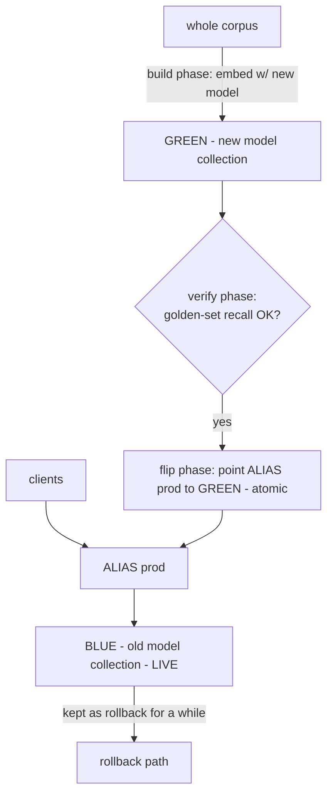

# Lecture 14: Freshness, Lifecycle, and Blue-Green Re-embedding

> A vector index is not a static artifact you build once and query forever — it is a living store that ingests new documents, updates changed ones, deletes rows for compliance, and eventually gets rebuilt when you upgrade the embedding model. Every one of those operations has a sharp edge. Upserts must be visible immediately or your app shows stale answers. Deletes are a trap: many ANN indexes only *mark* a vector deleted, so a "deleted" document can keep matching queries until a compaction you never triggered runs. And the big one — swapping embedding models — cannot be done in place, because vectors from two different models live in incomparable spaces and their distances are meaningless. This lecture teaches the operational discipline that keeps a production index honest: how upserts and immediate visibility actually work, why tombstones bite and how to verify your DB's real delete semantics, the **blue-green re-embedding** pattern that lets you switch models with zero downtime and instant rollback, the non-negotiable habit of storing raw text in the payload, and a **golden-set** recall monitor that catches drift before your users do. After this you'll be able to reason about what "deleted" really means in your DB, run a model migration without ever mixing vector spaces, and stand up a drift alarm.

**Prerequisites:** what an embedding and nearest-neighbor search are (Lecture 1); HNSW graph structure and why deletes are "soft" (Lecture 7); recall@k measured against a ground truth (Week 2); how a vector DB stores payload/metadata and returns ranked ids (Lectures 11–13); basic arithmetic and probability · **Reading time:** ~28 min · **Part of:** Phase 3 — Embeddings Infrastructure & Vector Databases, Week 3

---

## The core idea (plain language)

The demo version of a vector database is write-once: you embed a fixed corpus, load it, and query it. The production version never stops changing. Documents arrive, get edited, get deleted for GDPR, and one day you decide `text-embedding-3-small` should become `bge-m3` because it scores better on your data. The index has to survive all of that *while serving live traffic*, and the mechanisms that make it fast (an in-memory ANN graph, batch compaction, immutable segments) are exactly the ones that make lifecycle operations subtle.

Three realities you must internalize:

1. **Upserts** — "insert or update by id" — are the normal write. Your caller expects that after an upsert returns success, the next query reflects it. That expectation ("read-your-writes") is *not* automatically true in every DB or every config; you have to know your engine's visibility model.

2. **Deletes are rarely as final as they look.** Removing a node from an HNSW graph would mean surgically re-stitching its edges, which is expensive, so most engines just flag the vector as deleted and skip it at query time — a **tombstone**. Depending on the engine and how you asked, that tombstoned vector can still be *reachable and matchable* until a **compaction** or rebuild physically removes it. If you assume "delete = gone" and don't verify, you leak deleted data into results.

3. **You cannot mix embedding models in one collection.** A vector only means something relative to other vectors *from the same model*. Distances between an old-model vector and a new-model vector are numerically computable and semantically garbage. So changing models is never an in-place edit — it's building a whole new collection and switching to it. The professional way to do that switch with zero downtime and a safety net is **blue-green**: build green alongside blue, verify green, flip a pointer, keep blue for rollback.

Underpinning all of it is one habit that seems trivial and saves you repeatedly: **store the raw source text in every point's payload.** The vector is a lossy, model-specific projection of that text. If you keep the text, you can re-embed with any future model and rerank with any cross-encoder without a round-trip to the original source system (which may be slow, rate-limited, or gone). If you don't, a model upgrade means re-fetching your entire corpus from wherever it came from — often the hardest part of the migration.

---

## How it actually works (mechanism, from first principles)

### Upserts and the immediate-visibility expectation

An **upsert** is keyed by an id you control. If the id exists, the point (vector + payload) is replaced; if not, it's inserted. This is the right primitive for a living index because re-ingesting a changed document is idempotent — same id, new content, no duplicates.

The interesting question is *when the write becomes visible to queries*. Naively you'd expect "immediately," but the ANN index is a graph or an inverted-file structure that isn't free to mutate mid-query. Engines handle this in one of a few ways:

- **Insert into a mutable segment / graph, serve from it right away.** Qdrant, for instance, applies upserts and (with the default `wait=true`) returns only after the operation is applied and queryable — so you get read-your-writes. Set `wait=false` for throughput and you've opted into a window where the write may not yet be visible.
- **Write to an in-memory buffer, flush to the index on an interval.** Some engines (and search engines like Elasticsearch's `refresh_interval`) batch writes; there's a configurable delay between "accepted" and "searchable." If you don't know your engine's flush/refresh behavior, you'll ship a bug where a just-uploaded doc isn't found for N seconds.
- **Transactional, index built synchronously.** pgvector rides on Postgres MVCC: after your transaction commits, the row (and its index entry) is visible to new queries per normal Postgres visibility rules.

The engineering point: **immediate visibility is a property you verify, not assume.** In your ingest path, if the contract is "user uploads a doc and immediately searches for it," use the synchronous/`wait=true` mode and write a test that upserts then queries in the same breath.

A subtlety with updates: when you upsert a *changed* vector under an existing id, the old vector's graph node must be superseded. Well-behaved engines handle the replacement so only the new vector matches. But if you (incorrectly) insert the new version under a *new* id and forget to delete the old, you now have two points for one logical document — the classic "why do I get the same doc twice, with slightly different text" duplicate bug.

### Deletes: hard vs soft, and the tombstone trap

A **hard delete** physically removes the data. A **soft delete** marks it deleted (a tombstone) and filters it out at read time, deferring the physical removal to a later batch operation.

Why do vector DBs prefer soft deletes? Look at HNSW (Lecture 7). A vector is a node in a multi-layer graph, wired to neighbors by edges that make search navigable. Physically deleting a node means finding everything that points *to* it and re-stitching those edges so the graph stays connected and searchable — potentially touching many nodes, under a lock, on the hot path. That's expensive. So the pragmatic move is: set a "deleted" bit, and when a search traverses into that node, skip returning it. The node is still *in the graph*, still consuming RAM, still used as a *routing* waypoint — it's just excluded from results.

Here is where it bites. Whether a tombstoned vector can still *match* depends on the engine and how deletion is implemented:

```
   HARD DELETE                         SOFT DELETE (tombstone)
   ┌─────────────────┐                 ┌───────────────────────────┐
   │ node removed,   │                 │ node still in graph/segment│
   │ edges restitched│                 │ flagged "deleted"          │
   │ RAM reclaimed   │                 │ skipped at result time...  │
   └─────────────────┘                 │ ...IF the filter is applied│
        gone for real                  └───────────────────────────┘
                                            still costs RAM;
                                        can leak until COMPACTION
```

- If the engine reliably applies the deleted-filter at query time, the user never sees the doc — but it still occupies RAM and can *degrade recall*, because the graph now routes through dead nodes and returns fewer live candidates for the same `efSearch`. Heavy delete/update churn slowly rots recall until you rebuild.
- If the deleted-filter is applied *after* the ANN step (or only enforced by compaction), a tombstoned vector can be *returned* — a correctness/compliance bug. This is engine- and version-specific, which is exactly why you must **verify actual behavior rather than trust the word "delete."**

**Compaction** (a.k.a. optimize / merge / vacuum, depending on the engine) is the background or on-demand process that physically rebuilds segments, drops tombstones, reclaims RAM, and restores recall. Some engines run it automatically on thresholds; some need you to trigger it; some let you `wait` for it. If a compliance requirement says "this data must be gone," you often must **force compaction and confirm** — the tombstone alone is not "gone."

**The verification recipe** (do this once per DB/version you deploy):

1. Upsert a point with a known, unique payload token (e.g. `text: "CANARY_ZZTOP_9931"`).
2. Confirm it's returned by a query that matches it.
3. Delete it via your delete path.
4. Immediately query again. Is it gone from results? (Tests read-time filtering.)
5. If your DB exposes it, query the raw segment / count / scroll API to see whether the vector still physically exists. (Tests tombstone vs hard delete.)
6. Trigger/await compaction, re-check physical existence. (Tests that compaction actually reclaims.)

Now you *know* your delete semantics instead of guessing.

### Why you can never mix embedding models: incomparable spaces

Every embedding model defines its own coordinate system. Dimension 37 of `bge-m3` and dimension 37 of `text-embedding-3-small` have no shared meaning; the two models may not even have the same number of dimensions. "Cosine similarity" between a vector from model A and a vector from model B is a number your CPU will happily compute — and it is **noise**. Nearest-neighbor search across a mixed collection therefore ranks by garbage: a query embedded with model B, compared against a graph containing both B-vectors and A-vectors, will interleave them in a meaningless order.

```
   Model A's space              Model B's space
   (768-dim, its own axes)      (1024-dim, different axes)
        •  •                          ◦   ◦
      •   • •                       ◦  ◦  ◦
        •  •                          ◦   ◦
   distance A↔A: meaningful      distance B↔B: meaningful
   distance A↔B: MEANINGLESS  ✗  (even if dims matched)
```

So a model change is not an "update the vectors" operation you can do row-by-row in place. During any in-place migration there is a window where the collection holds a mix of old and new vectors, and every query in that window returns partial garbage. The correct move is to build a **separate, fully new-model collection** and switch to it atomically once it's complete and verified. That's blue-green.

### Blue-green re-embedding, step by step

"Blue-green deployment" borrows from web ops: run two identical environments, keep one live (blue), prepare the other (green), then flip the router. For embeddings:



1. **Create green.** New collection, sized for the new model's dimension and metric.
2. **Ingest into green.** Re-embed the *entire* corpus with the new model and upsert into green. Because you stored raw text in the payload (see below), you read text straight from blue's payloads — no re-fetch from source. This runs offline, off the serving path; it can take hours for a large corpus and that's fine, blue is still serving.
3. **Verify green BEFORE any switch.** Run your **golden set** (queries with known-relevant ids) against green and compute recall@k. Compare to blue's baseline. Also sanity-check count parity (green should have ~the same number of points as blue), empty-result rate, and latency. **If green's golden-set recall regresses beyond your threshold, you do not flip.** This is the gate that prevents shipping a worse model.
4. **Flip atomically.** Point an **alias** (Qdrant, Elasticsearch) or a config value your app reads (the collection name) from blue to green in one operation. Because the app resolves the alias per request, in-flight requests finish on blue and new ones land on green — zero downtime, no mixed-space window (each collection is internally single-model).
5. **Keep blue as rollback.** Don't delete blue immediately. If green misbehaves under real traffic (a query pattern your golden set didn't cover), flip the alias back instantly. Retire blue after a soak period.

The atomic flip is the crux: use an alias indirection so the switch is a single metadata change, not "delete old collection, rename new one" (which has a gap where neither exists). If your DB lacks aliases, put the live collection name in a config/feature-flag your service reads on each request and change *that* atomically.

### Always store raw text in the payload

The vector is a one-way, lossy, model-specific projection. You cannot invert it back to text, and you cannot re-project it into another model's space. So the *only* way to re-embed is to have the original text. Store it in the payload at ingest time:

```python
client.upsert(collection="blue", points=[
    PointStruct(
        id=doc_id,
        vector=embed(text, model="old"),
        payload={"text": text, "source": src, "tenant_id": tid,
                 "created_at": ts, "model": "old-model@v1"},
    )
])
```

Now re-embedding is: scroll blue → read `payload["text"]` → `embed(text, model="new")` → upsert into green. No source system in the loop. The same stored text also powers **reranking** (the cross-encoder needs the actual passage text, not the vector) and lets you re-chunk or debug retrieval by eyeballing what was actually indexed. Tagging the payload with the `model` version is a cheap insurance policy: you can assert at query time that a collection is single-model, and audit which model produced which vectors.

### Drift monitoring with a golden set

Retrieval quality decays silently. The model doesn't change, but your *data* does (new topics, new vocabulary, distribution shift), or an upstream ingest bug corrupts embeddings, or a config change quietly breaks prefixes. You won't see it in latency graphs — the system returns *results*, they're just *worse*. You need a quality signal.

A **golden set** is a small, curated list of queries paired with their known-relevant document ids — your always-on regression test for retrieval:

```jsonl
{"query": "how to rotate API keys", "relevant_ids": ["kb-431", "kb-902"]}
{"query": "error E1042 on startup",  "relevant_ids": ["kb-1187"]}
```

On a schedule (e.g. every 15 min or hourly, plus after every deploy/re-embed), run each golden query against the *live* service and compute **recall@k**: what fraction of the known-relevant ids appear in the top-k. Track it over time. Alert when it regresses past a threshold (e.g. "recall@5 dropped below 0.85" or "dropped >0.05 vs the trailing 7-day median"). Pair it with an **empty-result rate** (fraction of golden queries returning zero hits) — a spike there often means an ingest/index breakage, not gradual drift. This is also the exact same harness that gates your blue-green flip: verify green, and keep verifying prod.

---

## Worked example

You run a 200k-chunk internal docs index on Qdrant, serving under alias `docs-prod` → collection `docs_blue` (embedded with `text-embedding-3-small`, 1536-dim). Two things happen this week.

**1) A GDPR delete.** Legal says user `u-7788`'s 340 documents must be removed. You issue a delete by `tenant_id`/`owner` filter. A query for one of their doc titles now returns nothing — good, read-time filtering works. But you run the verification recipe: a `scroll`/`count` on the collection shows the point count *unchanged* — the vectors are tombstoned, not physically gone, and still occupying RAM. Compliance requires actual erasure, so you trigger the collection optimizer (compaction) and re-check: count now reflects 340 fewer points, RAM drops. Had you stopped at step 4 ("it's not in results"), you'd have failed the audit. **Lesson: "not returned" ≠ "erased."**

**2) A model upgrade.** Benchmarks say `bge-m3` (1024-dim) beats your current model on your domain. You do *not* touch `docs_blue`. Instead:

- Create `docs_green` (1024-dim, cosine).
- Scroll `docs_blue`, read each point's `payload["text"]`, embed with `bge-m3`, upsert into `docs_green`. 200k chunks at ~200 texts/sec batched ≈ ~17 minutes of encoding; blue serves the whole time.
- Run the 120-query golden set against both:

```
                     recall@5   empty-result rate   p95 search
docs_blue (old)        0.88          0.0%              41 ms
docs_green (bge-m3)    0.92          0.0%              44 ms   ← better recall, similar latency
count parity: blue=200,000  green=199,998  (2 chunks failed to embed → investigate)
```

Two chunks failed to embed — you find they exceeded the model's token cap and were dropped. You fix chunking, re-embed those two, and now `green` has parity. Golden recall is *up* 4 points and empty-rate is clean, so the gate passes.

- Flip the alias: `docs-prod` → `docs_green`, one atomic API call. In-flight queries finish on blue; new ones hit green. Zero downtime, no mixed space.
- Keep `docs_blue` for 7 days. On day 2, a support ticket reveals a class of acronym queries that regressed (not in the golden set). You flip the alias back to blue in one call while you debug, add those queries to the golden set, and try green again. **The rollback path is why blue-green beats a one-way migration.**

Had you instead re-embedded *in place* — overwriting vectors in `docs_blue` one batch at a time — then during those 17 minutes every query would have compared a `bge-m3` query vector against a collection that's part-old, part-new, ranking by nonsense. Users would have gotten visibly broken results for a quarter hour, with no clean rollback.

---

## How it shows up in production

**"Deleted" data resurfacing is a real incident class.** The most damaging version is compliance: you told an auditor a user's data is gone, but it's tombstoned and still physically present (or, worse, still matchable because the delete filter is applied post-ANN in your engine/version). Verify delete semantics per engine and per major version — behavior changes between releases. For GDPR-grade erasure, treat it as "delete + force compaction + confirm count," and remember the vector DB is not the only store (payload backups, caches, the semantic query cache, logs).

**Churn silently erodes recall.** An index under constant upsert/delete accumulates tombstones and stale graph edges. Recall@k measured at launch quietly drifts down over weeks. Without a golden-set monitor you won't notice until users complain. The fix is periodic compaction/optimize (or a full rebuild on a cadence for very high-churn indexes) — and the monitor tells you *when* it's needed instead of guessing.

**In-place re-embedding is the migration mistake that looks efficient and isn't.** It "saves" a second collection's worth of RAM/disk for the duration of the migration, at the cost of serving garbage during the window and having no rollback. The extra collection is cheap and temporary; the outage and the inability to roll back are not. Always blue-green.

**Forgetting to store raw text turns a 20-minute migration into a multi-day project.** When the day comes to upgrade models and the payloads hold only vectors + ids, you must re-fetch every document from the source of truth — which may be a rate-limited API, a system that's been decommissioned, or a database whose content has since changed (so you can't even reproduce the original chunks). Storing text at ingest is a few extra KB per point and buys you painless re-embedding and reranking forever. It is the single cheapest insurance in this lecture.

**The golden set is your only early-warning system for quality.** Latency and error-rate dashboards look perfectly green while retrieval quietly degrades — because bad retrieval still returns HTTP 200 with *some* results. Recall@k on a golden set (and empty-result rate) is the metric that catches data drift, a broken prefix, a bad re-embed, or a corrupted ingest before your users file tickets. Alert on regression, not just on errors.

**Aliases (or a config indirection) are what make the flip atomic.** If your switch is "drop old, rename new," there's a window where the alias resolves to nothing and every query 500s. If it's "app reads collection name from a hardcoded constant," flipping means a deploy — slow, and not atomic per-request. Use the DB's alias feature, or a hot-reloaded config/feature-flag the request path reads, so the flip is one instantaneous, reversible change.

---

## Common misconceptions & failure modes

**"I deleted it, so it's gone."** In most ANN engines a delete is a tombstone: filtered from results (usually) but physically present until compaction, still costing RAM and possibly degrading recall. For compliance you must force/await compaction and confirm the physical count dropped. Verify your engine's actual behavior; don't trust the verb.

**"A tombstoned vector can't match a query."** Depends entirely on the engine and how the delete-filter is applied (at query time vs only at compaction, before vs after the ANN step). In some configurations a tombstoned vector *is* returned. Run the canary verification recipe on your specific DB and version.

**"I can upgrade the model by re-embedding vectors in place."** No — during the migration the collection holds two incompatible vector spaces and every query ranks by meaningless cross-space distances. Build a new collection, verify, flip an alias. Never mix models in one collection.

**"Distances between two models' vectors are at least roughly comparable."** They are not comparable at all, even if both models output the same dimension. Each model defines its own axes; cross-model cosine is noise. This is *the* reason blue-green exists.

**"I'll re-fetch the text from the source when I need to re-embed."** The source may be slow, rate-limited, changed, or gone; re-chunking may not reproduce the original chunks. Store raw text in the payload at ingest so re-embedding (and reranking) never touches the source.

**"If latency and error rate are fine, retrieval quality is fine."** Bad retrieval returns 200 OK with plausible-looking but wrong results. Only a golden-set recall (plus empty-result rate) monitor catches silent quality drift. Green dashboards ≠ good answers.

**"Verify green after the flip."** Too late — verify *before* the flip. The whole point of the gate is to never send traffic to a green collection whose golden-set recall regressed. Post-flip monitoring is a second safety net, not the gate.

**"Upserts are always immediately visible."** Only if your engine/config guarantees it (e.g. Qdrant `wait=true`, a committed pgvector transaction). Async or buffered writes have a visibility lag; know yours and test read-your-writes if your UX depends on it.

---

## Rules of thumb / cheat sheet

- **Upsert by stable id.** Same logical doc → same id, so re-ingesting a change replaces, never duplicates. Never insert-a-new-id-and-forget-to-delete-the-old.
- **Know your visibility model.** If UX needs read-your-writes, use synchronous/`wait=true` (Qdrant) or rely on committed transactions (pgvector); write a test that upserts then immediately queries.
- **Never trust "delete" — verify it.** Run the canary recipe (upsert → confirm → delete → re-query → check physical count → compact → re-check) once per engine/version.
- **For compliance erasure:** delete **+ force/await compaction + confirm count dropped**, and purge the other stores too (payload backups, caches, semantic query cache, logs).
- **Compact/optimize periodically** on high-churn indexes to reclaim RAM and restore recall; let the golden-set monitor tell you when.
- **Never re-embed in place.** Model change = new collection. Mixing models = meaningless distances = broken results with no rollback.
- **Blue-green flow:** create green → re-embed whole corpus into green (from stored text) → **verify golden-set recall on green BEFORE flipping** → atomically flip alias → keep blue as rollback for a soak period.
- **Flip with an alias** (or a hot-reloaded config the request path reads), never "drop + rename."
- **Always store raw `text` in the payload** (plus `source`, `tenant_id`, `created_at`, `model` version). It powers re-embedding, reranking, and debugging.
- **Gate the flip:** if green's golden-set recall regresses past threshold, **do not flip.** Also check count parity and empty-result rate.
- **Run the golden set continuously** (schedule + after every deploy/re-embed). Alert on recall regression and empty-result spikes, not just on HTTP errors.

---

## The reembed.py and monitor.py shapes

Two scripts anchor this lecture; here's the skeleton each should take (fill in your client specifics).

```python
# reembed.py — blue-green migration to a new embedding model
def reembed(src="docs_blue", dst="docs_green", new_model="bge-m3"):
    create_collection(dst, dim=DIM[new_model], metric="cosine")   # 1. new collection
    for batch in scroll(src, with_payload=True, batch=256):        # 2. ingest from stored text
        texts = [p.payload["text"] for p in batch]                 #    (no source re-fetch!)
        vecs  = embed(texts, model=new_model, kind="doc")
        upsert(dst, ids=[p.id for p in batch], vectors=vecs,
               payloads=[{**p.payload, "model": new_model} for p in batch])
    green = golden_recall(dst, GOLDEN, k=5)                         # 3. verify BEFORE flip
    blue  = golden_recall(src, GOLDEN, k=5)
    assert count(dst) >= count(src) * 0.999, "count parity failed" #    parity guard
    if green + 0.0 < blue - REGRESSION_TOL:                        #    the gate
        raise SystemExit(f"green recall {green:.3f} regressed vs blue {blue:.3f}; NOT flipping")
    switch_alias("docs-prod", to=dst)                              # 4. atomic flip
    print(f"flipped docs-prod -> {dst}; keep {src} for rollback")  # 5. keep blue

# monitor.py — standing drift alarm against the LIVE service
def monitor():
    hits, empties, lats = 0, 0, []
    for q in GOLDEN:
        t0 = time.perf_counter(); res = live_search(q["query"], k=5)
        lats.append((time.perf_counter() - t0) * 1000)
        if not res: empties += 1
        if set(q["relevant_ids"]) & {r.id for r in res}: hits += 1
    recall = hits / len(GOLDEN)
    p50, p95 = pct(lats, 50), pct(lats, 95)
    emit(recall_at5=recall, empty_rate=empties/len(GOLDEN), p50=p50, p95=p95)
    if recall < RECALL_FLOOR or empties/len(GOLDEN) > EMPTY_CEIL:
        alert(f"retrieval regression: recall@5={recall:.3f} empty={empties/len(GOLDEN):.2%}")
```

Note the shared `golden_recall` logic: the same check that gates the flip in `reembed.py` is the standing alarm in `monitor.py`. Schedule `monitor.py` (cron/loop) and run it once after every `reembed.py` flip.

---

## Connect to the lab

In this week's **production retrieval service**, `service/reembed.py` implements the blue-green migration above: create a new-model collection, scroll the existing one reading `payload["text"]` (which `ingest.py` stored precisely so you'd never re-fetch), embed with a *different* model, upsert, verify golden-set recall, and only then flip the alias/config pointer — with the old collection kept for rollback. `service/monitor.py` runs the golden set against the live service and reports recall@5, p50/p95 latency, and empty-result rate. The DoD's "deleting a doc removes it from results immediately" and "blue-green switches with golden-set recall verified before the flip" are exactly the two behaviors this lecture arms you to get right — including verifying (not assuming) your Qdrant delete/compaction semantics.

---

## Going deeper (optional)

- **Qdrant docs** (root: `qdrant.tech`) — read the "Points" (upsert, `wait`), "Delete points," "Collections / Aliases" (`update_collection_aliases` for the atomic flip), and "Optimizer" (compaction) sections. These map one-to-one onto everything in this lecture. Search: `qdrant collection aliases`, `qdrant optimizer indexing`, `qdrant delete points`.
- **pgvector README** (`github.com/pgvector/pgvector`) — how vectors + MVCC transactions give you standard read-your-writes and delete semantics inside Postgres, and how HNSW/IVFFlat index maintenance interacts with churn. Search: `pgvector hnsw index maintenance`.
- **hnswlib README** (`github.com/nmslib/hnswlib`) — `markDelete` / `unmarkDelete` / `allow_replace_deleted` and the note that deletes are logical until reindex; the clearest small-scale illustration of the tombstone mechanism. Search: `hnswlib mark delete replace deleted`.
- **Elasticsearch / Lucene segment merges & `refresh_interval`** (root: `elastic.co`) — the canonical example of buffered writes (visibility lag) and merge-based compaction of deleted docs; the same mental model transfers to vector engines. Search: `elasticsearch refresh interval segment merge deletes`.
- **Weaviate & Milvus lifecycle docs** (roots: `weaviate.io`, `milvus.io`) — compare how each exposes aliases, compaction, and delete semantics, so you can generalize the verification recipe. Search: `weaviate aliases blue green`, `milvus compaction delete`.
- **Blue-green deployment (concept)** — Martin Fowler's "BlueGreenDeployment" article (root: `martinfowler.com`) for the original pattern this borrows. Search: `martin fowler blue green deployment`.
- **BEIR / your own golden set** (`github.com/beir-cellar/beir`) — for building the recall@k harness that both gates the flip and monitors drift. Search: `BEIR qrels recall at k harness`.

---

## Check yourself

1. Your teammate proposes upgrading the embedding model by iterating over the collection and overwriting each point's vector in place, "to avoid the cost of a second collection." Explain precisely what breaks, and describe the correct procedure end to end.
2. You issue a delete for a user's documents; a query no longer returns them. A colleague says "great, GDPR handled." Why might that be wrong, and what additional steps do you take to be sure?
3. Why are distances between a vector from model A and a vector from model B meaningless, even when both models output 1024-dim vectors? What operational rule follows from this?
4. Give two concrete reasons to always store the raw text in the payload, tied to specific later operations.
5. Your latency and error-rate dashboards are all green, but users complain retrieval "got worse last week." What monitoring would have caught this, and what two numbers would it track?
6. In a blue-green re-embed, at what exact moment do you run the golden-set recall check, what do you compare it against, and what do you do if green regresses?

### Answer key

1. In-place overwrite means that during the migration the single collection holds a mix of old-model and new-model vectors. A query (embedded with one model) is compared against both, and cross-model distances are meaningless, so results are ranked by noise for the whole migration window — with no clean rollback. Correct procedure: create a new collection (green) sized for the new model; re-embed the *entire* corpus with the new model (reading raw text from the existing payloads) and upsert into green; run the golden set against green and verify recall@k (plus count parity, empty-result rate) *before* switching; atomically flip an alias/config pointer from blue to green; keep blue as rollback for a soak period, then retire it.

2. Most ANN engines soft-delete: the documents are tombstoned (filtered from results) but still physically present until a compaction runs, and in some engine/version/config combinations a tombstoned vector can even still match. "Not returned" is not "erased." To be sure: verify the engine's real delete semantics with a canary; force/await compaction and confirm the physical point count actually dropped; and purge the other stores that hold the same data (payload backups, semantic query cache, logs).

3. Each model defines its own coordinate system — the axes ("dimension 37") carry different, unrelated meaning across models, and the models are trained to arrange semantics differently — so a cross-model cosine/dot is a computable but semantically random number. Matching dimensionality doesn't make the spaces comparable. Operational rule: never store or compare vectors from two different models in one collection; a model change is always a new-collection blue-green migration, never an in-place edit.

4. (a) **Re-embedding / model upgrades:** you read the stored text and re-embed with the new model directly, with no round-trip to the (possibly slow, rate-limited, changed, or decommissioned) source system. (b) **Reranking:** a cross-encoder scores the query against the actual passage *text*, not the vector, so the payload text feeds `rerank.py` at query time. (Bonus: debugging and re-chunking both need to see what was actually indexed.)

5. A golden-set recall monitor would have caught it: a curated set of queries with known-relevant ids, run against the live service on a schedule and after deploys. It should track **recall@k** (fraction of known-relevant ids appearing in the top-k) and the **empty-result rate** (fraction of queries returning zero hits). Bad retrieval still returns HTTP 200 with plausible-but-wrong results, so latency/error dashboards stay green while quality drifts — only the recall metric exposes it, and alerting on its regression turns a week of silent decay into an immediate page.

6. You run the golden-set recall check on **green, after it has been fully re-embedded but before any traffic switch** — i.e., before the alias flip. Compare green's recall@k to blue's baseline (and check count parity + empty-result rate). If green regresses past your threshold, **do not flip**: keep serving from blue, investigate (e.g. dropped/failed embeddings, wrong prefixes, bad chunking), fix, re-embed, and re-verify. The flip only happens once green passes the gate; post-flip monitoring is a second safety net, not the gate itself.
