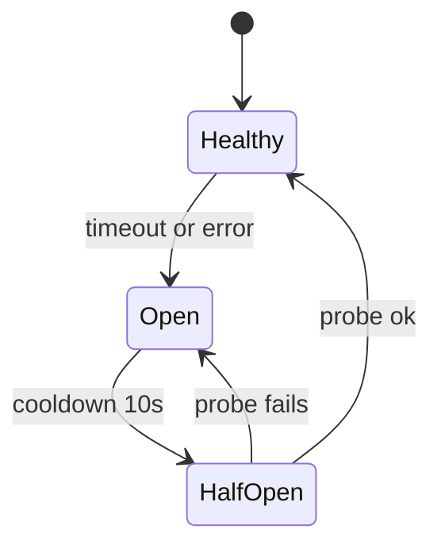

# Lecture 16: Serving a Retrieval Service — Tracing, Caching, and Fallback

> Everything up to now — the model choice, the tuned HNSW index, the hybrid fusion, the filters — is a *pipeline*. A pipeline is a thing you run in a notebook. A **service** is a thing that answers a `POST /search` at 3 a.m. while the vector DB is being restarted, one tenant is hammering it with 40 concurrent requests, and a product manager is watching the p99 graph. This lecture is about the last, unglamorous mile: wrapping the pipeline in an async FastAPI endpoint that returns *structured, self-describing* JSON (results **plus** per-stage timings), instrumenting it so a slow query is attributable to the exact stage that was slow, caching so you don't re-embed or re-search identical work, and — the part that keeps you off the incident channel — degrading to keyword search instead of throwing a 500 when the vector DB falls over. After this you'll be able to build the Week-3 lab service and the milestone Part-B service, and reason about its latency, cost, and failure behavior the way an SRE would.

**Prerequisites:** Python async/await and `asyncio` basics, hybrid search + RRF + reranking (Lecture 13), metadata filtering (Lecture 12), the embedding cache from Week 1 (Lecture 5), what a percentile is · **Reading time:** ~30 min · **Part of:** Phase 3 — Embeddings Infrastructure & Vector Databases, Week 3

---

## The core idea (plain language)

A retrieval request flows through three stages: **embed** the query → **search** the vector DB (usually hybrid: dense + BM25) → **rerank** the top candidates. Each stage is an external or expensive call. Turning this into a production service means answering four questions that never come up in a notebook:

1. **What do you return?** Not just a list of hits. Return `{results:[{id,text,score,source}], timing_ms:{embed,search,rerank}}` — the per-stage timings are *first-class response data*, not log spew. A caller (or you, debugging) can see instantly whether a 300 ms request spent it embedding or searching.
2. **How do you know where time went?** Wrap each stage in an **OpenTelemetry span**. A slow query then shows up as a slow *span*, so "the p99 is bad" becomes "the p99 is bad *because rerank spikes*" — attributable, not vague.
3. **How do you avoid redundant work?** Two cache layers. The **embedding cache** (Week 1) skips re-embedding identical query text. A **semantic query cache** skips the whole search+rerank for a query that's *near-identical* in meaning to a recent one — with correct invalidation when the underlying data changes.
4. **What happens when a dependency dies?** The vector DB will time out or crash. Instead of a 500, the service **falls back to lexical (BM25-only) search** — degraded, but a keyword answer beats an error page. You prove it by killing the DB container mid-request and watching results still come back.

The through-line: a service is defined less by its happy path than by its *timing visibility* and its *failure behavior*. The pipeline was about being right; the service is about being right, fast, cheap, and *honest about degradation* under load and partial failure.

---

## How it actually works (mechanism, from first principles)

### The response contract: timings as data

Start with the shape, because it disciplines everything else:

```json
{
  "results": [
    {"id": "doc_412#3", "text": "…", "score": 0.83, "source": "hybrid"},
    {"id": "doc_88#0",  "text": "…", "score": 0.79, "source": "hybrid"}
  ],
  "timing_ms": {"embed": 12.4, "search": 47.1, "rerank": 88.3},
  "degraded": false
}
```

Two design decisions worth defending. First, **`score` and `source` per result**: `source` tells you whether this hit came from dense, BM25, hybrid fusion, or the lexical fallback — invaluable when a result "looks wrong." Second, **`timing_ms` broken out by stage**: the total request time is `embed + search + rerank + overhead`, and only the breakdown tells you which knob to turn. If `search` is 47 ms and `rerank` is 88 ms, your reranker — not your index — is the bottleneck, and no amount of `efSearch` tuning helps.

You measure each stage with a monotonic clock, never wall-clock (wall-clock can jump backward on NTP sync):

```python
import time

async def search_endpoint(req):
    t = {}
    t0 = time.perf_counter()
    qvec = await embed(req.query)                       # stage 1
    t["embed"] = (time.perf_counter() - t0) * 1000

    t0 = time.perf_counter()
    hits = await hybrid_search(qvec, req.query, req.filters)   # stage 2
    t["search"] = (time.perf_counter() - t0) * 1000

    t0 = time.perf_counter()
    ranked = await rerank(req.query, hits)              # stage 3
    t["rerank"] = (time.perf_counter() - t0) * 1000

    return {"results": ranked[:req.k], "timing_ms": t, "degraded": False}
```

### Async, bounded concurrency, and timeouts on *every* external call

FastAPI is async; your handler must not block the event loop. Three rules:

- **Await real async I/O.** The embedding server call and the DB call go over the network — use an async client (`httpx.AsyncClient`, `qdrant-client`'s async API). A synchronous, blocking call inside an `async def` handler *stalls the entire event loop* — every other in-flight request freezes. This is the #1 async-FastAPI footgun.
- **CPU-bound work goes to a thread/process pool.** A cross-encoder reranker on CPU is *compute*, not I/O — awaiting it does nothing. Run it via `asyncio.to_thread(...)` (or a `ProcessPoolExecutor` for heavy models) so it doesn't block the loop.
- **Bound concurrency and set a timeout on everything.** An unbounded fan-out to the embedding server under a traffic spike will open 500 connections and tip it over. Wrap external calls in a `Semaphore` and an `asyncio.timeout`:

```python
DB_SEM = asyncio.Semaphore(32)      # never more than 32 concurrent DB calls

async def vector_search(qvec, flt):
    async with DB_SEM:
        async with asyncio.timeout(0.25):     # 250 ms budget for the DB
            return await client.query_points(...)
```

A timeout is not optional decoration — it's the *trigger* for your fallback. Without it, a hung DB connection makes the request hang until the client gives up, holding a worker slot the whole time. **Every external call needs a deadline.**

### Observability: OpenTelemetry spans per stage

A **span** is a timed, named unit of work with a parent; a **trace** is the tree of spans for one request. You already have per-stage timings in the response — spans give you the *distributed*, aggregatable version, plus attributes (tenant, k, cache-hit) you can slice on:

```python
from opentelemetry import trace
tracer = trace.get_tracer("retrieval")

with tracer.start_as_current_span("search_request") as root:
    root.set_attribute("tenant_id", req.tenant_id)
    with tracer.start_as_current_span("embed"):
        qvec = await embed(req.query)
    with tracer.start_as_current_span("search") as s:
        s.set_attribute("degraded", degraded)
        hits = await hybrid_search(qvec, req.query, req.filters)
    with tracer.start_as_current_span("rerank"):
        ranked = await rerank(req.query, hits)
```

The `opentelemetry-instrumentation-fastapi` package auto-creates the root span per request; you add the child spans. Export to an OTLP collector → Jaeger/Tempo/Grafana, and a slow request becomes a *waterfall* you can read at a glance.

**Percentiles, not averages.** Log each stage's latency and compute p50/p95/p99 per stage. The mean lies: if 99 requests take 20 ms and one takes 2000 ms, the mean is ~40 ms (looks fine) but the p99 is 2000 ms (a user waited 2 seconds). Users feel the tail. A worked percentile example is below. Compute percentiles over a rolling window (histogram buckets in Prometheus, or a `numpy.percentile` over a recent deque), *per stage* so you can see which stage owns the tail.

### Caching layer 1: the embedding cache (exact key)

From Week 1: hash the **normalized** query text and cache the vector. Key = `f"{model}:{version}:{sha256(normalize(text))}"`. `version` matters because a model upgrade must miss the old cache — same text, different vectors. This is an *exact-match* cache: it only helps repeated identical queries, but query traffic is Zipfian (a few queries are asked constantly), so hit rates of 30–60% are common. *(approximate)*

### Caching layer 2: the semantic query cache (near-match key) + invalidation

Here's the subtle one. Two users ask "how do I reset my password?" and "password reset steps?" — different strings (embedding cache misses), same *intent*. A **semantic cache** stores recent (query-vector → results) pairs and, for a new query, checks whether any cached query vector is within a cosine threshold; if so, it returns the cached results and skips search+rerank entirely.

```
new query "reset my pw"
   embed → qvec
   nearest cached query vector cos-sim = 0.94   (threshold τ = 0.92)
   0.94 ≥ 0.92 → CACHE HIT → return cached results (skip search + rerank)
```

The mechanism *is itself a tiny vector search* over cached query vectors. Two hard parts:

1. **Threshold calibration.** Too low (τ=0.80) and you serve "password reset" results for "delete my account" — a **correctness bug that looks like a relevance bug**. Too high (τ=0.99) and you almost never hit. Calibrate τ on real query pairs, and lean conservative: a wrong cached answer is worse than a cache miss.
2. **Invalidation on upsert/delete.** This is where semantic caches quietly rot. When a document is added, changed, or deleted, any cached result set that *could* have included it is now stale. The safe, boring default: **invalidate the entire semantic cache on any upsert/delete.** For low-churn corpora that's fine. If writes are frequent, you need finer invalidation (e.g. per-tenant cache namespaces so tenant A's write only busts tenant A's cache, or a short TTL of 60–300 s that bounds staleness). *(approximate)* Never cache without an invalidation story — a semantic cache with no invalidation will confidently serve results for deleted documents, and *that* is a compliance incident, not a perf regression.

### Resilience: the lexical (BM25) fallback

The vector DB *will* be unavailable — restart, OOM, network blip, timeout under load. The choice is: return a 500, or return a **degraded** answer. BM25 runs in-process over the same chunks (you already built it for hybrid search), depends on *nothing external*, and answers keyword queries decently. So when the DB call raises or times out, catch it and route to BM25:

```python
async def search_stage(qvec, query, flt):
    try:
        async with asyncio.timeout(0.25):
            hits = await vector_search(qvec, flt)
        return hits, "hybrid", False          # source, degraded
    except (asyncio.TimeoutError, ConnectionError, DBError):
        span.set_attribute("degraded", True)
        LOG.warning("vector DB unavailable — lexical fallback")
        return bm25_search(query, flt), "lexical", True
```

Set `degraded: true` in the response and `source: "lexical"` on the hits so the caller *knows* it got a degraded answer — silent degradation is its own trap (a demo "works," nobody notices dense search has been dead for a week). Pair the fallback with a **circuit breaker**: after N consecutive DB failures, stop trying the DB for a cooldown window and serve lexical directly — this stops every request from paying the full 250 ms timeout while the DB is down, which would otherwise turn a DB outage into a latency outage across the whole service.



Healthy: every request tries the DB. Open: every request skips the DB and serves lexical instantly. Half-open: send one probe request to test recovery.

---

## Worked example

Let's trace one query and one outage.

**A normal request.** Query `"how to rotate API keys"`, k=5, tenant 42.

- Embedding cache: miss (novel query). Call embedding server → **12 ms**. Store vector.
- Hybrid search: dense (Qdrant, filtered `tenant_id=42`) ∥ BM25, fuse with RRF. Both run concurrently under the semaphore; the stage takes `max(dense=41, bm25=6) + fuse=1 ≈ 47 ms` — *because they run in parallel, not 41+6*. This is why async matters: sequential would be 48 ms, parallel is 42; the gap widens with more retrievers.
- Rerank: cross-encoder over top-50 on CPU via `to_thread` → **88 ms**.
- Response: `timing_ms: {embed: 12, search: 47, rerank: 88}`, total ≈ **150 ms**, `degraded: false`. Verdict: rerank owns 59% of the latency — if the SLO is p95 ≤ 120 ms, rerank fewer candidates (top-20 not top-50) or rerank on GPU.

**The same query 30 seconds later, reworded** `"rotating my api keys"`. Embedding cache misses (different string). Semantic cache: embed → cos-sim to the cached `"how to rotate API keys"` vector = 0.95 ≥ τ=0.92 → **HIT**. Return cached results. `timing_ms: {embed: 11, search: 0, rerank: 0}`, total ≈ **11 ms**. Saved 139 ms and one reranker invocation.

**The outage.** Mid-request, someone runs `docker kill qdrant`. Next request:

- Embed: 12 ms (embedding server is separate, still up).
- Search stage: `vector_search` connection refused → after 0 ms (connection error, not even a timeout) the `except` fires → `bm25_search("how to rotate API keys")` → **7 ms**, `source: "lexical"`, `degraded: true`.
- Rerank: still runs over the BM25 hits → 40 ms (fewer candidates).
- Response: **200 OK**, `degraded: true`, `timing_ms: {embed: 12, search: 7, rerank: 40}`. The user gets keyword results, no 500. The circuit breaker opens; the next requests skip the DB entirely (no 250 ms timeout tax) until it recovers.

**Percentiles worked out.** Suppose over a window you collect these 10 `search` latencies (ms), sorted: `40, 42, 43, 45, 47, 48, 50, 52, 60, 220`. 

- **p50** = value at 50th percentile ≈ the 5th–6th value ≈ **47–48 ms**.
- **p95** ≈ the 9.5th value ≈ **~60 ms** (between 60 and 220 depending on interpolation).
- **p99** ≈ dominated by that **220 ms** outlier.
- The **mean** is `(40+42+43+45+47+48+50+52+60+220)/10 = 64.7 ms` — *higher than the p90*, dragged up by one tail request, and it hides both the healthy median and the true tail. Report p50/p95/p99; treat the mean as noise.

**QPS and the SLO.** Suppose the SLO is "p95 end-to-end ≤ 200 ms at 32 concurrent clients." Load test with `hey`:

```
hey -z 30s -c 32 -m POST -H 'Content-Type: application/json' \
    -d '{"query":"how to rotate api keys","k":5,"tenant_id":42}' \
    http://localhost:8000/search
```

Say it reports `QPS ≈ 210`, `p50=120 ms`, `p95=185 ms`, `p99=340 ms`. Verdict: **p95 meets the SLO (185 ≤ 200)**, but p99 is 340 — one in a hundred users waits a third of a second, driven (per your spans) by reranker queueing when 32 requests all hit the CPU pool at once. Fix: cap reranker concurrency, or scale the rerank workers. This is the whole methodology: pick a concurrency, measure p50/p95/p99 and QPS, attribute the tail to a stage via spans, fix that stage, repeat.

---

## How it shows up in production

- **The "it's slow" ticket with no stage breakdown.** Without per-stage timings you burn an afternoon guessing. With `timing_ms` in the response and spans in Jaeger, "slow" resolves to "rerank p99 spikes at 32 concurrency" in five minutes. The timings-as-data contract *is* the debugging tool.
- **The blocking call that freezes everything.** One synchronous `requests.post` (instead of `httpx` async) inside the handler serializes the whole service — throughput collapses from 200 QPS to ~20 and nobody knows why. Audit every call in the hot path for accidental blocking; `to_thread` the CPU work.
- **The outage that becomes a latency outage.** DB goes down; without a circuit breaker, *every* request waits the full 250 ms timeout before falling back, so a DB blip turns into a service-wide p99 explosion even though results still return. The breaker turns a 250 ms-per-request tax into an instant lexical answer.
- **The semantic cache that serves stale/wrong answers.** τ set too aggressively returns adjacent-intent results (relevance complaints that are actually cache bugs); no invalidation returns results for deleted docs (a GDPR/compliance incident). Both are invisible until someone notices — monitor cache-hit rate *and* spot-check cached-vs-fresh agreement.
- **The load test that lied.** Testing at `-c 1` shows a lovely 40 ms p50 and everyone ships. At `-c 32` the reranker CPU pool saturates and p95 quadruples. Always load-test at your *real* concurrency, ramp it (8 → 32 → 64), and read percentiles, not the average the tool prints first.
- **Green dashboards, unhappy users.** Recall looks fine (measured offline), latency looks fine (measured as mean), yet users churn. `monitor.py` running the golden set against the *live* service catches all three axes — recall@5 drift, empty-result-rate creep, and true p95 — as one ongoing health signal.

---

## Common misconceptions & failure modes

- **"async makes everything faster."** No — async lets *concurrent I/O overlap*. A single request is not faster; you serve more requests per core because they wait on the network together. And one blocking call negates all of it.
- **"A timeout is just a safety net."** It's the *trigger* for graceful degradation. No timeout means no fallback ever fires — the request just hangs, holding a worker.
- **"The average latency is 40 ms, we're fine."** The mean is dominated by outliers and hides the tail users actually feel. Only p95/p99 tell you the truth.
- **"Semantic cache = embedding cache with fuzzy matching, ship it."** The fuzzy match introduces a *correctness* risk (wrong-intent hits) and a *staleness* risk (no invalidation) that the exact cache doesn't have. It needs threshold calibration and an invalidation story or it becomes a bug generator.
- **"Fallback means catching the exception and returning `[]`."** Empty results are a *worse* failure than a 500 in some ways — the user thinks there's no answer. Fallback means a *real, degraded* answer (BM25), flagged `degraded:true` so callers and monitors know.
- **"If the DB is down, just retry."** Retrying a dead DB multiplies load on a struggling dependency and stacks latency. Use a circuit breaker: fail fast to lexical, probe occasionally, recover.
- **"Per-stage timings are logging noise."** They're the single most useful field in the response for operating the service. Promote them to first-class data.
- **"Cache invalidation can be a TTL and we're done."** A TTL bounds staleness but doesn't make a delete *immediate* — if a doc must vanish now (GDPR, moderation), you need explicit invalidation on the write path, not just expiry.

---

## Rules of thumb / cheat sheet

- **Return per-stage timings as data**, not just logs: `timing_ms:{embed,search,rerank}` + `source` per hit + `degraded` flag.
- **Every external call gets a timeout and bounded concurrency** (semaphore). The timeout is what triggers the fallback. Typical budgets: embed 100 ms, DB search 200–250 ms, rerank 100–150 ms. *(approximate — set from your p99 + headroom.)*
- **Never block the event loop:** async clients for I/O, `to_thread`/process pool for CPU (the reranker).
- **Run dense and BM25 concurrently** (`asyncio.gather`); the stage costs `max`, not `sum`.
- **Measure p50/p95/p99 per stage, never the mean.** Users feel the tail; the tail usually lives in one stage (often rerank).
- **Two caches, two keys:** embedding cache keyed on `model:version:sha256(normalized_text)` (exact); semantic cache keyed on query-vector nearest-neighbor within threshold τ (calibrate τ ~0.9–0.95, lean conservative). *(approximate)*
- **Invalidate the semantic cache on every upsert/delete** (whole-cache or per-tenant namespace); add a short TTL (60–300 s) as a backstop. No invalidation = stale/deleted-doc answers. *(approximate)*
- **Lexical BM25 fallback + circuit breaker:** on DB error/timeout, serve BM25, set `degraded:true`; after N consecutive failures open the breaker and skip the DB for a cooldown.
- **Load-test at real concurrency (8 → 32 → 64), ramped**, record p50/p95/p99 and QPS, judge against the SLO, attribute the tail to a stage via spans.
- **`monitor.py` is the health signal:** golden-set recall@5 + empty-result-rate + live p50/p95 latency, run continuously — the three axes together.

---

## Connect to the lab

This lecture is the theory behind **Week 3, Lab step 6 (the FastAPI service)** and the milestone **Part B**. In the lab you'll build async `POST /search` returning `{results, timing_ms}`, wrap embed/search/rerank in OpenTelemetry spans, add the semantic query cache on top of Week 1's embedding cache, and — the DoD line that matters most — prove the **lexical fallback** by running `docker kill` on the Qdrant container mid-request and watching results still come back (no 5xx, `degraded:true`). Then run `locust`/`hey` at concurrency 8/32, record p50/p95/p99 + QPS, and check it against your latency SLO. Finally wire `monitor.py` to hit the *live* service and report recall@5 + empty-result-rate + latency as the ongoing health signal.

---

## Going deeper (optional)

- **FastAPI docs — concurrency and `async def`** — the canonical explanation of when to use `async def` vs `def` and how the threadpool works. Root: `fastapi.tiangolo.com` (search: *"FastAPI async await concurrency and async / await"*).
- **OpenTelemetry Python docs** — spans, traces, the OTLP exporter, and the FastAPI instrumentation. Root: `opentelemetry.io` (search: *"OpenTelemetry Python manual instrumentation spans FastAPI"*).
- **Qdrant async client + `query_points`** — the async API and search params under filters. Root: `qdrant.tech` (search: *"Qdrant python client async query_points"*).
- **"The Tail at Scale" (Dean & Barroso, CACM 2013)** — the canonical paper on why p99 tail latency dominates user experience in fan-out services; read it once and you'll never report a mean again. Search: *"Dean Barroso The Tail at Scale"*.
- **Release It! (Michael Nygard)** — the book that popularized circuit breakers, bulkheads, and timeouts as stability patterns. Search: *"Release It Nygard circuit breaker bulkhead"*.
- **Locust docs / `hey` README** — load-testing methodology, ramping users, reading percentiles. Roots: `locust.io`, `github.com/rakyll/hey`.
- **httpx async client** — connection pooling, timeouts, limits for the embedding-server calls. Root: `python-httpx.org` (search: *"httpx AsyncClient timeouts limits"*).

---

## Check yourself

1. Your `/search` returns `timing_ms: {embed: 10, search: 45, rerank: 190}` and total is ~250 ms against a 200 ms SLO. Which stage do you attack, and name two concrete fixes that don't touch the vector index.
2. Why does a single synchronous, blocking HTTP call inside an `async def` handler hurt *every* concurrent request, not just its own?
3. A teammate sets the semantic-cache threshold to τ=0.82 to "get more cache hits." What failure does this introduce, and why is it worse than a low hit rate?
4. The vector DB goes down. Explain why a lexical fallback *without* a circuit breaker can still cause a service-wide latency incident, and what the breaker changes.
5. You measured mean latency = 55 ms and declared the SLO (p95 ≤ 120 ms) met. Why is that reasoning invalid, and what could the real p95 be?
6. A document is deleted for GDPR compliance. List every place its content could still surface, and how you make the deletion effective everywhere.

### Answer key

1. **Attack rerank** (190 ms is 76% of the budget). Fixes that don't touch the index: (a) rerank fewer candidates — top-20 instead of top-50 cuts cross-encoder work roughly linearly; (b) move the reranker to GPU or a batched inference server (TEI), or run it via a bounded process pool so it isn't CPU-starved under concurrency; (c) as a last resort, drop reranking for low-value queries or cache reranked results. Tuning `efSearch`/`nprobe` would be attacking the wrong (search) stage.

2. FastAPI runs `async def` handlers on a single-threaded event loop. A synchronous blocking call doesn't yield control back to the loop while it waits, so the loop *cannot* advance any other in-flight coroutine — all concurrent requests freeze until the blocking call returns. Async I/O works only if every wait yields; one blocking call serializes the whole service.

3. It introduces a **correctness bug disguised as a relevance bug**: at τ=0.82 the cache will match queries of *different intent* (e.g. "reset password" vs "delete account") and serve the wrong cached results. That's worse than a low hit rate because a cache *miss* just costs latency (you compute the right answer), while a wrong *hit* returns confidently incorrect results that are hard to attribute — users report "bad relevance," not "bad cache."

4. Without a breaker, every request still *tries* the DB and waits the full timeout (e.g. 250 ms) before falling back — so a DB outage turns into a service-wide +250 ms latency tax on every request, blowing p95/p99 even though results (BM25) still return. The circuit breaker, after N consecutive failures, **opens** and makes requests skip the DB entirely and serve lexical instantly (no timeout wait), then periodically half-opens to probe for recovery — converting a latency outage back into a fast, degraded service.

5. The **mean hides the tail**: it's dominated by the bulk of fast requests and pulled by outliers, so a 55 ms mean is fully consistent with a p95 of, say, 300 ms if a slow minority exists (as in the worked example where mean 64.7 ms sat above the p90). You must measure the p95 directly (percentile over the latency distribution), not infer it from the mean; the real p95 could easily exceed the 120 ms SLO.

6. It could still surface in: (a) the **vector DB** (the point itself — delete it, and beware soft-delete/tombstones that match until compaction); (b) the **BM25/lexical index** used for hybrid and fallback (rebuild/remove the doc); (c) the **embedding cache** if keyed on that text; (d) the **semantic query cache**, whose cached result sets may still contain the doc — invalidate it (whole-cache, or the relevant tenant namespace); (e) any **reranker or upstream cache** holding the text. Make deletion effective by routing all deletes through one choke-point that purges the DB, both indexes, and busts the caches — not just the vector store.
