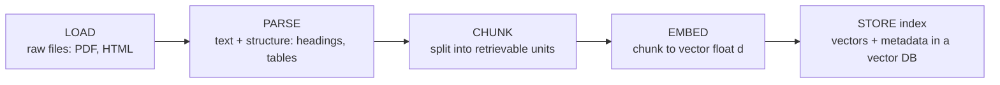
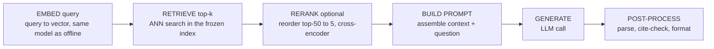

# Lecture 1: The Two RAG Pipelines and the 7 Failure Points

> Almost every RAG system that "doesn't work" is broken in a place the engineer isn't looking. They tweak the generation prompt for a week while the actual bug lives in a batch job that ran last Tuesday and won't run again until someone triggers a reindex. This lecture gives you the one mental model that prevents that entire class of wasted effort: RAG is *two* pipelines, not one, and they have completely different physics. After this lecture you'll be able to draw both data flows from memory, name which stage any symptom lives in, and use the Barnett et al. seven-failure-point taxonomy as a standing debugging checklist so that every future RAG bug starts with the question "which of the 7 is this?" instead of a guess.

**Prerequisites:** Embeddings and vector similarity (cosine/IP), top-k nearest-neighbor search, basic LLM prompting. · **Reading time:** ~22 min · **Part of:** Retrieval-Augmented Generation, Week 1

## The core idea (plain language)

A RAG system looks like one thing to the user — you ask a question, it answers using your documents — but it is built from **two pipelines that run at completely different times, under completely different constraints, and fail in completely different ways.**

1. **The offline / indexing pipeline** runs *ahead of time*, in batch. It takes your documents and turns them into a searchable index: `load → parse → chunk → embed → store`. Nobody is waiting on it. It can take minutes or hours. Its output is a frozen artifact — a vector index — that sits on disk until a query arrives.

2. **The online / query pipeline** runs *when a user asks something*, on the critical path, with a human (or an SLA) watching the clock: `embed query → retrieve top-k → (optional rerank) → build prompt → generate → post-process`. Every millisecond here is user-facing latency.

The single most important consequence, the thing this entire lecture exists to burn into your head, is this:

> **Anything embedded wrong offline is permanently wrong online. The online pipeline can only ever retrieve from what the offline pipeline already froze into the index. Retrieval bugs are NOT fixable by prompt edits — the only fix is reindexing, and reindexing is slow and costly.**

If your chunker split a table in half at index time, no amount of clever prompting at query time can un-split it. The information the user needs was destroyed before the query ever arrived. This is why RAG debugging demands you locate the *stage* first — and why the industry has a shared vocabulary for those stages: the **seven failure points**. Points 1–3 are retrieval/indexing failures (this week's target). Points 4–7 are generation failures (later weeks). Every bug you will ever hit maps to one of these seven, and knowing which one tells you which pipeline — and which time — the fix lives in.

## How it actually works (mechanism, from first principles)

### Pipeline A: offline / indexing (latency-insensitive batch)



*OFFLINE — runs ahead of time, in batch, nobody waiting.*

Walk each stage and notice what it *decides* — because whatever it decides is frozen:

- **Load** — pull bytes from source (a PDF, an HTML export, a Confluence dump). Failure here = a document simply isn't in the corpus. That's failure point #1, and no downstream stage can recover it.
- **Parse** — turn a *drawing format* (a PDF is positioned glyphs, not a document) into structured text. If the parser flattens a table into "3.2 4.1 9.8 0.7" with no row/column association, that structure is gone forever downstream.
- **Chunk** — split the parsed text into retrievable units. This decides *what can be retrieved together*. Two facts that must be retrieved together to answer a question, but which land in different chunks that don't co-retrieve, produce an "incomplete" answer (#7) that looks like a generation bug but was born here.
- **Embed** — map each chunk to a vector (say 384 or 768 floats). The embedding model, its version, and the exact chunk text are all baked into every stored vector.
- **Store** — write vectors + metadata into the index (FAISS, Qdrant, pgvector). This is the artifact the online pipeline reads.

The engineering physics of the offline pipeline: **latency-insensitive, throughput-bound, expensive to redo.** You can spend 40 minutes parsing a 200-page manual and nobody cares. But the flip side is brutal — **to change any decision made here, you must re-run the whole thing.** Changed your chunk size? Reindex. Upgraded your embedding model? Reindex (old and new vectors aren't comparable; a 768-dim `text-embedding-3` vector and a 384-dim `bge-small` vector don't even live in the same space). Fixed the parser so tables survive? Reindex.

### Pipeline B: online / query (latency-critical path)



*ONLINE — runs per query, on the critical path, clock ticking.*

- **Embed query** — the query is embedded *with the same model the offline pipeline used.* If they differ, query vectors and chunk vectors are in incomparable spaces and retrieval is garbage. This is the one online stage tightly coupled to an offline decision.
- **Retrieve top-k** — approximate nearest-neighbor (ANN) search returns the k chunks whose vectors are closest to the query vector. The *right* chunk must both **exist in the index** and **rank inside top-k** to survive.
- **(Optional) rerank** — a cross-encoder rescores the top-k candidates (e.g. retrieve 50, rerank, keep 5). More accurate, slower. A reranker can only reorder what retrieval already returned — it cannot conjure a chunk that wasn't in the top-k.
- **Build prompt** — assemble the surviving chunks + the question into a prompt, subject to the model's context window. Chunks retrieved but dropped here (window overflow, dedup, truncation) are failure point #3.
- **Generate** — the LLM produces an answer from the assembled context.
- **Post-process** — parse citations, enforce output format, verify groundedness.

The physics here is the mirror image: **latency-critical, fixable at query time.** Most of this pipeline you *can* iterate on live — change the prompt, bump k from 5 to 10, add a reranker, reorder chunks — and see the effect on the next request. That immediacy is exactly the trap: because online changes are cheap and fast, engineers reach for them *even when the bug is offline*, where changes are slow and costly.

### The asymmetry, made concrete with arithmetic

Say you have a 200-page manual → ~2,000 chunks. Reindexing means re-embedding all 2,000 chunks.

- On a local CPU model like `bge-small`, that's maybe 2–5 minutes. Annoying, not fatal.
- With a hosted embedding API at, say, ~$0.02 per 1M tokens and ~200 tokens/chunk, that's 2,000 × 200 = 400K tokens ≈ $0.008 for this doc. Trivial for one manual.
- Now scale to a real corpus: **10 million chunks.** Re-embedding is 10M × 200 = 2B tokens ≈ **$40** and, at a few thousand embeddings/sec, **hours** of wall-clock, plus rebuilding the ANN index, plus a deploy. Do that because you *guessed* the bug was in chunking and you were wrong, and you've burned an afternoon and real money to learn nothing.

Compare: editing the generation prompt and re-running one query costs one LLM call (~$0.001–0.01) and ~2 seconds. **The cost asymmetry is 3–5 orders of magnitude.** That asymmetry is precisely why misdiagnosis is so expensive in the *cheap* direction: it's tempting to keep poking the cheap online knob because each poke is cheap — but if the bug is offline, you can poke forever and never fix it.

## Worked example

Let's trace one query through both pipelines and one misdiagnosis end to end.

**Corpus:** a network-appliance manual. Page 88 contains a table:

| Call        | Default timeout |
|-------------|-----------------|
| `connect()` | 30 seconds      |
| `read()`    | 60 seconds      |

**Offline, months ago:** the parser used was plain PyMuPDF text extraction. It flattened the table into a linear string:

```
Call Default timeout connect() 30 seconds read() 60 seconds
```

The chunker (fixed 800-char) then cut this region such that one chunk ended `... Call Default timeout connect() 30` and the next began `seconds read() 60 seconds ...`. Both chunks were embedded and stored. **The association between `connect()` and `30 seconds` was destroyed at parse time and then split across a chunk boundary at chunk time.** Nobody noticed; the index looked fine.

**Online, today:** user asks *"What is the default timeout for the connect() call?"*

1. Query embeds fine.
2. Retrieval top-5 returns... the chunk ending in `connect() 30` and, separately, the chunk starting `seconds read() 60`. The number `30` is technically present but stranded from its unit and, worse, sitting next to `read() 60` in a neighboring chunk.
3. The LLM sees fragmented context: `connect() 30` in one place, `60 seconds` prominently attached to `read()` in another.
4. **Generated answer:** "The default timeout for `connect()` is 60 seconds." Confidently wrong.

**The misdiagnosis (the expensive mistake):** The engineer sees a wrong answer and reaches for the *generation prompt*, because that's the cheap, fast, online knob. They try:

- "Answer *only* from the provided context." → still wrong; the wrong number *is* in the context.
- "Think step by step about which call maps to which timeout." → still wrong; the mapping was destroyed at parse time, there's nothing to reason over.
- "Be careful with tables." → still wrong; there's no table in the context, only flattened tokens.

Three prompt iterations, an afternoon gone, and the answer is still wrong — **because the bug is offline and no online change can reach it.** The information the model needs (that `connect()` pairs with `30 seconds`) does not exist in any retrieved chunk. It was annihilated in the parse+chunk stages of a batch job.

**The correct diagnosis:** ask "which of the 7 is this?" Inspect the *actual retrieved chunks* (not the answer). You see `connect() 30` split from its unit and mingled with `read() 60`. That's not the LLM failing to extract (#4) — the correct pairing isn't in context at all. It's a **retrieval/indexing failure**: bad parsing → bad chunking → the co-located fact never survived. The fix is offline: switch to a layout-aware parser (Docling) that keeps the table as a Markdown pipe-table inside a single chunk, then **reindex.** Now the chunk contains:

```
| Call | Default timeout |
| connect() | 30 seconds |
| read() | 60 seconds |
```

and the model answers correctly. The fix took a parser swap and a reindex — but you only knew to do that because you looked at the retrieved chunks and located the failure in the offline pipeline instead of hammering the prompt.

## How it shows up in production

- **The "prompt engineering death spiral."** A wrong answer lands. Prompt edits are the cheapest, fastest lever, so the team burns days there. Meanwhile recall@k in isolation would have shown the right chunk never made it to the model. The tell: *if you paste the ideal chunk into the prompt by hand and the model answers correctly, your bug is retrieval, not generation.* This one test short-circuits the spiral.
- **Reindexing is a deploy, not a config change.** Because offline output is a frozen artifact, "just re-chunk" means re-running a batch job over the whole corpus, rebuilding the index, and swapping it in — with all the cost, time, and blast radius of a deploy. Teams that treat it as a quick tweak get surprised by hours-long jobs and API bills. Budget for reindex cost when you choose an embedding model, because *changing the model later means reindexing everything.*
- **Embedding-model version skew is a silent killer.** If your offline pipeline embedded with model vX and someone upgrades the online query embedder to vY, query and chunk vectors are in different spaces. Retrieval quietly returns near-random chunks. There is no error — just quality collapse. Pin the embedding model+version and store it in the index metadata.
- **Latency budgets live entirely in the online pipeline.** Your p95 is `embed_query + ANN_search + rerank + generate + post-process`. The offline pipeline contributes *zero* to per-query latency but *all* of your retrieval ceiling. This is why you optimize them separately: throughput/cost offline, latency online.
- **The taxonomy is your on-call runbook.** When a RAG answer is bad at 2 a.m., "which of the 7 is this?" routes you in one step: is the fact even in the corpus (#1)? retrieved but ranked too low (#2)? retrieved but dropped assembling the prompt (#3)? Those three send you offline/retrieval. #4–7 send you to generation. You stop guessing and start bisecting.

## Common misconceptions & failure modes

The seven failure points, from Barnett et al. 2024, *"Seven Failure Points When Engineering a Retrieval Augmented Generation System"* (search that exact title). Map each to a pipeline stage — that mapping is the whole point.

| # | Failure point | What it means | Pipeline stage | Retrieval or Generation? |
|---|---|---|---|---|
| 1 | **Missing content** | The answer isn't in the corpus at all | Offline: load/parse (never ingested) | **Retrieval / indexing** (Week 1) |
| 2 | **Missed top-k** | Right chunk exists but ranks below k | Online: retrieve (also offline chunk/embed quality) | **Retrieval / indexing** (Week 1) |
| 3 | **Not in context / consolidation** | Retrieved but dropped assembling the prompt (window, dedup, rerank cut) | Online: build-prompt | **Retrieval / indexing** (Week 1) |
| 4 | **Not extracted** | Context has the answer but the LLM misses it (noise/distraction) | Online: generate | Generation (Weeks 2–4) |
| 5 | **Wrong format** | Asked for a table/JSON, got prose | Online: generate/post-process | Generation (Weeks 2–4) |
| 6 | **Incorrect specificity** | Too vague or too narrow vs. the question | Online: generate | Generation (Weeks 2–4) |
| 7 | **Incomplete** | Partial answer; needed facts spread across chunks that didn't co-retrieve | Straddles: chunk (offline) + generate (online) | Mostly retrieval-rooted |

Misconceptions to kill:

- **"A wrong answer means a bad model/prompt."** Usually false. In most broken RAG systems the *retrieval* is the ceiling — the model never got the right context. Fix retrieval first; generation quality is *capped* by retrieval quality.
- **"More context = better."** No. Stuffing k=50 chunks in causes #4 (the answer drowns in noise) and #3 (overflow drops your best chunk). Precision matters, not just recall.
- **"I can fix retrieval with a better prompt."** The central lie this lecture destroys. If the right chunk isn't retrieved, the prompt is operating on the wrong data. Reindex or re-retrieve — don't reword.
- **"#7 (incomplete) is a generation bug."** Often it's *rooted offline*: two facts landed in chunks that never co-retrieve because a chunk boundary or a too-small chunk split them. The generation stage is just where the symptom surfaces. Overlap and parent-document chunking are offline fixes for it.
- **"Reindexing is a quick config change."** It's a batch job + index rebuild + deploy, minutes-to-hours and real money at scale. Treat it as such.

## Rules of thumb / cheat sheet

- **Two pipelines, two clocks.** Offline = batch, latency-insensitive, throughput/cost-bound, *frozen once written.* Online = per-query, latency-critical, *iterable live.*
- **The law:** anything embedded wrong offline is permanently wrong online. **Reindex is the only fix for retrieval bugs; prompts can't reach them.**
- **First debugging question, always:** *"Which of the 7 is this?"* #1–3 → retrieval/indexing (offline-rooted). #4–7 → generation.
- **The one test that ends the death spiral:** hand-paste the ideal chunk into the prompt. If the model now answers right → your bug is **retrieval** (#1–3). If still wrong → **generation** (#4–7).
- **Debug the retrieved chunks, not just the answer.** Print top-k *before* generation. Half of RAG bugs are visible there.
- **Pin the embedding model+version** in index metadata. Same model on both sides, always.
- **Measure retrieval in isolation** (recall@k, MRR) *before* wiring an LLM — a combined "accuracy" number can't localize the failure.
- **Cost intuition (approximate):** re-embedding scales as `chunks × tokens_per_chunk × price_per_token`. One prompt edit ≈ one cheap LLM call. The gap between them is why misdiagnosis is expensive.
- **#7 smells like generation but is usually chunking.** Reach for overlap / parent-document before you touch the prompt.

## Connect to the lab

This week's lab builds the **offline pipeline** end to end (`load → parse → chunk → embed → store`) and measures **retrieval in isolation** — recall@k and MRR on a hand-authored golden set — with *no LLM generation at all*. That deliberate omission is this lecture made concrete: you're proving points #1–3 are handled before you let generation (#4–7) into the loop and muddy the signal. When you build the parser/chunker grid and watch recall@5 move, you're watching offline decisions set the ceiling the online pipeline can never exceed.

## Going deeper (optional)

- **Barnett et al. (2024), "Seven Failure Points When Engineering a Retrieval Augmented Generation System"** — the source of the taxonomy. Search that exact title (arXiv). Read it once, then keep the 7-point table as your runbook.
- **Anthropic, "Introducing Contextual Retrieval" (2024)** — search that title on `anthropic.com`. A concrete offline-stage technique (prepend an LLM-written locating sentence to each chunk before embedding) that directly attacks #2/#7.
- **LangChain docs — "Text splitters" and "ParentDocumentRetriever"** at `python.langchain.com`. The canonical offline chunking APIs.
- **LlamaIndex docs — "Node Parsers", "Sentence Window", "Auto Merging"** at `docs.llamaindex.ai`. Small-to-big and sentence-window strategies for #7.
- **Docling** — GitHub `docling-project/docling`. Layout-aware parsing that keeps tables as Markdown (the fix in this lecture's worked example).
- Search queries when you hit friction: "RAG retrieval vs generation failure localization", "recall@k MRR retrieval evaluation", "layout-aware PDF parsing tables markdown".

## Check yourself

1. A user gets a confidently wrong answer. You have 30 seconds to decide where to look first. What single test tells you whether the bug is retrieval (#1–3) or generation (#4–7), and why does it work?
2. Your teammate says, "recall@5 is fine, but answers are still wrong, so let's improve the chunker and reindex." Is reindexing the right move? What would you check first?
3. Why can't a query-time change (better prompt, bigger k, a reranker) ever fix a failure point #1 (missing content)? Trace it through both pipelines.
4. Failure point #7 (incomplete) shows up as a partial answer at generation time. Argue why its *root cause* is often in the offline pipeline, and name two offline fixes.
5. You upgrade your embedding model from a 384-dim to a 768-dim model on the online query path only, forgetting the index was built with the old one. Predict the symptom and name the failure point it will masquerade as.
6. Give an order-of-magnitude estimate: reindexing a 10M-chunk corpus (~200 tokens/chunk) via a hosted embedder at ~$0.02/1M tokens costs roughly how much, versus one prompt-edit-and-retry? What does that ratio imply about debugging strategy?

### Answer key

1. **Hand-paste the ideal chunk into the prompt and re-run.** If the model now answers correctly, the failure was that the model never *had* the right context → retrieval (#1–3). If it's still wrong with perfect context, the model can't use what it's given → generation (#4–7). It works because it isolates the two variables — context quality vs. reasoning — by holding context fixed at "ideal."
2. **Not yet.** If recall@5 is genuinely fine, the right chunk *is* reaching the model, so a reindex won't help — the bug is likely generation (#4 not-extracted, #6 specificity) or prompt assembly (#3). First check: inspect the actual retrieved chunks for that failing query and confirm the answer-bearing chunk is really present and intact. Reindexing (expensive, offline) before confirming the bug is offline is the exact misdiagnosis this lecture warns against.
3. Missing content means the fact was never loaded/parsed into the corpus, so **no vector representing it exists in the frozen index.** The online pipeline can only retrieve from what's in the index; a better prompt, a bigger k, or a reranker all operate *downstream* of retrieval and can only rearrange or reason over chunks that exist. You must go offline (ingest the missing document, re-parse, re-embed, reindex).
4. #7 arises when the facts needed for a complete answer live in different chunks that don't co-retrieve. That co-retrievability was decided offline at chunk time — boundaries, chunk size, overlap. The generation stage merely surfaces the symptom (it can only answer from what co-retrieved). Two offline fixes: add **chunk overlap** so straddling facts survive, and use **parent-document / sentence-window** chunking so retrieval is precise but the returned context is larger.
5. Query vectors (768-dim) and index vectors (384-dim) are in incompatible spaces — dimension mismatch will error outright, or if both were same-dim-but-different-model, ANN returns near-random chunks with **no error**. The symptom is a sudden, global collapse in answer quality. It will masquerade as **#2 (missed top-k)** — the right chunks exist but never rank near the top — sending you to debug retrieval ranking when the real cause is model version skew.
6. 10M × 200 = 2B tokens; 2B / 1M × $0.02 = **~$40** plus hours of wall-clock and an index rebuild. One prompt edit + retry ≈ one LLM call ≈ **~$0.001–0.01** and seconds. The ratio is roughly **3–5 orders of magnitude.** Implication: always *localize* the failure (which of the 7?) with cheap online tests before committing to an expensive offline reindex — and never keep poking the cheap online knob if you've confirmed the bug is offline, because cheap pokes on the wrong pipeline never converge.
