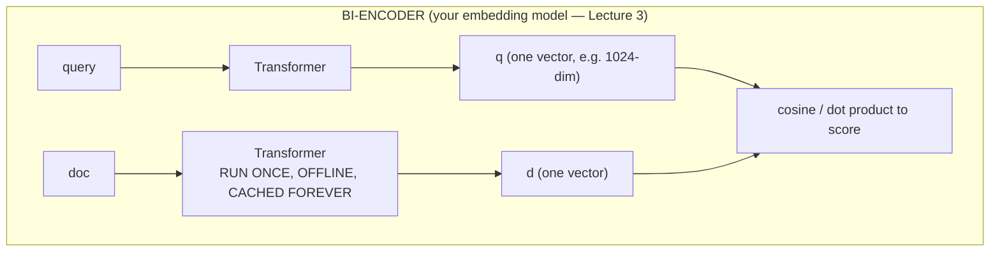
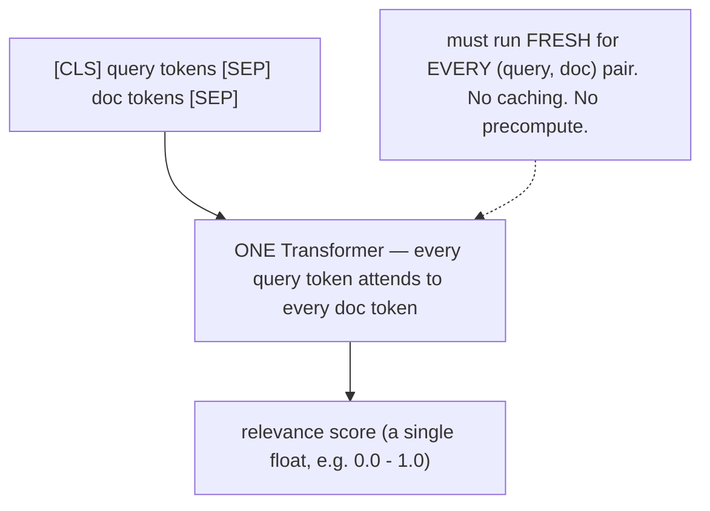
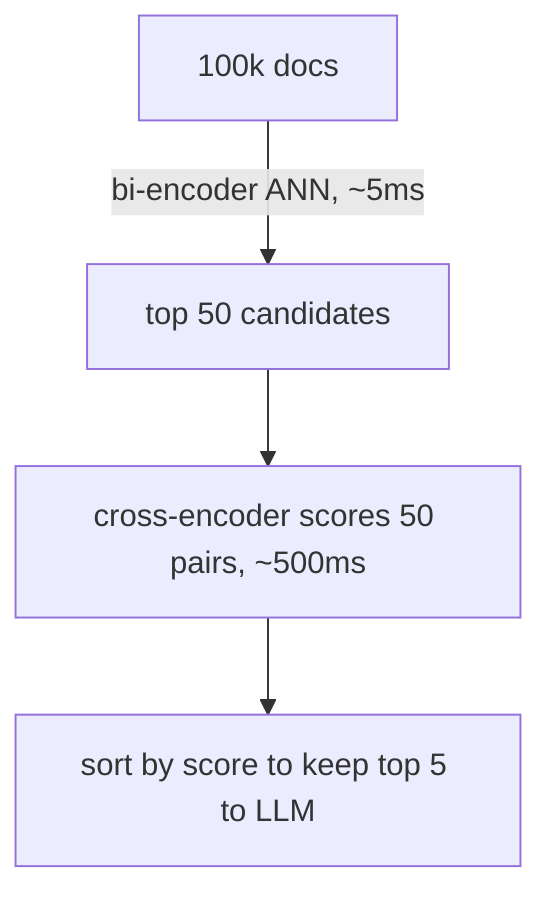

# Lecture 6: Cross-Encoder Reranking — The Highest-ROI Change

> You have a working hybrid retriever. It returns the right chunk... somewhere in the top-20, sometimes buried at rank 14 under four near-duplicates and a plausible-looking distractor. Your LLM only reads the top 5, so it never sees the good one. You could spend two weeks tuning chunk sizes and fusion weights for a couple of recall points — or you could bolt on a *reranker*, a second, smarter model that re-scores your top candidates by reading each one *against* the query, and pick up 10-20 nDCG points in an afternoon. This is, in most real RAG systems, the single highest-return change available to you. After this lecture you'll understand exactly why a cross-encoder is more accurate than your embedding model, why you can't just use it for everything, how to wire up both the free local default (`bge-reranker-v2-m3`) and the zero-ops API (Cohere Rerank 3.5), and the two constraints that decide whether reranking helps you at all or is a waste of latency.

**Prerequisites:** Embeddings and cosine/IP similarity, top-k ANN retrieval (Lecture 3), the two RAG pipelines (Lecture 1), basic transformer intuition (attention over a sequence). · **Reading time:** ~26 min · **Part of:** Retrieval-Augmented Generation, Week 2

## The core idea (plain language)

Your embedding model is a **bi-encoder**. When you index a document and later search, the query and the document are pushed through the transformer **separately**, each collapsed into a single fixed vector, and then compared with a cheap dot product. The word "separately" is the whole story: the model never sees the query and the document *at the same time*. It has to guess, at index time, "what might someone ask about this chunk?" and bake that guess into one vector — before any query exists. That is a lossy compression, and it is why your top-20 is often right-ish but not right.

A **cross-encoder** throws out that separation. You feed it the query and one document **glued together** as a single input — `[query] [SEP] [document]` — through one transformer, and it outputs **one number**: how relevant is this document to this query? Because every token of the query can attend to every token of the document (and vice versa) inside the model, it can notice things a bi-encoder structurally cannot: that "the *connect* timeout" in the query lines up with "`connect()` ... 30 seconds" in the doc and *not* with the "`read()` ... 60 seconds" sitting right next to it. It reads them together, like a human comparing two things side by side rather than describing each from memory.

The catch is symmetric and brutal: because scoring requires *both* the query and the document present, there is **nothing to precompute**. A bi-encoder embeds a million docs once, offline, and reuses those vectors for every query forever. A cross-encoder must run a full transformer forward pass for **every (query, document) pair, at query time, every time**. There is no cache. That is the entire trade: bi-encoders are fast and lossy; cross-encoders are slow and accurate.

So you use both, in a pipeline that plays each to its strength:

> **Stage 1 (retrieve, cheap):** your bi-encoder / hybrid retriever fetches the top ~50 candidates out of 100k docs. Fast, precomputed, a little sloppy.
> **Stage 2 (rerank, expensive):** a cross-encoder reads all 50 `[query, doc]` pairs, scores each, you sort and keep the top 5.

This is called **two-stage retrieval** (or retrieve-and-rerank), and it is the default architecture of every serious RAG system. The reranker only ever touches 50 documents, never the whole corpus, so its linear cost is bounded and affordable. And because it's far more accurate than the bi-encoder at *ordering* those 50, it reliably pulls the right chunk from rank 14 up into the top 5 where your LLM will actually read it. That reordering is where the +10-20 nDCG points come from.

## How it actually works (mechanism, from first principles)

### Bi-encoder: two towers, one dot product

Two independent passes ("two towers"). The doc side runs **once, at index time**, and the vector is stored. At query time you embed only the query (one pass) and compare it to millions of stored `d` vectors with a dot product — an operation so cheap that ANN indexes do millions of them per second. This is why retrieval over 100k docs takes single-digit milliseconds.

The price of that speed: **the two encodings never interact.** The document vector `d` was computed with zero knowledge of the query. All the richness of "which part of this chunk matters for this question" has to be pre-compressed into `d` at index time. A 400-token chunk about network timeouts becomes ~1024 floats that must simultaneously answer "what's the connect timeout?", "what's the read timeout?", "does it support IPv6?", and every other question anyone might ask. Details blur. Two chunks that differ only in the one token that matters to *your* query end up with nearly identical vectors. That's the lossiness, and no fusion or filtering downstream can un-blur it.

### Cross-encoder: one tower, full attention, one score

One input, one pass, one output. Because the query and document share a single attention stack, the model computes *interaction features*: token-level matches, negations, the difference between "connect timeout" and "read timeout" when both appear in the same chunk. It isn't producing a vector you can store; it's producing a judgment about *this specific pair*. That judgment is much closer to what you actually want ("is this the answer?") than a generic similarity score.

The structural consequence: **the cost is O(n) transformer forward passes** for n candidates, and each pass is roughly as expensive as encoding one document from scratch. There is no shortcut, because the score depends on the query, which you didn't have at index time.

### Why the two-stage split is forced on you, with arithmetic

Suppose your corpus is **100,000 chunks** and one cross-encoder forward pass takes **~10 ms** on a modest GPU (CPU is far slower). Consider the two extremes:

- **Cross-encoder as the retriever** (score the whole corpus per query): 100,000 pairs × 10 ms = **1,000 seconds ≈ 16.7 minutes per query.** Absurd. And it grows *linearly* with corpus size — 1M docs = ~2.8 hours per query. There is no ANN index to save you, because you can't precompute anything: the score needs the live query.
- **Bi-encoder retrieve top-50, then cross-encoder rerank the 50:** ANN search ≈ 5 ms + (50 pairs × 10 ms) = 5 ms + 500 ms = **~505 ms per query.** And critically, that 500 ms **does not grow with corpus size** — reranking 50 candidates costs the same whether the corpus is 100k or 100M, because stage 1 always narrows to 50 first.

That contrast *is* the reason for the architecture. The bi-encoder's precomputability makes it the only viable first stage over large corpora; the cross-encoder's accuracy makes it the ideal second stage over a small, already-narrowed set. You get most of the cross-encoder's accuracy at a tiny fraction of its cost, because it only ever reads 50 documents.

### Why reranking moves the needle: a ranking picture

Retrieval doesn't just need the right doc *somewhere* in the list — it needs it in the top-k the LLM reads (usually k=5). Bi-encoders are good at *recall* (getting the right doc into the top-50) but mediocre at *precision at the very top* (ranks 1-5), because their blurry vectors can't separate the true answer from three plausible near-neighbors. The cross-encoder, reading each candidate against the query, is excellent at that fine separation. So the win isn't "finding new docs" — it's **promoting the right doc from rank 14 to rank 2**, which is exactly the difference between the LLM seeing it and not.

## Worked example

**Corpus:** the network-appliance manual from Lecture 1, ~2,000 chunks. **Query:** *"What is the default timeout for the connect() call?"* Gold answer lives in the chunk containing `connect() ... 30 seconds`.

**Stage 1 — hybrid retrieval, top-8 shown** (dense + BM25 + RRF). Scores are the fused RRF scores; note they're all bunched together and the gold chunk is *present but mid-pack*:

| rank | chunk (abbreviated) | RRF score |
|---|---|---|
| 1 | "...configure the **read()** timeout, default **60 seconds**..." | 0.0328 |
| 2 | "...timeout values can be tuned in the config file..." | 0.0321 |
| 3 | "...the **connect()** call establishes a session; see timeouts..." | 0.0317 |
| 4 | "...network **timeout** best practices and defaults..." | 0.0312 |
| **7** | **"...\| `connect()` \| **30 seconds** \| `read()` \| 60 seconds \|..."** | **0.0288** |
| 8 | "...retry logic wraps the **connect** attempt..." | 0.0281 |

The bi-encoder did its job: the gold chunk (rank 7) made it into the candidate set. But it's *below* several distractors — including rank 1, which prominently says "**60 seconds**" and mentions timeouts, and will actively mislead the LLM. If you feed top-5 straight to the model, the gold chunk **doesn't make the cut**, and the model answers "60 seconds." Confidently wrong — this is failure point #2 (missed top-k) becoming #4 (wrong extraction).

**Stage 2 — cross-encoder rerank.** We form 8 pairs `[query, chunk]` and run the cross-encoder. Now the model reads each chunk *with* the query present, and it can see that the gold chunk contains the exact `connect()` → `30 seconds` pairing the query asks for, while rank-1 is about `read()`:

| new rank | chunk | cross-encoder score |
|---|---|---|
| **1** | **"...\| `connect()` \| 30 seconds \| `read()` \| 60 seconds \|..."** | **0.94** |
| 2 | "...the connect() call establishes a session; see timeouts..." | 0.41 |
| 3 | "...configure the read() timeout, default 60 seconds..." | 0.12 |
| 4 | "...retry logic wraps the connect attempt..." | 0.09 |
| ... | ... | ... |

Look at the score *spread*: the cross-encoder gives the gold chunk **0.94** and the misleading `read()` chunk **0.12** — a decisive gap, where RRF had them 0.0328 vs 0.0288 (nearly tied). That decisiveness is the interaction features at work. Keep top-5, and the gold chunk is now **rank 1**. The LLM reads it first and answers "30 seconds." Correct.

**What just happened, in one sentence:** the reranker didn't find anything new — the bi-encoder already had the gold chunk at rank 7 — it *reordered* the candidate set so the right chunk landed where the LLM would actually read it. That reorder is the entire value, and it's why the constraint below matters so much.

## How it shows up in production

- **It's usually your biggest single quality jump, for the least code.** On a real corpus, adding a reranker to a decent hybrid retriever commonly moves nDCG@10 by roughly **+10-20 points** (approximate — measure yours; the gain depends heavily on how noisy your top-50 is). Nothing else in the RAG stack — not prompt tuning, not a bigger LLM — reliably delivers that much for ~20 lines of code. This is why it's the highest-ROI change: enormous quality per unit effort.
- **It adds real, non-negotiable per-query latency, and it's on the online path.** Reranking 50 candidates isn't free. On CPU with `bge-reranker-v2-m3`, expect on the order of **hundreds of ms to a couple of seconds** for 50 chunks (depends on chunk length and cores); on a small GPU, tens to low-hundreds of ms; via Cohere's API, one network round-trip (~100-400 ms typical) plus their compute. **You must measure and log p50 and p95 rerank latency** as a distinct span, because it sits directly in user-facing response time. A reranker that adds 1.5 s at p95 may be unacceptable for an interactive chat and totally fine for an async research tool — you can't make that call without the numbers.
- **Latency scales with candidate count and chunk length — both are knobs.** Reranking 100 candidates costs ~2× reranking 50. Reranking 1,000-token chunks costs more than 400-token chunks (attention is superlinear in sequence length). If your p95 is too high, the levers are: fewer candidates (top-50 → top-30), shorter chunks, `use_fp16=True`, a smaller reranker, or a GPU. Tune against measured recall, not vibes.
- **A batched local reranker beats a naive loop.** `FlagReranker.compute_score(pairs)` processes the list of pairs as a batch — feed it all 50 pairs at once, don't call it 50 times in a Python loop. Batching is often several times faster because it saturates the model's parallelism.
- **The API-vs-local decision is an ops decision, not just a cost one.** Cohere Rerank means zero model to host, no GPU, no cold-start, automatic updates — but every query leaves your network, you pay per call, and you inherit their latency and rate limits. `bge-reranker-v2-m3` local means no per-call cost, data never leaves, full control — but you own the serving, the memory, the scaling, and the p95 tail. Regulated / air-gapped systems often *must* go local.
- **Reranking is where "multilingual" quietly matters.** `bge-reranker-v2-m3` is explicitly multilingual; many older cross-encoders (e.g. the classic `ms-marco-MiniLM` line) are English-first. If your corpus or queries aren't English, pick a multilingual reranker or your gains evaporate on non-English pairs.

## Common misconceptions & failure modes

- **"The reranker will fix my bad retrieval."** The single most important constraint: **a reranker can only reorder what stage 1 returned.** If the gold chunk isn't in the top-50, no reranker on earth will surface it — it never saw it. This means the correct order of operations is: **first tune retrieval recall@50** (chunking, hybrid, k) until the right chunk is reliably *in* the candidate set, *then* add reranking to pull it to the top. Reranking a candidate set that's missing the answer is polishing a turd. If your ablation shows "+hybrid helped but +rerank did almost nothing," the usual culprit is that recall@50 was already ~1.0 (nothing left to reorder) *or* recall@50 is low (the gold chunk isn't in the set to promote) — check recall@50 to tell which.
- **"More accurate, so use it as the retriever."** No — this is the O(n) trap from the mechanism section. The cross-encoder has nothing to precompute, so retrieving with it means a full forward pass per corpus document per query: ~16 minutes/query over 100k docs, growing linearly. Its accuracy is *only* affordable over a pre-narrowed candidate set. The bi-encoder's whole reason to exist is precomputability.
- **"Rerank scores are probabilities / are comparable across queries."** Raw cross-encoder logits are *not* calibrated probabilities, and their scale can differ across models and even across queries. Use them to **sort within one query's candidate set** — that's what they're for. `normalize=True` (FlagEmbedding) squashes them to 0-1 for readability, but don't treat 0.7 as "70% relevant" or build a hard cutoff threshold across queries without calibrating it on your own labeled data first.
- **"Retrieve top-5, rerank top-5."** Pointless. If stage 1 only hands over 5 candidates, the reranker can at best confirm the order of those 5 — it can't rescue a gold chunk that ranked 12th, because it never got it. The value of reranking comes from casting a **wide** net (top-50, sometimes top-100) so the gold chunk is likely *in* the set, then letting the accurate model find it. Wide retrieve, narrow rerank.
- **"Longer candidate lists are always better."** Latency grows linearly with candidates and recall@k has diminishing returns. If recall@50 ≈ recall@100, reranking 100 just doubles your latency for nothing. Find the smallest candidate count where recall plateaus.
- **"I'll rerank the full chunk text."** Cross-encoders have a max sequence length (often 512 tokens for the query+doc combined). Chunks longer than that get truncated — silently — and you may be scoring only the first half. Keep chunks within the reranker's window, or the tail of long chunks is invisible to the scorer.
- **Forgetting the reranker is a *second* model to version-pin.** Like the embedding model, the reranker's behavior is part of your quality profile. Swapping `bge-reranker-v2-m3` for a different version can shift your rankings; pin it and re-run your eval when you change it.

## Rules of thumb / cheat sheet

- **The pattern:** retrieve **top-50** cheaply (hybrid), cross-encoder rerank, keep **top-5** for the LLM. Wide retrieve, narrow rerank.
- **Order of work:** tune **recall@50 FIRST** (is the gold chunk even in the set?), *then* add reranking to reorder. Reranking can't fix missing candidates.
- **Local default:** `BAAI/bge-reranker-v2-m3` via `FlagEmbedding`, `use_fp16=True`. Open, multilingual, runs on CPU or a small GPU. Zero per-query cost, data stays home.
- **API default:** **Cohere Rerank 3.5** (`rerank-v3.5`) via the `cohere` SDK. Zero ops, no GPU, no hosting — you pay per call and data leaves your network.
- **Batch the pairs** — one `compute_score([[q,d1],[q,d2],...])` call, not a Python loop.
- **Bi-encoder = fast + cacheable + lossy** (two separate passes, precomputed). **Cross-encoder = slow + no cache + accurate** (one joint pass, O(n) at query time).
- **Never** use the cross-encoder as the initial retriever over a large corpus — linear cost, nothing to precompute, minutes per query.
- **Measure and log rerank latency as its own span: p50 AND p95.** It's on the online path; the tail is what users feel.
- **Latency knobs when p95 hurts:** fewer candidates → shorter chunks → `fp16` → smaller model → GPU. Trade against measured recall.
- **Expected win (approximate):** ~+10-20 nDCG points on a noisy top-50; verify on your own golden set, don't quote it as a guarantee.
- **Rerank scores sort *within* a query.** Don't treat them as cross-query probabilities without calibration.

## Connect to the lab

Week 2 Step 2 builds exactly this: `retrieval/rerank.py` retrieves top-50 from your hybrid searcher, reranks with `FlagReranker("BAAI/bge-reranker-v2-m3", use_fp16=True)` via `compute_score` on `[query, doc]` pairs, sorts, and slices to top-5 — with the Cohere `co.rerank` path (returning result `.index` values) as the zero-ops alternative. The Definition of Done requires you to **log per-query rerank latency (p50/p95)** — that's this lecture's "it's on the online path" made a hard deliverable. And Step 5's ablation is where you prove the +recall@5 / +nDCG gain over the +hybrid baseline is real, and diagnose the "recall@50 was the real bottleneck" case if it isn't.

## Going deeper (optional)

- **Sentence-Transformers — "Cross-Encoder" documentation** (`sbert.net`). The canonical explanation of bi-encoder vs cross-encoder and the retrieve-and-rerank pattern, with runnable code. Read this first.
- **BAAI FlagEmbedding — GitHub `FlagOpen/FlagEmbedding`.** The home of `bge-reranker-v2-m3`; the reranker README covers `compute_score`, `use_fp16`, and the multilingual m3 family. Model card lives on Hugging Face at `BAAI/bge-reranker-v2-m3`.
- **Cohere Rerank documentation** (`docs.cohere.com`). API reference for `rerank-v3.5`, request/response shape (`results[].index`, `relevance_score`), max documents, and multilingual support.
- **Pinecone — "Rerankers and Two-Stage Retrieval"** learning-center article (search that title on `pinecone.io`). A clear, engineering-flavored walkthrough of why the two-stage split exists.
- **Nils Reimers' talks on retrieval** (author of Sentence-Transformers) — search "Nils Reimers dense retrieval reranking talk" for conference recordings that explain the bi/cross trade at a mechanism level.
- Search queries when you hit friction: "cross-encoder reranker latency benchmark bge-reranker-v2-m3", "retrieve and rerank two-stage retrieval nDCG", "reranker max sequence length truncation", "Cohere rerank vs open source reranker".

## Check yourself

1. In one or two sentences, why is a cross-encoder more *accurate* than your embedding model but structurally impossible to *cache*?
2. Your corpus has 100k chunks. A teammate proposes skipping the bi-encoder and using the cross-encoder directly as the retriever "since it's more accurate." Give the concrete cost argument for why this fails, and what specifically about the cross-encoder makes precomputation impossible.
3. Your ablation shows +hybrid gave +8 recall@5 but adding the reranker gave +0. Name the two distinct root causes this lecture identifies, and the single metric you'd inspect to tell them apart.
4. Why is "retrieve top-5, then rerank to top-5" a pointless configuration? What's the correct shape and why?
5. You're told the reranker's p50 latency is 180 ms and you decide it's fine. Why is that the wrong number to decide on, and what should you look at instead?
6. Your reranker scores chunk A at 0.88 for query X and chunk B at 0.91 for query Y. Can you conclude B is more relevant to Y than A is to X? Why or why not?

### Answer key

1. A cross-encoder feeds the query and document through **one** transformer *together*, so every query token can attend to every document token and it computes true interaction features (exact matches, which timeout goes with which call, negations) — that's the accuracy. But because the score depends on *both* the query and the document being present, and you don't have the query at index time, there is **nothing to precompute or store**; every (query, doc) pair needs a fresh forward pass. A bi-encoder encodes each side separately into a reusable vector, which is cacheable but blurs away those interactions.
2. Scoring the whole corpus means one forward pass per document per query: 100,000 × ~10 ms ≈ **~16.7 minutes per query**, and it grows *linearly* with corpus size (no ANN index can help). It fails because there's no shortcut. Precomputation is impossible because the relevance score is a function of the live query, which doesn't exist at index time — unlike a bi-encoder's document vector, which is query-independent and can be computed once and stored.
3. (a) **recall@50 was already ~1.0** — the right chunk was already in the top-5, so there was nothing for the reranker to promote; or (b) **recall@50 is low** — the gold chunk isn't in the candidate set at all, so the reranker never sees it and can't surface it. The metric that distinguishes them is **recall@50**: high → case (a) (reranker has no room to help); low → case (b) (fix retrieval recall before reranking can do anything).
4. If stage 1 only returns 5 candidates, the reranker can at most reorder those 5 — it can never rescue a gold chunk that ranked 12th, because that chunk was never in the candidate set. The value of reranking comes from **casting a wide net (top-50/100) so the gold chunk is likely present**, then using the accurate model to pull it into the top-5. Correct shape: **wide retrieve, narrow rerank.**
5. p50 is the *median* — half of queries are slower, and the ones users complain about live in the **tail**. Reranking latency varies with candidate count and chunk length, so the tail can be much worse than the median. Decide on **p95 (and ideally p99)**, because the reranker is on the online path and the tail is what determines whether the experience is acceptable under load.
6. **No.** Raw cross-encoder scores are not calibrated probabilities and their scale isn't guaranteed comparable across different queries — they're meant to *sort candidates within a single query's set*. 0.91 for query Y and 0.88 for query X live in effectively different score contexts; comparing them cross-query is meaningless unless you've explicitly calibrated the scores on labeled data.
