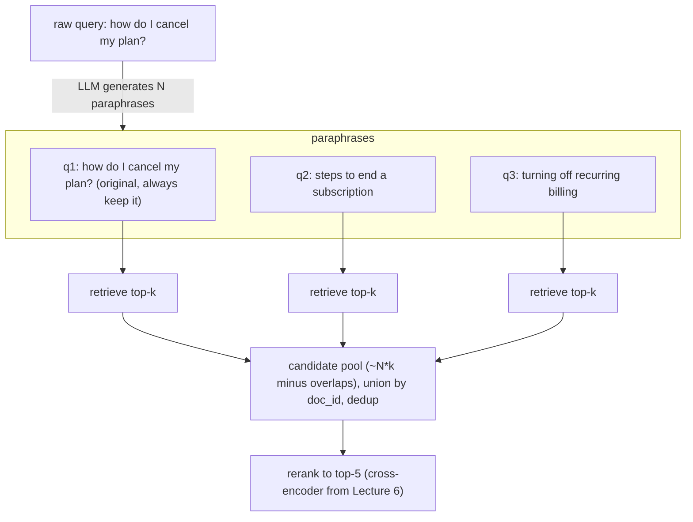
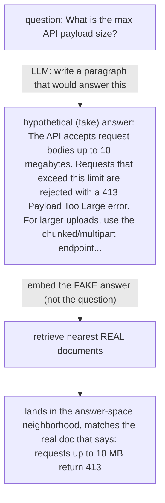
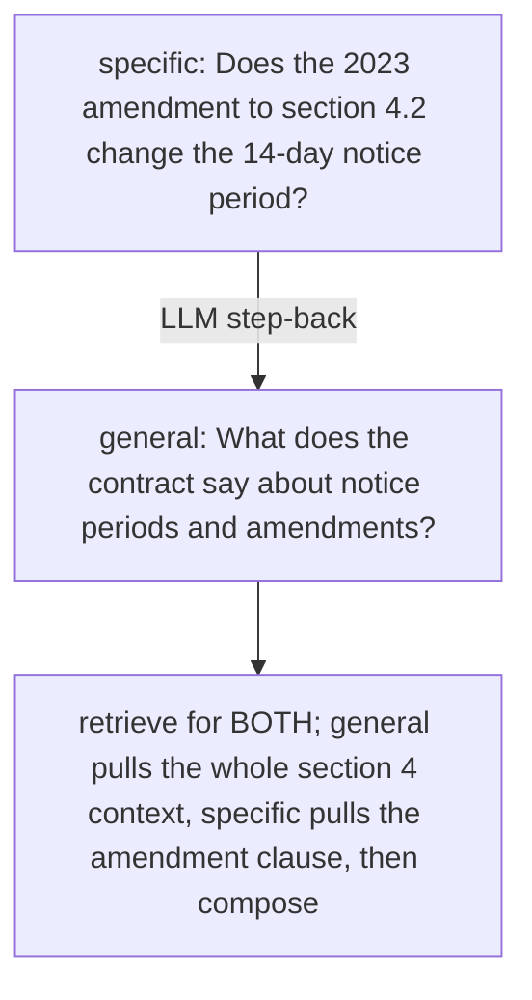
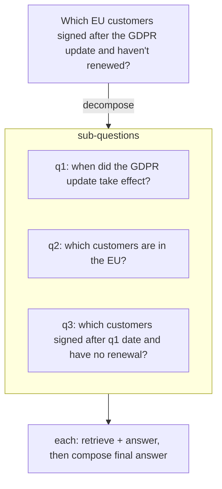
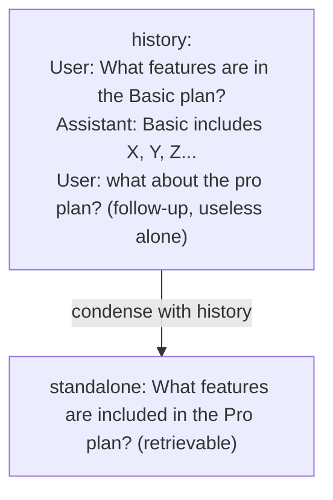

# Lecture 7: Query Transformation — Rewriting the Query Before Retrieval

> Your retriever is only as good as the string you hand it, and the string a human types is frequently a terrible retrieval query. "why is it slow" has no keywords worth matching and embeds into a vague neighborhood. "what about the pro plan?" is meaningless without the previous three turns. A one-line factoid question lives in *question-space* while your corpus lives in *answer-space* — different distributions, weak matches. This lecture is about the layer that sits *in front of* retrieval and rewrites the query into something the retriever can actually work with: multi-query, HyDE, step-back, decomposition, and condense-question. You'll learn the mechanism of each, exactly when it helps and when it backfires, how to wire the multi-query flow end-to-end into the hybrid+rerank stack you already built, and — most importantly — how to keep these transforms from quietly turning a 200 ms retrieval into a 3-second one. After this lecture you can pick the right transform for a given failure, implement it behind a flag, and defend (with numbers) whether it earns its latency.

**Prerequisites:** Hybrid search + RRF (Lecture 5), cross-encoder reranking (Lecture 6), embeddings and doc-space intuition, basic async/concurrency. · **Reading time:** ~28 min · **Part of:** Retrieval-Augmented Generation, Week 2

## The core idea (plain language)

Everything upstream of this lecture — chunking, hybrid search, reranking — assumes the query you feed it is a *good* query. Query transformation attacks the assumption directly: **the user's raw query is often a bad retrieval query, and an LLM can rewrite it into a better one before a single vector is compared.**

There are four distinct reasons a raw query retrieves poorly, and each transform targets a different one:

1. **Phrasing sensitivity.** Dense retrieval is not deterministic across paraphrases. "How do I cancel?" and "steps to end my subscription" embed to nearby-but-different points, and the gold chunk might be a top-3 neighbor of one and a top-15 neighbor of the other. You got unlucky on phrasing. → **Multi-query** (generate several paraphrases, retrieve for all, union).

2. **The question/answer distribution gap.** A short question ("What's the max payload size for the API?") and the document that answers it ("The endpoint accepts requests up to 10 MB; larger payloads return 413…") don't look alike. Questions are short and interrogative; answers are declarative and detailed. Embedding a question and searching for its nearest *documents* is a cross-distribution match. → **HyDE** (have the LLM write a fake answer, embed *that*, because a fake answer lives in answer-space and matches real answers).

3. **Too specific, no anchor.** A narrow question ("Does the 2023 amendment to section 4.2 change the notice period?") may have no broadly-relevant chunk near it — the retriever needs the *general* context first. → **Step-back** (ask a more general question, retrieve broad context, then the specific one).

4. **The query is actually several questions.** "Which of our EU customers signed after the GDPR update and haven't renewed?" is multi-hop; no single chunk answers it. → **Decomposition** (split into sub-questions, retrieve+answer each, compose).

And a fifth, orthogonal problem specific to chat:

5. **Context-dependent queries.** In a conversation, the real query is spread across turns. "what about the pro plan?" is 100% pronouns and ellipsis. → **Condense-question** (rewrite the follow-up into a standalone query using the chat history).

The unifying mental model: **you are moving the query closer to the documents before you search.** Multi-query covers more of the phrasing neighborhood; HyDE jumps the query from question-space into answer-space; step-back zooms out to where relevant context actually lives; decomposition breaks one bad query into several good ones; condense-question reconstructs the query a stateless retriever needs.

All five are LLM-driven, which is the whole tension of this lecture: every one of them costs an LLM call (sometimes several) and often multiplies your retrievals. The techniques are cheap to *describe* and expensive to *run*, and the dominant production failure is shipping them everywhere without measuring whether they beat the plain query.

## How it actually works (mechanism, from first principles)

### Multi-query: cover the phrasing neighborhood

Dense retrieval returns the *k* nearest neighbors of one point. If the gold chunk is the 12th-nearest neighbor of the user's exact phrasing but the 2nd-nearest of a slight rewording, single-query retrieval at k=5 misses it and a rephrase catches it. Multi-query generates *N* paraphrases, retrieves top-k for each, and **unions** the candidate sets by `doc_id`. You're sampling several nearby points in query-space and taking the union of their neighborhoods, which raises recall at the cost of N retrievals.



The union naturally deduplicates: chunks that show up for *multiple* paraphrases are strong signals (like RRF's cross-list agreement), and after dedup your candidate pool is usually much smaller than N·k because good chunks recur. Always include the original query in the set — the LLM's paraphrases can drift off-topic, and the original is your anchor.

### HyDE: jump from question-space to answer-space

HyDE (Hypothetical Document Embeddings) is the most counterintuitive transform, so slow down here. The insight is that **the embedding of a short question is a poor proxy for the embedding of its answer.** So instead of embedding the question, you ask the LLM to *write a hypothetical answer* — a plausible paragraph that would answer the question — and embed **that**. Then you retrieve the nearest real documents to the fake answer.

Why it works: the fake answer is *shaped like a document*. It's declarative, detailed, uses the vocabulary answers use ("The maximum payload is 10 MB; requests exceeding this return HTTP 413…"). Even if the specific facts are wrong or invented, its *position in embedding space* is in the answer neighborhood, near the real documents that answer the question. You deliberately throw away the hallucinated content and keep only the vector.



The critical caveat: **HyDE hurts when the model hallucinates off-domain.** If the query is about a niche internal system the model knows nothing about, the "hypothetical answer" is confident nonsense pointing at the *wrong* neighborhood — and you retrieve neighbors of the nonsense. HyDE is a bet that the model's prior is roughly aligned with your corpus. Great for general/zero-shot domains; actively harmful for proprietary jargon where the model's guess is systematically off.

### Step-back: zoom out for context

Step-back prompting asks the LLM to produce a *more general* question, retrieves for it, and uses that broad context (optionally alongside the specific query). The intuition: highly specific questions can be "orphans" in embedding space with no strongly-relevant neighbor, whereas the general question ("What is the refund policy overall?") pulls the section that *contains* the specific answer.



Use it when questions are narrow and the corpus is hierarchical (contracts, specs, policies) so that "the general neighborhood" is a real, useful place.

### Decomposition: split multi-hop into single-hop

A multi-hop question needs facts from several chunks that don't co-occur. Retrieving once with the whole compound query gives a muddled embedding that matches nothing well. Decomposition splits it into sub-questions, each of which is a clean single-hop retrieval, then composes the sub-answers.



This shades into agentic RAG (Week 3) when the sub-questions depend on each other's answers (q3 needs q1's date). Keep it simple here: independent sub-questions, retrieve each, stitch.

### Condense-question: make a follow-up standalone

Your retriever is **stateless** — it sees one string. In a chat, the user's real intent is distributed across turns. "what about the pro plan?" embeds to nothing useful; it's pronouns and ellipsis. Condense-question feeds the chat history + the follow-up to an LLM and asks for a self-contained query.



Without this, conversational RAG retrieves on the literal follow-up and dies — you match chunks about "pro" the adjective or nothing at all. This is not optional for multi-turn RAG; it's the difference between a working chat and one that forgets everything the moment the user uses a pronoun.

## Worked example

Let's run **multi-query end-to-end** with numbers, using the hybrid + rerank stack from Lectures 5–6. User query: **"how do I cancel my plan?"** N=3 (original + 2 paraphrases), each `hybrid_search` returns top-10, then rerank the union to top-5.

**Step 1 — generate paraphrases (1 LLM call):**
```
q1: how do I cancel my plan?              (original)
q2: steps to end a recurring subscription
q3: how to turn off automatic billing
```

**Step 2 — run hybrid_search per query (3 retrievals, ideally concurrent):**
```
q1 top-10 doc_ids: 14, 3, 88, 41, 9, 22, 6, 71, 30, 12
q2 top-10 doc_ids:  3, 41, 88, 9, 55, 14, 2, 19, 30, 77
q3 top-10 doc_ids: 41, 9, 88, 3, 63, 14, 22, 40, 30, 5
```

**Step 3 — union by doc_id (dedup):**
```
distinct doc_ids retrieved:
  {14, 3, 88, 41, 9, 22, 6, 71, 30, 12, 55, 2, 19, 77, 63, 40, 5}
= 17 unique candidates from 30 slots
```
Notice the overlap: `3, 88, 41, 9, 14, 30` appear in all three lists — those recurring chunks are your strongest candidates (agreement across paraphrases). The union is 17, not 30, because good chunks recur. This is the number that matters: **you did 3 retrievals but only have 17 chunks to rerank**, not 30.

**Step 4 — rerank the 17-candidate union to top-5 (1 cross-encoder call over 17 pairs):**
```
reranked top-5: 41, 3, 88, 9, 14
```

**The cost ledger for this one query:**
```
                      plain query      multi-query N=3
LLM calls (rewrite)         0                1
hybrid retrievals           1                3   (run concurrently ⇒ ~1× wall-clock)
rerank pairs               ~10              ~17
extra wall-clock       baseline      + 1 LLM call (~300–800 ms) + slightly bigger rerank
```

If chunk `41` was the gold answer and it ranked **#6 for the original query** (below your k=5 cutoff) but **#1 for the "turn off automatic billing" paraphrase**, multi-query just saved a miss the plain pipeline would have suffered. That's the win. The cost was one LLM call plus a marginally larger rerank set — *if you ran the three retrievals concurrently.* Run them serially and you've tripled retrieval latency for no reason.

Now the honest counterfactual: if chunk `41` was already **#2 for the original query**, multi-query changed nothing except your bill and your p95 latency. This is why you **measure** — the gain is real on some queries and zero on most, and the average lift has to beat the average cost.

## How it shows up in production

- **Latency and cost explode, and it's the #1 mistake.** Multi-query with N=5 is 5× retrievals + 1 LLM call. HyDE is 1 LLM call (to write the fake doc) *before* you can even embed. Decomposition is 1 call to split + N sub-retrievals + N sub-answers + 1 to compose — easily 5–10× the work of a plain query. An LLM rewrite adds **300 ms–1.5 s** depending on model and hosting; that lands directly on your user-facing p95 because it's *in front of* retrieval, on the critical path. The naive implementation turns a 200 ms retrieval into a 2–3 s one and the team is baffled why "adding query rewriting" tanked latency.

- **The three levers that make it survivable.** (1) **Cap N** — N=3 captures most of the multi-query benefit; N=10 is almost always waste. (2) **Run retrievals concurrently** — the N hybrid searches are independent; fire them with `asyncio.gather`/a thread pool so wall-clock is ~1 retrieval, not N. This single change is the difference between "5× slower" and "one extra LLM call slower." (3) **Cache the transform output** — HyDE and condensed queries are deterministic-ish functions of the input; cache the fake document / standalone query keyed on the input (+ history hash). Repeated or similar queries skip the LLM call entirely.

- **Measure, or don't ship it.** Wire every transform behind a flag (your `config.py` `QUERY_REWRITE`) and ablate on the golden set: recall@5 and nDCG@10 *with and without*, plus p50/p95 latency. The brutal common finding: **the quality gain often isn't worth 3× latency.** A +2 pt recall@5 for +1.2 s p95 is usually a bad trade for an interactive product; the same gain for a batch/offline pipeline is free money. The decision is context-dependent and *must* be made with numbers, not with "query rewriting is a best practice."

- **HyDE's domain-dependence bites silently.** On a public-knowledge corpus (general docs, Wikipedia-like content) HyDE can beat multi-query because the model writes a genuinely good hypothetical answer. On a proprietary corpus full of internal product names and undocumented behavior, HyDE writes confident fiction and retrieves neighbors of the fiction — it can score *below* the plain query. You will not catch this without a domain-representative golden set, and it won't show up on generic test questions.

- **Debugging: log the rewritten query.** When a transformed pipeline retrieves worse than the raw one, the first thing to inspect is *what the LLM produced*. Multi-query paraphrases that drifted off-topic, a HyDE doc that hallucinated the wrong domain, a condense step that dropped the actual subject — all visible only if you log the intermediate query. Treat the rewrite output as a first-class logged artifact.

## Common misconceptions & failure modes

- **"Query transformation is always an upgrade."** No. It's a latency/cost multiplier that *sometimes* buys recall. On phrasing-friendly queries with good chunking it changes nothing but the bill. Default to off; turn on per-technique only where the ablation shows lift that justifies the cost.

- **"HyDE needs a correct answer."** It does not — it needs a *document-shaped* answer in roughly the right domain. The hallucinated facts are discarded; only the embedding is used. The failure mode isn't "the fake answer is wrong," it's "the fake answer is in the wrong *neighborhood*" (off-domain). Correct-but-generic beats wrong-domain-but-confident.

- **"More paraphrases = better recall."** Diminishing returns hit fast. Paraphrases cluster in query-space; the 6th is nearly redundant with the 2nd, and it costs a full retrieval. N=3–5 is the sweet spot; beyond that you pay linearly for near-zero marginal recall.

- **Running retrievals serially.** The single most common performance bug. The N retrievals are embarrassingly parallel; running them in a `for` loop makes latency scale with N for no reason. Always concurrent.

- **Forgetting the original query.** LLM paraphrases can drift ("cancel my plan" → "how do refunds work"). If you retrieve *only* on generated queries you can lose the gold chunk the plain query would have found. Always union the original into the set.

- **Condense-question that over- or under-condenses.** Too aggressive and it invents constraints not in the conversation; too timid and it leaves pronouns in. It also silently breaks when the user *changes topic* ("actually, forget that — how do I export data?") and the condenser welds the new question onto stale context. Handle topic shifts explicitly or the condensed query is worse than the raw one.

- **Decomposition on a single-hop question.** If the query is already atomic, decomposition splits it into redundant near-duplicates, multiplying cost for nothing. Gate decomposition on a cheap "is this multi-hop?" check, or only enable it for query classes you know are compound.

- **Treating the LLM rewrite as trusted/structured without validation.** `multi_query` asks for a JSON list; models sometimes return prose, markdown fences, or 2 items when you asked for 3. Parse defensively and fall back to the raw query on parse failure — a rewrite step that throws is worse than no rewrite.

## HyDE vs multi-query: which, when

They solve *different* problems and the choice isn't arbitrary:

- **HyDE beats multi-query when the gap is question-vs-answer distribution** — short factoid questions against a corpus of detailed answers, especially **zero-shot / general-knowledge domains** where the model writes a good hypothetical. One LLM call, one retrieval. Cheaper than multi-query (which needs N retrievals) *if* your infra embeds the single HyDE doc.

- **Multi-query beats HyDE when the gap is phrasing sensitivity** and when you're on a **proprietary/niche domain** where a hallucinated HyDE doc would point the wrong way. Multi-query never leaves the user's actual intent (it only paraphrases), so it can't hallucinate you into the wrong neighborhood — it's the *safer* transform on domains the model doesn't know. Cost: N retrievals instead of 1.

- **Rule of thumb:** general domain + factoid questions → try **HyDE** first. Proprietary domain, or you've seen HyDE hallucinate off-target → **multi-query**. Both underperform good hybrid+rerank on many corpora, so ablate before committing. You can also combine (HyDE doc + original query as a 2-query union), but now you're paying for both.

## Rules of thumb / cheat sheet

- **Default query transformation = OFF.** It's a cost multiplier; enable per-technique only where an ablation shows lift worth the latency. (Approximate stance, but the right default.)
- **Cap N at 3–5 for multi-query.** More paraphrases ≈ linear cost, near-zero marginal recall.
- **Run the N retrievals concurrently** (`asyncio.gather` / thread pool). Serial multi-query is the #1 latency bug.
- **Always include the original query** in the multi-query set as an anchor against paraphrase drift.
- **Cache transform outputs** (HyDE docs, condensed queries) keyed on input (+ history hash). Repeated queries skip the LLM call.
- **HyDE → general/zero-shot domains + factoid questions.** Turn it *off* on proprietary corpora where the model hallucinates off-domain.
- **Multi-query → phrasing sensitivity and niche domains** (can't hallucinate you off-target because it stays near user intent).
- **Condense-question is mandatory for multi-turn chat**, not optional. Handle topic shifts explicitly.
- **Step-back → narrow questions over hierarchical corpora** (contracts, specs, policies).
- **Decomposition → genuinely multi-hop questions only.** Gate it; don't run it on atomic queries.
- **Multi-query flow:** rewrite → `hybrid_search` per query (concurrent) → **union by doc_id** (dedup) → **rerank the union** → top-5. The rerank set is smaller than N·k because good chunks recur.
- **Measure recall@5, nDCG@10, AND p50/p95 latency** for every transform. Ship on the number, not the vibe. A +2 pt recall for +1.5 s p95 is usually a bad trade interactively, a great one in batch.

## Connect to the lab

Week 2, Step 3 has you implement `multi_query`, `hyde`, and `condense` in `retrieval/query_transform.py` behind a config flag, driven by a local Ollama model (`llama3.1:8b`) so it costs nothing to iterate. The lecture's end-to-end flow is exactly the lab's instruction: *run `hybrid_search` for each generated query, union candidates by `doc_id`, then rerank the union* — reuse the `hybrid_search` from Step 1 and the cross-encoder `rerank` from Step 2. When you get to the Step-5 ablation, add each transform as its own config row and report recall@5 / nDCG@10 **and p50 latency** side by side — this lecture is why you should expect some transforms to add latency without adding recall, and why the pitfall list flags "query transforms exploding latency/cost" as a headline production trap.

## Going deeper (optional)

- **LangChain docs — "Query Transformation" / "Query construction" and the RAG how-to guides** on `python.langchain.com` — reference implementations of multi-query (`MultiQueryRetriever`), HyDE (`HypotheticalDocumentEmbedder`), and history-aware/condense retrieval. Search "LangChain MultiQueryRetriever" and "LangChain create_history_aware_retriever."
- **Gao et al., "Precise Zero-Shot Dense Retrieval without Relevance Labels" (2022)** — the original HyDE paper. Search the exact title; it's where the question/answer-space argument comes from.
- **Zheng et al., "Take a Step Back: Evoking Reasoning via Abstraction in Large Language Models" (2023)** — the step-back prompting paper. Search the exact title.
- **LlamaIndex docs — "Query Transformations" and "Sub Question Query Engine"** on `docs.llamaindex.ai` — decomposition/sub-question retrieval done well, plus HyDE and step-back query engines.
- **Anthropic / OpenAI cookbook RAG guides** — practical patterns for query rewriting and condense-question in chat; search "RAG query rewriting cookbook" for current versions.
- **RAGAS docs** (`docs.ragas.io`) — to actually *measure* whether a transform helps (context recall/precision), tying this lecture to Week 4's evaluation discipline.

## Check yourself

1. Explain *mechanistically* why HyDE can retrieve better than embedding the raw question, and name the one situation where it retrieves *worse* than the raw question.
2. You add multi-query (N=5) and p95 latency jumps from 250 ms to 1.4 s while recall@5 improves by 1 point. Name the two implementation mistakes most likely inflating the latency, and the decision you'd make.
3. In the multi-query flow, why do you **union by `doc_id`** and then **rerank the union**, rather than just concatenating the top-5 of each query? What property of the union makes reranking cheaper than N×k?
4. A conversational RAG bot answers the first question well but returns garbage the moment the user says "what about the enterprise tier?" What transform is missing, and what exactly is the retriever matching on without it?
5. Given a general-knowledge corpus with short factoid questions vs. a proprietary internal-tools corpus full of undocumented product names, which query transform do you reach for in each case and why?
6. Your teammate wants decomposition on by default for all queries "to be safe." Give the one-sentence objection and the cheap guard you'd add instead.

### Answer key

1. HyDE embeds an LLM-generated *hypothetical answer* instead of the question. Answers are document-shaped (declarative, detailed, answer-vocabulary), so the fake answer's embedding lands in the same *answer-space neighborhood* as the real documents that answer the question — closing the question/answer distribution gap that makes a short question a poor proxy for its answer. It retrieves *worse* when the model hallucinates **off-domain** (e.g., a proprietary system it knows nothing about): the fake answer is confident nonsense pointing at the wrong neighborhood, so you retrieve neighbors of the nonsense.
2. (a) Running the 5 retrievals **serially** instead of concurrently, so latency scales ~5×; fix with `asyncio.gather`/a thread pool so wall-clock ≈ 1 retrieval. (b) **N too high** — cap at 3. Decision: a +1 pt recall for +1.15 s p95 is a bad trade for an interactive product; I'd disable multi-query here (or keep it only for a batch/offline path) after confirming the concurrency fix doesn't recover the latency.
3. Unioning by `doc_id` **deduplicates** — chunks retrieved for multiple paraphrases collapse to one entry (and their recurrence is a relevance signal, like RRF agreement), so the candidate pool is much smaller than N·k. You then rerank *once* over that smaller union to get a single globally-ordered top-5, rather than N separate top-5 lists you'd have to merge anyway. Reranking is cheaper because the union (e.g. 17) is far below N·k (e.g. 30) since good chunks recur.
4. **Condense-question** is missing. Without it the stateless retriever matches on the literal follow-up "what about the enterprise tier?" — mostly pronouns/ellipsis with no real subject — so it retrieves on "enterprise" as a bare keyword or nothing useful, having no memory that the topic is (say) plan features. Condense rewrites it to a standalone query like "What features are in the Enterprise tier?" using the chat history.
5. **General-knowledge + factoid → HyDE:** the model writes a good hypothetical answer that bridges question-space to answer-space, and it's cheap (1 call, 1 retrieval). **Proprietary internal-tools → multi-query:** HyDE would hallucinate confident fiction about undocumented names and point at the wrong neighborhood, whereas multi-query only paraphrases the user's actual intent so it can't hallucinate you off-target (cost: N retrievals). Ablate both regardless, since good hybrid+rerank may beat either.
6. Objection: decomposition on an already-atomic query splits it into redundant near-duplicate sub-questions, multiplying LLM + retrieval cost for zero recall gain (and adding latency on the critical path). Cheap guard: gate decomposition behind a lightweight "is this multi-hop?" classifier/check, or enable it only for known-compound query classes.
