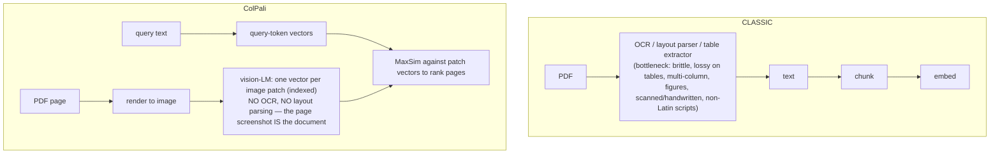

# Lecture 9: Late Interaction — ColBERT and ColPali (Conceptual)

> Your hybrid + reranker pipeline is humming, and then a domain expert starts asking questions where the answer hinges on *which specific token* sits next to *which other token* — "does the `retry_after` field apply to `429` or to `503`?" — and single-vector retrieval keeps handing back chunks that are *about* rate limiting but never pin the exact relationship. The problem isn't your embedding model's size; it's that squashing a whole chunk into one 768-float vector *averages away* precisely the token-level detail this query lives on. Late interaction is the architecture that keeps that detail without paying the cross-encoder's per-query compute tax. This lecture is a *recognition* lecture, not a build: after it you'll be able to look at a stalled retrieval metric and say "this is where single-vector blurring is the bottleneck, and late interaction (ColBERT), or its vision cousin ColPali for messy PDFs, is the right escalation" — and you'll know the real cost (a much larger index, specialized infra) you're signing up for.

**Prerequisites:** Bi-encoders / single-vector dense retrieval and cosine/MaxSim intuition (Lectures 3–4), cross-encoder reranking (Lecture 6), hybrid search (Lecture 5). · **Reading time:** ~24 min · **Part of:** Retrieval-Augmented Generation, Week 2

## The core idea (plain language)

There are three ways to score "how relevant is this document to this query," and they trade off on the same axis: **how much of the interaction between query and document you compute, versus how much you can pre-compute before the query even arrives.**

- **Bi-encoder (single-vector dense retrieval).** Encode the query into one vector, encode each document into one vector *ahead of time*, score by a single dot product. **Fast** — the document side is fully pre-computed and indexed for approximate nearest-neighbor search over millions of docs in milliseconds. **Lossy** — the entire document is compressed to one point, so token-level nuance is averaged away. This is everything you've built so far.

- **Cross-encoder (reranker).** Feed `[query, document]` *together* through a transformer so every query token can attend to every document token, output one relevance score. **Accurate** — nothing is blurred, the model sees the full interaction. **Slow and un-precomputable** — the document representation *depends on the query*, so you can't index anything; you run a full transformer forward pass per (query, doc) pair at query time. That's why you only ever run it on the top-50 candidates a cheap retriever already found (Lecture 6).

- **Late interaction (ColBERT).** The middle ground. Encode the query into *one vector per query token* and each document into *one vector per document token* — and crucially, **the document token vectors are query-independent, so you pre-compute and index them just like a bi-encoder.** Then at query time you score with a cheap operation over those stored vectors called **MaxSim**: for each query token, find its single best-matching document token (the max similarity), and sum those maxima across all query tokens. No transformer forward pass at query time — just a lot of small dot products against vectors you already have.

The name says it: interaction between query and document is *deferred* ("late") until scoring time, and when it happens it operates on **already-computed, indexed token vectors** rather than on raw text through a transformer. That single design choice is what buys you cross-encoder-flavored token-level matching at bi-encoder-flavored query-time cost.

The intuition for *why it's more accurate than a single vector*: a bi-encoder has to decide, once and for all at index time, one summary point for a 400-token chunk. Any query that cares about a detail the summary blurred is out of luck. Late interaction keeps the details — every token keeps its own vector — and lets the *query* decide, at query time, which document tokens matter. Exact terms, rare identifiers, and fine-grained "which word modifies which" distinctions survive, because they were never averaged into a single point.

## How it actually works (mechanism, from first principles)

### The three architectures, drawn

```
BI-ENCODER (single vector)         CROSS-ENCODER (reranker)         LATE INTERACTION (ColBERT)
  q ─►[enc]─► q⃗  (1 vec)             [q ; d] ─►[enc]─► score          q ─►[enc]─► q₁..qₙ (n vecs)
  d ─►[enc]─► d⃗  (1 vec, indexed)                                     d ─►[enc]─► d₁..dₘ (m vecs, INDEXED)
  score = q⃗ · d⃗                      d-side NOT precomputable          score = Σ_i max_j (qᵢ · dⱼ)   ← MaxSim
  precompute d? YES                  precompute d? NO                 precompute d? YES (per token)
  query-time cost: 1 dot product     query-time cost: full fwd pass   query-time cost: n×m dot products
```

Read the bottom row. The bi-encoder is one dot product. The cross-encoder is a full neural forward pass through both texts concatenated. Late interaction is `n × m` cheap dot products (n query tokens × m doc tokens) — dramatically cheaper than a forward pass, and it runs over vectors already sitting in your index.

### MaxSim, step by step

MaxSim scores a document against a query like this:

1. Both query and document are tokenized and each token gets its own contextualized embedding (a small vector, e.g. 128 dims in ColBERT — deliberately smaller than a typical 768-dim single-vector embedding, because you're storing *many* of them).
2. For **each query token** `qᵢ`, compute its similarity (dot product, on L2-normalized vectors so it's cosine) to **every** document token `dⱼ`, and keep only the **maximum**: `max_j (qᵢ · dⱼ)`. This says "how well does the query's best-matching word find a home somewhere in this document?"
3. **Sum** those per-query-token maxima across all query tokens: `score = Σ_i max_j (qᵢ · dⱼ)`.

Two things fall out of this design:

- **It's soft-AND over query terms.** Every query token contributes its best match, so a document is rewarded for covering *all* the query's aspects, not just one really well. A doc that nails "timeout" but has nothing near "connect" scores lower than one with a decent match for both — why late interaction is strong on multi-aspect and exact-term queries where single-vector blurs the aspects together.
- **Only the max per query token counts** — the other m−1 similarities are discarded. So a document isn't penalized for being long and containing irrelevant tokens; each query token just looks for its one best anchor. (Contrast with a single vector, whose pooling *dilutes* as the doc gets longer.)

### A worked MaxSim calculation

Query: **"connect timeout"** → 2 query tokens after encoding, call them `q_connect` and `q_timeout`. Two candidate docs, each reduced to 3 token vectors for illustration. Similarities (cosine, already computed as dot products) laid out as a grid:

```
Doc A tokens:      d="the"   d="connect()"  d="reliability"
  q_connect          0.10       0.92            0.31          → max = 0.92
  q_timeout          0.08       0.20            0.55          → max = 0.55
                                          MaxSim(A) = 0.92 + 0.55 = 1.47

Doc B tokens:      d="timeout"  d="occurred"  d="retry"
  q_connect          0.22        0.18           0.25          → max = 0.25
  q_timeout          0.95        0.30           0.40          → max = 0.95
                                          MaxSim(B) = 0.25 + 0.95 = 1.20
```

Doc A wins (1.47 > 1.20) because it covers *both* query tokens reasonably — a strong `connect()` match (0.92) plus a passable `timeout`-ish match via "reliability" (0.55). Doc B has a near-perfect `timeout` hit (0.95) but nothing that anchors `connect`, so its soft-AND falls short. Notice that a single-vector encoder might have ranked B higher if its one summary vector happened to sit near "timeout"; MaxSim's per-query-token accounting is what surfaces the doc that covers the *whole* query.

Now feel the cost: this was 2 query tokens × 3 doc tokens = 6 dot products *for one document*. A real query is ~32 tokens, a real chunk ~100–300 tokens, and you'd do this against thousands of candidate documents. That `n × m × (candidates)` is the late-interaction bill — cheap per operation, but it adds up, and it explains both the infra and the index-size story below.

### Why this stays pre-computable (the whole point)

The document token vectors `dⱼ` are produced by encoding the document **alone**, with no knowledge of any query. So you encode every chunk once, at index time, and store all its token vectors. At query time you only encode the query (fast) and run MaxSim against the stored vectors. **Nothing about the document is recomputed per query** — exactly the property a cross-encoder lacks. That's the sentence to remember: *late interaction keeps token-level detail like a cross-encoder, but keeps the document side pre-computable like a bi-encoder.*

## Worked example

Walk an end-to-end retrieval to see where late interaction plugs in and what it costs. Corpus: 1,000,000 chunks, ~130 tokens each after ColBERT's token cap.

**Index-time (offline):**
- Single-vector baseline: 1M chunks × 1 vector × 768 dims × 4 bytes ≈ **3 GB** of vectors.
- ColBERT late interaction: 1M chunks × ~130 token-vectors × 128 dims × 4 bytes ≈ **62 GB** raw — roughly **20× larger** before any compression. (ColBERT's own storage tricks — quantization/residual compression, "PLAID" — cut this substantially, but you are still fundamentally storing many vectors per doc, not one. Treat "roughly an order of magnitude bigger, mitigated by compression" as the honest approximate rule, not a precise figure.)

**Query-time (online):**
1. Encode query "does retry_after apply to 429 or 503" → ~12 query-token vectors.
2. A candidate-generation step narrows 1M chunks to a few thousand (ColBERT uses an ANN pass over the token vectors to find docs whose tokens are near *any* query token — you don't MaxSim all 1M).
3. MaxSim-score the survivors: for each candidate, ~12 query tokens × ~130 doc tokens = ~1,560 dot products, times a few thousand candidates. Milliseconds-to-low-hundreds-of-ms on a suitable index — slower than a single-vector ANN lookup, far faster than running a cross-encoder over thousands of docs.
4. Return top-k.

The payoff on *this* query: single-vector retrieval blurs `429`, `503`, and `retry_after` into a generic "HTTP rate-limit error" neighborhood, so it can't distinguish the chunk that ties `retry_after` to `503` from the one that ties it to `429`. Late interaction keeps a vector for each of those literal tokens, so the query token `503` finds its exact anchor and MaxSim rewards the chunk that co-locates the right pair. That's the fine-grained, exact-term win single-vector systems structurally can't get — bought without a per-query transformer pass, at the price of a ~20×-ish index.

## ColPali — late interaction on document *images*

Everything above assumes text tokens. **ColPali** (from Illuin Technology, built on the PaliGemma vision-language model) makes one move that changes the ingestion story for a whole class of documents: instead of text tokens, it produces late-interaction vectors from **patches of a rendered page image**, and the query is still text.

The pipeline it replaces is the painful one:



Why this is a big deal, concretely: for most of Week 1 you fought PDFs because *parsing* is where RAG quality leaks — tables flatten, reading order scrambles, multi-column pages interleave, scanned pages need OCR. ColPali sidesteps that entire failure surface by never converting the page to text at all. The visual layout — a table's grid, a chart, a stamped form, a figure caption's position — is preserved *as pixels*, and late-interaction MaxSim lets a text query token match the image patch that visually corresponds to it. On messy, complex-layout, or scanned documents where parsing is the true bottleneck, "skip parsing entirely" can beat a heavily-engineered OCR pipeline.

The tradeoffs are late-interaction's tradeoffs, amplified: you store many patch vectors per *page* (a page has a lot of patches), the index is large, and you now need a vision-LM in your ingestion path (GPU-hungry) plus infra that can MaxSim over patch vectors. And it retrieves *pages/images*, which your generation step must then feed to a **vision-capable** LLM — a text-only generator can't read the page you retrieved. Recognize ColPali as the right tool when your corpus is visually complex PDFs and parsing is demonstrably where you're losing recall — not as a default for clean digital text.

## How it shows up in production

- **The index-size and cost jump is the headline.** Going from one vector per chunk to one per token is roughly an order-of-magnitude storage increase (mitigated, not erased, by ColBERT's compression). That's RAM/disk, ANN index build time, and $ — budget for it before you commit. If your corpus is 100k clean chunks and single-vector already hits your recall target, late interaction is over-engineering.

- **Specialized infra, not "just add a vector column."** MaxSim + token-level ANN isn't what a stock single-vector setup does. You reach for the ColBERT stack (`stanford-futuredata/ColBERT`, whose PLAID engine makes token-level search tractable), **RAGatouille** (a thin wrapper that makes ColBERT indexing/search a few lines — the pragmatic on-ramp), or a vector DB with native multi-vector/late-interaction support (Vespa has long done this; Qdrant and others have added multi-vector features). Don't hand-roll MaxSim over a flat index at scale.

- **Where it earns its keep vs. where the reranker already won.** Late interaction and a cross-encoder reranker occupy overlapping ground — both add token-level precision. The practical question is *first-stage vs. second-stage*. A reranker only reorders the top-50 your first stage returned; if single-vector retrieval never surfaced the gold chunk in the top-50, the reranker can't save it. Late interaction improves the **first-stage recall** itself, so it helps precisely when the right chunk was being missed entirely, not just mis-ordered. If your ablation shows recall@50 is already high and only ranking is off, a reranker is the cheaper fix. If recall@50 itself is the ceiling and it's an exact-term/fine-grained corpus, late interaction is the escalation.

- **Latency sits between the two,** and it composes: slower than single-vector ANN, much faster than cross-encoding thousands of candidates — and you can run late interaction as the retriever *and still* rerank its top candidates with a cross-encoder.

- **Debugging is legible.** Because MaxSim is per-query-token maxima, you can inspect *which document token each query token matched* — a built-in explanation of why a doc scored high, in a way a single opaque dot product isn't.

## Common misconceptions & failure modes

- **"Late interaction replaces the cross-encoder reranker."** Not necessarily. It's a stronger *first-stage retriever*; you can still rerank its output. It replaces or upgrades the *bi-encoder*, not the reranker. They're composable.

- **"ColBERT is a bigger/better embedding model."** It's a different *architecture*, not a bigger model. The win comes from storing per-token vectors and MaxSim scoring, not from more parameters. Swapping in a larger single-vector model does not reproduce the effect — you'll still average away the token detail.

- **"ColPali reads the text off the page."** No — it deliberately *doesn't*. It never OCRs; it matches text query tokens against image-patch vectors. That's the point (it dodges the parsing failure surface), but it also means retrieval returns an *image/page*, and your generator must be vision-capable to use it.

- **"The index is only a bit bigger."** It's ~an order of magnitude bigger before compression. Underestimating this is the classic way a late-interaction proof-of-concept dies when it meets the real corpus size.

- **"It'll obviously beat hybrid+rerank on my corpus."** Only if your corpus and queries are token-detail-bound (exact terms, fine-grained relations, or visually complex pages). On paraphrase-friendly, clean text where single-vector already has high recall, you'll pay 10–20× the index for marginal or no gain. Measure on *your* golden set — especially with exact-string and fine-grained queries in it — before adopting.

- **"MaxSim penalizes long documents."** The opposite failure mode is the risk: because only the max per query token counts, a very long document has more chances to contain *a* good match for each query token, so long docs can accrue slightly inflated scores. Chunk sensibly even with late interaction.

## Rules of thumb / cheat sheet

- **The escalation ladder:** single-vector dense → hybrid (dense+BM25+RRF) → +cross-encoder rerank → **late interaction (ColBERT)** → ColPali (for image/PDF-visual corpora). Climb only when the metric says the current rung is the ceiling. (Approximate ordering by cost/complexity, not a strict law.)
- **Reach for late interaction when:** recall@k itself (not just ranking) is your ceiling, *and* your queries hinge on exact terms / fine-grained token relationships that single-vector blurs. Not for clean paraphrase-heavy corpora.
- **Reach for ColPali when:** the corpus is visually complex / scanned / table-heavy PDFs and *parsing* is demonstrably where recall leaks — you want to skip OCR entirely. Remember the generator must be vision-capable.
- **Budget ~an order-of-magnitude larger index** (per-token/per-patch vectors), mitigated by ColBERT's compression (PLAID/quantization). Confirm you can afford the RAM/disk/$ before committing.
- **Don't hand-roll it.** Use `stanford-futuredata/ColBERT`, **RAGatouille** for the easy on-ramp, `illuin-tech/colpali` for the vision variant, or a DB with native multi-vector support (Vespa, Qdrant multi-vectors).
- **It composes with reranking** — late interaction as retriever, cross-encoder over its top candidates. Not either/or.
- **Diagnose first:** if recall@50 is already high and only ordering is bad → cheaper reranker. If recall@50 is the ceiling on an exact-term corpus → late interaction.
- **This is where 2025–2026 retrieval is heading** — recognize it, know the tooling names, escalate deliberately.

## Connect to the lab

Week 2 Theory §6 flags late interaction as **conceptual — you will NOT build it in the lab** (your hands-on build is hybrid + RRF + cross-encoder rerank + query transforms + ACL). This lecture is the "know when to escalate" half of that: when your Step-5 ablation shows hybrid+rerank has plateaued and the residual misses are exact-term or fine-grained *first-stage recall* failures (not just mis-ranking), late interaction is the next rung — and if those misses are on messy PDFs where parsing is the culprit, ColPali is the vision escalation. If you want to try it beyond the lab, `pip install ragatouille` gets you a ColBERT index in a few lines over the same corpus you built in Week 1.

## Going deeper (optional)

- **`stanford-futuredata/ColBERT` (GitHub)** — the canonical ColBERT implementation, including the PLAID engine for scalable late-interaction search. Start at the repo README. Search "ColBERT PLAID late interaction."
- **Khattab & Zaharia, "ColBERT: Efficient and Effective Passage Search via Contextualized Late Interaction over BERT" (SIGIR 2020)** and the follow-up **"ColBERTv2: Effective and Efficient Retrieval via Lightweight Late Interaction."** Search the exact titles for the source of MaxSim and the compression story.
- **`illuin-tech/colpali` (GitHub)** and the paper **"ColPali: Efficient Document Retrieval with Vision Language Models"** — the image/PDF late-interaction variant on PaliGemma. Search "ColPali vision document retrieval." There's also the **ViDoRe** benchmark (Visual Document Retrieval) the ColPali authors use — search "ViDoRe benchmark."
- **RAGatouille (GitHub, `bclavie/RAGatouille`)** — "ColBERT made easy"; the pragmatic way to index and search with ColBERT in a few lines. Search "RAGatouille ColBERT."
- **Vespa blog / docs on late interaction and ColBERT** (`vespa.ai`) — a production search engine with first-class multi-vector/late-interaction support; good for the infra-reality perspective. Search "Vespa ColBERT late interaction."
- **Qdrant docs — "multivectors" / late interaction** (`qdrant.tech`) — how a mainstream vector DB exposes per-token vectors and MaxSim-style scoring.

## Check yourself

1. In one sentence each, place bi-encoder, cross-encoder, and late interaction on the "how much can you pre-compute vs. how much interaction do you capture" axis.
2. Write out the MaxSim score for a 3-token query against a doc, given a similarity grid, and explain why only the maximum per query token is used and why they're summed.
3. Why is a ColBERT document index roughly an order of magnitude larger than a single-vector index, and what mitigates it?
4. Your recall@50 is already 0.95 but the *ordering* within the top-50 is poor. Is late interaction or a cross-encoder reranker the more cost-effective fix, and why?
5. What specific problem does ColPali eliminate that a text-based ColBERT pipeline still has, and what new requirement does it impose on your *generation* step?
6. A teammate says "let's just use a bigger embedding model instead of ColBERT — same idea, less infra." What's the flaw in that reasoning?

### Answer key

1. **Bi-encoder:** fully pre-compute the document side (one vector), capture minimal interaction (one dot product) — fast, lossy. **Cross-encoder:** pre-compute nothing (doc representation depends on the query), capture full token-to-token interaction via a forward pass — accurate, un-indexable. **Late interaction:** pre-compute per-token document vectors (indexable like a bi-encoder) yet capture token-level interaction at query time via MaxSim — the middle ground.
2. `score = Σ_i max_j (qᵢ · dⱼ)`: for each of the 3 query tokens take its single best-matching document token similarity, then add those 3 maxima. The **max** implements "did this query aspect find a good home somewhere in the doc?" without penalizing the doc for its other (irrelevant) tokens; the **sum** implements a soft-AND that rewards covering *all* query aspects, not just nailing one.
3. Because you store one vector per *token* instead of one per *chunk* — a ~130-token chunk stores ~130 vectors, so ~1–2 orders of magnitude more vectors (partly offset by ColBERT's smaller 128-dim vectors). It's mitigated by compression/quantization and the PLAID residual encoding in the ColBERT stack, but you're still fundamentally storing many vectors per doc.
4. A **cross-encoder reranker** — recall@50 of 0.95 means the gold chunks are already *in* the candidate set, so the problem is purely ordering, which reranking fixes cheaply over just 50 candidates. Late interaction's main advantage is raising *first-stage recall*; if recall is already high, you'd pay a ~10–20× index for a job a reranker does more cheaply.
5. ColPali eliminates the **OCR / layout-parsing stage** — it matches text query tokens against image-patch vectors of the rendered page, so parsing (the usual bottleneck on messy/complex PDFs) is skipped entirely. The new requirement: retrieval returns *page images*, so your generator must be **vision-capable** to consume them; a text-only LLM can't read the retrieved page.
6. The win comes from the **architecture** (per-token vectors + MaxSim), not model size. A bigger single-vector model still compresses the whole chunk to one point and averages away the token-level detail, so it can't reproduce late interaction's exact-term/fine-grained matching no matter how many parameters it has.
