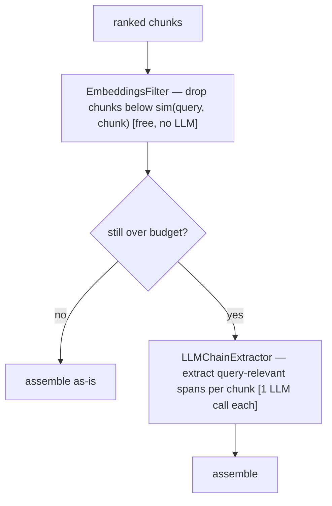

# Lecture 10: Context Assembly and Token Budgeting

> Retrieval handed you 20 ranked chunks. Now comes the step everyone treats as trivial — "just concatenate them into the prompt" — and it is where a shocking amount of quality quietly leaks away. Stuff them in raw and you'll bury your best evidence in the dead zone the model barely reads, waste a third of your budget on three paraphrases of the same paragraph, and — the silent killer — overflow the context window so your best-ranked chunk gets truncated to nothing without a single error in your logs. This lecture teaches the four engineering levers that turn "concatenate and pray" into a deterministic, testable `assemble()` function: **order-to-edges**, **dedup**, **compression**, and **token budgeting**. After it you'll be able to write an assembler that provably never overflows the window, drops near-duplicates, and places your strongest chunks where the model actually attends — with a unit test that proves all three.

**Prerequisites:** The two RAG pipelines (Lecture 1), cross-encoder reranking (Lecture 6), embeddings and cosine similarity (Lecture 3), basic tokenization intuition. · **Reading time:** ~28 min · **Part of:** Retrieval-Augmented Generation, Week 3

## The core idea (plain language)

Reranking (Lecture 6) gave you an *ordered* list of candidate chunks. Assembly is the bridge between that list and the string you hand the LLM. It answers three questions that reranking does not: **which** chunks actually go in, **in what order** inside the prompt, and **how compressed**. Get these wrong and you re-introduce failure point #3 from Lecture 1 — *"retrieved but not in context / consolidation"* — where the right chunk was fetched and even ranked well, then lost on the way into the prompt.

Here's the mental model. The context window is a **fixed-size box** with three regions the model treats very differently: the model reads the **start** carefully, reads the **end** carefully, and skims the **middle**. Your job is to pack that box so (a) the most valuable evidence lands at the start and end, not the middle; (b) you don't spend space on duplicates; (c) you never try to put more in the box than it holds. Three of the four levers are about *what goes where*; the fourth (budgeting) is the hard constraint that makes it a box and not a bag.

The reason this is engineering and not luck: every one of these levers is a **deterministic, unit-testable transformation** on a list. Ordering is a permutation. Dedup is a hash-set and a similarity check. Compression is a filter. Budgeting is arithmetic and a greedy loop. None of it needs the LLM to "figure it out" — you decide it in code, log what you did, and assert it in a test. That is the entire posture of this lecture: **the model's context is an artifact you build on purpose, measure, and gate — not a pile you dump.**

## How it actually works (mechanism, from first principles)

### Lever 1 — Order-to-edges (lost-in-the-middle)

In 2023, Liu et al. published *"Lost in the Middle: How Language Models Use Long Contexts."* The finding you must carry into production (skip the math): when relevant information sits in the **middle** of a long context, models retrieve and use it **markedly worse** than when the same information sits at the **beginning or end**. Plot accuracy against the position of the gold document and you get a **U-shaped curve** — high at both edges, sagging in the middle. This holds across model families and persists even in models with huge advertised context windows. A big window means the text *fits*; it does not mean the model *attends* to the middle of it.

```
   LOST IN THE MIDDLE  (accuracy vs. position of the gold chunk)

  acc │██                                        ██
      │███                                      ███
      │████                                    ████
      │ ████        the dead zone            ████
      │  ████     (skimmed, easily lost)   ████
      │   ██████                        ██████
      └──────────────────────────────────────────────▶ position in context
       START            MIDDLE                   END
```

The engineering response is **order-to-edges**: don't lay your reranked chunks down 1,2,3,...,N front-to-back, because that dumps everything from rank 2 onward into the sagging middle. Instead **interleave** so the strongest chunks occupy both edges and the weakest sit in the middle where it hurts least. The canonical permutation for ranks `[1,2,3,4,5,6]` is:

```
   reranked:  1  2  3  4  5  6      (1 = best)
                    │
                    ▼  order-to-edges interleave
   in prompt: 1  3  5  6  4  2
              ▲              ▲
           rank 1         rank 2   ← the two best land on the two edges
```

Concretely: walk the ranked list and alternately append to the **front** and the **back** of the output. Rank 1 → front. Rank 2 → back. Rank 3 → front (after 1). Rank 4 → back (before 2). And so on. The result reads `[1,3,5,...,6,4,2]`: odd ranks marching in from the left, even ranks marching in from the right, best evidence pinned to both edges, weakest buried dead-center. It costs nothing — it's a reordering of chunks you already have — which is why it's called a *free* recall win.

**Why "best chunk last" matters specifically.** There's a second, compounding effect layered on top of the U-curve: **recency**. The tokens nearest the question — which almost always sits at the very end of the prompt, right before "Answer:" — are the freshest in the model's attention when it starts generating. So the *tail* edge isn't just symmetric with the head; for a chunk that must not be missed, the position immediately before the question is often the single strongest slot. This is why the self-check question in the spine asks *"why does putting your best chunk last (not just first) improve quality?"* — the naive instinct is "best first," but the U-curve plus recency means the end is at least as valuable as the start, and the slot right before the question is prime real estate. A common refinement: put rank 1 at the front **and** duplicate-or-place your single most critical chunk immediately before the query.

### Lever 2 — Dedup and near-dup collapse

Reranked results are frequently **redundant**. The same fact appears in an FAQ, a release note, and a support ticket; chunk overlap (Lecture 3) means adjacent chunks literally share 10-20% of their text; and multiple source documents paraphrase the same policy. Your reranker, scoring each independently against the query, happily ranks all three paraphrases highly — and now you're about to spend 3× the tokens to tell the model the same thing once. Worse, redundancy in the prompt can bias the model toward whatever is repeated, and it pushes genuinely *different* evidence out of the budget.

Two collapse mechanisms, cheap first:

1. **Exact/normalized dedup by hash.** Normalize the text (lowercase, collapse whitespace, strip punctuation you don't care about), compute `sha256(normalized_text)`, and keep a `set` of seen hashes. Second occurrence of an identical normalized string → drop. This is O(1) per chunk, catches exact duplicates and trivial reformattings, and is essentially free. It will **not** catch paraphrases — identical meaning, different words hash differently.

2. **Near-dup collapse by cosine similarity.** For paraphrases, reuse the embeddings you *already computed* during retrieval. Walk the ranked list in order (best first); for each chunk, compare its embedding against the chunks you've already kept. If cosine similarity to any kept chunk exceeds a threshold — **~0.95 is the standard default** — drop it as a near-duplicate. Because you walk best-first, you always keep the higher-ranked member of a duplicate cluster and drop the lower-ranked echoes.

```
   kept = []
   for chunk in reranked_order:              # best first
       if sha256(norm(chunk.text)) in seen:  # exact dup
           drop; continue
       if any(cos(chunk.emb, k.emb) > 0.95    # near dup
              for k in kept):
           drop; continue
       kept.append(chunk); seen.add(hash)
```

**Why 0.95 and not lower.** The threshold is a precision/recall knob and you should treat it as approximate. Set it too **low** (say 0.85) and you'll collapse chunks that are *topically* similar but carry *different* facts — "connect timeout is 30s" and "read timeout is 60s" can sit around 0.9 cosine and you'd throw away half your answer. Set it too **high** (0.99) and you only catch near-identical text, letting looser paraphrases through. 0.95 is the empirical sweet spot for "same paragraph, reworded" without eating distinct facts — but it depends on your embedding model, so it's a number to tune against your golden set, not a law.

### Lever 3 — Contextual compression

Even after dedup, a chunk is usually mostly *not* about your query. A 400-token chunk might contain two relevant sentences and 380 tokens of surrounding context. Stuffing the whole chunk spends budget on noise and — per failure point #4 — gives the LLM more distractors to trip over. **Contextual compression** shrinks each chunk down to the query-relevant part *before* assembly. LangChain packages this as `ContextualCompressionRetriever`, which wraps your base retriever with a compressor. Two compressors matter, and the **order you apply them is the whole lesson**:

- **`EmbeddingsFilter` — cheap, no LLM, apply FIRST.** It embeds the query and each chunk (embeddings you often already have) and **drops any chunk below a similarity threshold** to the query. No LLM call, so it's essentially free and fast. It's a *filter* — it removes whole chunks that only tangentially match — it does not rewrite them.

- **`LLMChainExtractor` — expensive, per-chunk LLM call, apply only if STILL over budget.** For each surviving chunk, it runs an LLM prompt that **extracts only the spans relevant to the query**, discarding the rest. This is genuine compression — a 400-token chunk might come back as 60 tokens — but it costs **one LLM call per chunk**. Ten chunks = ten extra LLM round-trips on your online path, multiplying both latency and dollar cost.

The opinionated pipeline, straight from the spine: **`EmbeddingsFilter` first (free) to throw out weak chunks, then `LLMChainExtractor` only if you're still over budget**, because per-chunk LLM extraction multiplies cost linearly with the number of chunks. Reaching for `LLMChainExtractor` first is the classic beginner mistake — you pay N LLM calls to compress chunks that `EmbeddingsFilter` would have deleted for free.



### Lever 4 — Token budgeting (the hard constraint)

The context window is finite. You must count tokens and stop before you overflow — and you must count them **the way the model counts them**, not by characters or words. Count with `tiktoken` using the `cl100k_base` encoding (the encoding for the GPT-4 / GPT-3.5 family and a reasonable proxy for many models) or, better, the exact tokenizer for your target model. Chars-÷-4 is a rule-of-thumb estimate that will bite you on code, non-English text, and tables.

The budget formula — memorize it, it's a self-check question:

```
context_budget = model_ctx − prompt_overhead − max_answer_tokens
```

Each term protects something specific:

- **`model_ctx`** — the model's total context window (e.g. 8k, 128k, 200k tokens). The size of the whole box.
- **`prompt_overhead`** — every token that isn't retrieved chunks: the system prompt, the instructions, the citation format spec, few-shot examples, the delimiters around each chunk, and the user's question itself. **Protects against** forgetting that your scaffolding costs tokens too — people budget for chunks and forget the 500-token system prompt, then overflow.
- **`max_answer_tokens`** — the space you reserve for the model's *output*. Input and output share the window. **Protects against** the nastiest failure: you pack the input right up to `model_ctx`, the model has no room left to answer, and generation is truncated mid-sentence or the API errors. You must carve out the answer's space *before* packing input.

`context_budget` is therefore the tokens available **for retrieved chunks specifically**. Now pack **greedily**: walk your assembled (ordered, deduped, compressed) list and add chunks one at a time, keeping a running `used_tokens`, until the next chunk would exceed `context_budget`. Stop there. Everything you couldn't fit is **dropped** — and you log the count.

**The silent-overflow trap.** Here is the subtle interaction between levers that catches even careful engineers. If you order-to-edges *first* (rank 2 at the very back) and then run out of budget during greedy packing, **the chunk you drop is the one at the back — which is rank 2, one of your best.** The lecture's warning "silent overflow drops your best-ranked-last chunk" is exactly this. The fix: do your **budget-aware selection on rank order first** (decide *which* chunks survive the budget by walking best-to-worst), and only *then* apply order-to-edges to the survivors. Select by rank, arrange by edges. If you invert that, edge-placement can sacrifice your rank-2 chunk to a rank-6 filler that happened to sit earlier in the packing loop.

## Worked example

**Model:** 8,192-token context window. **System prompt + citation instructions + question:** measured with `tiktoken` at **1,200 tokens**. **You reserve** `max_answer_tokens = 800`.

```
context_budget = 8192 − 1200 − 800 = 6192 tokens for chunks
```

**Reranked candidates** (best first), token counts from `tiktoken`:

| rank | chunk | tokens | note |
|---|---|---|---|
| 1 | connect() timeout = 30s (table) | 1,400 | gold |
| 2 | retry/backoff policy | 1,300 | |
| 3 | connect() default is 30 seconds (prose) | 1,200 | **paraphrase of #1** |
| 4 | read() timeout = 60s | 1,500 | |
| 5 | IPv6 support notes | 1,400 | |
| 6 | connect timeout, thirty seconds (FAQ) | 1,100 | **paraphrase of #1** |

**Step 1 — dedup.** Chunk 3 and chunk 6 are paraphrases of chunk 1. Exact-hash misses them (different words), but cosine similarity to chunk 1 is 0.96 and 0.97 — both above 0.95. Walking best-first, we keep rank 1 and drop ranks 3 and 6. Survivors: `[1, 2, 4, 5]`, tokens `[1400, 1300, 1500, 1400]`.

**Step 2 — budget-aware selection by rank.** Greedily add best-first, tracking `used_tokens` against the 6,192 budget:

```
+ rank1: 1400  (used 1400)  ✓
+ rank2: 1300  (used 2700)  ✓
+ rank4: 1500  (used 4200)  ✓
+ rank5: 1400  (used 5600)  ✓   next chunk? none left
```

All four survivors fit (5,600 ≤ 6,192). `used_tokens = 5600`, `dropped = 0` from budget (2 dropped earlier as near-dups). Had there been a rank-7 chunk of 800 tokens, `5600 + 800 = 6400 > 6192` → it would be dropped, `dropped += 1`.

**Step 3 — order-to-edges on the survivors** `[1, 2, 4, 5]`:

```
front←  1 ......... 4  2  ←back
        └ 1 (best) at head, 2 at tail, 4/5 in the middle
   final prompt order: [1, 4, 5, 2]
```

Rank 1 leads, rank 2 sits at the tail right before the question (recency slot), ranks 4 and 5 take the skimmed middle. **What we avoided:** naive `[1,2,3,4,5,6]` front-to-back would have (a) spent ~2,300 tokens on two paraphrases of rank 1, (b) potentially pushed rank 5 out of budget to fit those duplicates, and (c) buried rank 2 in the dead middle. Assembly turned a wasteful, lossy pile into a tight, edge-optimized 5,600-token context — deterministically.

## How it shows up in production

- **Silent truncation is the bug you never see in logs.** When input + requested output exceeds the window, some SDKs error, but many pipelines quietly truncate the input tail or the model just stops early — no exception, no alert. Your best-ranked-last chunk vanishes and answers degrade for reasons that don't show up in any error metric. The only defense is *counting tokens yourself before the call* and logging `used_tokens`/`dropped`. If you're not logging dropped-chunk counts, you are flying blind on your single most common context bug.
- **The `assemble()` contract is what makes it debuggable.** In production, `assemble()` should return not just the context string but a record: `{context, used_tokens, dropped, kept_ids, order}`. When an answer is wrong, the first question is "did the gold chunk even make it into the prompt?" — and `kept_ids` answers it instantly, splitting a retrieval bug from an assembly bug from a generation bug. Without that log, you're guessing.
- **Compression cost is a latency multiplier on the online path.** `LLMChainExtractor` runs one LLM call *per chunk*. Ten chunks can add ten sequential (or parallel-but-rate-limited) LLM round-trips *before* your main generation call even starts. Teams enable it for quality, watch p95 latency triple, and can't figure out why. Keep `EmbeddingsFilter` (free) as the default and gate `LLMChainExtractor` behind an explicit "still over budget" condition — never run it unconditionally.
- **`prompt_overhead` drifts and silently shrinks your budget.** Someone adds two few-shot examples or expands the system prompt for a new feature; `prompt_overhead` jumps 600 tokens; `context_budget` drops by 600; a chunk that used to fit now gets dropped. If overhead isn't *measured dynamically* (count the actual assembled scaffold, don't hardcode a guess), a prompt tweak in one PR silently degrades retrieval quality in a way no one connects to the prompt change.
- **Dedup thresholds interact with your embedding model.** A 0.95 cosine threshold behaves differently across embedding models — some pack everything into a narrow 0.7-1.0 band, making 0.95 aggressive; others spread scores, making 0.95 lenient. When you swap embedding models (a reindex event), re-check your near-dup threshold against the golden set or you'll silently start over- or under-collapsing.

## Common misconceptions & failure modes

- **"Big context window, so I don't need a budget."** A 200k window means the text *fits*, not that the model *attends* well across all of it — lost-in-the-middle persists at scale, and you still pay input tokens per call for every token you stuff. Budgeting is about attention and cost, not just fitting.
- **"Just order 1,2,3,...,N front-to-back."** This dumps everything after rank 1 into the sagging middle and wastes the recency slot at the tail. Order-to-edges is a free reordering that measurably improves recall; skipping it leaves quality on the table for zero savings.
- **"Best chunk first is enough."** The end of the context — especially the slot right before the question — is at least as strong as the start, due to the U-curve *plus* recency. "Best first" ignores half the high-attention real estate. Pin strong evidence to *both* edges.
- **"Dedup is just exact-match."** Exact hashing misses paraphrases entirely, and paraphrases are the *common* case in reranked results (FAQ vs release note vs ticket). Without the cosine near-dup check at ~0.95, you'll keep spending budget on the same fact reworded three ways.
- **"Set the dedup threshold low to be safe."** A low threshold (0.85) collapses chunks that share a topic but carry *different facts* — you'll silently delete half of a multi-part answer. Err **high** (0.95+) so you only drop genuine paraphrases.
- **"Run `LLMChainExtractor` on everything for max compression."** Per-chunk LLM extraction multiplies latency and cost linearly with chunk count. Filter cheaply first (`EmbeddingsFilter`), extract with an LLM only when you're still over budget after filtering.
- **"Count tokens by characters ÷ 4."** That estimate breaks on code, tables, non-English text, and rare tokens — exactly the content RAG systems index. Undercounting overflows the window; overcounting drops chunks you had room for. Use the real tokenizer.
- **"Forget to reserve `max_answer_tokens`."** Pack input to the window limit and the model has no room to answer — truncated or errored output. The answer's space must be carved out of the budget *before* you pack the input.

## Rules of thumb / cheat sheet

- **The four levers, in order:** dedup → (compress if needed) → **budget-select by rank** → **order-to-edges on survivors**. Select by rank, arrange by edges.
- **Order-to-edges permutation:** ranks `[1,2,3,4,5,6]` → prompt order `[1,3,5,6,4,2]`. Best at both ends, weakest in the middle. Free recall win.
- **Best chunk:** front *and* consider the slot right before the question (recency). Both edges beat the middle.
- **Dedup:** `sha256(normalize(text))` for exact dups (free); cosine **> 0.95** on reused embeddings for near-dups. Walk best-first so you keep the higher-ranked copy.
- **Dedup threshold is approximate** — tune to your embedding model; err high (0.95+) to avoid eating distinct facts.
- **Compression order:** `EmbeddingsFilter` first (free, no LLM), `LLMChainExtractor` **only if still over budget** (one LLM call per chunk — cost multiplies).
- **Budget formula:** `context_budget = model_ctx − prompt_overhead − max_answer_tokens`. Overhead protects your scaffold; max_answer protects the output's room.
- **Count with `tiktoken` `cl100k_base`** or the exact model tokenizer. Never chars÷4 for the real check.
- **Measure `prompt_overhead` dynamically** — count the actual scaffold; don't hardcode it, it drifts.
- **`assemble()` must log `used_tokens` and `dropped`** and return `kept_ids`. This is your #1 assembly-bug debugger.
- **Assert it in a test:** the budget is *never* exceeded and near-dups are dropped.

## Connect to the lab

Week 3 Step 1 is exactly this lecture: `assemble.py` takes a ranked `(chunk_id, text, score)` list plus a `budget_tokens`, dedups by `sha256(normalize(text))` and cosine > 0.95, applies order-to-edges (`[1,3,5,…,6,4,2]`), counts with `tiktoken.get_encoding("cl100k_base")`, packs greedily, and logs `used_tokens` and `dropped`. The optional compression step wraps the retriever in `ContextualCompressionRetriever` + `EmbeddingsFilter`. And the Definition of Done gate — `tests/test_assemble.py` proving *the budget is never exceeded and dedup drops near-dups* — is the unit test this lecture keeps pointing at: feed it chunks whose token sum exceeds the budget and duplicate chunks, then assert `used_tokens ≤ budget` and that the near-dups are absent from `kept_ids`.

## Going deeper (optional)

- **Liu et al., "Lost in the Middle: How Language Models Use Long Contexts" (2023).** The paper behind lever 1 — read the abstract and the U-curve figure; skip the rest unless curious. Search that exact title (it's on arXiv).
- **LangChain — "Contextual compression" / `ContextualCompressionRetriever` documentation** (on `python.langchain.com`). Covers `EmbeddingsFilter`, `LLMChainExtractor`, and `DocumentCompressorPipeline` for chaining them. This is the canonical source for lever 3.
- **OpenAI `tiktoken` — GitHub `openai/tiktoken`.** The tokenizer library and the `cl100k_base` encoding; the README shows counting tokens per model. Read this for lever 4.
- **Anthropic token counting** — for Claude models, use the official token-counting endpoint rather than `cl100k_base` (different tokenizer). See `docs.anthropic.com` "token counting."
- **LangChain — "Reordering documents" / `LongContextReorder`** — a built-in transformer that implements the order-to-edges permutation; search "LangChain LongContextReorder" to see the reference implementation of lever 1.
- Search queries when you hit friction: "lost in the middle U-shaped context position", "LangChain EmbeddingsFilter vs LLMChainExtractor cost", "tiktoken count tokens cl100k_base", "reciprocal near-duplicate cosine threshold 0.95 dedup".

## Check yourself

1. Give the exact formula for `context_budget` in tokens and name what each of the three terms protects against.
2. Your reranked list is `[1,2,3,4,5,6]`. Write the order-to-edges output, and explain in one sentence why putting your best chunk *last* (not just first) helps — and name the effect.
3. Exact `sha256` dedup passes your list clean, yet three chunks clearly say the same thing in different words and you're wasting budget. What second dedup mechanism do you add, what threshold, and why walk the list best-first?
4. A teammate enables `LLMChainExtractor` on all retrieved chunks by default and p95 latency triples. Explain the cost mechanism and state the correct compression order.
5. You order-to-edges *first*, then greedily pack to budget, and users report the second-best evidence often seems missing from answers. What's the bug, and how do you reorder the steps to fix it?
6. Your `assemble()` returns only the context string. An answer is wrong and you can't tell if the gold chunk made it into the prompt. What should `assemble()` log/return, and which single field answers that question?

### Answer key

1. `context_budget = model_ctx − prompt_overhead − max_answer_tokens`. **`model_ctx`** is the total window size (the box). **`prompt_overhead`** is every non-chunk token — system prompt, instructions, citation format, few-shot examples, delimiters, the question — and reserving it protects against overflowing because your scaffolding costs tokens too. **`max_answer_tokens`** reserves room for the model's *output* (input and output share the window), protecting against truncated or errored generation when the input is packed to the limit.
2. Output: **`[1,3,5,6,4,2]`** (odd ranks in from the front, even ranks in from the back; best on both edges, weakest in the middle). Best-last helps because of the **U-shaped "lost in the middle"** attention curve *plus* recency — the tokens nearest the question (at the tail, right before "Answer:") are freshest in the model's attention, making the end at least as strong a slot as the start.
3. Add **near-duplicate collapse by cosine similarity** on the embeddings you already computed during retrieval, dropping any chunk whose cosine to an already-kept chunk exceeds **~0.95**. Walk the list **best-first** so that within a duplicate cluster you always keep the higher-ranked chunk and drop the lower-ranked echoes.
4. `LLMChainExtractor` runs **one LLM call per chunk** to extract query-relevant spans, so latency and cost scale linearly with the number of chunks — ten chunks add ten extra round-trips before generation. Correct order: run **`EmbeddingsFilter` first** (free, no LLM — drops weak chunks below a similarity threshold), and invoke **`LLMChainExtractor` only if you're still over budget** after filtering.
5. The bug: order-to-edges put rank 2 at the very back, and greedy packing runs out of budget and **drops the back chunk — rank 2, one of your best**. Fix by doing **budget-aware selection on rank order first** (walk best-to-worst, keep chunks that fit the budget), and only *then* apply order-to-edges to the survivors. Select by rank, arrange by edges.
6. `assemble()` should return a record like `{context, used_tokens, dropped, kept_ids, order}` (and log `used_tokens`/`dropped`). The field that answers "did the gold chunk make it in?" is **`kept_ids`** — check whether the gold chunk's id is present, which instantly separates an assembly/budget drop from a retrieval or generation failure.
