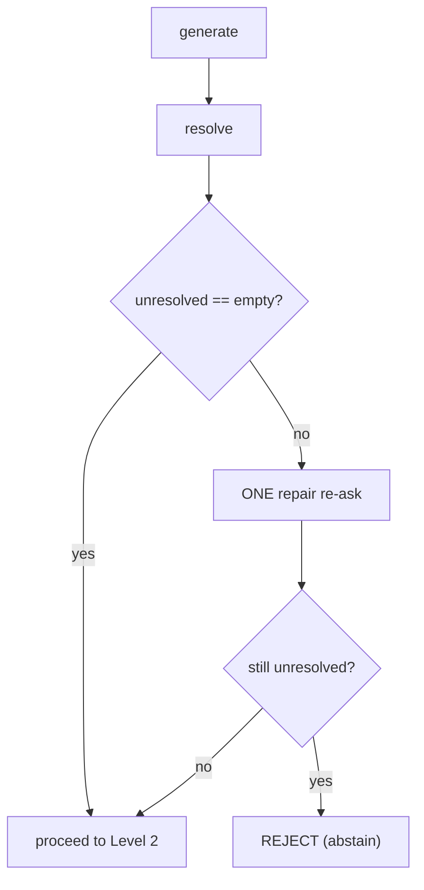
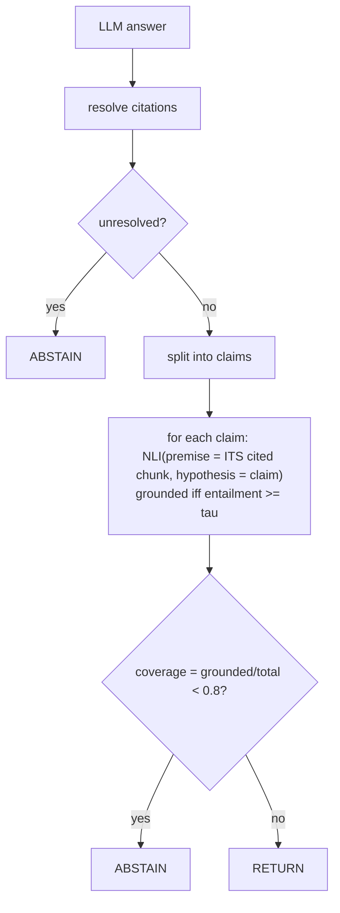

# Lecture 11: Inline Citations and NLI Groundedness Verification

> Your RAG system retrieves the right chunks, assembles a tidy token-budgeted context, and the LLM returns a confident, fluent paragraph. It even sprinkles `[2]` and `[4]` after each sentence, so it *looks* sourced. Ship it, and one of two things is quietly wrong: the answer cites `[7]` when you only injected 5 sources (dangling attribution), or it cites `[2]` for a claim that chunk `[2]` never actually says (a grounded-*looking* hallucination). These are two different bugs at two different reliability levels, and they need two different machines to catch. This lecture teaches both: **attribution** (does each claim name a real source?) — a prompting-plus-validation problem you solve with a regex and a resolver — and **groundedness/faithfulness** (is each claim actually *supported* by the source it names?) — which needs a separate verifier model. You'll build the attribution resolver, run a local NLI cross-encoder to check entailment per claim, wire the "say I don't know" abstention policy that is the single highest-leverage reliability feature in RAG, and tune the coverage threshold honestly with precision/recall instead of vibes.

**Prerequisites:** The two RAG pipelines (Lecture 1), context assembly and token budgeting (Lecture 10), basic transformer/classifier intuition, and comfort with regex and simple probability. · **Reading time:** ~30 min · **Part of:** Retrieval-Augmented Generation, Week 3

## The core idea (plain language)

There are **two distinct reliability levels**, and conflating them is the root of most "but it had citations!" incidents.

**Level 1 — Attribution.** The answer *names* which chunk each claim came from: a bracketed marker `[2]` that maps to a specific `chunk_id`. This is purely a bookkeeping question — *does the citation point at a real, retrieved source?* It says nothing about whether the source backs the claim. Attribution is a **prompting + validation** problem: you tell the model to cite, then you parse what it emitted and *resolve* every citation against the ids you actually gave it. A `[7]` that maps to nothing is a hard failure. You need no extra model for this — just a regex and a set-membership check.

**Level 2 — Groundedness (a.k.a. faithfulness).** Each claim is *actually supported* by the chunk it cites. The model can cite `[2]` — a real, retrieved chunk — for a sentence that chunk flatly does not support. That's a hallucination wearing a citation's clothing, and it is *more* dangerous than an uncited hallucination because the citation manufactures false trust. Detecting this requires a **verifier**: something that reads the claim and the cited evidence *together* and judges "does the evidence entail this?" You cannot prompt your way out of this — the same model that hallucinated the claim will happily rate its own claim as well-supported.

Here's the mental model to burn in:

> **Attribution** = "the footnote points at a real book on the shelf." (cheap, deterministic, regex)
> **Groundedness** = "the book actually says what the footnote claims." (needs a reader — an NLI model)

A citation can pass Level 1 and fail Level 2. That gap is exactly where confident, well-formatted, wrong answers live. The verifier's whole job is to close it.

And the payoff of both levels is a single policy: **abstention**. If any citation is unresolved (Level 1 fails) OR the fraction of grounded claims falls below a threshold (Level 2 fails), you do *not* return the answer — you return a templated "I don't have enough grounded information to answer that," plus the offending claims logged for review. Returning a wrong answer costs you trust; returning "I don't know" costs you a little coverage. In every serious RAG deployment, that trade favors abstention.

## How it actually works (mechanism, from first principles)

### Step 0 — inject sources with stable ids

Before generation, the context you assemble tags each chunk with an id the model can cite. The convention is dead simple:

```
[1] The connect() call uses a default timeout of 30 seconds.
[2] The read() timeout defaults to 60 seconds and is tunable in config.
[3] Retry logic wraps the connect attempt with exponential backoff.
```

Each line is `[{id}] {text}`. Keep a map `id -> chunk_id` on your side so a citation resolves back to real provenance (source file, page). The id the model sees (`1..N`) is a *local* index into this specific prompt — don't hand it your database UUIDs; small integers are what models cite reliably.

### Step 1 — the attribution prompt

You then instruct the model, roughly:

> *"Answer the question using ONLY the numbered sources above. After each claim, cite the source id(s) in square brackets, e.g. `[2]`. If the sources do not contain the answer, say you don't know. Do not use any outside knowledge."*

Two things are doing work here. "ONLY the sources" fights the model's urge to fill gaps from parametric memory. "cite ... after each claim" gives you the per-claim attribution you'll verify in Step 3. This is necessary but *not sufficient* — the prompt is a request, not a guarantee. Models routinely cite `[5]` when 4 sources exist, cite the wrong source, or forget to cite. That's why Step 2 exists.

### Step 2 — parse and RESOLVE citations (the Level-1 gate)

Extract every bracketed marker with a regex and check each against the set of ids you injected:

```python
import re

def resolve_citations(answer: str, valid_ids: set[str]):
    cited = set(re.findall(r"\[(\w+)\]", answer))     # e.g. {"1","2","7"}
    unresolved = cited - valid_ids                    # {"7"} if only 1..5 exist
    return cited, unresolved
```

If `unresolved` is non-empty, the answer references a source that does not exist. **This is a hard failure, not a warning.** The response path:



You give the model exactly **one repair attempt** — re-ask with a pointed correction ("You cited [7], but only sources [1]-[5] exist. Rewrite citing only valid sources.") — then reject if it still dangles. Why one and not a loop? Because a model that hallucinates a source twice is telling you the answer isn't in the corpus; retrying is just burning tokens on a coin flip. The critical engineering stance: **an unvalidated citation is worse than no citation at all.** It looks authoritative and points at nothing. Never ship citations you didn't resolve.

### Step 3 — split the answer into atomic claims

Groundedness is checked *per claim*, not per answer, because an answer is grounded only if *all* its claims are. First, decompose:

- **Cheap:** sentence-split with a regex or `nltk.sent_tokenize`. Fast, local, good enough to start.
- **Better:** LLM claim decomposition — ask a model to rewrite the answer as a list of atomic, self-contained factual statements. This handles the case where one sentence carries two claims ("The connect timeout is 30s and retries use backoff") that cite different sources, and it resolves pronouns ("It defaults to 60s" → "The read timeout defaults to 60s"). More faithful, costs an LLM call.

Each claim carries the citation(s) attached to it in the answer. That attachment is what makes the next step correct.

### Step 4 — NLI entailment, per claim, against ITS OWN cited chunk

For each claim, take the **union of the chunks that claim cites** as the *premise*, and the claim as the *hypothesis*. Run a Natural Language Inference model — a cross-encoder that reads `(premise, hypothesis)` together and outputs three scores:

- **entailment** — the premise supports the hypothesis.
- **neutral** — the premise neither supports nor contradicts (this is the usual hallucination signature — the evidence just doesn't say it).
- **contradiction** — the premise says the opposite.

A claim is **grounded iff `top_label == entailment` and its confidence ≥ a threshold.** Anything else (neutral, contradiction, or low-confidence entailment) is ungrounded.

```python
from sentence_transformers import CrossEncoder
nli = CrossEncoder("cross-encoder/nli-deberta-v3-base")   # local, CPU-fine

def is_grounded(claim: str, premise: str, tau: float = 0.6):
    scores = nli.predict([(premise, claim)])[0]           # [contra, entail, neutral] (check model's label order!)
    label = ["contradiction", "entailment", "neutral"][scores.argmax()]
    return label == "entailment" and scores.max() >= tau
```

Named models for this, all runnable locally on CPU:
- `cross-encoder/nli-deberta-v3-base` — the sentence-transformers default.
- `MoritzLaurer/DeBERTa-v3-base-mnli-fever-anli` — trained on MNLI + FEVER + ANLI, and FEVER is *fact-verification* data, which makes it a strong fit for "does this evidence support this claim."

> **The single most important pitfall in this entire lecture:** score each claim against **its own cited chunk**, NOT the whole assembled context. If you use the full context as premise, then some *other* chunk in the window may entail the claim even though the *cited* chunk doesn't — and the hallucination hides. Concretely: claim cites `[2]`, chunk `[2]` doesn't support it, but chunk `[5]` happens to. Score against the whole context → "entailed" → you pass a mis-attributed claim. Score against `[2]` only → "neutral" → you catch it. The premise must be exactly what the claim *claims* to be sourced from.

### Step 5 — coverage and the abstention policy

Aggregate into one number:

```
coverage = grounded_claims / total_claims
```

Then apply the policy:

```
if unresolved_citations OR coverage < THRESHOLD (e.g. 0.8):
    return ABSTENTION_TEMPLATE + log(offending_claims)
else:
    return answer_with_citations
```

That's it. The whole reliability apparatus reduces to: *resolve the footnotes, verify each claim against its own footnote, and abstain if too many claims are unbacked.*



## Worked example

**Query:** *"What are the default connect and read timeouts?"* You inject 3 sources:

```
[1] The connect() call uses a default timeout of 30 seconds.
[2] The read() timeout defaults to 60 seconds, tunable in config.
[3] Retry logic wraps the connect attempt with exponential backoff.
```

**Model answer:**
> "The connect timeout defaults to 30 seconds [1]. The read timeout defaults to 60 seconds [2]. Both timeouts support IPv6 negotiation [4]."

**Level 1 — resolve.** Citations found: `{1, 2, 4}`. Valid ids: `{1, 2, 3}`. `unresolved = {4}`. Hard failure. One repair re-ask: *"You cited [4], but only [1]-[3] exist."* Suppose the model returns:
> "The connect timeout defaults to 30 seconds [1]. The read timeout defaults to 60 seconds [2]. Both timeouts support IPv6 negotiation [3]."

Now citations `{1,2,3}` all resolve. Proceed.

**Level 2 — split into 3 claims and verify each against its own citation:**

| # | Claim | Cited | Premise (cited chunk) | NLI top label | Grounded? |
|---|---|---|---|---|---|
| 1 | connect timeout defaults to 30s | [1] | "connect()... 30 seconds" | entailment (0.95) | ✅ |
| 2 | read timeout defaults to 60s | [2] | "read()... 60 seconds" | entailment (0.93) | ✅ |
| 3 | both timeouts support IPv6 negotiation | [3] | "Retry logic wraps connect with backoff" | neutral (0.88) | ❌ |

**Coverage** = 2 / 3 = **0.67**. With threshold 0.8, this **abstains**. The system returns the template and logs claim #3 ("both timeouts support IPv6 negotiation — cited [3], NLI=neutral") for review.

Note what just happened: claim #3 cited a *real, resolved* chunk. Level 1 was perfectly happy — the footnote pointed at a real book. Only Level 2 caught that the book doesn't say it. This is the exact bug attribution alone can't see. And note the *counterfactual*: if you'd scored claim #3 against the **whole** context, chunk `[1]` or `[2]` mentioning timeouts might have nudged the NLI toward weak entailment, and the IPv6 fabrication would have slipped through. Scoping the premise to `[3]` only is what exposes it.

## How it shows up in production

- **Unresolved citations are common and silent.** LLMs emit out-of-range ids more than engineers expect — especially when the answer is partly ungrounded (the model invents a source to justify an invented claim). If you're not resolving, you're shipping fake provenance. The fix is ~10 lines and belongs on the hot path.
- **Abstention is the highest-leverage reliability feature you can add.** In most domains — support, legal, medical, finance — a confident wrong answer is far more expensive than "I don't know." Wiring coverage-based abstention converts your worst failure mode (authoritative hallucination) into your least-bad one (a miss the user can escalate). This is *the* feature to ship first.
- **NLI verification adds latency, but it's cheap and local.** An NLI cross-encoder runs on CPU in tens of ms per `(premise, claim)` pair. An answer with 5 claims = 5 forward passes = a few hundred ms, no GPU, no API. Compared to a second LLM-judge call, local NLI is far cheaper and lower-latency — reach for the LLM judge only when claims are complex/multi-hop and DeBERTa-scale NLI mislabels them.
- **Claim decomposition quality caps verification quality.** If your splitter leaves a two-fact sentence intact, the NLI model sees a hypothesis that's half-supported and returns a muddy label. Garbage claims in, garbage verdicts out. When precision matters, invest in LLM decomposition.
- **The coverage threshold is a product decision with a measurable cost.** Raising it abstains more (higher precision on "grounded," lower answer coverage); lowering it answers more (more hallucinations slip). You will be asked "why did it refuse?" — have the labeled numbers ready.
- **Log every abstention with its offending claims.** These logs are gold: they're your retrieval gaps (missing content), your chunking failures, and your threshold-tuning dataset, all in one stream.

## Common misconceptions & failure modes

- **"It has citations, so it's grounded."** The core confusion this lecture kills. Citations that *resolve* (Level 1) say nothing about *support* (Level 2). A resolved `[2]` on an unsupported claim is a grounded-looking hallucination — the most dangerous output your system can produce, because the citation manufactures trust.
- **"I'll verify against the full context."** The critical pitfall. Using the whole assembled window as the NLI premise lets *any* chunk entail the claim, hiding both hallucinations and mis-attributions. Always score a claim against the **union of its own cited chunks** — the thing it *claims* to be sourced from — and nothing else.
- **"Let the LLM grade its own groundedness in the same call."** The generator that produced the claim is the worst judge of whether the claim is grounded; it's already committed. Groundedness needs an *independent* verifier (a separate NLI model, or at minimum a separate LLM-judge call with a strict entailment rubric).
- **"Loop the repair until citations resolve."** One repair, then reject. Repeated dangling citations mean the answer isn't in the corpus; looping burns tokens and eventually coaxes a plausible-but-wrong answer. Cap at one.
- **"High entailment score = high confidence the fact is true."** No — NLI checks *entailment relative to the premise*, not *truth in the world*. If your cited chunk itself is wrong, NLI will happily confirm the claim is entailed by it. Groundedness ≠ correctness; it means "faithful to the source." (Source correctness is a corpus/retrieval problem, not an NLI one.)
- **"Pick the threshold that looks good."** Threshold theater. τ=0.5 passes almost everything (false confidence); τ=0.95 abstains constantly (unusable). See the cheat sheet for the honest way.
- **Label-order bug.** Different NLI checkpoints order their output logits differently (some are `[contradiction, entailment, neutral]`, others differ). Read the model card and verify with a known-entailed and known-contradicted pair before trusting `argmax`. Getting this wrong silently inverts your whole verifier.
- **Truncation.** NLI cross-encoders have a max sequence length (often 512 tokens for premise+hypothesis combined). A long cited chunk gets truncated — you may be scoring the claim against only the first half of the evidence. Keep premises within the window or the tail is invisible.

## Rules of thumb / cheat sheet

- **Two levels, two mechanisms:** attribution = regex-resolve citations against injected ids (deterministic); groundedness = NLI entailment per claim (a model). Do both.
- **Inject sources as `[{id}] {text}`** with small integer ids; keep an `id -> chunk_id` map for real provenance. Don't hand the model your UUIDs.
- **Resolve every citation.** `unresolved = cited_ids - valid_ids`. Non-empty → **one** repair re-ask → still non-empty → reject. Unvalidated citations are worse than none.
- **Split into atomic claims** (nltk/regex to start, LLM decomposition when precision matters). Verify per claim, never per whole answer.
- **Premise = the claim's OWN cited chunks, never the whole context.** This is the pitfall that hides hallucinations.
- **Grounded iff `top_label == entailment` AND `confidence ≥ τ`.** Start τ ≈ 0.6, then tune.
- **Local NLI defaults:** `cross-encoder/nli-deberta-v3-base` or `MoritzLaurer/DeBERTa-v3-base-mnli-fever-anli`. CPU-fine, ~tens of ms/pair.
- **Verify the label order** for your checkpoint with a known-entailed/known-contradicted pair before trusting argmax.
- **Coverage = grounded/total.** Abstain if `coverage < ~0.8` OR any unresolved citation. This abstention is the #1 reliability feature — ship it first.
- **Tune the threshold honestly:** hand-label ~50-100 (claim, evidence) pairs as grounded/not, then report **precision and recall of the "grounded" decision** at each τ and pick the point that matches your risk tolerance. Never pick by vibes.
- **Log every abstention + its offending claims** — it's your retrieval-gap and threshold-tuning dataset.

## Connect to the lab

Week 3 Steps 2-4 build exactly this stack: `citations.py` injects `[{id}] {text}`, prompts "answer using ONLY the sources, cite the id after each claim," then regex-parses `\[(\w+)\]` and resolves against retrieved ids (one repair, then reject); `verify_nli.py` splits the answer into atomic claims and runs `CrossEncoder("cross-encoder/nli-deberta-v3-base")` per claim against **its own cited chunks**, emitting per-claim labels and `coverage`; `answer_policy.py` returns the abstention template when `coverage < 0.8` or any citation is unresolved. `test_citations.py` proves dangling citations are rejected and `test_verify.py` proves a fabricated claim is labeled ungrounded — the two levels, made into passing tests.

## Going deeper (optional)

- **Sentence-Transformers — Cross-Encoder / NLI documentation** (`sbert.net`). How to load and run NLI cross-encoders, output label semantics, and batching. Start here for the code.
- **Hugging Face model cards:** `cross-encoder/nli-deberta-v3-base` and `MoritzLaurer/DeBERTa-v3-base-mnli-fever-anli` (`huggingface.co`) — read the label order and training data (MNLI/FEVER/ANLI) so you know what "entailment" was trained to mean.
- **RAGAS documentation** (`docs.ragas.io`), "Faithfulness" metric — the productionized version of claim-decomposition + entailment scoring you'll wire in Week 4; read how it decomposes answers into statements.
- **The FEVER shared task** (search "FEVER fact extraction and verification") — the canonical framing of "verify a claim against evidence" that fact-verification NLI models are trained on.
- **Google/DeepMind "Attributed Question Answering" / attribution eval** — search "attribution evaluation LLM AIS attributable to identified sources" for the research framing of Level-1 vs Level-2 (the AIS — Attributable to Identified Sources — formulation).
- Search queries when you hit friction: "NLI entailment RAG faithfulness verifier CPU", "claim decomposition atomic facts LLM", "citation resolution hallucination LLM validate", "faithfulness threshold precision recall tuning".

## Check yourself

1. State the difference between *attribution* and *groundedness* in one sentence each, and give a concrete example of an answer that passes attribution but fails groundedness.
2. Your model cites `[6]` but you only injected 4 sources. What level of check catches this, what's the exact detection logic, and what's the response policy?
3. Why must you score each claim against *its own cited chunk* rather than the whole assembled context? Describe the specific failure that using the whole context causes.
4. An NLI model returns `entailment=0.55, neutral=0.40, contradiction=0.05` for a claim, and your threshold τ is 0.6. Is the claim grounded? What does the answer policy do if this is the only failing claim out of five?
5. A teammate proposes asking the *generator* model, in the same call, to also output a "groundedness: yes/no" flag per sentence, to save a model. Give the one-sentence objection.
6. You need to pick the coverage threshold. Describe the honest procedure and what two numbers you'd report at each candidate threshold.

### Answer key

1. **Attribution** = the answer names a real, retrieved source for each claim (the footnote points at a book that's on the shelf). **Groundedness** = the cited source actually supports the claim (the book says what the footnote claims). Example: "Both timeouts support IPv6 negotiation [3]" where chunk [3] is a real retrieved chunk about retry backoff — the citation resolves (attribution passes) but the chunk never mentions IPv6 (groundedness fails).
2. **Level 1 (attribution/resolution)** catches it. Detection: parse citations with `re.findall(r"\[(\w+)\]", answer)`, compute `unresolved = cited_ids - valid_ids`; here `{6} - {1,2,3,4} = {6}`, non-empty → hard failure. Policy: **one** repair re-ask pointing out the invalid id; if it still dangles, **reject/abstain**. Never ship the unresolved citation.
3. Because the claim is only genuinely supported if the chunk *it cites* supports it. If you use the whole context as premise, a *different* chunk in the window can entail the claim even though the cited one doesn't — so a hallucinated or mis-attributed claim gets marked "grounded" and the failure hides. Scoping the premise to the claim's own cited chunk(s) is what surfaces the mismatch.
4. **Not grounded** — top label is entailment (0.55) but 0.55 < τ (0.6), and grounded requires `top_label == entailment AND confidence ≥ τ`. With this the only failing claim of five, coverage = 4/5 = 0.8. If the policy threshold is `< 0.8`, 0.8 is *not* below it, so it would return the answer (right at the boundary — a reason to define the comparison and boundary explicitly and, ideally, still log the near-miss claim).
5. The generator that produced the claim is the worst possible judge of whether the claim is grounded — it's already committed to the claim and will rubber-stamp its own output; groundedness needs an *independent* verifier.
6. Hand-label a set of ~50-100 (claim, cited-evidence) pairs as grounded / not-grounded (ground truth). For each candidate τ, run the NLI verifier and compute the **precision** (of claims it calls grounded, how many truly are) and **recall** (of truly grounded claims, how many it catches) of the "grounded" decision. Pick the τ whose precision/recall trade matches your risk tolerance (high precision if a wrong answer is costly), and report both numbers — never pick τ by eyeballing outputs.
