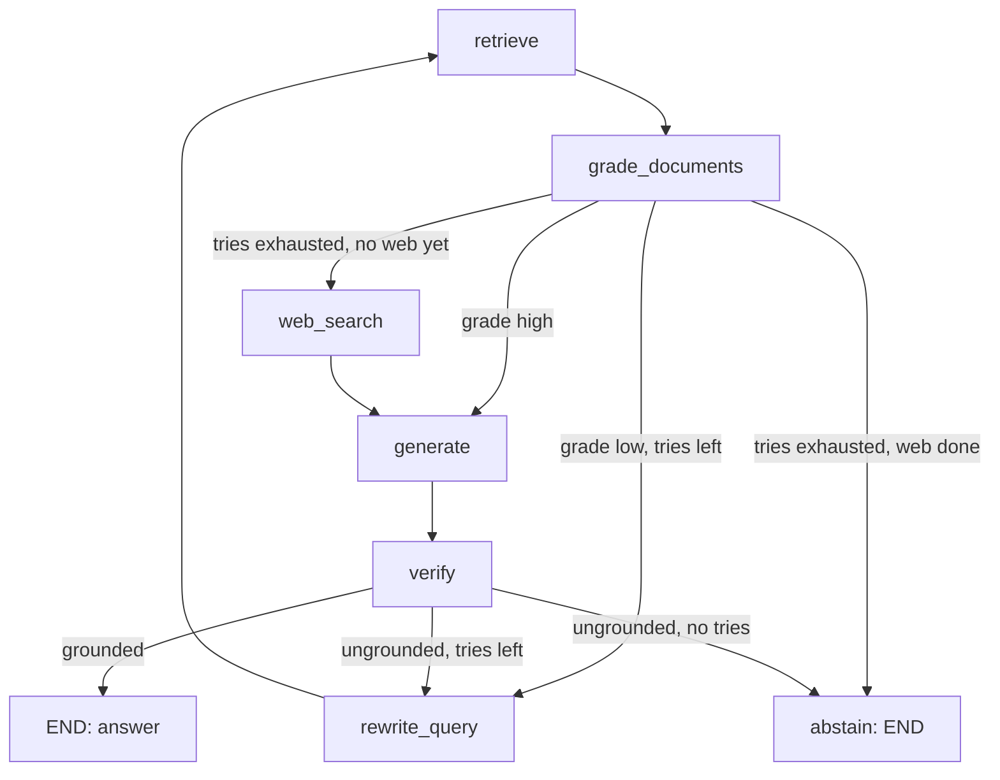

# Lecture 12: Corrective and Agentic RAG with LangGraph

> Single-shot RAG is a straight line: retrieve once, stuff, generate, ship. When retrieval whiffs — wrong chunks, empty corpus, a query the embedding model misreads — a straight line has no way to notice or recover. It confidently hallucinates on garbage context. This lecture teaches the loop that fixes it: a system that *grades its own retrieval*, rewrites the query and tries again, falls back to the web when the corpus is genuinely empty, verifies that the answer is grounded, and — critically — knows when to stop and say "I don't know." You will model this as a **LangGraph** state machine and, just as importantly, learn to bound the loop so it can't burn tokens forever. After this you can build a corrective-RAG graph with explicit edge conditions, per-node instrumentation, and a terminal guarantee.

**Prerequisites:** Lectures on retrieval (hybrid/rerank), grounding, and NLI verification (Week 3 so far). Python, basic async. · **Reading time:** ~28 min · **Part of:** RAG Phase, Week 3

## The core idea (plain language)

Naive RAG treats the retriever as an oracle: whatever comes back top-k *is* the evidence, and the LLM's only job is to phrase it. That assumption is the bug. Retrieval fails constantly — the fact isn't in your corpus (failure point #1), it ranks below k (#2), or the user's phrasing doesn't match how the doc says it. When retrieval fails, single-shot RAG has no move: it generates from irrelevant chunks and produces a fluent, wrong, confident answer. That is the worst possible failure — wrong *and* trusted.

Corrective RAG adds a feedback loop borrowed from control systems: **measure, then correct.** After retrieving, a grader scores each document for relevance. If enough docs are good, generate. If not, don't just plow ahead — *act on the signal*: rewrite the query into something that retrieves better and try again; if repeated rewrites still fail, fall back to web search; if even that fails, abstain. **CRAG** (Corrective Retrieval-Augmented Generation) and **Self-RAG** are the two named research patterns here. CRAG focuses on grading retrieved docs and correcting (rewrite / web-fallback). Self-RAG trains the model to emit "reflection tokens" that decide whether to retrieve, and whether output is supported. You don't need their exact training recipes — you need the *engineering shape*: a graph of nodes and conditional edges implementing `retrieve → grade → (rewrite/re-retrieve/web) → generate → verify → loop-or-end`.

**LangGraph** is the framework that makes this natural. Where a plain chain is a fixed sequence, LangGraph is a `StateGraph`: nodes are functions that read and write a shared state dict, and **conditional edges** route based on that state. That is exactly a control-flow graph with branches and loops — which is exactly what corrective RAG is.

## How it actually works (mechanism, from first principles)

### State is the whole game

LangGraph nodes don't return "the next node." They return a partial update to a shared **state** object, and the graph's edges decide where to go next by reading that state. Our state:

```python
from typing import TypedDict, List
class RAGState(TypedDict):
    question: str          # possibly rewritten over iterations
    original_question: str # never mutated; used for final grounding check
    docs: List[dict]       # current retrieved+kept docs
    generation: str        # the draft answer
    grade: float           # fraction of docs judged relevant
    tries: int             # rewrite/re-retrieve counter — the loop bound
    used_web: bool         # did we already fall back to web?
    trace: List[dict]      # per-node instrumentation (see below)
```

`tries` is not decoration — it is the safety mechanism that makes the loop terminate. More on that in the safeguards.

### The nodes

**`retrieve`** — run your Week-1/2 retriever (hybrid + rerank) on `state["question"]`, write the candidates to `docs`.

**`grade_documents`** — the heart of CRAG. For each retrieved doc, ask: *is this actually relevant to the question?* Two implementations:

- **LLM grader**: a cheap model with a strict binary prompt — "Does this document contain information relevant to the question? Answer yes/no." One call per doc (or batch them). Flexible, ~200-500 tokens/doc, adds latency and $.
- **NLI grader**: a local cross-encoder (`cross-encoder/nli-deberta-v3-base`) scoring entailment/relevance between question and doc. Runs on CPU, ~free, deterministic, no API. Slightly blunter than an LLM but far cheaper — reuse the same NLI model you built for the groundedness verifier.

Keep only docs graded relevant. Compute `grade = kept / retrieved`. This node *filters* and *scores* in one pass.

**`rewrite_query`** — an LLM rewrites `question` to retrieve better: expand abbreviations, add synonyms, make an underspecified query concrete. Increment `tries`. This is the "corrective" action.

**`web_search`** — the escape hatch when the corpus genuinely lacks the answer. Use **Tavily** (`TavilySearchResults`, free tier, `TAVILY_API_KEY`) or **DuckDuckGo** (`duckduckgo-search`, zero-key) to fetch external snippets, treat them as `docs`, set `used_web = True`.

**`generate`** — assemble context from `docs`, produce an answer with inline citations (Lecture 11 machinery).

**`verify`** — run the NLI groundedness verifier: is each claim entailed by its cited evidence? Returns grounded / ungrounded.

### The conditional edges (state them exactly)

This is the part interviewers and production incidents both hinge on. The edge **out of `grade_documents`**:

```
if grade >= RELEVANCE_THRESHOLD (e.g. >= 0.5, "enough relevant docs"):
        -> generate
elif tries < MAX_TRIES (e.g. 2):
        -> rewrite_query        (which increments tries, then -> retrieve)
elif not used_web:
        -> web_search           (-> generate)
else:
        -> abstain (END)        # terminal guarantee
```

And the edge **out of `verify`**:

```
if grounded:
        -> END                  (return answer + citations)
elif tries < MAX_TRIES:
        -> rewrite_query        (-> retrieve, try to ground it better)
else:
        -> abstain (END)        # terminal guarantee
```

Read those two ladders carefully. Every branch either makes forward progress (generate/END) or consumes a bounded resource (`tries`) or the one-shot web fallback (`used_web`). There is **no branch that loops without decrementing a budget.** That is what guarantees termination.



### Building it

```python
from langgraph.graph import StateGraph, END

g = StateGraph(RAGState)
g.add_node("retrieve", retrieve)
g.add_node("grade_documents", grade_documents)
g.add_node("rewrite_query", rewrite_query)
g.add_node("web_search", web_search)
g.add_node("generate", generate)
g.add_node("verify", verify)

g.set_entry_point("retrieve")
g.add_edge("retrieve", "grade_documents")
g.add_conditional_edges("grade_documents", route_after_grade,
    {"generate": "generate", "rewrite": "rewrite_query",
     "web": "web_search", "abstain": END})
g.add_edge("rewrite_query", "retrieve")
g.add_edge("web_search", "generate")
g.add_conditional_edges("verify", route_after_verify,
    {"end": END, "rewrite": "rewrite_query", "abstain": END})
g.add_edge("generate", "verify")
app = g.compile()
```

`route_after_grade` and `route_after_verify` are plain Python functions that read state and return one of the string keys. That's the whole framework: nodes mutate state, router functions read it and name the next hop.

### Instrumentation as a first-class node concern

You cannot debug or cost a loop you can't see. Make every node record `{node, in_tokens, out_tokens, latency_ms}` into `state["trace"]`. A decorator keeps it clean:

```python
import time
def instrument(name):
    def deco(fn):
        def wrapped(state):
            t0 = time.perf_counter()
            out = fn(state)
            entry = {"node": name,
                     "in_tokens":  out.pop("_in_tokens", 0),
                     "out_tokens": out.pop("_out_tokens", 0),
                     "latency_ms": round((time.perf_counter()-t0)*1000, 1)}
            out["trace"] = state.get("trace", []) + [entry]
            return out
        return wrapped
    return deco
```

LangGraph's `app.stream(input)` emits state after each node, and its checkpointer persists state between steps — so per-step tracing is native, not bolted on. Dump `state["trace"]` as JSON at the end and you have a complete, replayable cost/latency ledger for the run.

## Worked example

Query: *"What's the max payload for the connector's batch endpoint?"* Corpus is an API manual. `MAX_TRIES = 2`, `RELEVANCE_THRESHOLD = 0.5`.

**Iteration 1 — retrieve.** Top-5 come back, but "batch endpoint" is called "bulk ingest" in the docs, so dense retrieval drifts. `grade_documents` (NLI) judges 1 of 5 relevant. `grade = 0.2 < 0.5`. `tries=0 < 2` → **rewrite_query**.

**rewrite_query** → *"maximum request body size / payload limit for bulk ingest API"*. `tries` becomes 1.

**Iteration 2 — retrieve.** Now the "bulk ingest" section surfaces. `grade_documents`: 3 of 5 relevant. `grade = 0.6 >= 0.5` → **generate**.

**generate** produces: *"The bulk ingest endpoint accepts up to 10 MB per request [2], batched in up to 500 records [4]."*

**verify** (NLI): claim 1 entailed by chunk [2] ✓; claim 2 entailed by chunk [4] ✓. Grounded → **END**.

Now the trace tells the cost story:

| node | in_tok | out_tok | latency_ms |
|---|---|---|---|
| retrieve | 0 | 0 | 40 |
| grade_documents | 1200 | 15 | 220 |
| rewrite_query | 60 | 30 | 180 |
| retrieve | 0 | 0 | 38 |
| grade_documents | 1200 | 15 | 210 |
| generate | 900 | 60 | 950 |
| verify | 700 | 6 | 190 |

Total ~1.8 s, ~4100 in-tokens. Single-shot RAG would have generated from the iteration-1 garbage and confidently returned the wrong number in ~1 s. The correction cost ~0.8 s and one extra retrieve+grade+rewrite — and turned a wrong answer into a right one. **That tradeoff is the entire value proposition of corrective RAG: you pay latency and tokens to buy correctness on the queries where retrieval would have silently failed.**

Now the counterfactual: suppose the payload limit *isn't in the corpus at all*. Iteration 1: grade 0.2 → rewrite (tries=1). Iteration 2: still 0.2 → rewrite (tries=2). Iteration 3: grade 0.2, but `tries=2` is not `< 2` and `used_web` is False → **web_search** → generate from web snippets → verify. If grounded, return with a clear "from web" provenance; if not, **abstain**. At no point does it loop forever, and at no point does it fabricate.

## How it shows up in production

- **Cost is multiplicative, not additive.** Each corrective iteration re-runs retrieve + grade + (rewrite). A grader that calls an LLM per doc over top-10, twice, is 20 grading calls before you generate once. On a paid API this dominates your bill. This is why the local NLI grader is the default: it moves the per-doc grading cost to ~free CPU and reserves LLM calls for rewrite and generate. Your trace JSON is how you catch a config where p95 queries silently do 3 loops.
- **Latency variance explodes.** Single-shot RAG has tight, predictable latency. A loop has a bimodal distribution: fast path (grade passes first try) vs slow path (rewrite → re-retrieve → maybe web). Your p50 barely moves; your p95/p99 balloon. SLA and timeout budgets must be set against the *worst* path (`MAX_TRIES` full loops + web + generate + verify), not the average.
- **The web fallback is a trust and security boundary.** Corpus chunks are your data; web results are untrusted internet text — prime indirect-prompt-injection territory. Delimit them as untrusted data, never let them trigger tools, and mark web-sourced answers distinctly so users know the answer left your knowledge base.
- **Grader threshold is a precision/recall dial with real money attached.** Too high → the loop rewrites/web-searches on queries that were actually fine, burning tokens. Too low → garbage passes to generate and you're back to confident hallucination. Tune it on a labeled set, not by vibes, and log grade distributions in production.
- **Abstention is a feature, not a bug — but it's a product decision.** A system that abstains 30% of the time may be *correct* but useless. The abstain rate is a KPI: watch it, and if it's high, the fix is usually retrieval/corpus coverage, not loosening the loop.

## Common misconceptions & failure modes

- **"The loop will figure it out eventually."** No. Without a `tries` cap and a terminal edge, a query the corpus can't answer loops forever — rewrite produces a new query, which retrieves nothing relevant, which triggers rewrite. This is the #1 way agentic RAG bankrupts a token budget overnight. **Cap iterations AND guarantee a terminal abstain/web edge.**
- **Grading against the whole context instead of per-doc.** `grade_documents` must score each doc individually. Averaging or scoring the concatenation lets one good doc mask four bad ones (or vice versa), and you lose the ability to *filter*.
- **Rewriting the query but grading against the rewritten one at the end.** Keep `original_question` immutable. The final groundedness check and relevance should ultimately serve the *user's* question, not the machine-mangled rewrite that may have drifted off-topic.
- **Confusing grade_documents with verify.** They answer different questions. `grade_documents`: "is the *retrieved evidence* relevant to the question?" (a retrieval check, pre-generation). `verify`: "is the *generated answer* supported by its cited evidence?" (a grounding check, post-generation). You need both; they catch different failures.
- **Treating web fallback as free.** Every web call is latency + an API quota + untrusted content. It's the last resort, gated by `used_web` so it fires at most once.
- **No instrumentation.** Without the per-node trace, you can't tell a 3-loop expensive success from a 1-shot cheap one, can't attribute cost, and can't spot a rewrite that keeps making retrieval *worse*.

## Rules of thumb / cheat sheet

- **`MAX_TRIES = 2`** rewrites is the sane default. 1 is often too few; 3+ rarely helps and multiplies cost. (Approximate — tune per corpus.)
- **Relevance threshold ≈ 0.5** of docs kept as a starting point; tune on labeled data.
- **Grader:** local NLI cross-encoder by default (free, fast, deterministic); LLM grader only if NLI is too blunt for your domain.
- **Order of escalation:** rewrite (cheap) → re-retrieve → web (expensive, last) → abstain (terminal). Never web-first.
- **Two terminal guarantees, non-negotiable:** (1) every loop path decrements a bounded budget; (2) both `grade` and `verify` have an `abstain → END` branch.
- **Always keep `original_question` immutable.** Verify grounding against it.
- **Trace every node** with `{node, in_tokens, out_tokens, latency_ms}`; dump JSON per run.
- **Set SLA/timeouts against the worst path**, not the mean.
- **Mark web-sourced answers** distinctly; delimit web content as untrusted.

## Connect to the lab

This is the Week 3 centerpiece build (`graph/crag_graph.py` + `graph/nodes.py`): a `StateGraph` with state `{question, docs, generation, grade, tries}`, the exact edge conditions above out of `grade_documents` and `verify`, Tavily/DuckDuckGo web fallback, and per-node `{node, in_tokens, out_tokens, latency_ms}` traced to JSON. Prove at least one run exercises rewrite→re-retrieve and one hits web fallback (Definition of Done), then feed it to `bench_multihop.py` to show CRAG beats single-shot on the hops single-shot misses.

## Going deeper (optional)

- **LangGraph official docs** — root: `langchain-ai.github.io/langgraph`. Read the "StateGraph", "conditional edges", and "streaming/checkpointing" pages; the repo ships an official **Corrective RAG** and **Self-RAG** tutorial notebook — search "LangGraph corrective RAG tutorial".
- **CRAG paper** — Yan et al., *"Corrective Retrieval Augmented Generation"* (2024). Search that exact title.
- **Self-RAG paper** — Asai et al., *"Self-RAG: Learning to Retrieve, Generate, and Critique through Self-Reflection"* (2023). Search that title.
- **Tavily docs** — `docs.tavily.com` for the search API + free-tier limits.
- **Search queries:** "LangGraph conditional edges example", "CRAG vs Self-RAG comparison", "agentic RAG loop termination guarantee".

## Check yourself

1. State the exact conditions on every edge out of `grade_documents`, in order.
2. What two independent mechanisms guarantee the corrective loop terminates? Remove either one — what breaks?
3. `grade_documents` and `verify` both "check relevance." Precisely, what different question does each answer, and where in the pipeline does each sit?
4. Why prefer a local NLI grader over an LLM grader for `grade_documents` specifically (as opposed to for `generate`)?
5. Your p50 latency looks fine but p99 tripled after shipping CRAG. What's the mechanism, and what does the per-node trace let you diagnose?
6. Why must `original_question` stay immutable across rewrites, and what fails if you verify grounding against the rewritten query instead?

### Answer key

1. In order: **grade ≥ threshold → generate**; else **tries < MAX_TRIES → rewrite_query** (which increments tries, then loops to retrieve); else **not used_web → web_search → generate**; else **abstain → END**. Every branch either advances or spends a bounded budget.
2. (a) A **bounded counter** (`tries < MAX_TRIES`) caps rewrite/re-retrieve loops; (b) a **terminal abstain edge** (plus one-shot `used_web` web fallback) guarantees a sink node with no outgoing loop. Remove the counter → rewrite loops forever on unanswerable queries (token bankruptcy). Remove the terminal abstain → when tries exhaust and web is used, there's no legal edge, so the graph can't end (or it fabricates).
3. **`grade_documents`** asks "is the *retrieved evidence* relevant to the question?" — a retrieval-quality check, *before* generation, used to filter docs and decide whether to correct. **`verify`** asks "is the *generated answer* actually supported by its cited evidence?" — a groundedness check, *after* generation. Different failures: bad retrieval vs hallucination-despite-good-context.
4. `grade_documents` runs **per doc, every iteration** — potentially dozens of scorings per query. An LLM grader makes that the dominant cost/latency term and adds nondeterminism. A local NLI cross-encoder is ~free on CPU, deterministic, and fast, so it's the right tool for high-volume per-doc scoring. `generate` runs once and needs fluent synthesis, so an LLM is justified there.
5. Corrective RAG has a **bimodal latency distribution**: most queries pass grading first try (fast, near single-shot p50), but a tail rewrites → re-retrieves → maybe web-searches, doing several full loops. That tail lands in p99. The per-node trace (`latency_ms` and iteration count per node) lets you see how many loops p99 queries took and which node dominated — e.g. web_search latency or repeated grade calls.
6. Rewrites can drift semantically off the user's actual intent to chase retrievability. If you verify grounding against the *rewritten* query, you can certify an answer that's grounded in evidence for a subtly different question than the user asked — grounded but off-target. Keeping `original_question` immutable ensures the final grounding/relevance judgment serves the user's real question.
