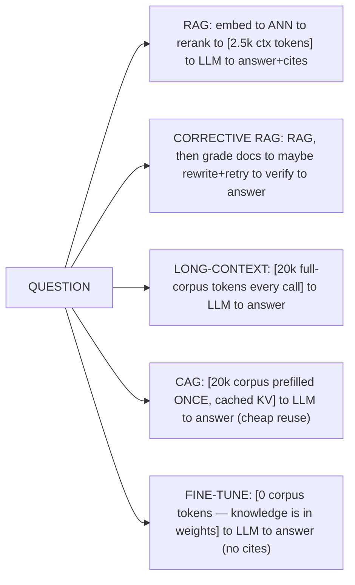

# Lecture 13: When NOT to Use RAG — Cost-Per-Answer Decisions

> By now you can build a genuinely good RAG system: layout-aware ingestion, hybrid retrieval, reranking, grounded generation with citations, an NLI verifier, a corrective loop. That competence is exactly the trap. When your only tool is a beautifully engineered retrieval pipeline, every knowledge problem looks like a retrieval problem — and you end up standing up a vector DB, a reranker service, and a corrective LangGraph to answer questions over a 30-page handbook that would fit *whole* into a single prompt. This lecture is the counterweight. It teaches you to see RAG as **one line item on a cost-per-answer spreadsheet**, next to long-context stuffing, cache-augmented generation, and fine-tuning — and to pick the cheapest approach that clears your quality bar, defended with numbers instead of architecture-astronautics. After it you'll be able to build the decision instrument (a $/answer table on a shared eval set), read it, and write the one-line recommendation a stakeholder will actually act on.

**Prerequisites:** The full Week 1–3 RAG pipeline (ingestion, retrieval, grounded generation, corrective RAG), token counting with `tiktoken`, basic arithmetic on token prices. · **Reading time:** ~26 min · **Part of:** Retrieval-Augmented Generation, Week 3

## The core idea (plain language)

RAG exists to solve one specific problem: **your knowledge is too big to fit in the prompt, changes too often to bake into weights, and you need to cite where each fact came from.** When all three hold, retrieval is the right tool. When they *don't*, RAG is often a strictly worse choice hiding behind a more impressive architecture diagram.

The reason it's easy to over-reach is that RAG's costs are diffuse and mostly hidden, while its benefits are visible. The benefits — "we only send the relevant 2,500 tokens, not the whole 200k corpus" — show up right on the token bill. The costs are spread across places you don't look at during a demo:

- **Retrieval infrastructure** you now run and pay for forever: a vector DB (RAM-resident indexes are expensive), an embedding model, possibly a reranker service on a GPU.
- **Extra latency** on the critical path: embed the query, ANN lookup, rerank top-50, *then* call the LLM. Every hop is a p99 tail risk.
- **A large-ish prompt on every single call** anyway — retrieved chunks plus instructions plus few-shot examples are rarely tiny.
- **Engineering and eval surface**: chunking, the 7 failure points, citation resolution, groundedness — all code you maintain and all places quality leaks.
- **A whole class of failures that simply don't exist without retrieval** (missed top-k, lost-in-the-middle, prompt injection via poisoned chunks).

The three alternatives each delete a different subset of that cost:

- **Long-context stuffing** — if the whole corpus fits the model window, put *all of it* in the prompt and skip retrieval entirely. You delete the infra, the chunking, and the "missed top-k" failure mode. The bill you keep: you pay for the whole corpus in input tokens *on every call*.
- **CAG (Cache-Augmented Generation)** — same as stuffing, but you **precompute and cache the model's KV/prefix for the static corpus** so repeated queries don't re-encode it. You trade retrieval for prompt caching on a fixed knowledge base: the corpus is prefilled once and cheap to reuse.
- **Fine-tuning / continued pretraining** — for *stable, high-frequency* knowledge and for *behavior/style/format*, bake it into the weights so it costs zero prompt tokens at inference. You delete the corpus from the prompt entirely; you pay a training cost up front and lose the ability to cite or to update without retraining.

The crisp rule of thumb, worth memorizing:

> **RAG for facts you must cite and that change. Fine-tune for behavior and format. Long-context (or CAG) for one-off or repeated whole-document reasoning over a corpus small enough to fit.**

Everything else in this lecture is about turning that qualitative rule into a **cost-per-answer number** so you can defend the call.

## How it actually works (mechanism, from first principles)

### Where each approach spends money and time

Every answer costs the sum of four things. Write them down as an equation, because it *is* the decision instrument:

```
cost_per_answer =  retrieval_cost            (infra amortized per query)
                +  input_tokens  × price_in  (everything you send)
                +  output_tokens × price_out (everything the model writes)
      and separately track:
   latency_p50   =  retrieval_latency + LLM_prefill + LLM_decode
```

The approaches differ almost entirely in the **input_tokens** term and the **retrieval_cost** term. Output tokens are roughly constant across approaches for the same question (the answer is the answer). So the whole fight is: *how many input tokens does it take to put the right knowledge in front of the model, and what infra do you pay to get there?*

Here is the same question routed through each approach, drawn:



### Long-context stuffing: the arithmetic

Take a 30-page employee handbook. Rough conversion: ~500–600 words per page, and English runs ~1.3 tokens per word, so 30 pages ≈ **~20,000 tokens** (order-of-magnitude; measure yours with `tiktoken`). A modern 200k-context model swallows that with room to spare.

Stuffing means: **skip retrieval, paste all 20k tokens, ask the question.** No chunking, no vector DB, no "did we retrieve the right paragraph" — the model sees *everything*, so recall is 100% by construction. The tradeoff is that you pay ~20,000 input tokens **on every call**, forever, whether the question needs one paragraph or the whole thing.

Contrast with RAG on the same handbook: retrieve top-5 chunks (~500 tokens each) = ~2,500 context tokens + ~500 tokens of instructions/question ≈ **~3,000 input tokens per call**. That's ~7× fewer input tokens than stuffing. *That token gap is the entire economic case for RAG* — and it only matters if you make enough calls for it to outweigh the infra and complexity you added to achieve it.

### CAG: pay for the prefill once

The waste in long-context stuffing is that the model **re-encodes the same 20k corpus tokens on every request**. A transformer's prefill turns those tokens into a KV cache (the key/value tensors every later token attends to). CAG's insight: for a *static* corpus, that KV cache is identical every time — so compute it once and reuse it.

Two ways this shows up in practice:

- **Provider prompt caching** (the practical path): Anthropic prompt caching, OpenAI's automatic prompt caching, Google Gemini context caching. You mark the big static corpus block as cacheable; the first call pays a small write premium, subsequent calls that reuse the identical prefix pay a **steeply discounted rate for the cached tokens** — commonly on the order of ~10% of the normal input price for cache reads (provider- and TTL-dependent; check the current docs). Only the fresh suffix (the user's actual question) is billed at full price.
- **Literal KV-cache reuse** (the research meaning of "CAG"): with an open-weights model you serve yourself, you can persist the corpus's KV cache to disk and load it, skipping the prefill compute entirely. This is the purest form of "trade retrieval for caching."

Either way, CAG turns long-context stuffing from "pay 20k input tokens every call" into "pay 20k once, then pay ~2k-worth every call" — while keeping stuffing's 100%-recall, no-infra simplicity. It shines exactly when the corpus is **fixed and queried repeatedly**.

### Fine-tuning: move knowledge into the weights

Fine-tuning (or continued pretraining) changes the model's parameters so the knowledge/behavior is *intrinsic* — zero prompt tokens at inference. The catch is what it's good and bad at:

- **Good at behavior and format**: tone, house style, always-emit-this-JSON-schema, domain phrasing, "answer like our support team." These are *patterns*, and patterns are exactly what gradient descent learns cheaply.
- **Bad at fresh, sparse facts you must cite.** A fine-tune blends knowledge into weights; it can't tell you *which document* a fact came from, it hallucinates confidently at the edges, and updating a single fact means another training run. New employee handbook this quarter? Retrain.

So fine-tuning wins for *stable, high-frequency* knowledge and for behavior — and loses precisely where RAG wins (citeable, changing facts).

## Worked example — the cost-per-answer benchmark

This is the instrument the whole lecture is building toward. Put token prices in a **constants file** so the whole team argues about one source of truth, not scattered magic numbers:

```python
# costs.py — ILLUSTRATIVE prices; replace with your provider's CURRENT numbers.
PRICE_IN        = 3.00 / 1_000_000   # $ per input token   (mid-tier model, example)
PRICE_OUT       = 15.00 / 1_000_000  # $ per output token
PRICE_IN_CACHED = 0.30 / 1_000_000   # cached-read input (~10% of PRICE_IN, provider-dependent)
RETRIEVAL_COST  = 0.0002             # $ per query: amortized vector-DB + embed infra (estimate)

def dollars(in_tok, out_tok, cached_in_tok=0, retrieval=0.0):
    return (retrieval
            + in_tok        * PRICE_IN
            + cached_in_tok * PRICE_IN_CACHED
            + out_tok       * PRICE_OUT)
```

Now run the *same eval set* through each pipeline and fill one table. The numbers below are **illustrative** (round token counts on the 30-page handbook, example prices) to show the shape of the decision — your `bench_costperanswer.py` produces the real ones:

| Approach | Accuracy | Grounded coverage | In tok | Out tok | $/answer | p50 latency |
|---|---|---|---|---|---|---|
| Single-shot RAG | 0.86 | 0.91 | 3,000 | 300 | **$0.0137** | ~1.2 s |
| Corrective RAG | 0.90 | 0.95 | 6,500 | 500 | **$0.0270** | ~3.5 s |
| Long-context stuffing | 0.88 | 0.93 | 20,500 | 300 | **$0.0660** | ~2.6 s |
| CAG (cached corpus) | 0.88 | 0.93 | 500 + 20k cached | 300 | **$0.0121** | ~1.1 s |

Read down the `$/answer` column and the story writes itself:

- **Single-shot RAG** is cheap per call (~$0.014) because its input is tiny — but that price *excludes* the infra you run and the eng you maintain, folded into `RETRIEVAL_COST` as a token estimate that never captures the real ops burden.
- **Corrective RAG** roughly doubles cost and triples latency (extra grade/verify/rewrite LLM calls) to buy a few points of accuracy and coverage. Worth it for high-stakes multi-hop; wasteful for simple lookup.
- **Long-context stuffing** is ~5× the per-call cost of RAG *purely* because you pay the whole 20k corpus every call — but it needed **zero retrieval infra**, hits 100% recall by construction, and has *no chunking or missed-top-k failures*.
- **CAG** is the quiet winner *for this shape of problem*: a small static corpus queried repeatedly. It matches stuffing's simplicity and recall, but because the 20k corpus is cached (~$0.30/1M read vs $3/1M fresh), its per-answer cost drops *below* even single-shot RAG — with none of RAG's infra.

The one-line recommendation the numbers support here:

> *For a 30-page static handbook answered repeatedly, CAG (or plain long-context with prompt caching) beats RAG on cost, latency, and simplicity, at equal quality. Build RAG only if the corpus grows past the context window or you need per-source citations.*

That is the deliverable. Not "we built RAG"; a defensible sentence backed by a table.

### The break-even that decides stuffing vs RAG

There's a clean crossover. Let `Q` = number of queries over the corpus's lifetime, `C_stuff` = corpus input tokens, `C_rag` = RAG's per-call context tokens, and `I_infra` = one-time cost to stand up and index the RAG stack (engineering + setup).

```
RAG total    ≈ I_infra + Q × (C_rag  × price_in + retrieval_cost + out×price_out)
STUFF total  ≈           Q × (C_stuff× price_in +                  out×price_out)
```

RAG only wins once `Q` is large enough that the per-call token savings `(C_stuff − C_rag) × price_in` pay back `I_infra`. For a small corpus and modest `Q`, stuffing/CAG wins outright — the savings never repay the infra. For a 50M-token corpus (blows the window) or millions of queries, RAG wins decisively. **Plug your real Q and token counts into this before you build anything.**

## How it shows up in production

- **The demo lies about the bill.** A stuffing prototype feels instant and flawless on 20k tokens. At 100k queries/month × 20k input tokens that's 2B input tokens/month — a five-figure bill for something CAG would have cut ~10×. Conversely, teams proudly ship RAG to save tokens and then discover the vector DB's RAM, the reranker GPU, and on-call time cost more than the tokens they saved. **The token line is not the cost line.**
- **Long-context accuracy is not free even when recall is.** Stuffing gives 100% recall (it's all there), but "lost in the middle" (Lecture 10) means a fact buried on page 15 of 30 can still be *missed by the model's attention*. Stuffing trades a retrieval failure for an attention failure. Measure end-to-end accuracy, not just "did the text make it into the prompt."
- **CAG's Achilles heel is staleness and TTL.** Provider caches expire (often minutes to an hour) and *silently* fall back to full price on a miss — your cost can 10× without an error. And if the corpus changes, a stale cache serves outdated knowledge. CAG is for *static* corpora; wire cache-hit-rate into your dashboards.
- **Fine-tuning's hidden cost is the update loop.** It's cheap at inference and dangerous over time: every knowledge change is a retraining + re-eval cycle, and you *cannot cite*. Regulated domains that require "show me the source" rule out fine-tuning for the knowledge itself (fine-tune the *format*, RAG the *facts*).
- **Latency composes and tails badly.** Corrective RAG's multiple sequential LLM calls stack p99s: three calls at p99=4s each is a 12s tail a user feels. Long-context's single call has a fatter *prefill* (20k tokens to process) but no extra hops. Pick based on which tail your product tolerates.
- **The real answer is often a hybrid.** Fine-tune the model on *format and tone*, RAG the *citeable changing facts*, and cache the *stable boilerplate* prefix. These are not mutually exclusive; the cost table just tells you which term dominates so you optimize the right one.

## Common misconceptions & failure modes

- **"RAG is always more efficient because it sends fewer tokens."** Only per-call, and only if you ignore infra. For a small corpus with modest query volume, RAG's setup + ops cost never pays back; stuffing or CAG is cheaper *all-in*.
- **"The corpus fits the window, so just stuff it and we're done."** Fits ≠ effective. Watch cost-per-call at scale (you pay the whole corpus every time) and watch lost-in-the-middle accuracy. Reach for CAG the moment queries repeat over a static corpus.
- **"CAG means my costs vanish."** Cache *reads* are cheap; cache *writes* carry a premium and caches *expire*. On a cold cache or low reuse you pay full stuffing price. CAG's economics live and die on hit rate over a static corpus.
- **"We'll fine-tune the model on our docs so it just knows them."** Fine-tuning teaches *patterns*, not a reliable fact lookup; it hallucinates on sparse facts, can't cite, and needs retraining to update. Fine-tune behavior/format; don't fine-tune volatile facts you must attribute.
- **"Corrective RAG is strictly better than single-shot."** It's better accuracy at 2–3× cost and latency. On easy single-hop lookups the extra grade/verify loop buys nothing and burns money. Gate the loop on difficulty.
- **Comparing approaches on different eval sets.** The cardinal sin. If RAG and stuffing are scored on different questions, the $/answer table is meaningless. **Same eval set, same judge, same metrics** — that's the only comparison that decides anything.
- **Fabricated confidence in the numbers.** Token prices change monthly and infra cost is fuzzy. Label the table's prices with a date and source, keep them in `costs.py`, and treat $/answer as *approximate and directional*, not gospel.

## Rules of thumb / cheat sheet

- **The decision rule, memorized:** RAG for citeable/changing facts · fine-tune for behavior/format · long-context (or CAG) for whole-doc reasoning on a corpus that fits.
- **Does the corpus fit the window?** No → RAG (or GraphRAG for global questions). Yes → keep going.
- **Is it static and queried repeatedly?** Yes → **CAG / prompt caching** (cheapest, simplest, no infra). Query-once or rarely → plain long-context stuffing.
- **Do you need per-source citations / attribution?** Yes → RAG stays in the running even if it's pricier; stuffing can cite less precisely and fine-tuning can't cite at all.
- **Is the "knowledge" actually behavior/format/tone?** → **Fine-tune**, don't retrieve. You can't RAG your way to a consistent voice.
- **Estimate `Q` (lifetime queries) before building.** Small corpus + low Q → stuff/CAG wins; infra never pays back. Huge corpus or huge Q → RAG wins.
- **Build the $/answer table on ONE eval set** with `(retrieval $ + input $ + output $ + p50 latency)` per approach. Prices in a constants file, dated.
- **Corrective RAG only where accuracy justifies 2–3× cost/latency** — multi-hop, high-stakes. Not for simple lookup.
- **Default for small internal-doc Q&A (handbooks, policies, a contract):** start with long-context + prompt caching (CAG). Escalate to RAG only when it outgrows the window or needs tight citations. *(Opinionated; validate with your table.)*

## Connect to the lab

This lecture is the theory behind **Week 3 Lab Step 6, `bench_costperanswer.py`**: you run single-shot RAG, corrective RAG, and long-context stuffing on *one* eval set and print accuracy, grounded coverage, total in/out tokens, `$/answer` (prices from a constants file), and p50 latency — then write the one-line recommendation the table supports. Do exactly that, and add a CAG row if your generator's provider exposes prompt caching. The Week 3 self-check question about the 30-page employee handbook is this lecture's worked example — you should be able to argue RAG vs long-context vs fine-tune with the numbers, not vibes.

## Going deeper (optional)

- **Liu et al., "Lost in the Middle: How Language Models Use Long Contexts" (2023)** — why stuffing doesn't guarantee the model *uses* the buried fact. Search the exact title.
- **Anthropic prompt caching docs** (`docs.anthropic.com`), **OpenAI prompt caching**, **Google Gemini context caching** (`ai.google.dev`) — the practical CAG mechanism and the current cache-read/write pricing. Read the pricing pages for real numbers before filling your `costs.py`.
- **"Cache-Augmented Generation" / "Don't Do RAG: When Cache-Augmented Generation is All You Need"** — the paper that names and benchmarks CAG against RAG. Search that exact title.
- **Anthropic "Contextual Retrieval" blog** — the middle ground where caching makes an LLM-per-chunk indexing step affordable; useful for reasoning about caching economics. Search "Anthropic Contextual Retrieval."
- **OpenAI / Anthropic fine-tuning guides** (official docs) on *when* fine-tuning helps (behavior/format) vs. when RAG is the right call for knowledge — both vendors say the same thing this lecture does. Search "when to fine-tune vs RAG."
- **Barnett et al., "Seven Failure Points When Engineering a RAG System" (2024)** — the failure surface you *delete* by not doing RAG. Search the exact title.

## Check yourself

1. State the three-way rule of thumb (RAG / fine-tune / long-context) in one sentence, and give the one condition under which RAG is clearly the right tool.
2. A 30-page (~20k-token) handbook is queried ~50,000 times/month and never changes. Using the illustrative prices in `costs.py`, roughly why does CAG beat both single-shot RAG and plain long-context stuffing here?
3. Your teammate says "our corpus fits the 200k window, so retrieval is pointless — just stuff it." Give one cost reason and one *quality* reason this can still be the wrong call.
4. What does fine-tuning buy you that RAG can't, and what does RAG buy you that fine-tuning can't? Name the exact property that rules fine-tuning out for a regulated knowledge base.
5. Why must the cost-per-answer comparison run on the *same* eval set with the same judge, and what specifically becomes meaningless if it doesn't?
6. CAG dropped your $/answer below RAG's in the table. Name two production failure modes that could silently erase that win.

### Answer key

1. **RAG for citeable facts that change; fine-tune for behavior/format; long-context (or CAG) for whole-doc reasoning on a corpus that fits the window.** RAG is clearly right when the knowledge is too large to fit the window, changes frequently, *and* you must cite the source of each fact.
2. Stuffing pays ~20k input tokens every call (~$0.066/answer) — huge at 50k calls/month. RAG cuts input to ~3k tokens but adds vector-DB/embedding/reranker infra and eng that a tiny static corpus never repays. CAG prefills the 20k corpus **once** and reuses it at the ~10% cached-read rate (~$0.30/1M vs $3/1M), so per-answer cost (~$0.012) falls *below* RAG's while keeping stuffing's zero-infra, 100%-recall simplicity — ideal for a static, high-reuse corpus.
3. **Cost:** you pay the entire corpus in input tokens on *every* call, which at high query volume can dwarf RAG's small per-call context (unless you add caching/CAG). **Quality:** "lost in the middle" — the model attends most to the start/end of a long context, so a fact buried mid-corpus can be missed even though it's technically present; stuffing trades a retrieval miss for an attention miss.
4. Fine-tuning bakes *behavior/format/tone* and stable knowledge into weights at **zero prompt-token cost** and no retrieval infra. RAG provides **fresh, updatable knowledge with per-source citations**. The property that rules fine-tuning out for a regulated knowledge base is **attribution** — a fine-tuned model can't tell you which document a fact came from, and can't be updated without retraining.
5. Because the whole point is to compare *approaches*, not questions — if each pipeline answers different questions you're comparing noise, and the accuracy, grounded-coverage, and $/answer columns are no longer commensurable. With different eval sets or different judges, **every relative conclusion** (e.g. "CAG is cheaper at equal quality") is meaningless; you can't attribute a difference to the approach vs. the question mix.
6. (a) **Cache expiry / low hit rate** — provider caches have short TTLs and silently fall back to full input price on a miss, so a cold or churny cache reverts to stuffing's ~5× cost with no error. (b) **Corpus staleness** — if the "static" corpus actually changes, a live cache serves outdated knowledge (a correctness failure), and refreshing it re-incurs the write premium; either way the modeled win evaporates.
