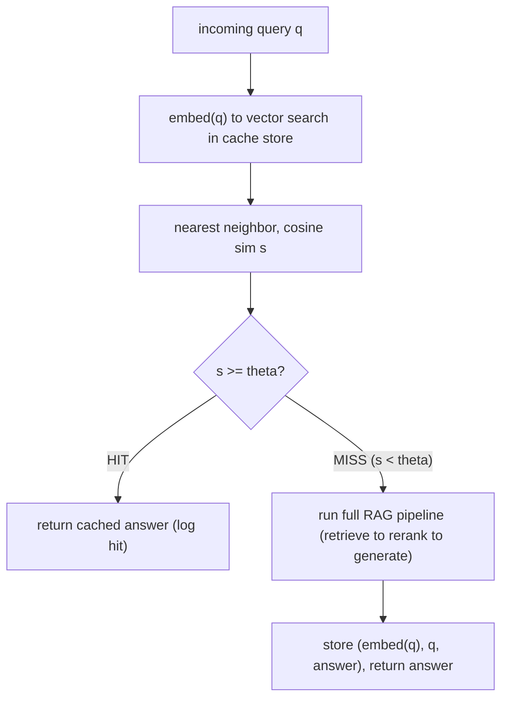

# Lecture 14: Semantic Caching and Incremental Indexing

> Your RAG service works. Now it has to survive contact with production, where two facts collide with your notebook-demo assumptions. First: users ask the *same question a thousand different ways*, and re-running retrieval + a full LLM generation for every paraphrase burns money and latency you don't need to spend. Second: your corpus is not frozen — docs get edited, added, and (thanks to GDPR) *legally deleted* — and the amateur reflex of "re-embed everything nightly" is slow, expensive, and quietly breaks your evaluation. This lecture teaches the two production disciplines that fix these: **semantic caching** (serve a cached answer when a *new* query is semantically close to an *old* one) and **incremental indexing** (change only what changed, delete what must leave, and never lie to your eval). After it you'll be able to stand up a similarity-keyed answer cache that proves a paraphrase is a hit, reason precisely about the false-hit risk that makes naive caching dangerous, and run a content-hash-based incremental indexer that upserts, tombstones, and keeps your recall@k honest.

**Prerequisites:** The two RAG pipelines (Lecture 1), embeddings and cosine similarity (Lecture 3), chunking + stable provenance (Lecture 3), retrieval-only evaluation and recall@k (Lecture 4). · **Reading time:** ~30 min · **Part of:** Retrieval-Augmented Generation, Week 3

## The core idea (plain language)

Both halves of this lecture are the same insight applied to two different layers of the stack: **do work once, key it on something stable, and be paranoid about staleness.**

**Semantic caching** sits at the *front* of the pipeline. A normal cache uses an exact-string key: "What's the refund window?" and "What is the refund window?" are different keys, so the second one misses and you pay full price again. A semantic cache uses the query's *embedding* as the key and treats "close enough in vector space" as a hit. So "How long do I have to return something?" — zero words in common with "What's the refund window?" — can land within the similarity threshold and serve the already-computed answer. The prize is real: a cache hit skips retrieval, reranking, *and* the expensive LLM generation, turning a multi-second, multi-cent request into a sub-100ms, near-free one.

The catch, and the thing you must internalize harder than the benefit: **similarity is not identity.** "What's the *return* window?" and "What's the *warranty* window?" are lexically almost identical and sit very close in embedding space — but they have *different correct answers*. Set your threshold too loose and the cache confidently serves the return policy to someone asking about warranties. That's not a slow response; it's a *wrong* response delivered instantly and cheaply, which is the worst failure mode a system can have. Semantic caching trades correctness risk for cost savings, and the entire engineering job is managing that trade explicitly.

**Incremental indexing** sits at the *back* of the pipeline, on the offline/indexing side (Lecture 1). Your corpus changes; your index must track it without a full rebuild. Three operations: **upsert** a doc by a *stable id* (add if new, replace if changed), **delete** a doc so its vectors actually leave the searchable index (not just get flagged), and **change-data-capture (CDC)** so you re-embed *only* the docs that actually changed. The naive alternative — wipe the index and re-embed the whole corpus every night — is the move that marks someone as a beginner: it's O(entire corpus) when the daily change is O(a few docs), it's expensive in embedding compute, and — the subtle killer — it silently invalidates your evaluation labels if those labels were keyed on anything ephemeral.

## How it actually works (mechanism, from first principles)

### Part A — Semantic caching

**The data flow.** A semantic cache is a tiny vector database sitting in front of your RAG pipeline. Each entry is `(query_embedding, original_query_text, cached_answer, metadata)`. The read path:



The threshold `θ` is the single most important knob. It's a **cosine similarity** (assuming L2-normalized embeddings, as in Lecture 3), and the named default for GPTCache-style setups is **~0.85** with `nomic-embed-text` as the embedder and FAISS as the store. But treat 0.85 as a *starting point to tune down from*, not a law — see the false-hit analysis below.

**Why embedding-keyed instead of string-keyed.** The whole point is paraphrase robustness. Consider these three queries and rough pairwise cosine similarities (illustrative, with a general-purpose embedder):

```
   A: "What's the refund window?"
   B: "How long do I have to return something?"
   C: "What's the warranty window?"

   sim(A,B) ≈ 0.88   ← same intent, different words   → WANT a hit
   sim(A,C) ≈ 0.91   ← different intent, similar words → MUST NOT hit
```

Look hard at those numbers. The pair you *want* to merge (A,B) is **less** similar than the pair you must **keep apart** (A,C). This is the crux of why semantic caching is dangerous: lexical overlap ("window") can pull semantically different questions closer than paraphrases of the same question. A single global threshold cannot cleanly separate these two pairs — if `θ = 0.85` catches A↔B (good), it also catches A↔C (a false hit that serves the refund policy to a warranty question). This is not a contrived example; it is the *typical* shape of the problem in any domain with shared vocabulary (policies, product specs, legal, medical).

**The false-hit probability, intuitively.** You don't need heavy math, just the shape of the risk. As you *lower* `θ`, you catch more true paraphrases (higher hit rate, more savings) **and** more false hits (wrong answers). As you *raise* `θ`, you catch fewer of both. There's no free lunch: the two curves move together. The asymmetry that should drive your default: a *miss* costs you money and latency (you just run the pipeline you'd have run anyway); a *false hit* costs you a wrong answer to a user. Because the downside of a false hit is far worse, **you err tighter** — start high (0.9+), measure your false-hit rate on a labeled set of paraphrase/non-paraphrase pairs, and only loosen if the savings justify the audited error rate.

**Logging and auditing are not optional.** Every cache hit must be logged with `(incoming_query, matched_original_query, similarity_score, cached_answer_id)`. Two reasons. First, this is how you *detect* false hits — you periodically sample the log, eyeball whether the matched query really means the same thing, and compute an empirical false-hit rate. Second, it's how you tune `θ`: plot the distribution of hit similarities, find where true-paraphrase and different-question clusters separate, and set the threshold there. Without the log you are flying blind on the exact axis where this feature can hurt users.

**Staleness / invalidation on reindex.** A cached answer was generated against a *snapshot* of the corpus. If you reindex — a doc changed, the refund window moved from 30 to 14 days — every cached answer touching that content is now *stale but still a "hit."* The cache will happily serve the old 30-day answer forever. So the cache must be **invalidated on reindex**: at minimum, tag each cache entry with an index version/epoch and treat entries from an older epoch as misses (or flush the cache on any reindex). This ties the two halves of this lecture together: incremental indexing must *signal* the cache.

### Part B — Incremental indexing, CDC, and deletes

**Upsert by stable doc id.** Every source document needs a **stable identifier** that survives edits — a source path, a database primary key, a URL, a content-addressed id. When a doc arrives you *upsert*: if its id is unknown, add its chunks+vectors; if known, replace them. The stable id is what makes "replace" possible without duplicating. If you key on something ephemeral (an auto-increment row number, array index, or ingestion timestamp), an edit creates a *second* copy instead of replacing the first, and your index slowly fills with stale duplicates.

**Change-data-capture: re-embed only what changed.** The engine that makes incremental indexing cheap is a **content hash**. For each unit (doc or chunk) you store `hash = sha256(normalized_content)` in a side table — a **RecordManager**, in LangChain's naming. On each indexing run you compute the current hash and compare:

```
   for each incoming doc/chunk:
        h_new = sha256(content)
        h_old = record_manager.get(stable_id)

        if h_old is None:        →  INSERT  (new doc: embed + add)
        elif h_new == h_old:     →  SKIP    (unchanged: do nothing, no embed)
        elif h_new != h_old:     →  UPDATE  (changed: re-embed, replace vectors)

   for each stable_id in record_manager but NOT in incoming set:
        →  DELETE  (removed at source: drop vectors + tombstone)
```

This is exactly what `langchain.indexes.index(docs, record_manager, vectorstore, cleanup=...)` implements: content-hash-based dedup that **skips unchanged, updates changed, and deletes removed**. The payoff is arithmetic — if 5 of 50,000 docs changed today, you run 5 embedding calls, not 50,000. At, say, a few milliseconds and a fraction of a cent per embedding, that's the difference between a 3-second incremental run and a multi-hour, dollars-to-tens-of-dollars nightly rebuild.

**Real deletes and the tombstone (GDPR).** "Right to be forgotten" (GDPR Article 17) is not satisfied by hiding a row. When a user demands deletion, the vector representing their data must **actually leave the searchable index** — a nearest-neighbor search must never return it again, and it must not sit in a backup that's queryable. Two mechanics matter:

- **Tombstone vs hard delete.** Many vector stores implement delete as a **tombstone**: the vector is marked deleted and filtered out of results immediately, but the bytes remain in the segment until a background **compaction/merge** reclaims them. For correctness (never returned) a tombstone is enough; for *compliance* (bytes gone) you must ensure compaction actually runs, and that the id is purged from the RecordManager and any embedding cache too.
- **Cascade.** Deleting a doc must delete *all* its chunks' vectors, its RecordManager entries, and invalidate any semantic-cache answers derived from it. A half-delete that leaves 3 of 8 chunks is both a correctness bug and a compliance violation.

```
   DELETE doc_id = "policy-2023":
     vector store   →  remove all vectors WHERE doc_id = "policy-2023"  (tombstone → compact)
     record manager →  delete key "policy-2023"
     semantic cache →  invalidate entries whose sources include "policy-2023"
```

## Worked example

You run a support-bot RAG over a 20,000-doc knowledge base. Numbers below are illustrative but realistic in shape.

**Semantic cache economics.** A cache miss costs: retrieval (~50ms) + rerank (~200ms) + LLM generation (~1500ms) ≈ **1.75s** and, say, **$0.004** in tokens. A cache hit costs: embed the query (~15ms) + vector search (~5ms) ≈ **20ms** and **~$0.00001**. Suppose 40% of daily queries are semantic repeats of earlier ones and your threshold catches 30% as hits (you left 10% on the table by erring tight — acceptable). On 100,000 queries/day:

```
   hits    = 30,000  →  saved ≈ 30,000 × ($0.004 − $0.00001) ≈ $120/day, and
                          30,000 × 1.73s of pipeline work avoided
   misses  = 70,000  →  full pipeline as normal
```

Now the *cost of getting greedy*: you drop `θ` from 0.90 to 0.82 to push hits from 30% to 45%. Savings rise ~$60/day. But your audit log sample now shows a **2% false-hit rate** among hits — 45,000 × 0.02 = **900 wrong answers per day** served instantly and confidently. That is almost never worth $60. The lesson in one line: **tune `θ` by auditing the false-hit rate, not by maximizing hit rate.**

**Incremental indexing correctness.** Monday your golden set (Lecture 4) reads recall@5 = 0.82. Tuesday a teammate edits 12 docs and re-runs indexing — but they re-chunk with a new splitter, and their golden labels store `relevant_chunk_ids` as *row indices into the chunk list* (0, 1, 2, …). Re-chunking shifted every index. Tuesday's eval reads **recall@5 = 0.00** across the board. Nothing about retrieval quality changed; the labels now point at the wrong chunks. Panic, a wasted afternoon, and a near-rollback of a *good* change — all because the labels were keyed on ephemeral positions.

The fix is to key relevance labels on **stable content hashes or source spans** — `{source_file, heading_path, char_span}` or `sha256(chunk_text)` — exactly the provenance you designed into the chunk schema in Lecture 3. Then re-chunking maps old labels to new chunks by content overlap, and recall@k stays meaningful across reindexes.

## How it shows up in production

- **Latency SLOs get met by the cache, not the model.** Your p50 might be 20ms (cache hits) while p95 is 1.8s (misses). If you report only the mean you'll misread your own system. Track hit-path and miss-path latencies *separately*.
- **The false hit is a silent Sev2.** It produces no error, no exception, no log line unless you added one. It surfaces as a user complaint ("the bot told me the wrong return policy") that's nearly impossible to reproduce because the *next* identical query might miss and answer correctly (if the cache was flushed) or hit differently. This is why the audit log is load-bearing.
- **Stale-corpus hits after a doc update.** You fix a policy doc, deploy, and the bot keeps quoting the old policy for hours because the cache wasn't invalidated. Users trust the answer *more* because it's instant. Invalidate on reindex, always.
- **The nightly rebuild that eats the maintenance window.** A full re-embed of a growing corpus scales linearly with corpus size; incremental scales with *daily change*. The rebuild that took 20 minutes at launch takes 4 hours at 10× corpus, blows the window, and you start skipping nights — now your index is stale *and* expensive.
- **Compliance deletes that don't delete.** An auditor asks you to prove a user's data is gone. "We set a deleted flag" is not proof if the vector is still returnable or sits in a queryable snapshot. Know whether your store tombstones or hard-deletes, and whether compaction runs.
- **The eval that reads 0 after re-chunking.** As in the worked example — the single most common self-inflicted RAG eval wound. It looks like catastrophic regression; it's a label-keying bug.

## Common misconceptions & failure modes

- **"Higher hit rate is better."** No — *audited* hit rate at an acceptable false-hit rate is better. A 60% hit rate with 3% wrong answers is worse than a 30% hit rate with 0.1% wrong answers.
- **"0.85 is the right threshold."** It's a *starting* default for one embedder. The correct threshold depends on your embedding model, your domain's vocabulary overlap, and your tolerance for false hits. Measure it; err tighter.
- **"Delete = set a flag."** For GDPR the vector must actually stop being returnable and, for full compliance, the bytes must be reclaimed (compaction). A soft flag that's still in the ANN graph can leak.
- **"CDC needs a fancy streaming system."** For most RAG corpora, CDC is just *content hashes in a RecordManager* compared on each run. Kafka/Debezium-grade CDC is for high-velocity DB sources, not a docs folder.
- **"Re-embedding nightly is fine, storage is cheap."** It's not storage — it's embedding *compute*, wall-clock time, and the eval-invalidation risk. It's the amateur move precisely because it *works* until the corpus grows.
- **"The cache and the index are independent."** They're coupled through staleness. A reindex that doesn't invalidate the cache serves stale answers; that coupling is a design requirement, not an optimization.
- **"Labels on chunk indices are fine, we rarely re-chunk."** You *will* re-chunk (better splitter, new parser, tuned size). Key labels on stable hashes/spans from day one or eat a phantom recall@0.

## Rules of thumb / cheat sheet

- **Semantic cache threshold:** start `θ ≈ 0.9` (cosine, normalized embeddings). GPTCache's `~0.85` is a floor, not a target. **Err tighter** and loosen only with an audited false-hit rate. *(approximate — tune on your data)*
- **Always log every hit** with `(query, matched_query, similarity, answer_id)`. Sample the log weekly to compute empirical false-hit rate.
- **Invalidate the cache on every reindex** (index-epoch tag, or flush). No exceptions.
- **Domains with heavy shared vocabulary** (policy/legal/spec) → raise `θ` and consider caching only within a metadata partition (per-product, per-tenant) to keep "return vs warranty" apart.
- **Upsert by a stable id** (source path / PK / URL), never a row index or timestamp.
- **CDC = content hash in a RecordManager.** Compute `sha256(normalized_content)`; skip unchanged, update changed, delete missing.
- **Deletes cascade:** vectors → RecordManager → semantic cache. Confirm tombstone → compaction for compliance.
- **Never nightly-rebuild** a corpus you can incrementally index. Reserve full rebuilds for embedding-model changes (which *do* require re-embedding everything).
- **Key eval labels on stable content hashes / source spans**, never ephemeral chunk indices — or recall@k silently reads 0 after re-chunking.

## Connect to the lab

This lecture maps to Week 3 lab **Step 8 (semantic cache)** and the milestone's **incremental indexing** path. In the lab you wrap the generator with **GPTCache** (embedding `nomic-embed-text`, FAISS store, threshold ~0.85), prove a paraphrased query is a hit, and log the latency/cost saved. For indexing, you build the `POST /documents` upsert+tombstone path and prove a new doc is retrievable within one request and a deleted doc is un-retrievable — both asserted in tests. Carry over the discipline from Lecture 4: keep your golden labels keyed on stable hashes/spans so your Week-4 eval survives re-chunking.

## Going deeper (optional)

- **GPTCache** — official docs and repo (`github.com/zilliztech/GPTCache`). Read the "similarity evaluation" and "eviction" sections; note how the threshold and the eval function are separate knobs.
- **LangChain Indexing API** — LangChain docs, "Indexing" how-to, covering `index()`, `RecordManager`, and the `cleanup` modes (`incremental` vs `full`). Search: *"LangChain indexing API RecordManager cleanup incremental"*.
- **nomic-embed-text** — Nomic's model card / blog for the embedder used in the lab's cache. Search: *"nomic-embed-text embedding model"*.
- **FAISS** — the wiki on the repo (`github.com/facebookresearch/faiss`) for index types and why deletes are non-trivial in ANN structures.
- **GDPR Article 17** — the "right to erasure" text (search: *"GDPR Article 17 right to erasure"*) — read it once so you know what "deleted" legally means.
- **Vector DB delete/compaction semantics** — read your store's own docs on delete + segment compaction (Qdrant, Milvus, pgvector). Search: *"<your vector db> delete tombstone compaction"*.

## Check yourself

1. "What's the return window?" and "What's the warranty window?" sit at cosine ~0.91; a genuine paraphrase pair sits at ~0.88. What does this tell you about picking a single global threshold, and what's your move?
2. You lower `θ` from 0.90 to 0.82 and your hit rate jumps from 30% to 48%. Why is celebrating premature, and what one measurement decides whether this was a good change?
3. A support doc's answer changed from "30 days" to "14 days" and you reindexed the changed doc correctly — but users still get "30 days" instantly. What went wrong, and where's the fix?
4. Explain why re-embedding the entire corpus nightly is the "amateur move" for a corpus where ~0.01% of docs change daily. Give the big-O of incremental vs full.
5. Your recall@5 was 0.82 yesterday and reads 0.00 today after a chunker change, though retrieval clearly still works. What's the bug and what's the fix?
6. For a GDPR deletion request, why is "we set a `deleted=true` flag on the row" potentially insufficient? What two things must actually happen?

### Answer key

1. A single global threshold **cannot** cleanly separate them: the pair you must keep apart (0.91) is *more* similar than the pair you want to merge (0.88), because lexical overlap ("window") dominates. Moves: raise `θ` above 0.91 (accepting you'll miss the 0.88 paraphrase), and/or **partition the cache** by metadata (e.g. cache warranty questions separately from returns) so cross-topic hits are structurally impossible. Don't rely on threshold alone in high-overlap domains.
2. Because lowering `θ` raises true hits **and** false hits together. Celebrating the hit-rate ignores the wrong-answer rate. The deciding measurement: the **audited false-hit rate** from your cache-hit log — sample matched pairs, check if they truly share an answer. If false hits are, say, 2%, that's ~hundreds/thousands of wrong answers/day; the cost savings almost never justify it.
3. The **semantic cache wasn't invalidated on reindex.** The cached answer was generated against the old snapshot and is still served as a hit. Fix: tag cache entries with an index epoch/version and treat older-epoch entries as misses (or flush the cache) whenever the index changes — the coupling between indexing and caching is mandatory.
4. Full rebuild is **O(N)** in corpus size regardless of how little changed; incremental is **O(Δ)** in the number of changed docs. At 0.01% daily change on 20k docs, that's re-embedding ~2 docs vs 20,000 — thousands of times more compute, wall-clock, and cost for identical results, and it grows worse as the corpus grows. (Full re-embed is only justified when the *embedding model itself* changes.)
5. The golden set's `relevant_chunk_ids` are keyed on **ephemeral chunk indices/row numbers**; re-chunking shifted every index so the labels now point at the wrong chunks and every lookup misses → recall reads 0. Fix: key relevance labels on **stable content hashes or source spans** (`{source, heading_path, char_span}` / `sha256(text)`) so labels map to chunks by content, surviving re-chunking.
6. A flag may leave the vector **still returnable** by nearest-neighbor search and **still present in queryable storage/backups**, which doesn't satisfy erasure. Two things must happen: (a) the vector must actually stop being returned (tombstone that's filtered from results, cascaded across *all* the doc's chunks + RecordManager + derived cache entries), and (b) for full compliance the bytes must be reclaimed via **compaction/merge**, not left in a segment.
