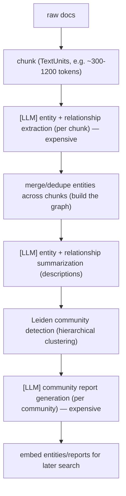
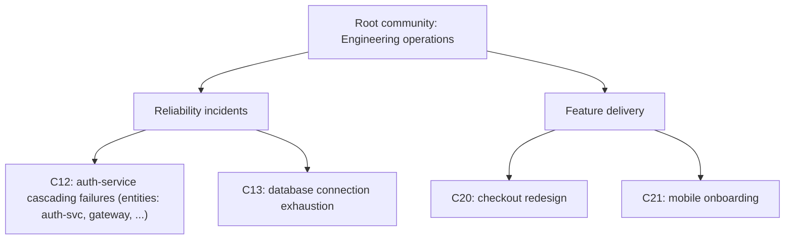

# Lecture 16: Graph RAG for Multi-Hop and Global Questions

> Flat vector RAG has a blind spot that no amount of reranking fixes: it can only ever return chunks that are *individually* similar to your query. That works for lookup ("what's the connect timeout?") and dies on two whole classes of question — **multi-hop** ("which product did the engineer who wrote the X module later lead?") where the answer is stitched across chunks that don't co-retrieve, and **global** ("what are the main themes across all these reports?") where the answer isn't in *any* single chunk at all. This lecture explains, from first principles, why similarity search structurally fails on those, and teaches Microsoft **GraphRAG** as the answer: build a knowledge graph over the corpus, cluster it into communities, pre-summarize each community at index time, then answer global queries from those summaries and neighborhood queries from the graph. Crucially, you'll learn the *cost* — GraphRAG runs an LLM over your whole corpus at index time — and a decision rule for when that cost pays off versus when hybrid+rerank flat retrieval is already enough. After this you can look at a query workload and say, with numbers, "this needs a graph" or "this doesn't."

**Prerequisites:** Flat RAG pipeline (chunk→embed→retrieve), hybrid search + RRF, cross-encoder reranking, the 7 failure points (esp. #7 "incomplete"). Basic graph vocabulary (nodes/edges), big-O intuition. · **Reading time:** ~30 min · **Part of:** RAG Phase, Week 3

## The core idea (plain language)

Flat vector retrieval answers exactly one question, very well: *"which chunks are most similar to this query?"* Everything downstream — top-k, reranking, RRF — is a refinement of that single primitive. Two question types break the primitive itself, not the tuning:

**Multi-hop questions** need facts that live in different chunks, where at least one hop is *not* lexically or semantically close to the query. Consider: *"What is the headquarters city of the company that acquired the startup founded by Ada Lovelace?"* The answer requires three facts — (1) Lovelace founded StartupX, (2) BigCorp acquired StartupX, (3) BigCorp is HQ'd in Zurich — that may sit in three different documents. Chunk (3) contains "Zurich" and "BigCorp" but nothing about Lovelace, so it scores *low* against a query about Lovelace. The embedding of the query lands near the *first* hop and nowhere near the last. You retrieve the launchpad and miss the destination. This is failure point #7 ("incomplete: info spread across chunks that didn't co-retrieve") in its purest form.

**Global / summarization questions** are worse: there is no single chunk to retrieve. *"What are the main themes across all 200 incident reports?"* The theme "recurring auth-service cascading failures" is an emergent property of *many* chunks — no individual chunk says "the main theme is…". Top-k retrieval hands the LLM its k=10 most similar chunks; the LLM dutifully summarizes *those ten*, produces a fluent answer, and silently omits the other 190 documents. You get an answer that looks complete and is a sampling artifact. Increasing k doesn't save you — you can't fit 200 reports in the context window, and even if you could, "stuff everything" isn't retrieval, it's abdication.

**GraphRAG** (Microsoft's, `github.com/microsoft/graphrag`) reframes retrieval around *structure* instead of *similarity*. At index time it uses an LLM to read the corpus and extract a **knowledge graph**: entities (nodes) and relationships (edges), each with descriptions. It then runs a graph clustering algorithm (Leiden) to partition the graph into **communities** — densely-connected clusters that tend to correspond to topics/themes — and, critically, it uses an LLM to **pre-summarize each community** and store those summaries. Now two new retrieval modes exist:

- **Global search** answers whole-corpus questions by map-reducing over the *community summaries* (not raw chunks). The themes are already distilled; the query just aggregates them.
- **Local search** answers entity-centric questions by pulling an entity and its graph neighborhood (related entities, relationships, and the source chunks that mention them) — which naturally traverses multi-hop connections that similarity search severs.

The trade you're making: you move a huge amount of LLM work *from query time to index time*, and pay for it once, so that global and multi-hop queries become answerable at all.

## How it actually works (mechanism, from first principles)

### The indexing pipeline (where the cost lives)

GraphRAG's index is not "embed the chunks." It is a multi-stage LLM pipeline over the entire corpus:

The two `[LLM]` steps marked expensive are what make GraphRAG heavy. **Entity extraction runs an LLM call over every chunk** — that alone is one LLM pass over your whole corpus. **Community report generation runs an LLM call over every community** — and a 1000-document corpus can produce thousands of entities and hundreds of communities across the hierarchy levels. This is the fundamental cost: *indexing is O(corpus) LLM calls, not O(corpus) embedding calls.* Embeddings are cheap (fractions of a cent per million tokens on a local model); LLM extraction and summarization are 100–1000× more expensive per token and far slower.

### Communities and the hierarchy

Leiden produces a *hierarchical* clustering: level-0 communities are fine-grained (a handful of tightly linked entities); higher levels merge them into broader themes. Think of it like a topic tree — level 0 is "auth-service timeout bugs," a parent level is "reliability incidents," the root is "engineering operations." Each community at each level gets its own LLM-generated **community report**: a title, summary, key entities, and findings.

This hierarchy is exactly what makes global search tractable: to answer "main themes," you read the *community reports at a chosen level* — a few dozen pre-written summaries — instead of 200 raw documents.

### Global search: map-reduce over community reports

Global search does **not** embed your query and retrieve. It:

1. Takes all community reports at a chosen hierarchy level (a config knob).
2. **Map step:** sends batches of reports to the LLM with the query, asking each batch to produce partial answers *and self-rate each point's helpfulness (0–100)*.
3. Filters/ranks those partial points by their helpfulness scores.
4. **Reduce step:** sends the top-ranked points to the LLM to synthesize the final answer.

So a global query costs `(number_of_report_batches) + 1` LLM calls at *query* time. It reads the whole corpus — via the summaries — every time. That's the point: completeness by construction, not by lucky retrieval.

### Local search: entity neighborhood traversal

Local search *is* similarity-seeded, but graph-expanded. Given "tell me about the auth-service outage":

1. Embed the query, find the most similar **entities** (not chunks).
2. Expand to their graph neighborhood: connected entities, the relationships between them, the community reports they belong to, and the original **text units** (source chunks) that mention them.
3. Assemble a prioritized, token-budgeted context from all of that and generate.

The multi-hop win is in step 2: because the graph has an explicit `Lovelace --founded--> StartupX --acquired_by--> BigCorp --hq_in--> Zurich` path, following edges from "Lovelace" reaches "Zurich" in three hops — even though the Zurich chunk was never similar to the Lovelace query. Similarity got you to the entity; the graph structure got you to the answer.

## Worked example

Corpus: 200 short incident post-mortems. Question A (global): *"What are the top recurring failure themes?"* Question B (multi-hop/local): *"Which service did the on-call engineer from the March auth outage later redesign?"*

**Flat vector RAG (baseline), k=10.**
- *A:* retrieves the 10 post-mortems most similar to the words "recurring failure themes" — often the ones that literally use that phrase, e.g. a couple of retrospective docs. It summarizes those 10. Verdict: fluent, plausible, and **wrong by omission** — it never saw the other 190, so a theme present in 40 reports that don't use the word "theme" is invisible.
- *B:* retrieves chunks about "March auth outage" (hop 1, easy) but the chunk naming the *redesign* (hop 3) mentions a different service and a project name, not "auth outage" — it ranks ~40th. Miss. Answer: "I don't have enough information" or, worse, a confident wrong service.

**GraphRAG.**
- *A (global search):* reads ~30 community reports at level 1. Map step: each batch surfaces its theme with a helpfulness score; "auth-service cascading failures (seen across 40+ incidents)" scores high because it's a *community*, i.e. an emergent cluster, not a single doc. Reduce step: synthesizes the ranked themes. Verdict: **grounded in the whole corpus**, with the big cluster correctly weighted.
- *B (local search):* seeds on the "March auth outage" entity, traverses `outage --on_call--> Priya Sharma --later_led--> checkout-redesign --targets--> checkout-service`. Returns "checkout-service," with the traversed relationships as evidence. The hop that flat retrieval severed is an explicit edge here.

**The cost side of the same example (illustrative, not a benchmark).** Say 200 docs ≈ 400 chunks.
- *Flat index:* 400 embedding calls, seconds to minutes, ~free on a local model.
- *GraphRAG index:* ~400 extraction LLM calls + entity/relationship summaries + ~100–300 community reports across levels ≈ **hundreds to low-thousands of LLM calls**, tens of minutes to hours, and real dollars on a hosted model (order of a few to tens of dollars on a small model like `gpt-4o-mini`; far more on a frontier model). *These are order-of-magnitude planning figures — measure your own; do not quote them as benchmarks.*
- *Query time:* flat query ≈ 1 LLM call; local search ≈ 1 (bigger context); global search ≈ several (map batches + reduce). Global search is the pricier query mode — you pay a bit every time to read the whole corpus via summaries.

The lesson in one line: **GraphRAG front-loads a large, one-time LLM bill to make queries possible that flat retrieval can't answer at any k.** If your workload doesn't contain those queries, you paid the bill for nothing.

## How it shows up in production

- **Index cost scales with corpus size and re-runs on change.** Because extraction is O(corpus) LLM calls, doubling the corpus roughly doubles the index bill and time. Worse, naive re-indexing on every document change re-runs the whole pipeline — brutal for corpora that update daily. GraphRAG has added incremental/update support, but treat "how do I re-index cheaply?" as a first-class design question before you commit, not an afterthought.
- **Index latency is measured in minutes-to-hours, not seconds.** You cannot build a GraphRAG index synchronously in a request. It's an offline batch job with its own orchestration, retries, and cost monitoring. Budget for extraction failures (the LLM occasionally returns malformed structure) and rate limits.
- **Global search latency and cost per query are higher than flat.** Map-reduce over dozens of reports is several sequential-ish LLM calls. For a user-facing "ask the whole knowledge base" feature that's often acceptable; for a high-QPS lookup endpoint it's the wrong tool. Route by query type (see the decision rule) rather than sending everything through the graph.
- **Extraction quality caps everything.** The graph is only as good as the entities/relationships the LLM pulled. A weak/cheap extraction model produces a sparse or noisy graph → bad communities → vague reports → mediocre global answers. This is the graph analogue of "garbage chunking caps retrieval." The extraction prompt and model choice are the highest-leverage knobs, and GraphRAG supports *prompt tuning* to adapt extraction to your domain (medical, legal, code) — use it; the generic prompt underperforms on specialized corpora.
- **Determinism and drift.** LLM extraction is nondeterministic; re-indexing the same corpus can yield slightly different graphs/communities. Pin your extraction model snapshot and temperature 0, or your "themes" shift between runs and you can't reproduce an answer.
- **It's not a silver bullet for factual lookup.** On simple single-fact questions, GraphRAG is often *worse* than hybrid+rerank: more moving parts, more latency, and the answer was in one chunk anyway. Don't rip out flat retrieval — layer graph on top for the query classes that need it.

## Common misconceptions & failure modes

- **"GraphRAG replaces vector RAG."** No. It's a *complementary* mode for multi-hop and global questions. Most production systems keep flat hybrid+rerank as the default and route only the hard query classes to graph. Both can share the same corpus.
- **"Just increase k to get global answers."** Raising k on flat retrieval adds *more similar* chunks, not *representative* ones. Global questions need coverage of the whole corpus (weighted by prevalence), which top-k similarity can't provide — the 41st-most-similar chunk still isn't the emergent theme. This is a structural limit, not a tuning issue.
- **"The knowledge graph is exact/curated."** It's LLM-extracted and therefore noisy: hallucinated relationships, duplicated entities under name variants ("K8s" vs "Kubernetes"), missed edges. GraphRAG dedupes and summarizes to mitigate, but don't treat it as a hand-built ontology. If you need a *precise* graph (e.g., for compliance), you need entity resolution and validation on top.
- **"Global search retrieves relevant communities like vector search."** Classic GraphRAG global search *doesn't retrieve* — it map-reduces over **all** community reports at a level. That's why it's complete but costly. (There are lighter "dynamic" community-selection variants that prune the tree first — know they exist to cut cost.)
- **"Local search and multi-hop are the same as chaining flat retrievals."** Query decomposition (multi-query) helps some multi-hop cases by splitting the question, but it still relies on each sub-query being *retrievable*. The graph gives you explicit edges to traverse when a hop is not lexically reachable from the query — a different mechanism.
- **Indexing an already-small or already-simple corpus.** If your corpus fits in a long-context window, or your questions are all single-fact lookups, GraphRAG's index cost is pure waste. Measure the workload first.

## Rules of thumb / cheat sheet

- **Reach for GraphRAG only when both are true:** (1) your questions are genuinely *multi-hop* or *global/summarization*, AND (2) the corpus is too big to stuff into a long-context window. Miss either → use flat hybrid+rerank (or long-context stuffing).
- **Default architecture:** flat hybrid+rerank as the primary path; GraphRAG **global search** for "themes/overview across everything" queries; **local search** for entity-centric multi-hop. Route by query classification.
- **Index cost is O(corpus) LLM calls** — plan for minutes-to-hours and real dollars; use a cheap-but-capable extraction model (`gpt-4o-mini`-class) and prompt-tune it for your domain.
- **Pin extraction model + temperature 0** for reproducible graphs; expect drift otherwise.
- **Global search = several LLM calls/query; local search ≈ one big call.** Don't put global search behind a high-QPS endpoint.
- **Before indexing, ask "how do I update?"** — incremental indexing viability decides whether GraphRAG is sustainable for a changing corpus.
- **Decision rule (memorize):** single-fact lookup → flat hybrid+rerank. Multi-hop over a large corpus → local search / decomposition. "Main themes across all docs" → global search. Corpus fits in context → just stuff it, skip retrieval entirely.
- *(All cost/latency figures here are order-of-magnitude planning aids — measure your own corpus.)*

## Connect to the lab

This maps to Week 3 lab Step 10 (**stretch, timeboxed**): `pip install graphrag`, run `graphrag index` on a *small* corpus (it costs API tokens — point it at `gpt-4o-mini` or a local model config), then run one **global search** ("what are the main themes?") and one **local search** (an entity/multi-hop question), and contrast both with your flat-vector answer on the *same* questions. The learning objective is not a production graph — it's to *feel* the index cost and latency firsthand and to see, concretely, the global/multi-hop answers flat retrieval couldn't produce. Timebox it hard; indexing even a small corpus is slow.

## Going deeper (optional)

- **Microsoft GraphRAG** — repo root `github.com/microsoft/graphrag`, docs at `microsoft.github.io/graphrag`. Read the "Get Started," "Indexing Architecture," and "Query (Global vs Local Search)" pages, and the "Prompt Tuning" guide.
- **Microsoft Research blog / paper** — Edge et al., *"From Local to Global: A Graph RAG Approach to Query-Focused Summarization"* (2024). Search that exact title for the motivation and the global-search map-reduce design.
- **Leiden algorithm** — Traag et al., *"From Louvain to Leiden: guaranteeing well-connected communities"* (2019). Search the title for how communities are formed.
- **Alternatives to compare:** **LlamaIndex PropertyGraphIndex** (`docs.llamaindex.ai`, search "property graph index"), **Neo4j GraphRAG** (`neo4j.com/labs/genai-ecosystem`), and lighter graph-retrieval patterns. Search: "GraphRAG vs vector RAG cost", "knowledge graph RAG multi-hop", "GraphRAG incremental indexing".

## Check yourself

1. Explain, mechanically, why flat top-k retrieval misses the final hop of a 3-hop question even when that fact is in the corpus. Why doesn't raising k reliably fix it?
2. Why can't flat retrieval answer "what are the main themes across all 200 docs?" no matter how good the reranker is? What property must the answer have that top-k can't provide?
3. Where does GraphRAG's dominant *indexing* cost come from, and why is it fundamentally different (in big-O terms of what operation) from a flat vector index?
4. Contrast global search and local search: what does each retrieve/aggregate, and which question type is each for?
5. Give the two-part condition under which GraphRAG's index cost is justified. Name a concrete situation where it's pure waste.
6. Your global-search "themes" answer changes between two index builds of the *same* corpus. What's the mechanism, and what two settings reduce it?

### Answer key

1. The query embedding lands near hop-1 vocabulary; the hop-3 chunk shares no terms/semantics with the query (it talks about the destination entity, not the query's starting entity), so it scores low and ranks below k. Raising k adds *more chunks similar to the query*, but the missing chunk is *dissimilar to the query by construction* — it's only reachable by first knowing hops 1–2. So k grows the candidate set in the wrong direction; you'd need k ≈ whole corpus to include it, which defeats retrieval.
2. The answer is an **emergent, corpus-wide property** (a theme present across many docs weighted by prevalence), not content in any single chunk. Top-k returns the *k most similar* chunks, which is a biased sample skewed toward docs that lexically resemble the query — it can't represent the distribution of themes across all 200 docs. A reranker only reorders that biased candidate set; it can't add coverage of docs never retrieved.
3. From running an **LLM over every chunk** for entity/relationship extraction, plus an **LLM over every community** for report generation: indexing is **O(corpus) LLM calls**. A flat index is O(corpus) *embedding* calls — same count, but embeddings are ~100–1000× cheaper/faster per token than generative LLM calls, and there's no per-community summarization step.
4. **Global search** aggregates over *all community reports* at a level via map-reduce (partial answers + helpfulness scores → synthesized answer) — for whole-corpus/summarization questions; it doesn't do query-embedding retrieval. **Local search** seeds on the query-similar *entities*, expands to their graph neighborhood (related entities, relationships, community reports, source chunks) — for entity-centric and multi-hop questions.
5. Justified only when **(1)** the questions are genuinely multi-hop or global/summarization **AND (2)** the corpus is too large to fit in a long-context window. Pure waste example: a FAQ/lookup bot over a small corpus of single-fact questions — every answer lives in one chunk, so the O(corpus) LLM index bill buys nothing over flat hybrid+rerank.
6. LLM entity/relationship extraction is **nondeterministic**, so re-indexing yields slightly different graphs → different Leiden communities → different reports → different "themes." Reduce it by **pinning the extraction model snapshot** and setting **temperature 0** (and, for further stability, fixing the clustering seed/config).
