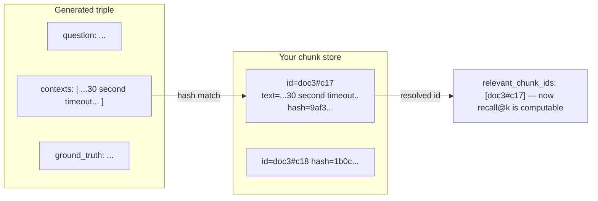

# Lecture 19: Building and Versioning Golden Sets

> Every RAG number you will ever quote — recall@10, faithfulness 0.82, "the reranker gained 8 points" — is a measurement *against a ruler*. This lecture is about the ruler. A golden set is the single artifact your entire evaluation stack hangs on, and it is the one most teams get wrong: they build it once, all happy-path, never version it, and then wonder why CI reads 0.95 forever while users hit hallucinations on day one. After this lecture you will be able to author a golden set in the two legitimate ways (careful manual labeling and human-reviewed synthetic bootstrap), perform the chunk-id mapping step that makes retrieval metrics computable at all, stratify it so it actually stresses your system (especially the no-answer cases where hallucination hides), and version it with git discipline so a re-chunk never silently zeroes your recall.

**Prerequisites:** Lecture 4 (retrieval metrics, `gold_substr` golden sets), Lecture 11 (citations/NLI groundedness), a working Week 1–3 pipeline with stable chunk IDs, basic git. · **Reading time:** ~28 min · **Part of:** Retrieval-Augmented Generation, Week 4

## The core idea (plain language)

In Week 1 you built a tiny golden set of `{q, gold_substr}` pairs and measured retrieval alone. That was training wheels. This week you need a golden set that can power **both** families of metric at once — retrieval (recall@k, MRR, nDCG) *and* generation (faithfulness, context precision, **context recall**, answer relevancy) — because the whole point of Week 4 is to *localize* a failure to one side or the other. And here is the uncomfortable fact that drives everything in this lecture:

> The two metric families need **two different kinds of ground truth**, and if you're missing either, half your dashboard silently reads a meaningless number.

Concretely:

- **Retrieval metrics need labeled CHUNK IDS.** recall@k asks "did the *relevant chunk* land in the top-k?" You cannot answer that with an answer string — you need to know *which of your chunks* are the right ones. That means a per-query list `relevant_chunk_ids`.
- **context_recall and answer-correctness need a ground-truth ANSWER.** RAGAS's `context_recall` works by decomposing your reference answer into claims and checking whether the retrieved context supports each. No reference answer → the metric has nothing to decompose → it either errors or returns garbage. Same for any answer-correctness metric.

So a real golden set row carries *both*: `relevant_chunk_ids` (for the retrieval floor) **and** `ground_truth` (for the generation floor). A set with only answers can't compute recall@k. A set with only chunk ids can't compute context_recall. You need the full row.

The rest is discipline. There are exactly two honest ways to build such a set — hand-label real queries, or bootstrap synthetically and then *review by hand* — and one non-negotiable mapping step (tie generated contexts back to your chunk ids) that people skip and then can't figure out why recall@k won't compute. Layer on stratification (so the set stresses the failures users actually hit) and versioning (so edits don't corrupt history), and you have the artifact everything else depends on.

## How it actually works (mechanism, from first principles)

### The anatomy of a golden row

Store the set as **JSONL** — one JSON object per line, greppable, diffable, appendable. The schema:

```json
{"id": "q001", "query": "What is the default connect() timeout?", "relevant_chunk_ids": ["doc3#c17"], "ground_truth": "The connect() call defaults to a 30 second timeout.", "stratum": "easy_factoid"}
{"id": "q044", "query": "Which release first shipped async pools, and what Python version did it require?", "relevant_chunk_ids": ["doc1#c05", "doc7#c22"], "ground_truth": "Async pools shipped in v2.3, which required Python 3.9+.", "stratum": "multi_hop"}
{"id": "q058", "query": "What is the SLA for the on-prem appliance?", "relevant_chunk_ids": [], "ground_truth": "The provided documents do not contain this information.", "stratum": "no_answer"}
```

Five fields, each load-bearing:

| Field | Powers | If missing… |
|---|---|---|
| `id` | joins, versioning, "worst 5 cases" reports | can't track a case across versions |
| `query` | the input you actually run | — |
| `relevant_chunk_ids` | recall@k, MRR@k, nDCG@k | **retrieval metrics uncomputable** |
| `ground_truth` | context_recall, answer-correctness | **those metrics uncomputable** |
| `stratum` | per-stratum breakdown | a great mean hides a dead stratum |

Note the multi-hop row has **two** relevant chunk ids — the answer is spread across chunks that must *co-retrieve*. Note the no-answer row has an **empty** `relevant_chunk_ids` and a ground_truth that says "not in the docs." Both of those shapes are deliberate and we'll return to why they matter.

### Path A — manual labeling (the gold standard)

Take **40–80 real queries** (from logs, from stakeholders, from your own domain knowledge) and, for each, open your chunk store and mark which of *your* chunks a correct retrieval must surface. Write the reference answer yourself from those chunks.

This is tedious — budget ~3–6 minutes per query once you're warmed up, so 40 queries is a solid half-day. But it is **honest**: the labels reflect what your corpus actually contains and what a human judges relevant. There is no model in the loop inventing questions your corpus can't answer. For the queries that matter most — the ones your business is judged on — hand-label them. Always.

The catch is coverage. Hand-authoring 80 queries that also happen to be well-distributed across difficulty, hop-count, and the no-answer case is hard. That's where the bootstrap earns its keep.

### Path B — synthetic bootstrap, then human review

Both **RAGAS `TestsetGenerator`** and **LlamaIndex's** dataset generators will walk your corpus and emit `(question, contexts, ground_truth)` triples: they sample chunks, prompt an LLM to write a question answerable from them, and record the source chunks as `contexts` plus a generated `ground_truth`. RAGAS can even vary question *type* (simple, reasoning, multi-context) so you get some built-in stratification.

This gets you from 0 to ~60 draft rows in one run. But — and this is the rule that has no exceptions:

> **Never ship raw synthetic gold.** A generator will produce nonsense questions ("What is the value in the third cell of the table on a page that was actually a header?"), leaky questions that quote the chunk verbatim, and — worst — **wrong ground_truths** stated with total confidence. If you gate CI on un-reviewed synthetic labels, you are grading your system against an LLM's hallucinations.

The human-review pass is mandatory and specific:
1. **Delete** questions that are nonsense, ambiguous, or unanswerable-by-design (unless you *want* them as no-answer cases — but relabel them as such).
2. **Fix** ground_truths that are subtly wrong. This is the highest-value 20 minutes you'll spend all week.
3. **De-leak**: rewrite questions that paraphrase the source chunk so closely that retrieval is trivial (the Lecture 4 anti-pattern — ask from intent, not from text).
4. **Hand-add** the strata the generator under-produces: no-answer cases and genuine multi-hop cases.

Think of the generator as a *first drafter*, not an author. It multiplies your labeling throughput ~5–10× while you retain editorial control.

### The critical mapping step (this is where people get stuck)

The generator hands you `contexts` — the *text* of the chunks it sampled. But your retrieval metrics need `relevant_chunk_ids` — the *ids* your live retriever returns. These are not the same thing, and if you don't bridge them, `relevant_chunk_ids` stays empty and recall@k is uncomputable. The bridge:

```
generated context TEXT  ──match──▶  YOUR chunk id
```

Two robust ways to match:

- **Content hash.** When you chunk, compute `sha256(normalize(chunk_text))` and store it in each chunk's metadata alongside its id. To map a generated context, normalize and hash it, look up the id. Exact, deterministic — *if* the generator returned your chunk text verbatim (RAGAS/LlamaIndex usually do, since they sampled it from your store).
- **Source span.** If the generator returned an offset or a lightly-edited snippet, match on `(source_file, page, char_span)` overlap, or fall back to highest embedding similarity above a strict threshold (say cosine > 0.9) and eyeball the low-confidence matches.



Skip this step and you get the silent-zero pitfall: `relevant_chunk_ids=[]` for every row, recall@k dutifully computes `0/0 → 0.0`, and you spend an afternoon "debugging your retriever" that is fine.

### Stratification — and why an all-happy-path set is a lie

If every golden query is an easy factoid whose answer sits in one obvious chunk, your eval reads **0.95 forever** and never moves — including on the exact failures users hit first. You must deliberately build in the hard cases. Four strata, each stressing a different part of the stack:

| Stratum | What it stresses | Why include it |
|---|---|---|
| **easy_factoid** | baseline lookup | sanity floor; if this dips, something broke badly |
| **hard / multi_hop** | can the needed chunks *co-retrieve*? does the LLM synthesize? | this is failure point #7 (incomplete) — info spread across chunks |
| **distractor_heavy** | precision under near-duplicate/adjacent noise | catches a retriever that grabs plausible-but-wrong chunks |
| **no_answer** | **does the system abstain?** | this is where hallucination lives — see below |

**The no-answer stratum is the one that catches the failure that gets you fired.** A no-answer case is a query whose answer *genuinely is not in your corpus*. The correct behavior is to **abstain** ("the documents don't contain this"). A system with no no-answer cases in its golden set has *never been tested on its propensity to hallucinate on empty context* — and that is precisely the failure users hit first and trust least. On a happy-path set every retrieval finds *something* relevant, so faithfulness and recall both look great; the hallucination-on-empty-context path is simply never exercised. Include **≥5 no-answer cases** and assert your system abstains on them. This single stratum is the difference between an eval that flatters you and one that protects you.

For no-answer rows: `relevant_chunk_ids` is `[]` (nothing is relevant, correctly) and `ground_truth` is your canonical abstention statement, so answer-correctness can reward the system for *correctly* saying "I don't know."

### Versioning discipline

The golden set is code. Treat it like code:

> Store it as **`golden_v1.jsonl` in git**. When you edit it — add rows, fix a ground_truth, re-map ids after re-chunking — **bump the version** (`golden_v2.jsonl`) and commit. **Never edit in place** silently.

Why the version bump rather than a plain edit? Because your eval reports quote scores *against a specific ruler*. "faithfulness 0.82" is meaningless without "…on golden_v1, judge=claude-3-5-sonnet-20241022, git SHA abc123." If you edit the ruler in place, last month's 0.82 and this month's 0.79 are no longer comparable and you can't tell a real regression from a golden-set change. A version number in the filename makes every historical report reproducible and every comparison honest. Record the golden version in the eval report header, always.

## Worked example

You're building `golden_v1.jsonl` for a 200-page networking-library manual. Plan: bootstrap ~60 rows, review down to ~50 clean rows, then hand-add strata to hit the targets.

**Step 1 — bootstrap.** RAGAS `TestsetGenerator` over the corpus emits 60 triples. Distribution as generated: ~48 easy factoids, ~10 reasoning/multi-context, **0 no-answer** (generators can't invent questions the corpus *doesn't* answer — they only sample what's there). Already you can see the happy-path skew you must correct.

**Step 2 — map ids.** For each triple, hash each context text and look it up in your chunk store. 57 of 60 map cleanly. 3 fail to match — turns out the generator lightly reworded a table row. You match those by source span, confirm by eye, done. Now every row has `relevant_chunk_ids`.

**Step 3 — human review.** You read all 60. Findings (representative, not real benchmark numbers):
- 6 questions are nonsense or duplicate → **delete** (down to 54).
- 4 ground_truths are wrong (one says timeout is "60 seconds"; the chunk clearly says 30) → **fix**.
- 5 questions quote the chunk almost verbatim → **rewrite** from user intent.

You now have 54 clean rows, but 0 no-answer and only ~10 multi-hop.

**Step 4 — hand-add strata.** You write **6 no-answer** queries (things a user might plausibly ask that the manual genuinely doesn't cover — pricing, SLA, a competitor comparison), each with `relevant_chunk_ids: []` and `ground_truth: "The documents do not contain this information."` You hand-author **4 more multi-hop** cases by finding facts split across two sections. Final set: **64 rows**.

**Step 5 — verify the shape:**

| Stratum | Count | Target | OK? |
|---|---|---|---|
| easy_factoid | 38 | bulk | ✅ |
| multi_hop | 14 | represented | ✅ |
| distractor_heavy | 6 | some | ✅ |
| no_answer | 6 | ≥5 | ✅ |
| **Total** | **64** | **40–80** | ✅ |

Commit as `golden_v1.jsonl`. Report header will read: `golden_v1 · 64 rows · judge=<pinned> · SHA=<...>`.

**Step 6 — the payoff when metrics run.** Because every row has both `relevant_chunk_ids` and `ground_truth`, all four RAGAS metrics *and* recall@k/MRR/nDCG compute for every row. And because you have a no-answer stratum, the per-stratum table can reveal the killer: overall faithfulness 0.88 looks great, but the `no_answer` row breaks it out and faithfulness there is **0.30** — the system is confidently answering questions it should refuse. A happy-path set would have shown 0.88 and shipped the hallucination.

## How it shows up in production

- **The silent-zero recall after a re-chunk.** You improve your chunker in Week-4-of-real-life, re-index, and your CI recall@k drops to 0.0 overnight. Panic. The retriever is fine — your `relevant_chunk_ids` point at *old* chunk ids that no longer exist, so nothing ever matches. This is *the* classic golden-set bug. Mitigation: key relevance on **content hashes / source spans**, not ephemeral ids, so a re-chunk can be re-mapped instead of silently zeroing. And bump the version (`golden_v2`) when you re-map.
- **The eval that reads 0.95 for a year.** A happy-path-only set never exercises abstention, distractors, or multi-hop. It reads high and flat while real users hit hallucinations and half-answers. The first no-answer case you add usually *drops your headline faithfulness* — that drop is the eval finally doing its job.
- **The bootstrap that graded against hallucinations.** A team ships `TestsetGenerator` output straight into CI without review. Three months later they discover ~8% of their ground_truths were wrong, meaning their gate has been rewarding wrong answers and punishing right ones. Every "regression" they chased was noise. The review pass is not optional overhead; it's the difference between a ruler and a random-number generator.
- **Irreproducible reports.** Someone edited `golden.jsonl` in place between two eval runs. The 0.82 → 0.78 "regression" that blocked a PR was actually three ground_truth fixes, not a code change. Versioned filenames + a version stamp in the report make this impossible.
- **context_recall permanently blank.** A set built with only questions and chunk ids (no `ground_truth`) means RAGAS `context_recall` and answer-correctness never produce a usable number — you've lost your in-RAGAS retrieval-quality signal and can't run the localization decision rule. Build ground_truths from day one.

## Common misconceptions & failure modes

- **"An answer string is enough ground truth."** No — retrieval metrics need chunk *ids*. An answer can't tell you whether the *right chunk* was retrieved. You need both `relevant_chunk_ids` and `ground_truth`, and they serve different metrics.
- **"Synthetic generation gives me a golden set."** It gives you a *draft*. Un-reviewed synthetic gold contains nonsense questions and confidently-wrong answers; gating on it grades your system against an LLM's mistakes.
- **"More rows is always better."** 40–80 *clean, stratified* rows beat 300 noisy happy-path rows. Beyond ~80, review quality and CI runtime/cost degrade faster than signal improves. Breadth of *strata* matters more than raw count.
- **"I'll just fix the golden set in place when I find a bad label."** That silently breaks comparability of every past report. Bump the version and stamp it in the report.
- **"No-answer cases are edge cases I can skip."** They're the *center* of your reliability story — the exact place hallucination hides. A set without them can't measure the failure users hit first.
- **"The chunk ids in my golden set are stable."** Only if you key on content hashes/spans. Raw ids are ephemeral; re-chunking invalidates them and recall silently reads 0.
- **"Multi-hop is just a harder factoid."** No — its defining property is that the answer is *spread across chunks that must co-retrieve*. One relevant_chunk_id is a factoid; two-plus that must all appear is a multi-hop test of failure point #7.

## Rules of thumb / cheat sheet

- **Target: 40–80 clean rows**, stratified: mostly easy_factoid, **multi_hop represented**, some distractor_heavy, **≥5 no_answer**.
- **Every row carries BOTH** `relevant_chunk_ids` (retrieval metrics) **and** `ground_truth` (context_recall / answer-correctness). Missing either kills a metric family.
- **Two build paths:** manual (honest, tedious — use for queries that matter) and synthetic bootstrap (fast — RAGAS `TestsetGenerator` / LlamaIndex, then **human-review**).
- **Never ship raw synthetic gold.** Review pass = delete nonsense, fix wrong ground_truths, de-leak, hand-add missing strata.
- **Do the mapping step:** match each generated context back to *your* chunk id via **content hash** (or source span) to fill `relevant_chunk_ids`. Skipping it → recall@k silently reads 0.
- **No-answer rows:** `relevant_chunk_ids: []`, `ground_truth` = your abstention statement. Assert the system abstains.
- **Version it:** `golden_v1.jsonl` in git, one JSON per line. **Bump the version on any edit; never edit in place.** Stamp the version + judge model + git SHA in every report.
- **Key relevance on stable content hashes/spans, not ephemeral chunk ids**, so a re-chunk can be re-mapped instead of zeroing recall.
- **Sanity gate:** load the set and assert schema (both id lists present, strata tagged, ≥5 no-answer) before you trust any aggregate.

## Connect to the lab

This lecture is Week 4 lab **Step 1** ("Build the golden set"). You'll run RAGAS `TestsetGenerator` over your Week-1 corpus to draft ~60 `(question, contexts, ground_truth)` rows, then perform the mapping step — hash or span-match each generated context back to *your* chunk ids to fill `relevant_chunk_ids`. Then the human-review pass: delete nonsense, fix wrong ground_truths, hand-add ~6 no-answer and a few multi-hop cases, tag every row with a `stratum`, and land 40–80 clean rows committed as `eval/golden_v1.jsonl`. The Definition of Done requires ≥5 no_answer cases and multi-hop represented — those aren't decoration, they're what makes the downstream localization (Lecture 20) and CI gate meaningful.

## Going deeper (optional)

- **RAGAS documentation** (root: `docs.ragas.io`) — the "Generate a Testset" / "Synthetic Test Data generation" pages for `TestsetGenerator`, and the "Metrics" section for exactly which metrics require `ground_truth` (context_recall, answer_correctness). Read these before you build.
- **LlamaIndex documentation** (root: `docs.llamaindex.ai`) — search "LlamaIndex generate question context pairs" / "RagDatasetGenerator" for its dataset-generation utilities and the `LabelledRagDataset` format.
- **Arize Phoenix docs** (root: `docs.arize.com/phoenix`) — for eyeballing the worst cases and curating them back into the golden set; useful when deciding which failures deserve a hand-labeled row.
- **"Seven Failure Points When Engineering a RAG System" (Barnett et al., 2024)** — search that exact title; map your strata to the failure points (multi_hop ↔ #7 incomplete, no_answer ↔ #1 missing content + hallucination).
- **Introduction to Information Retrieval (Manning, Raghavan, Schütze)** — free online; the "Evaluation in information retrieval" chapter for the canonical notion of a relevance-judged test collection (qrels), which is exactly what `relevant_chunk_ids` is.
- Search queries worth running: "RAGAS testset generation human review", "golden dataset RAG evaluation stratification no-answer", "qrels relevance judgments build test collection".

## Check yourself

1. Your golden set has `query` and `ground_truth` for every row but no `relevant_chunk_ids`. Which metrics can you compute and which can't, and why?
2. A teammate runs `TestsetGenerator`, writes the output straight to `golden_v1.jsonl`, and wires it into the CI gate. Name two distinct ways this bites you and the single process step that prevents both.
3. After improving your chunker and re-indexing, CI recall@10 drops from 0.81 to 0.00 with no code change to the retriever. What almost certainly happened, and what's the fix that prevents it recurring?
4. Why is a no-answer stratum the highest-value addition to an otherwise-passing golden set? What does its *absence* let a happy-path set hide?
5. Explain the "mapping step" in one or two sentences: what are you matching to what, why, and name one robust matching key.
6. You need to fix three wrong ground_truths in `golden_v1.jsonl`. Walk through the correct versioning procedure and say why editing in place is wrong.

### Answer key

1. You can compute **generation** metrics that don't need chunk labels — faithfulness (answer vs retrieved context), answer_relevancy, and, because you *do* have `ground_truth`, **context_recall** and answer-correctness. You **cannot** compute **retrieval** metrics (recall@k, MRR@k, nDCG@k) because those require knowing *which chunks are relevant* — an id list — and an answer string can't tell you whether the right chunk was in the top-k. You've lost your ability to localize a failure to retrieval.

2. (a) The generator produces **nonsense/ambiguous questions** that pollute the metric with noise. (b) It produces **confidently-wrong ground_truths**, so the CI gate rewards wrong answers and flags right ones as regressions — every chased "regression" is actually a bad label. The single preventing step: a mandatory **human-review pass** (delete nonsense, fix wrong ground_truths, de-leak, add missing strata) before the set is ever committed or gated on. Never ship raw synthetic gold.

3. The re-chunk changed chunk ids, so the `relevant_chunk_ids` in the golden set now point at ids that no longer exist; nothing the retriever returns can match, so recall computes `0/relevant → 0.0` for every row — a silent zero, not a real regression. Fix: key relevance labels on **stable content hashes / source spans**, not ephemeral ids, so after a re-chunk you re-map the labels to the new ids (and bump to `golden_v2`) instead of the metric silently cratering.

4. A no-answer case is the only stratum that tests whether the system **abstains** instead of hallucinating on empty context — the failure users hit first and trust least. Its absence lets a happy-path set hide exactly that: on such a set every retrieval finds *something* relevant, so faithfulness and recall both read high (0.95 forever), and the hallucination-on-empty-context path is never exercised. Adding it typically *drops* your headline faithfulness — which is the eval finally doing its job.

5. You're matching each generated **context text** (from `TestsetGenerator`/LlamaIndex output) back to **your own chunk's id**, so you can fill `relevant_chunk_ids` and make retrieval metrics computable. A robust key is the **content hash** (`sha256(normalize(chunk_text))` stored in chunk metadata) — or, if the text was lightly edited, source-span overlap or high-threshold embedding similarity. Skip this and `relevant_chunk_ids` stays empty and recall@k silently reads 0.

6. Correct procedure: copy/rename to a new version (`golden_v2.jsonl`), apply the three fixes there, commit it, and update the eval config + report header to reference `golden_v2` (with the judge model and git SHA). Editing `golden_v1.jsonl` in place is wrong because every past report quoted scores *against v1 as it was then*; a silent in-place edit makes historical scores non-comparable, so you can no longer distinguish a real code regression from a change in the ruler itself.
