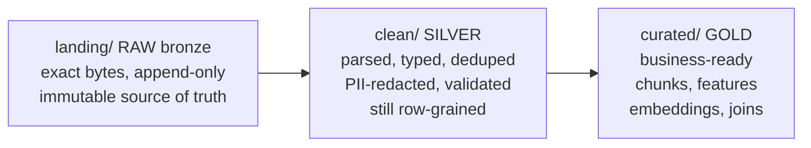

# Lecture 1: Ingestion Architecture — Batch, Micro-batch, Streaming, and the Immutable Landing Zone

> Almost every data disaster you will ever debug traces back to a decision made at ingestion time: how fast data arrived, who initiated the transfer, and whether you kept the raw bytes exactly as they landed. This lecture gives you a *decision framework*, not a taxonomy to memorize. After it you will be able to look at any source — a paginated REST API, a Postgres table, an inbound webhook, a Kafka topic — and confidently pick batch vs. micro-batch vs. streaming and pull vs. push; justify that choice on latency, cost, complexity, and failure blast radius; and lay out an immutable, append-only landing zone with a manifest so that every downstream transform is re-derivable and every backfill is a `for` loop instead of a crisis.

**Prerequisites:** Python 3.11+, comfort with HTTP APIs and SQL, basic file/partition intuition, having seen JSONL and Parquet · **Reading time:** ~28 min · **Part of:** Phase 5 — Data Engineering for AI, Week 1

---

## The core idea (plain language)

Ingestion is the act of moving data out of a system you do not control and into a place you do. Two *independent* questions decide the shape of that act:

1. **Cadence** — how often, and how promptly, do records need to arrive? This is the batch / micro-batch / streaming axis.
2. **Delivery** — who initiates the transfer? This is the pull vs. push axis.

These are orthogonal, and conflating them is the single most common beginner mistake. You can *pull in batch* (a nightly `SELECT * WHERE updated_at > watermark`), *pull continuously* (CDC tailing the write-ahead log), *receive pushes in batch* (a partner drops an hourly file into your S3 bucket), or *receive pushes as a stream* (a live webhook firehose). "Streaming" is not a synonym for "push," and "batch" is not a synonym for "pull." Keep the two dials separate in your head and most architecture arguments dissolve.

The third idea is non-negotiable and it is the spine of this entire phase: the **immutable landing zone**. Whatever cadence and delivery you choose, the *first* thing you do with bytes off the wire is write them down — unchanged, append-only, partitioned by the date you ingested them — and then never touch them again. That raw layer is your source of truth. Every clean and curated dataset downstream is a deterministic *function* of it. When a transform has a bug (it will), you fix the transform and **replay**; you do not go re-fetch a source that may have changed, rate-limited you, or vanished. This one discipline is the difference between a pipeline you can trust and one you pray over at 3 a.m.

---

## How it actually works (mechanism, from first principles)

### The cadence spectrum: there is really only one dial

Batch, micro-batch, and streaming are not three separate technologies. They are three points on a single continuous dial: **how long you let records accumulate before you process a group of them.**

```
 batch                 micro-batch              streaming
  |----------------------|----------------------|
 minutes–hours         1–60 seconds            per-event (ms)
 low  $/GB             medium                  high $/GB (always-on)
 simple to build       medium                  complex (state, ordering,
 huge blast radius     medium blast            backpressure) / tiny blast
```

- **Batch** accumulates a large window (an hour, a day) and processes it all at once. One process spins up, does work, writes output, exits. Cost per GB is lowest because compute is bursty — you pay only while the job runs, and you can pack the work densely. The failure blast radius is *large*: if the nightly job dies at 90%, the whole window is suspect and you re-run the window.
- **Micro-batch** shrinks the window to seconds. Spark Structured Streaming's default trigger and most "near-real-time" pipelines are micro-batch under the hood: they poll a source every N seconds and process whatever arrived. You get most of batch's simplicity (you still reason about discrete, bounded groups of rows) with far lower latency. Blast radius shrinks with the window.
- **Streaming** processes each event as it arrives, with per-event or tiny-buffer latency. You now pay for an always-on consumer, and you inherit the genuinely hard problems: managing state across events, handling out-of-order arrival, and *backpressure* (what happens when producers outrun consumers). The blast radius is smallest — one poisoned event fails one event — but the operational surface is largest.

The key engineering intuition: **latency and cost trade against each other along this dial, and complexity rises monotonically toward streaming.** You do not "upgrade" to streaming; you *pay* for it, in engineering hours and on-call pages, and you should only pay when the latency requirement is real.

### Latency, cost, complexity, blast radius — the four-way trade

Put numbers on it so you can reason instead of hand-wave (these are order-of-magnitude *rules of thumb*, not benchmarks):

| Dimension | Batch (daily) | Micro-batch (30 s) | Streaming (per-event) |
|---|---|---|---|
| End-to-end latency | hours–1 day | seconds | milliseconds |
| Relative infra cost | ~1× (bursty) | ~2–4× | ~5–10× (always-on) |
| Engineering complexity | low | medium | high |
| Blast radius of one failure | whole window | one micro-batch | one event |
| Debuggability | replay the day | replay the batch | trace one event |

Two subtleties that bite in production:

- **Cost is not monotonic with latency in the way people assume.** A batch job that scans a huge table every hour to find the 12 changed rows can be *more* expensive than a streaming CDC feed of those 12 rows. Cost tracks *work done*, not wall-clock cadence. Always ask: does shorter cadence make me re-scan the same data repeatedly?
- **Complexity is where the real bill lands.** Streaming state management, exactly-once-ish semantics (Lecture 2), watermarking, and reprocessing are genuinely hard. Most teams that "need streaming" actually need micro-batch and a good landing zone.

### Concrete triggers: how to choose without arguing

Decide by working *backwards from the latency the business will actually notice*, then sanity-check cost.

- **Choose batch when:** the consumer tolerates staleness measured in hours (daily analytics, nightly model retraining corpora, monthly reports); the source is cheapest to read in bulk (a full table export, a daily file drop); or you are early and want the simplest thing that could possibly work. *Default here.* Most AI-training and RAG-corpus ingestion is batch or micro-batch — an embedding index that is 30 minutes stale is almost never a business problem.
- **Choose micro-batch when:** the consumer wants freshness in seconds-to-single-minutes (a dashboard, a "documents indexed within a minute of upload" SLA) but you do not need per-event reaction. This is the sweet spot for the majority of "real-time-ish" AI pipelines.
- **Choose streaming when:** an action must fire per event with sub-second-to-second latency (fraud scoring at authorization time, live personalization, alerting), *and* the cost of that latency is high enough to justify the operational tax. If you cannot name the specific decision that a one-second delay would ruin, you do not need streaming.

### Pull vs. push: who initiates?

The second dial is about *control of timing*.

- **Pull** — you decide when to read. Two flavors:
  - **Polling / scheduled reads:** you hit an API or run a query on a cron. Simple, fully under your control, easy to make idempotent (you choose the window). The cost is latency (you only see data at poll time) and potential waste (polling a source that rarely changes).
  - **CDC (Change Data Capture):** you pull *changes* from a database's transaction log (Postgres logical replication / WAL, MySQL binlog) rather than re-scanning the table. You get every insert/update/delete in commit order, cheaply, without hammering the source. This is the pull technique that scales — you read deltas, not the whole table.
- **Push** — the source decides when to send.
  - **Webhooks:** the source `POST`s to your HTTP endpoint on an event. Low latency, no polling waste — but the source now owns delivery, and webhooks are famously *lossy, duplicable, and reorderable*. If your endpoint is down for 90 seconds, those events may be gone forever (or retried with jitter you don't control). You must make the receiver idempotent and durable *immediately*.
  - **Message queues / logs (Kafka, SQS, Pub/Sub):** the source publishes to a broker; you consume at your own pace. This is push-at-the-source, pull-at-the-broker — the broker *buffers*, which is exactly what tames the "my endpoint was down" problem. The broker's retention is your safety net.

```
   PULL                                 PUSH
   you control timing                   source controls timing
   ----------------                     -------------------------
   poll/schedule  ── simple, laggy      webhook  ── low-latency, LOSSY,
   CDC (WAL/binlog) ── deltas, scales    (no buffer, you must be up + idempotent)
                                        queue/log ── buffered, replayable,
                                                     (broker is your safety net)
```

### When the source forces your hand

You often do not get to choose freely — the source dictates the delivery model:

- **A third-party SaaS that only emits webhooks** → you are push whether you like it or not. Engineering response: land the raw webhook body *first* (before parsing), dedup on the event id, and treat the endpoint as a thin durable buffer. Consider putting a queue behind your endpoint so a slow consumer never drops events.
- **A database you own** → prefer CDC (pull deltas from the WAL) over polling `SELECT`s once volume grows; polling re-scans, CDC reads only changes.
- **A database you *don't* own, exposed only via REST** → polling with a watermark (`updated_at > last_seen`) is your only move. Store the watermark durably (Lecture 2).
- **A partner dropping files on a schedule** → push-in-batch. Watch for late/duplicate files; key idempotency on file content hash, not filename.
- **A high-volume internal event stream** → a log/queue (Kafka) so you get buffering and replay for free.

Rule: **when the source is lossy or bursty (webhooks), buffer immediately and land raw before you do anything clever.** When the source is a DB you own, CDC beats polling at scale.

### The immutable, append-only landing zone

Now the spine. The landing zone is the first place bytes come to rest. Its contract has four clauses:

1. **Raw.** Store exactly what you received — the original JSON/CSV/bytes — *before* any parsing, cleaning, or type coercion. If the source sends malformed JSON, you land the malformed JSON. You cannot re-derive a field you threw away at ingestion; you *can* always re-parse bytes you kept.
2. **Append-only / immutable.** You add new files. You never edit or overwrite an existing file. A landed partition is frozen the moment it is written.
3. **Partitioned by ingest date** — `dt=YYYY-MM-DD` — the date *you ingested*, not the source's event date. (Event-date partitioning belongs downstream; ingest-date is what makes replay and audit tractable, because "what did we receive on the 4th?" has one unambiguous answer.)
4. **Source of truth.** Every clean/curated table is a pure function of the landing zone. Downstream = `f(raw)`. Nothing downstream is authoritative; it is all re-derivable.

Why this unlocks everything:

- **Backfills become trivial.** New cleaning logic? Point it at `landing/**/dt=*/` and re-run over history. You already *have* the raw bytes; you are not begging an API for 2019 data it no longer serves.
- **Bug fixes are replays, not archaeology.** Found a parsing bug that corrupted three months of a field? Fix the parser, replay those partitions, done. Without raw, that data is gone.
- **Auditing is answerable.** "What did we actually receive from vendor X on March 4?" is a file listing, not a debate.
- **Overwriting raw destroys all of the above.** The instant you mutate a landed file in place, you can no longer reproduce yesterday's output, and any backfill that touches that partition is now lying. This is the cardinal sin of data engineering.

### The manifest pattern

Each landed partition gets a small sidecar `_manifest.json` describing what is in it. A good manifest carries, per partition:

```json
{
  "source": "github_issues",
  "ingested_at": "2026-07-09T04:12:33Z",
  "watermark_high": "2026-07-08T23:59:58Z",
  "row_count": 1287,
  "content_sha256": "9f2c...e1",
  "run_id": "01J9...",
  "schema_version": 3
}
```

- `source` — which pipeline/source produced it.
- `ingested_at` — wall-clock time we wrote it (for freshness SLAs).
- `watermark_high` — the highest source cursor value covered (the `updated_at`/id up to which this partition is complete). This is how the *next* run knows where to resume.
- `row_count` — expected rows, so a truncated read is caught by comparing manifest count to actual.
- `content_sha256` — a hash over the sorted, serialized rows. Two runs that ingested the same data produce the *same* hash — this is the mechanical basis of the idempotency proof (Lecture 2) and of audit.

The manifest is what makes the landing zone *self-describing and replayable*. To replay a range, you read manifests, not files: they tell you coverage (via watermarks), integrity (via hashes and counts), and lineage (source, run_id) without opening a single data file. A partition whose actual row count or hash disagrees with its manifest is *provably* corrupt and can be quarantined automatically.

### Medallion layering (raw → clean → curated), conceptually

The industry names for the layers — "bronze / silver / gold," or raw / clean / curated — describe the same idea: data flows through stages of increasing refinement, and each stage is materialized separately.



The rule that matters for an AI engineer: **each layer is re-derivable from the one above it, and only the raw layer is sacred.** You can blow away and rebuild clean and curated at will — they are caches of a computation. That is exactly why the landing zone must be immutable: it is the one thing you *cannot* rebuild. In Phase 5 your `landing/` is bronze, your `data/clean/` JSONL is silver, and your Parquet corpus + Qdrant index are gold.

---

## Worked example

You are ingesting a public REST API — GitHub issues for a repo — into a corpus, and separately a Postgres `documents` table via CDC. Latency requirement: the corpus may be up to a few hours stale (RAG answers do not need sub-minute freshness). Volume: ~1,200 new/changed issues/day; the `documents` table sees a few hundred updates/day.

**Cadence + delivery decision.** No sub-minute requirement → **batch** (a scheduled run every few hours), not streaming. The API is pull-only → **polling with a watermark**. The Postgres table you own → **CDC/watermark pull** of deltas, not a full re-scan. Both are pull-in-batch. No streaming infra, no webhook endpoint to keep up. Cost stays at ~1× and complexity stays low — correct, because nothing about the business justifies more.

**Landing layout.** Each run writes a new partition; nothing is ever overwritten:

```
landing/
  github_issues/
    dt=2026-07-08/
      part-01J8Z...jsonl        # run at 04:00, watermark_high=2026-07-07T23:59
      _manifest.json
    dt=2026-07-09/
      part-01J9A...jsonl        # run at 04:00
      part-01J9B...jsonl        # run at 10:00 (same day, second partition-per-run)
      _manifest.json            # ... one manifest per part in practice
  documents_cdc/
    dt=2026-07-09/
      part-01J9C...jsonl        # includes tombstone rows for deletes
      _manifest.json
```

**A run, numerically.** The 04:00 run reads the stored watermark `2026-07-08T23:59:58Z`, fetches issues with `updated_at >` that, and gets 1,287 rows. It sorts them by primary key, serializes to JSONL, computes `content_sha256 = 9f2c…e1`, writes `part-01J9A….jsonl` and its manifest with `watermark_high = 2026-07-08T23:59:58Z` (the max `updated_at` seen), `row_count = 1287`. **Re-running the 04:00 job immediately** reads the same watermark, fetches the same 1,287 rows, produces the same `9f2c…e1` — and because the write is keyed on that content (Lecture 2), it lands **zero net new rows**. That byte-identical hash across repeated runs *is* the replay-safety guarantee, made mechanical.

**Backfill scenario.** Two weeks later you discover the cleaner mis-parsed a `body` field containing embedded HTML. You do not touch the API. You fix `clean.py` and re-run it over `landing/github_issues/dt=2026-06-25` … `dt=2026-07-09`. Because raw bytes are intact and immutable, the clean layer is rebuilt correctly and the curated corpus + index follow. Total blast radius: a re-run over 15 daily partitions, zero source calls, zero data loss.

**Partition-per-run vs. partition-per-day.** Above, `dt=2026-07-09/` holds *two* files (04:00 and 10:00). That is **partition-per-run within a per-day directory** — the pragmatic default. Per-day gives you the coarse partition consumers filter on (`WHERE dt = '2026-07-09'`); per-run (distinct `part-<runid>` files) means concurrent or repeated runs never collide on a filename, and you can trace any row to the exact run that landed it. If instead every run *overwrote* `dt=2026-07-09/part.jsonl`, the 10:00 run would erase the 04:00 data — you would silently lose the morning's issues and could never reproduce that day. Per-run files, never overwritten, is what preserves it.

---

## How it shows up in production

- **The "just re-fetch it" trap.** A team without a raw landing zone hits a parsing bug and tries to re-pull three months of an API — only to find the API paginates back 90 days, rate-limits them, or has since changed its schema. The old data is *unrecoverable*. With a landing zone this is a non-event. This is the single most expensive lesson teams learn the hard way.
- **Cost blowups from wrong cadence.** A "real-time" dashboard implemented as a full-table `SELECT` every 30 seconds scans a 50 GB table 2,880 times a day to find a handful of changed rows. Switching to CDC (read deltas) or lengthening the cadence cuts the warehouse bill by an order of magnitude with no user-visible latency change. Cost tracks *work*, not cadence.
- **Webhook loss during a deploy.** A push-only integration drops events during a 40-second rolling restart of the receiver because there was no buffer. The fix is architectural: land the raw body durably the instant it arrives (or park a queue in front), *then* process. If you only realize this after losing a day of signups, it is a painful backfill you may not be able to do.
- **Blast radius in debugging.** With batch + immutable partitions, "yesterday's run was bad" means "delete yesterday's clean output and replay `dt=2026-07-08`." With in-place mutation, "bad data" means a forensic reconstruction of what the numbers *used to be*, which is often impossible.
- **Manifest-driven monitoring.** Freshness SLAs and quality gates (next week's Dagster work) read manifests: alert if `max(ingested_at)` is older than the SLA, or if `row_count` drops 90% versus the trailing median (a likely upstream outage). The manifest is what makes the pipeline *observable* rather than a black box.

---

## Common misconceptions & failure modes

- **"Streaming is the modern/better choice."** No — streaming is the *expensive, complex* choice, justified only by a real sub-second latency requirement. Most AI data pipelines are correctly batch or micro-batch. Reaching for Kafka + Flink to build a nightly training corpus is résumé-driven engineering.
- **"Streaming means push, batch means pull."** Two orthogonal dials. CDC is streaming-ish *pull*; an hourly file drop is batch *push*. Keep them separate.
- **"The cleaned table is my source of truth."** The *raw landing zone* is the source of truth. The cleaned table is a derived cache you can and will rebuild.
- **"Overwriting yesterday's partition is fine, the data's the same."** It is never guaranteed to be the same (sources mutate and backfill), and even if it were, you have destroyed reproducibility and audit. Append new partitions; freeze old ones.
- **"Exactly-once delivery from the queue solves dedup for me."** It does not exist as a pure transport guarantee (Lecture 2). You get at-least-once + idempotent writes. Design the write to absorb duplicates.
- **Partition by *event* date at the raw layer.** Tempting, but a late-arriving event dated three days ago would force you to reopen a frozen partition — breaking immutability. Partition raw by *ingest* date; derive event-date partitions downstream where mutation is allowed.
- **Hashing mutable fields into your content hash.** If `content_sha256` includes `fetched_at` or any per-run field, every re-fetch looks "new" and idempotency is broken. Hash only stable content (Lecture 2 hammers this).
- **One giant partition or a million tiny ones.** Too coarse and you can't parallelize or prune; too fine (the "small files problem") and metadata/scan overhead dominates. Per-day directories with per-run files is a sane middle for laptop-to-mid scale.

---

## Rules of thumb / cheat sheet

- **Default to batch.** Move to micro-batch only when a human/system visibly waits seconds; move to streaming only when you can name the sub-second decision that latency would ruin. *(approximate; latency need drives the choice)*
- **Two dials, always separate:** cadence (batch/micro/stream) and delivery (pull/push).
- **Pull when you can, push when forced.** Owned DB → CDC. Third-party REST → poll with a watermark. SaaS webhooks → land raw + buffer immediately.
- **When the source is lossy/bursty (webhooks), durably land raw *before* parsing.** Put a queue in front if your consumer can lag.
- **Land raw, append-only, partitioned by `dt=YYYY-MM-DD` (ingest date). Never overwrite.**
- **Write a `_manifest.json` per partition:** `{source, ingested_at, watermark_high, row_count, content_sha256}`.
- **Downstream = f(raw).** Clean/curated are rebuildable caches; only raw is sacred.
- **Backfill = replay over raw partitions.** If a fix requires re-fetching the source, your landing zone failed you.
- **Partition-per-day dir + partition-per-run file** is the pragmatic default; avoid both mega-partitions and swarms of tiny files.
- **Cost tracks work done, not cadence.** Beware full re-scans on short schedules.

---

## Connect to the lab

This week's lab (`corpus-pipeline/`, Phase 5 Week 1) is the hands-on version of this lecture: you build an idempotent, batch, pull-based ingestion for a paginated REST API and a Postgres CDC source, landing raw JSONL into `landing/<source>/dt=YYYY-MM-DD/part-<runid>.jsonl` — never overwritten — with a `_manifest.json` per partition carrying source, `ingested_at`, `watermark_high`, `row_count`, and a content hash. The Definition of Done ("run 5× → 5 identical hashes; `landing/` is date-partitioned and never overwritten") is exactly the immutable-landing-zone + manifest discipline from this lecture made mechanical. Lecture 2 (idempotency) supplies the write-side machinery that makes those five hashes identical.

---

## Going deeper (optional)

- **Dagster docs — "Assets" and "Automating pipelines."** Root: `docs.dagster.io`. The asset-centric model maps cleanly onto "each layer is a re-derivable function of the one above." Search: *Dagster software-defined assets*.
- **Debezium — "Introduction to Change Data Capture."** Root: `debezium.io`. The canonical CDC reference even if you hand-roll a watermark this week. Search: *Debezium Postgres connector logical decoding*.
- **Kafka documentation — "Design / Delivery semantics."** Root: `kafka.apache.org`. Read for the buffering/replay mental model behind log-based push. Search: *Kafka delivery semantics exactly once*.
- **dlt (data load tool) docs.** Root: `dlthub.com`. Incremental loading, state, and schema evolution — the batteries-included version of the watermark pattern. Search: *dlthub incremental loading*.
- **"The medallion architecture."** Search: *Databricks medallion architecture bronze silver gold* for the widely-cited framing of raw→clean→curated layering.
- **Martin Kleppmann, *Designing Data-Intensive Applications* (book).** Chapters on batch vs. stream processing give the durable mental models behind this lecture — read for intuition, skip the parts that go deeper into distributed-systems theory than an ingestion engineer needs.

---

## Check yourself

1. Cadence and delivery are described as "orthogonal dials." Give one concrete example of each of the four combinations (pull/batch, pull/stream, push/batch, push/stream).
2. A stakeholder insists a nightly analytics corpus must be "real-time streaming." What two questions do you ask to decide whether streaming is actually warranted, and what is the likely correct answer?
3. Why must the raw landing zone be partitioned by *ingest* date rather than *event* date, and what specifically breaks if you use event date?
4. Your cleaner had a bug for the last month. Walk through, step by step, how an immutable landing zone turns this into a routine fix — and what you'd be forced to do without one.
5. What five fields belong in a partition manifest, and what does each one let you do at replay/audit time?
6. Why is "exactly-once delivery from the message broker" not the thing that makes your pipeline correct, and what actually provides the guarantee?

### Answer key

1. **Pull/batch:** nightly `SELECT ... WHERE updated_at > watermark`. **Pull/stream:** CDC tailing the Postgres WAL. **Push/batch:** a partner drops an hourly file into your bucket. **Push/stream:** a live webhook firehose or Kafka consumer reacting per event.
2. Ask: (a) *What is the maximum staleness the consumer will actually notice?* and (b) *Can you name the specific sub-second decision that latency would ruin?* For a nightly analytics corpus the answers are "hours are fine" and "none" — so **batch** (or at most micro-batch) is correct; streaming would add cost and operational load for no business value.
3. Partition by ingest date so each partition is **frozen once written** — immutable. Event-date partitioning means a late-arriving event dated three days ago forces you to *reopen and mutate* a frozen partition, which breaks the immutability guarantee, destroys reproducibility of the older partition, and corrupts any backfill that already read it. Derive event-date partitions downstream, where mutation is allowed.
4. With an immutable landing zone: fix the cleaner, then **replay** it over `landing/<source>/dt=…` for the affected month; clean and curated layers rebuild as pure functions of the intact raw bytes; zero source calls, zero data loss, blast radius = a re-run. Without one: the raw bytes were overwritten or never kept, so you must re-fetch from the source — which may rate-limit you, no longer serve that history, or have changed schema — and any field you dropped at ingestion is simply gone.
5. `source` (which pipeline produced it), `ingested_at` (freshness SLAs / "when did we get it"), `watermark_high` (resume point for the next run and coverage for replay), `row_count` (detect truncated reads by comparing to actual), `content_sha256` (integrity check and the mechanical basis of the idempotency/audit comparison — same data → same hash).
6. Pure exactly-once *delivery* over an unreliable channel is impossible; a broker gives you at-least-once (with buffering/replay). Correctness comes from **at-least-once delivery + idempotent writes keyed on a stable dedup key** — the receiving write recognizes a duplicate and does nothing, so effective exactly-once is an end-to-end property you *engineer*, not a transport guarantee you buy (see Lecture 2).
