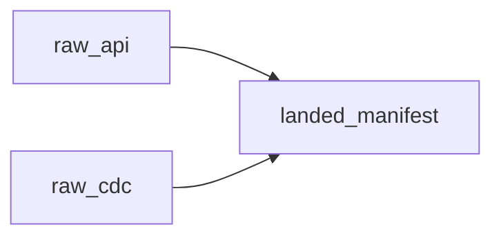
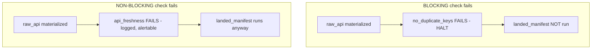

# Lecture 4: Orchestrating with Dagster — Assets, Asset Checks, Freshness SLAs, and Blocking Quality Gates

> Most orchestration tutorials teach you to schedule *tasks*: "run this script, then that script." That model rots the moment your pipeline grows, because the thing you actually care about — the *data* — is invisible in the graph. Dagster inverts this: you declare the **data artifacts** (assets), let their **lineage** define the DAG, and treat **materialization** as the unit of work. On top of that you bolt **asset checks** — executable invariants that can *halt* the pipeline when data is wrong. This lecture exists because in production, a pipeline that silently ships stale or duplicated data is worse than one that loudly stops. After this you will be able to model a corpus pipeline as software-defined assets, wire correctness and freshness checks, make the correctness gate **blocking** so bad data physically cannot flow downstream, and drive the whole thing from `dagster dev`.

**Prerequisites:** Python 3.11+, `uv`, comfort with decorators and type hints; you've built the idempotent ingest from this week's lab (landing zone + manifest) · **Reading time:** ~26 min · **Part of:** Phase 5 (Data Engineering) Week 1

---

## The core idea (plain language)

Classic orchestrators (cron, plain Airflow-as-tasks) think in **verbs**: "call the API," "write the file," "run the dedup." The DAG is a graph of *operations*. Nobody in that graph knows what a `landed_manifest` is or whether it's fresh. If a task succeeds but produces garbage, the orchestrator shrugs — it ran the verb, its job is done.

Dagster thinks in **nouns**: the `raw_api` table, the `raw_cdc` table, the `landed_manifest`. These are **software-defined assets (SDAs)** — persistent objects in the world (a file, a table, an index, an ML model) that your code *produces*. You write a function that computes each asset and decorate it with `@asset`. Dagster reads the function signatures to discover **who depends on whom** and builds the DAG *from lineage*, not from a hand-drawn task order.

Two consequences fall out immediately, and both matter in production:

1. **The graph is the data catalog.** When you open the UI you see `raw_api → landed_manifest`, not `fetch_step → write_step`. When something breaks, you ask "which *asset* is stale/wrong?" — the same question your stakeholders ask.
2. **The unit of work is a materialization**, i.e. "recompute this asset and persist the result." That gives Dagster a natural place to attach metadata (row counts, hashes), lineage (which upstream version fed this), and — crucially — **checks** that run against the materialized value.

An **asset check** (`@asset_check`) is a small function that asserts an invariant about an asset: *no duplicate keys in this partition*, *the newest record is younger than 24h*. A check is **blocking** or **non-blocking**. A blocking check that fails stops downstream assets in the same run from materializing — bad data hits a wall. A non-blocking check just records a warning and lets everything proceed. The entire thesis of this lecture: **a warning-only quality check is theater.** If your "PII must be redacted" check can fail while the data still ships, you don't have a gate, you have a note nobody reads at 3 a.m.

---

## How it actually works (mechanism, from first principles)

### Assets, and why lineage-not-order is the whole trick

An asset is defined by a decorated function. The function's **return value** is the asset's materialized content (or you hand it to an I/O manager to persist). Its **parameters**, named after other assets, are the *upstream dependencies*.

```python
from dagster import asset, AssetExecutionContext, MaterializeResult

@asset
def raw_api(context: AssetExecutionContext) -> MaterializeResult:
    rows = fetch_paginated_api(since=load_watermark())   # your Week-1 code
    path = write_landing_jsonl("api", rows)              # immutable partition
    return MaterializeResult(metadata={
        "row_count": len(rows),
        "path": str(path),
        "content_sha256": sha256_of_sorted(rows),
    })

@asset
def raw_cdc(context: AssetExecutionContext) -> MaterializeResult:
    rows = select_since_watermark()                      # Postgres watermark CDC
    path = write_landing_jsonl("cdc", rows)
    return MaterializeResult(metadata={"row_count": len(rows), "path": str(path)})

# landed_manifest depends on BOTH — Dagster infers this from the parameters
@asset
def landed_manifest(raw_api, raw_cdc) -> MaterializeResult:
    manifest = reconcile([raw_api, raw_cdc])
    return MaterializeResult(metadata={"total_rows": manifest["total"]})
```

Notice: you never wrote `raw_api >> landed_manifest`. Dagster saw `landed_manifest(raw_api, raw_cdc)` and *derived* the edges. The DAG is:



This is not a cosmetic difference. In a task DAG, adding a new consumer of `raw_api` means editing the orchestration graph. With SDAs you just write a function that takes `raw_api` as a parameter, and the lineage updates itself. The graph can't drift out of sync with the code because the code *is* the graph.

`MaterializeResult` is how you attach **metadata** to each materialization — row counts, hashes, paths. This metadata shows up in the UI and, more importantly, is what checks and freshness logic read. Rich metadata is the cheapest observability you will ever buy; emit it on every asset.

### Definitions — the top-level wiring

Everything Dagster loads lives in a `Definitions` object: your assets, checks, jobs, and schedules. This is the single import surface `dagster dev` reads.

```python
from dagster import Definitions, define_asset_job, ScheduleDefinition

ingest_job = define_asset_job("ingest_job", selection="*")   # all assets

daily = ScheduleDefinition(
    job=ingest_job,
    cron_schedule="0 6 * * *",     # 06:00 every day
)

defs = Definitions(
    assets=[raw_api, raw_cdc, landed_manifest],
    asset_checks=[no_duplicate_keys, api_freshness],   # defined below
    jobs=[ingest_job],
    schedules=[daily],
)
```

A `ScheduleDefinition` is just cron bound to a job. `"0 6 * * *"` = minute 0, hour 6, every day. That's the automation layer — it *triggers* materializations on a clock. (Dagster also has event-driven *sensors* and declarative *automation conditions*, but cron is the right default for a batch corpus pipeline.)

### Asset checks — invariants as code

A check targets an asset and returns an `AssetCheckResult` with `passed=True/False`. Here is the correctness gate from the lab — **no duplicate dedup keys within a partition**:

```python
from dagster import asset_check, AssetCheckResult, AssetCheckSeverity

@asset_check(asset=raw_api, blocking=True)
def no_duplicate_keys() -> AssetCheckResult:
    rows = read_latest_partition("api")
    keys = [r["id"] for r in rows]
    dupes = len(keys) - len(set(keys))
    return AssetCheckResult(
        passed=(dupes == 0),
        severity=AssetCheckSeverity.ERROR,
        metadata={"n_rows": len(keys), "n_duplicate_keys": dupes},
    )
```

And the **freshness** check — fail if the newest record is older than a 24h SLA:

```python
from datetime import datetime, timezone, timedelta

SLA = timedelta(hours=24)

@asset_check(asset=raw_api)      # non-blocking: freshness is a signal, not a poison pill
def api_freshness() -> AssetCheckResult:
    rows = read_latest_partition("api")
    newest = max(datetime.fromisoformat(r["updated_at"]) for r in rows)
    age = datetime.now(timezone.utc) - newest
    return AssetCheckResult(
        passed=(age <= SLA),
        metadata={"newest_record": newest.isoformat(),
                  "age_hours": round(age.total_seconds() / 3600, 1),
                  "sla_hours": 24},
    )
```

Dagster also ships **builders** for the common freshness case so you don't hand-roll it — `build_last_update_freshness_checks(assets=[raw_api], lower_bound_delta=timedelta(hours=24))` generates an equivalent check that watches the asset's last-materialization/record time against the SLA. Hand-writing it once (as above) is worth it to *understand* what the builder does; reach for the builder in real code.

### Blocking vs non-blocking — the only distinction that matters

This is the heart of the lecture. Set `blocking=True` on a check and Dagster changes the *execution semantics of the run*:

- When `raw_api` materializes, its **blocking** checks run **immediately after**, in the same run, before anything downstream starts.
- If a blocking check **fails**, Dagster **does not materialize the downstream assets** (`landed_manifest`) in that run. The bad partition is quarantined at the source.
- A **non-blocking** check that fails records the failure (red in the UI, alertable) but the run *continues* — downstream assets materialize anyway.



Why treat correctness as blocking and freshness as non-blocking? **Duplicate keys corrupt everything downstream** — dedup counts, indexes, RAG answers — so you must stop the flow. **Staleness is a judgment call**: a 25-hour-old partition is often still worth processing while you page someone; halting the whole pipeline for it may be worse than shipping slightly-old data with a loud alarm. You choose blocking per-invariant based on the answer to: *"is it safer to stop, or to proceed and scream?"* Correctness → stop. Freshness → usually scream. PII-not-redacted (Week 3) → absolutely stop.

The failure mode you're defending against has a name: **silent bad data**. It's the single most expensive class of data bug because, like leakage, it doesn't throw — the pipeline goes green, the numbers look plausible, and three weeks later someone notices the fraud model was trained on a partition where every row was duplicated four times. A blocking gate converts that silent, delayed, expensive failure into a loud, immediate, cheap one. That trade is almost always correct.

---

## Worked example — watch a blocking gate halt a run, then recover

Concrete numbers. Your API partition for `dt=2026-07-09` normally lands ~500 rows keyed on issue `id`, all unique.

**1. Healthy run.** `raw_api` materializes 500 rows. `no_duplicate_keys` computes `500 - len(set(keys)) = 500 - 500 = 0` → `passed=True`. `api_freshness` sees the newest `updated_at` at 09:58 vs now 10:00 → `age_hours=0.03 ≤ 24` → passes. `landed_manifest` materializes with `total_rows=500`. UI is all green.

**2. Inject a duplicate.** Simulate a bad upstream (retry that re-emitted a page, a broken watermark) by writing issue `id=4242` twice into the partition — now 501 rows, 500 distinct keys.

```python
# in a scratch script / test fixture
rows = read_latest_partition("api")
rows.append(dict(rows[0]))          # duplicate the first record verbatim
write_landing_jsonl("api", rows)    # 501 rows, one key appears twice
```

Trigger the job. `raw_api` materializes. `no_duplicate_keys` computes `501 - 500 = 1` → `n_duplicate_keys=1` → `passed=False`, severity ERROR, **blocking**. Dagster halts: `landed_manifest` shows as **not started** — it never ran. In the UI the check is red on `raw_api`, and the run summary says downstream materialization was skipped because a blocking check failed. **The duplicate never reached the manifest.** That's the gate doing its job: 1 bad row stopped 500 good rows from being reconciled into a poisoned artifact, which is the correct trade when correctness is non-negotiable.

**3. Recover.** Fix the root cause (dedup on primary key with `xxhash` before writing, per the lab), drop or overwrite the bad partition, re-run.

```python
rows = dedup_on_key(read_latest_partition("api"), key="id")  # 501 -> 500
write_landing_jsonl("api", rows)
```

Now `no_duplicate_keys` sees `0` again → passes → the block lifts → `landed_manifest` materializes → green. You didn't disable the check to get unblocked (the cardinal sin); you fixed the data so the check passes. The recovery is the proof the gate is real: the only way past it is correct data.

A back-of-envelope for why this pays off: suppose a duplicate slips through undetected once a quarter, and each incident costs ~2 engineer-days of forensics plus a re-index. A blocking check that fires in <1s at materialization time turns each of those into a 5-minute fix. You don't need precise numbers to see the ROI — you're trading seconds of compute for days of incident response.

---

## How it shows up in production

- **The green-but-wrong pipeline.** Without checks, "the job succeeded" and "the data is correct" are different facts your monitoring conflates. Checks make correctness a first-class, queryable status. When an SLA dashboard says `api_freshness: FAILED, age_hours=31`, you know *exactly* what's stale, not just "some job is red."
- **Blast-radius containment.** A blocking gate on `raw_api` means a bad source partition can't propagate to the index, the RAG answers, or the fine-tune set. The cost of the bug is bounded to one asset instead of the whole downstream cone. In a task DAG the bad data would have flowed through every "successful" step.
- **Freshness as an SLA you can actually report.** Stakeholders ask "is the data current?" A non-blocking freshness check gives you a per-asset, timestamped answer and an alert hook — you find out at 06:05, not when a user complains the answers are three days out of date.
- **Backfills and partitions.** Real corpora are partitioned by date. `no_duplicate_keys` runs *within a partition*, so a backfill of 30 days runs 30 independent check evaluations. This is why the check reads "the latest partition," not "the whole table" — invariants are usually partition-scoped, and checking the whole table on every run gets expensive fast (O(N) over all history vs O(partition)).
- **The "who turned off the check" incident.** The most common way blocking gates fail in production is a well-meaning engineer flipping `blocking=False` (or deleting the check) to unblock a release under pressure. Treat check config as protected code: require review, and make the check cheap enough that nobody's tempted to disable it for latency reasons.

---

## Common misconceptions & failure modes

- **"A check that logs a failure is a quality gate."** No — that's a warning. If the data still materializes downstream, you have observability, not a gate. Only `blocking=True` (that actually fails) stops the flow. Warning-only correctness checks are theater.
- **"Dagster schedules tasks like cron/Airflow."** Dagster schedules *materializations of assets*; the DAG comes from lineage, not a hand-written task order. If you're writing `a >> b` you're thinking in the old model.
- **"Everything should be blocking."** No. Blocking a freshness check can halt the whole pipeline over a slightly-stale but usable partition — often worse than proceeding with a loud alert. Block on *correctness/safety* (dupes, PII, schema), warn on *timeliness* (freshness) unless downstream truly cannot tolerate stale input.
- **"The check runs before the asset."** A check runs *after* its asset materializes, against the produced value. Blocking means it gates *downstream* assets, not the asset it's attached to (which has already been produced and quarantined).
- **"Freshness = when the job last ran."** Job-run recency and *data* recency are different. A job can run every hour and still ingest nothing new; freshness must be measured on the newest **record's** timestamp, not the last materialization clock. Measuring the wrong one gives you a green freshness check over stale data.
- **"I'll add checks later."** Checks added after an incident are checks written to a corpse. The cheap moment to encode `no_duplicate_keys` is when you understand the key — which is now.
- **Non-idempotent checks.** A check that mutates state or depends on wall-clock in a non-deterministic way (beyond the freshness comparison) makes runs irreproducible. Checks should be pure reads over the materialized data plus, at most, `now()`.

---

## Rules of thumb / cheat sheet

- **Model nouns, not verbs.** One `@asset` per persistent artifact; name it what stakeholders call the data.
- **Dependencies via parameters.** `def landed_manifest(raw_api, raw_cdc)` *is* the wiring. Never hand-draw edges.
- **Emit metadata on every materialization** — `row_count`, `content_sha256`, `path`, watermark. It's free observability and it's what checks read.
- **Correctness/safety checks → `blocking=True`.** Duplicates, schema, non-null, PII-redacted. Bad data must not flow.
- **Freshness/timeliness checks → non-blocking + alert**, unless downstream genuinely can't use stale input. Loud beats halted for staleness.
- **Freshness on record time, not run time.** Compare newest record `updated_at` to `now()`; SLA in hours.
- **Scope checks to the partition**, not all history — O(partition), not O(all).
- **Cron via `ScheduleDefinition`** for batch. `"0 6 * * *"` = daily 06:00. Reach for sensors only when you need event triggers.
- **Never disable a check to unblock a release.** Fix the data. Protect check config behind review.
- **`dagster dev`** for local: it serves the UI, hot-reloads `Definitions`, and lets you materialize/trigger by clicking.

### Minimal command / API map

| You want to… | Use |
|---|---|
| Run the UI locally | `uv run dagster dev` → http://localhost:3000 |
| Define an artifact | `@asset` |
| Declare a dependency | name it as a function parameter |
| Attach row counts/hashes | return `MaterializeResult(metadata=…)` |
| Assert an invariant | `@asset_check(asset=…, blocking=…)` → `AssetCheckResult(passed=…)` |
| Freshness SLA (built-in) | `build_last_update_freshness_checks(assets=[…], lower_bound_delta=timedelta(hours=24))` |
| Automate on a clock | `ScheduleDefinition(job=…, cron_schedule="0 6 * * *")` |
| Register everything | `Definitions(assets=…, asset_checks=…, jobs=…, schedules=…)` |

---

## Connect to the lab

This lecture is the theory behind Week 1 lab step 4–5. In `src/corpus/defs.py` you'll define `raw_api`, `raw_cdc`, and `landed_manifest` as `@asset`s, add the `@asset_check` `no_duplicate_keys` and a `freshness_check` (24h SLA), and a `ScheduleDefinition` (cron). Then you make `no_duplicate_keys` **blocking**, run `uv run dagster dev`, inject a duplicate row to watch the gate halt `landed_manifest` in the UI, fix the data, and re-run to green — exactly the worked example above. That halting-then-recovering screenshot is a Definition-of-Done item.

---

## Going deeper (optional)

- **Dagster Docs** (docs.dagster.io) — read *Assets → Software-defined assets*, *Asset checks*, *Freshness checks / policies*, and *Automation → Schedules*. This is the authoritative, current reference; APIs move, so trust the docs over any snippet including this one.
- **Dagster University** (courses.dagster.io) — the free "Dagster Essentials" course builds an asset graph end-to-end; the best guided ramp.
- **Dagster GitHub** (github.com/dagster-io/dagster) — read the `examples/` directory for real `Definitions` wiring; search the repo for `asset_check` usage.
- **"The Rise of the Data Engineer / functional data engineering"** — Maxime Beauchemin's essays on immutable, re-derivable data (search: *functional data engineering Beauchemin*) — the philosophy behind "reprocess, don't mutate," which is why assets+checks beat imperative tasks.
- Search queries: *"Dagster asset checks blocking"*, *"Dagster build_last_update_freshness_checks"*, *"Dagster ScheduleDefinition cron"*, *"Dagster software defined assets vs ops"*, *"data quality gate pipeline halt"*.

---

## Check yourself

1. In one sentence, what does Dagster use to build the DAG, and how is that different from a task-oriented orchestrator?
2. You have a blocking `no_duplicate_keys` check on `raw_api` and a downstream `landed_manifest`. The check fails. What materializes and what doesn't?
3. Why is a warning-only "PII must be redacted" check described as "theater," and what one change fixes it?
4. Your freshness check reads "the job last ran 10 minutes ago" and passes — yet the data is 3 days stale. What did you measure wrong?
5. Give one invariant you'd make blocking and one you'd keep non-blocking, and justify each in terms of "safer to stop vs. safer to proceed-and-scream."
6. Why should `no_duplicate_keys` check *the latest partition* rather than the entire table's history?

### Answer key

1. Dagster derives the DAG from **asset lineage** — dependencies declared by naming upstream assets as function parameters — whereas a task orchestrator executes a hand-drawn order of *operations* that don't know what data they produce.
2. `raw_api` has already materialized (and its bad partition is quarantined), but because the blocking check failed, `landed_manifest` **does not materialize** in that run — the bad data is stopped at the source.
3. If the check can fail while the data still materializes downstream, it never actually prevents un-redacted PII from flowing — it only records a warning nobody may act on. Setting `blocking=True` (with a real `passed=False` on detection) makes it a gate that halts downstream materialization.
4. You measured **run recency** (last materialization clock) instead of **data recency** (newest record's `updated_at`). A job can run constantly while ingesting nothing new; freshness must compare the newest record's timestamp to `now()`.
5. **Blocking:** duplicate keys / un-redacted PII / schema violation — corrupt or unsafe data must not propagate, so it's safer to stop. **Non-blocking:** a 24h freshness SLA — a slightly-stale-but-usable partition is often better processed with a loud alert than by halting the whole pipeline, so it's safer to proceed-and-scream.
6. Invariants are usually partition-scoped, and checking all history on every run is O(total rows) — expensive and slower over time — while a partition-scoped check is O(partition) and matches how backfills evaluate each partition independently.
