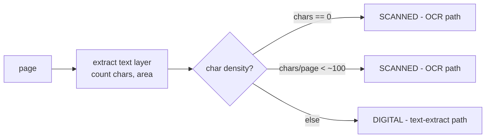

# Lecture 6: Document Parsing with Provenance: Docling, Unstructured, and Structure Preservation

> Retrieval quality is capped by parse quality: a RAG system can only cite what your parser preserved, and can only answer correctly from text that came out in the right order with its tables intact. This lecture is the engineering of turning messy real-world documents — digital PDFs, photographed pages, gnarly HTML — into clean text plus *structured* tables, each block carrying a provenance record that lets Phase 4 point a user at the exact page and box a fact came from. After it you will be able to route a document to the right parser based on whether it has a text layer, reason about reading-order reconstruction and why multi-column layouts scramble without it, keep tables as structure instead of prose, and attach a `{doc_id, page, bbox, source_path, is_scanned}` record to every chunk so that "where did this answer come from?" has a real answer.

**Prerequisites:** Lecture 1 (immutable landing zone), Python 3.11+, comfort with PDF/HTML as formats, having seen JSONL · **Reading time:** ~30 min · **Part of:** Phase 5 — Data Engineering for AI, Week 2

## The core idea (plain language)

A document on disk is not text. A PDF is a bag of drawing instructions — "place glyph 'A' at coordinates (72, 690) in font F" — with no inherent notion of paragraphs, columns, or reading order. An HTML page is a tree of markup wrapped around content, laced with navigation, ads, and cookie banners. A scanned PDF is *just an image*: pixels of a page, zero characters. Your job is to recover, from each of these, the thing a human sees when they read: ordered prose, and tables that still look like tables.

Three ideas carry the whole lecture:

1. **Detection routes the pipeline.** Before you parse, you ask one question: *does this page have an embedded text layer?* A digital PDF does — the characters are right there, you just have to order them. A scanned PDF does not — you must run OCR to *manufacture* text from pixels. Get this wrong and you either OCR a perfectly good digital PDF (slow, lossy, pointless) or feed an image to a text extractor and get an empty string.

2. **Two non-negotiables downstream of detection.** (a) **Reading order must be reconstructed** — the sequence of blocks a human reads, not the order glyphs happen to sit in the file. Multi-column pages, headers, footers, and sidebars all conspire to scramble this. (b) **Tables must survive as structure** — rows and columns preserved as Markdown or HTML — because once a table is flattened into a wall of numbers, the row/column relationships are *gone* and no downstream step can recover them.

3. **Provenance is attached at parse time or never.** For each block you emit, you record *where it came from*: which document, which page, which bounding box on that page, the source path, and whether it was scanned. This is the difference between a RAG answer that says "according to the 2024 Safety Manual, page 12" with a highlight box, and one that says "trust me." If you drop provenance during parsing, you cannot bolt it back on later — the coordinates only exist while you still have the page.

## How it actually works (mechanism, from first principles)

### Step 0 — Digital vs. scanned detection

The whole pipeline forks here, so get it right first.

A **digital (born-digital) PDF** was generated by software (Word, LaTeX, a browser print). It contains a *text layer*: actual character codes with positions. You can extract text directly, cheaply, losslessly.

A **scanned PDF** was produced by a scanner or a phone camera. Each page is an embedded image. There are *no characters* — extracting text returns empty or near-empty. You must run OCR (Optical Character Recognition) to turn pixels into characters, which is slower and introduces errors.

The trap: many real PDFs are **hybrid**. A born-digital contract with one scanned signature page. A scanned report that someone ran through Acrobat's OCR, so it *has* a text layer but a bad one. Detection is therefore **per-page**, not per-document.

Two cheap signals, used together:

- **Presence of a text layer.** Ask the PDF library (e.g. `pypdf`, `pdfplumber`) for the extractable characters on the page. Zero characters ⇒ almost certainly scanned.
- **Character density.** Even a page *with* a text layer can be junk. Compute characters per unit area: `chars / (page_width_pt × page_height_pt)`, or more intuitively **characters per page**. A full text page of a book is ~1,800–3,000 characters. A page reporting 12 characters over a full A4 sheet with a big embedded image is a scan with a stray caption — route it to OCR.



Why bother routing instead of "just OCR everything"? Cost and quality. OCR is ~10–100× slower than reading a text layer and *introduces* errors (a clean digital "rn" never becomes "m", but OCR does). Running OCR on a born-digital PDF is strictly worse on both axes. And `is_scanned` is a field you carry into provenance anyway — downstream needs to know a block's text is OCR output (lower trust, maybe `needs_review`) versus exact.

### Step 1 — Reading order reconstruction

Now you have characters (or OCR tokens) with `(x, y)` positions. The naive move — sort top-to-bottom, left-to-right — works on a single-column page and **catastrophically fails** on two columns.

Consider a two-column academic page. Naive `y`-then-`x` sorting reads *across* both columns line by line:

```
  ┌──────────┬──────────┐        Naive (y, then x) order:
  │ Col A l1 │ Col B l1 │          A-l1  B-l1  A-l2  B-l2 ...
  │ Col A l2 │ Col B l2 │        → "The mitochondria    are found in"
  │ Col A l3 │ Col B l3 │          reading a left sentence and a right
  └──────────┴──────────┘          sentence as one — total scramble.

  Correct reading order:
    A-l1 A-l2 A-l3  (finish column A)  then  B-l1 B-l2 B-l3
```

A human reads column A top to bottom, *then* column B. To recover that, a good parser does **layout analysis**: it detects column boundaries (large vertical whitespace gaps splitting the page), groups blocks into columns, orders blocks *within* a column top-to-bottom, then orders the columns left-to-right. Modern parsers (Docling) use an ML layout model that classifies regions — title, text, list, table, figure, header, footer — and emits them in reading order directly.

**Headers and footers** are the other reading-order hazard. A page number "12" and a running header "SAFETY MANUAL — REV C" sit at the top/bottom of *every* page. If you interleave them into the body, your text is peppered with "12 SAFETY MANUAL REV C" every ~2,000 characters — which then poisons chunking and embeddings. Layout analysis tags these as `page-header`/`page-footer` so you can *keep them for provenance but exclude them from the body stream*.

### Step 2 — Table structure preservation

This is the one most naive pipelines get wrong, and it is unrecoverable.

A table's meaning lives in its **cell grid**: this number is in the row "Q3" and the column "Revenue". Flatten it to prose and you get:

```
Flattened (destroyed):
  Region North South East Q1 100 90 70 Q2 120 95 60 Q3 130 88 ...

Structure preserved (Markdown):
  | Region | Q1  | Q2  | Q3  |
  |--------|-----|-----|-----|
  | North  | 100 | 120 | 130 |
  | South  |  90 |  95 |  88 |
```

In the flattened version, is "88" South's Q3 or East's Q2? *You cannot tell.* The row/column association — the entire point of a table — has been discarded. No LLM downstream can reconstruct it because the information is not there anymore. This is why "tables must survive as structure" is a non-negotiable, not a nicety.

Table **structure recognition** is a distinct ML task from layout analysis: given the table region, detect row and column separators (including *merged cells* and *spanning headers*) and emit a grid. Docling ships a dedicated model for this (TableFormer). The output is Markdown or HTML — HTML when you have merged cells or multi-row headers that Markdown can't express (`colspan`/`rowspan`), Markdown when the grid is simple.

### Step 3 — The provenance record

For every block you emit, attach:

```json
{
  "doc_id": "sha256:9f2c...e10a",
  "source_path": "landing/manuals/dt=2026-07-08/safety_rev_c.pdf",
  "page": 12,
  "bbox": [72.0, 640.5, 523.0, 705.2],
  "is_scanned": false,
  "block_type": "text",
  "text": "Do not operate the press without the guard installed."
}
```

- `doc_id` — a stable content hash of the source doc (ties every chunk back to one document; survives renames).
- `source_path` — the immutable landing-zone path, so you can re-open the exact bytes.
- `page` — 1-indexed page number.
- `bbox` — `[x0, y0, x1, y1]` in PDF points (1 pt = 1/72 inch), the rectangle on the page. This is what lets a UI draw a highlight box on the rendered page.
- `is_scanned` — was this OCR'd? Governs trust and `needs_review` routing.

The `bbox` is the crown jewel and the reason provenance must be captured *at parse time*: the coordinates exist only while you still hold the page geometry. Once you've chunked, cleaned, and embedded, the (x, y) rectangle is gone unless you carried it. You cannot recompute "page 12, box (72,640)–(523,705)" from an embedding vector.

## The parsing-tool landscape

| Tool | What it is | Layout / reading order | Table structure | OCR | Provenance (page/bbox) | Runs where | Cost |
|---|---|---|---|---|---|---|---|
| **Docling** (IBM, OSS) | Document → structured doc model (Markdown/JSON) | ML layout model, strong on multi-column | Dedicated model (TableFormer), Markdown/HTML | Pluggable (EasyOCR/Tesseract/RapidOCR) | Yes — page + bbox per element | Local (CPU/GPU) | Free (compute) |
| **Unstructured** (`unstructured`) | Partition doc into typed **elements** | Element ordering; layout model in `hi_res` mode | Element type `Table` with HTML in `hi_res` | Optional (Tesseract) | Yes — `metadata` carries page, coords | Local or their API | Free OSS / paid API |
| **LlamaParse** (LlamaIndex) | Paid cloud parser | Managed, strong on complex/scanned | Strong, LLM-assisted | Built in (cloud) | Page-level; coordinates vary | Cloud only | Paid per page |

**Docling** produces a single rich document object (`DoclingDocument`) that knows its own structure: headings, paragraphs, lists, tables (as structured objects), plus page and bounding-box metadata for each. You export to Markdown for LLM consumption or to JSON to keep the full structure and provenance. This is your default for a *local, free, provenance-preserving* corpus pipeline — which is exactly what the lab builds.

**Unstructured** takes a different mental model: it **partitions** a document into a flat list of typed *elements* — `Title`, `NarrativeText`, `ListItem`, `Table`, `Image`, `Header`, `Footer`. Each element carries `metadata` (page number, coordinates, source filename). The element-type taxonomy is genuinely useful: you can drop `Header`/`Footer` by type, treat `Title` as chunk boundaries, and route `Table` elements specially. Beware the two speed tiers: `strategy="fast"` skips the layout model (cheap, but weak reading order and no table structure) while `strategy="hi_res"` runs the layout/table models (what you actually want for messy docs). Picking `fast` on multi-column PDFs is a classic self-inflicted scramble.

**LlamaParse** is the paid cloud option. You upload, it parses (often better on truly nasty scanned/complex layouts because it throws big models at the problem), you get Markdown back. Know it exists — it's the escape hatch when local parsing can't crack a critical document set — but it costs per page, sends your documents to a third party (a compliance question for sensitive corpora), and gives you less control over the provenance record. For learning and for most in-house corpora, local Docling/Unstructured is the right call; reach for LlamaParse when a specific high-value, hard-to-parse set justifies the spend.

## Worked example

You have a 40-page **safety manual** in the landing zone. Pages 1–38 are born-digital (two-column layout, several tables). Pages 39–40 are a scanned appendix (photographed, no text layer). Walk the pipeline.

**Detection.** For each page, extract the text layer and count characters:

- Pages 1–38: ~2,400 chars/page over an A4 sheet (~595×842 pt) ⇒ text layer present, density normal ⇒ `is_scanned=false`, **digital path**.
- Pages 39–40: 0 extractable characters (pure image) ⇒ `is_scanned=true`, **OCR path**.

So 38 pages go through fast text extraction + layout analysis; 2 pages go through OCR. If you'd OCR'd all 40, at say ~3 s/page CPU OCR that's 120 s; routing means ~2 pages × 3 s = 6 s of OCR plus ~38 pages of sub-second extraction. **~20× less OCR work**, and the 38 digital pages come out character-perfect instead of OCR-approximate.

**Reading order.** Page 12 is two-column with a running header. Layout analysis finds the column split near `x=300`, emits left-column blocks top-to-bottom then right-column blocks, and tags the header "SAFETY MANUAL — REV C / 12" as `page-header` (kept in provenance, excluded from the body). A naive sort would have produced "The emergency SAFETY MANUAL stop button REV C is located 12 on the left" — you can see how that destroys retrieval.

**Table.** Page 20 has a torque-spec table (bolt size → torque). Structure recognition emits:

```
| Bolt | Torque (Nm) | Grade |
|------|-------------|-------|
| M6   | 10          | 8.8   |
| M8   | 25          | 8.8   |
| M10  | 49          | 8.8   |
```

Now a query "what torque for an M8 bolt?" retrieves a chunk where "M8" and "25" are in the same row — answerable. Flattened ("M6 10 8.8 M8 25 8.8 M10 49 8.8"), the model can only guess.

**Provenance emitted** for the torque block:

```json
{ "doc_id": "sha256:9f2c...", "source_path": "landing/manuals/dt=2026-07-08/safety_rev_c.pdf",
  "page": 20, "bbox": [80, 410, 515, 505], "is_scanned": false,
  "block_type": "table", "tables_md": "| Bolt | Torque (Nm) | Grade |\n..." }
```

**Payoff in Phase 4.** A user asks "M8 torque?" The RAG system retrieves this chunk, answers "25 Nm (Safety Manual Rev C, page 20)", and the UI draws a box at `bbox` on the rendered page 20. That citation-with-highlight is only possible because `page` and `bbox` were captured *here*, at parse time.

## How it shows up in production

- **The scrambled-multi-column incident.** A team parsed a corpus of two-column PDFs with a fast text extractor (no layout model). Retrieval "worked" in demos on single-column docs and produced confident nonsense on the two-column ones — sentences fused across the column gutter, embeddings of gibberish. The fix was a layout-aware parser; the lesson is that *reading order failures are silent* — no exception, just quietly wrong text that poisons every downstream stage.
- **The flattened-table support fire.** A finance RAG flattened tables. Users asked "Q3 revenue for the North region" and got numbers from the wrong cell — the model latched onto a nearby number because the row/column link was gone. This is worse than "I don't know": it's confidently wrong on structured data, the exact thing tables exist to make unambiguous. Unrecoverable without re-parsing from raw (which is why Lecture 1's immutable landing zone matters — you *can* re-parse).
- **The "where's this from?" that can't be answered.** A pilot shipped without provenance ("we'll add citations later"). Legal then required source attribution for every answer. There was no path to add it short of re-parsing the whole corpus, because bboxes only exist at parse time. Weeks of rework for a field that costs nothing to capture on the first pass.
- **OCR cost blowout.** A pipeline OCR'd every page "to be safe," including tens of thousands of born-digital pages. OCR is the slowest, most expensive stage; running it on pages with a perfectly good text layer multiplied compute cost ~20× and *degraded* text (OCR errors on pages that had none). Detection-based routing is a pure win: cheaper and higher quality.
- **The hybrid-PDF gap.** Per-*document* detection labeled a mostly-digital contract "digital" and skipped OCR — silently losing the one scanned signature page (0 chars, no OCR, no text). Per-*page* detection catches it. Real corpora are full of hybrids; assume per-page.

## Common misconceptions & failure modes

- **"PDF is basically text, extraction is trivial."** No. PDF is positioned glyphs with no reading order. Single-column looks trivial; multi-column, tables, and headers are where it bites. Extraction is layout analysis, not string reading.
- **"Just OCR everything — simpler."** OCR is slow, costly, and lossy. On born-digital pages it's strictly worse than reading the text layer. Detect and route.
- **"A flattened table is fine, the LLM will figure it out."** The row/column association is *destroyed*, not obscured. The information is gone; no model can recover it. Keep tables as Markdown/HTML.
- **"Detect scanned-vs-digital per document."** Real PDFs are hybrids. Detect per page or you drop the scanned pages inside a mostly-digital doc (or waste OCR on the digital pages of a mostly-scanned one).
- **"We'll add citations/provenance later."** Bbox and page coordinates exist only during parsing. "Later" means re-parsing the entire corpus. Capture provenance on the first pass, always.
- **"Zero extracted characters means the PDF is empty."** It means *no text layer* — it's a scan. Empty extraction is the signal to OCR, not to discard.
- **"Markdown handles any table."** Markdown can't express merged cells / multi-row headers (`colspan`/`rowspan`). Use HTML for complex tables; Markdown only for simple grids.

## Rules of thumb / cheat sheet

- **Detect first, per page.** Text layer present + reasonable char density ⇒ digital (direct extract). Zero chars or very low density ⇒ scanned (OCR). *(approximate density floor: ~100 chars/page; tune to your corpus.)*
- **Default parser: Docling** for local, free, provenance-preserving parsing with table structure. **Unstructured** when you want typed elements (`Title`/`Table`/`Header`) for chunking/filtering. **LlamaParse** only when a hard, high-value doc set justifies paid cloud.
- **Never use a `fast`/no-layout mode on multi-column docs.** Reading order will scramble silently. Use the `hi_res`/layout-model path.
- **Tables → Markdown (simple) or HTML (merged cells). Never prose.** A flattened table is unreconstructable.
- **Exclude headers/footers from the body stream** but keep them tagged for provenance — don't let running headers pepper your text every ~2,000 chars.
- **Emit one provenance record per block:** `{doc_id, source_path, page, bbox, is_scanned, block_type}`. Non-negotiable, captured at parse time.
- **`bbox` in PDF points `[x0,y0,x1,y1]`.** It's what powers highlight-on-page citations downstream.
- **Carry `is_scanned` forward** — it drives trust and `needs_review` routing for OCR'd text.
- **Re-parsing is your safety net** *only if* you kept the raw bytes (Lecture 1's immutable landing zone). Parse bugs are fixable by replay; lost raw is not.

## Connect to the lab

This week's `extract.py` uses Docling to parse a mixed folder (digital PDFs, a scanned PDF, HTML) and emit one record per block as `{doc_id, page, bbox, text, tables_md, source_path, is_scanned}` — the provenance record from this lecture, made concrete. Verify tables come out as Markdown (not mangled prose) and that every record carries page + bbox. The digital-vs-scanned detection you build here is what `ocr_route.py` keys on next (Lecture 7's OCR + confidence routing), and the provenance you preserve now is exactly what Phase 4's RAG citations and Week 3's governance proof depend on.

## Going deeper (optional)

- **Docling docs & repo** (github.com/docling-project/docling, docling-project.github.io/docling). The `DoclingDocument` model, layout + TableFormer table structure, and export APIs. Search: *Docling IBM github*, *Docling TableFormer table structure*.
- **Unstructured docs** (docs.unstructured.io). Partitioning, element types, and the `fast` vs `hi_res` strategies. Search: *Unstructured.io partition strategies hi_res*.
- **LlamaParse / LlamaCloud docs** (docs.cloud.llamaindex.ai). The paid cloud parser and its Markdown output. Search: *LlamaParse documentation*.
- **pdfplumber** (github.com/jsvine/pdfplumber). Great for *seeing* raw char positions and per-page char counts yourself — the best way to build intuition for why reading order is hard. Search: *pdfplumber extract words chars*.
- **PDF format intuition:** the Adobe PDF reference is heavy; instead search *PDF text extraction why hard reading order* for practitioner write-ups on positioned glyphs and column detection.
- **Table structure recognition research:** search *TableFormer table structure recognition* and *PubTabNet dataset* for how the table models are trained and evaluated.

## Check yourself

1. You have a 100-page PDF: 98 born-digital pages and 2 scanned photos of a form. Your teammate ran detection at the *document* level and labeled it "digital." What goes wrong, and what's the correct granularity?
2. Explain, with a concrete two-column example, why sorting extracted characters top-to-bottom then left-to-right produces scrambled text. What does a layout-aware parser do instead?
3. Why is flattening a table into prose *unrecoverable*, whereas a reading-order mistake is at least *re-fixable*? What must be true for the re-fix to be possible?
4. A stakeholder says "skip provenance for the MVP, we'll add source citations in v2." Why is this far more expensive than it sounds? Which field specifically cannot be reconstructed later?
5. Give two cheap signals for digital-vs-scanned detection and a rough threshold for each. Why do you use both instead of just checking for a text layer?
6. When would you choose Unstructured over Docling, and when would you pay for LlamaParse instead of running either locally?

### Answer key

1. Per-document detection labels the whole file "digital" and takes the text-extract path, which returns **zero characters for the 2 scanned pages** — those pages are silently lost (no OCR, no text). Detection must be **per page**: pages 1–98 extract directly, pages 99–100 route to OCR. Real PDFs are frequently hybrid, so per-page is mandatory.
2. On a two-column page, `y`-then-`x` sorting reads *across* both columns line by line: it emits "Col-A line 1", "Col-B line 1", "Col-A line 2", "Col-B line 2"… — fusing a left-column sentence and a right-column sentence into one scrambled line. A human reads all of column A top-to-bottom, then all of column B. A layout-aware parser detects the column boundary (the vertical whitespace gutter), groups blocks into columns, orders within each column top-to-bottom, then orders columns left-to-right (and tags headers/footers so they don't interleave).
3. Flattening discards the **row/column association** — the only information a table carries. In *your flattened output* the link between "88" and (row=South, col=Q3) exists nowhere, so nothing downstream of the parse can recompute it: relative to that output, the information is *destroyed*. A reading-order mistake only *reorders* text that still exists, so it's obviously re-fixable. The key insight: both are only truly recoverable if you **kept the raw bytes** (immutable landing zone) and can re-parse — but with tables the *right move is to never flatten in the first place*, because the whole point of re-parsing raw is to emit the structure you should have emitted originally.
4. `bbox` (and page geometry) exist **only while parsing holds the page** — coordinates cannot be recovered from a chunk of text or an embedding vector. "Adding citations in v2" therefore means **re-parsing the entire corpus** to recapture page/bbox, not a small feature add. The `bbox` field specifically is unreconstructable after the fact.
5. (a) **Text-layer presence:** ask the PDF library for extractable characters; **0 chars ⇒ scanned**. (b) **Character density:** chars per page; **below ~100 chars/page ⇒ treat as scanned**. You use both because a page can *have* a text layer that's junk — e.g. a scanned page someone OCR'd badly, or a mostly-image page with one stray caption — so presence alone gives false "digital" labels; density catches the low-quality/near-empty text layers.
6. Choose **Unstructured** when its typed-element model helps you — dropping `Header`/`Footer` by type, using `Title` as chunk boundaries, routing `Table` elements — i.e. when you want the partition taxonomy more than Docling's single structured document. Pay for **LlamaParse** when a specific, high-value document set is too hard for local parsing (very messy scans/complex layouts) and the per-page cost plus sending data to a third party is acceptable — not as a default, but as an escape hatch for the hard 5%.
