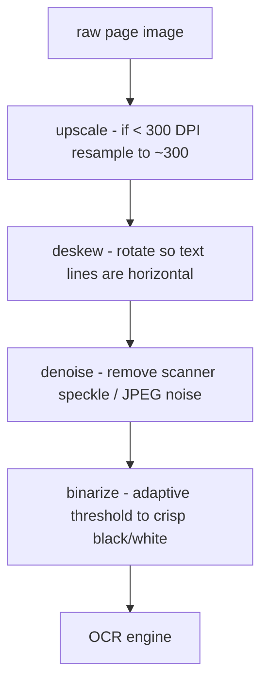

# Lecture 7: OCR Reality: Preprocessing, Engine Choice, and Confidence Routing

> Every team that adds OCR to a pipeline goes through the same arc: they pick an engine, wire it up, get garbage on the hard 15% of pages, and then spend a month tuning the engine when the real problem was a 150-DPI skewed scan they never fixed. This lecture short-circuits that month. It teaches the one thing that dominates OCR quality — image preprocessing — and the one pattern that keeps bad OCR from silently poisoning your corpus: **confidence routing**. After it you will be able to detect which pages even need OCR, run a preprocessing pipeline (deskew, binarize, denoise, upscale) before any engine touches the page, choose sensibly between free/local engines and paid cloud/VLM OCR, capture per-region confidence into your records, count `needs_review` blocks, and decide — with numbers, not vibes — when to escalate a hard page to an expensive model.

**Prerequisites:** Lecture 6 (document parsing & digital-vs-scanned routing), Python 3.11+, comfort with running CLI tools and reading JSON, basic probability (means, thresholds) · **Reading time:** ~30 min · **Part of:** Phase 5 — Data Engineering for AI, Week 2

## The core idea (plain language)

Three sentences you should internalize before anything else:

1. **OCR quality is dominated by the image you feed the engine, not by which engine you pick.** A clean 300-DPI binarized page will read well on Tesseract, PaddleOCR, or a cloud API. A skewed, gray, 150-DPI phone photo will read badly on all of them. The variance between "good input" and "bad input" dwarfs the variance between engines.
2. **OCR engines already tell you when they are guessing — most people throw that signal away.** Every serious engine emits a per-character, per-word, or per-line **confidence score**. If you capture it, you can auto-accept the 85% of output that is trustworthy and *quarantine* the 15% that isn't, instead of shipping a uniformly-suspect blob downstream.
3. **The expensive fix (cloud/VLM OCR) should be reserved for the pages that actually need it.** You detect hard pages by their low confidence and escalate only those — turning a per-page cost decision into a small, bounded line item instead of a corpus-wide bill.

Put together: **detect** which pages need OCR → **preprocess** the image → **OCR locally** and capture confidence → **auto-accept high confidence, flag low confidence as `needs_review`** → optionally **escalate** the flagged pages to a VLM. The engineering discipline is "measure confidence, don't assume." You are not building a better OCR engine; you are building a *router* around commodity engines.

## How it actually works (mechanism, from first principles)

### Step 0 — Detecting which pages need OCR (the trigger from Lecture 6)

OCR is slow and lossy. You never run it on a page that already has a text layer. Lecture 6's parser routes each page on two cheap signals:

- **Does the page have an embedded text layer?** A digital PDF stores actual glyphs; you can extract them directly with zero OCR. A scanned PDF is just an image wrapped in PDF. `pdfplumber`/`pypdf` returns text for the former, an empty (or near-empty) string for the latter.
- **Character density.** Some PDFs have a *broken* or *partial* text layer — a few stray characters, a watermark, page numbers — that fools a naive "has text?" check. The robust signal is **characters per page area**. A real text page has hundreds to thousands of characters; a scanned page masquerading as digital has a handful.

```python
def needs_ocr(page) -> bool:
    text = page.extract_text() or ""
    chars = len(text.strip())
    # normalize by page area so big and small pages compare fairly
    area_in2 = (page.width * page.height) / 72 / 72   # PDF units are 1/72"
    density = chars / max(area_in2, 1.0)
    # thresholds are approximate; measure on YOUR corpus
    return chars < 50 or density < 5.0
```

Numbers to anchor on (approximate, calibrate per corpus): a normal body page runs **1,500–4,000 chars** over ~93 in² (US Letter), so density ~16–43 chars/in². Anything under ~5 chars/in² is almost certainly an image. This is the branch that fires OCR — everything below only runs on that minority of pages.

### Step 1 — Preprocessing: the part that actually moves the needle

OCR engines were trained on clean, high-resolution, upright black-on-white text. Every way your input deviates from that costs accuracy. You fix the deviations *before* the engine, in this rough order:



**Upscale low-DPI pages.** DPI (dots per inch) is the single biggest lever. OCR engines want roughly **300 DPI** for body text; character-recognition accuracy falls off a cliff below ~200 DPI because individual strokes blur into each other. A page scanned at 150 DPI has ~4x fewer pixels per character than 300 DPI. Upsampling to 300 (bicubic or a super-resolution model) doesn't add information, but it gives the engine's convolution windows enough pixels to work with and reliably recovers several accuracy points. Rule of thumb: **a lowercase letter should be at least ~20 pixels tall** for reliable recognition.

**Deskew.** Scans and photos are rarely perfectly upright. Even **2–3 degrees** of skew noticeably degrades line segmentation because the engine assumes text rows are horizontal — a slanted line drifts across row boundaries and characters get mis-grouped. Deskewing estimates the dominant text angle (projection profile or Hough transform under the hood — your library does this) and rotates the page flat.

**Denoise.** Scanner speckle, coffee stains, JPEG compression artifacts, and bleed-through from the back of the page all create spurious dark pixels the engine may read as punctuation or accents. A median/bilateral filter removes isolated noise while keeping stroke edges.

**Binarize.** Convert grayscale/color to pure black-and-white. **Adaptive/Otsu thresholding** (compute the threshold locally, per region) beats a single global cutoff because real scans have uneven lighting — one corner darker than another. Binarization is where a gray, low-contrast page becomes crisp glyphs.

You do not need CV theory to use these — libraries like OpenCV (`cv2`), `scikit-image`, or the `ocrmypdf` preprocessing flags implement all four. The engineering point is **ordering and measurement**: upscale first (so later steps operate on enough pixels), and always A/B the pipeline by measuring OCR confidence before vs. after on a sample.

Approximate impact (calibrate yourself — do not quote these as benchmarks): on a batch of messy scans, adding deskew + binarize + upscale commonly moves mean line confidence from the 0.6s into the 0.85+ range and cuts `needs_review` blocks by more than half. That improvement is **larger than what you'd get by switching engines**, which is the whole thesis.

### Step 2 — Engine choice (secondary, but real)

Only after preprocessing does engine choice matter, and mostly for **layout**, not raw character accuracy.

| Engine | Cost | Strength | Weakness |
|---|---|---|---|
| **Tesseract** | Free, local | Ubiquitous, scriptable, decent on clean single-column text | Weak on complex layouts, tables, rotated text; older LSTM model |
| **PaddleOCR** | Free, local | Strong detection+recognition, good multilingual, built-in angle classifier, decent tables | Heavier install; GPU helps a lot |
| **AWS Textract** | Paid (~per-page) | Excellent on forms/tables/key-value, returns structured layout + confidence | Cost at scale; cloud dependency; US-centric defaults |
| **Mistral OCR** | Paid (per-page) | Strong on dense/messy documents, markdown output | Newer; cost; cloud |
| **GPT-4o / 4o-mini vision** | Paid (per-image tokens) | Best on truly messy, handwritten, weird-layout pages; "reads" context | Most expensive per page; can *hallucinate* text that isn't there; no honest per-token confidence |

The mental model: **local engines (PaddleOCR, Tesseract) are your default workhorse** — free, fast enough, and good on preprocessed pages. **Cloud engines (Textract, Mistral OCR)** win on structured documents (forms, tables, multi-column) and give you clean confidence scores. **VLMs (GPT-4o/4o-mini vision)** win on the genuinely hard, messy, or handwritten pages — but they cost the most and carry a unique risk: a VLM will confidently *invent* plausible text rather than admit it can't read something, and it doesn't hand you an honest per-character confidence to catch that. Use VLMs as an *escalation target*, not a default.

### Step 3 — Confidence routing (the core pattern)

Every engine reports confidence differently, so you normalize to **a mean confidence per block/line/region in [0,1]**:

- Tesseract: per-word `conf` in 0–100 (divide by 100). It emits `-1` for non-text; drop those before averaging.
- PaddleOCR: per-detected-line `(text, score)` where `score ∈ [0,1]`.
- Textract: per-block `Confidence` in 0–100.
- VLMs: **no honest confidence** — this is a reason they're an escalation target, not a router input.

The routing rule is deliberately simple:

```
for each block:
    mean_conf = mean(line/word confidences in block)
    if mean_conf >= THRESHOLD (e.g. 0.80):
        accept, needs_review = False
    else:
        accept text but tag needs_review = True   # do NOT trust silently
```

Three subtleties that bite people:

1. **Mean can hide a bad line.** A block of 10 lines at 0.95 and 1 line at 0.30 averages ~0.89 — passes the threshold while containing garbage. For critical fields, also flag if **any single line < a hard floor** (e.g. 0.50), or track the min alongside the mean.
2. **Confidence is calibration, not truth.** A 0.80 score does not mean "80% of characters are correct." Engines are often *overconfident* — a garbled line can still score 0.85. That's why you calibrate the threshold against ground truth on a sample of *your* documents, not the vendor's demo.
3. **`needs_review` is a tag, not a delete.** You keep the low-confidence text (it's often mostly right and useful for search recall) but you *mark* it so downstream consumers — and humans — know not to trust it for high-stakes extraction. Silently dropping it loses recall; silently trusting it poisons answers.

## Worked example

You ingest a 200-page mixed batch: 170 digital pages, 30 scanned. Walk the numbers.

**Detection (Step 0):** density check flags the 30 scanned pages for OCR; the 170 digital pages skip OCR entirely (direct text extraction, ~0 cost). You already saved 85% of the OCR work.

**Baseline OCR, no preprocessing (PaddleOCR, local):** the 30 scanned pages produce 900 line-blocks. Mean confidence distribution:

```
conf ≥ 0.90 : 400 blocks   ┃██████████████
0.80–0.90   : 200 blocks   ┃███████
0.60–0.80   : 180 blocks   ┃██████        ← needs_review
< 0.60      : 120 blocks   ┃████          ← needs_review
```

`needs_review` (mean < 0.80) = **300 blocks (33%)**. That's a lot of human review.

**Add preprocessing (upscale 150→300 DPI, deskew ~3°, binarize):** re-OCR the same 30 pages:

```
conf ≥ 0.90 : 610 blocks   ┃█████████████████████
0.80–0.90   : 180 blocks   ┃██████
0.60–0.80   : 80 blocks    ┃███           ← needs_review
< 0.60      : 30 blocks    ┃█             ← needs_review
```

`needs_review` = **110 blocks (12%)**. Preprocessing cut review load by ~63% — with the *same free engine*. (These numbers are illustrative; measure your own.)

**Escalate the stubborn pages to a VLM:** the 110 remaining low-confidence blocks concentrate on ~6 pages (crumpled, handwritten margins). You send *only those 6 page images* to GPT-4o-mini vision.

Cost math (illustrative, check current pricing — see "Going deeper"): a single page image at moderate resolution is on the order of ~1,000–1,500 input tokens plus output. Say ~$0.002–0.004 per page on 4o-mini. **6 pages ≈ $0.02.** If you had naively sent *all 200 pages* to the VLM you'd pay for 200 pages (~$0.60) plus the hallucination risk on the 194 pages a free engine handled perfectly. Escalation turned a $0.60 corpus-wide bill into a ~$0.02 targeted one and kept the trustworthy pages on the engine that gives honest confidence.

**Capture into the record:** every block lands with its confidence and flag:

```json
{
  "doc_id": "manual-42",
  "page": 87,
  "bbox": [72, 140, 520, 168],
  "text": "Torque the M6 bolts to 9 Nm.",
  "ocr_engine": "paddleocr",
  "ocr_mean_conf": 0.93,
  "needs_review": false
}
```

Now `SELECT count(*) FROM blocks WHERE needs_review` is a one-line health metric, and a human review queue is just a filter over your corpus.

## How it shows up in production

- **Cost lands on the escalation branch, not the router.** Your bill is `(# hard pages) × (VLM per-page cost)`. Watch the *fraction* of pages escalating over time — if it creeps up, a source's scan quality dropped (new vendor, worse scanner) and you fix the scanner, not the model. A flat 5–10% escalation rate is healthy; 40% means your preprocessing regressed or a new document type arrived.
- **Latency: preprocessing + local OCR is CPU-bound and slow.** PaddleOCR/Tesseract on CPU can be **1–5 seconds per page**; GPU cuts that ~5–10x. VLM calls add **network latency + seconds of inference** per page. Batch the OCR stage and run it async — never inline OCR in a request path.
- **The silent-poisoning failure.** The classic incident: OCR misreads "not eligible" as "now eligible" (or a decimal point shifts "9.0" to "90"), confidence was 0.72, nobody flagged it, and it flows into a RAG answer or a fine-tuning set. With confidence routing that block is tagged `needs_review` and never silently trusted. Without it, you find out from a customer.
- **VLM hallucination is a distinct failure class.** Unlike a garbled Tesseract line (obviously wrong), a VLM produces *fluent, plausible, wrong* text with no low-confidence signal. Never route to a VLM and auto-accept without a second check (e.g., cross-check against the local OCR, or human-review VLM output on high-stakes docs).
- **Provenance must ride along.** From Lecture 6, every block keeps `{doc_id, page, bbox}`. When a `needs_review` block surfaces, a human needs to jump straight to that region of that page — bbox makes review a 5-second glance instead of a page hunt.
- **Threshold drift.** A threshold calibrated on English printed manuals will over-flag on a new language or handwriting-heavy source. Re-calibrate per source type; store the threshold used in the record so you can re-interpret historical flags.

## Common misconceptions & failure modes

- **"Engine X is better than engine Y, so switch."** Usually false at the margin — you're comparing engines on *unpreprocessed* input, where noise dominates. Fix the image first, *then* compare. The between-engine gap on clean pages is small.
- **"Higher confidence = correct."** No. Confidence is the engine's self-estimate and is frequently overconfident. Calibrate against ground truth; treat the threshold as a tunable knob, not a truth line.
- **"Just send everything to GPT-4o vision, it's the best."** Best per-page quality, worst cost, and it *hallucinates* text with no confidence signal. It's an escalation target for the hard minority, not a default.
- **Averaging away a bad line.** Block-mean confidence hides a single catastrophic line. Track the min or a hard per-line floor for critical content.
- **`has_text_layer == True` ⇒ skip OCR.** Partial/broken text layers (watermarks, page numbers) fool this. Use character *density*, not mere presence.
- **Skipping preprocessing on "looks fine" pages.** A page that looks fine to your eye can still be 150 DPI and 2° skewed. Measure DPI and confidence; don't eyeball it.
- **Deleting low-confidence text.** Dropping `needs_review` blocks tanks recall. Tag, don't delete — low-confidence text is often mostly correct and useful for search.

## Rules of thumb / cheat sheet

- **Detect OCR need by char density**, not just "has text": `chars < ~50` or `density < ~5 chars/in²` → OCR. (Calibrate.)
- **Preprocess in this order:** upscale (→~300 DPI) → deskew → denoise → binarize (adaptive/Otsu). Aim for lowercase letters ≥ ~20 px tall.
- **300 DPI is the target; below 200 DPI accuracy craters.** Upscaling low-DPI pages is the single highest-ROI step.
- **Even 2–3° of skew hurts** — always deskew scans/photos.
- **Default engine = PaddleOCR (or Tesseract) local, free.** Escalate only the low-confidence minority.
- **Normalize all confidences to [0,1]; route on block mean.** `< 0.80 → needs_review` is a sane starting threshold — then calibrate on ground truth.
- **Also flag if any single line < ~0.50**, so a mean doesn't mask a bad line.
- **VLMs (GPT-4o/4o-mini) = escalation only.** No honest confidence; can hallucinate; most expensive. Cross-check or human-review their output.
- **Capture into the record:** `ocr_engine`, `ocr_mean_conf`, `needs_review`, plus `{doc_id, page, bbox}` provenance.
- **Track two metrics forever:** `% blocks needs_review` and `% pages escalated`. Both drifting up = upstream scan quality dropped.
- **OCR is a slow batch stage.** Never inline it in a request path; run async, batch, cache by image hash.

## Connect to the lab

This lecture is the theory behind `ocr_route.py` in the Week 2 lab. You'll detect scanned/low-density pages (the branch from Lecture 6's `extract.py`), run PaddleOCR on CPU over a few scanned pages, capture per-line confidence, and tag any block with mean confidence `< 0.80` as `needs_review=true` — then report the count. The optional stretch is to send the low-confidence pages to GPT-4o-mini vision or Textract's free tier and compare cost vs. quality, exactly as in the worked example. Everything you flag flows into the Week 3 quality contract and the drop report.

## Going deeper (optional)

Real, findable resources (verify current details at the source — do not trust remembered pricing/benchmarks):

- **PaddleOCR** — GitHub repo `PaddlePaddle/PaddleOCR` (README covers detection, recognition, angle classification, confidence). Search: *PaddleOCR github*.
- **Tesseract** — docs at `tesseract-ocr.github.io`; the "ImproveQuality" wiki page is specifically about preprocessing (DPI, binarization, borders). Search: *Tesseract improve quality preprocessing*.
- **OCRmyPDF** — `ocrmypdf.readthedocs.io`; excellent practical preprocessing flags (`--deskew`, `--clean`, `--oversample`) and a great docs section on why preprocessing matters. Search: *ocrmypdf deskew clean*.
- **OpenCV** thresholding tutorial (`docs.opencv.org`) — adaptive vs. Otsu binarization. Search: *OpenCV adaptive threshold tutorial*.
- **AWS Textract** — `docs.aws.amazon.com/textract`; look at the response schema's per-block `Confidence`. Search: *AWS Textract detect document text confidence*.
- **Mistral OCR** — announced 2024–2025; search: *Mistral OCR announcement docs* for the current API and pricing.
- **OpenAI vision** — `platform.openai.com/docs` (vision guide + pricing page for current per-image token costs). Search: *OpenAI GPT-4o vision pricing*.
- Concept search: *OCR confidence calibration threshold*, *CER WER OCR evaluation* (character/word error rate — how you'd measure accuracy against ground truth if you build a test set).

## Check yourself

1. Why does preprocessing usually matter more than engine choice for OCR accuracy? Give the mechanism, not just the slogan.
2. You have a scanned PDF whose pages return a few dozen characters of text (page numbers + a watermark). Would a naive "has text layer?" check route it correctly, and what's the robust alternative?
3. A block of OCR output has mean confidence 0.88 but contains one clearly garbled line. How can that happen, and how do you catch it?
4. Why are VLMs (GPT-4o vision) a poor choice as your *default* OCR engine but a good *escalation* target?
5. Your escalation rate to the VLM jumps from 6% to 35% one week. What's the most likely cause, and where do you look first?
6. Why do you tag low-confidence blocks `needs_review` instead of deleting them?

### Answer key

1. OCR engines are trained on clean, upright, ~300-DPI black-on-white text. Real scans deviate (low DPI blurs strokes, skew breaks line segmentation, noise adds spurious marks, low contrast muddies glyphs). Those deviations degrade *every* engine, and the accuracy loss from bad input is larger than the accuracy difference between engines on clean input. Fixing the image removes the dominant error source; swapping engines only nibbles at the residual.

2. No — a naive check sees non-empty text and skips OCR, so the real content (an image) never gets read. The robust alternative is **character density** (chars per page area): a genuine text page has hundreds–thousands of chars over ~93 in²; a watermark+page-number page has a handful, so density falls well below the threshold and correctly routes to OCR.

3. The block mean averages one bad line (say 0.30) against many good ones (0.95), pulling the mean up over the 0.80 threshold while hiding the garbage. Catch it by also tracking the **minimum** line confidence or applying a **hard per-line floor** (e.g., flag if any line < 0.50) in addition to the block mean.

4. VLMs are the most expensive per page, and critically they give **no honest per-character confidence** and will *hallucinate* fluent, plausible, wrong text rather than signal uncertainty — so you can't route or auto-accept their output safely. As a default they'd blow your budget on pages a free engine handles perfectly and introduce silent errors. As an escalation target for the low-confidence minority, their strength on messy/handwritten pages pays off on a small, bounded number of pages.

5. Upstream scan quality almost certainly dropped — a new scanner, a new (worse) source vendor, or a new document type (e.g., handwriting) entered the pipeline. Look first at the *source* of the newly-escalating pages and their DPI/skew, and check whether a preprocessing step regressed. Fix the input, not the model.

6. Low-confidence text is usually *mostly* correct and valuable for search recall; deleting it loses that recall. Tagging preserves the text while signaling downstream consumers (and human reviewers) not to trust it for high-stakes extraction — you get recall without silently poisoning answers, and `count(needs_review)` becomes a live quality metric and review queue.
