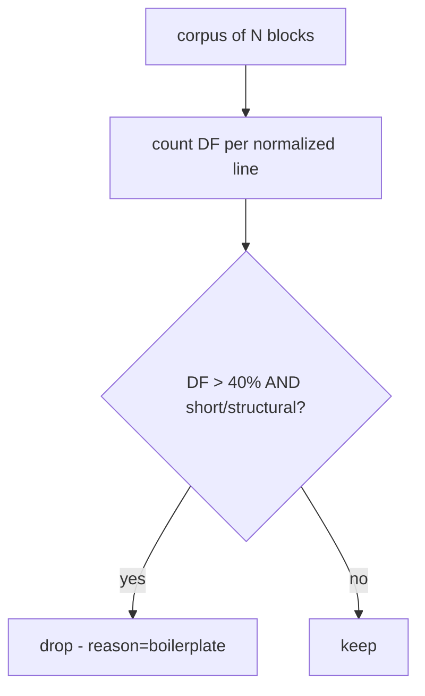
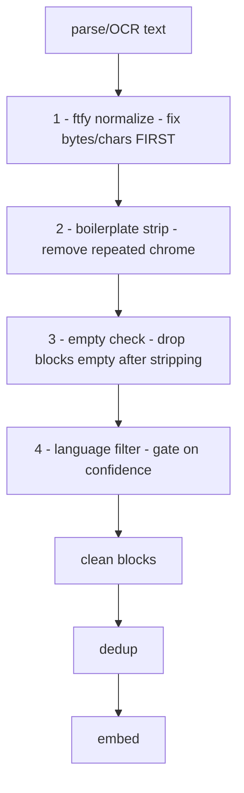

# Lecture 8: Text Normalization and Cleaning — Mojibake, Boilerplate, Language Filtering, and Drop Reports

> Between "the parser gave me text" and "this text is safe to embed" sits a stage everyone skips and everyone regrets. Raw extracted text is riddled with encoding scars (`don’t`), template chrome (the same nav bar on 4,000 pages), and stray non-target-language blocks — and each of these silently poisons the two operations you run next: deduplication and embedding. This lecture teaches the cleaning stage as an engineering discipline, not a bag of regexes. After it you will be able to repair Unicode damage with `ftfy`, strip boilerplate without nuking real content, filter language with a calibrated confidence threshold, and — the part that makes the whole thing trustworthy — produce a **drop report** where every single input row is accounted for by the invariant `rows_in == rows_out + sum(drops)`.

**Prerequisites:** Lecture 7 (parsing/OCR with provenance), Python 3.11+, comfort with UTF-8 vs. bytes, basic probability · **Reading time:** ~30 min · **Part of:** Phase 5 — Data Engineering for AI, Week 2

## The core idea (plain language)

Parsing gives you *text-shaped bytes*. It does not give you *clean text*. The gap between the two is full of three kinds of garbage:

1. **Encoding damage (mojibake)** — text that was decoded with the wrong charset somewhere upstream, so `"` becomes `“`, `é` becomes `é`, and a non-breaking space becomes ` `. The characters *look* wrong to a human and, more importantly, are *different bytes* to a computer.
2. **Boilerplate** — the header, footer, navigation, cookie banner, "Page 3 of 47", and copyright line that repeat on hundreds or thousands of blocks. It is real text, correctly encoded, and completely worthless as corpus content.
3. **Wrong-language blocks** — a German legal disclaimer inside an English manual, an untranslated menu, a block of OCR noise that isn't any language at all.

The cleaning stage removes or repairs all three **before** you dedup, filter, or embed. Ordering is not cosmetic: normalize first, because dedup and language detection both operate on the *bytes and characters* you feed them, and mojibake changes both. Two copies of the same paragraph — one clean, one with smart-quote damage — are byte-different, so exact-hash dedup misses them and MinHash under-counts the overlap. An embedding model tokenizes `’` into junk subword tokens that drag the vector somewhere meaningless. Fix encoding first and both problems evaporate.

The second core idea is **accountability**. Cleaning *deletes data*. A pipeline that deletes data without a receipt is a pipeline you cannot trust and cannot debug. So every stage emits a machine-readable count of what it dropped and *why* (`parse-fail`, `mojibake-unrepairable`, `boilerplate`, `non-english`, `empty`), and the corpus maintains the hard invariant that nothing vanishes unaccounted: **rows in equals rows out plus the sum of all drops.**

## How it actually works (mechanism, from first principles)

### Why mojibake happens (the double-decode)

Text on disk is always *bytes*. To become characters, bytes get decoded with a charset. Mojibake is what you get when text is encoded with one charset and decoded with another — usually UTF-8 bytes read as if they were Latin-1 (a.k.a. cp1252, Windows-1252).

Walk through one character. The right single quote `'` (U+2019) encodes in UTF-8 as **three bytes**: `0xE2 0x80 0x99`. If some upstream system reads those three bytes back as Windows-1252 — a single-byte charset where every byte is one character — you get three separate characters:

```
byte 0xE2 -> 'â'   (U+00E2)
byte 0x80 -> '€'   (U+20AC)
byte 0x99 -> '™'   (U+2122)
```

So `it's` becomes `it’s`. This is the single most common mojibake signature in the wild — the `’` / `“` / `â€` family — and it comes from exactly this UTF-8→Windows-1252 misread. The information is *not lost*: the three garbage characters are a lossless, reversible re-encoding of the original byte sequence. That is the whole reason repair is possible.

`ftfy` ("fixes text for you") works by *re-encoding and re-decoding*: it takes your string, encodes it back to bytes under the wrong charset it detects, then decodes those bytes as UTF-8. If the round-trip produces valid, more-sensible text, it keeps it. It also handles double- and triple-encoded damage by iterating until the text stops changing.

```python
import ftfy
ftfy.fix_text("The Mona Lisa doesn’t have eyebrows.")
# -> "The Mona Lisa doesn't have eyebrows."
ftfy.fix_text("étude")          # -> "étude"
ftfy.fix_text("£100 — cheap") # -> "£100 — cheap"
```

`ftfy` also does normalization you almost always want for a corpus: collapsing curly "smart quotes" and en/em dashes to consistent forms (optionally to ASCII), expanding ligatures (`fi` U+FB01 → `fi`), stripping zero-width characters and control junk, and applying Unicode NFC normalization so that `é` as one code point and `e` + combining-accent as two code points become the *same* bytes. That last one matters enormously for dedup and hashing: visually identical strings that differ only in normalization form hash differently.

### Why encoding damage is worse than it looks

The damage is *silent*. `’` renders as visible garbage a human catches in five seconds, but nobody reviews 2 million blocks by hand. Downstream, three things break quietly:

- **Exact-hash dedup misses dupes.** `hash("doesn't")` ≠ `hash("doesn’t")`. The two blocks look distinct, so your dedup pass keeps both, inflating the corpus with near-identical junk.
- **MinHash under-counts overlap.** Shingling operates on characters/tokens; mojibake perturbs the shingle set, so the Jaccard estimate between a clean and a damaged copy of the same doc drops below your threshold and they aren't clustered.
- **Embeddings drift.** A tokenizer sees `’` as rare subword tokens with little training signal. The block's vector moves toward "gibberish region," hurting retrieval recall for that content and, at fine-tune time, teaching the model that this garbage is normal text.

None of these throw an error. You find out months later when retrieval quality is mysteriously low and your corpus is 8% bigger than it should be.

### Boilerplate: detection by repetition

Boilerplate is text that is correct but worthless because it *repeats*. The engineering signal is exactly that: **frequency across blocks/documents**. A line that appears once is content; a line that appears on 400 of 500 pages is chrome.

The cheap, robust approach for a within-corpus pass:

1. Normalize each candidate line (trim whitespace, lowercase for the *comparison only*).
2. Count how many distinct documents each normalized line appears in — its **document frequency (DF)**.
3. Drop lines whose DF exceeds a threshold (say, appears in > 30–50% of docs, or > N absolute) *and* which are short/structural (a copyright line, a page number, a nav label).

Numeric example: a 500-page PDF where every page footer is `© 2024 Acme Corp — Confidential — Page X of 500`. After stripping the page number with a digit-mask, the line `© 2024 acme corp — confidential — page N of 500` appears on all 500 pages → DF = 500/500 = 100%. Any threshold below 100% flags it. Compare to the sentence "The reactor must be cooled below 40°C" which appears once (DF = 1/500 = 0.2%) — safe.

For HTML specifically, structural cues beat pure frequency: strip `<nav>`, `<header>`, `<footer>`, `<aside>`, cookie/consent `<div>`s, and use a content-extraction library (`trafilatura`, `readability-lxml`, or the boilerplate remover in `justext`) that scores blocks by link-density and text-density. A block that is 90% links (`links_chars / total_chars > 0.5`) is navigation; a block that is dense prose is content.



The failure mode to fear: a legitimately repeated *sentence* (a standard warning that genuinely belongs in every doc) getting nuked. Guard against it by only treating short/structural lines as boilerplate, and by logging every drop so you can eyeball the top offenders.

### Language filtering: probability with a threshold

`langdetect` (a port of Google's language-detection library) reads character n-gram profiles and returns a ranked list of languages with probabilities that sum to ~1.0:

```python
from langdetect import detect_langs
detect_langs("This is a clear English sentence about reactors.")
# [en:0.9999...]
detect_langs("Bonjour")            # short -> unstable, low confidence
detect_langs("Achtung! Nicht öffnen.")
# [de:0.9999...]
```

The mechanism: it scores the text against per-language n-gram frequency models and normalizes to a probability. You **do not** just take the top language — you gate on its **confidence**. Set a threshold (e.g. keep only if top language is your target *and* probability ≥ 0.85). Blocks below threshold get **routed**, not silently deleted: dropped with `reason=non-english`, or sent to a translation/multilingual path if your product needs it.

Two properties bite in production:

- **Short text is unreliable.** `langdetect` needs signal; on strings under ~20–30 characters it guesses wildly and is *non-deterministic* between runs unless you seed it (`from langdetect import DetectorFactory; DetectorFactory.seed = 0`). Set the seed, and consider skipping the language check (or defaulting to keep) for very short blocks rather than dropping them on a coin flip.
- **Code, tables, and numbers aren't any language.** A block of source code or a numeric table will get a low-confidence bogus label. Detect and exempt these (high digit/symbol ratio → skip language filtering) so you don't drop your tables as "non-english."

`langdetect` is the Week-2 default because it is pure-Python and zero-dependency, but know the alternatives: **fastText's `lid.176`** model (Facebook) is faster and more accurate at scale, and **CLD3/pycld3** is Google's compact neural detector. For a laptop-scale corpus `langdetect` is fine; at hundreds of millions of blocks, fastText earns its keep.

### The ordering that makes it all work



Normalize first, always. Boilerplate detection compares strings — mojibake would split one boilerplate line into several "distinct" lines and defeat the DF count. Language detection reads character n-grams — mojibake injects `’`-style noise that lowers confidence and can flip the detected language. And dedup (the next lecture's job) hashes and shingles characters — it *must* see canonical, normalized bytes or it silently fails. Every downstream stage assumes clean input; the cleaning stage's job is to make that assumption true.

## Worked example

Start with **1,000 blocks** parsed from a mixed folder (an English product manual with page footers, plus a few German appendix pages and one scanned page that OCR'd into noise). Run the cascade and keep count:

| Stage | Rule | Kept in | Dropped | Reason logged | Kept out |
|---|---|---|---|---|---|
| Parse-fail carry-in | (from Lecture 7) | 1,000 | 12 | `parse-fail` | 988 |
| ftfy normalize | repair in place; drop only if empty after control-char strip | 988 | 3 | `empty` | 985 |
| Boilerplate strip | DF > 40% + short/structural | 985 | 140 | `boilerplate` | 845 |
| Empty-after-strip | block became blank | 845 | 5 | `empty` | 840 |
| Language filter | keep if `en` ≥ 0.85 | 840 | 60 | `non-english` | 780 |

Now the invariant check:

```
rows_in  = 1000
rows_out = 780
drops    = 12 + 3 + 140 + 5 + 60 = 220
780 + 220 = 1000  ==  rows_in   ✓
```

The `drop_report.json` this stage emits:

```json
{
  "rows_in": 1000,
  "rows_out": 780,
  "drops": {
    "parse-fail": 12,
    "empty": 8,
    "boilerplate": 140,
    "non-english": 60
  },
  "balanced": true
}
```

Notice `empty` is aggregated across two stages (3 + 5 = 8). That is fine — the *reason* is the key, and the total still balances. If it did **not** balance — say you found `rows_out + drops = 994 ≠ 1000` — you have a bug: six blocks fell through a code path that neither kept nor logged them. That is exactly the class of silent data loss the invariant is designed to catch. An unbalanced report is a failing test, not a warning.

## How it shows up in production

- **Corpus bloat from missed dupes.** A team ingests a docs site where every page has the same 30-line footer, and half the pages were served with a mis-set `Content-Type` that mangled quotes. No cleaning stage. Result: exact-hash dedup catches almost nothing (the footers differ by page number; the quotes differ by encoding), the corpus is ~15% redundant boilerplate, embedding cost and index size are inflated proportionally, and retrieval keeps surfacing the footer instead of the answer.
- **Retrieval "randomly" fails on certain docs.** The docs that fail all came from one source that double-encoded UTF-8. Their embeddings sit in gibberish-space. Nobody suspects encoding because the *parser* succeeded and the text "looks mostly fine" in a terminal that happens to render it. `ftfy.fix_text` on ingest would have prevented it; the fix after the fact is a full re-embed.
- **A drop report that doesn't balance saves a launch.** During a corpus rebuild, `rows_out + drops` comes up 4,000 short of `rows_in`. The invariant fails the CI gate. Investigation finds a `try/except` in the boilerplate stripper that swallowed exceptions and returned nothing for malformed blocks — silently deleting them. Without the invariant, 4,000 documents would have quietly disappeared from the product and nobody would have known which ones or why.
- **Language filter eats the tables.** A threshold of 0.85 applied blindly drops every numeric table and code block as "non-english," because `detect_langs("| 12 | 4.5 | 900 |")` returns a low-confidence label. Users complain the model can't answer questions about the spec tables. Fix: exempt high-symbol/digit blocks from the language gate.
- **Non-deterministic pipeline.** `langdetect` without a seeded `DetectorFactory` gives different drop counts on re-runs over short blocks, so the drop report changes run-to-run and the "idempotent re-run lands 0 new rows" test flaps. Seed it.

## Common misconceptions & failure modes

- **"UTF-8 everywhere means no mojibake."** Your *storage* being UTF-8 doesn't help if the damage happened upstream, before you got the bytes. Mojibake is historical; `ftfy` repairs the scar, correct storage only prevents *new* ones.
- **"ftfy might corrupt good text."** `ftfy` is conservative — it only rewrites when the re-decode produces something more plausible, and it's safe to run on already-clean text (it's a near no-op). Run it on everything; don't try to detect "only the bad ones."
- **"Just strip all non-ASCII."** Catastrophic for a real corpus — you delete accented names, currency symbols, math, and every non-English character. Normalize, don't amputate.
- **"Boilerplate = short lines."** No — boilerplate is *repeated* lines. Short unique lines (headings, a one-line fact) are content; a long repeated legal paragraph is boilerplate. Frequency is the signal, length is only a guard.
- **"Take the top language."** Without a confidence threshold you keep garbage confidently mislabeled and drop short real text on noise. Gate on probability, and route rather than delete when you can.
- **"Log the count, skip the reason."** A drop report that says "dropped 220" tells you nothing debuggable. The *reason per drop* is the entire value — it's the difference between "220 blocks gone" and "140 boilerplate, 60 non-english, 20 empty, all expected."
- **"Order doesn't matter, they're independent stages."** They are not independent — dedup and language detection both read the characters normalization fixes. Run cleaning before both.

## Rules of thumb / cheat sheet

- **Always run `ftfy.fix_text` first**, on every block, unconditionally. It's cheap and safe.
- **Normalize to NFC** and pick one quote/dash convention corpus-wide so hashing is stable. Approximate default: fold smart quotes/dashes to ASCII only if downstream doesn't need typographic fidelity.
- **Boilerplate:** flag lines with **document-frequency > ~40%** that are short/structural. Tune per corpus; always eyeball the top-20 flagged lines.
- **Language:** keep target-language blocks with **confidence ≥ 0.85** (approximate starting point; tune on a labeled sample). Seed `langdetect`. Exempt short (< ~25 char) and high-symbol/digit blocks.
- **Route, don't silently delete** — non-target-language can go to a translation path; low-confidence OCR to review.
- **The invariant is a test:** `rows_in == rows_out + sum(drops)` must hold on every run, or the pipeline fails. No `except: pass` that eats blocks.
- **Every drop carries a machine-readable reason** from a fixed enum (`parse-fail`, `mojibake-unrepairable`, `boilerplate`, `non-english`, `empty`). Aggregate by reason in `drop_report.json`.
- **Cleaning happens before dedup, filter, and embed.** No exceptions.

## Connect to the lab

This is the `clean.py` step of Week 2's extraction stage: `ftfy.fix_text` → boilerplate strip → `langdetect` filter, feeding the deduped, PII-redacted records. Every dropped block must be logged with a reason, and `reports/drop_report.json` must satisfy `rows_in == rows_out + sum(drops)` — that's an explicit Definition-of-Done line. Wire `clean.py` as a Dagster asset downstream of the landing zone, and make the balance check a blocking assertion, not a print statement.

## Going deeper (optional)

- **ftfy** — official docs and the "explain" mode that shows *what* it fixed and why. Repo: `github.com/rspeer/python-ftfy`. Search: *ftfy fixes text for you docs*.
- **The mojibake mental model** — Ned Batchelder's talk **"Pragmatic Unicode, or How Do I Stop the Pain?"** and Joel Spolsky's classic essay "The Absolute Minimum Every Software Developer Must Know About Unicode." Search: *Ned Batchelder Pragmatic Unicode*.
- **Unicode normalization** — the Unicode Standard Annex #15 (Normalization Forms). Search: *Unicode UAX 15 NFC NFD*.
- **langdetect** — repo `github.com/Mimino666/langdetect`; for scale, **fastText language identification** (`fasttext.cc`, `lid.176.bin`) and **CLD3/pycld3**. Search: *fasttext language identification lid.176*.
- **Boilerplate removal** — `trafilatura` docs (`trafilatura.readthedocs.io`), `jusText`, and `readability-lxml`. Search: *trafilatura main content extraction*.
- **Corpus-scale cleaning** — HuggingFace **FineWeb** technical report and the **`datatrove`** library for how a web-scale corpus does normalization + filtering + dedup as a pipeline. Search: *HuggingFace FineWeb datatrove pipeline*.

## Check yourself

1. Exactly why does the character sequence `’` appear so often, and why is the damage reversible rather than lossy?
2. Give two concrete downstream operations that mojibake breaks *silently*, and explain the mechanism for each.
3. Why must normalization run *before* both language filtering and deduplication — not after?
4. You have a legal warning sentence that legitimately appears on every page. How do you keep it while still stripping the page-number footer that also appears on every page?
5. Your drop report shows `rows_in = 5000`, `rows_out = 4800`, and drops summing to 150. What does this tell you, and what do you do?
6. Why do you gate `langdetect` on a confidence threshold instead of just taking its top-ranked language, and what two block types must you exempt from the language filter entirely?

### Answer key

1. The right single quote `'` (U+2019) is three UTF-8 bytes `E2 80 99`. Read back as single-byte Windows-1252 they become three characters `â € ™`. It's reversible because those three garbage characters *are* the original bytes losslessly re-labeled — `ftfy` re-encodes to bytes and re-decodes as UTF-8 to recover the original. No information was destroyed, only mis-interpreted.
2. (a) **Exact-hash dedup**: `hash("doesn't") ≠ hash("doesn’t")`, so a clean and a damaged copy of the same block look distinct and both survive, bloating the corpus. (b) **Embeddings**: the tokenizer splits `’` into rare/meaningless subword tokens, pushing the block's vector into gibberish-space, which hurts retrieval recall and, at fine-tune time, normalizes garbage. (MinHash under-counting overlap is a valid third.)
3. Because both downstream stages operate on the characters/bytes that normalization fixes. Language detection reads character n-grams — mojibake noise lowers confidence and can flip the label. Dedup hashes and shingles characters — un-normalized text (mojibake, mixed NFC/NFD, smart-quote variants) makes identical content hash differently, defeating dedup. Cleaning after them means they ran on corrupt input.
4. Boilerplate detection keys on **document frequency plus a short/structural guard**. The page-number footer, after masking digits, is short and structural → drop. The legal warning is a full sentence of prose → even at DF = 100% you exempt it because it fails the "short/structural" guard. Reviewing the top flagged lines also catches it before it's nuked.
5. `4800 + 150 = 4950 ≠ 5000` — the invariant is violated; **50 rows vanished unaccounted**. This is a bug, not a warning: some code path dropped blocks without logging a reason (commonly a swallowed exception / `except: pass`). You fail the run, find the path that loses rows silently, and make it either keep the block or log a drop with a reason.
6. The top language is always *some* language even for noise or short strings; without a threshold you keep confidently-mislabeled garbage and drop real short text on a coin flip. Gating on probability (≥ ~0.85) keeps only well-supported detections. Exempt (a) very short blocks (unreliable, non-deterministic) and (b) high-symbol/digit blocks like code and numeric tables (they aren't natural language and would be dropped as "non-english").
