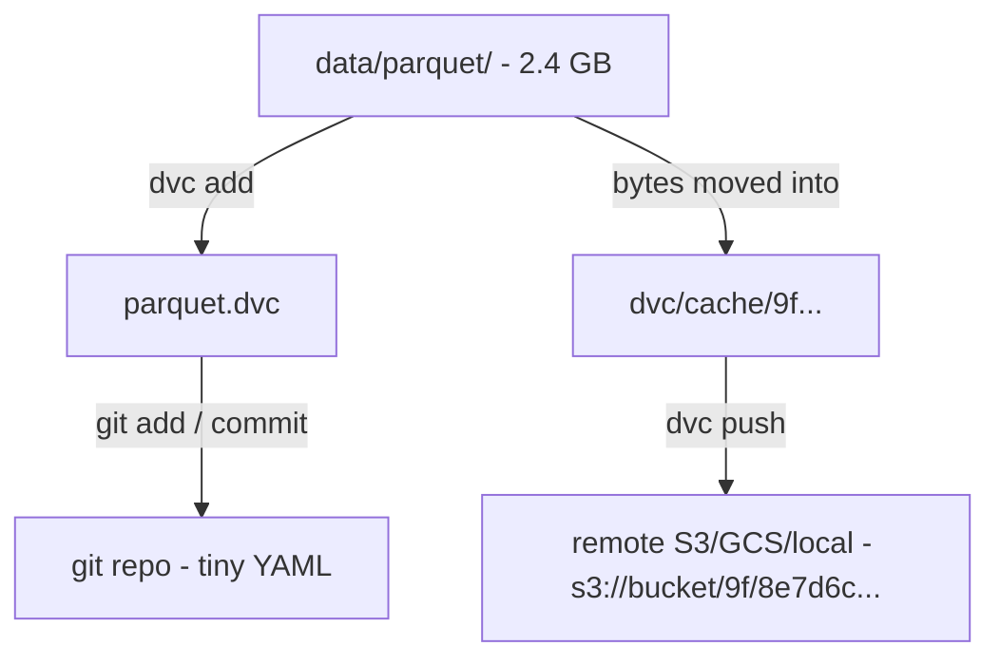
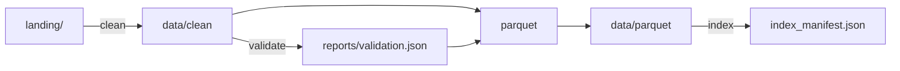

# Lecture 12: Dataset Versioning and Lineage — DVC, dvc.yaml, and Linking Data to Runs

> A model or a RAG index is only as trustworthy as your ability to answer one question six months later: *"exactly which bytes produced this?"* When a stakeholder, an auditor, or an on-call engineer asks "what data indexed this, and can you rebuild it byte-for-byte?" and your honest answer is "the corpus as it looked… sometime in March," you do not have a data pipeline — you have a rumor with good intentions. This lecture exists to make datasets **addressable by version** the same way git makes code addressable by SHA, and to wire a **lineage chain** — `source → dataset version → index/model run` — so any downstream artifact points back to the exact inputs that produced it. After this you will be able to track large data with DVC by content hash, push blobs to a remote (S3/GCS/local), express a reproducible `clean → validate → parquet → index` pipeline in `dvc.yaml`, read `dvc diff` across versions, stamp `{dataset_version, git_sha}` into a run manifest, and know precisely when to graduate from DVC to lakeFS.

**Prerequisites:** Git fundamentals (commits, SHAs, `.gitignore`, `git checkout`); this week's Parquet + DuckDB store (Lecture 11); you've built the cleaning stage that emits `data/clean/*.jsonl` and an incremental indexer · **Reading time:** ~29 min · **Part of:** Phase 5 (Data Engineering) Week 3

---

## The core idea (plain language)

Git is superb at versioning *text you edit line by line* — source code, configs, small CSVs. It is terrible at versioning *large binaries you regenerate wholesale* — a 4 GB Parquet corpus, a matrix of embeddings, a model checkpoint. The reason is mechanical, not philosophical, and we'll dissect it below. The practical upshot is blunt: you cannot just `git add data/parquet/` and move on. Git will bloat, slow to a crawl, and eventually your teammates will quietly refuse to clone the repo.

DVC (Data Version Control) solves this with a split that *is* the entire mental model of the tool:

- **Git tracks a tiny pointer file** — a few hundred bytes of YAML naming a content hash. This is what lives in your repo history, gets diffed in pull requests, and travels with `git checkout`.
- **DVC tracks the actual bytes** — stored by *content hash* in a local cache, then pushed to a **remote** (S3, GCS, Azure, or even a shared local/NFS directory) that behaves like a blob store keyed by hash.

So a "dataset version" is just this: *a git commit, whose `.dvc` pointer names a hash, whose bytes live in the remote.* Checking out an old commit restores the old pointer; `dvc checkout` (or `dvc pull`) then fetches exactly those bytes back into your working tree. You get git's branching / history / PR workflow over data that git could never physically hold.

The second half of the idea is **lineage**. Versioning alone tells you *a* dataset existed at version X. Lineage tells you *which* dataset version fed *which* run. The trick is boring and bulletproof: when your indexer or trainer runs, it writes a small **manifest** recording the `dataset_version` (the DVC hash of the data it read) and the `git_sha` (the code commit it ran under). Later, from any index or model artifact, you walk backward: this index ← this manifest ← this dataset version ← this source commit. That chain is what upgrades "I *think* it was the March corpus" into "commit `a1b2c3d`, DVC hash `9f8e…` — here, run `dvc pull` and you have the exact bytes."

---

## How it actually works (mechanism, from first principles)

### Why git chokes on large binaries (the mechanism, not the vibe)

Git stores every version of every file as a compressed **blob object** under `.git/objects`. Two properties bite you hard with big data:

1. **Delta compression assumes text-like locality.** Git shrinks history by finding small diffs between similar blobs and storing only the delta. A re-generated Parquet file or a re-trained embedding matrix differs *almost everywhere* from its predecessor even when "the data" barely changed — column ordering, compression framing, and row-group boundaries all shift. Git can't compute a useful delta, so it stores a **full new copy** every commit.
2. **History is forever, and cloned in full.** `git clone` pulls the *entire* object history by default. Ten commits that each rewrite a 2 GB Parquet file ≈ 20 GB inside `.git`, downloaded by everyone, forever — even though only the latest version matters to almost anyone.

Numeric feel. A corpus that grows `2.0 → 2.1 → 2.3 → 2.4 GB` across four commits costs git roughly `2.0 + 2.1 + 2.3 + 2.4 ≈ 8.8 GB` of repo history. With DVC, git stores four ~200-byte pointers (**< 1 KB total**); the ~8.8 GB of blobs live in the remote, deduplicated by hash, and a fresh clone pulls **only the version you check out** (~2.4 GB). That gap is why "just use git" fails silently until it fails catastrophically.

*(Git LFS partially addresses this — it swaps large files for pointers too — but it gives you file storage only, no pipeline model and no lineage. We'll place it in context at the end.)*

### `dvc add`: content-addressing in three moves

When you run `dvc add data/parquet`:

1. DVC computes a hash of the file/dir content. Modern DVC (2.x/3.x) uses an md5-based hash for the classic cache or a modern content hash — the exact algorithm matters less than the invariant: **same bytes → same hash → stored once.**
2. It moves the bytes into `.dvc/cache/` under a path derived from that hash, and (by default) replaces your working copy with a link — reflink, hardlink, symlink, or copy depending on the filesystem — pointing back into the cache. Your `data/parquet` still looks perfectly normal to your code.
3. It writes `data/parquet.dvc` (the pointer) and adds `data/parquet` to `.gitignore` so git never sees the raw bytes.

The pointer is human-readable YAML:

```yaml
# data/parquet.dvc  — THIS is what git commits
outs:
- md5: 9f8e7d6c5b4a39281706f5e4d3c2b1a0.dir
  size: 2456891234
  nfiles: 312
  path: parquet
```

That's the whole trick. Git tracks 5 lines; the 2.4 GB lives elsewhere, addressable by `9f8e7d6c…`. You then run `git add data/parquet.dvc .gitignore && git commit`.



### Remotes: where the bytes actually live

The DVC cache is local; the **remote** is the shared source of truth — exactly analogous to a git remote, but for blobs:

```bash
dvc remote add -d storage s3://my-bucket/corpus-dvc   # -d = default remote
# or gs://…, azure://…, or a plain shared/NFS path:
dvc remote add -d storage /mnt/shared/dvc-cache
dvc push        # upload cache blobs referenced by the current .dvc files
dvc pull        # download blobs for the checked-out .dvc files
```

Blobs are stored by hash prefix (`s3://…/9f/8e7d6c…`), so identical content across versions or branches is stored **once** — content-addressed dedup for free. Mental model: `git push` sends *pointers*; `dvc push` sends *bytes*. They are two separate steps, and their separation is a classic footgun: **committing the pointer without `dvc push` leaves teammates with a dangling reference** — their `dvc pull` fails with "missing from remote."

### `dvc.yaml`: turning a pile of scripts into a reproducible pipeline

`dvc add` versions *artifacts*. `dvc.yaml` versions *the process that produces them* — a DAG of **stages**, each declaring its command (`cmd`), its **dependencies** (`deps`), its **parameters** (`params`), and its **outputs** (`outs`). DVC hashes every dep and param; if nothing changed, `dvc repro` **skips** the stage (exactly like `make`). If a dep changed, it re-runs that stage and everything downstream of it.

```yaml
# dvc.yaml
stages:
  clean:
    cmd: python -m corpus.clean landing/ data/clean
    deps: [landing/, src/corpus/clean.py]
    outs: [data/clean]
  validate:
    cmd: python -m corpus.validate data/clean
    deps: [data/clean, src/corpus/validate.py]
    outs: [reports/validation.json]
  parquet:
    cmd: python -m corpus.to_parquet data/clean data/parquet
    deps: [data/clean, reports/validation.json, src/corpus/to_parquet.py]
    outs: [data/parquet]
  index:
    cmd: python -m corpus.indexer data/parquet
    deps: [data/parquet, src/corpus/indexer.py]
    params: [index.embedding_version]
    outs: [reports/index_manifest.json]
```

`dvc repro` walks this DAG in dependency order. The generated **`dvc.lock`** file records the exact hash of every dep and out for the run that actually happened — this is your reproducibility receipt, and it is committed to git. Edit `clean.py`, run `dvc repro`: DVC sees `clean`'s dep hash changed → re-runs `clean → validate → parquet → index`. Change nothing: every stage reports "skipped." That is how a re-run becomes *deterministic* instead of "I hope I ran the steps in the right order this time."

Pipeline shape:



### `dvc diff` and git history: seeing versions

Because each dataset version = a git commit whose pointer names a hash, comparing versions is just comparing pointers:

```bash
dvc diff HEAD~2 HEAD
# Modified:
#   data/parquet/  (312 → 340 files, 2.31 GB → 2.46 GB)
git log --oneline -- data/parquet.dvc
# a1b2c3d  add Q3 manuals to corpus
# 7e6f5d4  redact newly-found PII columns
# 0f1e2d3  initial parquet corpus
```

`git log -- data/parquet.dvc` is *literally your dataset's changelog*; each entry is a restorable version via `git checkout <sha> -- data/parquet.dvc && dvc checkout`.

---

## Worked example — two dataset versions, one lineage chain

Start with a clean corpus and cut version 1.

```bash
python -m corpus.to_parquet data/clean data/parquet
dvc add data/parquet
git add data/parquet.dvc .gitignore && git commit -m "corpus v1: 300 docs"
dvc push
DATASET_V1=$(git rev-parse --short HEAD)   # e.g. 0f1e2d3
```

Now the source changes — a batch of Q3 manuals lands, and one document gets a PII column redacted. Re-run and cut version 2.

```bash
python -m corpus.to_parquet data/clean data/parquet   # regenerates parquet
dvc add data/parquet                                   # new hash: 9f8e… → a2b3…
git commit -am "corpus v2: +40 docs, redact acct_no"
dvc push
DATASET_V2=$(git rev-parse --short HEAD)   # e.g. a1b2c3d
```

`dvc diff 0f1e2d3 a1b2c3d` reports `+40 files, 2.31 → 2.46 GB`. Two versions now exist, each fully restorable — no timestamps, no guesswork.

**Now the lineage.** The indexer reads `data/parquet` at whatever version is checked out and writes a run manifest recording both identifiers:

```python
# inside corpus/indexer.py, at end of run
import json, subprocess, datetime, yaml

def read_dvc_hash(path="data/parquet.dvc"):
    return yaml.safe_load(open(path))["outs"][0]["md5"]

manifest = {
    "run_id": run_id,
    "ran_at": datetime.datetime.utcnow().isoformat() + "Z",
    "git_sha": subprocess.check_output(["git", "rev-parse", "HEAD"]).decode().strip(),
    "dataset_version": read_dvc_hash(),      # DVC content hash of the data read
    "embedding_version": "bge-small-v1",
    "qdrant_collection": "corpus_v2",
    "n_chunks_indexed": 12843,
}
json.dump(manifest, open("reports/index_manifest.json", "w"), indent=2)
```

Six months later an auditor asks "what produced the answers served from `corpus_v2`?" You open the manifest:

```json
{ "git_sha": "a1b2c3d", "dataset_version": "a2b3c4d5….dir",
  "embedding_version": "bge-small-v1", "qdrant_collection": "corpus_v2" }
```

and rebuild the exact inputs:

```bash
git checkout a1b2c3d
dvc pull            # fetches the a2b3… blobs → data/parquet is byte-identical to the run
```

The chain closes: **Qdrant `corpus_v2` ← manifest ← dataset hash `a2b3…` ← git commit `a1b2c3d` ← source docs.** That is lineage, and it cost you roughly ten lines of manifest code. Notice the payoff isn't in the happy path — it's that the audit takes *minutes* instead of *days*, and the answer is *provable* rather than *plausible*.

---

## How it shows up in production

- **The "which data?" incident.** A model regresses; someone insists "the data changed." Without `{dataset_version, git_sha}` in a manifest you spend two days spelunking S3 timestamps and Slack scrollback. With it, you `dvc pull` both versions and `dvc diff` them in five minutes. This is the single highest-ROI habit in the lecture — cheap to add, brutal to lack.
- **Compliance / right-to-be-forgotten.** When you must *prove* a deleted document is gone (this week's governance milestone), lineage tells you which index versions ever contained it: "this doc entered at dataset v2, was tombstoned in v4; collections built from v1–v3 are quarantined." That sentence is impossible without versioned datasets and per-run manifests.
- **Storage cost is real but bounded.** Content-addressed dedup means unchanged files across versions cost nothing extra. But *regenerating* a whole Parquet directory (new compression framing) can store a full new copy even for a tiny logical change — the same brittleness that defeats git delta compression. Rule of thumb (approximate): budget remote storage ≈ `(avg dataset size) × (number of materially different versions)`. Partition sensibly and keep stable files stable so dedup can actually fire.
- **The dangling-pointer outage.** A new teammate clones, runs `dvc pull`, and it fails: "file missing from remote." Cause: someone `git push`ed the pointer but forgot `dvc push`. CI should run `dvc pull` (or `dvc status -c`) on a clean checkout to catch this *before* it reaches a human. Treat `git push` + `dvc push` as one atomic ritual.
- **`dvc repro` as a CI determinism gate.** Run `dvc repro` in CI and assert `dvc.lock` is unchanged. If the lock drifts on a no-op run, some stage is non-reproducible — hidden global state, a timestamp baked into an output, or a nondeterministic dedup ordering. Catching that in CI is far cheaper than discovering it during an audit.

---

## Common misconceptions & failure modes

- **"DVC is a git replacement / DVC stores my data *in* git."** No. Git stores the *pointer*; DVC stores *bytes* in a cache + remote. They are complementary and you always run both.
- **"`dvc add` is enough."** `dvc add` versions an artifact but not *how it was made*. Regenerate it by hand and you've lost reproducibility. Use `dvc.yaml` + `dvc repro` for anything with a pipeline.
- **Committing the pointer without `dvc push`.** The #1 real-world DVC failure. The commit looks perfect; the bytes are marooned in your local cache and nobody else can pull. Automate `dvc push` in your commit ritual or CI.
- **Putting a timestamp or `run_id` inside a pipeline output.** It makes every `dvc repro` see a "changed" dep and re-run everything downstream, defeating the skip logic entirely. Keep nondeterminism out of hashed outputs (write it to a side-channel log instead).
- **Tracking millions of tiny files with one `dvc add`.** Directory hashing walks every file; the small-files problem hits DVC just as it hits Parquet (Lecture 11). Compact into reasonable partitions first.
- **Assuming `dataset_version` = git SHA is enough.** The git SHA versions your *code and pointers*; the DVC hash versions the *bytes*. Record **both** — a commit can point at data you failed to push, and you want to detect that mismatch, not discover it during an incident.
- **Expecting concurrent branch isolation on shared object storage.** DVC gives you versions, not transactional isolation across many simultaneous writers on a live bucket. That boundary is exactly where lakeFS enters.

---

## Rules of thumb / cheat sheet

- **Git vs DVC:** small, line-edited, human-authored → git. Large, regenerated, binary → DVC. If `git status` ever shows a multi-MB blob as "modified," you made the wrong choice.
- **Always paired:** `git add *.dvc && git commit` **then** `dvc push`. Cloning: `git pull` **then** `dvc pull`. Never one without the other.
- **`dvc add`** for standalone artifacts; **`dvc.yaml` + `dvc repro`** whenever a command produces the artifact from inputs.
- **Commit `dvc.lock`** — it's your reproducibility receipt. Never `.gitignore` it.
- **Remote choice:** S3/GCS/Azure for teams; a shared local/NFS path is a perfectly good remote for a laptop or single-box lab.
- **Manifest minimum:** `{run_id, ran_at, git_sha, dataset_version (dvc hash), embedding_version, output_collection}`. Write it every run, unconditionally.
- **CI hygiene:** on a fresh checkout run `dvc pull` (catches missing pushes) and `dvc repro` (catches nondeterminism / `dvc.lock` drift).
- **Reach for lakeFS when:** many concurrent writers, TB–PB scale on object storage, atomic branch/merge/commit over a *live* bucket, or pre-merge validation on isolated branches. Otherwise DVC is simpler and enough.

---

## Skim: lakeFS — git-for-data at scale

DVC lives *beside* your git repo and versions the datasets a single project produces. **lakeFS** wraps an **entire object-store bucket** (S3/GCS/Azure) in git semantics: **branch, commit, merge, revert, and time-travel** over petabyte-scale data *in place*, without copying the bytes (it versions metadata/references to the objects, not the objects themselves). You keep writing to `s3://…` paths through a lakeFS endpoint; readers can address `main`, a feature branch, or a historical commit.

Reach for lakeFS instead of DVC when: (1) **scale** — datasets in the TB–PB range where even DVC's cache/remote copies are impractical; (2) **many concurrent writers** on one shared lake needing isolation; (3) you want **atomic, transactional** commits across many objects plus **merge** semantics; (4) you want to run validation on an **isolated branch** and only merge to `main` if it passes (data-quality-gated writes — the natural home for this week's blocking contracts, at scale). Stay on DVC for a single project's reproducible pipeline at laptop-to-small-team scale — it's lighter and needs no server. They aren't mutually exclusive: some teams use lakeFS for the lake and DVC-style manifests for per-run lineage.

---

## Connect to the lab

This is the versioning-and-lineage core of Week 3, step 3. In the lab you'll `dvc add data/parquet` (or express `clean → validate → parquet → index` as `dvc.yaml` stages), commit, change the corpus, re-run, and use `dvc diff` + `git log` to show two distinct dataset versions. Then wire the run manifest so `indexer.py` stamps `{dataset_version, git_sha}` — the exact lineage record the Definition of Done requires, and the one the governance proof leans on when you demonstrate that a deleted doc's fact disappears from answers.

## Going deeper (optional)

- **DVC docs — "Get Started: Data Versioning" and "Data Pipelines"** at `dvc.org/doc`. Canonical source for `dvc add`, remotes, and `dvc.yaml` / `dvc repro`.
- **DVC GitHub repo** (`github.com/iterative/dvc`) — issues/discussions are excellent for edge cases (cache link types, filesystem support, monorepo layouts).
- **lakeFS docs** at `docs.lakefs.io` — read the "Branching model" and "Merge" pages for the time-travel/isolation semantics.
- Search queries: *"DVC dvc.yaml stages deps outs"*, *"DVC remote S3 setup"*, *"DVC vs Git LFS"*, *"lakeFS branching data lake"*, *"data lineage manifest ML reproducibility"*.
- Related tools worth naming: **Git LFS** (simpler large-file storage; no pipeline or lineage model), **MLflow / DVCLive** (experiment + metric tracking that pairs with DVC lineage), **Pachyderm** (Kubernetes-native data-versioning + pipeline system).

## Check yourself

1. Mechanically, *why* does git handle a 2 GB regenerated Parquet file so much worse than a 2000-line source file, and what specifically does DVC put in the git repo instead?
2. You `git commit` the updated `data/parquet.dvc` and `git push`, but a teammate's `dvc pull` fails with "missing from remote." What did you forget, and how would CI catch it?
3. In `dvc.yaml`, you edit `clean.py` but not `to_parquet.py`. Which stages does `dvc repro` re-run, and how does DVC decide?
4. Why record **both** `git_sha` and the DVC `dataset_version` in the run manifest — isn't the commit SHA sufficient?
5. Give two concrete signals that you've outgrown DVC and should evaluate lakeFS.
6. A colleague adds a `"generated_at": <timestamp>` field to a pipeline output and now every `dvc repro` re-runs the whole DAG. Explain the mechanism.

### Answer key

1. Git delta-compresses text, but a regenerated Parquet differs almost everywhere (compression framing, row-group/column ordering), so git stores a **full new copy per commit** and clones the entire history to everyone. DVC puts only a tiny `.dvc` **pointer** (YAML naming a content hash + size + file count) in git; the bytes go to the cache and remote, deduped by hash.
2. You forgot `dvc push` — the pointer (git) travelled but the **bytes** did not. CI catches it with a **fresh checkout + `dvc pull`** (and/or `dvc status -c` against the remote), so a dangling pointer fails the build before it reaches teammates.
3. It re-runs `clean` (its dep `clean.py` changed) and everything downstream — `validate → parquet → index` — because their inputs (the regenerated `data/clean`, then `data/parquet`) change. DVC decides by hashing each stage's `deps` + `params` and comparing against `dvc.lock`; unchanged stages are **skipped**.
4. The `git_sha` versions your **code and pointers**; the DVC hash versions the **actual bytes**. A commit can reference data you failed to `dvc push`, or two commits can point at identical data — recording both lets you detect mismatches and pull the exact bytes, not merely the code.
5. Any two of: TB–PB scale where copying into a DVC cache/remote is impractical; many **concurrent writers** on one shared lake needing isolation; need for **atomic/transactional** multi-object commits and **merge**; wanting validation on an **isolated branch** before merging to `main` (gated writes).
6. `dvc repro` skips a stage only when its hashed `deps`/`params`/outputs are unchanged. A per-run timestamp inside an output makes that output's hash change **every run**, so DVC believes the stage's result changed, invalidates it, and cascades re-runs to all downstream stages. Keep nondeterministic fields out of hashed outputs.
