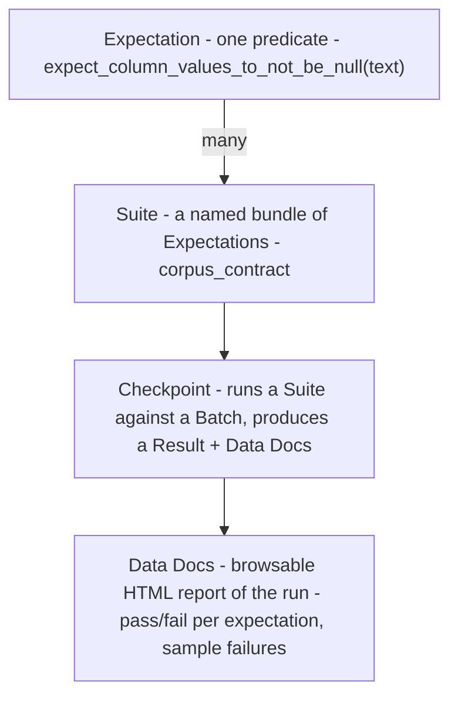
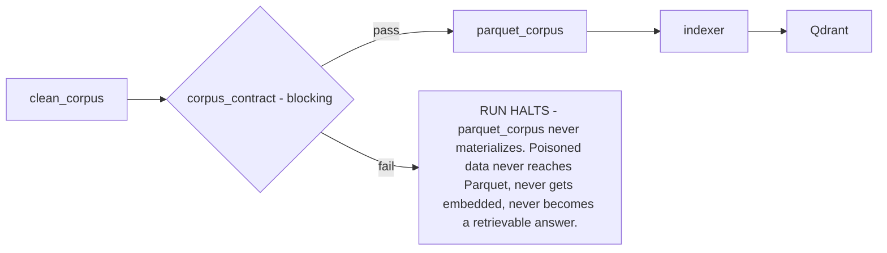

# Lecture 13: Data-Quality Contracts as Blocking Gates — Great Expectations and Pandera

> Every pipeline you have built so far *produces* data. This lecture is about *refusing* to produce data that violates a contract. In Week 2 you redacted PII; but redaction code is just code, and code has bugs — a regex that misses a hyphenated SSN, a Presidio recognizer that skips a non-Latin name, a merge that reintroduces a raw column you thought you dropped. The only way to *know* the corpus is clean is to check it at a gate that can say **no** and *halt the run*. This lecture teaches you to write executable data contracts with Great Expectations and Pandera, wire the contract as a **blocking Dagster asset check** between the clean and parquet stages, and treat a single un-redacted PII row or one schema violation as a run-failing event. After this you will be able to author typed column contracts, write a custom PII expectation that re-verifies Week 2's redaction, make it block, and read a failing validation result to find the offending rows.

**Prerequisites:** Week 1 blocking-check pattern (Lecture 4, Dagster asset checks), Week 2 PII redaction (Presidio), Pandas/Polars, Python type hints · **Reading time:** ~30 min · **Part of:** Phase 5 (Data Engineering) Week 3

---

## The core idea (plain language)

A **data contract** is a set of machine-checkable promises about a dataset: *these columns exist with these types; `text` is never null or empty; `page` is never negative; no value in `text` matches an email or SSN pattern.* A contract is not documentation and it is not a warning. It is a predicate over your data that returns pass or fail, and — this is the whole lecture — **fail must stop the pipeline.**

The distinction that separates real data engineering from theater is one line of configuration: does a failed check *block* the downstream asset, or does it log a red mark and let the data flow anyway? A validation suite that runs, discovers 3 rows of raw PII, prints "❌ 3 unexpected values," and then returns exit code 0 so the next stage happily writes those 3 rows into Parquet and then into your vector index — that suite made your compliance posture *worse*, because now you have a green dashboard vouching for poisoned data. The check exists to be a gate, and a gate that only ever swings open is a wall with a door painted on it.

Two tools own this space in the Python world, and they sit at different points on a weight/power curve:

- **Great Expectations (GE)** — a heavyweight validation *framework*. You declare "Expectations" (`expect_column_values_to_not_be_null`), group them into a **Suite**, run them via a **Checkpoint**, and get back a rich result object plus auto-generated **Data Docs** (a browsable HTML report). Great when validation is a first-class, shared, documented artifact across a team; heavier to set up and to reason about.
- **Pandera** — a lightweight, code-first library. You write a `DataFrameSchema` (or a typed class) in Python, with per-column type + check declarations, and call `.validate(df)`. It raises `SchemaError` on failure. Great when the contract lives *next to the code*, is owned by the pipeline author, and you want fail-fast semantics with almost no ceremony.

For a solo/small-team corpus pipeline on a laptop, **Pandera is usually the right default** and GE is what you reach for when the contract needs to be a governed, human-browsable artifact. We'll teach both, then wire whichever you pick into Dagster as a blocking check — because the framework choice is cosmetic next to the blocking discipline.

---

## How it actually works (mechanism, from first principles)

### A contract is a predicate over a table, evaluated per-column and per-row

Strip away the frameworks and a data contract is a conjunction of predicates. For a table `df` with `N` rows, a check like "`text` is non-null" is:

```
pass  ⟺  count(df.text IS NULL) == 0
```

Every check reduces to *count the violations; fail if the count exceeds a threshold* (usually 0). This matters because it tells you the two numbers that matter in every validation result: **the count of unexpected values** and **the total evaluated**. When you debug a failing run, you are always reading those two numbers plus a sample of the offending values. Keep that model in your head and every GE result object and Pandera error message becomes readable.

Contracts operate at two granularities:

- **Schema-level** (structural): required columns exist; each has the declared dtype; no extra columns (optional). Cheap — O(columns) metadata check.
- **Value-level** (row-wise): non-null, non-empty, `page >= 0`, regex-not-matching. O(rows) — you scan the column.

For a 50k-row corpus this is milliseconds. For 50M rows a naive Python regex over `text` can take minutes; you push it into Polars/DuckDB vectorized ops or sample. Know which of your checks are O(rows) — those are the ones that bite on latency at scale.

### Pandera: the code-first `DataFrameSchema`

Pandera lets you declare the contract as data or as a typed class. Here is the corpus contract:

```python
import pandera.pandas as pa
from pandera import Column, Check, DataFrameSchema

EMAIL_RE = r"[A-Za-z0-9._%+-]+@[A-Za-z0-9.-]+\.[A-Za-z]{2,}"
SSN_RE   = r"\b\d{3}-\d{2}-\d{4}\b"

corpus_schema = DataFrameSchema(
    {
        "doc_id":       Column(str, nullable=False),
        "page":         Column(int, checks=Check.ge(0), nullable=False),
        "text":         Column(
            str,
            checks=[
                Check.str_length(min_value=1),                       # non-empty
                Check(lambda s: ~s.str.contains(EMAIL_RE, regex=True),
                      element_wise=False, error="raw email survived redaction"),
                Check(lambda s: ~s.str.contains(SSN_RE, regex=True),
                      error="raw SSN survived redaction"),
            ],
            nullable=False,                                          # non-null
        ),
        "source_path":  Column(str, nullable=False),
        "is_scanned":   Column(bool, nullable=False),
    },
    strict=True,     # reject unexpected columns — a stray raw column fails
    coerce=False,    # do NOT silently cast; a str where int expected must fail
)

# usage — raises pandera.errors.SchemaError on the first (or all) violations
corpus_schema.validate(df, lazy=True)   # lazy=True collects ALL failures, not just first
```

Two configuration choices carry real weight:

- **`strict=True`** means a column you didn't declare (say, a `raw_text` column a bad merge reintroduced) *fails the schema*. This is your defense against columns you thought you dropped sneaking back in with un-redacted content. Default `strict=False` would silently let them through.
- **`coerce=False`** means Pandera will not paper over a type mismatch by casting. If `page` arrives as the string `"3"` because someone read JSONL without a dtype, you want that to *fail loudly*, not get silently coerced to `3` — because the silent coercion is exactly the class of bug that produces `page = -1` becoming `"-1"` passing a naive check later.
- **`lazy=True`** on `.validate()` collects *every* failure into one `SchemaErrors` (plural) exception instead of raising on the first. In a gate you want the full damage report, not "fix this one thing, re-run, discover the next."

### Great Expectations: Expectations → Suite → Checkpoint → Data Docs

GE's data model has four nested objects. Understanding the nesting is how you avoid GE's famous "why is nothing happening" confusion:



```python
import great_expectations as gx

ctx = gx.get_context()                       # project context (file-backed)
batch = ctx.data_sources.pandas_default.read_dataframe(df)

suite = ctx.suites.add(gx.ExpectationSuite(name="corpus_contract"))
suite.add_expectation(gx.expectations.ExpectColumnValuesToNotBeNull(column="text"))
suite.add_expectation(gx.expectations.ExpectColumnValueLengthsToBeBetween(column="text", min_value=1))
suite.add_expectation(gx.expectations.ExpectColumnValuesToBeBetween(column="page", min_value=0))
suite.add_expectation(gx.expectations.ExpectColumnValuesToNotMatchRegex(column="text", regex=SSN_RE))
suite.add_expectation(gx.expectations.ExpectColumnValuesToNotMatchRegex(column="text", regex=EMAIL_RE))

validation_def = ctx.validation_definitions.add(
    gx.ValidationDefinition(data=batch_def, suite=suite, name="corpus_validation")
)
checkpoint = ctx.checkpoints.add(
    gx.Checkpoint(name="corpus_ckpt", validation_definitions=[validation_def])
)
result = checkpoint.run()
assert result.success, "corpus contract failed — see Data Docs"
```

The **Checkpoint** is the runnable unit and `result.success` is the boolean your gate hinges on. **Data Docs** is GE's genuine differentiator: after a run it writes an HTML site showing, per expectation, the observed value, the unexpected count, and a sample of failing rows. For a team where a data steward who doesn't read Python needs to see *why* Tuesday's batch was rejected, Data Docs is worth GE's setup cost. For a solo pipeline, it's overhead you view once and forget.

### The custom PII expectation — this is the verification gate for Week 2

Week 2's `pii.py` *redacts*. This contract *verifies the redaction actually worked*. There are two strategies, and you should understand the tradeoff because it's a real cost/coverage decision:

1. **Regex re-match (cheap, fast, narrow).** Scan `text` for email/SSN/phone patterns. O(rows), microseconds per row, catches structured PII (`123-45-6789`, `a@b.com`). Misses names, addresses — anything Presidio's NER caught that has no fixed pattern.
2. **Re-run Presidio (expensive, slow, broad).** Run the `AnalyzerEngine` over `text` and fail if it returns any entity above a confidence threshold. Catches PERSON, LOCATION, etc. But it's the same detector you used to redact — so it can only catch redaction *bugs* (the redactor found it but failed to remove it), not detection *gaps* (Presidio never saw it as PII in the first place). And it's ~1000× slower than regex.

The pragmatic gate runs **regex on 100% of rows** (fast, catches the highest-liability structured identifiers) and **Presidio on a sample** (say 1%, or 100% if the corpus is small). A custom Pandera check:

```python
from presidio_analyzer import AnalyzerEngine
_analyzer = AnalyzerEngine()

def no_residual_pii(text_series) -> bool:
    # 1. structured PII on ALL rows via vectorized regex
    if text_series.str.contains(EMAIL_RE, regex=True).any(): return False
    if text_series.str.contains(SSN_RE, regex=True).any():   return False
    # 2. NER on a bounded sample — fail if Presidio still sees a high-confidence entity
    sample = text_series.sample(min(len(text_series), 200), random_state=0)
    for t in sample:
        results = _analyzer.analyze(text=t, language="en",
                                    entities=["US_SSN","EMAIL_ADDRESS","PERSON","CREDIT_CARD"])
        if any(r.score >= 0.85 for r in results):
            return False
    return True

pii_check = Check(no_residual_pii, error="raw PII survived redaction", element_wise=False)
```

The key design point: **this check fails the whole batch if even one row leaks.** It is not "flag the 3 bad rows and pass the rest." A corpus with 3 un-redacted SSNs among 50,000 rows is a corpus you cannot ship. The gate's job is to send it back, not to filter it.

### The blocking wire-up in Dagster — the load-bearing part

You saw the pattern in Week 1 (Lecture 4): an `@asset_check` with `blocking=True` stops downstream materialization. Here it sits *between* the `clean` asset and the `parquet` asset:

```python
from dagster import asset, asset_check, AssetCheckResult, MaterializeResult
import pandera.errors

@asset
def clean_corpus() -> "pd.DataFrame":
    return load_clean_jsonl()          # Week 2 output

@asset_check(asset=clean_corpus, blocking=True)   # ← the entire point
def corpus_contract(clean_corpus) -> AssetCheckResult:
    try:
        corpus_schema.validate(clean_corpus, lazy=True)
        return AssetCheckResult(passed=True)
    except pandera.errors.SchemaErrors as e:
        return AssetCheckResult(
            passed=False,
            metadata={
                "n_failures": len(e.failure_cases),
                "failure_sample": e.failure_cases.head(10).to_markdown(),
                "checks_failed": e.failure_cases["check"].unique().tolist(),
            },
        )

@asset(deps=[clean_corpus])            # runs ONLY if the blocking check passed
def parquet_corpus(clean_corpus):
    write_partitioned_parquet(clean_corpus)
    return MaterializeResult(metadata={"rows": len(clean_corpus)})
```



`blocking=True` is the difference between a gate and a note. With it, a failed `corpus_contract` prevents `parquet_corpus` (and everything downstream: index, RAG answers) from materializing *in the same run*. Drop it, and Dagster records a red check but happily materializes `parquet_corpus` with the poison inside — theater.

---

## Worked example

You have `clean_corpus`, 50,000 rows, output of Week 2. You inject **one** un-redacted row to test the gate — simulating a redaction bug that let a single SSN survive:

```
doc_id   page   text                                                is_scanned
d-4471   7      "Contact John at <EMAIL_7f3a> ..."                   False   ✅ redacted
d-4471   8      "SSN on file: 412-55-1839 for the applicant."        False   ❌ raw SSN
d-9920   0      ""                                                    False   ❌ empty text
d-1002   -1     "See appendix."                                      False   ❌ page < 0
...49,996 more clean rows...
```

Run the Pandera contract with `lazy=True`. It collects **three** failure cases:

```
schema_component  check                    column  failure_case          index
Column            no_residual_pii          text    (batch-level)         —
Column            str_length(min=1)        text    ""                    41190
Column            greater_than_or_equal_to page    -1                    8801
```

- `n_failures = 3`, spanning 3 distinct checks. The check `corpus_contract` returns `passed=False`.
- Because it's `blocking=True`, `parquet_corpus` **never runs**. The Dagster UI shows `clean_corpus` materialized (green), `corpus_contract` failed (red), and `parquet_corpus` *skipped* (grey). No Parquet written. No embeddings computed. No poison in Qdrant.
- The check's `metadata` carries `failure_sample` as a markdown table and `checks_failed = ["no_residual_pii", "str_length", "greater_than_or_equal_to"]` — you read the failing run in the UI and immediately know: one PII leak, one empty text, one bad page number.

Now the arithmetic that makes the discipline non-negotiable: the injected corpus is 49,999/50,000 = **99.998% clean**. A "filter and pass" design would ship 49,999 rows and quietly drop 1. But that 1 row is an un-redacted SSN — a reportable data incident. The blocking gate's correct behavior is to reject **all 50,000** and force a fix upstream, because *you cannot trust a redaction stage that produced even one leak* — if it missed this SSN, how many names did it miss that regex can't see? The gate converts "99.998% clean" (a comforting lie) into "the redactor has a bug, fix it" (the actionable truth).

Fix the redactor, re-run: `corpus_schema.validate` passes, `corpus_contract` goes green, `parquet_corpus` materializes 50,000 rows, the run proceeds.

---

## How it shows up in production

- **The green dashboard that lies.** The single most expensive failure mode: a suite runs, logs failures, returns success. Six months later an auditor finds customer SSNs in your vector DB and your monitoring shows all-green for the whole period. The fix costs one boolean (`blocking=True`) but the incident costs a breach disclosure. This is why the lecture centers blocking over framework choice.
- **Latency at the O(rows) checks.** Regex over `text` for 50k rows is ~50–200ms. Re-running Presidio over 50k rows is *minutes* (NER is ~10–50ms/doc on CPU). If you naively put full Presidio in the gate, your DAG's critical path balloons and people start disabling the check "temporarily." Sample the expensive check; run the cheap one on everything.
- **Type coercion silently masking bugs.** `coerce=True` (Pandera) or reading JSONL without an explicit schema turns `page="-1"` into something a naive `>= 0` check on strings won't catch, or hides that a numeric column arrived as text. Production corollary: always validate against the *stored* Parquet dtypes, and keep `coerce=False` in the gate so type drift fails loudly.
- **The small-corpus false confidence.** On a 200-row test corpus every check is instant and you never feel the cost. You ship, the real corpus is 5M rows, the Presidio-on-everything check takes 40 minutes, the freshness SLA blows, and the on-call disables the gate. Budget the O(rows) checks against *production* row counts, not your fixture.
- **Debugging a failing run.** In Dagster, click the failed `corpus_contract` check → read its `metadata`. Your `failure_sample` markdown table and `checks_failed` list tell you *which* invariant broke and *which rows*. Without emitted metadata you're left with `SchemaError: <traceback>` and no idea which of 50k rows offended. **Emit the failure sample and counts into check metadata — it's the cheapest debugging you'll buy.** For GE, open Data Docs: it shows unexpected count and sample per expectation.

---

## Common misconceptions & failure modes

- **"The suite ran, so the data is validated."** Running ≠ enforcing. If the checkpoint's result isn't wired to fail the DAG (or CI exit code), you validated nothing. Assert `result.success` / raise on `SchemaError`, and make the Dagster check `blocking=True`.
- **"I'll validate but let good rows through."** Row-level filtering at the gate is the wrong instinct for a *contract*. A contract violation means the *producer* is broken; the fix is upstream, not "drop the bad rows and continue." (Filtering is a legitimate *cleaning* operation — but it belongs in Week 2's clean stage with a drop report, not disguised as a passing quality gate.)
- **"Re-running Presidio in the gate makes it airtight."** It only catches redaction *bugs* (detected-but-not-removed), never detection *gaps* (never-detected). It's the same model that redacted; it has the same blind spots. Combine with pattern-based checks for structured PII and treat NER re-run as a bug-catcher, not a coverage guarantee.
- **"Great Expectations is heavier so it's more correct."** No. GE and Pandera express the same predicates. GE buys you Data Docs and a governed, team-shared suite; Pandera buys you fail-fast simplicity and contract-next-to-code. Correctness comes from the blocking wire-up, identical in both.
- **`strict=False` letting stray columns through.** The classic PII regression: a merge reintroduces `raw_text`, your value checks only look at `text`, and the raw column sails into Parquet. `strict=True` fails on any undeclared column — turn it on.
- **Checking the wrong artifact.** Validate the data as it will be *stored/consumed* (the Parquet dtypes, the exact text that gets embedded), not an in-memory intermediate that differs from what lands. A check against a DataFrame that gets re-serialized differently is a check with a gap.

---

## Rules of thumb / cheat sheet

- **Default tool:** Pandera for solo/small-team, contract-in-code. Great Expectations when you need Data Docs / a governed shared suite / non-engineer reviewers. *(rule of thumb)*
- **Always block.** A quality check that doesn't halt the run is theater. `blocking=True` in Dagster; `assert result.success` / raise on `SchemaError` in CI.
- **Threshold for correctness gates is 0 violations.** Un-redacted PII, schema breaks, null `text` → mostly-true tolerances are not acceptable; one leak fails the batch.
- **Cheap check on 100%, expensive check on a sample.** Regex (email/SSN) over all rows; Presidio NER over ~1–5% (or 100% only if the corpus is small).
- **`strict=True`, `coerce=False`, `lazy=True`** in Pandera gates: reject stray columns, fail on type drift, collect all failures.
- **Emit failure metadata:** `n_failures`, `checks_failed`, and a 10-row `failure_sample` into the check result. Future-you debugging at 3 a.m. will thank you.
- **Budget O(rows) checks against production row counts,** not your test fixture.
- **The gate verifies the previous stage; it doesn't replace it.** Redaction happens in Week 2; the contract *proves* it worked. Both must exist.

---

## Connect to the lab

This is Week 3, step 2 (`validate.py`) and it is the linchpin of the milestone's compliance proof. You'll define the contract — required columns + types, `text` non-null/non-empty, `page >= 0`, and the custom PII expectation — in GE or Pandera, then wire it as a **blocking** Dagster asset check *between* the clean and Parquet assets. The Definition of Done requires you to inject one un-redacted PII row and show the pipeline **fail the run** (the failing run screenshot / log is the deliverable). This gate is what makes Week 2's redaction *provable* rather than *asserted*, and it uses the exact `blocking=True` pattern you built in Week 1's duplicate-key check (Lecture 4).

---

## Going deeper (optional)

- **Great Expectations docs** — `docs.greatexpectations.io`. Read the "Quickstart" and the Expectations concepts; note the v1.x API differs from older tutorials (Checkpoints/ValidationDefinitions were restructured). Search: *Great Expectations Checkpoint validation definition*.
- **Pandera docs** — `pandera.readthedocs.io`. Read "DataFrameSchema", "Checks", and the "lazy validation" and "DataFrameModel" (class-based) pages. Search: *pandera DataFrameModel custom check*.
- **Microsoft Presidio docs** — `microsoft.github.io/presidio`. For the custom PII check, revisit the `AnalyzerEngine` recognizers and confidence scores. Search: *Presidio analyzer custom recognizer*.
- **Dagster asset checks** — `docs.dagster.io`. Re-read "Asset checks" with attention to `blocking` semantics and check metadata. Search: *Dagster blocking asset check*.
- **Concept / talk:** the "data contracts" movement — search: *data contracts blocking gate producer consumer* (Chad Sanderson's writing is the canonical popularization). Read critically: much of it is org-process; you want the *enforcement* mechanics.
- **Book:** *Fundamentals of Data Engineering* (Reis & Housley) — the data-quality and DataOps chapters frame where validation gates sit in the lifecycle.

---

## Check yourself

1. Your teammate says "the validation suite runs on every batch and posts results to Slack." What single question determines whether this is a real gate or theater?
2. Why does the correct response to *one* un-redacted SSN in 50,000 rows fail the entire batch rather than dropping that one row and shipping the rest?
3. You put a full re-run of Presidio over all 5M rows in the blocking gate and the DAG's runtime triples. What's the fix, and what coverage do you give up?
4. What can re-running Presidio in the gate catch that it fundamentally *cannot*, and why does that limit exist?
5. When would you choose Great Expectations over Pandera for this contract, given both express the same predicates?
6. A bad merge reintroduces a `raw_text` column full of un-redacted PII, but your value checks only inspect `text`. Which one Pandera setting would have caught this, and how?

### Answer key

1. **Does a failed result stop the pipeline (block the downstream write / fail the CI exit code), or does the data flow regardless?** Posting to Slack is a notification, not a gate. If `parquet_corpus` materializes even when the suite fails, it's theater — a green-looking process vouching for bad data.
2. Because a single leak means the **producer (the redaction stage) is broken**, not that one row is unlucky. If the redactor missed this SSN, you have no basis to trust it caught the names, addresses, and other PII that regex *can't* see. The gate's job is to send the batch back and force an upstream fix, not to filter symptoms while the bug persists. "99.998% clean" is a reportable incident, not a pass.
3. **Run the cheap regex checks (email/SSN) on 100% of rows and Presidio NER on a bounded sample (~1–5%).** You give up guaranteed NER coverage on every row — you might miss an un-redacted PERSON/LOCATION that falls outside the sample. Acceptable because the highest-liability *structured* identifiers (SSN, email, card numbers) are caught in full by the cheap regex pass.
4. It can catch redaction **bugs** — entities Presidio detected but the anonymizer failed to remove. It **cannot** catch detection **gaps** — PII Presidio never recognized in the first place (unusual name formats, non-US identifiers). The limit exists because it's the *same detector* with the *same blind spots*; re-running it can't see what it couldn't see the first time. Pattern-based checks partially cover structured PII, but NER gaps require better recognizers, not re-running.
5. Choose **GE** when validation must be a **governed, shared, human-browsable artifact** — a data steward or non-engineer needs to review *why* a batch failed (Data Docs), the suite is owned across a team, and you want the framework's cataloging. Choose **Pandera** when the contract lives next to the pipeline code, is owned by the engineer, and you want minimal ceremony and fail-fast semantics. The predicates and the blocking behavior are identical; you're choosing on organizational and reporting needs, not correctness.
6. **`strict=True`** on the `DataFrameSchema`. It rejects any column not declared in the schema, so a reintroduced `raw_text` column fails validation immediately (before you even reach value checks), rather than sailing through because your value checks only looked at `text`. Default `strict=False` would let the undeclared column pass silently.
