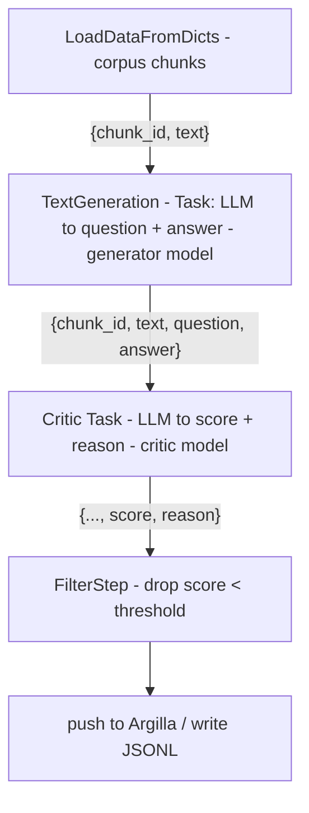

# Lecture 14: Synthetic Data Generation and Curation — distilabel, Critic Filtering, and Argilla

> You have a clean, deduped, PII-redacted corpus and a working RAG stack. Now you need training/eval examples — Q/A pairs grounded in *your* documents — and you do not have a labeling team or a budget for a paid API. The temptation is to point GPT-4o at your corpus, generate 10,000 Q/A pairs, and call it a dataset. That is how you ship a dataset that is quietly poisoned: ungrounded answers the model hallucinated, near-duplicates of your eval set, and a slow-motion quality collapse if you ever train on the output. This lecture teaches the *safe* version of that loop: generate with distilabel against a local Ollama endpoint, **filter with a critic pass** before anything enters the dataset, put a human in the loop with Argilla, and treat **model collapse** and **eval contamination** as first-class risks you engineer against — not footnotes. After this you can build a synthetic-data pipeline whose every accepted example is grounded, reviewed, decontaminated, and provenance-tagged, and you can explain to a skeptical reviewer why your synthetic set will not silently inflate your benchmark or degrade a fine-tune.

**Prerequisites:** Week 1–2 of this phase (landing zones, cleaning, dedup — you will reuse MinHash here), a working corpus of chunks with provenance, an LLM you can call (Ollama locally is assumed), comfort with JSONL and Python · **Reading time:** ~32 min · **Part of:** Phase 5 — Data Engineering for AI, Week 3

## The core idea (plain language)

Synthetic data is *model output repackaged as training/eval input*. That reframing tells you everything about its risks. A model's output is only as trustworthy as its inputs and its tendency to make things up; if you feed that output back into the pipeline uncritically, you are amplifying the model's errors and biases and calling the result "data."

So the entire discipline of synthetic data is: **generate cheaply, then earn each example's place in the dataset.** Three gates, in order of increasing cost and trust:

1. **Generate** — a first LLM pass produces candidate Q/A pairs, each *grounded* in a specific corpus chunk (the chunk is passed as context; the question and answer must be derivable from it).
2. **Critic-filter** — a second LLM pass *scores* each candidate on groundedness and quality, and drops the ones that fail a threshold. This is automatic, cheap, and catches most garbage. The governing principle: **ungrounded synthetic data is worse than no data** — it teaches the model to be confidently wrong.
3. **Human curate** — the survivors go to Argilla, where a person accepts/rejects/edits. Humans are the expensive, high-trust gate; you only spend them on candidates that already passed the critic.

The accepted set is exported as **versioned JSONL** with provenance (which chunk, which generator model, which run) so you can always answer "where did this example come from?" — which is exactly what you need to prove your synthetic set never leaked into your eval set.

The mental frame: **distilabel is the pipeline engine, the critic is your quality gate, Argilla is your human gate, and decontamination + provenance are the safety rails.** Same shape as the ingestion pipeline you built in Week 1 — steps, a blocking quality check, and lineage — just with LLMs as the transform.

## How it actually works (mechanism, from first principles)

### The distilabel model: Pipeline → Step → Task

distilabel structures work as a **Pipeline** (a DAG) of **Steps**. A Step takes a batch of rows in, does something, yields a batch out — exactly the batch-in/batch-out contract you know from Dagster assets. A **Task** is a special kind of Step whose transform is *an LLM call*: it renders a prompt template over the input row, calls the model, parses the output, and adds columns.



Steps connect with `>>`. Each Task holds an `LLM` object — the thing that actually talks to a model. The key detail for this lecture: that `LLM` can point at **any OpenAI-compatible endpoint**, including your local Ollama.

### Pointing the generator at Ollama (not a paid API)

Ollama exposes an OpenAI-compatible server at `http://localhost:11434/v1`. distilabel's `OpenAILLM` takes a `base_url`, so you swap the endpoint and skip the paid API entirely:

```python
from distilabel.llms import OpenAILLM

gen_llm = OpenAILLM(
    model="llama3.1:8b",
    base_url="http://localhost:11434/v1",
    api_key="ollama",              # any non-empty string; Ollama ignores it
    generation_kwargs={"temperature": 0.7, "max_new_tokens": 512},
)
```

Two engineering notes that bite people:
- **`api_key` must be non-empty** even though Ollama ignores it — the OpenAI client library refuses to construct without one.
- **Structured output.** You want the generator to emit parseable JSON (`{"question": ..., "answer": ...}`). Ask for JSON in the prompt *and* set the response format if the model supports it. Small local models drift from the schema more than GPT-4o does, so budget for parse failures (see production section).

### Batching, caching, and structured output (the mechanics that save your run)

Three distilabel behaviors matter the moment a run is more than a toy:

- **Batching.** Each Step declares an `input_batch_size`; distilabel pulls rows in batches and passes them through Tasks. On a local Ollama box, throughput is dominated by the model, so a batch of 8–32 is plenty — the point of batching here is bookkeeping and checkpointing, not GPU saturation.
- **Caching.** `Pipeline.run()` caches results keyed by pipeline signature + inputs. If a 400-candidate run dies at candidate 380 (Ollama OOMs, laptop sleeps), re-running resumes from cache instead of re-spending 380 generate+critic calls. This is why you develop against distilabel's pipeline object rather than a hand-rolled loop — the loop has no memory. Bump the pipeline name/version to force a fresh run.
- **Structured output.** Small models drift from JSON schemas. distilabel supports constrained decoding (`structured_output=` with a JSON schema or a Pydantic model, backed by `outlines`) so the model *cannot* emit tokens that break the schema. Use it for both the generator and the critic — it turns a ~10% parse-failure rate into near-zero, which is the single highest-leverage reliability fix in the whole pipeline.

### Grounding: the question must come from the chunk

"Grounded" means the answer is *derivable from the provided chunk alone*, not from the model's parametric memory. You enforce this in the prompt and verify it in the critic:

```
System: You write factual Q/A pairs. Use ONLY the passage below.
If the passage does not support a factual question, output {"skip": true}.

Passage:
{{ text }}

Output JSON: {"question": "...", "answer": "..."}
The answer must be a span or paraphrase supported by the passage.
```

The `{{ text }}` is the corpus chunk — the same chunk (with its `chunk_id` and provenance) you produced in Week 2. Because the chunk_id rides along the pipeline, every generated pair is traceable back to a source document.

### The critic filter — the load-bearing step

The critic is a **second LLM pass whose only job is judgment.** It sees the chunk, the question, and the answer, and returns a structured score. A minimal rubric:

```
Score 1–5 on GROUNDEDNESS (is the answer fully supported by the passage?)
and QUALITY (is the question clear, answerable, non-trivial?).
Return JSON: {"groundedness": n, "quality": n, "reason": "..."}
```

Then a plain `FilterStep` drops anything below threshold. Why does this matter so much? Because the failure modes of the generator are *systematic*, not random:
- **Hallucinated answers** — the model adds a plausible fact not in the chunk.
- **Trivial questions** — "What is this passage about?" (useless for training).
- **Unanswerable questions** — the question requires info outside the chunk.

The critic catches all three cheaply. **Use a different (ideally stronger) model as critic than as generator**, or at minimum a fresh context — a model grading its own single-pass output with the same weights is a weak check, but a separate critic call with a focused rubric is a genuinely different computation and catches most of the garbage.

**Numeric intuition.** Say your generator produces 100 candidates. Empirically (approximate, corpus-dependent) a small local model grounds ~60–75% of the time when the prompt is tight. A critic thresholded at groundedness ≥ 4 keeps maybe 55 of them. Human review in Argilla then rejects another ~15% for subtle issues (ambiguous phrasing, leading questions), leaving ~47 accepted. So a "generate 100" run yields ~45–50 dataset-quality pairs. Plan your batch sizes around a **~2:1 generate-to-accept ratio**, not 1:1.

### Model collapse — why you cap the synthetic fraction

Model collapse is the degradation that happens when models are trained on data produced by earlier models, generation after generation. The mechanism, in plain terms: **generated data under-represents the tails of the real distribution.** A model samples from what it learned; rare events, edge phrasings, and long-tail facts are sampled less often than they truly occur. Train on that output and the next model sees an even narrower distribution. Repeat, and variance shrinks toward a bland mean — the model forgets the tails first, then converges to generic mush.

```
Real data:      ▁▂▅█▇▅▂▁   (has tails)
Gen 1 output:   ▁▃▆█▆▃▁     (tails thinning)
Gen 2 output:    ▄▇█▇▄      (tails gone)
Gen 3 output:     ▆██▆      (collapsed toward the mean)
```

The engineering defense is not clever — it is **quantitative discipline**:
- **Keep synthetic a minority of any training mix.** Rules of thumb vary; treating synthetic as a supplement (a modest fraction) rather than the bulk keeps real-data tails present.
- **Always anchor to real data.** Your synthetic pairs are grounded in *real corpus chunks* — that grounding is itself a partial defense, because the answers are tied to real text rather than free-generated.
- **Track provenance so you can measure the ratio.** You cannot manage a synthetic fraction you do not label.

### Eval contamination — why provenance is not optional

Contamination is when examples in your **eval set** also appear (or near-appear) in your **training set**, so the model has effectively seen the test. Synthetic data makes this sneaky: you generate Q/A from the *same corpus* your eval questions came from, and a synthetic question ends up being a paraphrase of an eval question. Your benchmark score jumps, and it is a lie.

The defense is **decontamination**: before a synthetic example enters the training set, check it against the eval set and drop overlaps. You already have the tool — MinHash-LSH from Week 2:

```
For each synthetic (question, answer):
   compute MinHash over the question text
   query the eval-set LSH index
   if Jaccard similarity ≥ 0.8 with any eval question → DROP (contaminated)
```

Exact-match decontamination (byte-identical) is table stakes; near-dup (MinHash ~0.8) catches paraphrases; and for the paranoid, embedding-similarity catches semantic overlap. Run at least exact + MinHash. And keep hard provenance so the two sets *physically cannot* mix: tag every record with `set: "synthetic" | "eval"`, `source_chunk_id`, and `run_id`, and store them in separate files/DVC-tracked artifacts.

## Worked example

You have 20 corpus chunks about your product's API. You run the pipeline with Ollama (`llama3.1:8b` generator, same or `qwen2.5:14b` critic).

1. **Generate**: 1 question per chunk × 20 = 20 candidates. Three come back with `{"skip": true}` (chunks were nav boilerplate that survived cleaning). → 17 candidates.
2. **Critic** scores each. Distribution: 11 score groundedness ≥ 4, 4 score 3, 2 score ≤ 2 (hallucinated a rate limit that isn't in the chunk). Threshold ≥ 4 → **11 survive**.
3. **Decontaminate**: your eval set has 30 questions. MinHash-LSH at 0.8 flags 1 synthetic question as a near-paraphrase of an eval question ("How do I authenticate?" vs "What is the auth method?"). Drop it. → **10 survive.**
4. **Argilla review**: a human accepts 8, rejects 1 (leading question), edits 1 (tightens the answer). → **9 accepted.**
5. **Export**: `data/synthetic/accepted-v1.jsonl`, each line:
   ```json
   {"question":"...","answer":"...","source_chunk_id":"doc42#c3",
    "set":"synthetic","gen_model":"llama3.1:8b","critic_score":5,
    "run_id":"2026-07-09T14:20Z","reviewer":"bm","status":"accepted"}
   ```
   `dvc add` it and commit. Now the accepted set is a versioned artifact with full lineage: you can point to the chunk, the run, the reviewer, and prove none of these 9 overlap your eval set.

Note the funnel: **20 generated → 9 accepted (~45%)**. That is normal and healthy. A pipeline that accepts 95% of candidates is not filtering; it is laundering.

## How it shows up in production

- **Cost/latency of the critic doubles your LLM calls.** Every candidate costs one generate + one critic call. On a paid API that is real money; on Ollama it is real wall-clock time (a CPU-only box does maybe 10–40 tok/s). Batch overnight, and size batches so a run finishes before you need the data. The critic is not optional despite the cost — skipping it is the expensive choice later.
- **Parse failures from small models.** Local 7–8B models return malformed JSON more often than frontier models. Budget for ~5–15% parse-failure on structured output; wrap parsing in try/except, log failures, and treat a parse failure as a *drop*, not a crash. distilabel's structured-output support (via `outlines`/JSON schema) reduces this — use it.
- **The critic has its own false-negative rate.** It will pass some ungrounded pairs and reject some good ones. That is exactly why the human gate exists downstream — the critic reduces human load ~2×, it does not replace the human.
- **Contamination bugs are silent and catastrophic.** Nothing crashes; your eval numbers just get better and you ship a model that underperforms in reality. This surfaces as "great offline, bad in prod." The only defense is running decontamination *in the pipeline as a blocking step* and keeping the sets in separate lineage.
- **Argilla is a stateful Docker service.** It runs on `localhost:6900` with its own storage (Elasticsearch under the hood, historically). Treat it like Postgres: it needs a volume, it needs to be up before you push, and losing its volume loses your annotations. Export accepted sets to JSONL promptly — Argilla is the workbench, JSONL+DVC is the source of truth.

## Common misconceptions & failure modes

- **"The model grades its own work fine."** A generator grading its single output with the same weights and loose framing rubber-stamps itself. Use a separate critic call with a *narrow, adversarial* rubric ("find the reason this is wrong"), ideally a different/stronger model.
- **"More synthetic data is always better."** Past a modest fraction of your training mix, synthetic data trades diversity for volume and pushes you toward collapse. Volume without diversity is negative value.
- **"Grounded means the fact is true."** Grounded means *supported by the provided chunk*. If the chunk itself is wrong, the grounded answer is wrong. Grounding controls hallucination, not source correctness — that is a corpus-quality problem you solved upstream in Week 2.
- **"Decontamination is exact-match dedup."** Exact match misses paraphrases, which are exactly what an LLM produces. You need near-dup (MinHash) at minimum.
- **"Argilla accept = done."** Accept is one signal. Keep the reject/edit history too — the rejections are training signal for improving your generator prompt, and the edit deltas tell you what "good" looks like.
- **"Provenance is nice-to-have."** Provenance is the *only* thing that lets you prove non-contamination and manage the synthetic fraction. Without `source_chunk_id` and `set` tags, you cannot audit either risk. It is load-bearing.

## Rules of thumb / cheat sheet

- **Generate-to-accept ratio ~2:1.** Plan to generate roughly double what you need. (Approximate; corpus- and model-dependent.)
- **Critic model ≠ generator model** (or at least a fresh, adversarial rubric). Stronger critic is money/time well spent.
- **Threshold groundedness ≥ 4/5** as a starting point; tune by spot-checking rejects.
- **Decontaminate with MinHash Jaccard ≥ 0.8** against the eval set, minimum exact + near-dup. Embedding-sim if paranoid.
- **Keep synthetic a minority** of any training mix; always anchor to real data.
- **Tag every record**: `source_chunk_id`, `set`, `gen_model`, `critic_score`, `run_id`, `reviewer`, `status`. No exceptions.
- **JSONL + DVC is the source of truth**; Argilla is the workbench. Export promptly.
- **Ollama endpoint**: `base_url="http://localhost:11434/v1"`, `api_key="ollama"` (non-empty).
- **Parse failure = drop, logged**, never a crash. Budget ~10% for small models.
- **Separate files/branches for synthetic vs eval.** Never one file with a mixed flag you might forget to filter on.

## Connect to the lab

This is the theory behind Week 3 Lab step 4 (`synth.py`): generate ~30 Q/A pairs with distilabel pointed at Ollama, add the **critic step** to filter ungrounded/low-quality pairs, push survivors to a **local Argilla** (Docker) for accept/reject review, and export the accepted set as **versioned JSONL** via DVC. When you write the README note on collapse/contamination risk (a Definition-of-Done item), pull directly from this lecture's two risk sections — and actually run the MinHash decontamination against your eval questions, reusing the `datasketch` code from Week 2's `dedup.py`.

## Going deeper (optional)

- **distilabel docs** — the official docs at `distilabel.argilla.io` cover Pipeline/Step/Task, `LLM` classes, and structured output. Search: *distilabel pipeline step task quickstart*.
- **Argilla docs** — `docs.argilla.io`; the "deploy with Docker" and "annotation" guides. Search: *Argilla local docker feedback dataset*.
- **"The Curse of Recursion: Training on Generated Data Makes Models Forget"** (Shumailov et al.) — the canonical model-collapse paper; read the intro and figures, skip the proofs. Search: *curse of recursion model collapse paper*.
- **Nature 2024, "AI models collapse when trained on recursively generated data"** — the widely-cited follow-up with clear collapse figures. Search: *Nature model collapse recursively generated data*.
- **Ollama OpenAI-compatibility docs** — `ollama.com` docs, "OpenAI compatibility" page for the exact `base_url` and supported params. Search: *Ollama OpenAI compatible API*.
- **datasketch MinHash-LSH docs** — for the decontamination index (same tool as Week 2 dedup). Search: *datasketch MinHashLSH*.
- **HuggingFace Cosmopedia / FineWeb blog posts** — real large-scale synthetic-generation and decontamination writeups. Search: *HuggingFace Cosmopedia synthetic data blog*.

## Check yourself

1. Why is the critic filter described as "the load-bearing step," and what specific generator failure modes does it catch?
2. Explain model collapse in terms of distribution tails. What two engineering practices most directly defend against it?
3. Your offline eval score jumps 8 points after adding synthetic training data, but production quality is flat. What is the most likely cause, and what pipeline step would have prevented it?
4. Why must you use a non-empty `api_key` when pointing distilabel at Ollama, and what `base_url` do you set?
5. A teammate says "the generator model already grounds its answers, so the critic is redundant." Give two reasons they are wrong.
6. What fields must ride along every synthetic record for you to prove non-contamination and manage the synthetic-data fraction later?

### Answer key

1. It is the automatic quality gate between cheap generation and expensive human review — it drops most garbage so humans only see plausible candidates, roughly halving human load. It catches **hallucinated answers** (facts not in the chunk), **trivial questions** ("what is this about?"), and **unanswerable questions** (require info outside the chunk). Skipping it means ungrounded pairs enter the dataset, and ungrounded synthetic data is worse than none.
2. Generated data under-samples the tails of the real distribution (rare events/phrasings/facts). Train on it and each generation narrows the distribution further until it collapses toward a bland mean. Defenses: **keep synthetic a minority of the training mix** (always anchor to real data), and **track provenance** so you can actually measure and cap the synthetic fraction. Grounding pairs in real chunks also helps.
3. **Eval contamination** — synthetic training questions overlap (likely paraphrase) your eval questions because both came from the same corpus, so the model effectively saw the test. A **decontamination step** (exact + MinHash near-dup, Jaccard ≥ 0.8, against the eval set) run as a blocking pipeline step, plus separate provenance/files for synthetic vs eval, would have caught and dropped the overlaps.
4. The OpenAI client library refuses to initialize without a non-empty `api_key`, even though Ollama ignores its value — pass any placeholder like `"ollama"`. Set `base_url="http://localhost:11434/v1"` (Ollama's OpenAI-compatible endpoint).
5. (a) A model grading its own single-pass output with the same weights and loose framing tends to rubber-stamp itself — it is a weak, correlated check. (b) Even good generators have a systematic false-grounding rate on ambiguous chunks; a separate critic with a narrow adversarial rubric (ideally a stronger/different model) is a genuinely different computation that catches errors the generator repeats. The empirical funnel (~2:1 generate-to-accept) shows the critic + human reject a large minority.
6. At minimum: `source_chunk_id` (traceability to the real document), `set` ("synthetic" vs "eval", so they never mix), `gen_model`, `critic_score`, `run_id`, `reviewer`, and `status`. These let you prove no synthetic example overlaps eval and let you compute/cap the synthetic fraction of any training mix.
