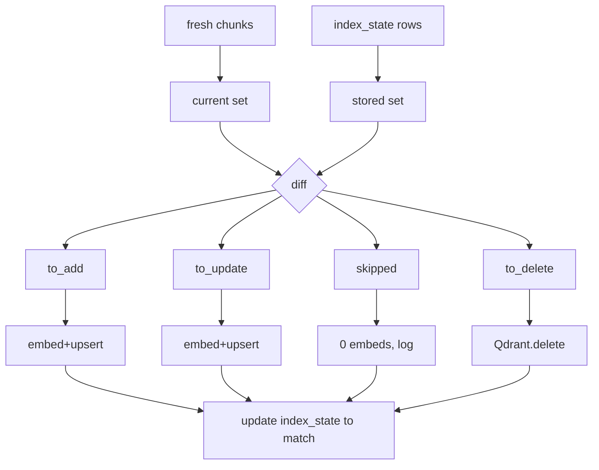
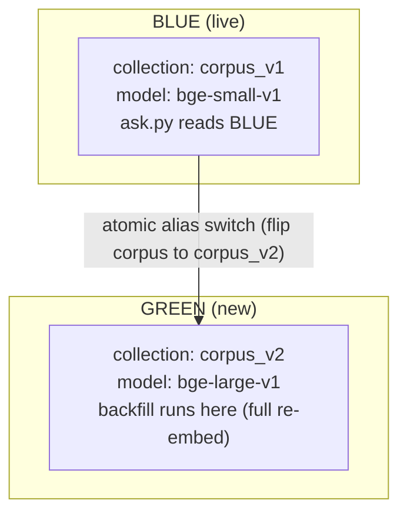

# Lecture 15: Incremental Indexing and Governance — Content-Hash Diffing, Tombstone Deletes, and Blue-Green Re-embedding

> Every prior lecture in this phase built a piece of the corpus pipeline: idempotent ingestion, tombstones, cleaning, PII redaction, Parquet, versioning, blocking quality gates. This lecture is where they compose into something you can *prove* to an auditor. You will build a governed, incremental RAG indexer: one that re-embeds only what changed (never the whole corpus), deletes a document's vectors when its source row is tombstoned, and migrates embedding models without corrupting similarity — and then you will run the governance proof that ties the phase together: ask a question answered by doc D, delete D, ask again, and watch the fact vanish, with Qdrant point counts before and after. After this you can build an indexer that costs pennies to keep fresh, provably removes a document from answers on delete, and migrates embedding versions with an atomic cutover — and you can defend the delete-propagation guarantee that every downstream phase depends on.

**Prerequisites:** Phase 4 RAG (embeddings, Qdrant/pgvector, chunking); Week 1 CDC + tombstones; Week 2 cleaned/redacted records with provenance; SQL + DuckDB basics · **Reading time:** ~34 min · **Part of:** Phase 5 — Data Engineering for AI, Week 3

## The core idea (plain language)

A naive indexer treats every run as a fresh start: read all chunks, embed all of them, wipe and reload the collection. That works on day one with 500 chunks. On day 200 with 2 million chunks it is a disaster — you pay for 2 million embeddings to reflect the 40 that actually changed, the index is unavailable or inconsistent mid-rebuild, and your embedding bill and wall-clock time scale with corpus *size* instead of corpus *change*. The whole point of an incremental indexer is to make cost scale with **the delta, not the total.**

Three mechanisms get you there, and they map one-to-one onto the three things that can happen to a document between runs:

1. **A chunk is new or changed** → embed it and upsert it. You detect this with a **content hash**: keep a little state table of `chunk_id → content_hash`, and on each run compare the fresh hash to the stored one. Same hash = skip (log "0 re-embeds"). Different or missing = embed.
2. **A document is deleted** → delete all its chunks' vectors. You detect this from the **tombstones** your Week 1 CDC already emits. Deleting the Postgres row is *not enough* — the vectors live in Qdrant, and the model will happily answer from them. Leaving them is a compliance failure.
3. **You switch embedding models** → you cannot edit vectors in place, because two models produce vectors that are not comparable. You do a **blue-green migration**: build a whole new collection with the new model, backfill it, then flip the query path atomically.

The governance layer sits on top: it is not enough to *assert* that deletes propagate. You **prove** it — a scripted before/after that shows a fact is answerable, then gets deleted at the source, then is genuinely unretrievable, with point counts as evidence. That proof is the deliverable the rest of the study plan leans on.

The mental frame: **the index-state table is your source of truth about what is already indexed; the indexer's job is to reconcile Qdrant to the current corpus with the minimum number of operations; and the governance proof is the test that the reconciliation includes deletes, not just adds.**

## How it actually works (mechanism, from first principles)

### The index-state table

The one artifact that makes everything incremental is a tiny table — DuckDB or SQLite, it does not matter at this scale — that records what you have already put in the index:

```sql
CREATE TABLE index_state (
  chunk_id          TEXT PRIMARY KEY,   -- stable id: e.g. f"{doc_id}:{chunk_ord}"
  doc_id            TEXT NOT NULL,      -- so a tombstone can delete all a doc's chunks
  content_hash      TEXT NOT NULL,      -- xxhash/sha256 of the *normalized chunk text*
  embedding_version TEXT NOT NULL,      -- e.g. "bge-small-v1"
  qdrant_point_id   TEXT NOT NULL,      -- the point id in Qdrant
  indexed_at        TIMESTAMP NOT NULL
);
```

This table is the "what I already know" that lets each run answer the only question that matters: *for this chunk, has anything changed since last time?*

The `content_hash` must be computed over **stable content only** — the normalized chunk text, and nothing that changes run-to-run. This is the same trap from Week 1: if you hash a payload that includes `fetched_at`, `run_id`, or a mutable score, every chunk looks "new" every run and you re-embed the whole corpus while believing you are being incremental. Hash the text; optionally fold in fields that genuinely change meaning (e.g. the chunker version), but never volatile metadata.

### The diff: three sets

On each run you have two collections of `chunk_id`s: the **current** set (freshly chunked from the corpus) and the **stored** set (rows in `index_state`, minus anything whose `doc_id` is tombstoned). Set arithmetic gives you the work:

```python
current_hashes = { chunk_id: hash(text) for chunk_id, text in fresh_chunks }
stored_hashes  = { row.chunk_id: row.content_hash for row in index_state }

to_add    = current_hashes.keys() - stored_hashes.keys()          # new chunks
to_delete = stored_hashes.keys() - current_hashes.keys()          # gone chunks
to_check  = current_hashes.keys() & stored_hashes.keys()          # maybe changed
to_update = { c for c in to_check
              if current_hashes[c] != stored_hashes[c] }          # actually changed
skipped   = to_check - to_update                                  # unchanged
```

Everything in `to_add ∪ to_update` gets embedded and upserted. Everything in `to_delete` gets removed from Qdrant. Everything in `skipped` costs you *one hash comparison* and zero embedding calls — that is the win. When the corpus is unchanged, `to_add`, `to_update`, and `to_delete` are all empty and the run logs **"0 re-embeds."** That line in the log is your proof the diffing works.



The rule that keeps this honest: **the index-state table must be updated in the same logical operation as the Qdrant write** (or immediately after a confirmed write). If you update state before Qdrant succeeds and then crash, state says "indexed" but the vector is missing — a silent hole. If you write to Qdrant and crash before updating state, the next run re-embeds that chunk — wasteful but *safe*. Prefer the safe failure mode: **write Qdrant first, then state.**

### The tombstone-delete path

This is the mechanism the whole phase points at, so slow down here. In Week 1 your CDC did not `DELETE` rows from the landing zone when a source document was removed — it emitted a **tombstone**: a row with `deleted=true` (or `op="d"`). That was deliberate, because *absence is not deletion*. If a document simply stopped appearing in the source, "no row" could mean deleted, could mean the API paginated differently, could mean a transient error. A tombstone is an explicit, durable statement: *this document is gone, propagate it.*

The indexer consumes tombstones like this:

```python
tombstoned_docs = read_tombstones_since(last_watermark)   # doc_ids marked deleted
for doc_id in tombstoned_docs:
    point_ids = [r.qdrant_point_id for r in index_state.where(doc_id=doc_id)]
    if point_ids:
        qdrant.delete(collection_name=coll, points_selector=point_ids)
        index_state.delete_where(doc_id=doc_id)
```

Why this matters, concretely: an embedding is a lossy but very real copy of the source text — and its payload usually stores the raw chunk text verbatim for citations. When someone exercises a "right to be forgotten" request, or legal removes a document, or a customer offboards, deleting the Postgres row satisfies *nobody* if the chunks still sit in Qdrant. A retrieval query will still surface those chunks, the LLM will still quote them, and you have a system that "answers from deleted data." That is not a bug that degrades quality — it is a **compliance failure** that can be a regulatory or contractual breach. The tombstone → delete path is the enforcement mechanism, and the governance proof is how you demonstrate it actually fires.

One subtlety: delete by `doc_id`, not by re-deriving chunk ids from current text. The document is *gone* — you cannot re-chunk it. That is exactly why you stored `doc_id` and `qdrant_point_id` in the state table. The state table is your only remaining record of what points belonged to that doc.

### Blue-green re-embedding

Eventually you will change embedding models — `bge-small` → `bge-large`, or `text-embedding-3-small` → `-3-large`, or a new model entirely. Here is the trap that looks fine and is catastrophic: re-embed changed chunks with the new model and upsert them into the *same* collection, leaving the old vectors for unchanged chunks.

Why it corrupts everything: **similarity is only meaningful between vectors from the same model.** Two embedding models place text in two different geometric spaces. A cosine similarity of 0.82 between a `bge-small` query vector and a `bge-large` document vector is a meaningless number — the axes do not correspond. Mix them in one collection and every query silently compares apples to oranges for some fraction of results. There is no error, no exception; retrieval quality just quietly rots, and the more you "incrementally" re-embed, the worse the contamination. In-place re-embedding across model versions is **forbidden.**

The correct pattern is **blue-green**, borrowed from deployment:



Steps:
1. Bump `embedding_version` (e.g. `bge-large-v1`).
2. Create a **new** Qdrant collection (`corpus_v2`) sized for the new model's dimensions.
3. **Backfill** it: embed *every* chunk with the new model and upsert into `corpus_v2`. Yes, this is a full re-embed — that is the price of a model change, and it is exactly why you do it rarely and deliberately, not per-run.
4. Validate green (point count matches corpus, spot-check a few known queries).
5. **Atomically switch** the query path. The clean way in Qdrant is a **collection alias**: `ask.py` always queries the alias `corpus`; you point `corpus` at `corpus_v1` today and repoint it to `corpus_v2` in one operation. Retrieval flips from blue to green with no in-between state where queries hit a half-built collection.
6. Keep blue around until green is proven in production, then drop it.

The dimension mismatch alone should convince you: if the new model outputs 1024-dim vectors and the old collection is configured for 384, Qdrant will reject the upsert outright. But even when dimensions happen to match, the spaces do not — the silent-corruption case is the dangerous one, and blue-green is the only pattern that structurally prevents it.

## Worked example

Take a corpus with **1,000 chunks** across 200 documents, embedding at roughly $0.02 per 1M tokens (`text-embedding-3-small` order of magnitude; treat as approximate) or ~0.05s per chunk on a local `bge-small` CPU model.

**Run 1 (cold start).** State table empty. `to_add = 1000`. Embed 1,000 chunks, upsert 1,000 points. Qdrant point count: **1000**. Log: `added=1000 updated=0 deleted=0 skipped=0`.

**Run 2 (nothing changed).** Fresh hashes match stored hashes for all 1,000. `to_add=0, to_update=0, to_delete=0, skipped=1000`. Zero embedding calls. Log: `added=0 updated=0 deleted=0 skipped=1000  (0 re-embeds)`. Point count still **1000**. Wall-clock: the time to hash 1,000 short strings — milliseconds. Compare to the naive rebuild: 1,000 embeddings, ~50 seconds locally or a real API bill, for zero information gain.

**Run 3 (3 docs edited, 1 doc deleted).** Say the 3 edited docs are 5 chunks each (15 chunks changed hash), and the deleted doc had 4 chunks (tombstoned). `to_update=15`, `to_delete=4`, `skipped=981`. Embed **15** chunks (not 1,000). Delete 4 points. Point count: 1000 + 0 − 4 = **996**. Log: `added=0 updated=15 deleted=4 skipped=981`. You paid for 15 embeddings to keep a 1,000-chunk index perfectly fresh — a **98.5% saving** versus a full rebuild.

Now scale the intuition: at 2,000,000 chunks with a typical daily churn of 0.5%, incremental costs ~10,000 embeddings/day; the naive rebuild costs 2,000,000/day — a 200× difference that is the gap between a few-dollars-a-day index and a several-hundred-dollars-a-day index, plus the availability difference (seconds of upserts vs. hours of rebuild during which the index is inconsistent). (Numbers illustrative; churn varies wildly by corpus.)

**The governance sequence (Run 4).** This is the milestone proof, scripted end to end:

```
1. ask("What is the incident number for the Q3 outage?")
   → retrieves chunk from doc D42, answers "INC-4471", cites D42.   ✅ answerable
   Qdrant point count: 996

2. UPDATE documents SET deleted=true WHERE id='D42';   -- source delete
   → CDC run emits tombstone for D42
   → indexer run: to_delete = D42's 3 chunks → qdrant.delete(3 points)
   Qdrant point count: 993      (996 − 3)

3. ask("What is the incident number for the Q3 outage?")
   → retrieval returns no D42 chunks; top hits are unrelated
   → answer: "I don't have information about that."   ✅ NOT answerable
```

Save both answers and the point counts (996 → 993) into `reports/governance_proof.md`. The 3-point drop is the physical evidence that the delete propagated from Postgres all the way into the vector store. You did not *assert* the guarantee — you *measured* it.

## How it shows up in production

- **Cost that scales with change, not size.** The single biggest reason to build this. Teams that skip content-hash diffing discover it via the finance dashboard: an embedding bill that grows every time the corpus grows, even on days nothing meaningful changed. The fix is the diff; the tell is a re-run that logs "0 re-embeds."
- **Index unavailability during rebuilds.** Wipe-and-reload leaves a window where the collection is empty or half-populated and live queries return garbage or nothing. Incremental upserts touch only changed points, so the index is always queryable. Blue-green extends this to model changes: the live collection is never mid-mutation.
- **The delete you cannot see.** The nastiest production incidents here are invisible until an audit or a customer complaint: "why did your chatbot quote a document we deleted six months ago?" Because the row left Postgres and the vector stayed in Qdrant. This is not hypothetical — it is the default behavior of any RAG system that treats the vector store as a write-only cache. The tombstone path is the only thing that closes it.
- **Silent quality rot from mixed embeddings.** Someone "optimizes" by upgrading the model and only re-embedding new content into the existing collection. No error fires. Retrieval precision drops a few points; nobody attributes it to the mixed space for weeks. The debugging session that finally finds it is expensive. Blue-green makes this structurally impossible.
- **State/index drift after crashes.** If a run dies between the Qdrant write and the state update, you get either a re-embed (harmless) or an orphan (harmful). Design for the harmless direction, and add a periodic reconcile that compares `index_state` point ids against Qdrant's actual point count — divergence is your early warning.
- **Chunk-id instability.** If your chunker changes how it splits text, chunk ids shift and *every* chunk looks new — a stealth full re-embed. Version the chunker and treat a chunker change like a model change: it is a deliberate, planned backfill, not an accident you discover in the bill.

## Common misconceptions & failure modes

- **"Deleting the Postgres row deletes it from RAG."** No. The vector is an independent copy in Qdrant. Nothing removes it unless your indexer explicitly deletes the points. This is the phase's headline lesson.
- **"I can re-embed changed chunks into the same collection after a model upgrade."** No — you will mix incomparable vector spaces and silently corrupt similarity. New model = new collection = blue-green.
- **"Upsert handles updates, so I don't need hashing."** Upsert makes the *write* idempotent, but without a hash you still *call the embedding model* for every chunk to produce the vector you upsert. Hashing avoids the expensive embedding call; upsert only avoids duplicate points. You need both.
- **"Absence means deletion."** A document missing from a fetch is ambiguous (pagination, transient error, filter change). Only an explicit tombstone is a safe delete signal. This is why Week 1 emitted tombstones instead of dropping rows.
- **"The governance proof is a unit test I can assert."** No — it is an *integration* proof spanning Postgres → CDC → indexer → Qdrant → LLM. Asserting "delete works" in isolation proves nothing about the wiring between systems, which is exactly where the failure lives. Measure point counts and answer text end to end.
- **Hashing volatile fields.** Fold `fetched_at`/`run_id` into the content hash and every chunk is "changed" forever — an incremental indexer that secretly does full rebuilds.
- **Forgetting to update state on delete.** If you delete points from Qdrant but leave the rows in `index_state`, the next run's diff will see them as `to_delete` again (a harmless no-op) or, worse, a bug elsewhere re-adds them. Delete from both Qdrant and the state table.

## Rules of thumb / cheat sheet

- **State table keys:** `chunk_id` PK, plus `doc_id`, `content_hash`, `embedding_version`, `qdrant_point_id`. You need `doc_id` for tombstone deletes and `embedding_version` for migrations.
- **Hash the stable text only.** Normalized chunk text (+ chunker version if you must). Never timestamps, run ids, or scores.
- **Diff = set math.** `to_add = current − stored`; `to_delete = stored − current`; `to_update = intersection where hash differs`; the rest is `skipped`. An unchanged run logs **0 re-embeds** — make that log line explicit; it is your regression signal.
- **Write order:** Qdrant first, then state. The safe failure is a redundant re-embed, never a silent hole.
- **Deletes come from tombstones, keyed by `doc_id`.** Never infer deletes from absence.
- **Model change ⇒ blue-green, never in-place.** New collection, full backfill, validate, atomic **alias** switch, then drop old. Do it rarely.
- **A chunker change is a model change.** Plan a backfill; don't let it masquerade as normal churn.
- **Reconcile periodically:** compare `count(index_state)` vs. Qdrant point count; alert on drift.
- **Governance proof is integration-level:** capture before/after *answers* and *point counts* to a checked-in report; regenerate it in CI if you can.

## Connect to the lab

This lecture is the theory behind Week 3 lab steps 5–6. In `indexer.py` you build the state table, the content-hash diff (proving "0 re-embeds" on an unchanged re-run), the tombstone → Qdrant-delete path, and the blue-green collection switch. In `ask.py` plus the scripted sequence you produce `reports/governance_proof.md`: the before/after answers and Qdrant point counts that prove a deleted source document leaves the RAG answers. That report is the milestone-critical artifact — Phase 6 (agents acting on your data) and the Capstone assume this guarantee holds.

## Going deeper (optional)

- **Qdrant docs** — collections, points/upsert, delete by ids/filter, and especially **collection aliases** for atomic switchover (root: `qdrant.tech`; search: *Qdrant collection aliases*, *Qdrant delete points*).
- **DuckDB** for the state table and diffing over Parquet (root: `duckdb.org`; search: *DuckDB read_parquet*, *DuckDB INSERT ON CONFLICT upsert*).
- **Debezium "Introduction to Change Data Capture"** for the tombstone/delete-event mental model at scale (search: *Debezium tombstone events*).
- **Martin Fowler, "BlueGreenDeployment"** — the pattern origin; the reasoning transfers directly to swapping index collections (search: *Martin Fowler BlueGreenDeployment*).
- **Pinecone / Weaviate migration guides** on re-embedding — vendor-specific but the "new index, backfill, cut over" shape is universal (search: *re-embedding migration new index cutover*).
- **GDPR "right to erasure" (Article 17)** for *why* the delete-propagation guarantee is not optional in regulated settings (search: *GDPR right to erasure vector database*).

## Check yourself

1. Your indexer re-embeds the entire corpus on every run despite "content hashing." What is the most likely single cause?
2. You delete a document's row from Postgres. Walk the exact chain of steps that must fire for its facts to become unanswerable in RAG, and name where each step lives.
3. Why is upserting new-model vectors into an existing collection dangerous even when the vector dimensions happen to match?
4. The indexer crashes between the Qdrant upsert and the state-table update. Which failure mode is this, and why did you order the writes to make it the harmless one?
5. Why must the governance proof measure Qdrant point counts and answer text end-to-end, rather than a unit test asserting `delete()` was called?
6. A document is tombstoned but you no longer have its text (it's gone from source). How does the indexer know which vectors to delete?

### Answer key

1. The content hash almost certainly includes a volatile field (e.g. `fetched_at`, `run_id`, a score) so every chunk's hash differs every run, forcing `to_update` to contain everything. Hash the normalized text only. (A chunker version change causing every chunk_id to shift is the second suspect.)
2. Source `UPDATE ... deleted=true` (Postgres) → CDC emits a **tombstone** row (Week 1 ingest) → indexer reads tombstones, looks up the doc's `qdrant_point_id`s in the **index-state table**, and calls `qdrant.delete(points)` and removes the state rows → next retrieval finds no chunks for that doc → LLM cannot cite it. The critical, easy-to-miss link is the Qdrant delete: without it the vectors persist and the model still answers.
3. Similarity is only meaningful between vectors from the *same* model — two models embed into different geometric spaces, so cross-model cosine values are noise. Matching dimensions removes the *error* (Qdrant accepts the upsert) but not the *corruption* (queries silently compare incomparable vectors), which is worse because it fails quietly. Blue-green avoids it.
4. It is the **safe** failure mode: state says "not yet indexed" (or carries a stale hash), so the next run simply re-embeds and re-upserts that chunk — wasteful but correct, and idempotent thanks to upsert. You ordered Qdrant-write-then-state-write precisely so a crash leaves a redundant re-embed rather than a state row claiming a vector that was never written (a silent retrieval hole).
5. Because the guarantee is an **integration** property spanning five systems (Postgres, CDC, indexer, Qdrant, LLM); a unit test that `delete()` was called proves the function ran, not that a deleted fact is actually unretrievable through the whole stack. The point-count drop and the changed answer are physical, end-to-end evidence that the wiring — where real failures hide — works.
6. From the **index-state table**: it stored `doc_id → qdrant_point_id` at index time. The tombstone carries the `doc_id`; the indexer looks up all point ids for that doc in the state table and deletes them. You never need the original text — which is why you persisted the mapping rather than re-deriving chunk ids from content.
