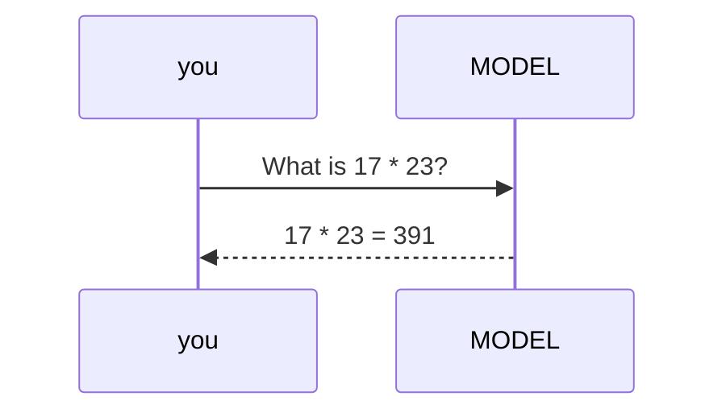
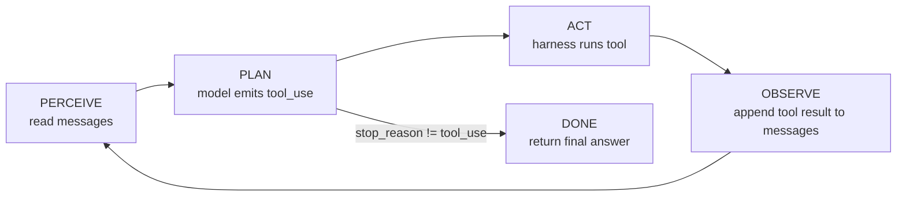

# Lecture 1: The Agent Loop — Loop, Not Prompt

> Every agent framework you will ever touch — LangGraph, CrewAI, the Claude Agent SDK, whatever ships next quarter — is a wrapper around one small `while` loop. This lecture builds that loop from first principles so that when a framework hides it, you know exactly what it is hiding. After this you will be able to draw the perceive→plan→act→observe cycle from memory, explain why the model physically cannot run your tools, state the precise message sequence that accumulates on every step, and define "done" with a single boolean expression instead of a hand-wave.

**Prerequisites:** structured outputs / tool calling from Phase 2; comfort with JSON, HTTP request/response, and Python dicts · **Reading time:** ~22 min · **Part of:** AI Agents & Agentic Systems (Expanded Deep Track), Week 1

---

## The core idea (plain language)

A **prompt** is one round-trip. You send text, the model sends text back, the exchange is over. That is the shape of 90% of the LLM code written before 2024: `answer = model(question)`. It is a pure function call. The model's entire influence on the world is the string it returns.

An **agent** is that same call placed inside a loop, with one crucial addition: the model is allowed to say *"before I answer, run this tool for me and show me the result."* Your code runs the tool, appends the result to the conversation, and calls the model again. The model looks at the new information and either asks for another tool or produces a final answer. That loop — and specifically the fact that the *model* decides how many times it spins — is the entire difference between a prompt and an agent.

The slogan "an agent is a loop, not a prompt" is not marketing. It is a statement about *who owns the control flow*. In a prompt, you (the developer) decide everything: how many calls, in what order, with what inputs. In an agent, you write the loop once and the model decides, at runtime, how many iterations it needs and which tools to pull in. You hand the steering wheel to the model. Everything hard about agents — cost blowups, runaway loops, non-determinism, debugging "why did it do *that*" — flows directly from that handoff.

The single most misunderstood fact by newcomers: **the model never runs your tools.** It cannot. A language model is a function from tokens to tokens; it has no file system, no network socket, no Python interpreter. When it "uses a tool," what actually happens is that it emits a *structured request* — a little JSON object saying "call `calculator` with `{"expression": "17*23"}"` — and then stops. Your harness (your loop code) reads that request, executes the real function, and feeds the result back as a new message. The model proposes; the harness disposes. Internalize this and half the confusion about agents evaporates.

---

## How it actually works (mechanism, from first principles)

### The prompt: one round-trip

Here is the degenerate case, an ordinary single call:



One request, one response, `stop_reason: "end_turn"`. Done. The model computed `391` from its weights (and might get it wrong on a harder number, because it is pattern-matching arithmetic, not executing it).

### The agent: the loop

Now give the model a `calculator` tool and wrap the call in a loop. The mechanism is exactly this pseudocode — memorize it, because it is the spine of the whole phase:

```python
messages = [{"role": "user", "content": task}]
while True:                                   # <- the loop
    response = model(messages, tools=TOOLS)   # perceive + plan
    if response.stop_reason != "tool_use":    # define "done" rigorously
        return response                        # the model is finished
    messages.append(assistant_turn(response)) # record what the model asked
    for call in response.tool_calls:           # act
        result = DISPATCH[call.name](**call.input)   # HARNESS runs the tool
        messages.append(tool_result(call.id, result)) # observe
    # loop back: model sees the results and decides again
```

Map that onto the classic cognitive-loop vocabulary:



- **Perceive** = the model reads the current `messages` array (the whole transcript so far).
- **Plan** = the model decides internally whether it can answer or needs a tool, and emits either text or a `tool_use` block.
- **Act** = *your harness* executes the requested tool. This step happens in your process, not the model's.
- **Observe** = you append the tool's output back into `messages` as a `tool_result`, and the loop repeats.

### The core invariant, spelled out

The model's output is data, not action. Concretely, when Claude decides to use the calculator, the API returns something like:

```json
{
  "stop_reason": "tool_use",
  "content": [
    {"type": "text", "text": "Let me compute that."},
    {"type": "tool_use", "id": "toolu_01A", "name": "calculator",
     "input": {"expression": "17*23"}}
  ]
}
```

Notice: `stop_reason` is `"tool_use"`, and there is a `tool_use` block with an `id`, a `name`, and validated `input`. The model has **stopped**. Nothing has been computed. The number `391` does not exist yet. It will exist only after *your* code does:

```python
result = calculator(expression="17*23")   # your Python actually runs, returns "391"
```

and then hands the result back. If your process crashed right after the model returned, no tool would ever run. That is the invariant: **the transcript is the only channel between model and world, and the harness is the only actor.**

### The message-accumulation contract, turn by turn

This is the part people get wrong and get 400 errors for. The conversation is a strictly ordered list of messages, and every tool round-trip adds *two* messages in a fixed order. Walk it for the task *"Read notes.txt, then compute 17×23, and report both."*

**Turn 0 — you seed the conversation:**
```
[ {role: user, content: "Read notes.txt, then compute 17*23, report both."} ]
```

**Turn 1 — model asks for the file (transcript now has 1 message; you append 2):**
```
messages.append( {role: assistant, content: [tool_use read_file {name:"notes.txt"}]} )
messages.append( {role: user,      content: [tool_result toolu_01 "Ship date: Nov 14"]} )
```
Transcript length: 3.

**Turn 2 — model asks for the calculation:**
```
messages.append( {role: assistant, content: [tool_use calculator {expression:"17*23"}]} )
messages.append( {role: user,      content: [tool_result toolu_02 "391"]} )
```
Transcript length: 5.

**Turn 3 — model has everything, answers in plain text, `stop_reason == "end_turn"`:**
```
messages.append( {role: assistant, content: [text "notes.txt says the ship date is
                  Nov 14, and 17 × 23 = 391."]} )
```
Transcript length: 6. Loop exits.

Two hard rules fall out of this contract:

1. **The assistant `tool_use` turn must be appended *before* the `tool_result` turn.** The API models a conversation; you cannot hand it a result for a request it has no record of making. Skip the assistant turn and you get a 400.
2. **Every `tool_use_id` must be answered by exactly one `tool_result` with the matching id.** If the model made three parallel tool calls, you owe three `tool_result` blocks in the next user message. Miss one → 400.

### Why the transcript grows every step

Look at the lengths: 1 → 3 → 5 → 6. The conversation is **append-only**, and — this is the load-bearing detail for cost — the API is **stateless**. The model has no memory between calls. On turn 2, the model re-reads *everything from turn 0 onward*, because you resend the entire `messages` array on every request. There is no server-side session; "context" just means "the list you pass in."

That is what the loop *adds* over a single call, and it is worth being precise about the three distinct capabilities:

- **Iterative refinement.** The model sees the file contents *before* it decides what to do next. A single call would have to guess or hallucinate the file's contents; the loop lets the model act on real, freshly-fetched information.
- **Tool-mediated grounding.** `391` came from Python's `ast`-based evaluator, not from the model's shaky mental arithmetic. `"Nov 14"` came from the actual file. The loop lets the model's answers be *grounded* in real computation and real data instead of its priors.
- **Dynamic step count.** The task above took 2 tool steps. A different task might take 0 (just answer) or 7. *You did not decide that number.* The model did, at runtime, by choosing when to stop emitting `tool_use`. A single call is always exactly one step; the loop makes step count a runtime variable owned by the model.

---

## Worked example (with the numbers)

Let's run the transcript above on `claude-opus-4-8` and count what it actually costs, because the cost model is a direct consequence of "the transcript grows every step" and it surprises people in production.

Pricing for `claude-opus-4-8` (approximate, current 2025–2026): **$5 per 1M input tokens, $25 per 1M output tokens.** Assume rough token counts per turn:

| API call | Input tokens (what you resend) | Output tokens (what model emits) |
|---|---|---|
| Turn 1 (asks for file) | 350 (system + tools + task) | 40 (text + tool_use) |
| Turn 2 (asks for calc) | 520 (turn 1 input + file result + assistant turn) | 30 |
| Turn 3 (final answer) | 700 (everything so far) | 45 |
| **Totals** | **1,570 input** | **115 output** |

Cost:
- Input: 1,570 × $5 / 1,000,000 = **$0.00785**
- Output: 115 × $25 / 1,000,000 = **$0.00288**
- **Total ≈ $0.011** for a 3-call agent run.

The lesson hiding in the input column: **350 → 520 → 700.** The task didn't get bigger; the transcript did. Because the API is stateless, you pay to re-send the growing history on *every* turn. This is why an agent that loops 30 times on a hard task doesn't cost 30× a single call — it costs *more*, because input grows roughly linearly with step count and you pay for the accumulated prefix every time. A back-of-envelope model: for N steps with prefix growing by `d` tokens per step, total input tokens ≈ `N × base + d × N²/2` — the quadratic term is why long agent runs get expensive fast. (Prompt caching, which you'll meet later, is the primary defense; it discounts the re-sent prefix to ~10% of cost.)

Contrast the single-call version: `model("What is 17*23?")` costs one call, maybe 15 input + 10 output tokens ≈ $0.0003 — and returns whatever the model's weights produce, possibly `391`, possibly `392` on a nastier product. The agent costs ~35× more and is *correct by construction* because a real evaluator ran. That trade — more money and latency for grounding and correctness — is the whole value proposition of the loop. Reach for it only when a single call genuinely can't do the job.

---

## Workflows vs agents: who owns the control path

Anthropic's essay *Building Effective Agents* draws the sharp line, and it is the most important architectural distinction in this phase. Both are "LLM systems"; they differ in **who decides what happens next.**

```
WORKFLOW  (developer owns control flow)      AGENT  (model owns control flow)
──────────────────────────────────────      ─────────────────────────────────
  code: classify(x)                            messages = [task]
  if intent == "refund":                       while model still wants a tool:
      code: call refund_tool()                     model picks the tool
  else:                                            harness runs it
      code: call answer_tool()                     harness feeds result back
  code: format_response()                      model decides when to stop
  ▲ you wrote every branch                     ▲ the model chose the path
```

A **workflow** is LLMs wired into predefined code paths. You call the model to *classify*, then a hard-coded `if` decides the next step, then you call the model again for a fixed sub-task. The control flow lives in *your* source code. It is predictable, cheap, easy to trace, and easy to test — you can enumerate every path. Anthropic's five building blocks (prompt chaining, routing, parallelization, orchestrator-worker, evaluator-optimizer) are all workflows: the LLM fills in the blanks, but *you* drew the flowchart.

An **agent** is an LLM directing its own process. You give it tools and a goal; it chooses which tools to call, in what order, how many times, and when it's finished. The control flow lives in *the model's* runtime decisions. It is flexible and handles open-ended tasks a flowchart can't anticipate — but it is expensive, non-deterministic, and hard to trace ("why did it call search three times?").

The load-bearing engineering principle: **start with the simplest composition that works, and add autonomy only when a simpler topology measurably fails.** Most production "AI features" should be workflows. Reach for a true agent when the task is genuinely open-ended — you can't predict the steps in advance — and the value justifies the cost and the debugging tax. This week you build the agent (the hard case) precisely so you understand what you're opting into; Week 2 is about *choosing* the cheapest topology that solves the task.

---

## How it shows up in production

- **Cost scales with steps², not steps.** The transcript re-send is the silent budget killer. An agent stuck in a 40-step loop on a failing tool re-sends an ever-growing prefix each turn and can burn a day's API budget overnight. The mitigations you'll build this week — max-steps, wall-clock, token, and dollar budgets — exist because of this exact mechanism. (This is also why prompt caching is not optional at scale.)
- **Latency is serial and additive.** Each loop iteration is a full network round-trip to the model (often 1–5 s) *plus* tool execution time. A 6-step agent is ~6 sequential model calls; users feel every one. You cannot parallelize away the dependency, because step N+1 depends on the observation from step N.
- **"The model ran a tool and it crashed" is a category error.** The model emitted a request; *your* code crashed running it. If a tool raises an unhandled exception, the loop dies. The production discipline (next lecture's topic) is **errors-as-observations**: every tool returns a string, swallowing its own exceptions into `"ERROR: ..."`, so a failure becomes an *observation the model can recover from* rather than a stack trace that kills the run.
- **Forgetting the assistant `tool_use` turn is the #1 first-day 400.** You get the `tool_use`, you eagerly run the tool, you append the `tool_result` — and forget to append the assistant message that requested it. The API rejects the sequence. Append both, in order, always.
- **Debugging requires the transcript.** When an agent misbehaves, the answer is always in the `messages` array: which tool it called, with what args, what came back. If you aren't logging every step (thought, tool, args, observation, tokens, cumulative $), you are debugging blind. The per-step trace you build this week is the seed of all later observability.
- **`stop_reason` is the contract, not the text.** Never decide "the agent is done" by string-matching the model's prose ("looks like a final answer to me"). Branch on `stop_reason`. `tool_use` means keep looping; anything else (`end_turn`, `max_tokens`, `refusal`) means stop. Text-parsing termination is how you get infinite loops and premature exits.

---

## Common misconceptions & failure modes

- **"The model executes the tool."** No. The model emits a structured `tool_use` request and stops. Your harness executes. The result only enters the conversation because you put it there.
- **"The API remembers the conversation."** No. It is stateless. You resend the full `messages` array every call. "Memory" is a list you maintain and pay to transmit.
- **"An agent is just a better prompt."** No. It's a control-flow change: the model gains the ability to interleave tool calls and decide the step count. Same model, fundamentally different program shape.
- **"More agent = better."** No. Autonomy costs money, latency, and predictability. A workflow (you own the branches) beats an agent for any task whose steps you can enumerate in advance.
- **Regex-scraping "Action:/Observation:" text.** The original 2022 ReAct paper parsed free text. In 2025–2026, every major provider returns *structured* tool-call objects (`stop_reason: "tool_use"` + `tool_use` blocks for Claude; `finish_reason: "tool_calls"` for OpenAI). Use them. Regex ReAct breaks the moment the model rephrases and gives you no validated JSON args.
- **Deciding "done" by vibes.** `done` has a rigorous definition: `stop_reason != "tool_use"`. That's it. If it's `tool_use`, run the tools and loop. Otherwise, return.
- **Unbounded loops.** With no step/time/token/dollar cap, an agent oscillating between two tools will loop until it exhausts your budget. Bound every path (Lecture 3's topic — but note it now).

---

## Rules of thumb / cheat sheet

- **The loop, in one line:** `while stop_reason == "tool_use": run the requested tools, append results, call again.`
- **`done` is exactly:** `stop_reason != "tool_use"`. Branch on the field, never on the prose.
- **The invariant:** the model *requests*; the harness *executes*; the result re-enters via a new message. The model never touches your file system, network, or interpreter.
- **The two-message contract:** every tool round-trip appends `assistant(tool_use)` **then** `user(tool_result)`, in that order. Answer every `tool_use_id` exactly once.
- **The transcript is append-only and stateless.** You resend it whole every turn. Input tokens grow with step count → cost grows super-linearly.
- **Workflow vs agent:** you own the control path (workflow) or the model owns it (agent). Default to workflow; escalate to agent only when the task is genuinely open-ended.
- **Native tool calling, not regex.** Trust `stop_reason` / `tool_use` blocks; never scrape "Action:" text.
- **Log every step** (thought, tool, args, observation, tokens, cumulative $). You cannot debug an agent you didn't trace.
- **Bound every run** (max-steps, wall-clock, tokens, dollars) — a loop with the steering wheel handed to the model needs guardrails.

---

## Connect to the lab

This week's lab has you hand-write this exact loop on the raw Anthropic SDK — no LangChain, no CrewAI — in ~150 lines: `agent.py` (the loop + budgets + kill switch), `tools.py` (calculator, web_fetch, read_file, each returning a string and never raising), and `trace.py` (one structured JSON line per step). Run the *"read notes.txt, then compute 17×23"* task end-to-end and watch the `messages` array grow turn by turn in the trace. The point is not to produce a clever agent — it's to *feel* the mechanics in your fingers: the `stop_reason` branch, the append-assistant-then-append-result ordering, the transcript ballooning on each call. Every later week (planning topologies, durability, MCP/A2A, memory, multi-agent) builds on this loop; if it isn't crisp now, nothing downstream will be.

---

## Going deeper (optional)

- **Anthropic — *Building Effective Agents*** (the canonical workflow-vs-agent read). Search: `Anthropic Building Effective Agents`.
- **Anthropic — Tool Use overview**, official docs at `platform.claude.com` / `docs.claude.com` (search: `Anthropic tool use overview`). The authoritative description of `tool_use` blocks, `tool_result`, and `stop_reason`.
- **OpenAI — *A Practical Guide to Building Agents*** (same mental model from the other vendor; note `finish_reason: "tool_calls"`). Search that exact title.
- **OpenAI — Function calling guide**, `platform.openai.com` docs. Search: `OpenAI function calling guide`.
- **Yao et al., *ReAct: Synergizing Reasoning and Acting in Language Models*** (2022) — the origin of interleaved reason/act/observe. Read it to understand the *idea*; do **not** copy its text-parsing implementation. Search: `ReAct Yao 2022 paper`.
- **The Anthropic Python SDK** (`github.com/anthropics/anthropic-sdk-python`) — read the tool-use examples to see the real `messages.create(..., tools=...)` shape and the `stop_reason` field.

---

## Check yourself

1. In one sentence, what does the loop add that a single model call cannot?
2. A `tool_use` response comes back. What two messages must you append, in what order, before the next model call — and what happens if you leave a `tool_use_id` unanswered?
3. Give the rigorous definition of "done." Why is branching on the model's prose ("this looks like a final answer") a bug?
4. Your teammate says "the model ran the calculator and returned 391." Correct the sentence to reflect what actually happened.
5. Why does a 30-step agent run cost more than 30× a single call, given the same model?
6. Classify each as *workflow* or *agent*, and say who owns the control flow: (a) "classify the email, then `if spam: delete else: forward`"; (b) "here are 4 tools and a goal; figure out how to book my trip."

### Answer key

1. The loop lets the model interleave tool calls and *decide at runtime how many steps to take* — giving iterative refinement (act on freshly-fetched info), tool-mediated grounding (answers backed by real computation/data), and a dynamic step count the developer didn't fix in advance.
2. Append the **assistant** message containing the `tool_use` block(s) **first**, then a **user** message containing the matching `tool_result` block(s). If any `tool_use_id` goes unanswered (or you skip the assistant turn), the API returns a 400 — every request must be recorded and every result must map to exactly one request id.
3. `done` ≡ `stop_reason != "tool_use"`. Branching on prose is a bug because the model's text is not a reliable signal of completion — it can write a confident-sounding paragraph and still intend to call another tool, or produce a terse final answer that doesn't match your string pattern. `stop_reason` is the explicit, structured contract; the prose is not.
4. "The model *emitted a structured request* to call the calculator with `{"expression": "17*23"}` and stopped; *our harness* executed the real function, got `391`, and appended it back as a `tool_result` — after which the model used that value in its answer." The model never runs the tool.
5. Because the API is stateless and the transcript is append-only: you resend the entire growing `messages` array on *every* call, so input tokens grow with step count and you pay for the accumulated prefix each turn (roughly quadratic total input over N steps). The re-sent history, not the number of calls alone, is what inflates cost.
6. (a) **Workflow** — the developer owns the control flow; the `if/else` branch is hard-coded in your source. (b) **Agent** — the model owns the control flow; it decides which tools to call, in what order, and when it's done.
