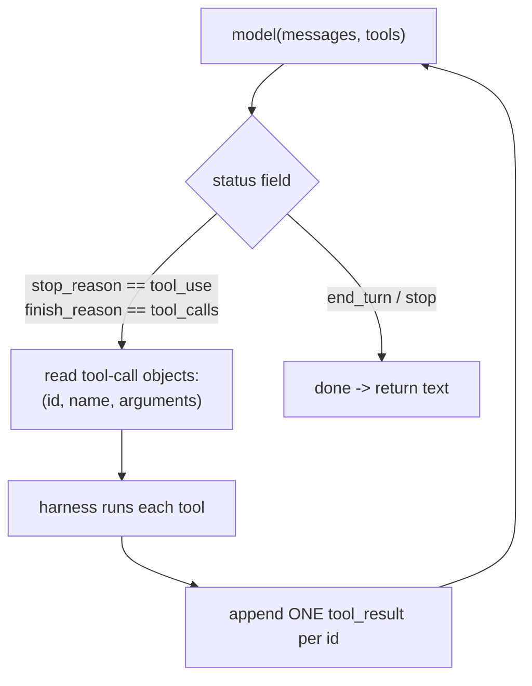

# Lecture 2: ReAct with Native Tool Calling

> ReAct — interleaving *reasoning* and *acting* — is the loop that turns a text predictor into something that can look things up, do arithmetic it can't do in its head, and correct course mid-task. The 2022 paper that named it parsed free-form text with regexes: the model wrote `Action: search[Eiffel Tower]` and your code scraped it out with a pattern. In 2026 that is a legacy artifact and an active liability — every serious provider returns *structured* tool-call objects with validated JSON arguments, and the moment the model rephrases its output your regex silently breaks. This lecture teaches ReAct the way you'll actually ship it: on top of the provider's native tool-calling mechanics. After it you'll be able to read Anthropic's `stop_reason == "tool_use"` and OpenAI's `finish_reason == "tool_calls"` off a raw response, write a tool schema whose JSON arguments are validated for you, answer every `tool_use_id` with a matching `tool_result` without tripping the 400-error contract, run several tools in one turn, and explain exactly why the regex approach was always a house of cards.

**Prerequisites:** Lecture 1 (the agent loop — perceive→plan→act→observe), Phase 0 Lecture 16 (chat templates, structured output, the tool-call round trip), Phase 2 (structured outputs / tool calling) · **Reading time:** ~26 min · **Part of:** AI Agents & Agentic Systems Week 1

---

## The core idea (plain language)

**ReAct** is a pattern with a deliberately boring shape: the model **reasons** ("I need the population of Tokyo, I don't know it, I should look it up"), then **acts** (emits a request to call a `search` tool), then **observes** (your code runs the tool and feeds the result back), then reasons again over the new information — and repeats until it has enough to answer. Reason → Act → Observe, interleaved, in a loop. The word "ReAct" is just **Rea**son + **Act** glued together. That interleaving is the whole point: unlike a single "think step by step" prompt, the model gets to *see the result of each action* before deciding the next one, so it can recover from a failed lookup, chase a follow-up, or stop early once it has the answer.

Here's the part that trips people up. The model does not *do* the acting. It cannot run your `search` function, hit an API, or read a file. All it can do is emit text — or, with native tool calling, emit a *structured request* that says "please call `search` with these arguments." **Your harness** — the `while` loop you wrote in Lecture 1 — is what actually executes the tool and hands the result back. The model proposes; your code disposes. ReAct is the choreography of that proposal-and-disposal, repeated.

The 2026 insistence of this lecture is about *how the proposal is transported*. In the original paper, the "act" step was free-form text the model generated (`Action: search[Tokyo population]`) and the harness recovered the intent with a regular expression. That works in a demo and fails in production, because the model's exact wording is not a stable contract — it will one day write `Action: Search("Tokyo population")` or wrap it in a code fence or add a helpful preamble, and your regex returns nothing. The fix, universal since ~2024, is **native structured tool calling**: you declare tools with a JSON schema, the provider constrains the model to emit a *structured* tool-call object (name + validated JSON arguments + a unique id), and your harness reads fields off that object instead of scraping text. Same ReAct loop, but the "act" step is now a typed, validated, machine-readable envelope rather than a string you have to parse and pray over.

---

## How it actually works (mechanism, from first principles)

### The loop, concretely

A ReAct agent is the Lecture 1 loop with the tool-call machinery filled in. Pseudocode, provider-agnostic:

```
messages = [ user_task ]
loop:
    response = model(messages, tools=TOOL_SCHEMAS)   # the model reasons + maybe acts
    if response wants to call tools:
        append the model's turn (incl. tool-call blocks) to messages
        for each tool call:
            result = run_my_function(call.name, call.arguments)   # your harness ACTS
            append a tool-result keyed to call.id to messages     # the OBSERVE step
        continue          # loop back so the model can reason over the observations
    else:
        return response.text   # model is done
```

Everything hinges on one branch: **did the model ask to act, or is it done?** Providers tell you which with a single field on the response.

### How each provider signals "I want to act"

**Anthropic (Claude).** The response has a top-level `stop_reason`. When the model wants to use a tool, `stop_reason == "tool_use"`. The `content` array then contains one or more `tool_use` **content blocks**, interleaved with any `text` blocks the model produced (the "reason" part — its out-loud thinking before acting). Each `tool_use` block carries three load-bearing fields:

```json
{
  "type": "tool_use",
  "id": "toolu_01A9c...",         // unique id you MUST echo back
  "name": "get_weather",           // which tool
  "input": {"location": "Tokyo"}   // arguments, already parsed JSON matching your schema
}
```

**OpenAI (GPT).** The response has `choices[0].finish_reason`. When the model wants to call tools, `finish_reason == "tool_calls"`, and `choices[0].message.tool_calls` is a list:

```json
{
  "id": "call_abc123",
  "type": "function",
  "function": {
    "name": "get_weather",
    "arguments": "{\"location\": \"Tokyo\"}"   // NOTE: a JSON *string*, not a parsed object
  }
}
```

Two differences worth burning into memory, because they cause real bugs:

1. **Where the id lives and what it's called.** Anthropic: `id` on the `tool_use` block, echoed as `tool_use_id`. OpenAI: `id` on the tool-call object, echoed as `tool_call_id`. Different names, same job.
2. **Parsed vs. stringified arguments.** Anthropic hands you `input` as an already-parsed object (a Python `dict`). OpenAI hands you `function.arguments` as a **JSON-encoded string** you must `json.loads()` yourself. Forgetting this on the OpenAI side is a classic first-day mistake — you index into a string and get characters instead of fields.

The mental model that unifies them: **the branch is a status field** (`stop_reason` / `finish_reason`), **the request is a structured object** (`tool_use` block / `tool_calls` entry), and the object carries `(id, name, arguments)`. Read those three and you can drive any provider.



### Why a tool schema, and why validated JSON beats text parsing

You declare each tool with a name, a description (the model reads this to decide *when* to reach for it), and a JSON Schema for its arguments. Minimal Anthropic form:

```json
{
  "name": "get_weather",
  "description": "Get the current weather for a city. Use when the user asks about weather or temperature.",
  "input_schema": {
    "type": "object",
    "properties": {
      "location": {"type": "string", "description": "City name, e.g. Tokyo"},
      "unit": {"type": "string", "enum": ["celsius", "fahrenheit"]}
    },
    "required": ["location"]
  }
}
```

(OpenAI is the same shape under `"function": {"name", "description", "parameters"}` — `parameters` is the JSON Schema, the analog of `input_schema`.)

The schema does two jobs. First, `required` and the property list tell the model what it *must* provide and what's optional — so it doesn't emit a call missing the one argument your function needs. Second, and this is the deep reason native calling wins: the provider uses the schema to **constrain decoding** (the Tier-3 mechanism from Phase 0 Lecture 16). At each token, the sampler is masked so the model can only emit tokens that keep the arguments conforming to the schema. Malformed arguments aren't merely "unlikely" — the tokens that would produce them are never sampleable. You get back a `{"location": "Tokyo"}` that is *structurally guaranteed* to match your declared shape.

Contrast that with the legacy text approach. The model writes `Action: get_weather[Tokyo]` and you run something like `re.match(r"Action:\s*(\w+)\[([^\]]+)\]", text)`. This is brittle at every seam:

- The model writes `get_weather("Tokyo")` instead of `[Tokyo]` — no match, empty result, crash or silent skip.
- It adds a preamble: `Sure! Action: get_weather[Tokyo]` — maybe your regex still catches it, maybe not.
- It needs two arguments and writes `get_weather[Tokyo, celsius]` — now *you* are writing an arguments parser, badly, reinventing JSON.
- A model upgrade subtly changes phrasing and your recall drops 5% with no error in the logs.

Native calling deletes this entire failure class. There is no parsing step you own; the arguments arrive as a validated object. **You never regex-scrape `Action:`/`Observation:` text in 2026** — that's the single most important takeaway of the lecture, and the pitfall the spine calls out explicitly.

### Parallel tool calls in one turn

The model can request **several tools in a single assistant turn** — this is on by default for both providers. If the user asks "compare the weather in Tokyo and Paris," a good model emits *two* `tool_use` blocks in one response rather than doing them one at a time across two round trips. Your harness runs them (ideally concurrently — they're independent), then returns *all* their results together.

This is a latency win: two independent lookups in one round trip instead of two sequential ones. But it creates a strict obligation, which is the next section.

### The 400-error contract: every `tool_use_id` gets exactly one `tool_result`

This is the rule that generates the most support tickets, so read it twice.

When the assistant turn contains N tool-call blocks, the **very next** message you send back must contain **N tool-result blocks, one per id, and nothing owed left over**. On Anthropic, if the assistant produced `tool_use` blocks with ids `toolu_1` and `toolu_2`, your next `user` message must contain a `tool_result` for `toolu_1` **and** a `tool_result` for `toolu_2`. Miss one — return only `toolu_1` — and the API rejects the *next* request with a **400**: the conversation is structurally invalid because a tool-use was left unanswered.

The Anthropic tool-result block:

```json
{
  "type": "tool_result",
  "tool_use_id": "toolu_01A9c...",   // MUST match a tool_use id from the previous assistant turn
  "content": "18C and cloudy",         // the observation — a string, or richer blocks
  "is_error": false                    // set true to tell the model the tool failed
}
```

Three sub-rules that follow from the contract:

1. **All results go in ONE user message.** For parallel calls, put all N `tool_result` blocks in a single `user` message. Splitting them across multiple messages is a different bug: on OpenAI it can be outright invalid, and even where it's accepted it *trains the model to stop making parallel calls* — the model learns from the transcript shape that its parallel request was answered piecemeal, and reverts to serial calls. Keep them together.
2. **A failed tool still gets a result.** If your function raised, you do **not** drop the block — you return a `tool_result` with `is_error: true` and an error message as content. Dropping it re-triggers the 400 (an id went unanswered); returning it as an error is the "errors-as-observations" discipline from Lecture 1 — the model reads the failure and can retry with different arguments or give up gracefully.
3. **You cannot answer an id that wasn't requested, or answer one twice.** The set of `tool_result` ids must equal the set of `tool_use` ids from the immediately preceding assistant turn. Extra or duplicate ids are also 400s.

### The append order: assistant, then user

The message sequence for one ReAct step is fixed, and the order matters:

```
[user]      the task
[assistant] text (reasoning) + tool_use block(s)   <- the model's turn, appended VERBATIM
[user]      tool_result block(s), one per id        <- your turn: the observations
[assistant] ... next reasoning / more tools / final answer
```

You append the model's **entire** assistant turn (including the `tool_use` blocks, and any `text` and — on reasoning models — `thinking` blocks) back into `messages` *before* you append the tool results. Then the tool results go in a fresh `user` message. This assistant→user ordering is non-negotiable: the API needs to see the assistant *made* the calls and then the user (your harness, wearing the user's hat) *answered* them. Appending only the text and dropping the `tool_use` blocks is a common bug — the results then reference ids the conversation has no record of, and you get a 400.

### `tool_choice` — steering whether and which tool

`tool_choice` controls the model's freedom to call tools on a given request. Three modes you should know at a high level:

- **`auto`** (the default): the model decides — it may answer directly or call one or more tools. This is what ReAct normally runs on; you *want* the model to judge when a tool is warranted.
- **`any`** (Anthropic) / `"required"` (OpenAI): the model *must* call *some* tool this turn — it can't answer in plain prose. Useful when the step is meaningless without a tool.
- **forced tool** (`{"type": "tool", "name": "get_weather"}` on Anthropic; the equivalent on OpenAI): the model *must* call *that specific* tool. Useful when you've already decided the step and just want the arguments filled in.

For this lecture, treat `tool_choice` as a steering knob and stop there. There's a determinism angle — forcing a tool is one of the levers that makes an agent's behavior reproducible for debugging — but we defer that to Lecture 5, which is about determinism levers proper. For now: `auto` for real ReAct, `any`/forced when a step *must* act.

---

## Worked example — a two-hop ReAct run with numbers

Task: *"How much warmer is Tokyo than Paris right now?"* One tool: `get_weather(location)`.

**Round trip 1.** You send the user task plus the `get_weather` schema, `tool_choice: auto`. Because the two lookups are independent, a good model reasons once and emits **both** calls in one turn:

```
stop_reason: "tool_use"
content:
  - {type: text, text: "I'll check both cities' current temperatures."}
  - {type: tool_use, id: "toolu_T", name: "get_weather", input: {"location": "Tokyo"}}
  - {type: tool_use, id: "toolu_P", name: "get_weather", input: {"location": "Paris"}}
```

Your harness:
1. Appends this entire assistant turn to `messages` (text + both `tool_use` blocks — verbatim).
2. Runs both functions (concurrently; they don't depend on each other). Tokyo → `"22C"`, Paris → `"15C"`.
3. Appends **one** user message with **both** results:

```
[user] content:
  - {type: tool_result, tool_use_id: "toolu_T", content: "22C", is_error: false}
  - {type: tool_result, tool_use_id: "toolu_P", content: "15C", is_error: false}
```

Both ids answered, in one message. Contract satisfied.

**Round trip 2.** You call the model again with the grown `messages`. Now it has the observations and reasons over them:

```
stop_reason: "end_turn"
content:
  - {type: text, text: "Tokyo is 7C warmer than Paris right now (22C vs 15C)."}
```

`stop_reason` is `end_turn`, not `tool_use` — the loop exits and you return the text.

**Now the failure variant.** Suppose the Paris lookup raises (bad city cache, timeout). You do **not** drop `toolu_P`. You return it as an error:

```
[user] content:
  - {type: tool_result, tool_use_id: "toolu_T", content: "22C", is_error: false}
  - {type: tool_result, tool_use_id: "toolu_P", content: "ERROR: weather service timed out", is_error: true}
```

Round trip 2 now: the model *reads* the error observation and can recover — retry Paris, or answer partially: *"Tokyo is 22C; I couldn't fetch Paris (the service timed out) — want me to retry?"* If you had instead dropped `toolu_P`, the request would 400 before the model ever saw anything, and your loop would crash on a *tool* failure instead of turning it into a recoverable observation.

**The cost/latency arithmetic.** This two-hop task cost **2** model round trips. Because the two weather calls were parallel-in-one-turn, it was 2 and not 3 — batching the independent lookups saved a full round trip. And note the token cost: round trip 2 resends the *entire* transcript (task + assistant turn + both results) as input. In ReAct the transcript grows every step, so input tokens accumulate roughly quadratically over a long run — a 10-step agent pays for step 1's tokens ten times. (Managing that growth — trimming, summarizing — is a later-week topic; here just notice the shape.)

---

## How it shows up in production

- **The 400 that means "you owe a tool_result."** Your agent crashes on the request *after* a tool call with a 400 like `messages.N: tool_use ids were found without tool_result blocks`. Cause: a tool raised and your code dropped the block, or a parallel call returned only some ids, or you appended the assistant text but not the `tool_use` blocks. Fix: guarantee one `tool_result` per `tool_use_id`, always, including failures (as `is_error: true`).
- **The regex ReAct that "worked yesterday."** A team ships an agent parsing `Action:` text against model X. A minor model update rephrases the action line and recall silently drops — the agent just stops using tools it should, with zero errors, because the regex returns no match and the code treats that as "no tool wanted." This is the exact trap the spine warns about; the only durable fix is native tool calling, where the *provider* guarantees the structure.
- **Stringified OpenAI arguments.** `function.arguments` is a JSON string; a dev indexes `args["location"]` on the raw string, gets a `KeyError` or a character, and the tool call silently misfires. Always `json.loads()` OpenAI arguments; Anthropic's `input` is already parsed.
- **Parallel calls that mysteriously stop happening.** An agent used to batch independent lookups, then quietly went serial and got slower. Cause: somewhere the code split the tool results across multiple user messages (or answered them in separate turns). The model learns from that transcript shape that parallel calls get answered awkwardly and reverts to one-at-a-time. Fix: all results for one assistant turn in one user message.
- **Schema drift between "declared" and "used."** You update a tool's real function signature (add a required arg) but not its `input_schema`. The model, constrained by the *old* schema, never supplies the new arg; your function throws. The schema is the contract the model is decoded against — keep it in lockstep with the function.
- **Latency you didn't budget.** Each ReAct step is a full model round trip that resends the whole transcript. A 5-hop task is 6 sequential model calls with a growing prompt each time; naive agents feel slow and cost more than "one call per request" intuition suggests. Count round trips and remember input tokens are resent every step.
- **Tool descriptions as production copy.** The model picks tools purely from name + description + schema. Vague descriptions cause skipped or wrong tool selection — a silent quality bug. Write them like API docs, including *when not* to use the tool.

---

## Common misconceptions & failure modes

- **"ReAct means the model runs the tools."** No. The model emits a *request*; your harness executes and feeds back the observation. The model never touches your functions — that separation is the safety boundary.
- **"I should parse the model's `Action:` text."** This is the legacy artifact. Regex ReAct breaks the instant the model rephrases, and it reinvents JSON parsing badly. Use native `tool_use`/`tool_calls` objects; the provider guarantees the structure.
- **"A tool that failed should just be dropped."** Dropping a `tool_use_id` triggers a 400 on the next request. Return it as a `tool_result` with `is_error: true` — the model reads the failure and recovers. Errors-as-observations, not exceptions.
- **"Anthropic and OpenAI arguments are the same type."** Anthropic `input` is a parsed object; OpenAI `function.arguments` is a JSON *string* you must decode. Different id field names too (`tool_use_id` vs `tool_call_id`).
- **"Parallel results can go in separate messages."** They must all go in one user message keyed by id. Splitting them is invalid or silently trains the model out of parallel calling.
- **"Forcing a tool with `tool_choice` is just for correctness."** It's also a steering/determinism lever — but we treat determinism properly in Lecture 5. Here it's: `auto` for real ReAct, `any`/forced when a step must act.
- **"Native tool calling means I can skip validation of the arguments."** Schema-constrained decoding guarantees the *shape*, not the *semantics* or the *safety*. The model can still emit a schema-valid `{"location": "'; DROP TABLE"}`. Tool arguments are untrusted input — validate and authorize before executing (the security theme of this phase).
- **"`stop_reason`/`finish_reason` only ever means done."** No — `stop_reason == "tool_use"` / `finish_reason == "tool_calls"` is the *keep going* branch. Check it before reading the final text, or you'll treat a tool request as an answer.

---

## Rules of thumb / cheat sheet

- **The branch is a status field.** Anthropic: `stop_reason == "tool_use"`. OpenAI: `finish_reason == "tool_calls"`. Anything else (`end_turn`/`stop`) → the model is done.
- **The request is a structured object** carrying `(id, name, arguments)`. Read those fields; never regex-scrape `Action:`/`Observation:` text.
- **OpenAI arguments are a JSON string** — `json.loads()` them. Anthropic `input` is already a parsed object.
- **Declare tools with a JSON schema** (`input_schema` / `parameters`), mark `required` fields, write the description like API docs (say *when* and *when not* to use it). The schema constrains decoding → validated arguments for free.
- **Append order: assistant turn (with `tool_use` blocks, verbatim) → then a user message of `tool_result` blocks.** Never drop the `tool_use` blocks.
- **One `tool_result` per `tool_use_id`, all in one user message, every time** — including failures (as `is_error: true`). Missing / extra / duplicate ids = 400.
- **Parallel tool calls are one turn, one answer message.** Run them concurrently; return all results together to keep the model calling in parallel.
- **`tool_choice`: `auto` for real ReAct; `any`/`required` when a step must call *some* tool; forced-tool when it must call *that* tool.** (Determinism angle → Lecture 5.)
- **Tool arguments are untrusted.** Schema guarantees shape, not safety — validate and authorize before executing.
- **Count round trips for cost/latency.** N tool hops ≈ N+1 sequential model calls; the transcript (and input-token bill) grows every step.

---

## Connect to the lab

Week 1's lab has you hand-write a bounded ReAct agent on the raw Anthropic SDK — this lecture is the "act/observe" half made real. When you write the loop in `agent.py`, the branch you code is exactly `if resp.stop_reason != "tool_use": return` else run tools; the `tool_use` blocks you iterate are the structured objects from this lecture, and `DISPATCH[tu.name](**tu.input)` works precisely because `tu.input` is already-validated JSON, not scraped text. Wire the append order deliberately (assistant turn with `resp.content` first, then the `user` message of `tool_result` blocks) and force each budget/error path: point `web_fetch` at a garbage URL and confirm the agent turns the failure into an `is_error: true` observation and *recovers* rather than crashing — that's the 400-contract and errors-as-observations discipline in one exercise. If you take the free Ollama path, note it does native `tool_calls` too (read `response.message.tool_calls`), so the same loop shape holds.

---

## Going deeper (optional)

- **Anthropic — "Tool use" overview and the Messages API reference** (docs at platform.claude.com / docs.anthropic.com). The authoritative description of `tool_use`/`tool_result` blocks, `stop_reason == "tool_use"`, `input_schema`, parallel tool use, and `tool_choice` (`auto`/`any`/forced). The bundled `claude-api` skill mirrors this for current model IDs.
- **OpenAI — "Function calling" guide** (platform.openai.com/docs). Canonical for `finish_reason == "tool_calls"`, the `tool_calls` array, stringified `arguments`, and `tool_choice` (`auto`/`required`/named).
- **Yao et al., "ReAct: Synergizing Reasoning and Acting in Language Models" (2022)** — the original paper. Read it for the *idea* (interleaved reason/act/observe) and to see the free-text parsing it used — then note why 2026 does the transport natively. Search: `ReAct Yao 2022 reasoning acting`.
- **Anthropic — "Building Effective Agents"** — frames the loop and where tools fit; read alongside Lecture 1. Search: `Anthropic Building Effective Agents`.
- Search queries: `Anthropic tool_use tool_result 400 tool_use_id`, `OpenAI parallel function calling tool_calls`, `anthropic tool_choice any forced tool`, `constrained decoding tool arguments json schema`.

---

## Check yourself

1. In one sentence each, what do the "Re" and "Act" of ReAct refer to, and what does the *interleaving* buy you that a single "think step by step" prompt does not?
2. Given a model response, which single field tells you "the model wants to act" on Anthropic vs. OpenAI, and what value does it hold in each?
3. A tool call raised an exception in your harness. Exactly what must you send back, and what happens on the next request if you instead drop the tool call?
4. Your OpenAI agent indexes `tool_call.function.arguments["city"]` and gets a `KeyError`. What's wrong, and how does the Anthropic equivalent differ?
5. Why does native tool calling with a JSON schema eliminate an entire class of bugs that regex-parsing `Action:` text is prone to? Name two concrete failure modes it removes.
6. The model emits two `tool_use` blocks in one turn. Describe the message(s) you must append back — how many, what role, and the id rule — and explain why splitting the results across two messages is a bug.

### Answer key

1. **Re**ason (the model thinks about what it needs) and **Act** (it emits a request to call a tool); interleaving lets the model *see each observation before choosing the next action*, so it can recover from failures, chase follow-ups, and stop early — a single CoT prompt reasons once with no feedback from the world.
2. Anthropic: `stop_reason`, value `"tool_use"`. OpenAI: `choices[0].finish_reason`, value `"tool_calls"`. Any other value (`end_turn`/`stop`) means the model is done.
3. You must return a `tool_result` block keyed to that `tool_use_id` with `is_error: true` and an error message as content (errors-as-observations — the model can then recover). If you drop it, the id goes unanswered and the next request fails with a **400** (a `tool_use` left without a matching `tool_result`).
4. OpenAI hands back `function.arguments` as a **JSON-encoded string**, so indexing it treats it as characters — you must `json.loads()` it first. Anthropic's `input` is already a parsed object (a dict), so you can index it directly.
5. The schema constrains decoding so arguments are structurally guaranteed to match, and you never own a text-parsing step. It removes, e.g.: (a) the model rephrasing the action line (`get_weather("Tokyo")` vs `[Tokyo]`) so your regex returns no match; (b) multi-argument calls forcing you to hand-write a fragile arguments parser (native calling gives you validated JSON instead). (Also: preamble text breaking the pattern, silent recall drops after a model update.)
6. Append **one assistant turn** containing both `tool_use` blocks verbatim (plus any text), then **one user message** containing **both** `tool_result` blocks — one per `tool_use_id`, every id answered exactly once. Splitting the results across two messages is invalid or trains the model out of parallel calling (it learns from the transcript shape that parallel requests get answered piecemeal and reverts to serial calls).
