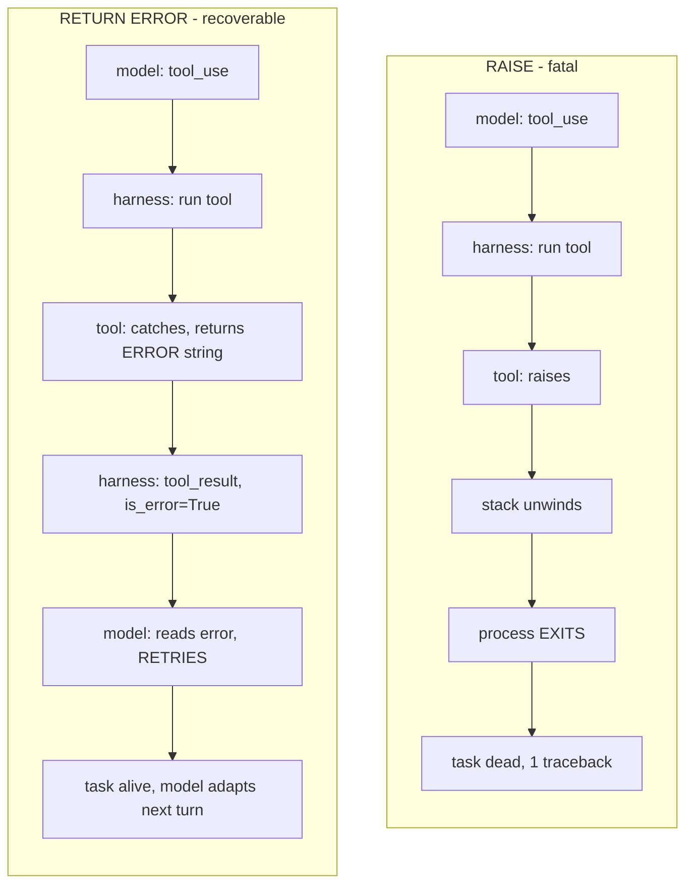

# Lecture 3: Errors-as-Observations & Robust Tool Design

> An agent is a `while` loop that calls tools your harness executes. The moment one of those tools raises an unhandled exception, the loop doesn't "handle an error" — it *dies*, mid-task, with a stack trace no model will ever read. The single discipline that separates a demo you run by hand from a system you leave running unattended is this: **a tool never raises to the loop; it returns its failure as a string the model can read as an observation.** A raise kills the run; a returned `ERROR: ...` gives the model a turn to retry with different args, switch tools, or give up cleanly. This lecture teaches that discipline from first principles and then hardens the spine's three tools — a calculator, a `web_fetch`, and a `read_file` — into things you'd be willing to expose to an autonomous model. After it you can wrap any tool so exceptions become observations, set `is_error` correctly on the `tool_result`, defend a calculator with an AST evaluator (never `eval`), validate a URL scheme, block path traversal against a sandbox root, and truncate every output so one giant page can't blow your token budget.

**Prerequisites:** The agent loop and native tool calling (Lecture 1); the four budgets + kill switch (Lecture 2); comfort with Python exceptions, `pathlib`, and JSON tool schemas · **Reading time:** ~24 min · **Part of:** AI Agents & Agentic Systems, Week 1

## The core idea (plain language)

Recall the shape of the loop: the model emits a `tool_use` request, *your code* runs the tool, and you feed the result back as a `tool_result` on the next turn. The model never runs your Python — it only ever sees the string you hand back. That is the whole leverage point of this lecture. Whatever the model learns about what happened when a tool ran, it learns *exclusively* from the observation string you return.

Now consider the two ways a tool can fail. In the naive version, `web_fetch("not-a-url")` raises `httpx.ConnectError`, the exception propagates up through `DISPATCH[tu.name](**tu.input)`, out of the `for` loop, out of `run()`, and your process prints a traceback and exits. The task is over. The model never got a turn. It never saw that anything went wrong. From the model's perspective, the universe simply stopped.

In the disciplined version, `web_fetch("not-a-url")` catches its own exception and *returns* the string `"ERROR: url must start with http:// or https://"`. Your harness wraps that in a `tool_result` block, sets `is_error: true`, and appends it to the conversation. On the next turn the model reads that observation — exactly as it would read a successful result — and does what LLMs are extraordinarily good at: it adapts. It prepends `https://`, or it asks the user for a valid URL, or it decides the fetch isn't essential and answers from what it already has. **The error became an observation, and an observation is something the model can act on.** A stack trace is something only you, staring at a terminal, can act on — and only after the run is already dead.

That is the entire thesis. Everything else in this lecture is the engineering that makes it robust: how to catch *everything* without swallowing bugs silently, how to signal error-ness to the model with `is_error`, and how to construct three specific tools so they fail safely, refuse dangerous inputs, and never return more text than your budget can afford.

## How it actually works (mechanism, from first principles)

### Why a raise is fatal and a return is recoverable

Trace the control flow precisely. Here is the dispatch site from the spine's `agent.py`:

```python
for tu in tool_uses:                       # native tool calls the model requested
    obs = DISPATCH[tu.name](**tu.input)     # <-- the tool runs HERE, in your loop
    results.append({"type":"tool_result","tool_use_id":tu.id,"content":obs,
                    "is_error": obs.startswith("ERROR:")})
messages.append({"role":"user","content":results})
```

If `DISPATCH[tu.name](**tu.input)` raises, Python unwinds the stack. The `results.append` never runs, so no `tool_result` is built. The `messages.append` never runs, so the conversation is never advanced. `run()` propagates the exception to its caller and returns nothing. There is no "next turn" for the model — the loop's body threw before it could complete an iteration. **An unhandled exception in a tool doesn't produce a bad answer; it produces no answer, plus a dead process.**

Contrast the recoverable path. The tool catches its own exception and returns a normal string. `obs` is now `"ERROR: fetch failed: ..."`. The `tool_result` is built, `is_error` is set to `True` (because the string starts with `ERROR:`), the conversation advances, and the loop proceeds to the next model call carrying that observation. The model sees the failure and gets a turn to respond to it.

The asymmetry is stark: a raise loses the entire task; a return costs one turn and some tokens. There is almost never a case where killing the whole run is the behavior you want from a single tool failure.



### What the model can do with an error that it cannot do with a stack trace

Give the model an observation like `ERROR: cannot evaluate '3 +* 4': invalid syntax` and it has genuine, actionable options — the same repertoire a competent engineer has when a function returns an error code:

1. **Retry with different arguments.** Malformed expression → re-emit `3 + 4`. Wrong file name → try `notes.txt` instead of `note.txt`. This is the single most common and most valuable recovery.
2. **Try a different tool.** `web_fetch` failed on a paywalled page → fall back to a `search` tool, or answer from prior context.
3. **Give up gracefully.** Some things genuinely can't be done ("the sandbox has no file called `secrets.env`"). The model can *tell the user that*, in plain language, instead of the user watching a Python traceback scroll past.

A stack trace supports none of these, because the model never receives it — the process is already gone. Even if you somehow piped the traceback back in, it's the wrong artifact: it's a description of *your program's* internal call stack, not a description of *what the model should do differently*. A good error observation is written for the model's next decision: short, specific, and actionable ("url must start with http:// or https://") rather than a 12-frame Python traceback.

### The wrapping discipline: every tool body swallows its own exceptions

The rule is mechanical and absolute: **every tool body is wrapped so that any exception becomes a returned `ERROR: ...` string.** The canonical shape:

```python
def some_tool(arg: str) -> str:
    try:
        # ... real work that might raise ...
        return str(result)
    except Exception as e:
        return f"ERROR: <what failed>: {e}"
```

Two design choices in that skeleton matter.

**Catch broadly, but at the boundary only.** Inside library code you catch specific exceptions; at the *tool boundary* you catch `Exception` because the model's job is to recover from *any* failure, not just the ones you anticipated. The tool boundary is the one place a bare-ish `except Exception` is correct — it's a bulkhead, not lazy error handling. (You still don't catch `BaseException`; `KeyboardInterrupt` and `SystemExit` — including your kill switch — must propagate.)

**Return the message, don't log-and-swallow.** A silent `except: return ""` is the worst of both worlds: the model sees an empty (or worse, plausible-looking) result and can't tell a failure from a legitimately-empty answer. The `ERROR:` prefix is load-bearing — it's both the human-readable signal *and* the machine flag your harness keys on.

### The two error representations, and why the prefix convention exists

There are two common wire formats for "this observation is an error," and you'll meet both:

- **String prefix (the spine's choice):** the tool returns a plain string, and error-ness is encoded as the literal prefix `ERROR:`. The harness detects it with `obs.startswith("ERROR:")`. Simple, no schema, works with any tool that returns text.
- **Structured dict:** the tool returns `{"error": "...", "is_error": true}` (or you build that object in the harness). More explicit, survives serialization boundaries, and lets you attach machine-readable fields (an error code, a retryable flag).

Either is fine for a Week-1 agent; the string-prefix convention is lighter and is what the spine uses. What is *not* optional is the **transport-level flag on the `tool_result`**:

```python
results.append({"type":"tool_result","tool_use_id":tu.id,"content":obs,
                "is_error": obs.startswith("ERROR:")})
```

`is_error: true` is a first-class field in Anthropic's tool-use API (OpenAI's function-calling has no exact equivalent; there you convey error-ness in the content string). Setting it does two useful things. It tells the provider's model, structurally and unambiguously, "the tool ran and failed" rather than "the tool ran and this text is the answer" — the model is trained to treat that block differently. And it gives *you* a clean signal in your trace: you can grep `trace.jsonl` for `is_error` and count how often each tool fails without parsing free text. Note the subtle contract: `is_error` is a property of *the result you send back*, not something the model sets — you derive it from what the tool returned.

## Worked example

Walk one concrete run end-to-end. The task: *"Fetch the homepage at example.com and tell me how many characters it is, then compute 2^16."* The model, reasonably, emits `web_fetch(url="example.com")` — no scheme.

**Turn 1 — model requests the fetch.** Harness dispatches `web_fetch("example.com")`. Inside:

```python
def web_fetch(url: str) -> str:
    if not url.startswith(("http://", "https://")):
        return "ERROR: url must start with http:// or https://"
    ...
```

The scheme check fails, so the tool *returns* `"ERROR: url must start with http:// or https://"`. Note what did **not** happen: no network call, no exception, no crash. The harness builds:

```python
{"type":"tool_result","tool_use_id":"tu_01","content":"ERROR: url must start with http:// or https://",
 "is_error": True}
```

**Turn 2 — model reads the error and adapts.** It sees an `is_error` result with a specific, actionable message. It re-emits `web_fetch(url="https://example.com")`. This time the scheme check passes, `httpx.get` succeeds, and the tool returns `r.text[:4000]` — the page body, truncated. Say the real page is 1,256 characters, so no truncation bites here; `obs` is the HTML, `is_error` is `False`.

**Turn 3 — model uses the calculator.** It emits `calculator(expression="2**16")`. The AST evaluator walks `BinOp(Constant(2), Pow, Constant(16))` and returns `"65536"`.

**Turn 4 — model answers.** `stop_reason != "tool_use"`, so the loop returns the final text: "The page is 1,256 characters; 2^16 = 65536."

Now the counterfactual, same task, with the *naive* `web_fetch` that just does `httpx.get(url)` with no scheme check and no try/except. Turn 1: `httpx.get("example.com")` raises `httpx.UnsupportedProtocol` (no scheme). The exception unwinds through the loop, `run()` throws, the process prints a traceback, exits. **Total observations the model got: zero. Total answer produced: none.** One malformed argument — the kind a model produces constantly — killed the whole task. The difference between the two runs is four lines of defensive code and one `is_error` flag.

Notice the cost of recovery was *one extra turn* (~a few hundred tokens). That is the entire price of turning a fatal crash into a self-correcting run.

## How it shows up in production

- **Unattended runs are the whole point, and crashes defeat it.** A demo you drive by hand can survive raising tools — you just restart it. An agent triggered by a queue message at 3am cannot. The tool that raises there doesn't just fail one task; it can crash a worker, drop the job, and page someone. Errors-as-observations is what lets the agent absorb a transient failure and keep going without a human in the loop.

- **Untruncated output silently detonates your token budget.** `r.text` on a real web page can be hundreds of KB — a single fetch of a large HTML page or a JSON API can be 50k–200k+ tokens. Feed that back untruncated and you: (a) blow past the model's context window (a hard 400 error), or (b) if it fits, pay for tens of thousands of tokens *every subsequent turn*, because the whole transcript is re-sent each step (Lecture 1). One un-truncated `read_file` on a big log can quietly 10x the cost of a run. `r.text[:4000]` and `p.read_text()[:4000]` aren't cosmetic — they're budget defense. (Approximate rule of thumb: ~4 chars/token for English, so a 4,000-char cap ≈ ~1,000 tokens per observation. Tune the cap to your budget; the *discipline of having a cap* is the non-negotiable part.)

- **`eval` on model output is a remote-code-execution hole.** If your calculator were `return str(eval(expression))`, a model (or a prompt-injected instruction inside a fetched page) could emit `__import__('os').system('rm -rf ~')` as the "expression," and you would run it. This is not hypothetical once tool output can carry attacker-controlled text. The AST evaluator is the fix: it *only* interprets the arithmetic node types you whitelist and raises on anything else, so `expression` is data, never code.

- **Path traversal is the file-tool version of the same hole.** A `read_file` that does `open(name)` will happily read `../../../../etc/passwd` or `../../.env` when the model (or an injection) asks. Resolving against a sandbox root and checking `is_relative_to` before reading is what keeps a file tool inside its box. In production this is the line between "the agent can read the notes folder" and "the agent can read your SSH keys."

- **Good error messages are a debugging superpower — and a trace field.** Because errors are observations, they land in `trace.jsonl` alongside everything else. When a run goes sideways you can read the exact `ERROR:` string the model saw and *why it did what it did next*. `count(is_error==true) by tool` over your traces tells you which tool is flaky and whether the model is recovering or thrashing (retrying the same failing call repeatedly — a signal to improve the error message or the tool).

- **Vague errors cause retry loops that burn the step budget.** `ERROR: bad input` gives the model nothing to correct, so it retries blindly and oscillates until the max-steps budget trips. `ERROR: url must start with http:// or https://` tells it exactly what to fix. The specificity of the error message directly affects how many turns (and dollars) recovery costs. This is why errors-as-observations and the four budgets from Lecture 2 are siblings: budgets are the backstop for when recovery *doesn't* converge.

## Common misconceptions & failure modes

- **"I'll just wrap the whole loop in one try/except."** That catches the crash but destroys recoverability. A single outer `try` around `run()` means the *first* tool failure still ends the run — you've turned a traceback into a clean exit, but the model never got its recovery turn. The wrapping must be *per-tool*, inside each tool body, so the loop keeps going.

- **"Catching `Exception` hides real bugs."** At the tool boundary it doesn't hide them — it *reports* them, as the `ERROR:` string, which lands in your trace. You still see every failure; you just see it as data instead of a corpse. The anti-pattern is `except: pass` (swallow silently); `except Exception as e: return f"ERROR: {e}"` surfaces the failure to both the model and your logs.

- **"Set `is_error` and you're done."** `is_error` is the signal, not the safety. A tool can return a non-error string that is still catastrophic — e.g., 200k characters of untruncated page, or the contents of `/etc/passwd`. `is_error` handles *failure*; truncation handles *size*; scheme/path validation handles *safety*. Three separate disciplines, all required.

- **"The AST evaluator is overkill; `eval` with a restricted namespace is fine."** Restricted-namespace `eval` (`eval(expr, {"__builtins__": {}})`) is a well-known escape target — attackers have repeatedly broken out of it via attribute chains on literals. The AST-walk approach is safe *by construction* because it only executes node types you explicitly handle (`Constant`, `BinOp`, `UnaryOp` with a whitelisted op set) and raises `ValueError("unsupported")` on everything else. Don't try to sandbox `eval`; don't call it at all.

- **"`if name.startswith('..')` blocks path traversal."** No — string-prefix checks are trivially bypassed (`foo/../../etc/passwd`, absolute paths, symlinks, `%2e%2e`). The correct check is *resolve then compare*: `(SANDBOX / name).resolve()` collapses the `..` segments to a real absolute path, and `p.is_relative_to(SANDBOX)` asks whether that resolved path is genuinely inside the sandbox. Resolve-then-verify, never pattern-match the raw input.

- **"Truncating output loses information the model needs."** Sometimes, yes — and the fix is a *better* truncation, not none. Cap and clearly mark it (`...[truncated, showing first 4000 chars]`), or return a summary, or paginate. But an uncapped tool is strictly worse: it doesn't "lose" information, it loses your *entire budget and possibly the whole run*. Bounded-and-marked beats unbounded every time.

- **"The model will see `is_error` and always recover."** It usually will, but not infinitely. If the only tool that can make progress is permanently broken, the model may retry until a budget trips — which is *correct* behavior: the budget is the backstop. Errors-as-observations makes recovery *possible*; budgets make non-recovery *bounded*. You need both.

## Rules of thumb / cheat sheet

- **No tool ever raises to the loop.** Wrap every tool body in `try/except Exception` and `return f"ERROR: ..."`. This is the one rule the whole lecture reduces to.
- **Let `KeyboardInterrupt`/`SystemExit` through.** Catch `Exception`, not `BaseException` — your kill switch and Ctrl-C must still work.
- **Set `is_error` on the `tool_result` from what the tool returned** (`obs.startswith("ERROR:")` or a structured `{"error":...}`). It's a property of the result you send, not something the model sets.
- **Write error messages *for the model's next move*:** specific, short, actionable ("url must start with http:// or https://"), not a Python traceback.
- **Never `eval`.** Use an AST evaluator that whitelists node types (`Constant`, `BinOp`, `UnaryOp`) and a fixed op map; raise on anything unsupported.
- **Validate the URL scheme** before fetching (`startswith(("http://","https://"))`); reject `file://`, `ftp://`, and schemeless input.
- **Block path traversal by resolve-then-verify:** `(SANDBOX / name).resolve()` then `p.is_relative_to(SANDBOX)`. Never string-match the raw name.
- **Cap every text output** (`[:4000]` is a fine default) — protects both the context window and the per-turn token cost. Mark the truncation if it matters.
- **A vague error is a slow error:** it causes blind retries that burn the step/dollar budget. Specificity pays for itself in fewer recovery turns.
- **Errors-as-observations and budgets are a pair:** the first makes recovery possible, the second bounds the case where recovery fails.

### The three tools, hardened (reference)

```python
import ast, operator, httpx, pathlib

SANDBOX = pathlib.Path("sandbox").resolve()   # the one directory read_file may touch

def calculator(expression: str) -> str:
    ops = {ast.Add: operator.add, ast.Sub: operator.sub, ast.Mult: operator.mul,
           ast.Div: operator.truediv, ast.Pow: operator.pow, ast.USub: operator.neg}
    def ev(n):                                  # walk the AST, execute ONLY whitelisted nodes
        if isinstance(n, ast.Constant): return n.value
        if isinstance(n, ast.BinOp):    return ops[type(n.op)](ev(n.left), ev(n.right))
        if isinstance(n, ast.UnaryOp):  return ops[type(n.op)](ev(n.operand))
        raise ValueError("unsupported")         # anything else (calls, names, attrs) -> refused
    try:
        return str(ev(ast.parse(expression, mode="eval").body))
    except Exception as e:
        return f"ERROR: cannot evaluate {expression!r}: {e}"

def web_fetch(url: str) -> str:
    if not url.startswith(("http://", "https://")):   # scheme validation
        return "ERROR: url must start with http:// or https://"
    try:
        r = httpx.get(url, timeout=10, follow_redirects=True)
        return r.text[:4000]                          # TRUNCATE -> budget defense
    except Exception as e:
        return f"ERROR: fetch failed: {e}"

def read_file(name: str) -> str:
    try:
        p = (SANDBOX / name).resolve()                # resolve collapses ../ segments
        if not p.is_relative_to(SANDBOX):             # verify still inside the sandbox
            return "ERROR: path escapes sandbox"
        return p.read_text()[:4000]                   # TRUNCATE here too
    except Exception as e:
        return f"ERROR: {e}"
```

Read each tool as three concentric defenses: **validate** the input (scheme, path containment, node type), **bound** the output (`[:4000]`), and **wrap** the whole body so any surprise becomes an `ERROR:` observation instead of a crash.

## Connect to the lab

This lecture is the theory behind Week 1's `tools.py` and the `is_error` wiring in `agent.py`. Build all three tools exactly as above — each returns a string, each swallows its own exceptions into an `ERROR:` string — and in the loop set `"is_error": obs.startswith("ERROR:")` on every `tool_result`. Lab **Exercise 2** is the proof: point `web_fetch` at a garbage URL and confirm the model *recovers* (reads the `ERROR:` observation and adapts) instead of the process crashing. The Definition of Done's "a deliberately-broken tool call produces an `is_error: true` tool_result and the agent still terminates cleanly (no traceback)" is this lecture, made executable.

## Going deeper (optional)

- **Anthropic — Tool use overview (docs).** The authoritative reference for `tool_use` / `tool_result` blocks and the `is_error` field. Root: `docs.anthropic.com`. Search: `Anthropic tool use is_error tool_result`.
- **Anthropic — "Building Effective Agents."** Frames the harness-owns-execution / model-owns-decisions split that makes errors-as-observations necessary. Search: `Anthropic Building Effective Agents`.
- **OpenAI — Function calling guide.** The other vendor's take on returning tool results (no `is_error` field — error-ness goes in the content). Root: `platform.openai.com`. Search: `OpenAI function calling return tool result`.
- **Python docs — `ast` module.** The `ast.parse(..., mode="eval")` + node-walk pattern behind the safe calculator; read `ast.NodeVisitor` and the expression node types. Root: `docs.python.org`. Search: `python ast literal expression evaluator safe`.
- **Python docs — `pathlib.PurePath.is_relative_to` and `Path.resolve`.** The resolve-then-verify pattern for sandboxing. Root: `docs.python.org`. Search: `pathlib is_relative_to resolve path traversal`.
- **OWASP — path traversal and "eval injection."** Background on *why* these are classic vulnerability classes, not agent-specific curiosities. Search: `OWASP path traversal`, `OWASP eval injection`.

## Check yourself

1. Precisely what happens to the agent loop when a tool raises an unhandled exception, and why is that different from the tool returning `"ERROR: ..."`?
2. Name the three concrete things a model can do with a returned error observation that it cannot do with a stack trace.
3. What is `is_error` a property of — the tool, the model's request, or the result you send back? How do you compute it in the spine's design, and what does setting it buy you?
4. Why is an AST evaluator strictly safer than `eval` with a restricted namespace for the calculator? What does the AST version do when it meets a node type it doesn't handle?
5. Why is `if name.startswith("..")` an inadequate path-traversal defense, and what is the correct resolve-then-verify pattern?
6. Give two independent production consequences of *not* truncating a tool's text output, and state the rule of thumb for choosing a cap.

### Answer key

1. On a raise, Python unwinds the stack: the `tool_result` is never built, the conversation is never advanced, `run()` propagates the exception, and the process dies with a traceback — the model gets **no turn and no observation**, and the whole task is lost. On a returned `"ERROR: ..."`, the tool completed normally; the harness builds a `tool_result` (with `is_error: true`), appends it, and the loop proceeds to the next model call carrying the error as a readable observation. A raise loses the task; a return costs one turn.

2. (a) **Retry with different arguments** (fix a malformed expression, correct a filename, add a URL scheme); (b) **try a different tool** (fall back from `web_fetch` to a search tool, or answer from context); (c) **give up gracefully** — tell the user in plain language that the thing can't be done. A stack trace supports none of these because the model never receives it and, even if it did, it describes your call stack, not the model's next move.

3. `is_error` is a property of **the `tool_result` you send back to the model** — not the tool itself and not the model's request. In the spine you compute it as `obs.startswith("ERROR:")` (the string-prefix convention). Setting it tells the provider's model, structurally, that the tool ran and *failed* (rather than "this text is the answer"), and it gives you a clean, greppable flag in `trace.jsonl` for counting failures per tool.

4. The AST evaluator is safe **by construction**: it parses the expression to a tree and executes only the node types you explicitly whitelist (`Constant`, `BinOp`, `UnaryOp` with a fixed op map), so the input is treated as *data*, never code. Restricted-namespace `eval` is a known escape target — attackers break out via attribute chains on literals — so you should not call `eval` at all. When the AST walker meets any unhandled node type (a function call, a name, an attribute access), it raises `ValueError("unsupported")`, which the tool's try/except turns into an `ERROR:` observation.

5. `startswith("..")` is a string check on the *raw* input and is trivially bypassed: `foo/../../etc/passwd`, absolute paths, symlinks, or encoded dots all evade it. The correct pattern is **resolve then verify**: `p = (SANDBOX / name).resolve()` collapses all `..` segments into a real absolute path, then `p.is_relative_to(SANDBOX)` checks whether that resolved path is genuinely inside the sandbox root. You validate the *resolved* path, never the raw string.

6. (a) **Context-window overflow** — a large page/file can exceed the model's window and produce a hard 400 error, killing the run. (b) **Runaway per-turn cost** — because the whole transcript is re-sent every step, one huge untruncated observation is paid for on *every* subsequent turn, potentially 10x-ing the run's cost. Rule of thumb: cap every text output (e.g. `[:4000]` chars ≈ ~1,000 tokens at ~4 chars/token) and tune the cap to your budget — the non-negotiable part is *having* a cap, and marking the truncation when the omitted content might matter.
