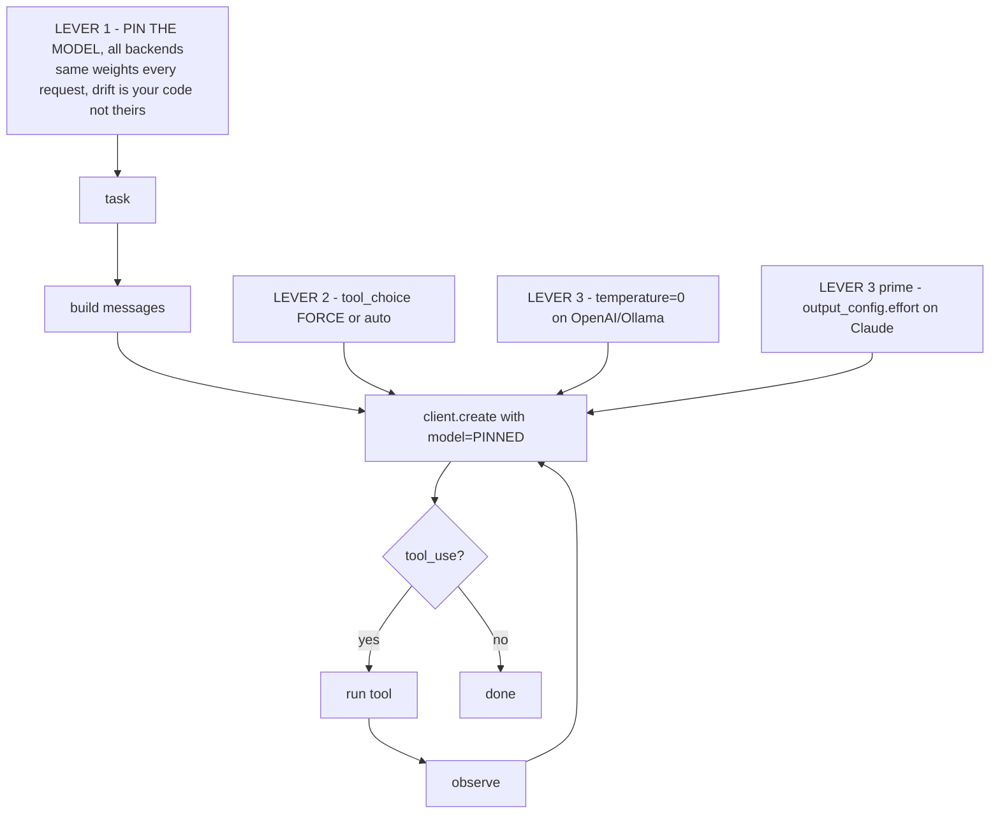

# Lecture 5: Determinism Levers & Structured Tracing

> Your agent did something dumb last night — called `web_fetch` on a garbage URL four times, burned $0.40, and returned nonsense. A teammate asks "why did it do that?" and you have… nothing. No record of what the model saw, what it decided, or what each tool returned. This lecture is about the two disciplines that turn "the agent is flaky" into "here is exactly which step went wrong and why." First, **determinism levers**: the small set of knobs that make a run *reproducible* enough to debug — pin the exact model, force `tool_choice` when a step must call a specific tool, and set `temperature=0` where the backend still allows it. Second, **structured tracing**: writing one JSON line per step to `trace.jsonl` so every run leaves an audit trail you can read back. After this lecture you will be able to make an agent run reproducible on any of the three backends you'll actually use (current Claude, OpenAI, Ollama), know which lever exists where and what each buys you, and design a per-step trace record you can grep, diff, and cost-account against.

**Prerequisites:** Lecture 1 (the agent loop: perceive → plan → act → observe), Lecture 2 (ReAct with native tool calling), Phase 0 Lecture 12 (sampling parameters, why `temperature=0` is not fully deterministic) · **Reading time:** ~24 min · **Part of:** AI Agents & Agentic Systems (Expanded Deep Track) Week 1

---

## The core idea (plain language)

An agent is a `while` loop around a model that calls tools. That loop has *two* sources of variability, and both bite you when you try to debug:

1. **The model is stochastic.** Same prompt, different token → different tool call → different trajectory. Run the agent twice on the same task and you may get two different sequences of steps.
2. **You have no memory of what happened.** The loop runs, prints a final answer, and evaporates. When it misbehaves you can't reconstruct the decision that went wrong because nothing recorded it.

Determinism levers attack the first problem: they *narrow* the variability so that "same input → same behavior" holds closely enough that a bug reproduces when you re-run it. A bug you can't reproduce is a bug you can't fix. Tracing attacks the second: it *records* the variability so that even when a run is not reproducible, you can still answer "why did it do that?" from the log.

These two are tightly coupled and you need both. Determinism without tracing means you can re-run but still can't see inside. Tracing without determinism means you can see inside a run but can't make the bug happen again to test your fix. Together they turn an agent from a slot machine into something you can put a breakpoint on.

The blunt 2026 reality you must internalize up front: **the classic determinism knob, `temperature=0`, no longer exists on the frontier Claude models.** Opus 4.8, Opus 4.7, and Sonnet 5 reject `temperature`, `top_p`, and `top_k` with a 400 error. On those backends, your determinism comes from *pinning the exact model version* plus `output_config.effort` and adaptive thinking — not from sampling params. On Ollama and OpenAI, `temperature=0` still works. Which lever exists on which backend is the load-bearing fact of this lecture.

---

## How it actually works (mechanism, from first principles)

### Lever 1: Pin the exact model version — never a floating alias

Providers ship model *aliases* that float. `claude-3-5-sonnet-latest`, `gpt-4o`, `llama3.1` (without a tag) — these point at "whatever the current build is." That is convenient and it is poison for reproducibility. The provider silently rolls the alias to a new build; your agent's behavior shifts overnight; your carefully-tuned prompts and your eval gates drift; and you have no idea because the string in your code didn't change.

Pinning means writing the *exact, dated or versioned identifier* your provider gives you, so the bytes going over the wire select one immutable build.

```python
MODEL = "claude-opus-4-8"          # pinned — one immutable build
# NOT: MODEL = "claude-3-5-sonnet-latest"   # floats; behavior drifts under you
```

What pinning buys you, in one sentence: **the same model weights answer every request, so any behavior change is attributable to your code and not to a silent provider update.** That is the single most important determinism lever, and it's the one that works identically on *every* backend — Claude, OpenAI, Ollama all let you pin. (Note the nuance: even a pinned model is not byte-for-byte deterministic — GPU float non-associativity, server-side batching, and MoE routing still cause drift, as you saw in Phase 0. Pinning removes the *version* variable; it does not remove hardware variance.)

A concrete cost of not pinning: your Week 2 promptfoo eval gate passes at 92% on Monday. Wednesday it's 78% and the diff shows no code change. You've just spent half a day chasing a regression that a provider shipped, because your alias floated. Pinning turns that into a deliberate, reviewable "we upgraded the model" commit.

### Lever 2: Force `tool_choice` when a step must call a specific tool

By default the model *decides* whether to call a tool and which one. That's `tool_choice: "auto"` (the default). It's what you want most of the time — the whole point of an agent is that the model drives. But it introduces variability exactly where you sometimes can't afford it: a step where you *know* a specific tool must run.

`tool_choice` lets you override the model's discretion:

| `tool_choice` value | Behavior |
|---|---|
| `{"type": "auto"}` | Model decides: call a tool, or answer directly (default) |
| `{"type": "any"}` | Model *must* call some tool (but picks which) |
| `{"type": "tool", "name": "calculator"}` | Model *must* call exactly `calculator` this step |

Forcing `{"type": "tool", "name": "calculator"}` removes two decisions from the model — *whether* to use a tool and *which* — leaving only the arguments to fill in. That collapses a whole branch of the trajectory tree.

```python
resp = client.messages.create(
    model=MODEL, max_tokens=1024, tools=TOOLS,
    tool_choice={"type": "tool", "name": "calculator"},  # this step MUST calculate
    messages=messages,
)
```

What forcing `tool_choice` buys you, in one sentence: **it removes the "did the model decide to call the right tool?" variable, so a step's behavior reduces to just its arguments — far fewer ways for the run to diverge.** Use it for the deterministic spine of a workflow (the step that always fetches, the step that always validates) and leave `auto` for the genuinely open-ended reasoning. This lever exists on all three backends, though the wire format differs (Anthropic's `tool_choice` object vs OpenAI's `tool_choice`); it's a first-class part of native tool calling everywhere.

One gotcha worth flagging: forced `tool_choice` is incompatible with some other features (e.g. it can't be combined with certain structured-output or parallel-tool-call modes on some providers). Check the model's parameter list — this is exactly the kind of per-backend quirk your unified `llm.py` adapter should hide.

### Lever 3: `temperature=0` — where it still exists

`temperature=0` makes sampling greedy: the model always takes the argmax token instead of rolling the dice. Greedy decoding is *low-variance* (not zero-variance — recall the GPU/batching/MoE caveats from Phase 0), which is what you want for a reproducible debug run.

Here's the 2026 fracture, stated plainly per backend:

| Backend | `temperature=0`? | How you get determinism |
|---|---|---|
| **Current Claude** (Opus 4.8/4.7, Sonnet 5) | ❌ **400 error** — `temperature`/`top_p`/`top_k` removed | Pin the model + `output_config: {"effort": "..."}` + adaptive thinking |
| **OpenAI** (GPT-4o etc.) | ✅ honored | Pin the model + `temperature=0` + `seed` where supported |
| **Ollama** (llama3.1, qwen2.5) | ✅ honored via `options={"temperature": 0}` | Pin the model tag + `temperature=0` |

This is not a subtlety you can skip. If you write `temperature=0` in a request to `claude-opus-4-8`, you get:

```
anthropic.BadRequestError: temperature: Extra inputs are not permitted
```

The current Claude models removed the sampling knobs entirely. Determinism there comes from a *different* place: pinning the model plus `output_config.effort` (which controls how much the model thinks and spends) and adaptive thinking. There is no `temperature` dial to zero out. What `output_config.effort` buys you, in one sentence: **it bounds and stabilizes how much reasoning the model does per step, which is the closest analog to "turn the variance down" on a model with no sampling params.**

On Ollama the lever is alive and well — and it's your free local path this week:

```python
# Ollama: temperature=0 honored
response = ollama.chat(
    model="llama3.1",
    messages=messages,
    tools=TOOLS,
    options={"temperature": 0},   # greedy decoding
)
```

On OpenAI, `temperature=0` plus a `seed` gives you best-effort reproducibility (with the same residual hardware nondeterminism).

The mental model: **`temperature=0` is one lever, not the definition of determinism.** On backends that have it, use it. On backends that don't, pinning + effort control does the equivalent job. The engineer's discipline is to know which world you're in and reach for the right lever — not to blindly copy `temperature=0` into every request and eat a 400 in production.

### Putting the levers together

A single ASCII picture of where each lever acts in the loop:



Each lever narrows one source of variability. Stacked, they get you from "runs differently every time" to "runs the same enough that a bug reproduces." That's the bar — not perfection, *reproducibility*.

---

## Structured tracing: the seed of observability

Determinism lets you re-run. Tracing lets you *see*. Without a per-step log you literally cannot answer "why did it do that?" — the loop ran, mutated some in-memory `messages` list, printed a final string, and threw everything else away.

The fix is a discipline, not a library: **write one structured record per loop iteration, as one JSON line, to `trace.jsonl`.** JSON Lines (one JSON object per line, newline-delimited) is the right format because it's append-only (crash-safe — a killed run still leaves a valid partial trace), streamable (you can `tail -f` it live), and trivially parsed line-by-line without loading the whole file.

### The per-step record

Here is the minimum viable record — every field earns its place:

```python
import json, time

def log_step(step, thought, tool, args, obs, usage, dollars):
    rec = {
        "ts": time.time(),                        # when — order & latency
        "step": step,                             # which iteration (1-indexed)
        "thought": (thought or "")[:200],         # model's text/reasoning, truncated
        "tool": tool,                             # tool name, or None if finishing
        "args": args,                             # the exact arguments passed
        "observation": (obs or "")[:200],         # tool result, TRUNCATED
        "tok_in": usage.input_tokens,             # input tokens this step
        "tok_out": usage.output_tokens,           # output tokens this step
        "cum_dollars": round(dollars, 5),         # cumulative $ so far
    }
    with open("trace.jsonl", "a") as f:
        f.write(json.dumps(rec) + "\n")
    print(f"[{step}] tool={tool} ${rec['cum_dollars']}")   # live console echo
```

Field-by-field, why each matters in production:

- **`step`** — the iteration index. Lets you say "it broke on step 3" and jump straight there. Also the primary key for correlating with the model's `messages` array.
- **`thought` / text** — what the model *said* (its reasoning text before the tool call). This is the "why" — it's how you distinguish "the model wanted the wrong thing" from "the model wanted the right thing but called the tool wrong."
- **`tool` + `args`** — the exact tool name and arguments. `args` is where most bugs live: the model fetched `htp://…` (typo), passed `expression="17*23*"` (malformed), or called `read_file(name="../../etc/passwd")` (traversal attempt). Without the exact args you're guessing.
- **`observation`, truncated** — what the tool returned, capped (200 chars is a sane default). **Truncation is not optional.** A `web_fetch` can return 4,000 characters; a database tool can return megabytes. Logging the full observation blows up your trace file, floods your console, and — because observations get fed back into the model's context — is where your token bill hides. Truncate in the trace; the model still sees the full (or its own capped) version.
- **`tok_in` / `tok_out`** — per-step token counts, read straight off `resp.usage`. This is your latency and cost breakdown per step.
- **`cum_dollars`** — running cost. Monotonically increasing. This is the field finance cares about and the one that proves your dollar budget (Lecture 1) is being tracked correctly.

### Computing `cum_dollars` — the arithmetic

Cost is just token counts times per-token prices, accumulated. For `claude-opus-4-8` at $5/1M input, $25/1M output:

```python
PRICE_IN, PRICE_OUT = 5/1e6, 25/1e6      # dollars per token
tok_in  += resp.usage.input_tokens
tok_out += resp.usage.output_tokens
dollars = tok_in * PRICE_IN + tok_out * PRICE_OUT
```

A worked number: a step that reads 3,000 input tokens and writes 200 output tokens costs `3000 × 5e-6 + 200 × 25e-6 = 0.015 + 0.005 = $0.020`. Note the asymmetry — output tokens are 5× the price of input here, so a chatty step that emits a long thought costs disproportionately. Watching `cum_dollars` climb across steps tells you *which* step is expensive, not just that the run was.

A subtle trap: in a naive ReAct loop, the *entire growing transcript* is re-sent every step, so `input_tokens` grows roughly linearly with step count and total cost grows roughly **quadratically** with the number of steps. Your trace makes this visible — you'll see `tok_in` climbing step over step — which is the empirical motivation for the context-management patterns in later weeks.

### Reading the trace back to debug

Once you have `trace.jsonl`, debugging is grep and eyeball. The garbage-URL incident from the hook:

```bash
$ cat trace.jsonl | python -c "import sys,json; [print(json.loads(l)['step'], json.loads(l)['tool'], json.loads(l)['args']) for l in sys.stdin]"
1 web_fetch {'url': 'htp://example.com/data'}
2 web_fetch {'url': 'htp://example.com/data'}
3 web_fetch {'url': 'htp://example.com/data'}
4 web_fetch {'url': 'htp://example.com/data'}
```

The `args` field shows it instantly: `htp://` — the model kept retrying the *same typo'd URL* four times. Now check the `observation` field for step 1 and you'll see whether the tool returned a clear `ERROR: url must start with http://` (in which case the model ignored a good error message — a prompting problem) or a vague failure (in which case your tool's error-as-observation was too weak — a tool problem, from Lecture 2). Either way, the trace turned "the agent is flaky" into a specific, fixable diagnosis in thirty seconds.

That's the whole payoff: **the trace is the difference between a support ticket and a fix.**

### This is the seed of real observability

What you're building by hand here — a per-step record with tokens, cost, tool, args, and observation — is the *primordial form* of the observability stack you'll formalize later. In **Week 3** you'll persist this as durable checkpoints (a crash-safe state store you can resume from, with time-travel across steps). In **Week 6** — and in Phase 7 (Evaluation & Observability) — you'll graduate `trace.jsonl` to a real tracing system (OpenTelemetry spans, LangSmith / Langfuse / Phoenix), where each step becomes a span in a distributed trace with parent-child structure, and trajectory evaluation grades the *whole sequence* of steps, not just the final answer. The JSON line you write today is one flattened span. Building it by hand now means that when you adopt the heavy tooling later, you'll know exactly what it's doing under the hood and why every field is there.

---

## Worked example

You run the agent on: *"Read notes.txt from the sandbox, then compute 17×23 and tell me both results."* Backend is pinned `claude-opus-4-8`. Because it's a current Claude model, you do **not** set `temperature` (that would 400); you rely on model pinning + default effort. `tool_choice` stays `auto` because the model must decide the order itself.

The run produces this `trace.jsonl` (truncated for display):

```jsonl
{"ts":1720900001.2,"step":1,"thought":"I'll read the file first.","tool":"read_file","args":{"name":"notes.txt"},"observation":"Q3 target: 391 units.","tok_in":842,"tok_out":48,"cum_dollars":0.00541}
{"ts":1720900002.9,"step":2,"thought":"Now the arithmetic.","tool":"calculator","args":{"expression":"17*23"},"observation":"391","tok_in":915,"tok_out":41,"cum_dollars":0.01169}
{"ts":1720900004.1,"step":3,"thought":"notes.txt says 391 units; 17*23=391. Both results: 391.","tool":null,"args":null,"observation":null,"tok_in":978,"tok_out":57,"cum_dollars":0.01749}
```

Read it top to bottom:

- **Step 1** — the model chose `read_file` with clean args; observation came back with the file contents. `cum_dollars` = $0.0054.
- **Step 2** — `calculator("17*23")` → `391`. Notice `tok_in` climbed from 842 → 915: the step-1 observation is now in the context (re-sent). Cost rose to $0.0117.
- **Step 3** — `tool` is `null` and `observation` is `null`: this is the *finishing* step. `stop_reason` was not `tool_use`, so the model produced a final answer instead of a tool call. `cum_dollars` = $0.0175 total for the run.

Now suppose it had gone wrong — the model computed `17+23=40`. You wouldn't guess; you'd open the trace, see step 2's `args: {"expression": "17+23"}`, and know immediately the model mis-transcribed the operator. That's a prompt-clarity fix, and the trace pointed straight at it. The three-line log did all the diagnostic work.

Cost sanity check on the arithmetic: total across the run is roughly `(842+915+978) input + (48+41+57) output` tokens = 2,735 in + 146 out = `2735×5e-6 + 146×25e-6 = 0.01368 + 0.00365 = $0.0173` ✓ — matches the final `cum_dollars` (small rounding aside). Your trace's cumulative figure is auditable against the raw token counts.

---

## How it shows up in production

**"It worked yesterday" with no code change** is almost always a floated alias. The first question in that incident is "are we pinned?" If the model string is `…-latest`, you found your bug before reading a single line of application code. Pinning converts a mysterious regression into a deliberate, dated upgrade you can bisect.

**The `temperature=0` 400 on Claude** is a real, common shipping incident in 2026. A team copies a determinism recipe written for an older model (or for OpenAI) into a request to `claude-opus-4-8`, and every call fails with a 400. The fix is not a support ticket — it's knowing that current Claude models removed sampling params and that determinism there comes from pinning + `output_config.effort`. Your unified `llm.py` adapter (Week 2) should encode this per-backend: strip `temperature` for Claude, pass it through for Ollama/OpenAI.

**Cost attribution lives in the trace.** When finance asks "why did the agent bill $40 last night," `cum_dollars` per run and `tok_in`/`tok_out` per step answer it precisely: run #17 looped 8 times on a failing tool, each step re-sending a growing context. Without the trace you have an aggregate bill and no line items. With it you have a per-step breakdown and can point at the exact step to fix.

**Trajectory debugging beats final-answer debugging.** A wrong final answer tells you *that* the agent failed; the trace tells you *where*. Was the tool call malformed (bad `args`)? Did the tool return an error the model ignored (`observation`)? Did the model reason correctly but stop early (`thought` + `stop_reason`)? These are three completely different fixes, and only the per-step record distinguishes them.

**Truncation discipline is a real bug source.** Teams that log full observations produce multi-gigabyte trace files, OOM their log shippers, and — worse — sometimes confuse the *trace* observation (truncated) with the *context* observation (what the model actually saw). Keep them separate: truncate hard in the trace, feed the tool's own capped output to the model.

**Reproducible ≠ deterministic, and your tests must know it.** Even fully pinned + `temperature=0`, GPU/batching/MoE nondeterminism means byte-exact assertions on model output will flake. Design evals to assert on trace *structure* (did step 2 call `calculator`? did `cum_dollars` stay under budget?) and on substrings with tolerance — never on an exact output string. This is the same "4/5 inputs" gate discipline from Phase 0, applied to trajectories.

---

## Common misconceptions & failure modes

- **"Pinning the model makes runs byte-for-byte identical."** No. Pinning removes the *version* variable. GPU float non-associativity, server-side batching, and MoE routing still cause drift on identical inputs. Pinning gets you *reproducible enough to debug*, not deterministic.
- **"`temperature=0` is the universal determinism setting."** False in 2026. It 400s on current Claude models (Opus 4.8/4.7, Sonnet 5), which removed sampling params entirely. It still works on Ollama (`options={"temperature":0}`) and OpenAI. Know your backend.
- **"`output_config.effort` is the same as `temperature`."** No. `temperature` reshapes the sampling distribution; `effort` controls how much the model thinks/spends. They're different mechanisms. On Claude, `effort` is the closest analog to "turn variance down," but it is not a sampling knob.
- **"`tool_choice: any` and `tool_choice: {tool, name}` are the same."** `any` forces *some* tool but lets the model pick which; `{type: tool, name}` forces *exactly that* tool. Only the second removes the "which tool" decision.
- **"Log the full observation so I don't lose anything."** This blows up trace size, floods logs, and hides your token bill. Truncate the observation in the trace (the model still gets its own capped version). What you'd "lose" is rarely worth the gigabytes.
- **"A floating alias is fine, providers keep it backward compatible."** Aliases roll to new builds silently. Your prompts, eval gates, and cost profile can all shift with no code change and no warning. Pin, and upgrade deliberately.
- **"Tracing is a library I'll add later."** The per-step JSON line is a *discipline*, not a dependency. Ten lines of code today gives you the audit trail; the heavy tooling in Weeks 3/6 formalizes what you already have. Skipping it means debugging blind now *and* not understanding the tooling later.
- **"My test asserts the exact final string, and it's fine."** It will flake on hardware nondeterminism. Assert on trace structure and substrings-with-tolerance instead.

---

## Rules of thumb / cheat sheet

- **Always pin the exact model.** `claude-opus-4-8`, not `…-latest`. Works on every backend; it's the one universal determinism lever.
- **Determinism lever by backend:**
  - **Current Claude (Opus 4.8/4.7, Sonnet 5):** pin + `output_config: {"effort": "..."}` + adaptive thinking. **No `temperature`** (400 if you send it).
  - **OpenAI:** pin + `temperature=0` (+ `seed` where available).
  - **Ollama:** pin the tag + `options={"temperature": 0}`.
- **Force `tool_choice={"type":"tool","name":X}`** on steps that *must* call a specific tool; leave `auto` for open-ended reasoning. Removes the whether/which decisions.
- **One JSON line per step to `trace.jsonl`.** Fields: `ts, step, thought, tool, args, observation(truncated), tok_in, tok_out, cum_dollars`.
- **Truncate observations in the trace** (200 chars is a sane default). The model gets the full/capped version; the trace does not.
- **Compute `cum_dollars` = Σ(tok_in×price_in + tok_out×price_out).** Output is usually several× the input price — watch chatty steps.
- **Naive ReAct cost grows ~quadratically in steps** (full transcript re-sent each turn). Your trace's climbing `tok_in` is the proof.
- **Reproducible ≠ deterministic.** Assert on trace structure and substrings-with-tolerance in tests, never byte-exact model output.
- **Store determinism config as per-backend presets** in your `llm.py` adapter, so nobody ships `temperature=0` into a Claude request.

---

## Connect to the lab

This lecture is the theory behind the Week 1 lab's `trace.py` (the `log_step` function → `trace.jsonl`) and Exercise 3 (force `tool_choice={"type":"tool","name":"calculator"}` and observe forced-tool determinism). When you build the loop, wire `log_step` into *every* iteration — both the tool-calling branch and the finishing branch — and confirm your `trace.jsonl` has exactly one record per step with monotonically increasing `cum_dollars` (that's a Definition-of-Done item). Run the same task twice: on the Ollama path add `options={"temperature":0}` and watch the traces line up closely; on the Claude path *omit* `temperature` (proving you know it would 400) and rely on the pinned `claude-opus-4-8` — then read both traces back to feel how pinning + tracing together let you diff two runs step by step.

---

## Going deeper (optional)

- **Anthropic API documentation** (`docs.anthropic.com` / `platform.claude.com`) — the Messages API reference for `tool_choice`, `output_config.effort`, adaptive thinking, and which sampling params are (not) accepted per model. Read the parameter table for your pinned model once; it's the source of truth for what 400s.
- **OpenAI API documentation** (`platform.openai.com/docs`) — the reference for `temperature`, `seed`, and `tool_choice`; note `seed` + `system_fingerprint` for best-effort reproducibility.
- **Ollama documentation / repo** (`github.com/ollama/ollama`) — the `options` object including `temperature`, `seed`, and how model tags pin builds; the free local path for this week.
- **JSON Lines spec** (`jsonlines.org`) — the one-object-per-line format and why it's the right choice for append-only, streamable logs.
- **OpenTelemetry** (`opentelemetry.io`) — the tracing standard your `trace.jsonl` foreshadows; skim "traces and spans" to see how per-step records become a span tree (formalized in Week 6 / Phase 7).
- Search queries: **"LLM agent tracing LangSmith Langfuse Phoenix"** (the observability tools you'll adopt later); **"why temperature 0 not deterministic LLM"** (the GPU/batching/MoE deep dive from Phase 0); **"Anthropic removed temperature sampling parameters"** for the current-model API change.

---

## Check yourself

1. You inherit an agent whose behavior "changed overnight" with no commits. What is the very first thing you check about the model configuration, and why would it explain the change?
2. A teammate copies a working OpenAI determinism recipe (`temperature=0`) into a request to `claude-opus-4-8` and every call now 400s. Explain what happened and give the correct way to make that Claude run reproducible.
3. In one sentence each, state what pinning the model, forcing `tool_choice`, and `temperature=0` (where available) each buy you.
4. Your `trace.jsonl` shows `tok_in` climbing 800 → 1,500 → 2,300 → 3,100 across four steps while the task is simple. What loop behavior does this reveal, and roughly how does total cost scale with step count?
5. Why must the `observation` field be truncated in the trace, and what is the risk of logging it in full? Distinguish the trace observation from the context observation.
6. Your CI test asserts the agent's final answer equals an exact string, and it flakes ~1 run in 20 even with a pinned model. Why, and what should the assertion target instead?

### Answer key

1. **Whether the model is pinned or a floating alias.** If the config uses `…-latest` (or an untagged Ollama model), the provider silently rolled the alias to a new build — same code, different weights, shifted behavior. Pinning to an exact version would have prevented it; the fix is to pin and upgrade deliberately.
2. **Current Claude models (Opus 4.8/4.7, Sonnet 5) removed `temperature`/`top_p`/`top_k`; sending any of them returns a 400.** The correct approach: omit sampling params entirely, pin the exact model (`claude-opus-4-8`), and control variance via `output_config: {"effort": "..."}` + adaptive thinking. `temperature=0` is an OpenAI/Ollama lever, not a Claude one.
3. **Pinning** → the same weights answer every request, so behavior changes are your code's fault, not a silent provider update. **Forcing `tool_choice`** → removes the "whether/which tool" decisions from the model, so a step reduces to just its arguments. **`temperature=0`** → greedy (low-variance) decoding so the model takes the argmax token instead of rolling the dice.
4. It reveals the **naive ReAct pattern of re-sending the entire growing transcript every step** — each observation gets appended to context and re-billed on the next turn. Input tokens grow ~linearly with step count, so total cost grows roughly **quadratically** in the number of steps. (This is the empirical motivation for later context-management patterns.)
5. A single observation (e.g. `web_fetch`) can be thousands of characters; logging it in full bloats the trace file, floods the console, and can OOM log shippers. **Trace observation** = truncated record for humans to read back; **context observation** = the (full or its own capped) text fed back to the model. Keep them separate — truncate in the trace only; the model still sees its version.
6. Even pinned + greedy, **GPU floating-point non-associativity, server-side batching, and MoE routing** cause residual nondeterminism that occasionally flips a token and changes the exact string — so byte-exact assertions flake. Assert on **trace structure** (did step 2 call `calculator`? did `cum_dollars` stay under budget?) and on **substrings with tolerance** (a "4/5 inputs" style gate), never on an exact output string.
